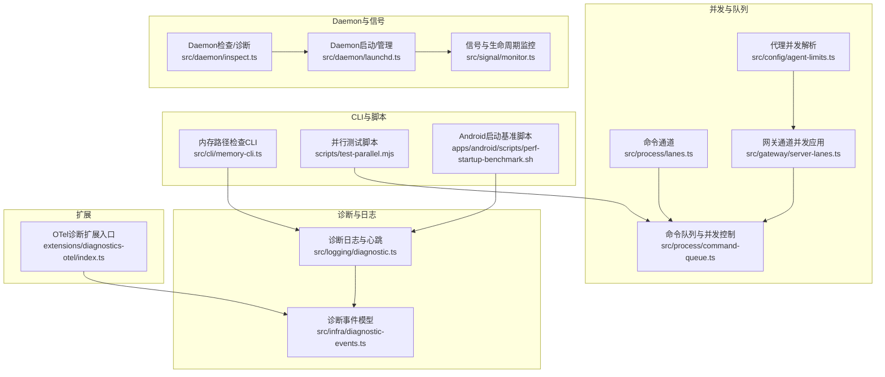
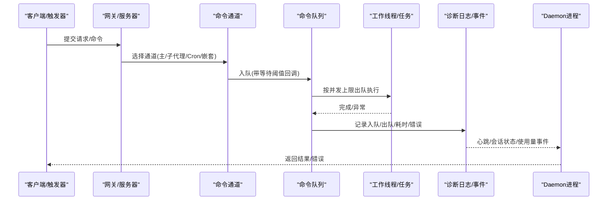
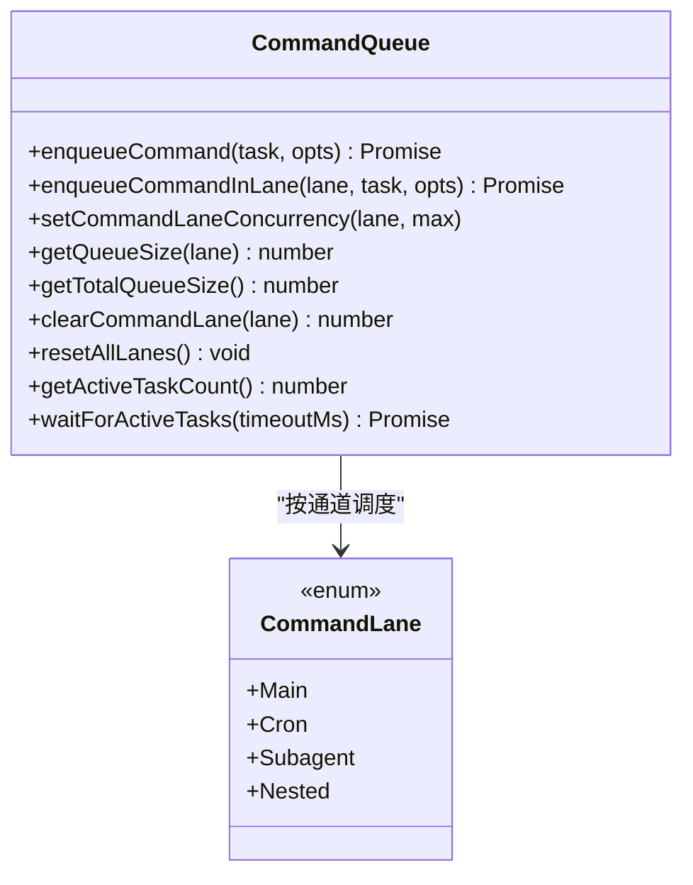
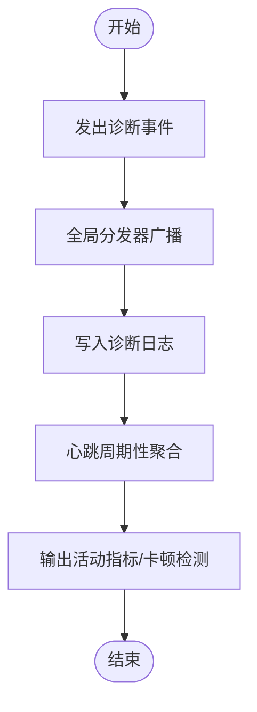
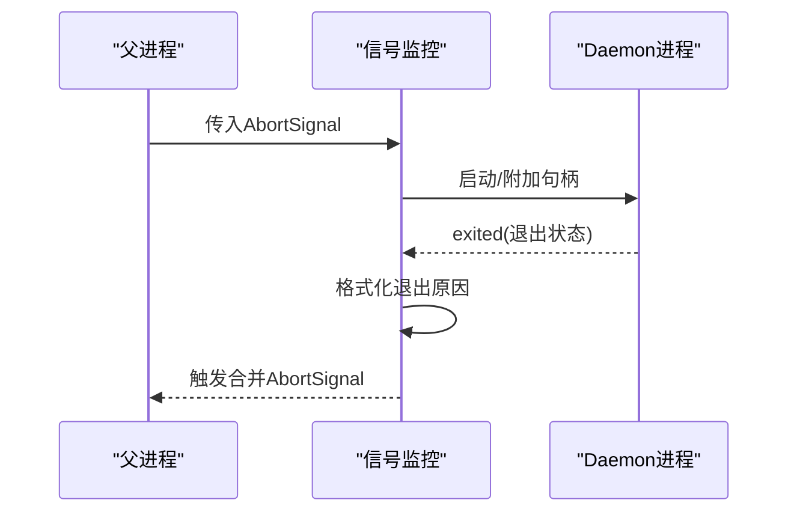
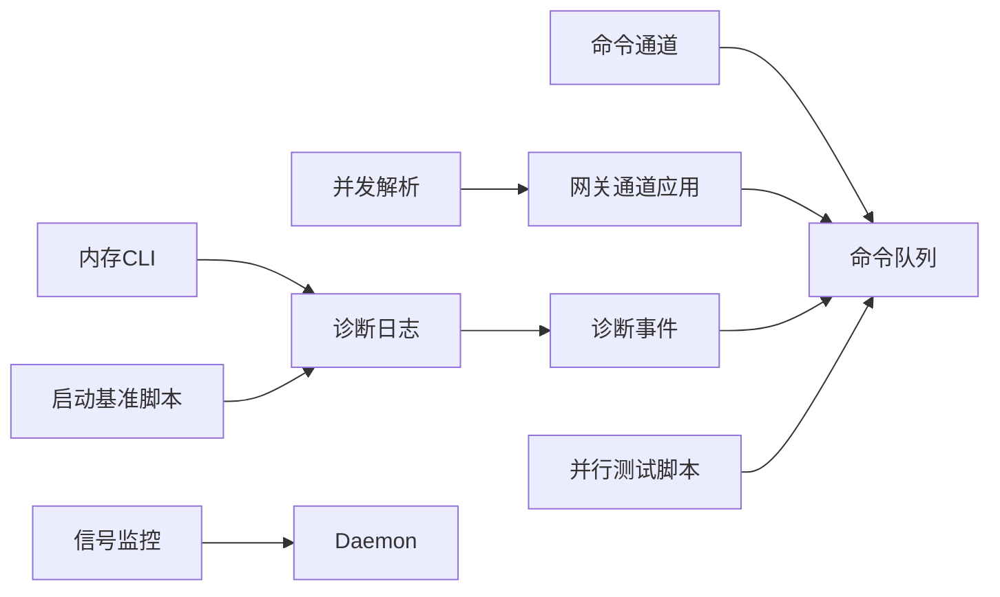

# 性能分析

<cite>
**本文引用的文件**
- [src/process/command-queue.ts](file://src/process/command-queue.ts)
- [src/process/lanes.ts](file://src/process/lanes.ts)
- [src/gateway/server-lanes.ts](file://src/gateway/server-lanes.ts)
- [src/config/agent-limits.ts](file://src/config/agent-limits.ts)
- [src/logging/diagnostic.ts](file://src/logging/diagnostic.ts)
- [src/infra/diagnostic-events.ts](file://src/infra/diagnostic-events.ts)
- [src/daemon/launchd.ts](file://src/daemon/launchd.ts)
- [src/daemon/inspect.ts](file://src/daemon/inspect.ts)
- [src/signal/monitor.ts](file://src/signal/monitor.ts)
- [src/cli/memory-cli.ts](file://src/cli/memory-cli.ts)
- [scripts/test-parallel.mjs](file://scripts/test-parallel.mjs)
- [apps/android/scripts/perf-startup-benchmark.sh](file://apps/android/scripts/perf-startup-benchmark.sh)
- [extensions/diagnostics-otel/index.ts](file://extensions/diagnostics-otel/index.ts)
</cite>

## 目录

1. [简介](#简介)
2. [项目结构](#项目结构)
3. [核心组件](#核心组件)
4. [架构总览](#架构总览)
5. [详细组件分析](#详细组件分析)
6. [依赖关系分析](#依赖关系分析)
7. [性能考量](#性能考量)
8. [故障排查指南](#故障排查指南)
9. [结论](#结论)
10. [附录](#附录)

## 简介

本指南面向OpenClaw的性能分析与优化，聚焦以下目标：

- 性能监控指标与资源使用追踪（CPU、内存、磁盘I/O、网络）
- 性能瓶颈识别、内存泄漏检测、进程监控与管理
- 性能测试工具、基准测试与负载测试策略
- Daemon进程性能优化、系统资源限制配置、并发处理调优
- 性能问题诊断流程、性能回归检测、生产环境监控最佳实践

## 项目结构

OpenClaw在进程调度、并发控制、诊断事件与日志、Daemon生命周期管理等方面提供了完善的基础设施，便于进行系统级性能分析与优化。

**图表来源**

- [src/process/lanes.ts](file://src/process/lanes.ts#L1-L7)
- [src/process/command-queue.ts](file://src/process/command-queue.ts#L1-L325)
- [src/gateway/server-lanes.ts](file://src/gateway/server-lanes.ts#L1-L11)
- [src/config/agent-limits.ts](file://src/config/agent-limits.ts#L1-L23)
- [src/logging/diagnostic.ts](file://src/logging/diagnostic.ts#L1-L400)
- [src/infra/diagnostic-events.ts](file://src/infra/diagnostic-events.ts#L1-L243)
- [src/daemon/launchd.ts](file://src/daemon/launchd.ts)
- [src/daemon/inspect.ts](file://src/daemon/inspect.ts)
- [src/signal/monitor.ts](file://src/signal/monitor.ts#L97-L131)
- [src/cli/memory-cli.ts](file://src/cli/memory-cli.ts#L167-L205)
- [scripts/test-parallel.mjs](file://scripts/test-parallel.mjs#L208-L243)
- [apps/android/scripts/perf-startup-benchmark.sh](file://apps/android/scripts/perf-startup-benchmark.sh#L115-L124)
- [extensions/diagnostics-otel/index.ts](file://extensions/diagnostics-otel/index.ts)

**章节来源**

- [src/process/lanes.ts](file://src/process/lanes.ts#L1-L7)
- [src/process/command-queue.ts](file://src/process/command-queue.ts#L1-L325)
- [src/gateway/server-lanes.ts](file://src/gateway/server-lanes.ts#L1-L11)
- [src/config/agent-limits.ts](file://src/config/agent-limits.ts#L1-L23)
- [src/logging/diagnostic.ts](file://src/logging/diagnostic.ts#L1-L400)
- [src/infra/diagnostic-events.ts](file://src/infra/diagnostic-events.ts#L1-L243)
- [src/daemon/launchd.ts](file://src/daemon/launchd.ts)
- [src/daemon/inspect.ts](file://src/daemon/inspect.ts)
- [src/signal/monitor.ts](file://src/signal/monitor.ts#L97-L131)
- [src/cli/memory-cli.ts](file://src/cli/memory-cli.ts#L167-L205)
- [scripts/test-parallel.mjs](file://scripts/test-parallel.mjs#L208-L243)
- [apps/android/scripts/perf-startup-benchmark.sh](file://apps/android/scripts/perf-startup-benchmark.sh#L115-L124)
- [extensions/diagnostics-otel/index.ts](file://extensions/diagnostics-otel/index.ts)

## 核心组件

- 命令通道与队列：通过多通道隔离与并发上限控制，实现任务排队、等待时间统计与错误传播。
- 诊断事件与日志：统一的诊断事件模型与心跳机制，支持运行时状态观测与性能指标聚合。
- Daemon生命周期与信号：提供Daemon启动、停止、退出原因记录与中止信号合并，便于进程级性能监控。
- CLI与脚本：内存路径检查、并行测试负载感知、移动端启动基准脚本，支撑端到端性能验证。

**章节来源**

- [src/process/command-queue.ts](file://src/process/command-queue.ts#L1-L325)
- [src/logging/diagnostic.ts](file://src/logging/diagnostic.ts#L1-L400)
- [src/daemon/launchd.ts](file://src/daemon/launchd.ts)
- [src/signal/monitor.ts](file://src/signal/monitor.ts#L97-L131)
- [src/cli/memory-cli.ts](file://src/cli/memory-cli.ts#L167-L205)
- [scripts/test-parallel.mjs](file://scripts/test-parallel.mjs#L208-L243)
- [apps/android/scripts/perf-startup-benchmark.sh](file://apps/android/scripts/perf-startup-benchmark.sh#L115-L124)

## 架构总览

OpenClaw的性能分析围绕“通道隔离 + 并发控制 + 诊断事件 + 日志心跳 + Daemon监控”展开，形成从任务执行到可观测性的闭环。

**图表来源**

- [src/process/command-queue.ts](file://src/process/command-queue.ts#L161-L197)
- [src/process/lanes.ts](file://src/process/lanes.ts#L1-L7)
- [src/logging/diagnostic.ts](file://src/logging/diagnostic.ts#L222-L241)
- [src/daemon/launchd.ts](file://src/daemon/launchd.ts)

## 详细组件分析

### 并发与队列组件（CommandLane/CommandQueue）

- 多通道隔离：主通道用于核心自动回复流程，子代理通道用于深度扩展，Cron通道用于定时任务，嵌套通道用于复杂场景。
- 并发上限：可通过配置动态设置各通道最大并发数；队列按通道维护，避免不同通道间相互阻塞。
- 等待与告警：入队时记录等待时间，超过阈值触发告警；出队时记录等待时长与队列长度。
- 错误传播：提供专用错误类型，区分“通道清空”和“网关重启排水”两类拒绝场景，便于上层处理。
- 运行时重置：支持在进程内重启后清理挂起任务集合，保留待执行队列，确保重启后尽快恢复。

**图表来源**

- [src/process/lanes.ts](file://src/process/lanes.ts#L1-L7)
- [src/process/command-queue.ts](file://src/process/command-queue.ts#L154-L324)

**章节来源**

- [src/process/lanes.ts](file://src/process/lanes.ts#L1-L7)
- [src/process/command-queue.ts](file://src/process/command-queue.ts#L1-L325)
- [src/gateway/server-lanes.ts](file://src/gateway/server-lanes.ts#L1-L11)
- [src/config/agent-limits.ts](file://src/config/agent-limits.ts#L1-L23)

### 诊断事件与日志（Diagnostic Events & Heartbeat）

- 统一事件模型：涵盖Webhook收发、消息处理、会话状态、队列等待、运行尝试、心跳等。
- 心跳与会话状态：周期性输出活动指标（接收/处理/错误、活跃/等待/排队数量），并检测长时间无活动或卡住的会话。
- 事件分发：全局事件分发器，带递归保护与监听器失败忽略，保证诊断系统自身稳定性。
- 与队列联动：入队/出队事件与等待时长、队列长度联动，便于定位瓶颈。

**图表来源**

- [src/infra/diagnostic-events.ts](file://src/infra/diagnostic-events.ts#L195-L235)
- [src/logging/diagnostic.ts](file://src/logging/diagnostic.ts#L308-L376)

**章节来源**

- [src/infra/diagnostic-events.ts](file://src/infra/diagnostic-events.ts#L1-L243)
- [src/logging/diagnostic.ts](file://src/logging/diagnostic.ts#L1-L400)

### Daemon 生命周期与信号监控

- 合并中止信号：将外部传入的中止信号与内部Daemon退出信号合并，避免竞态导致的孤儿进程。
- 退出原因格式化：记录Daemon退出状态，便于后续诊断。
- 与信号监控集成：在非正常退出时触发中止，保障上层可观测性。

**图表来源**

- [src/signal/monitor.ts](file://src/signal/monitor.ts#L97-L127)

**章节来源**

- [src/signal/monitor.ts](file://src/signal/monitor.ts#L97-L131)
- [src/daemon/launchd.ts](file://src/daemon/launchd.ts)
- [src/daemon/inspect.ts](file://src/daemon/inspect.ts)

### 内存路径与资源可用性检查（CLI）

- 额外内存路径校验：对额外内存路径进行可读性检查，收集缺失/不可访问等问题，辅助定位资源瓶颈。
- 内存目录可访问性：检查内存目录是否可读，记录缺失或权限问题。

**章节来源**

- [src/cli/memory-cli.ts](file://src/cli/memory-cli.ts#L167-L205)

### 并行测试与负载感知（脚本）

- 负载感知并行：根据主机CPU负载动态调整本地工作线程数，极端高负载下降低并发，避免系统过载。
- 测试配置：支持低/串行/最大三种测试配置，分别控制单元、扩展、网关等模块的并发预算。

**章节来源**

- [scripts/test-parallel.mjs](file://scripts/test-parallel.mjs#L208-L243)

### 移动端启动基准（脚本）

- 基线对比：计算冷启动时间的中位数差异与百分比变化，支持回归检测与基线对比。

**章节来源**

- [apps/android/scripts/perf-startup-benchmark.sh](file://apps/android/scripts/perf-startup-benchmark.sh#L115-L124)

## 依赖关系分析

- 通道与队列：命令通道枚举驱动队列实现，网关侧负责将配置映射到通道并发上限。
- 诊断事件：诊断日志模块依赖事件模型，心跳周期性触发会话状态修剪与卡顿检测。
- Daemon：信号监控与Daemon生命周期紧密耦合，确保退出与中止的一致性。
- CLI与脚本：CLI用于资源可用性前置检查，脚本用于负载与基准测试，二者共同支撑端到端性能验证。

**图表来源**

- [src/process/lanes.ts](file://src/process/lanes.ts#L1-L7)
- [src/process/command-queue.ts](file://src/process/command-queue.ts#L154-L324)
- [src/gateway/server-lanes.ts](file://src/gateway/server-lanes.ts#L6-L10)
- [src/config/agent-limits.ts](file://src/config/agent-limits.ts#L8-L22)
- [src/logging/diagnostic.ts](file://src/logging/diagnostic.ts#L308-L376)
- [src/infra/diagnostic-events.ts](file://src/infra/diagnostic-events.ts#L195-L235)
- [src/signal/monitor.ts](file://src/signal/monitor.ts#L97-L127)
- [src/daemon/launchd.ts](file://src/daemon/launchd.ts)
- [src/cli/memory-cli.ts](file://src/cli/memory-cli.ts#L167-L205)
- [scripts/test-parallel.mjs](file://scripts/test-parallel.mjs#L208-L243)
- [apps/android/scripts/perf-startup-benchmark.sh](file://apps/android/scripts/perf-startup-benchmark.sh#L115-L124)

**章节来源**

- [src/process/command-queue.ts](file://src/process/command-queue.ts#L1-L325)
- [src/logging/diagnostic.ts](file://src/logging/diagnostic.ts#L1-L400)
- [src/infra/diagnostic-events.ts](file://src/infra/diagnostic-events.ts#L1-L243)
- [src/signal/monitor.ts](file://src/signal/monitor.ts#L97-L131)
- [src/daemon/launchd.ts](file://src/daemon/launchd.ts)
- [src/cli/memory-cli.ts](file://src/cli/memory-cli.ts#L167-L205)
- [scripts/test-parallel.mjs](file://scripts/test-parallel.mjs#L208-L243)
- [apps/android/scripts/perf-startup-benchmark.sh](file://apps/android/scripts/perf-startup-benchmark.sh#L115-L124)

## 性能考量

- 并发与通道隔离
  - 使用通道隔离避免主流程与后台任务互相干扰；通过配置调整各通道并发上限，平衡吞吐与稳定性。
  - 动态设置并发上限后立即触发泵出逻辑，确保新限速生效。
- 等待与排队
  - 入队时记录等待时间与队列长度，超过阈值触发告警；结合诊断事件可定位瓶颈。
  - 获取总队列大小与活跃任务数，用于运行时负载评估。
- 运行时重启与清理
  - 在进程内重启场景下，重置通道生成代数并清理活跃任务集合，保留队列以尽快恢复。
- 资源可用性
  - 使用内存CLI检查内存目录与额外路径的可读性，提前发现资源瓶颈。
- 负载感知测试
  - 根据系统负载动态调整测试并发，避免在高负载下放大性能问题。
- 基准测试
  - 移动端启动基准脚本提供冷启动时间的量化指标，便于回归检测。

**章节来源**

- [src/process/command-queue.ts](file://src/process/command-queue.ts#L154-L324)
- [src/gateway/server-lanes.ts](file://src/gateway/server-lanes.ts#L6-L10)
- [src/config/agent-limits.ts](file://src/config/agent-limits.ts#L8-L22)
- [src/logging/diagnostic.ts](file://src/logging/diagnostic.ts#L222-L241)
- [src/cli/memory-cli.ts](file://src/cli/memory-cli.ts#L167-L205)
- [scripts/test-parallel.mjs](file://scripts/test-parallel.mjs#L208-L243)
- [apps/android/scripts/perf-startup-benchmark.sh](file://apps/android/scripts/perf-startup-benchmark.sh#L115-L124)

## 故障排查指南

- 诊断事件与心跳
  - 关注“队列等待超时”“消息处理错误”“会话卡顿”等事件，结合心跳输出的活跃/等待/排队数量定位瓶颈。
  - 若长时间无活动但仍有排队，需检查上游触发或下游处理是否阻塞。
- Daemon退出与中止
  - 使用信号监控合并AbortSignal，记录Daemon退出原因，快速判断异常退出场景。
  - 结合Daemon启动/检查模块，确认进程状态与资源占用。
- 内存路径问题
  - 使用内存CLI检查内存目录与额外路径的可读性，修复缺失或权限问题。
- 并发与队列异常
  - 若出现大量排队且等待时间过长，考虑提升通道并发上限或拆分通道。
  - 发生“网关排水”错误时，表示正在重启，新任务会被拒绝，需等待重启完成。

**章节来源**

- [src/logging/diagnostic.ts](file://src/logging/diagnostic.ts#L308-L376)
- [src/signal/monitor.ts](file://src/signal/monitor.ts#L97-L131)
- [src/daemon/launchd.ts](file://src/daemon/launchd.ts)
- [src/daemon/inspect.ts](file://src/daemon/inspect.ts)
- [src/cli/memory-cli.ts](file://src/cli/memory-cli.ts#L167-L205)
- [src/process/command-queue.ts](file://src/process/command-queue.ts#L169-L171)

## 结论

OpenClaw通过通道隔离、并发控制、统一诊断事件与心跳、Daemon生命周期管理以及CLI/脚本工具，构建了完整的性能分析与优化体系。建议在生产环境中：

- 开启诊断事件与心跳，持续观察队列等待、消息处理与会话状态；
- 合理设置通道并发上限，结合负载感知测试与移动端基准脚本进行回归验证；
- 使用内存CLI与Daemon监控工具定期检查资源可用性与进程健康；
- 在进程内重启或系统高负载场景下，利用队列重置与告警机制快速恢复与定位问题。

## 附录

- 与OTel诊断扩展的集成入口位于扩展模块，可用于接入外部可观测性平台，进一步丰富性能数据采集维度。

**章节来源**

- [extensions/diagnostics-otel/index.ts](file://extensions/diagnostics-otel/index.ts)
