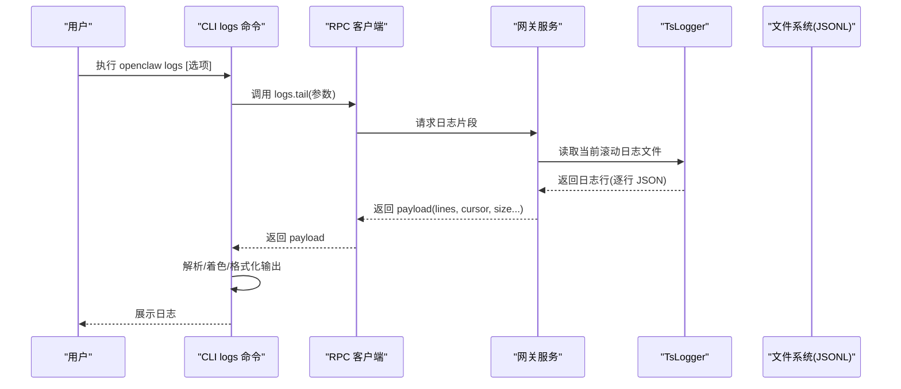
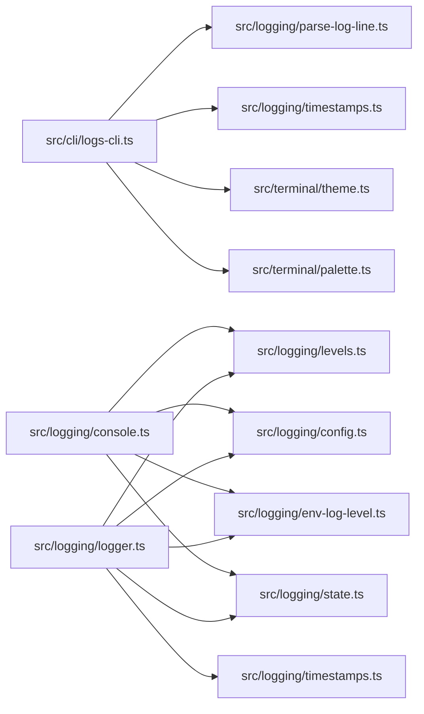
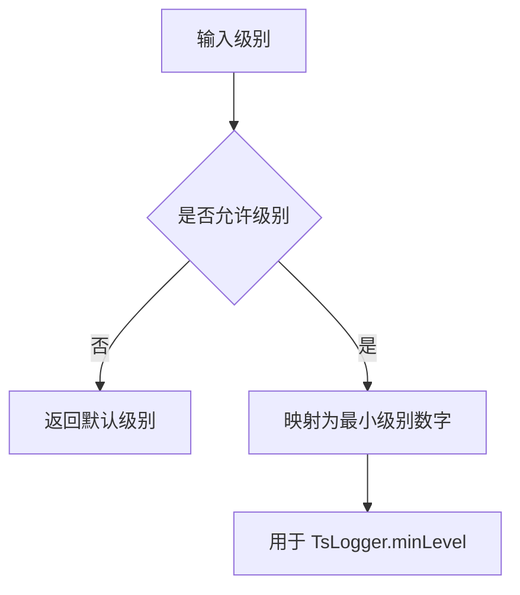

# 日志系统

<cite>
**本文引用的文件**
- [docs/logging.md](file://docs/logging.md)
- [docs/cli/logs.md](file://docs/cli/logs.md)
- [src/logging/levels.ts](file://src/logging/levels.ts)
- [src/logging/logger.ts](file://src/logging/logger.ts)
- [src/logging/config.ts](file://src/logging/config.ts)
- [src/logging/console.ts](file://src/logging/console.ts)
- [src/logging/parse-log-line.ts](file://src/logging/parse-log-line.ts)
- [src/logging/timestamps.ts](file://src/logging/timestamps.ts)
- [src/logging/redact.ts](file://src/logging/redact.ts)
- [src/logging/env-log-level.ts](file://src/logging/env-log-level.ts)
- [src/logging/state.ts](file://src/logging/state.ts)
- [src/cli/logs-cli.ts](file://src/cli/logs-cli.ts)
- [src/terminal/theme.ts](file://src/terminal/theme.ts)
- [src/terminal/palette.ts](file://src/terminal/palette.ts)
</cite>

## 目录

1. [简介](#简介)
2. [项目结构](#项目结构)
3. [核心组件](#核心组件)
4. [架构总览](#架构总览)
5. [组件详解](#组件详解)
6. [依赖关系分析](#依赖关系分析)
7. [性能考量](#性能考量)
8. [故障排除指南](#故障排除指南)
9. [结论](#结论)
10. [附录](#附录)

## 简介

本文件面向使用者与维护者，系统性阐述 OpenClaw 的日志系统：日志来源与位置、日志级别、日志格式、CLI 日志命令用法、日志解析与时间戳格式化、颜色主题系统、日志分析与过滤、日志轮转与大小限制、以及常见问题排查。目标是帮助你在不同运行场景（本地终端、远程 RPC、Web 控制界面）下高效定位问题并进行日志分析。

## 项目结构

日志系统由“文件日志（JSONL）+ 控制台输出 + CLI 尾随 + 可选 OTLP 导出”构成。核心实现位于 src/logging 与 src/cli，文档位于 docs。

```mermaid
graph TB
subgraph "日志源"
GW["网关进程"]
EXT["外部传输(可选)"]
end
subgraph "日志写入"
L["TsLogger 实例"]
FS["文件系统(JSONL)"]
CON["控制台输出"]
end
subgraph "CLI"
CLI["logs 命令"]
RPC["RPC 调用 logs.tail"]
end
GW --> L
L --> FS
L --> CON
L --> EXT
CLI --> RPC --> GW
```

图表来源

- [src/logging/logger.ts](file://src/logging/logger.ts#L100-L149)
- [src/cli/logs-cli.ts](file://src/cli/logs-cli.ts#L45-L62)

章节来源

- [docs/logging.md](file://docs/logging.md#L10-L96)
- [docs/cli/logs.md](file://docs/cli/logs.md#L9-L29)

## 核心组件

- 日志级别与解析：支持 silent/fatal/error/warn/info/debug/trace，并提供解析与归一化。
- 文件日志：默认滚动到每日文件，支持最大文件字节限制与过期清理。
- 控制台输出：TTY 自适应、样式（pretty/compact/json）、时间戳前缀、子系统过滤、敏感信息脱敏。
- CLI 日志尾随：通过 RPC 远程拉取日志，支持 JSON/纯文本、颜色、本地时区显示、跟随模式等。
- 解析与格式化：按行解析 JSONL，提取时间、级别、子系统、模块、消息；时间戳支持 ISO 与本地偏移。
- 颜色主题：基于 CLI 调色板，按级别映射颜色。
- 环境变量与配置：OPENCLAW_LOG_LEVEL 覆盖配置；日志级别、样式、脱敏策略均可配置。

章节来源

- [src/logging/levels.ts](file://src/logging/levels.ts#L1-L38)
- [src/logging/logger.ts](file://src/logging/logger.ts#L13-L38)
- [src/logging/console.ts](file://src/logging/console.ts#L13-L95)
- [src/cli/logs-cli.ts](file://src/cli/logs-cli.ts#L22-L35)
- [src/logging/parse-log-line.ts](file://src/logging/parse-log-line.ts#L41-L63)
- [src/logging/timestamps.ts](file://src/logging/timestamps.ts#L1-L15)
- [src/terminal/theme.ts](file://src/terminal/theme.ts#L13-L31)

## 架构总览

下面以代码级视角展示日志系统的关键交互：



图表来源

- [src/cli/logs-cli.ts](file://src/cli/logs-cli.ts#L45-L62)
- [src/logging/logger.ts](file://src/logging/logger.ts#L100-L149)

章节来源

- [src/cli/logs-cli.ts](file://src/cli/logs-cli.ts#L198-L329)
- [src/logging/logger.ts](file://src/logging/logger.ts#L175-L184)

## 组件详解

### 日志级别与配置

- 支持级别：silent < fatal < error < warn < info < debug < trace（数值越小越严格）。
- 归一化与解析：提供解析器与默认值，确保非法值被忽略并给出提示。
- 环境变量覆盖：OPENCLAW_LOG_LEVEL 可临时提升或降低级别。
- 配置来源：优先 ~/.openclaw/openclaw.json 中 logging.\* 字段，未设置时采用默认行为。

章节来源

- [src/logging/levels.ts](file://src/logging/levels.ts#L1-L38)
- [src/logging/env-log-level.ts](file://src/logging/env-log-level.ts#L4-L23)
- [src/logging/config.ts](file://src/logging/config.ts#L8-L24)
- [docs/logging.md](file://docs/logging.md#L116-L124)

### 文件日志与滚动

- 默认滚动路径：/tmp/openclaw/openclaw-YYYY-MM-DD.log（按主机本地时区命名）。
- 滚动清理：保留最多 24 小时内的滚动文件，到期自动删除。
- 大小限制：默认 500MB，超过后抑制写入并向 stderr 输出警告。
- 写入策略：逐条 JSONL 追加，失败不阻塞。

章节来源

- [src/logging/logger.ts](file://src/logging/logger.ts#L13-L19)
- [src/logging/logger.ts](file://src/logging/logger.ts#L270-L273)
- [src/logging/logger.ts](file://src/logging/logger.ts#L284-L308)
- [src/logging/logger.ts](file://src/logging/logger.ts#L151-L156)
- [src/logging/logger.ts](file://src/logging/logger.ts#L121-L136)

### 控制台输出与样式

- TTY 自适应：TTY 会启用美化输出，非 TTY 使用紧凑模式。
- 样式类型：pretty（带时间戳与颜色）、compact（紧凑）、json（每行 JSON）。
- 时间戳前缀：可选择在控制台输出前添加本地时间戳。
- 子系统过滤：仅输出匹配前缀的子系统日志。
- 敏感信息脱敏：根据配置对工具摘要与自定义正则进行脱敏。

章节来源

- [src/logging/console.ts](file://src/logging/console.ts#L50-L58)
- [src/logging/console.ts](file://src/logging/console.ts#L116-L126)
- [src/logging/console.ts](file://src/logging/console.ts#L157-L166)
- [src/logging/redact.ts](file://src/logging/redact.ts#L107-L123)
- [docs/logging.md](file://docs/logging.md#L125-L141)

### CLI 日志命令（logs tail）

- 主要用途：通过 RPC 远程“尾随”网关日志文件，无需 SSH。
- 关键选项
  - --limit：一次性返回的最大行数，默认 200
  - --max-bytes：单次读取的最大字节数，默认 250000
  - --follow：持续轮询更新
  - --interval：轮询间隔（毫秒），默认 1000
  - --json：输出 JSON 行（type: meta/log/raw/notice/error）
  - --plain：强制纯文本（即使在 TTY）
  - --no-color：禁用 ANSI 颜色
  - --local-time：以本地时区显示时间戳
  - --url/--token/--timeout：RPC 连接参数
- 输出行为
  - TTY：美化输出（时间戳、级别颜色、子系统标签）
  - 非 TTY 或 --plain：纯文本
  - --json：输出结构化对象流
  - 遇到网关不可达：输出错误提示与 doctor 建议

章节来源

- [src/cli/logs-cli.ts](file://src/cli/logs-cli.ts#L198-L214)
- [src/cli/logs-cli.ts](file://src/cli/logs-cli.ts#L218-L329)
- [docs/cli/logs.md](file://docs/cli/logs.md#L17-L29)

### 日志解析与时间戳格式化

- 行解析：从 JSONL 中提取 time、level、subsystem/module、message，并保留原始行用于回退。
- 时间戳格式：支持 ISO 与本地时区偏移字符串；TTY 美化模式下截取 HH:MM:SS。
- 颜色映射：按级别映射到主题色（info/normal、warn、error/fatal、debug/trace 较弱）。

章节来源

- [src/logging/parse-log-line.ts](file://src/logging/parse-log-line.ts#L41-L63)
- [src/cli/logs-cli.ts](file://src/cli/logs-cli.ts#L64-L87)
- [src/logging/timestamps.ts](file://src/logging/timestamps.ts#L1-L15)
- [src/terminal/theme.ts](file://src/terminal/theme.ts#L13-L31)

### 颜色主题系统

- 基于 CLI 调色板（lobster），定义强调色、信息色、警告色、错误色、柔和色等。
- 是否彩色取决于终端能力与 NO_COLOR/FORCE_COLOR 环境变量。
- 着色函数仅在 rich 模式下生效。

章节来源

- [src/terminal/palette.ts](file://src/terminal/palette.ts#L3-L12)
- [src/terminal/theme.ts](file://src/terminal/theme.ts#L9-L31)

### 日志分析技巧与过滤

- 使用 --json 获取结构化事件，便于管道处理与可视化。
- 使用 --local-time 在本地时区下阅读时间戳，减少换算成本。
- 使用 --limit 与 --max-bytes 控制单次数据量，避免内存压力。
- 使用 --follow 结合 --interval 实现近实时观测。
- 使用子系统过滤（控制台侧）聚焦特定模块（如 gateway/channels/whatsapp）。
- 使用环境变量 OPENCLAW_LOG_LEVEL 临时提升级别，快速复现问题。

章节来源

- [src/cli/logs-cli.ts](file://src/cli/logs-cli.ts#L202-L209)
- [src/logging/console.ts](file://src/logging/console.ts#L107-L126)
- [src/logging/env-log-level.ts](file://src/logging/env-log-level.ts#L4-L23)

### 日志轮转与大小限制

- 滚动文件命名：openclaw-YYYY-MM-DD.log，按天滚动。
- 最大文件大小：默认 500MB，超限后抑制写入并输出警告。
- 过期清理：保留最近 24 小时内的滚动文件，其余删除。
- 当前文件大小统计：每次写入前计算，确保准确控制。

章节来源

- [src/logging/logger.ts](file://src/logging/logger.ts#L18-L19)
- [src/logging/logger.ts](file://src/logging/logger.ts#L151-L156)
- [src/logging/logger.ts](file://src/logging/logger.ts#L284-L308)

## 依赖关系分析



图表来源

- [src/cli/logs-cli.ts](file://src/cli/logs-cli.ts#L1-L12)
- [src/logging/console.ts](file://src/logging/console.ts#L1-L12)
- [src/logging/logger.ts](file://src/logging/logger.ts#L1-L12)

章节来源

- [src/logging/levels.ts](file://src/logging/levels.ts#L1-L11)
- [src/logging/logger.ts](file://src/logging/logger.ts#L1-L12)
- [src/logging/console.ts](file://src/logging/console.ts#L1-L12)

## 性能考量

- I/O 抑制：当达到文件大小上限时，系统会抑制写入并输出一次警告，避免磁盘写满与崩溃。
- 滚动清理：定期清理旧滚动文件，控制磁盘占用。
- CLI 轮询：--follow 模式下可通过 --interval 调整轮询频率，平衡实时性与资源消耗。
- JSONL 解析：逐行解析，复杂度 O(n)，适合长连接流式消费。
- 控制台输出：在 TTY 下启用美化与颜色，非 TTY 切换紧凑模式，减少冗余字符。

章节来源

- [src/logging/logger.ts](file://src/logging/logger.ts#L121-L136)
- [src/logging/logger.ts](file://src/logging/logger.ts#L284-L308)
- [src/cli/logs-cli.ts](file://src/cli/logs-cli.ts#L220-L226)

## 故障排除指南

- 网关不可达
  - 现象：CLI 提示“Gateway not reachable”，并建议运行 doctor。
  - 排查：确认网关已启动且网络可达；检查 --url/--token/--timeout 参数。
- 日志为空
  - 现象：无输出或仅提示截断。
  - 排查：确认网关正在写入 logging.file 指定路径；适当提高 --max-bytes；确认级别未设为 silent。
- 截断提示
  - 现象：输出包含“Log tail truncated”提示。
  - 排查：增大 --max-bytes；缩短 --limit；或分多次拉取。
- 旋转重置
  - 现象：输出包含“Log cursor reset (file rotated)”提示。
  - 排查：这是正常滚动行为；继续跟随即可。
- 颜色异常
  - 现象：终端无颜色或颜色异常。
  - 排查：检查 NO_COLOR/FORCE_COLOR 环境变量；使用 --no-color 强制关闭。
- 时区显示
  - 现象：时间戳不符合预期。
  - 排查：使用 --local-time 以本地时区显示；TTY 美化模式下仅显示 HH:MM:SS。
- 级别无效
  - 现象：环境变量 OPENCLAW_LOG_LEVEL 无效值会被忽略并打印提示。
  - 排查：确保使用允许的级别之一（silent/fatal/error/warn/info/debug/trace）。

章节来源

- [src/cli/logs-cli.ts](file://src/cli/logs-cli.ts#L158-L196)
- [src/cli/logs-cli.ts](file://src/cli/logs-cli.ts#L265-L284)
- [src/logging/env-log-level.ts](file://src/logging/env-log-level.ts#L16-L23)
- [docs/logging.md](file://docs/logging.md#L347-L353)

## 结论

OpenClaw 的日志体系以 JSONL 文件为核心，结合 CLI 远程尾随、TTY 自适应美化输出、子系统过滤与敏感信息脱敏，形成一套可运维、可观测、可扩展的日志方案。通过合理配置日志级别、样式与大小限制，并配合 CLI 的多种输出模式，可在开发调试与生产排障中高效定位问题。

## 附录

### 日志级别与最小级别映射



图表来源

- [src/logging/levels.ts](file://src/logging/levels.ts#L25-L37)

章节来源

- [src/logging/levels.ts](file://src/logging/levels.ts#L25-L37)
