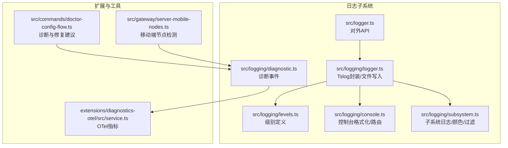
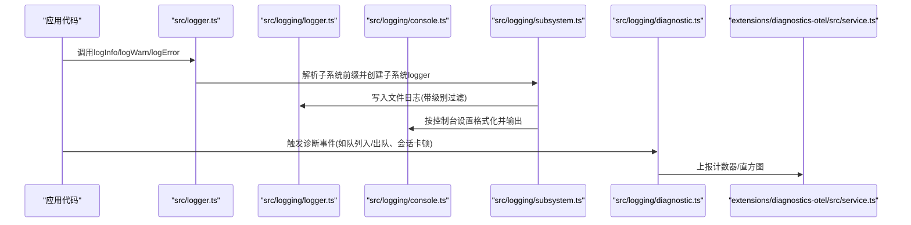
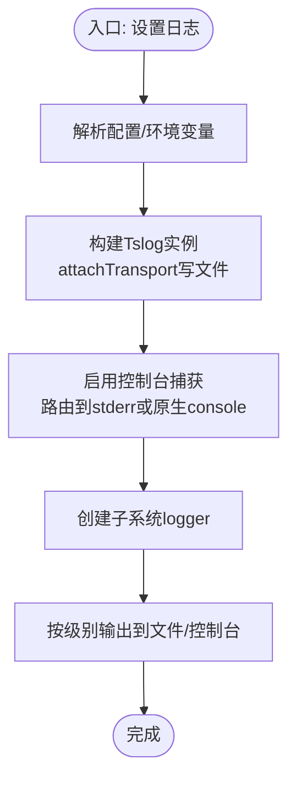
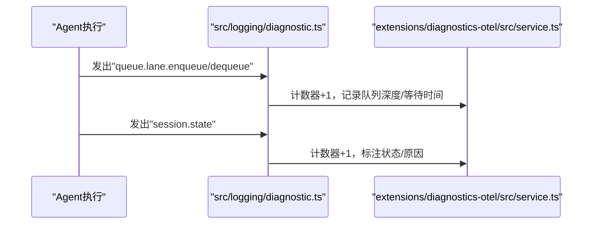
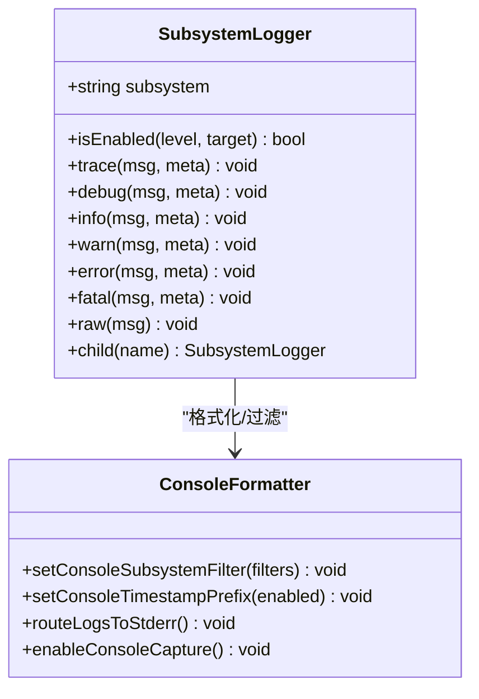
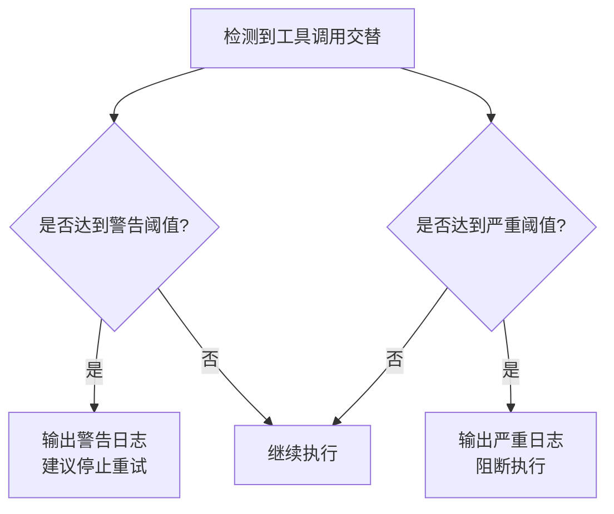
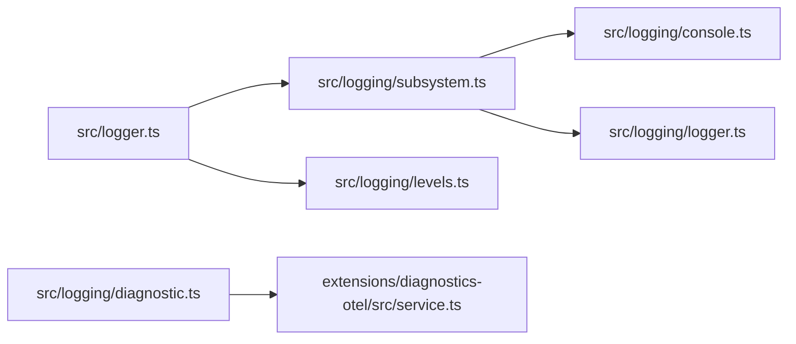

# 调试与性能分析

<cite>
**本文引用的文件**
- [src/logging.ts](file://src/logging.ts)
- [src/logger.ts](file://src/logger.ts)
- [src/logging/logger.ts](file://src/logging/logger.ts)
- [src/logging/levels.ts](file://src/logging/levels.ts)
- [src/logging/console.ts](file://src/logging/console.ts)
- [src/logging/subsystem.ts](file://src/logging/subsystem.ts)
- [src/logging/diagnostic.ts](file://src/logging/diagnostic.ts)
- [extensions/diagnostics-otel/src/service.ts](file://extensions/diagnostics-otel/src/service.ts)
- [src/agents/tool-loop-detection.ts](file://src/agents/tool-loop-detection.ts)
- [src/commands/doctor-config-flow.ts](file://src/commands/doctor-config-flow.ts)
- [src/gateway/server-mobile-nodes.ts](file://src/gateway/server-mobile-nodes.ts)
- [scripts/clawlog.sh](file://scripts/clawlog.sh)
</cite>

## 目录

1. [简介](#简介)
2. [项目结构](#项目结构)
3. [核心组件](#核心组件)
4. [架构总览](#架构总览)
5. [详细组件分析](#详细组件分析)
6. [依赖关系分析](#依赖关系分析)
7. [性能考量](#性能考量)
8. [故障排查指南](#故障排查指南)
9. [结论](#结论)
10. [附录](#附录)

## 简介

本指南面向OpenClaw项目的开发者与运维人员，提供从日志系统到性能分析、从单机调试到分布式排查的完整调试与性能分析方法。内容覆盖：

- 日志系统使用、日志级别配置与日志分析技巧
- 调试工具使用：Node.js调试器、浏览器开发者工具、移动端调试
- 性能分析方法、内存泄漏检测、CPU瓶颈定位
- 分布式系统调试、跨平台问题排查、网络问题诊断
- 生产环境调试技巧、错误追踪、监控告警配置
- 常见问题的调试案例与解决方案

## 项目结构

OpenClaw的日志与诊断能力由统一的日志模块与诊断事件模块构成，并通过扩展模块提供可观测性指标采集。关键目录与文件如下：

- 日志核心：src/logging/\*.ts（级别、控制台格式化、子系统日志、文件写入）
- 日志门面：src/logger.ts（对外API：logInfo/logWarn/logError等）
- 诊断事件：src/logging/diagnostic.ts（会话卡顿、队列入队/出队、运行尝试等）
- OTel诊断扩展：extensions/diagnostics-otel/src/service.ts（计数器/直方图上报）
- 工具与命令：src/commands/_（doctor等诊断流程）、src/gateway/_（移动端节点检测）

**图表来源**

- [src/logger.ts](file://src/logger.ts#L1-L62)
- [src/logging/logger.ts](file://src/logging/logger.ts#L1-L309)
- [src/logging/levels.ts](file://src/logging/levels.ts#L1-L38)
- [src/logging/console.ts](file://src/logging/console.ts#L1-L315)
- [src/logging/subsystem.ts](file://src/logging/subsystem.ts#L1-L374)
- [src/logging/diagnostic.ts](file://src/logging/diagnostic.ts#L204-L257)
- [extensions/diagnostics-otel/src/service.ts](file://extensions/diagnostics-otel/src/service.ts#L553-L580)
- [src/commands/doctor-config-flow.ts](file://src/commands/doctor-config-flow.ts#L1876-L1909)
- [src/gateway/server-mobile-nodes.ts](file://src/gateway/server-mobile-nodes.ts#L1-L14)

**章节来源**

- [src/logging.ts](file://src/logging.ts#L1-L70)
- [src/logger.ts](file://src/logger.ts#L1-L62)
- [src/logging/logger.ts](file://src/logging/logger.ts#L1-L309)
- [src/logging/levels.ts](file://src/logging/levels.ts#L1-L38)
- [src/logging/console.ts](file://src/logging/console.ts#L1-L315)
- [src/logging/subsystem.ts](file://src/logging/subsystem.ts#L1-L374)
- [src/logging/diagnostic.ts](file://src/logging/diagnostic.ts#L204-L257)
- [extensions/diagnostics-otel/src/service.ts](file://extensions/diagnostics-otel/src/service.ts#L553-L580)
- [src/commands/doctor-config-flow.ts](file://src/commands/doctor-config-flow.ts#L1876-L1909)
- [src/gateway/server-mobile-nodes.ts](file://src/gateway/server-mobile-nodes.ts#L1-L14)

## 核心组件

- 日志门面API：提供统一的logInfo/logWarn/logError/logDebug等接口，支持子系统前缀解析与控制台/文件双通道输出。
- 文件日志：基于Tslog封装，支持滚动日志、大小上限、外部传输、级别过滤。
- 控制台日志：可配置级别与样式（pretty/compact/json），支持时间戳前缀、子系统过滤、抑制噪声消息。
- 子系统日志：按子系统命名空间输出，自动去重前缀、着色、格式化，支持父子logger。
- 诊断事件：围绕会话状态、队列深度/等待时间、运行尝试等发出结构化事件，便于OTel采集。

**章节来源**

- [src/logger.ts](file://src/logger.ts#L17-L61)
- [src/logging/logger.ts](file://src/logging/logger.ts#L175-L184)
- [src/logging/console.ts](file://src/logging/console.ts#L88-L99)
- [src/logging/subsystem.ts](file://src/logging/subsystem.ts#L263-L350)
- [src/logging/diagnostic.ts](file://src/logging/diagnostic.ts#L204-L257)

## 架构总览

下图展示日志与诊断在系统中的交互关系：应用通过门面API写日志；文件日志负责持久化；控制台日志负责终端输出；诊断事件模块向OTel扩展上报指标。

**图表来源**

- [src/logger.ts](file://src/logger.ts#L17-L61)
- [src/logging/logger.ts](file://src/logging/logger.ts#L100-L149)
- [src/logging/console.ts](file://src/logging/console.ts#L238-L314)
- [src/logging/subsystem.ts](file://src/logging/subsystem.ts#L263-L350)
- [src/logging/diagnostic.ts](file://src/logging/diagnostic.ts#L204-L257)
- [extensions/diagnostics-otel/src/service.ts](file://extensions/diagnostics-otel/src/service.ts#L553-L580)

## 详细组件分析

### 日志系统与级别配置

- 级别与映射：支持silent/fatal/error/warn/info/debug/trace，内部映射到Tslog级别。
- 文件日志：默认滚动文件名含日期，按最大文件字节限制写入，超过阈值进行抑制并输出警告；支持外部传输注册。
- 控制台：可配置级别与样式；TTY非TTY自动降级；支持强制输出到stderr；支持子系统过滤与噪声抑制。
- 子系统：自动去除冗余前缀、按子系统哈希选择颜色、父子logger链路清晰。
- 门面API：支持“子系统:消息”前缀自动拆分，未匹配时回退到全局logger。

**图表来源**

- [src/logging/logger.ts](file://src/logging/logger.ts#L57-L80)
- [src/logging/logger.ts](file://src/logging/logger.ts#L100-L149)
- [src/logging/console.ts](file://src/logging/console.ts#L101-L118)
- [src/logging/console.ts](file://src/logging/console.ts#L191-L314)
- [src/logging/subsystem.ts](file://src/logging/subsystem.ts#L263-L350)

**章节来源**

- [src/logging/levels.ts](file://src/logging/levels.ts#L1-L38)
- [src/logging/logger.ts](file://src/logging/logger.ts#L57-L80)
- [src/logging/logger.ts](file://src/logging/logger.ts#L100-L149)
- [src/logging/console.ts](file://src/logging/console.ts#L40-L79)
- [src/logging/console.ts](file://src/logging/console.ts#L101-L118)
- [src/logging/console.ts](file://src/logging/console.ts#L191-L314)
- [src/logging/subsystem.ts](file://src/logging/subsystem.ts#L113-L178)
- [src/logger.ts](file://src/logger.ts#L8-L15)

### 诊断事件与OTel指标

- 诊断事件：记录会话卡顿、队列入队/出队、运行尝试等，便于定位瓶颈与异常。
- OTel采集：对队列深度、等待时间、会话状态变化等进行计数与直方图统计，支持敏感信息脱敏。

**图表来源**

- [src/logging/diagnostic.ts](file://src/logging/diagnostic.ts#L204-L257)
- [extensions/diagnostics-otel/src/service.ts](file://extensions/diagnostics-otel/src/service.ts#L553-L580)

**章节来源**

- [src/logging/diagnostic.ts](file://src/logging/diagnostic.ts#L204-L257)
- [extensions/diagnostics-otel/src/service.ts](file://extensions/diagnostics-otel/src/service.ts#L553-L580)

### 子系统日志与控制台格式化

- 子系统颜色与前缀：根据子系统哈希选择颜色，去除冗余前缀，适配不同渠道显示。
- 控制台样式：支持pretty/compact/json；TTY环境下美化，非TTY降级；可强制时间戳前缀。
- 抑制噪声：对特定前缀与场景（如慢监听）的消息进行抑制，避免干扰。

**图表来源**

- [src/logging/subsystem.ts](file://src/logging/subsystem.ts#L14-L35)
- [src/logging/subsystem.ts](file://src/logging/subsystem.ts#L263-L350)
- [src/logging/console.ts](file://src/logging/console.ts#L101-L118)
- [src/logging/console.ts](file://src/logging/console.ts#L191-L314)

**章节来源**

- [src/logging/subsystem.ts](file://src/logging/subsystem.ts#L113-L178)
- [src/logging/console.ts](file://src/logging/console.ts#L157-L178)
- [src/logging/console.ts](file://src/logging/console.ts#L136-L150)

### 调试工具使用

- Node.js调试器：适用于CLI/网关进程。可结合子系统过滤与控制台样式，快速定位问题。
- 浏览器开发者工具：用于Web前端与Chrome扩展相关模块，配合控制台json样式查看结构化日志。
- 移动端调试：通过移动端节点检测逻辑识别移动设备连接，结合移动端日志与网络抓包定位问题。

**章节来源**

- [src/gateway/server-mobile-nodes.ts](file://src/gateway/server-mobile-nodes.ts#L1-L14)

### 性能分析与内存泄漏检测

- CPU瓶颈定位：结合诊断事件的队列等待直方图与会话状态计数，识别热点车道与长时间阻塞。
- 内存泄漏检测：利用文件日志滚动与大小上限机制，观察异常增长；结合控制台json样式输出，提取堆栈与内存相关字段。
- 并发与队列：关注队列深度与等待时间，定位背压点与慢消费者。

**章节来源**

- [extensions/diagnostics-otel/src/service.ts](file://extensions/diagnostics-otel/src/service.ts#L553-L580)
- [src/logging/logger.ts](file://src/logging/logger.ts#L100-L149)

### 分布式系统调试与跨平台排查

- 跨平台：移动端节点检测帮助识别iOS/Android连接；控制台样式在CI/TTY环境自动降级。
- 网络问题：结合诊断事件与OTel指标，定位网络延迟、超时与重试行为；doctor命令提供安全二进制与配置修复建议。

**章节来源**

- [src/gateway/server-mobile-nodes.ts](file://src/gateway/server-mobile-nodes.ts#L1-L14)
- [src/commands/doctor-config-flow.ts](file://src/commands/doctor-config-flow.ts#L1876-L1909)

### 生产环境调试与监控告警

- 日志保留与裁剪：滚动日志按最大文件大小写入，超过阈值抑制并输出警告；定期清理过期日志。
- 外部传输：注册外部传输函数，将日志转发至集中式日志系统。
- 告警联动：OTel指标可用于Prometheus/Grafana告警规则，如队列深度阈值、会话卡顿频率等。

**章节来源**

- [src/logging/logger.ts](file://src/logging/logger.ts#L100-L149)
- [src/logging/logger.ts](file://src/logging/logger.ts#L252-L261)
- [src/logging/logger.ts](file://src/logging/logger.ts#L284-L309)

### 常见问题与调试案例

- 循环工具调用：检测到ping-pong循环时，输出严重/警告级别日志并阻断执行，防止资源浪费。
- Doctor诊断：当安全二进制缺少profile或缺少自定义safeBinProfile时，输出修复建议与命令提示。
- 会话卡顿：记录会话状态、队列深度与年龄，触发诊断事件并标记活动。

**图表来源**

- [src/agents/tool-loop-detection.ts](file://src/agents/tool-loop-detection.ts#L439-L471)

**章节来源**

- [src/agents/tool-loop-detection.ts](file://src/agents/tool-loop-detection.ts#L439-L471)
- [src/commands/doctor-config-flow.ts](file://src/commands/doctor-config-flow.ts#L1876-L1909)
- [src/logging/diagnostic.ts](file://src/logging/diagnostic.ts#L204-L220)

## 依赖关系分析

- 组件耦合：日志门面仅依赖子系统与级别模块；文件日志封装Tslog并暴露外部传输；控制台模块负责格式化与路由；诊断模块独立于具体传输，通过扩展上报。
- 外部依赖：Tslog用于结构化日志；chalk用于控制台颜色；Node内置fs/path/util/stream用于文件与流处理。
- 可能的循环依赖：日志模块采用延迟初始化与状态缓存，避免直接循环引用。

**图表来源**

- [src/logger.ts](file://src/logger.ts#L1-L62)
- [src/logging/subsystem.ts](file://src/logging/subsystem.ts#L1-L374)
- [src/logging/levels.ts](file://src/logging/levels.ts#L1-L38)
- [src/logging/console.ts](file://src/logging/console.ts#L1-L315)
- [src/logging/logger.ts](file://src/logging/logger.ts#L1-L309)
- [src/logging/diagnostic.ts](file://src/logging/diagnostic.ts#L204-L257)
- [extensions/diagnostics-otel/src/service.ts](file://extensions/diagnostics-otel/src/service.ts#L553-L580)

**章节来源**

- [src/logging.ts](file://src/logging.ts#L1-L70)
- [src/logging/logger.ts](file://src/logging/logger.ts#L175-L184)
- [src/logging/console.ts](file://src/logging/console.ts#L88-L99)
- [src/logging/subsystem.ts](file://src/logging/subsystem.ts#L263-L350)

## 性能考量

- 日志写入开销：文件写入采用追加与大小上限策略，超过阈值抑制写入并输出警告，避免磁盘打满导致雪崩。
- 控制台渲染：TTY美化与颜色计算可能带来额外开销；在CI/容器中自动降级为compact/json以减少渲染成本。
- 指标上报：OTel计数器/直方图按事件类型聚合，避免高频细粒度上报造成压力。

**章节来源**

- [src/logging/logger.ts](file://src/logging/logger.ts#L100-L149)
- [src/logging/console.ts](file://src/logging/console.ts#L50-L58)
- [extensions/diagnostics-otel/src/service.ts](file://extensions/diagnostics-otel/src/service.ts#L553-L580)

## 故障排查指南

- 快速定位
  - 使用子系统过滤：仅关注目标子系统输出，减少噪声。
  - 开启verbose：在本地开发时启用详细日志，便于复现问题。
  - 使用json控制台样式：便于管道处理与结构化分析。
- 日志分析
  - 滚动日志：检查当日滚动文件是否存在与内容是否被裁剪。
  - 外部传输：确认是否注册了外部传输，确保日志进入集中式系统。
- 诊断事件
  - 关注队列深度与等待时间异常峰值，结合会话状态变化定位瓶颈。
- 常见命令
  - doctor：自动检测并提示修复安全二进制与配置缺失项。
- 生产环境
  - 使用脚本导出日志：参考clawlog脚本进行日志收集与归档。

**章节来源**

- [src/logging/console.ts](file://src/logging/console.ts#L107-L126)
- [src/logging/console.ts](file://src/logging/console.ts#L40-L48)
- [src/logging/logger.ts](file://src/logging/logger.ts#L72-L79)
- [src/commands/doctor-config-flow.ts](file://src/commands/doctor-config-flow.ts#L1876-L1909)
- [scripts/clawlog.sh](file://scripts/clawlog.sh)

## 结论

OpenClaw的日志与诊断体系提供了从门面API到文件/控制台输出、再到OTel指标采集的完整链路。通过合理的级别配置、子系统过滤与控制台样式，可在开发与生产环境中高效定位问题；结合诊断事件与OTel指标，能够系统性地发现性能瓶颈与异常模式。建议在生产环境启用外部传输与告警规则，并配合doctor命令与移动端节点检测完善跨平台与分布式调试能力。

## 附录

- 快速参考
  - 日志级别：silent/fatal/error/warn/info/debug/trace
  - 控制台样式：pretty/compact/json
  - 子系统过滤：setConsoleSubsystemFilter
  - 强制stderr：routeLogsToStderr
  - 外部传输：registerLogTransport
  - 诊断事件：队列入/出队、会话状态、运行尝试
  - OTel指标：队列深度直方图、等待时间直方图、状态计数器
