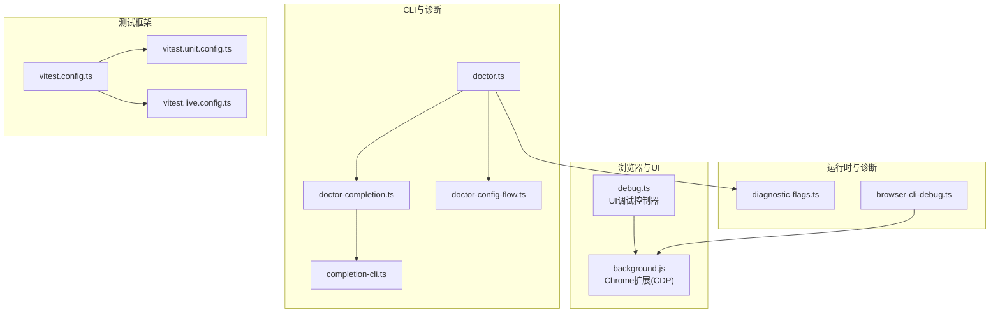
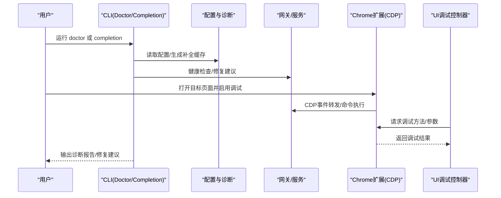
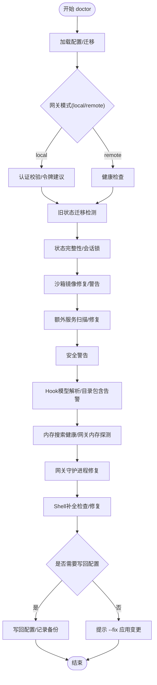
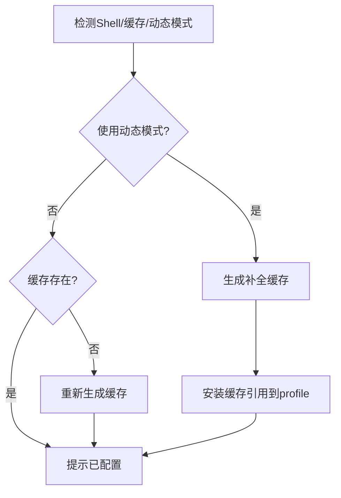
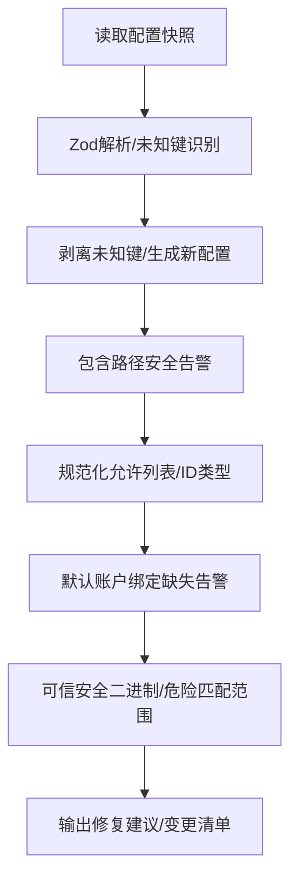
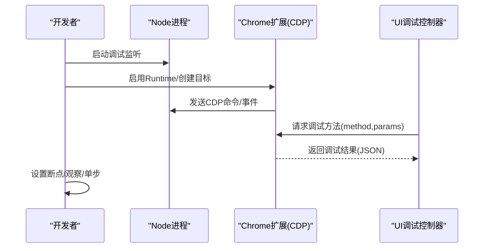
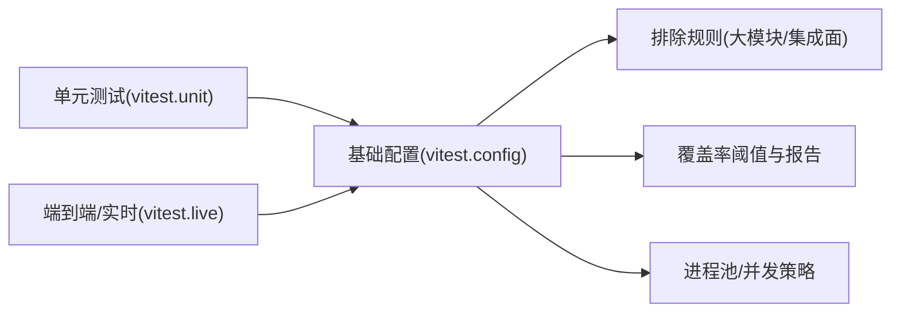
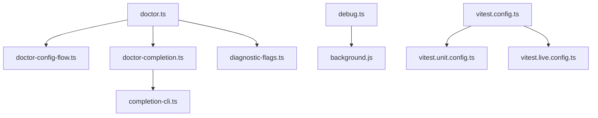

# 调试工具

<cite>
**本文引用的文件**
- [doctor.ts](file://src/commands/doctor.ts)
- [doctor-completion.ts](file://src/commands/doctor-completion.ts)
- [doctor-config-flow.ts](file://src/commands/doctor-config-flow.ts)
- [completion-cli.ts](file://src/cli/completion-cli.ts)
- [browser-cli-debug.ts](file://src/cli/browser-cli-debug.ts)
- [background.js](file://assets/chrome-extension/background.js)
- [debug.ts](file://ui/src/ui/controllers/debug.ts)
- [vitest.config.ts](file://vitest.config.ts)
- [vitest.unit.config.ts](file://vitest.unit.config.ts)
- [vitest.live.config.ts](file://vitest.live.config.ts)
- [diagnostic-flags.ts](file://src/infra/diagnostic-flags.ts)
- [global-setup.ts](file://test/global-setup.ts)
- [onboarding.completion.ts](file://src/wizard/onboarding.completion.ts)
- [onboarding.completion.test.ts](file://src/agents/subagent-registry-completion.test.ts)
- [completion-fish.ts](file://src/cli/completion-fish.ts)
- [completion-fish.test.ts](file://src/cli/completion-fish.test.ts)
- [completion-cli.test.ts](file://src/cli/completion-cli.test.ts)
- [doctor-config-flow.test.ts](file://src/commands/doctor-config-flow.test.ts)
- [doctor-config-flow.include-warning.test.ts](file://src/commands/doctor-config-flow.include-warning.test.ts)
- [doctor-config-flow.missing-default-account-bindings.test.ts](file://src/commands/doctor-config-flow.missing-default-account-bindings.test.ts)
- [doctor-config-flow.safe-bins.test.ts](file://src/commands/doctor-config-flow.safe-bins.test.ts)
- [doctor-config-flow.test-utils.ts](file://src/commands/doctor-config-flow.test-utils.ts)
- [doctor-auth.hints.test.ts](file://src/commands/doctor-auth.hints.test.ts)
- [doctor-auth.deprecated-cli-profiles.test.ts](file://src/commands/doctor-auth.deprecated-cli-profiles.test.ts)
- [doctor-completion.ts](file://src/commands/doctor-completion.ts)
- [doctor-completion.test.ts](file://src/agents/subagent-registry-completion.test.ts)
- [doctor-completion.ts](file://src/commands/doctor-completion.ts)
- [doctor-completion.ts](file://src/commands/doctor-completion.ts)
- [doctor-completion.ts](file://src/commands/doctor-completion.ts)
- [doctor-completion.ts](file://src/commands/doctor-completion.ts)
- [doctor-completion.ts](file://src/commands/doctor-completion.ts)
- [doctor-completion.ts](file://src/commands/doctor-completion.ts)
- [doctor-completion.ts](file://src/commands/doctor-completion.ts)
- [doctor-completion.ts](file://src/commands/doctor-completion.ts)
- [doctor-completion.ts](file://src/commands/doctor-completion.ts)
- [doctor-completion.ts](file://src/commands/doctor-completion.ts)
- [doctor-completion.ts](file://src/commands/doctor-completion.ts)
- [doctor-completion.ts](file://src/commands/doctor-completion.ts)
- [doctor-completion.ts](file://src/commands/doctor-completion.ts)
- [doctor-completion.ts](file://src/commands/doctor-completion.ts)
- [doctor-completion.ts](file://src/commands/doctor-completion.ts)
- [doctor-completion.ts](file://src/commands/doctor-completion.ts)
- [doctor-completion.ts](file://src/commands/doctor-completion.ts)
- [doctor-completion.ts](file://src/commands/doctor-completion.ts)
- [doctor-completion.ts](file://src/commands/doctor-completion.ts)
- [doctor-completion.ts](file://src/commands/doctor-completion.ts)
- [doctor-completion.ts](file://src/commands/doctor-completion.ts)
- [doctor-completion.ts](file://src/commands/doctor-completion.ts)
- [doctor-completion.ts](file://src/commands/doctor-completion.ts)
- [doctor-completion.ts](file://src/commands/doctor-completion.ts)
- [doctor-completion.ts](file://src/commands/doctor-completion.ts)
- [doctor-completion.ts](file://src/commands/doctor-completion.ts)
- [doctor-completion.ts](file://src/commands/doctor-completion.ts)
- [doctor-completion.ts](file://src/commands/doctor-completion.ts)
- [doctor-com......](file://src/commands/doctor-completion.ts)
</cite>

## 目录

1. [简介](#简介)
2. [项目结构](#项目结构)
3. [核心组件](#核心组件)
4. [架构总览](#架构总览)
5. [详细组件分析](#详细组件分析)
6. [依赖关系分析](#依赖关系分析)
7. [性能考量](#性能考量)
8. [故障排查指南](#故障排查指南)
9. [结论](#结论)
10. [附录](#附录)

## 简介

本指南面向OpenClaw的调试与排障场景，覆盖以下主题：

- 内置调试命令：doctor命令的诊断能力、completion命令的自动补全调试、config-flow的配置流程分析
- Node.js调试器与远程调试：断点设置、会话管理、CDP桥接
- 浏览器与移动端调试：Chrome扩展调试通道、移动端Web调试要点
- 跨平台调试策略：不同Shell与操作系统下的补全与诊断差异
- 测试辅助与排错：单元测试、集成测试、端到端测试的调试配置与运行策略
- 调试环境与信息收集：日志、诊断标志、配置快照与备份

## 项目结构

OpenClaw的调试相关代码主要分布在以下区域：

- 命令行与诊断：src/commands（doctor系列）、src/cli（completion、browser调试）
- 平台与运行时：src/runtime、src/infra（诊断标志）、src/gateway（服务侧调试）
- UI与浏览器：ui/src（调试控制器）、assets/chrome-extension（CDP桥接）
- 测试框架：vitest.config.ts及多套配置（unit/live/extensions等）

**图表来源**

- [doctor.ts](file://src/commands/doctor.ts#L67-L327)
- [doctor-completion.ts](file://src/commands/doctor-completion.ts#L78-L163)
- [doctor-config-flow.ts](file://src/commands/doctor-config-flow.ts#L1-L120)
- [completion-cli.ts](file://src/cli/completion-cli.ts#L231-L301)
- [background.js](file://assets/chrome-extension/background.js#L626-L711)
- [debug.ts](file://ui/src/ui/controllers/debug.ts#L45-L60)
- [vitest.config.ts](file://vitest.config.ts#L12-L158)
- [vitest.unit.config.ts](file://vitest.unit.config.ts#L1-L19)
- [vitest.live.config.ts](file://vitest.live.config.ts#L1-L16)
- [diagnostic-flags.ts](file://src/infra/diagnostic-flags.ts#L44-L92)
- [browser-cli-debug.ts](file://src/cli/browser-cli-debug.ts#L1-L27)

**章节来源**

- [doctor.ts](file://src/commands/doctor.ts#L67-L327)
- [completion-cli.ts](file://src/cli/completion-cli.ts#L231-L301)
- [vitest.config.ts](file://vitest.config.ts#L12-L158)

## 核心组件

- doctor命令：集中式诊断与修复流程，涵盖网关健康检查、安全与权限提示、工作区状态、沙箱镜像、模型选择校验、Shell补全等
- completion命令：生成/安装/升级Shell补全脚本，支持缓存模式以提升启动速度
- config-flow诊断：对配置文件进行结构化校验、清理未知键、修正常见绑定与允许列表问题
- 浏览器调试桥：通过Chrome扩展与CDP交互，转发事件与执行命令
- 测试框架：统一的Vitest配置，支持浏览器环境、覆盖率与排除规则

**章节来源**

- [doctor.ts](file://src/commands/doctor.ts#L67-L327)
- [doctor-completion.ts](file://src/commands/doctor-completion.ts#L78-L163)
- [doctor-config-flow.ts](file://src/commands/doctor-config-flow.ts#L1-L120)
- [completion-cli.ts](file://src/cli/completion-cli.ts#L231-L301)
- [background.js](file://assets/chrome-extension/background.js#L626-L711)
- [vitest.config.ts](file://vitest.config.ts#L12-L158)

## 架构总览

OpenClaw的调试体系由“诊断命令”“补全系统”“配置校验”“浏览器桥接”“测试框架”五部分组成，形成从本地诊断到远程调试、从静态配置到动态运行时的闭环。

**图表来源**

- [doctor.ts](file://src/commands/doctor.ts#L67-L327)
- [completion-cli.ts](file://src/cli/completion-cli.ts#L231-L301)
- [background.js](file://assets/chrome-extension/background.js#L626-L711)
- [debug.ts](file://ui/src/ui/controllers/debug.ts#L45-L60)

## 详细组件分析

### Doctor命令：诊断与修复

- 功能概览
  - 更新前置检查、UI协议新鲜度、安装来源与废弃变量提示
  - 配置加载与迁移、网关模式与认证校验、令牌生成与配置
  - 旧状态迁移检测、状态完整性与会话锁健康
  - 沙箱镜像修复与作用域警告、额外网关服务扫描与修复
  - 安全警告、Hook模型解析与目录包含限制告警、内存搜索健康
  - Linux systemd用户服务留驻提示、工作区建议与备份提示
  - Shell补全检查与修复、最终配置快照验证
- 关键流程
  - 配置加载与迁移：优先从doctor-config-flow读取并应用迁移
  - 网关健康检查：在非交互模式下缩短超时
  - 诊断标志：结合环境变量与配置决定启用范围
  - 修复写回：仅在需要时写回配置并记录备份路径

**图表来源**

- [doctor.ts](file://src/commands/doctor.ts#L67-L327)
- [doctor-config-flow.ts](file://src/commands/doctor-config-flow.ts#L1-L120)
- [diagnostic-flags.ts](file://src/infra/diagnostic-flags.ts#L44-L92)

**章节来源**

- [doctor.ts](file://src/commands/doctor.ts#L67-L327)
- [diagnostic-flags.ts](file://src/infra/diagnostic-flags.ts#L44-L92)

### Completion命令：自动补全调试

- 功能概览
  - 自动识别当前Shell并生成对应补全脚本
  - 支持写入缓存文件（推荐）与动态模式（慢）
  - 安装到Shell配置文件，自动去重与更新头块
  - doctor模式中对慢速动态模式进行升级与缓存补齐
- 关键流程
  - 生成缓存：调用completion命令写入缓存目录
  - 升级策略：若检测到动态模式则先生成缓存再替换为缓存引用
  - 安装流程：写入profile并提示重启或source

**图表来源**

- [completion-cli.ts](file://src/cli/completion-cli.ts#L231-L301)
- [completion-cli.ts](file://src/cli/completion-cli.ts#L303-L377)
- [doctor-completion.ts](file://src/commands/doctor-completion.ts#L78-L163)

**章节来源**

- [completion-cli.ts](file://src/cli/completion-cli.ts#L231-L301)
- [completion-cli.ts](file://src/cli/completion-cli.ts#L303-L377)
- [doctor-completion.ts](file://src/commands/doctor-completion.ts#L78-L163)

### Config-flow：配置流程分析

- 功能概览
  - 结构化校验与未知键清理
  - 包含路径安全限制告警
  - Telegram/Discord允许列表与ID规范化
  - 默认账户绑定缺失告警与建议
  - 可信安全二进制目录与危险名称匹配范围
- 关键流程
  - 解析与剥离未知键，保留有效配置
  - 对包含路径进行安全校验并给出修复建议
  - 规范化允许列表中的ID类型，必要时尝试解析用户名为ID
  - 生成缺失默认绑定的修复建议

**图表来源**

- [doctor-config-flow.ts](file://src/commands/doctor-config-flow.ts#L101-L135)
- [doctor-config-flow.ts](file://src/commands/doctor-config-flow.ts#L174-L196)
- [doctor-config-flow.ts](file://src/commands/doctor-config-flow.ts#L221-L308)
- [doctor-config-flow.ts](file://src/commands/doctor-config-flow.ts#L405-L536)

**章节来源**

- [doctor-config-flow.ts](file://src/commands/doctor-config-flow.ts#L101-L135)
- [doctor-config-flow.ts](file://src/commands/doctor-config-flow.ts#L174-L196)
- [doctor-config-flow.ts](file://src/commands/doctor-config-flow.ts#L221-L308)
- [doctor-config-flow.ts](file://src/commands/doctor-config-flow.ts#L405-L536)

### Node.js调试器与远程调试

- 本地调试
  - 使用Node.js内置调试器附加进程，设置断点、观察表达式、单步执行
  - 在doctor流程中可结合日志与诊断标志定位问题
- 远程调试
  - 通过Chrome扩展与CDP交互，转发事件与执行命令
  - UI侧通过调试控制器向扩展请求调试方法并接收结果
- 断点设置技巧
  - 在关键函数入口与分支处设置条件断点
  - 利用诊断标志缩小问题范围，减少不必要的断点数量
  - 对异步流程使用延迟断点与Promise链跟踪

**图表来源**

- [background.js](file://assets/chrome-extension/background.js#L626-L711)
- [debug.ts](file://ui/src/ui/controllers/debug.ts#L45-L60)
- [browser-cli-debug.ts](file://src/cli/browser-cli-debug.ts#L1-L27)

**章节来源**

- [background.js](file://assets/chrome-extension/background.js#L626-L711)
- [debug.ts](file://ui/src/ui/controllers/debug.ts#L45-L60)
- [browser-cli-debug.ts](file://src/cli/browser-cli-debug.ts#L1-L27)

### 浏览器与移动端调试

- 浏览器开发者工具
  - 启用Runtime与DOM调试，查看网络与控制台日志
  - 使用CDP事件面板观察目标生命周期与子会话
- 移动端调试
  - 通过USB或无线调试连接设备，启用开发者选项
  - 使用Chrome DevTools的“设备模式”或直接连接移动设备
- 跨平台策略
  - 统一使用缓存补全与诊断标志，避免动态模式带来的性能与兼容性问题
  - 在CI与本地开发环境中分别配置不同的超时与并发策略

**章节来源**

- [completion-cli.ts](file://src/cli/completion-cli.ts#L231-L301)
- [diagnostic-flags.ts](file://src/infra/diagnostic-flags.ts#L44-L92)

### 测试辅助与调试

- 单元测试
  - 使用vitest.unit.config.ts聚焦核心模块，排除大型集成面
  - 通过unstubEnvs/unstubGlobals避免跨文件污染
- 集成测试
  - 使用vitest.config.ts统一配置，启用浏览器环境与覆盖率
  - 排除UI与大型集成模块，确保稳定性
- 端到端测试
  - 使用vitest.live.config.ts隔离live测试，限制并发
- 全局设置
  - global-setup.ts用于安装测试环境并在退出时清理

**图表来源**

- [vitest.config.ts](file://vitest.config.ts#L12-L158)
- [vitest.unit.config.ts](file://vitest.unit.config.ts#L1-L19)
- [vitest.live.config.ts](file://vitest.live.config.ts#L1-L16)
- [global-setup.ts](file://test/global-setup.ts#L1-L6)

**章节来源**

- [vitest.config.ts](file://vitest.config.ts#L12-L158)
- [vitest.unit.config.ts](file://vitest.unit.config.ts#L1-L19)
- [vitest.live.config.ts](file://vitest.live.config.ts#L1-L16)
- [global-setup.ts](file://test/global-setup.ts#L1-L6)

## 依赖关系分析

- doctor命令依赖doctor-config-flow与doctor-completion，以及诊断标志与网关健康检查
- completion-cli与doctor-completion共同维护补全状态与缓存
- 浏览器调试依赖Chrome扩展与CDP，UI调试控制器作为上层入口
- 测试框架通过多套配置实现不同粒度的测试覆盖

**图表来源**

- [doctor.ts](file://src/commands/doctor.ts#L67-L327)
- [doctor-config-flow.ts](file://src/commands/doctor-config-flow.ts#L1-L120)
- [doctor-completion.ts](file://src/commands/doctor-completion.ts#L78-L163)
- [completion-cli.ts](file://src/cli/completion-cli.ts#L231-L301)
- [diagnostic-flags.ts](file://src/infra/diagnostic-flags.ts#L44-L92)
- [debug.ts](file://ui/src/ui/controllers/debug.ts#L45-L60)
- [background.js](file://assets/chrome-extension/background.js#L626-L711)
- [vitest.config.ts](file://vitest.config.ts#L12-L158)
- [vitest.unit.config.ts](file://vitest.unit.config.ts#L1-L19)
- [vitest.live.config.ts](file://vitest.live.config.ts#L1-L16)

**章节来源**

- [doctor.ts](file://src/commands/doctor.ts#L67-L327)
- [completion-cli.ts](file://src/cli/completion-cli.ts#L231-L301)
- [debug.ts](file://ui/src/ui/controllers/debug.ts#L45-L60)
- [vitest.config.ts](file://vitest.config.ts#L12-L158)

## 性能考量

- 补全缓存优先：使用completion --write-state生成缓存，避免动态模式导致的启动延迟
- 诊断标志：通过环境变量与配置组合启用精确诊断，减少无关检查
- 测试并发：根据平台与CPU核数调整maxWorkers，CI环境采用固定并发以稳定结果
- 网关健康检查：非交互模式下缩短超时，避免长时间阻塞

[本节为通用指导，无需特定文件来源]

## 故障排查指南

- doctor无法写回配置
  - 检查doctor输出的变更与备份路径，确认权限与磁盘空间
  - 使用doctor --fix强制应用建议的修复
- Shell补全异常
  - 使用completion --write-state生成缓存后，确认profile中引用的是缓存文件而非动态模式
  - doctor模式会自动升级动态模式为缓存模式
- 网关健康检查失败
  - 在非交互模式下缩短超时；检查网关服务状态与认证配置
  - 查看最终配置快照的有效性与错误路径
- 浏览器调试无响应
  - 确认扩展已启用Runtime并正确转发CDP事件
  - 检查UI调试控制器的请求参数与返回结果
- 测试不稳定
  - 在CI环境使用vitest.live.config.ts隔离live测试
  - 通过unstubEnvs/unstubGlobals避免环境泄漏

**章节来源**

- [doctor.ts](file://src/commands/doctor.ts#L294-L327)
- [completion-cli.ts](file://src/cli/completion-cli.ts#L303-L377)
- [doctor-completion.ts](file://src/commands/doctor-completion.ts#L78-L163)
- [debug.ts](file://ui/src/ui/controllers/debug.ts#L45-L60)
- [vitest.live.config.ts](file://vitest.live.config.ts#L1-L16)

## 结论

OpenClaw提供了从本地诊断、配置修复、补全优化到远程调试与测试支撑的完整调试工具链。通过doctor命令与completion命令的协同，配合CDP桥接与测试框架，能够高效定位并解决问题。建议在日常开发中：

- 优先使用缓存补全与诊断标志
- 在doctor流程中按需应用修复建议
- 使用浏览器与移动端调试工具结合日志定位问题
- 通过多套测试配置保证质量与稳定性

[本节为总结，无需特定文件来源]

## 附录

- 术语
  - CDP：Chrome DevTools Protocol
  - UI协议：前端与后端通信协议
  - 诊断标志：用于启用特定诊断范围的开关
- 快速参考
  - doctor：集中诊断与修复
  - completion：生成/安装/升级补全
  - config-flow：配置结构化校验与修复
  - 浏览器调试：CDP桥接与UI调试控制器
  - 测试：单元/集成/端到端三类配置

[本节为补充说明，无需特定文件来源]
