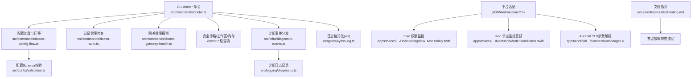
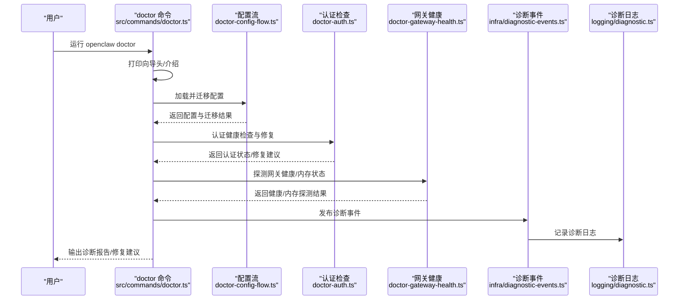
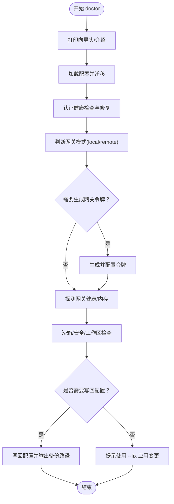
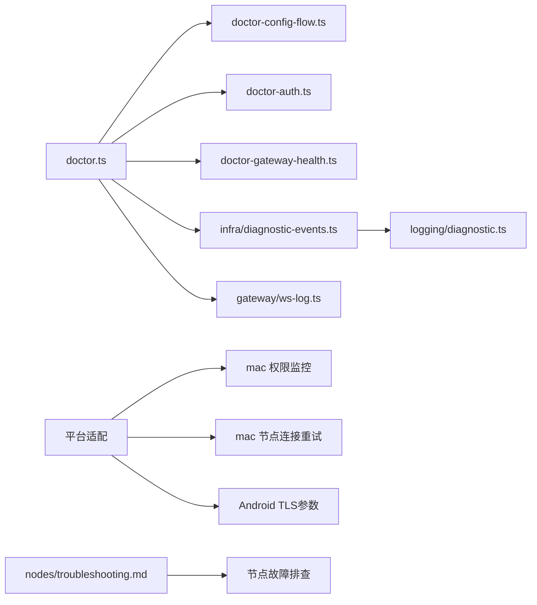

# 错误排查

<cite>
**本文引用的文件**
- [src/commands/doctor.ts](file://src/commands/doctor.ts)
- [src/commands/doctor-auth.ts](file://src/commands/doctor-auth.ts)
- [src/commands/doctor-config-flow.ts](file://src/commands/doctor-config-flow.ts)
- [src/infra/errors.ts](file://src/infra/errors.ts)
- [src/infra/path-guards.ts](file://src/infra/path-guards.ts)
- [src/infra/fs-safe.ts](file://src/infra/fs-safe.ts)
- [src/infra/diagnostic-events.ts](file://src/infra/diagnostic-events.ts)
- [src/logging/diagnostic.ts](file://src/logging/diagnostic.ts)
- [src/gateway/ws-log.ts](file://src/gateway/ws-log.ts)
- [src/logger.ts](file://src/logger.ts)
- [src/config/validation.ts](file://src/config/validation.ts)
- [src/telegram/network-errors.ts](file://src/telegram/network-errors.ts)
- [apps/macos/Sources/OpenClaw/OnboardingView+Monitoring.swift](file://apps/macos/Sources/OpenClaw/OnboardingView+Monitoring.swift)
- [apps/macos/Sources/OpenClaw/NodeMode/MacNodeModeCoordinator.swift](file://apps/macos/Sources/OpenClaw/NodeMode/MacNodeModeCoordinator.swift)
- [apps/android/app/src/main/java/ai/openclaw/android/node/ConnectionManager.kt](file://apps/android/app/src/main/java/ai/openclaw/android/node/ConnectionManager.kt)
- [docs/nodes/troubleshooting.md](file://docs/nodes/troubleshooting.md)
- [src/infra/update-check.ts](file://src/infra/update-check.ts)
- [src/infra/outbound/outbound.test.ts](file://src/infra/outbound/outbound.test.ts)
- [src/memory/search-manager.ts](file://src/memory/search-manager.ts)
- [src/cli/program/command-registry.test.ts](file://src/cli/program/command-registry.test.ts)
- [src/cli/profile.test.ts](file://src/cli/profile.test.ts)
- [scripts/check-channel-agnostic-boundaries.mjs](file://scripts/check-channel-agnostic-boundaries.mjs)
</cite>

## 目录

1. [简介](#简介)
2. [项目结构](#项目结构)
3. [核心组件](#核心组件)
4. [架构总览](#架构总览)
5. [详细组件分析](#详细组件分析)
6. [依赖关系分析](#依赖关系分析)
7. [性能考量](#性能考量)
8. [故障排查指南](#故障排查指南)
9. [结论](#结论)
10. [附录](#附录)

## 简介

本指南面向OpenClaw用户与维护者，提供系统化的错误排查方法与流程，覆盖配置错误、连接错误、权限错误、网络错误等常见场景；详解doctor命令的诊断流程、错误代码与信息解读；给出问题分类排查、根因分析技巧、逐步排除法；并补充不同平台（iOS/Android/macOS）特定问题、依赖缺失与版本兼容性问题、日志分析与预防措施、应急处理流程以及常见问题FAQ。

## 项目结构

OpenClaw在多语言与多平台下运行，错误排查涉及CLI命令、配置校验、诊断事件、日志格式化、平台适配与文档指引。关键路径如下：

- CLI诊断命令：doctor主流程与子检查项
- 配置与校验：Zod Schema、兼容性迁移、插件自动启用
- 诊断与日志：诊断事件分发、会话状态、日志格式化
- 平台适配：macOS节点连接与权限监控、Android TLS参数解析
- 文档与指引：节点故障排查手册

图表来源

- [src/commands/doctor.ts](file://src/commands/doctor.ts#L67-L327)
- [src/commands/doctor-config-flow.ts](file://src/commands/doctor-config-flow.ts#L1-L200)
- [src/commands/doctor-auth.ts](file://src/commands/doctor-auth.ts#L1-L120)
- [src/config/validation.ts](file://src/config/validation.ts#L83-L171)
- [src/infra/diagnostic-events.ts](file://src/infra/diagnostic-events.ts#L204-L242)
- [src/logging/diagnostic.ts](file://src/logging/diagnostic.ts#L204-L241)
- [src/gateway/ws-log.ts](file://src/gateway/ws-log.ts#L102-L142)
- [apps/macos/Sources/OpenClaw/OnboardingView+Monitoring.swift](file://apps/macos/Sources/OpenClaw/OnboardingView+Monitoring.swift#L1-L28)
- [apps/macos/Sources/OpenClaw/NodeMode/MacNodeModeCoordinator.swift](file://apps/macos/Sources/OpenClaw/NodeMode/MacNodeModeCoordinator.swift#L90-L124)
- [apps/android/app/src/main/java/ai/openclaw/android/node/ConnectionManager.kt](file://apps/android/app/src/main/java/ai/openclaw/android/node/ConnectionManager.kt#L1-L31)
- [docs/nodes/troubleshooting.md](file://docs/nodes/troubleshooting.md#L1-L115)

章节来源

- [src/commands/doctor.ts](file://src/commands/doctor.ts#L67-L327)
- [src/commands/doctor-config-flow.ts](file://src/commands/doctor-config-flow.ts#L1-L200)
- [src/commands/doctor-auth.ts](file://src/commands/doctor-auth.ts#L1-L120)
- [src/config/validation.ts](file://src/config/validation.ts#L83-L171)
- [src/infra/diagnostic-events.ts](file://src/infra/diagnostic-events.ts#L204-L242)
- [src/logging/diagnostic.ts](file://src/logging/diagnostic.ts#L204-L241)
- [src/gateway/ws-log.ts](file://src/gateway/ws-log.ts#L102-L142)
- [apps/macos/Sources/OpenClaw/OnboardingView+Monitoring.swift](file://apps/macos/Sources/OpenClaw/OnboardingView+Monitoring.swift#L1-L28)
- [apps/macos/Sources/OpenClaw/NodeMode/MacNodeModeCoordinator.swift](file://apps/macos/Sources/OpenClaw/NodeMode/MacNodeModeCoordinator.swift#L90-L124)
- [apps/android/app/src/main/java/ai/openclaw/android/node/ConnectionManager.kt](file://apps/android/app/src/main/java/ai/openclaw/android/node/ConnectionManager.kt#L1-L31)
- [docs/nodes/troubleshooting.md](file://docs/nodes/troubleshooting.md#L1-L115)

## 核心组件

- doctor命令：集中式诊断入口，按模块执行配置、认证、网关、安全、工作区等检查，并可交互修复或写回配置。
- 配置校验与迁移：基于Zod Schema进行严格校验，识别未知键、兼容性问题、包含路径越界等；支持迁移与自动修复。
- 诊断事件与日志：统一的诊断事件分发器，记录会话卡顿、队列入队/出队、运行尝试等；日志格式化保留关键字段并限制长度。
- 平台适配：macOS节点连接重试与权限监控；Android TLS参数解析；iOS/Android前台能力限制。
- 错误提取与格式化：从错误对象中抽取错误码，格式化消息，避免敏感信息泄露；网络错误收集候选链路。

章节来源

- [src/commands/doctor.ts](file://src/commands/doctor.ts#L67-L327)
- [src/commands/doctor-config-flow.ts](file://src/commands/doctor-config-flow.ts#L101-L135)
- [src/infra/diagnostic-events.ts](file://src/infra/diagnostic-events.ts#L204-L242)
- [src/logging/diagnostic.ts](file://src/logging/diagnostic.ts#L204-L241)
- [src/gateway/ws-log.ts](file://src/gateway/ws-log.ts#L102-L142)
- [apps/macos/Sources/OpenClaw/NodeMode/MacNodeModeCoordinator.swift](file://apps/macos/Sources/OpenClaw/NodeMode/MacNodeModeCoordinator.swift#L90-L124)
- [apps/android/app/src/main/java/ai/openclaw/android/node/ConnectionManager.kt](file://apps/android/app/src/main/java/ai/openclaw/android/node/ConnectionManager.kt#L24-L31)
- [src/infra/errors.ts](file://src/infra/errors.ts#L3-L59)

## 架构总览

doctor命令串联多个子诊断模块，形成“检查-提示-修复-写回”的闭环。配置层负责Schema校验与兼容迁移；诊断层负责事件与日志；平台层负责设备连接与权限；文档层提供节点故障排查流程。

图表来源

- [src/commands/doctor.ts](file://src/commands/doctor.ts#L67-L327)
- [src/commands/doctor-config-flow.ts](file://src/commands/doctor-config-flow.ts#L1-L200)
- [src/commands/doctor-auth.ts](file://src/commands/doctor-auth.ts#L245-L350)
- [src/infra/diagnostic-events.ts](file://src/infra/diagnostic-events.ts#L204-L242)
- [src/logging/diagnostic.ts](file://src/logging/diagnostic.ts#L204-L241)

## 详细组件分析

### doctor命令诊断流程

- 入口与初始化：打印标题、解析包根、可选更新提示、UI协议新鲜度检查、安装来源提示、废弃环境变量提示。
- 配置加载与迁移：加载配置快照，迁移旧配置，清理未知键，兼容性值规范化，自动启用插件，检测包含路径越界。
- 认证健康：识别过期/即将过期/缺失凭据，提示刷新；移除已弃用CLI凭据；修正Anthropic OAuth Profile ID。
- 网关与守护：根据模式选择本地/远程，生成/配置网关令牌，探测网关健康与内存状态，必要时修复守护进程。
- 安全与沙箱：检查沙箱镜像与作用域警告；安全风险提示；工作区状态与备份建议；内存检索健康提示。
- 写回与收尾：若发生变更则写回配置并输出备份位置；否则提示使用--fix应用变更；最终快照校验。

图表来源

- [src/commands/doctor.ts](file://src/commands/doctor.ts#L67-L327)

章节来源

- [src/commands/doctor.ts](file://src/commands/doctor.ts#L67-L327)

### 配置错误与修复

- 未知键清理：对Zod校验失败的“未识别键”进行路径定位与删除，避免无效配置影响运行。
- 包含路径越界：当$include路径逃逸或越界时，提示移动到配置目录内并更新为相对路径。
- 兼容性值规范化：对历史配置中的不兼容值进行转换，减少运行期异常。
- 插件自动启用：根据策略自动启用插件，确保功能可用。
- 写回与备份：变更后写回配置并输出.bak路径，便于回滚。

章节来源

- [src/commands/doctor-config-flow.ts](file://src/commands/doctor-config-flow.ts#L101-L135)
- [src/commands/doctor-config-flow.ts](file://src/commands/doctor-config-flow.ts#L174-L196)
- [src/config/validation.ts](file://src/config/validation.ts#L83-L171)

### 连接错误与网关健康

- 网关健康探测：在非交互模式下缩短超时时间，优先探测健康状态，再探测内存状态。
- 守护进程修复：针对本地模式的守护进程进行修复与重启提示。
- 诊断事件：发布“queue.lane.enqueue/dequeue”、“run.attempt”等事件，辅助定位卡顿与队列问题。

章节来源

- [src/commands/doctor.ts](file://src/commands/doctor.ts#L273-L292)
- [src/infra/diagnostic-events.ts](file://src/infra/diagnostic-events.ts#L204-L242)
- [src/logging/diagnostic.ts](file://src/logging/diagnostic.ts#L222-L257)

### 权限错误与平台差异

- iOS/Android前台限制：canvas、camera、screen工具仅前台可用；若出现后台不可用错误，需将节点应用置前。
- 权限矩阵：相机、屏幕录制、位置权限在各平台要求不同；典型错误码如\*\_PERMISSION_REQUIRED、LOCATION_PERMISSION_REQUIRED、SYSTEM_RUN_DENIED等。
- macOS权限监控：注册权限监控，请求缺失能力并刷新状态。
- Android TLS参数：根据端点稳定ID与存储指纹决定TLS参数，支持手动TLS开关。

章节来源

- [docs/nodes/troubleshooting.md](file://docs/nodes/troubleshooting.md#L37-L91)
- [apps/macos/Sources/OpenClaw/OnboardingView+Monitoring.swift](file://apps/macos/Sources/OpenClaw/OnboardingView+Monitoring.swift#L1-L28)
- [apps/android/app/src/main/java/ai/openclaw/android/node/ConnectionManager.kt](file://apps/android/app/src/main/java/ai/openclaw/android/node/ConnectionManager.kt#L24-L31)

### 网络错误与错误码提取

- 错误码提取：从错误对象或其属性中提取code/errno，支持字符串与数字类型。
- 错误候选收集：广度遍历错误树，收集所有候选错误以辅助诊断。
- 日志格式化：对错误对象进行格式化，拼接name/message/code，限制最大长度，避免日志膨胀。

章节来源

- [src/infra/errors.ts](file://src/infra/errors.ts#L3-L59)
- [src/telegram/network-errors.ts](file://src/telegram/network-errors.ts#L54-L83)
- [src/gateway/ws-log.ts](file://src/gateway/ws-log.ts#L102-L142)

### 文件系统与路径错误

- 路径错误判定：NOT_FOUND_CODES与SYMLINK_OPEN_CODES用于识别文件不存在、符号链接打开等错误。
- 安全打开文件：拒绝硬链接、禁止符号链接、路径变化检测，保障读取安全性。

章节来源

- [src/infra/path-guards.ts](file://src/infra/path-guards.ts#L3-L33)
- [src/infra/fs-safe.ts](file://src/infra/fs-safe.ts#L50-L91)

### 版本兼容性与更新检查

- 版本比较：对比通道标签与最新版本，决定是否升级；语义化版本比较支持预发布排序。
- 更新检查：在doctor流程中可提示更新，避免因版本过低导致的兼容性问题。

章节来源

- [src/infra/update-check.ts](file://src/infra/update-check.ts#L329-L366)

### 恢复重试与队列回放

- 回放缓冲：在崩溃后进行恢复重试，尊重退避策略与最大预算时间，避免无限占用资源。
- 退避计算：根据重试次数与最后尝试时间计算下次重试窗口，确保系统稳定。

章节来源

- [src/infra/outbound/outbound.test.ts](file://src/infra/outbound/outbound.test.ts#L220-L490)

### 内存检索降级与回退

- 主备切换：当主内存服务失败时，自动切换到回退方案并记录原因；状态中包含回退标记与原因，便于诊断。

章节来源

- [src/memory/search-manager.ts](file://src/memory/search-manager.ts#L123-L163)

### CLI命令与环境变量

- doctor占位注册：核心CLI命令注册时保留doctor主命令占位，帮助用户理解命令层级。
- profile注入：当OPENCLAW_PROFILE设置且非默认时，自动在命令中插入--profile标志，避免上下文偏差。

章节来源

- [src/cli/program/command-registry.test.ts](file://src/cli/program/command-registry.test.ts#L88-L122)
- [src/cli/profile.test.ts](file://src/cli/profile.test.ts#L103-L149)

### 代码边界与渠道无关性

- 渠道边界检查：防止在渠道无关模块中引入渠道特有依赖或文本，避免破坏跨渠道一致性。

章节来源

- [scripts/check-channel-agnostic-boundaries.mjs](file://scripts/check-channel-agnostic-boundaries.mjs#L268-L306)

## 依赖关系分析

doctor命令作为中枢，依赖配置、认证、网关健康、诊断事件与日志等模块；配置流依赖Schema与兼容性工具；平台适配通过原生层实现；文档指引提供节点故障排查流程。

图表来源

- [src/commands/doctor.ts](file://src/commands/doctor.ts#L67-L327)
- [src/commands/doctor-config-flow.ts](file://src/commands/doctor-config-flow.ts#L1-L200)
- [src/commands/doctor-auth.ts](file://src/commands/doctor-auth.ts#L1-L120)
- [src/infra/diagnostic-events.ts](file://src/infra/diagnostic-events.ts#L204-L242)
- [src/logging/diagnostic.ts](file://src/logging/diagnostic.ts#L204-L241)
- [src/gateway/ws-log.ts](file://src/gateway/ws-log.ts#L102-L142)
- [apps/macos/Sources/OpenClaw/OnboardingView+Monitoring.swift](file://apps/macos/Sources/OpenClaw/OnboardingView+Monitoring.swift#L1-L28)
- [apps/macos/Sources/OpenClaw/NodeMode/MacNodeModeCoordinator.swift](file://apps/macos/Sources/OpenClaw/NodeMode/MacNodeModeCoordinator.swift#L90-L124)
- [apps/android/app/src/main/java/ai/openclaw/android/node/ConnectionManager.kt](file://apps/android/app/src/main/java/ai/openclaw/android/node/ConnectionManager.kt#L24-L31)
- [docs/nodes/troubleshooting.md](file://docs/nodes/troubleshooting.md#L1-L115)

## 性能考量

- 诊断事件分发：监听器失败不影响主流程，但需避免过多监听器导致分发深度增加。
- 日志格式化：限制单条日志长度，避免大对象序列化造成性能与存储压力。
- 网关探测：非交互模式下缩短超时，降低等待时间；内存探测仅在健康时进行。
- 恢复重试：设置最大预算时间，避免长时间阻塞；合理退避，避免频繁重试。

章节来源

- [src/infra/diagnostic-events.ts](file://src/infra/diagnostic-events.ts#L204-L242)
- [src/gateway/ws-log.ts](file://src/gateway/ws-log.ts#L102-L142)
- [src/commands/doctor.ts](file://src/commands/doctor.ts#L273-L292)
- [src/infra/outbound/outbound.test.ts](file://src/infra/outbound/outbound.test.ts#L427-L476)

## 故障排查指南

### 一、常见错误类型与解决方法

- 配置错误
  - 症状：启动报错、功能不可用、配置无效。
  - 解决：运行doctor自动清理未知键、迁移旧配置、规范化兼容值；必要时使用--fix写回。
- 连接错误
  - 症状：无法连接网关、健康探测失败、内存探测不可用。
  - 解决：确认网关模式与认证方式；在本地模式下生成/配置令牌；必要时修复守护进程。
- 权限错误
  - 症状：相机/屏幕/位置/系统运行被拒；后台不可用。
  - 解决：在iOS/Android前台运行；授予所需系统权限；macOS检查权限监控与请求流程。
- 网络错误
  - 症状：超时、连接中断、TLS握手失败。
  - 解决：检查TLS参数与证书指纹；缩短超时；重试与退避策略生效。

章节来源

- [src/commands/doctor.ts](file://src/commands/doctor.ts#L104-L164)
- [src/commands/doctor-config-flow.ts](file://src/commands/doctor-config-flow.ts#L174-L196)
- [docs/nodes/troubleshooting.md](file://docs/nodes/troubleshooting.md#L37-L91)
- [apps/android/app/src/main/java/ai/openclaw/android/node/ConnectionManager.kt](file://apps/android/app/src/main/java/ai/openclaw/android/node/ConnectionManager.kt#L24-L31)

### 二、doctor命令诊断流程

- 步骤
  1. 初始化与更新提示
  2. 加载配置并迁移
  3. 认证健康检查与修复
  4. 网关健康与内存探测
  5. 沙箱/安全/工作区检查
  6. 写回配置或提示--fix
  7. 输出最终配置快照校验
- 错误代码与信息解读
  - 通过错误码提取函数获取code/errno，结合日志格式化输出关键信息。
  - 对于网络错误，收集错误树中的候选错误，辅助定位上游问题。

章节来源

- [src/commands/doctor.ts](file://src/commands/doctor.ts#L67-L327)
- [src/infra/errors.ts](file://src/infra/errors.ts#L3-L59)
- [src/gateway/ws-log.ts](file://src/gateway/ws-log.ts#L102-L142)

### 三、问题分类排查方法

- 配置类
  - 使用doctor-config-flow清理未知键、修复包含路径越界、规范化兼容值。
- 连接类
  - doctor探测网关健康与内存；mac节点连接重试；Android TLS参数解析。
- 权限类
  - iOS/Android前台限制；macOS权限监控与请求；节点描述查看能力列表。
- 网络类
  - 缩短超时、重试与退避；检查TLS参数与证书指纹。

章节来源

- [src/commands/doctor-config-flow.ts](file://src/commands/doctor-config-flow.ts#L174-L196)
- [src/commands/doctor.ts](file://src/commands/doctor.ts#L273-L292)
- [apps/macos/Sources/OpenClaw/NodeMode/MacNodeModeCoordinator.swift](file://apps/macos/Sources/OpenClaw/NodeMode/MacNodeModeCoordinator.swift#L90-L124)
- [apps/android/app/src/main/java/ai/openclaw/android/node/ConnectionManager.kt](file://apps/android/app/src/main/java/ai/openclaw/android/node/ConnectionManager.kt#L24-L31)

### 四、根因分析技巧与逐步排除法

- 逐步排除
  1. 确认配置有效性（doctor最终快照校验）
  2. 检查认证状态（过期/缺失/弃用凭据）
  3. 探测网关健康与内存
  4. 平台权限与前台状态
  5. 网络与TLS参数
- 根因分析
  - 使用诊断事件与日志定位卡顿、队列积压、运行尝试次数。
  - 收集错误树候选，结合日志时间线与上下文信息。

章节来源

- [src/commands/doctor.ts](file://src/commands/doctor.ts#L316-L323)
- [src/infra/diagnostic-events.ts](file://src/infra/diagnostic-events.ts#L204-L242)
- [src/logging/diagnostic.ts](file://src/logging/diagnostic.ts#L204-L241)
- [src/telegram/network-errors.ts](file://src/telegram/network-errors.ts#L72-L83)

### 五、不同平台特定问题与解决方案

- iOS/Android
  - 前台限制导致工具不可用；相机/屏幕/位置权限缺失；后台不可用错误码。
- macOS
  - 权限监控与请求；节点连接重试与指数退避；launch agent与环境变量覆盖提示。
- Android
  - TLS参数解析与手动TLS开关；端点稳定ID与存储指纹匹配。

章节来源

- [docs/nodes/troubleshooting.md](file://docs/nodes/troubleshooting.md#L37-L91)
- [apps/macos/Sources/OpenClaw/OnboardingView+Monitoring.swift](file://apps/macos/Sources/OpenClaw/OnboardingView+Monitoring.swift#L1-L28)
- [apps/macos/Sources/OpenClaw/NodeMode/MacNodeModeCoordinator.swift](file://apps/macos/Sources/OpenClaw/NodeMode/MacNodeModeCoordinator.swift#L90-L124)
- [apps/android/app/src/main/java/ai/openclaw/android/node/ConnectionManager.kt](file://apps/android/app/src/main/java/ai/openclaw/android/node/ConnectionManager.kt#L24-L31)

### 六、依赖缺失与版本兼容性

- 依赖缺失
  - doctor-config-flow扫描安全二进制目录与可信路径，提示缺失或不受信任的路径。
- 版本兼容性
  - 比较通道标签与最新版本，必要时提示升级；注意预发布版本排序。

章节来源

- [src/commands/doctor-config-flow.ts](file://src/commands/doctor-config-flow.ts#L27-L31)
- [src/infra/update-check.ts](file://src/infra/update-check.ts#L329-L366)

### 七、错误日志分析与预防措施

- 日志分析
  - 使用诊断事件与日志格式化，关注会话卡顿、队列积压、运行尝试、错误码与堆栈摘要。
- 预防措施
  - 定期运行doctor；保持配置有效；及时刷新认证；控制日志大小与敏感信息脱敏。

章节来源

- [src/infra/diagnostic-events.ts](file://src/infra/diagnostic-events.ts#L204-L242)
- [src/gateway/ws-log.ts](file://src/gateway/ws-log.ts#L102-L142)
- [src/logger.ts](file://src/logger.ts#L47-L61)

### 八、应急处理流程

- 快速恢复
  - 重新批准设备配对；重新打开节点应用至前台；重新授予权限；调整执行审批策略。
- 长期修复
  - doctor写回配置；迁移旧状态；修复沙箱镜像；检查内存检索回退。

章节来源

- [docs/nodes/troubleshooting.md](file://docs/nodes/troubleshooting.md#L92-L107)
- [src/commands/doctor.ts](file://src/commands/doctor.ts#L166-L187)
- [src/memory/search-manager.ts](file://src/memory/search-manager.ts#L123-L163)

### 九、常见问题FAQ

- Q: doctor --fix 是否会覆盖我的配置？
  - A: 仅在doctor检测到需要修复或变更时写回；若无修复需求，会提示使用--fix。
- Q: 如何查看诊断事件与日志？
  - A: 使用doctor输出与日志文件；关注诊断事件类型与会话状态。
- Q: 节点前台不可用如何处理？
  - A: 将节点应用置前；检查权限与配对状态；参考节点故障排查文档。

章节来源

- [src/commands/doctor.ts](file://src/commands/doctor.ts#L304-L306)
- [src/infra/diagnostic-events.ts](file://src/infra/diagnostic-events.ts#L204-L242)
- [docs/nodes/troubleshooting.md](file://docs/nodes/troubleshooting.md#L37-L91)

## 结论

通过doctor命令的系统化诊断与修复，结合配置校验、认证健康、网关健康、平台适配与日志分析，可高效定位并解决OpenClaw运行中的配置、连接、权限与网络问题。建议在日常运维中定期运行doctor，保持配置与依赖的健康状态，并建立标准化的应急处理流程。

## 附录

- 术语
  - 令牌：网关认证方式之一，推荐在本地模式下使用。
  - 前台：iOS/Android节点工具仅在前台可用。
  - 前台不可用：后台状态下触发的工具不可用错误。
  - 权限矩阵：不同平台与能力的权限要求对照表。
- 参考
  - 节点故障排查文档：提供命令阶梯、健康信号、错误码与快速恢复循环。

章节来源

- [docs/nodes/troubleshooting.md](file://docs/nodes/troubleshooting.md#L13-L107)
