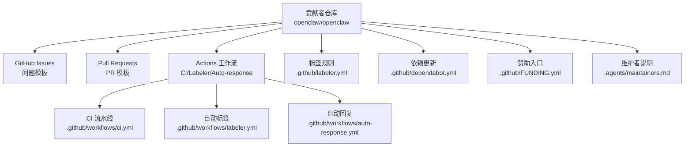
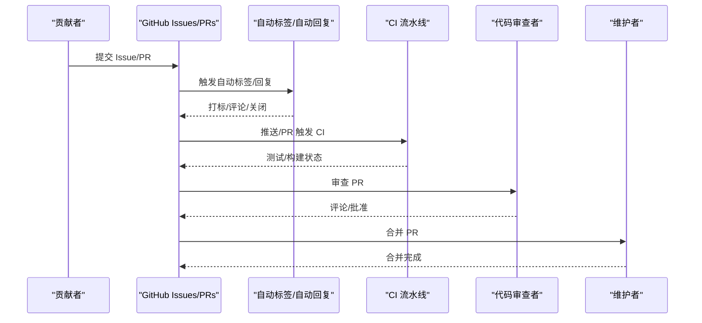
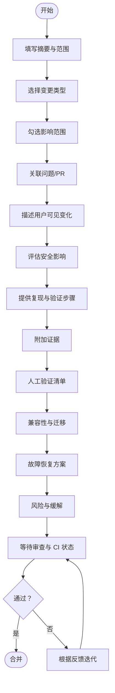
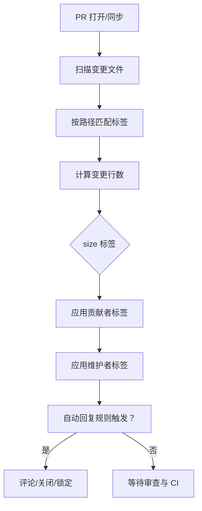
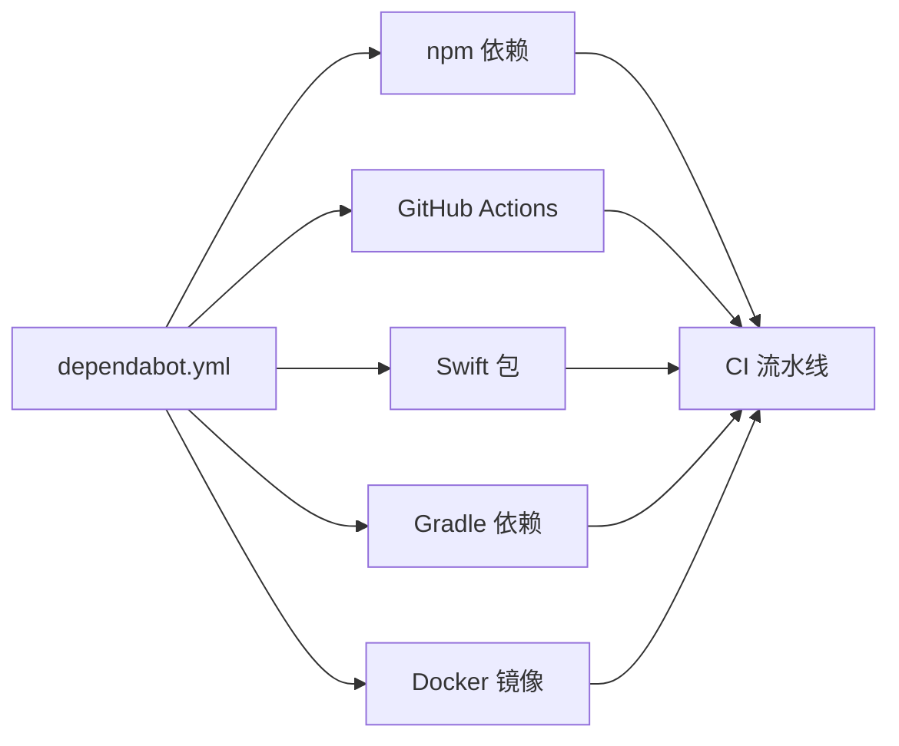

# 贡献流程与协作

<cite>
**本文引用的文件**
- [CONTRIBUTING.md](file://CONTRIBUTING.md)
- [.github/pull_request_template.md](file://.github/pull_request_template.md)
- [.github/ISSUE_TEMPLATE/bug_report.yml](file://.github/ISSUE_TEMPLATE/bug_report.yml)
- [.github/ISSUE_TEMPLATE/feature_request.yml](file://.github/ISSUE_TEMPLATE/feature_request.yml)
- [.github/ISSUE_TEMPLATE/config.yml](file://.github/ISSUE_TEMPLATE/config.yml)
- [.github/labeler.yml](file://.github/labeler.yml)
- [.github/workflows/ci.yml](file://.github/workflows/ci.yml)
- [.github/workflows/labeler.yml](file://.github/workflows/labeler.yml)
- [.github/workflows/auto-response.yml](file://.github/workflows/auto-response.yml)
- [.github/dependabot.yml](file://.github/dependabot.yml)
- [.github/FUNDING.yml](file://.github/FUNDING.yml)
- [.agents/maintainers.md](file://.agents/maintainers.md)
</cite>

## 目录

1. [简介](#简介)
2. [项目结构](#项目结构)
3. [核心组件](#核心组件)
4. [架构总览](#架构总览)
5. [详细组件分析](#详细组件分析)
6. [依赖分析](#依赖分析)
7. [性能考虑](#性能考虑)
8. [故障排查指南](#故障排查指南)
9. [结论](#结论)
10. [附录](#附录)

## 简介

本指南面向所有希望参与 OpenClaw 的贡献者，系统化阐述从问题报告到代码合并的完整协作流程。内容覆盖 GitHub 工作流、分支策略建议、Pull Request 规范、代码审查流程、标签与里程碑管理、社区参与方式、讨论平台使用、问题分类与优先级、新贡献者入门、维护者职责、冲突解决机制、贡献统计与认可、长期贡献者培养路径等。

## 项目结构

OpenClaw 采用多语言混合工程（TypeScript/JavaScript、Swift、Python、Shell），并围绕 GitHub Actions 构建持续集成流水线。贡献相关的关键位置包括：

- 贡献与行为准则：根目录 CONTRIBUTING.md
- PR 模板：.github/pull_request_template.md
- 问题模板：.github/ISSUE_TEMPLATE 下的 bug_report.yml、feature_request.yml、config.yml
- 标签与自动化：.github/labeler.yml 及其工作流 .github/workflows/labeler.yml
- 自动回复与治理：.github/workflows/auto-response.yml
- CI 流水线：.github/workflows/ci.yml
- 依赖更新：.github/dependabot.yml
- 赞助入口：.github/FUNDING.yml
- 维护者技能说明：.agents/maintainers.md

图表来源

- [.github/workflows/ci.yml](file://.github/workflows/ci.yml#L1-L820)
- [.github/workflows/labeler.yml](file://.github/workflows/labeler.yml#L1-L520)
- [.github/workflows/auto-response.yml](file://.github/workflows/auto-response.yml#L1-L348)
- [.github/labeler.yml](file://.github/labeler.yml#L1-L259)
- [.github/dependabot.yml](file://.github/dependabot.yml#L1-L127)
- [.github/FUNDING.yml](file://.github/FUNDING.yml#L1-L2)
- [.agents/maintainers.md](file://.agents/maintainers.md#L1-L2)

章节来源

- [CONTRIBUTING.md](file://CONTRIBUTING.md#L1-L160)
- [.github/pull_request_template.md](file://.github/pull_request_template.md#L1-L109)
- [.github/ISSUE_TEMPLATE/bug_report.yml](file://.github/ISSUE_TEMPLATE/bug_report.yml#L1-L96)
- [.github/ISSUE_TEMPLATE/feature_request.yml](file://.github/ISSUE_TEMPLATE/feature_request.yml#L1-L71)
- [.github/ISSUE_TEMPLATE/config.yml](file://.github/ISSUE_TEMPLATE/config.yml#L1-L9)
- [.github/labeler.yml](file://.github/labeler.yml#L1-L259)
- [.github/workflows/ci.yml](file://.github/workflows/ci.yml#L1-L820)
- [.github/workflows/labeler.yml](file://.github/workflows/labeler.yml#L1-L520)
- [.github/workflows/auto-response.yml](file://.github/workflows/auto-response.yml#L1-L348)
- [.github/dependabot.yml](file://.github/dependabot.yml#L1-L127)
- [.github/FUNDING.yml](file://.github/FUNDING.yml#L1-L2)
- [.agents/maintainers.md](file://.agents/maintainers.md#L1-L2)

## 核心组件

- 贡献者指南与维护者名单：明确贡献入口、测试要求、PR 建议、AI 协作与安全披露流程。
- 问题模板：标准化缺陷与功能请求的描述字段，提升可追踪性与可复现性。
- PR 模板：强制填写变更类型、范围、用户可见变化、安全影响、验证步骤、兼容性与回滚方案等。
- 自动标签与大小标签：按变更行数与贡献者历史自动打标，辅助优先级与审阅分配。
- 自动回复与治理：对特定标签触发自动关闭/锁定/评论，减少无效工单。
- CI 流水线：按变更范围裁剪执行矩阵，支持多平台测试与构建产物校验。
- 依赖更新：跨生态（npm、GitHub Actions、Swift、Gradle、Docker）的自动升级策略。
- 赞助入口：提供资金支持渠道。

章节来源

- [CONTRIBUTING.md](file://CONTRIBUTING.md#L62-L160)
- [.github/ISSUE_TEMPLATE/bug_report.yml](file://.github/ISSUE_TEMPLATE/bug_report.yml#L1-L96)
- [.github/ISSUE_TEMPLATE/feature_request.yml](file://.github/ISSUE_TEMPLATE/feature_request.yml#L1-L71)
- [.github/pull_request_template.md](file://.github/pull_request_template.md#L1-L109)
- [.github/labeler.yml](file://.github/labeler.yml#L1-L259)
- [.github/workflows/labeler.yml](file://.github/workflows/labeler.yml#L1-L520)
- [.github/workflows/auto-response.yml](file://.github/workflows/auto-response.yml#L1-L348)
- [.github/workflows/ci.yml](file://.github/workflows/ci.yml#L1-L820)
- [.github/dependabot.yml](file://.github/dependabot.yml#L1-L127)
- [.github/FUNDING.yml](file://.github/FUNDING.yml#L1-L2)

## 架构总览

下图展示从“问题报告”到“PR 合并”的端到端协作架构，以及自动化工具如何贯穿其中。

图表来源

- [.github/workflows/labeler.yml](file://.github/workflows/labeler.yml#L1-L520)
- [.github/workflows/auto-response.yml](file://.github/workflows/auto-response.yml#L1-L348)
- [.github/workflows/ci.yml](file://.github/workflows/ci.yml#L1-L820)

## 详细组件分析

### GitHub 工作流与分支策略

- 分支策略建议
  - 主分支：稳定发布通道，仅接受经 CI 与审查通过的 PR 合并。
  - 功能分支：按特性或修复命名，如 feature/xxx、fix/xxx，避免混杂提交。
  - 预发布分支：在大版本或重大发布前建立，集中回归与文档。
- PR 合并
  - 必须通过 CI 与审查；优先小而专一的 PR；避免“同时修复多个不相关问题”。
  - 合并后清理分支，保持仓库整洁。

章节来源

- [CONTRIBUTING.md](file://CONTRIBUTING.md#L68-L75)
- [.github/workflows/ci.yml](file://.github/workflows/ci.yml#L1-L820)

### Pull Request 规范

- 强制字段
  - 摘要：问题、原因、变更、边界。
  - 变更类型：缺陷修复、功能、重构、文档、安全加固、运维/基建。
  - 影响范围：网关/编排、技能/工具执行、认证/令牌、内存/存储、集成、API/契约、UI/DX、CI/CD/基础设施。
  - 关联问题/PR：闭合/关联链接。
  - 用户可见变化：默认值、配置变更等。
  - 安全影响：权限/能力、密钥/令牌处理、网络调用、命令执行面、数据访问范围。
  - 复现与验证：环境、步骤、期望/实际结果。
  - 证据：失败测试/日志前后对比、trace/snippets、截图/录屏、性能数据。
  - 人工验证：已验证场景、边界检查、未验证项。
  - 兼容性/迁移：向后兼容、配置/环境变更、是否需要迁移。
  - 故障恢复：快速禁用/回退方法、需恢复的文件/配置、已知异常症状。
  - 风险与缓解：列出真实风险及应对措施。

图表来源

- [.github/pull_request_template.md](file://.github/pull_request_template.md#L1-L109)

章节来源

- [.github/pull_request_template.md](file://.github/pull_request_template.md#L1-L109)

### 问题报告与模板

- 缺陷报告模板
  - 标题：简洁、可复现、证据导向。
  - 步骤：最短确定性复现路径。
  - 期望/实际：明确对比。
  - 版本/操作系统/安装方式：必要信息。
  - 日志/截图/证据：便于定位。
  - 影响与严重性：受影响用户/系统/渠道、严重程度、频率、后果。
  - 补充信息：回归起点、临时规避手段等。
- 功能请求模板
  - 标题：一句话能力陈述。
  - 问题：痛点与现状不足。
  - 解决方案：具体行为/API/UX。
  - 替代方案：权衡与弱项。
  - 影响：受众、严重度、频率、后果。
  - 证据/示例：先例、链接、截图、指标。
  - 补充信息：兼容性约束等。

章节来源

- [.github/ISSUE_TEMPLATE/bug_report.yml](file://.github/ISSUE_TEMPLATE/bug_report.yml#L1-L96)
- [.github/ISSUE_TEMPLATE/feature_request.yml](file://.github/ISSUE_TEMPLATE/feature_request.yml#L1-L71)
- [.github/ISSUE_TEMPLATE/config.yml](file://.github/ISSUE_TEMPLATE/config.yml#L1-L9)

### 标签使用与自动化

- 标签分类
  - 渠道类：按扩展/文档/源码路径映射，如 channel: discord、channel: telegram、channel: whatsapp-web 等。
  - 平台类：app: android、app: ios、app: macos、app: web-ui。
  - 子系统：gateway、docs、cli、commands、scripts、docker、agents、security。
  - 扩展类：extensions: xxx。
- 自动标签规则
  - 基于变更文件路径自动打标，确保问题/PR 与子系统/平台对应。
  - PR 大小标签：按变更行数分档（size: XS 到 XL），辅助审阅负载与优先级。
  - 贡献者标签：基于合并 PR 数量打标（trusted-contributor、experienced-contributor），鼓励长期贡献。
  - 维护者标签：对组织内维护者打标，便于快速识别。
- 自动回复规则
  - 对特定标签触发自动关闭/评论/锁定，减少无效工单与重复劳动。
  - 对 PR 标签过多或“脏”标签触发关闭，要求贡献者重新创建干净 PR。

图表来源

- [.github/labeler.yml](file://.github/labeler.yml#L1-L259)
- [.github/workflows/labeler.yml](file://.github/workflows/labeler.yml#L1-L520)
- [.github/workflows/auto-response.yml](file://.github/workflows/auto-response.yml#L1-L348)

章节来源

- [.github/labeler.yml](file://.github/labeler.yml#L1-L259)
- [.github/workflows/labeler.yml](file://.github/workflows/labeler.yml#L1-L520)
- [.github/workflows/auto-response.yml](file://.github/workflows/auto-response.yml#L1-L348)

### 代码审查流程

- 审查原则
  - 小步快跑：一次只解决一个问题，降低审查成本。
  - 可验证性：提供复现步骤、日志、截图或性能数据。
  - 安全影响：明确新增权限、令牌处理、网络调用、命令执行面、数据访问范围。
  - 兼容性：说明向后兼容性与迁移路径。
  - 文档与测试：确保变更有相应文档更新与测试覆盖。
- 审查工具
  - CI 状态：必须全部通过。
  - 自动标签：帮助识别子系统与规模，便于分配合适审查者。
  - 自动回复：对无效/重复/越界工单进行引导或关闭。

章节来源

- [.github/pull_request_template.md](file://.github/pull_request_template.md#L1-L109)
- [.github/workflows/ci.yml](file://.github/workflows/ci.yml#L1-L820)
- [.github/workflows/labeler.yml](file://.github/workflows/labeler.yml#L1-L520)
- [.github/workflows/auto-response.yml](file://.github/workflows/auto-response.yml#L1-L348)

### 里程碑管理

- 建议实践
  - 按季度/功能周期设定里程碑，将 Issue/PR 关联至对应里程碑。
  - 使用标签（如 “good first issue”、“help wanted”）辅助筛选新手友好任务。
  - 定期回顾里程碑进度，动态调整优先级。
- 与 CI/标签联动
  - 通过标签与 CI 状态可视化里程碑进展，提高透明度。

章节来源

- [CONTRIBUTING.md](file://CONTRIBUTING.md#L113-L113)
- [.github/labeler.yml](file://.github/labeler.yml#L1-L259)
- [.github/workflows/ci.yml](file://.github/workflows/ci.yml#L1-L820)

### 社区参与与讨论平台

- 讨论平台
  - Discord：帮助频道与互助频道，适合快速答疑与协作。
  - GitHub Discussions：重大设计/架构议题的讨论地。
- 参与方式
  - 新人从“good first issue”入手，逐步深入。
  - 在 Discord 中与维护者与社区成员互动，获取方向与资源。

章节来源

- [CONTRIBUTING.md](file://CONTRIBUTING.md#L65-L66)
- [.github/ISSUE_TEMPLATE/config.yml](file://.github/ISSUE_TEMPLATE/config.yml#L1-L9)

### 问题分类与优先级

- 分类
  - 缺陷（bug）、功能请求（enhancement）、文档（docs）、安全（security）等。
- 优先级
  - 由维护者结合影响范围、严重性、紧急性与资源进行排序。
  - 标签（如 size: XL、security、trusted-contributor）辅助识别与分配。

章节来源

- [.github/ISSUE_TEMPLATE/bug_report.yml](file://.github/ISSUE_TEMPLATE/bug_report.yml#L1-L96)
- [.github/ISSUE_TEMPLATE/feature_request.yml](file://.github/ISSUE_TEMPLATE/feature_request.yml#L1-L71)
- [.github/workflows/labeler.yml](file://.github/workflows/labeler.yml#L1-L520)

### 新贡献者入门指南

- 准备工作
  - 阅读贡献指南与行为准则，了解测试要求与 PR 规范。
  - 选择“good first issue”，熟悉开发与测试流程。
- 开发流程
  - Fork 仓库，创建功能分支，提交 PR 并确保 CI 通过。
  - 根据审查意见迭代，直至被合并。
- AI 协作
  - 使用 AI 辅助编写代码时，需在 PR 中标注并提供测试情况与提示/会话记录。

章节来源

- [CONTRIBUTING.md](file://CONTRIBUTING.md#L62-L103)
- [.github/pull_request_template.md](file://.github/pull_request_template.md#L1-L109)

### 维护者职责

- 责任与期望
  - 积极 triage 问题、审查 PR、推动项目前进。
  - 严格把关质量与安全，确保变更符合路线图与优先级。
- 申请成为维护者
  - 通过邮件提交申请，附上贡献链接、个人背景、兴趣领域、时间承诺等。
  - 由团队评估后决定。

章节来源

- [CONTRIBUTING.md](file://CONTRIBUTING.md#L115-L133)
- [.agents/maintainers.md](file://.agents/maintainers.md#L1-L2)

### 冲突解决机制

- 无效/重复/越界工单
  - 自动回复规则会引导至正确渠道或关闭工单。
- PR 过大或“脏”
  - 当标签过多或存在无关变更时，自动关闭并要求重新创建干净 PR。
- 争议与分歧
  - 通过 Discussions 或 Discord 达成共识，必要时由维护者仲裁。

章节来源

- [.github/workflows/auto-response.yml](file://.github/workflows/auto-response.yml#L1-L348)
- [.github/workflows/labeler.yml](file://.github/workflows/labeler.yml#L1-L520)

### 贡献统计、认可与长期培养

- 贡献统计
  - 通过合并 PR 数量与变更规模标签（trusted-contributor、experienced-contributor）识别长期贡献者。
- 认可机制
  - 在 PR/Issue 中公开致谢，必要时通过赞助入口提供资金支持。
- 培养路径
  - 从新手任务到复杂模块，逐步承担更多责任；维护者定期评估与反馈。

章节来源

- [.github/workflows/labeler.yml](file://.github/workflows/labeler.yml#L1-L520)
- [.github/FUNDING.yml](file://.github/FUNDING.yml#L1-L2)

## 依赖分析

- 依赖更新策略
  - npm 依赖：生产与开发依赖分组，限制每轮打开的 PR 数量，设置冷却期。
  - GitHub Actions：统一更新策略与分组，控制并发。
  - Swift（macOS/Shared/Macaca）：按包管理器分组更新。
  - Gradle（Android）：按模块分组更新。
  - Docker：镜像基础层更新策略。
- 与 CI 的关系
  - 依赖更新 PR 也会触发 CI，确保兼容性与稳定性。

图表来源

- [.github/dependabot.yml](file://.github/dependabot.yml#L1-L127)
- [.github/workflows/ci.yml](file://.github/workflows/ci.yml#L1-L820)

章节来源

- [.github/dependabot.yml](file://.github/dependabot.yml#L1-L127)
- [.github/workflows/ci.yml](file://.github/workflows/ci.yml#L1-L820)

## 性能考虑

- CI 并行与裁剪
  - 按变更范围裁剪 Node/macOS/Android 检查，避免不必要的资源消耗。
  - 并行分片与缓存策略提升测试效率。
- 依赖更新的节奏
  - 控制每轮打开的 PR 数量与冷却期，平衡更新频率与审查负担。

章节来源

- [.github/workflows/ci.yml](file://.github/workflows/ci.yml#L1-L820)
- [.github/dependabot.yml](file://.github/dependabot.yml#L1-L127)

## 故障排查指南

- PR 被自动关闭
  - 检查是否带有“脏”标签或标签数量过多；按提示重新创建干净 PR。
- CI 失败
  - 查看对应作业日志，确认测试/构建/格式/类型检查是否通过；按 PR 模板补充证据与验证步骤。
- 标签异常
  - 等待自动标签工作流运行；必要时手动添加/移除标签。
- 安全问题上报
  - 按贡献指南提供标题、严重性、影响、受影响组件、技术复现、影响演示、环境、修复建议等信息。

章节来源

- [.github/workflows/auto-response.yml](file://.github/workflows/auto-response.yml#L1-L348)
- [.github/workflows/labeler.yml](file://.github/workflows/labeler.yml#L1-L520)
- [.github/workflows/ci.yml](file://.github/workflows/ci.yml#L1-L820)
- [CONTRIBUTING.md](file://CONTRIBUTING.md#L135-L160)

## 结论

OpenClaw 的贡献流程以“清晰的模板、自动化的标签与回复、严格的 CI 与审查、完善的社区与资助渠道”为核心，既保障了质量与安全，又降低了新贡献者的门槛。遵循本文档的流程与规范，将有助于高效协作、加速交付，并促进长期可持续的社区发展。

## 附录

- 维护者技能说明：维护者技能现已迁移到独立仓库，参见说明文件。
- 赞助入口：提供资金支持渠道，欢迎通过赞助表达支持。

章节来源

- [.agents/maintainers.md](file://.agents/maintainers.md#L1-L2)
- [.github/FUNDING.yml](file://.github/FUNDING.yml#L1-L2)
