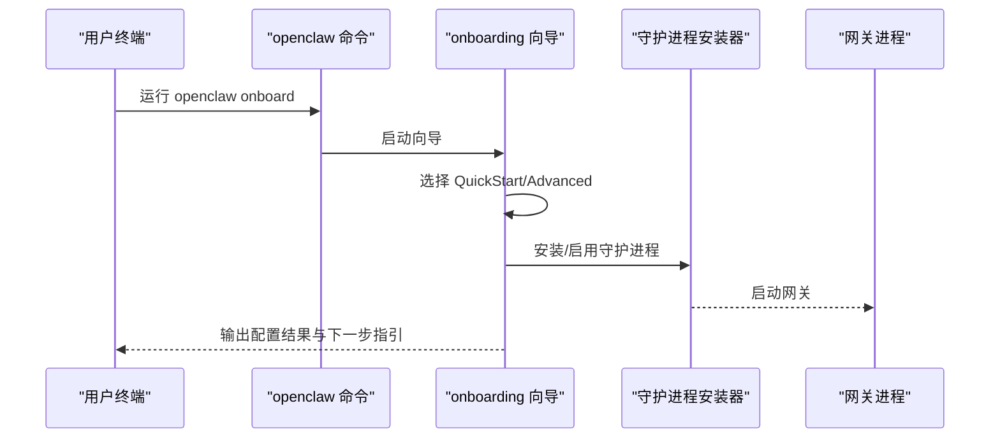

# 快速开始

<cite>
**本文引用的文件**
- [README.md](file://README.md)
- [package.json](file://package.json)
- [docs/install/index.md](file://docs/install/index.md)
- [docs/install/node.md](file://docs/install/node.md)
- [docs/install/installer.md](file://docs/install/installer.md)
- [docs/start/getting-started.md](file://docs/start/getting-started.md)
- [docs/start/wizard.md](file://docs/start/wizard.md)
- [src/cli/daemon-cli/install.ts](file://src/cli/daemon-cli/install.ts)
- [src/cli/gateway-cli/run.ts](file://src/cli/gateway-cli/run.ts)
- [openclaw.mjs](file://openclaw.mjs)
</cite>

## 目录

1. [简介](#简介)
2. [系统要求与前置条件](#系统要求与前置条件)
3. [安装与首次配置](#安装与首次配置)
4. [运行与验证](#运行与验证)
5. [使用向导完成首次配置](#使用向导完成首次配置)
6. [常见问题与故障排除](#常见问题与故障排除)
7. [结语](#结语)

## 简介

本指南面向首次接触 OpenClaw 的用户，帮助你在最短时间内完成安装、配置与首次运行。你将学会：

- 在 macOS、Linux、Windows 上安装 OpenClaw
- 使用 npm、pnpm 或 bun 进行安装
- 通过 onboarding 向导完成网关守护进程、工作空间与频道的配置
- 验证安装是否成功，并进行基础使用

## 系统要求与前置条件

- 运行时：Node.js 版本需满足要求
- 操作系统：macOS、Linux 或 Windows（强烈推荐在 Windows 上使用 WSL2）
- 包管理器：支持 npm、pnpm 或 bun；从源码构建时需要 pnpm

章节来源

- file://docs/install/index.md#L14-L22
- file://docs/install/node.md#L12-L20
- file://package.json#L236-L238

## 安装与首次配置

以下提供多平台安装路径与推荐方式。你可以选择“安装脚本”“包管理器安装”或“从源码构建”。

### 方式一：使用安装脚本（推荐）

- macOS / Linux / WSL2
  - 命令：curl 下载并执行安装脚本
  - 可选跳过 onboarding：添加相应参数
- Windows（PowerShell）
  - 命令：iwr 下载并执行安装脚本
  - 支持多种安装方法与环境变量控制

章节来源

- file://docs/install/index.md#L34-L70
- file://docs/install/installer.md#L20-L57

### 方式二：使用包管理器（npm / pnpm）

- npm
  - 全局安装后可直接运行 openclaw 命令
  - 若遇到 sharp 构建错误，可按文档指引处理
- pnpm
  - 首次安装会提示批准构建脚本，按提示操作即可

章节来源

- file://docs/install/index.md#L72-L103
- file://docs/install/index.md#L82-L90

### 方式三：从源码构建（开发场景）

- 步骤：克隆仓库 → 安装依赖 → 构建 UI 与产物 → 构建 OpenClaw → 链接 CLI 或使用 pnpm openclaw
- 推荐使用 pnpm 进行开发与调试

章节来源

- file://docs/install/index.md#L107-L140

### 方式四：Bun（仅 CLI 运行）

- 可通过 Bun 运行 CLI，适合轻量使用与快速验证

章节来源

- file://docs/install/index.md#L158-L160

## 运行与验证

安装完成后，建议先进行基础验证，确认 Node 版本、命令可用性与网关状态。

- 检查 Node 版本
- 验证 openclaw 命令是否在 PATH 中
- 查看网关状态与健康检查
- 打开控制面板进行首次聊天

章节来源

- file://docs/start/getting-started.md#L20-L26
- file://docs/install/index.md#L165-L171
- file://docs/start/getting-started.md#L64-L76

## 使用向导完成首次配置

onboarding 向导是推荐的首次配置方式，覆盖模型/认证、工作空间、网关、频道、守护进程与技能等关键步骤。

- 启动向导
  - 命令：openclaw onboard
  - 可选：--install-daemon 安装并启用网关守护进程
- QuickStart vs Advanced
  - QuickStart：默认本地网关、端口 18789、令牌认证、允许 DM 白名单等
  - Advanced：逐项自定义所有配置
- 关键配置项
  - 模型与认证：Anthropic、OpenAI 或自定义提供商
  - 工作空间：默认位于 ~/.openclaw/workspace
  - 网关：端口、绑定地址、认证模式、Tailscale 暴露
  - 频道：WhatsApp、Telegram、Discord、Google Chat、Signal、BlueBubbles、iMessage 等
  - 守护进程：根据平台自动安装 LaunchAgent 或 systemd 用户服务
  - 技能：安装推荐技能及依赖

图表来源

- [docs/start/wizard.md](file://docs/start/wizard.md#L17-L31)
- [src/cli/daemon-cli/install.ts](file://src/cli/daemon-cli/install.ts)
- [src/cli/gateway-cli/run.ts](file://src/cli/gateway-cli/run.ts)

章节来源

- file://docs/start/wizard.md#L17-L31
- file://docs/start/wizard.md#L43-L60
- file://docs/start/wizard.md#L62-L82
- file://docs/start/wizard.md#L87-L102

## 常见问题与故障排除

- openclaw 命令找不到
  - 检查全局 npm prefix 是否在 PATH 中
  - macOS/Linux：将 $(npm prefix -g)/bin 追加到 shell 启动文件
  - Windows：将 npm prefix 输出目录追加到系统 PATH
- Linux 权限错误（EACCES）
  - 将 npm 全局前缀切换到用户可写目录，并更新 PATH
- sharp/libvips 构建失败
  - 使用脚本默认忽略系统 libvips 的策略，或按文档指引安装构建工具
- Windows：找不到 git 导致 npm spawn 失败
  - 安装 Git for Windows 并重新运行安装脚本
- Windows：PowerShell 脚本无详细日志
  - 使用 PowerShell 跟踪模式进行诊断

章节来源

- file://docs/install/node.md#L91-L138
- file://docs/install/installer.md#L362-L404
- file://docs/install/index.md#L181-L204

## 结语

至此，你已掌握在各平台安装 OpenClaw 的完整流程，并通过 onboarding 向导完成了网关、工作空间与频道的首次配置。建议进一步阅读官方文档以探索更丰富的功能与高级用法。
