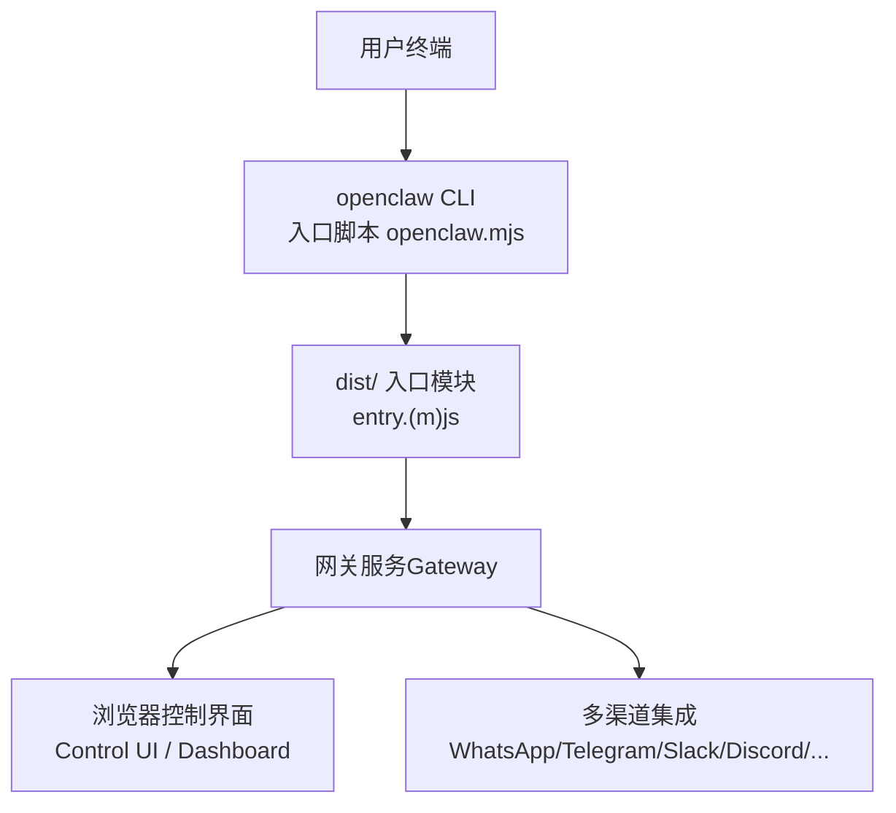
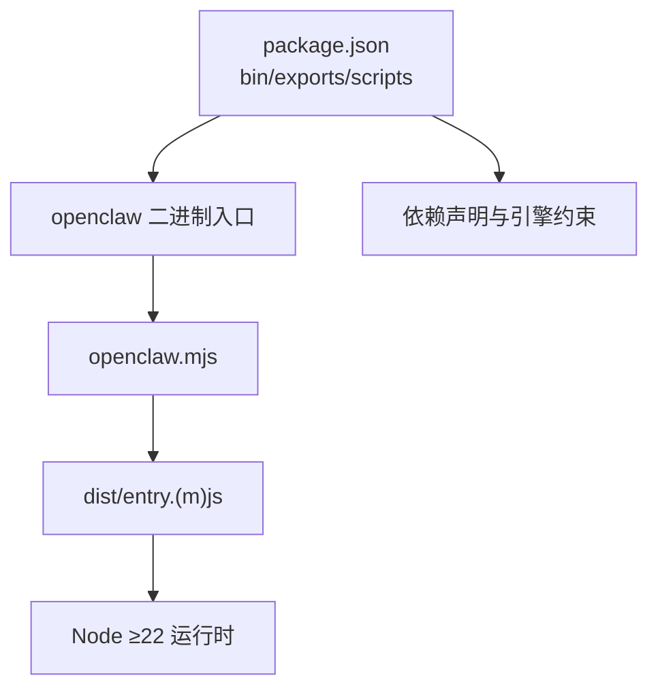

# 快速开始

<cite>
**本文引用的文件**
- [README.md](file://README.md)
- [package.json](file://package.json)
- [docs/start/getting-started.md](file://docs/start/getting-started.md)
- [docs/install/node.md](file://docs/install/node.md)
- [docs/cli/onboard.md](file://docs/cli/onboard.md)
- [docs/start/wizard.md](file://docs/start/wizard.md)
- [docs/install/updating.md](file://docs/install/updating.md)
- [openclaw.mjs](file://openclaw.mjs)
</cite>

## 目录

1. [简介](#简介)
2. [项目结构](#项目结构)
3. [核心组件](#核心组件)
4. [架构总览](#架构总览)
5. [详细组件分析](#详细组件分析)
6. [依赖分析](#依赖分析)
7. [性能考虑](#性能考虑)
8. [故障排除指南](#故障排除指南)
9. [结论](#结论)
10. [附录](#附录)

## 简介

本指南面向首次接触 OpenClaw 的用户，帮助你在最短时间内完成环境准备、安装、首次配置与向导设置，并成功运行第一个聊天会话。你将了解：

- 环境要求（Node.js 版本、操作系统支持）
- 安装步骤（npm/pnpm/bun 使用方式）
- 首次配置与 onboarding 向导使用
- 常见安装问题的解决方案
- 如何验证安装是否成功
- 如何配置基础 AI 模型与渠道连接

## 项目结构

OpenClaw 提供统一的 CLI 入口与可选的图形化控制界面（Control UI）。安装后，你可以通过 CLI 运行网关（Gateway），并通过浏览器访问控制界面进行交互。



图表来源

- [openclaw.mjs](file://openclaw.mjs#L1-L57)
- [package.json](file://package.json#L1-L219)

章节来源

- [openclaw.mjs](file://openclaw.mjs#L1-L57)
- [package.json](file://package.json#L1-L219)

## 核心组件

- CLI 入口：通过二进制 openclaw 指向 openclaw.mjs，该脚本负责加载构建产物（dist/entry.(m)js）并启动主程序。
- 网关（Gateway）：作为控制平面，承载会话、通道、工具与事件处理。
- 控制界面（Control UI / Dashboard）：通过网关提供的 WebSocket 与 HTTP 服务在浏览器中访问。
- 渠道（Channels）：支持 WhatsApp、Telegram、Slack、Discord、Google Chat、Signal、iMessage、BlueBubbles、Microsoft Teams、Matrix、Zalo、Zalo Personal、WebChat 等。

章节来源

- [README.md](file://README.md#L180-L224)
- [docs/start/getting-started.md](file://docs/start/getting-started.md#L1-L136)

## 架构总览

下图展示了从终端到网关与控制界面的整体交互路径，以及渠道接入的基本位置。

```mermaid
graph TB
subgraph "本地/远程主机"
CLI["openclaw CLI"]
GW["Gateway控制平面"]
UI["Control UI / Dashboard"]
end
subgraph "外部渠道"
WA["WhatsApp"]
TG["Telegram"]
SL["Slack"]
DC["Discord"]
GC["Google Chat"]
SI["Signal"]
IM["iMessage"]
BB["BlueBubbles"]
MT["Microsoft Teams"]
MX["Matrix"]
ZA["Zalo / Zalo Personal"]
WC["WebChat"]
end
User["用户"] --> CLI
CLI --> GW
GW --> UI
GW <- --> WA
GW <- --> TG
GW <- --> SL
GW <- --> DC
GW <- --> GC
GW <- --> SI
GW <- --> IM
GW <- --> BB
GW <- --> MT
GW <- --> MX
GW <- --> ZA
GW <- --> WC
```

图表来源

- [README.md](file://README.md#L180-L224)
- [docs/start/getting-started.md](file://docs/start/getting-started.md#L1-L136)

## 详细组件分析

### 环境要求与 Node.js 设置

- Node.js 要求：运行时需 Node ≥22。推荐使用 LTS 版本，确保兼容性与稳定性。
- 安装方式：可通过包管理器或版本管理器安装；若使用版本管理器，请确保其已在 shell 启动文件中初始化，否则可能导致 openclaw 命令不可用。
- 常见问题排查：
  - 命令未找到：检查全局 npm prefix 是否已加入 PATH；在 macOS/Linux 上可在 shell 启动文件中追加导出 PATH；Windows 请在系统环境变量中添加。
  - 权限错误：在类 Unix 系统上，将 npm 全局前缀改为用户可写目录，并更新 PATH。

章节来源

- [docs/install/node.md](file://docs/install/node.md#L10-L139)
- [package.json](file://package.json#L192-L194)

### 安装步骤（npm/pnpm/bun）

- 推荐安装方式：使用包管理器全局安装 openclaw，支持 npm 与 pnpm；不建议使用 bun 运行网关（存在已知问题）。
- 从源码安装（开发）：克隆仓库后使用 pnpm 安装依赖、构建 UI 并编译主程序；随后可通过 pnpm openclaw 或直接运行打包后的 openclaw 二进制。

章节来源

- [README.md](file://README.md#L45-L105)
- [docs/install/updating.md](file://docs/install/updating.md#L46-L72)

### 首次配置与 onboarding 向导

- 向导作用：引导你完成网关、工作区、认证与渠道的初始配置；支持交互式与非交互式两种模式。
- 使用方法：运行 openclaw onboard，选择 quickstart 流程可快速生成网关令牌；也可选择 manual/advanced 获取更细粒度的配置项。
- 常见示例：
  - 交互式：openclaw onboard
  - 快速开始：openclaw onboard --flow quickstart
  - 手动模式：openclaw onboard --flow manual
  - 远程网关：openclaw onboard --mode remote --remote-url ws://gateway-host:18789
  - 自定义提供商（兼容 OpenAI/Anthropic 的任意端点）：openclaw onboard --non-interactive --auth-choice custom-api-key ...
- 向导完成后，建议执行 openclaw doctor 与 openclaw gateway status，确认网关健康状态。

章节来源

- [docs/cli/onboard.md](file://docs/cli/onboard.md#L1-L77)
- [docs/start/wizard.md](file://docs/start/wizard.md)

### 验证安装是否成功

- 命令可用性：在新终端中输入 openclaw --version 或 openclaw dashboard，确认命令解析正常。
- 网关状态：openclaw gateway status 检查服务状态；如未安装为系统服务，可前台运行 openclaw gateway --port 18789 进行测试。
- 控制界面：打开 http://127.0.0.1:18789/，若能加载页面，表示网关已就绪。
- 日志查看：openclaw logs --follow 可持续观察运行日志。

章节来源

- [docs/start/getting-started.md](file://docs/start/getting-started.md#L64-L102)
- [docs/install/updating.md](file://docs/install/updating.md#L159-L178)

### 配置基础 AI 模型与渠道连接

- 模型配置：在首次 onboarding 中选择合适的认证方式与模型；支持自定义兼容 OpenAI/Anthropic 的端点。
- 渠道配置：向导会提示设置各渠道所需的凭据与策略；你也可以后续通过 openclaw configure 或在配置文件中调整。
- DM 安全：默认对未知发送者采用“配对”策略，需经批准后方可对话；可通过 openclaw doctor 检查 DM 策略风险。

章节来源

- [docs/cli/onboard.md](file://docs/cli/onboard.md#L29-L57)
- [README.md](file://README.md#L107-L120)

### 常见安装问题与解决方案

- openclaw 命令未找到：
  - 使用 npm prefix -g 查看全局前缀，确认其已加入 PATH；macOS/Linux 在 shell 启动文件中追加导出 PATH；Windows 在系统环境变量中添加。
- npm install -g 权限不足：
  - 将 npm 全局前缀切换至用户目录，并更新 PATH；永久生效需写入 shell 启动文件。
- 使用 bun 运行网关异常：
  - 不建议使用 bun 运行网关；优先使用 npm/pnpm。

章节来源

- [docs/install/node.md](file://docs/install/node.md#L89-L139)
- [docs/install/updating.md](file://docs/install/updating.md#L58-L58)

## 依赖分析

OpenClaw 的 CLI 通过 openclaw.mjs 加载 dist/ 下的入口模块；构建产物由 package.json 中的 scripts 与构建流程生成。运行时依赖 Node ≥22，且部分原生依赖通过 pnpm 的 onlyBuiltDependencies 管理。



图表来源

- [package.json](file://package.json#L1-L219)
- [openclaw.mjs](file://openclaw.mjs#L1-L57)

章节来源

- [package.json](file://package.json#L1-L219)
- [openclaw.mjs](file://openclaw.mjs#L1-L57)

## 性能考虑

- 优先使用 pnpm 构建与运行，以获得更快的依赖安装与打包速度。
- 在开发阶段，可使用 pnpm gateway:watch 实现热重载，提升迭代效率。
- 对于生产部署，建议将网关作为受管服务运行，并结合 doctor 与 health 检查确保稳定。

## 故障排除指南

- 更新后异常：
  - 使用 openclaw update（或重新运行安装脚本）升级；随后执行 openclaw doctor、openclaw gateway restart、openclaw health。
- 回滚策略：
  - 全局安装：固定版本号安装；源码安装：按日期回退到指定提交。
- 常用诊断命令：
  - openclaw gateway status/stop/restart
  - openclaw logs --follow
  - openclaw doctor

章节来源

- [docs/install/updating.md](file://docs/install/updating.md#L143-L232)

## 结论

通过本指南，你已完成从环境准备到首次运行的完整流程：安装 Node.js 与 openclaw、运行 onboarding 向导、验证网关状态与控制界面，并了解了基础模型与渠道配置要点。建议继续探索各渠道与技能平台，逐步扩展你的 OpenClaw 能力边界。

## 附录

- 快速开始参考：Getting Started
- Onboarding 向导参考：CLI Onboarding
- 更新与回滚：Updating
- 环境变量与高级选项：Environment
