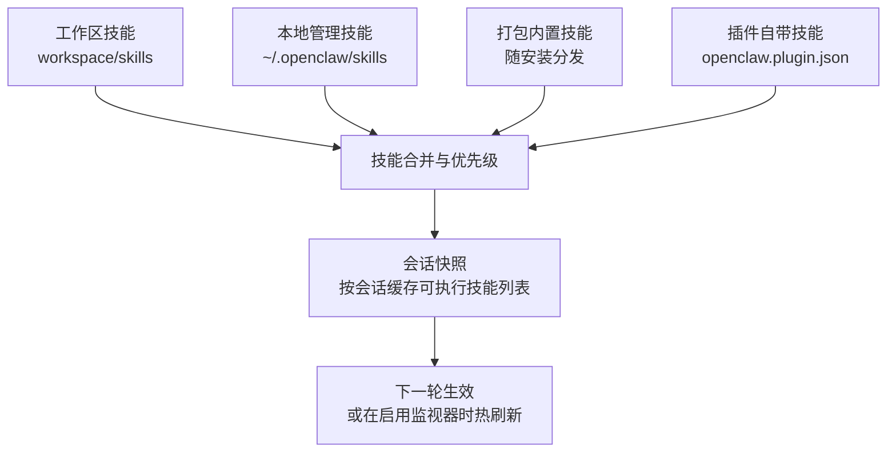
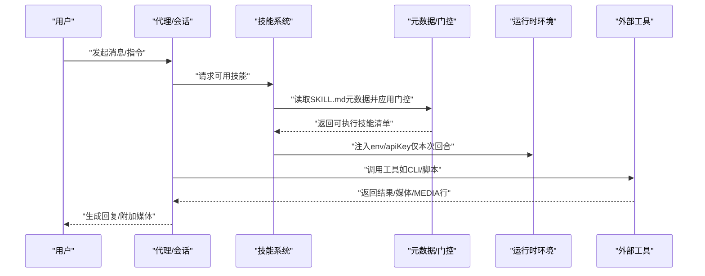
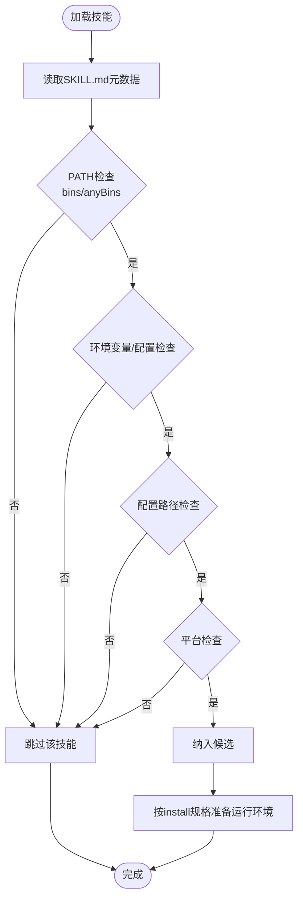

# 内置技能

<cite>
**本文引用的文件**
- [docs/tools/skills.md](file://docs/tools/skills.md)
- [docs/tools/creating-skills.md](file://docs/tools/creating-skills.md)
- [docs/tools/skills-config.md](file://docs/tools/skills-config.md)
- [skills/gemini/SKILL.md](file://skills/gemini/SKILL.md)
- [skills/peekaboo/SKILL.md](file://skills/peekaboo/SKILL.md)
- [skills/summarize/SKILL.md](file://skills/summarize/SKILL.md)
- [skills/nano-banana-pro/SKILL.md](file://skills/nano-banana-pro/SKILL.md)
- [skills/openai-whisper/SKILL.md](file://skills/openai-whisper/SKILL.md)
- [skills/session-logs/SKILL.md](file://skills/session-logs/SKILL.md)
- [skills/github/SKILL.md](file://skills/github/SKILL.md)
- [skills/discord/SKILL.md](file://skills/discord/SKILL.md)
- [skills/slack/SKILL.md](file://skills/slack/SKILL.md)
</cite>

## 目录

1. [简介](#简介)
2. [项目结构](#项目结构)
3. [核心组件](#核心组件)
4. [架构总览](#架构总览)
5. [详细组件分析](#详细组件分析)
6. [依赖分析](#依赖分析)
7. [性能考虑](#性能考虑)
8. [故障排除指南](#故障排除指南)
9. [结论](#结论)
10. [附录](#附录)

## 简介

本文件为 OpenClaw 内置技能的权威参考，覆盖以下方面：

- 技能加载与优先级：工作区、本地管理、打包内置三类来源及叠加规则
- 资源门控（Gating）：基于二进制、环境变量、配置项、操作系统等的加载过滤
- 配置与注入：全局配置、每轮运行时环境注入、会话快照与热刷新
- 内置技能一览：功能特性、使用场景、前置条件、安装方式、API/参数与返回要点
- 最佳实践：安全、性能、组合使用与扩展建议
- 故障排除与性能优化

## 项目结构

OpenClaw 的“技能”由遵循 AgentSkills 规范的目录组成，每个技能目录包含一个 SKILL.md，其中包含 YAML 前言元数据与使用说明。内置技能位于仓库的 skills 目录中；同时支持通过工作区覆盖、本地管理覆盖以及插件自带技能参与加载优先级。

图示来源

- [docs/tools/skills.md](file://docs/tools/skills.md#L13-L48)

章节来源

- [docs/tools/skills.md](file://docs/tools/skills.md#L13-L48)

## 核心组件

- 技能目录与元数据：每个技能是一个目录，包含 SKILL.md，前言包含 name、description、metadata 等字段，用于系统识别、展示与门控。
- 加载与门控：系统在加载阶段根据 metadata.openclaw 中的 requires、os、install 等字段进行筛选，并尊重用户配置覆盖。
- 运行时注入：在每次代理回合开始时，系统读取技能元数据，将配置中的 env/apiKey 注入到进程环境，构建系统提示词，结束后恢复原环境。
- 会话快照：为提升性能，系统在会话启动时对“可执行技能”做快照，后续轮次复用；可通过监视器或远程节点变化触发热刷新。
- 插件技能：插件可在 openclaw.plugin.json 中声明 skills 目录，启用后参与常规加载与优先级规则。

章节来源

- [docs/tools/skills.md](file://docs/tools/skills.md#L105-L251)
- [docs/tools/skills-config.md](file://docs/tools/skills-config.md#L1-L77)

## 架构总览

下图展示了从用户请求到技能执行的关键流程：加载与门控、会话快照、运行时注入、工具调用与结果回传。

图示来源

- [docs/tools/skills.md](file://docs/tools/skills.md#L228-L244)

章节来源

- [docs/tools/skills.md](file://docs/tools/skills.md#L228-L244)

## 详细组件分析

### 技能通用规范与门控

- 元数据与前端格式：SKILL.md 必须包含 YAML 前言，metadata 支持单行 JSON 对象；支持 homepage、user-invocable、disable-model-invocation、command-dispatch、command-tool、command-arg-mode 等键。
- 门控字段（metadata.openclaw）：
  - always：无条件包含
  - emoji/homepage：UI 展示
  - os：平台限定
  - requires.bins/anyBins：PATH 可执行文件存在性
  - requires.env：环境变量存在或需在配置中提供
  - requires.config：openclaw.json 中某路径为真
  - primaryEnv：与 skills.entries.<name>.apiKey 关联
  - install：安装器规格（brew/node/go/uv/download）
- 安装器注意事项：多安装器时优先选择；download 类型需指定 url、archive、extract、stripComponents、targetDir 等；Node 安装器受 skills.install.nodeManager 控制；Go 缺失时可先通过 Homebrew 安装 Go 并设置 GOBIN。
- 环境注入：仅在 host 运行时生效；沙箱运行时需通过 agents.defaults.sandbox.docker.env 或自定义镜像注入。

章节来源

- [docs/tools/skills.md](file://docs/tools/skills.md#L77-L186)
- [docs/tools/skills-config.md](file://docs/tools/skills-config.md#L41-L77)

### 创建自定义技能

- 目录与 SKILL.md：在工作区创建技能目录并编写 SKILL.md，使用 YAML 前言与 Markdown 指令；可定义工具或直接指导模型使用系统工具。
- 刷新与测试：通过“刷新技能”或重启网关使新技能生效；使用命令行测试自定义技能。

章节来源

- [docs/tools/creating-skills.md](file://docs/tools/creating-skills.md#L13-L55)

### 内置技能概览与使用要点

#### Gemini（gemini）

- 功能：使用 Gemini CLI 进行一次性问答、摘要与内容生成。
- 前置条件：需要 gemini 可执行文件；首次运行可能需要交互式登录。
- 安装：提供 brew 安装器规格。
- 使用场景：快速问答、JSON 输出、扩展命令查询。
- 参数与输出：遵循 gemini CLI 的命令行参数；注意避免使用高风险标志。

章节来源

- [skills/gemini/SKILL.md](file://skills/gemini/SKILL.md#L1-L44)

#### Peekaboo（peekaboo）

- 功能：macOS UI 自动化 CLI，支持截图、元素定位、输入驱动、窗口/应用管理、菜单栏/Dock 操作、视觉标注与分析。
- 前置条件：仅限 macOS；需要 peekaboo 可执行文件；需具备屏幕录制与辅助功能权限。
- 安装：提供 brew 安装器规格。
- 使用场景：自动化登录、界面操作、截图标注、批量任务。
- 参数与输出：大量子命令与参数，支持 JSON 输出与日志级别控制；推荐先 see 获取目标再执行点击/输入。

章节来源

- [skills/peekaboo/SKILL.md](file://skills/peekaboo/SKILL.md#L1-L191)

#### Summarize（summarize）

- 功能：对链接、本地文件与 YouTube 视频进行摘要或提取文本/字幕。
- 前置条件：需要 summarize 可执行文件；支持多种模型提供商的 API Key。
- 安装：提供 brew 安装器规格。
- 使用场景：快速理解长视频/文章；抽取字幕或生成摘要。
- 参数与输出：支持长度、最大输出 token、仅抽取、JSON 输出、第三方服务回退策略；可配置模型与服务令牌。

章节来源

- [skills/summarize/SKILL.md](file://skills/summarize/SKILL.md#L1-L88)

#### Nano Banana Pro（nano-banana-pro）

- 功能：通过 Gemini 3 Pro Image 生成或编辑图片；内置脚本配合 uv 运行。
- 前置条件：需要 uv；需要 GEMINI_API_KEY（可作为 primaryEnv）。
- 安装：提供 brew 安装 uv 的安装器规格。
- 使用场景：图像生成与多图合成；时间戳命名与 MEDIA 行自动附加。
- 参数与输出：脚本接受提示词、输入图、分辨率等参数；输出包含 MEDIA 行以便聊天平台自动附加媒体。

章节来源

- [skills/nano-banana-pro/SKILL.md](file://skills/nano-banana-pro/SKILL.md#L1-L59)

#### OpenAI Whisper（openai-whisper）

- 功能：本地语音转文字，无需 API Key。
- 前置条件：需要 whisper 可执行文件；首次运行会下载模型到本地缓存。
- 安装：提供 brew 安装器规格。
- 使用场景：本地音频转写、翻译任务。
- 参数与输出：支持模型选择、输出格式与目录、任务类型等；模型默认为特定版本。

章节来源

- [skills/openai-whisper/SKILL.md](file://skills/openai-whisper/SKILL.md#L1-L39)

#### Session Logs（session-logs）

- 功能：使用 jq 与 rg 搜索与分析会话历史（JSONL 文件），用于回顾旧对话或历史上下文。
- 前置条件：需要 jq 与 rg；会话日志位于固定路径。
- 使用场景：审计成本、统计消息数、检索关键词、分析工具使用情况。
- 参数与输出：通过命令行管道处理 JSONL 数据；提供常用查询模板。

章节来源

- [skills/session-logs/SKILL.md](file://skills/session-logs/SKILL.md#L1-L116)

#### GitHub（github）

- 功能：使用 gh CLI 与 GitHub 交互，支持 Issue、PR、CI 运行、API 查询等。
- 前置条件：需要 gh 可执行文件；支持多平台安装器。
- 使用场景：检查 CI 状态、列出工作流、API 高级查询、结构化输出。
- 参数与输出：支持 --json 与 --jq 过滤；需指定仓库或使用 URL。

章节来源

- [skills/github/SKILL.md](file://skills/github/SKILL.md#L1-L78)

#### Discord（discord）

- 功能：通过 discord 工具在 Discord 上发送/编辑/删除消息、反应、贴纸、表情、投票、线程、频道/角色/成员信息、机器人状态等。
- 前置条件：需要 channels.discord 配置启用；使用 OpenClaw 配置的机器人令牌。
- 使用场景：团队沟通自动化、状态反馈、资源分享、权限查询、活动管理。
- 参数与输出：大量动作对象与参数，支持禁用的动作组；注意消息 ID、频道 ID、用户 ID 的格式与复用。

章节来源

- [skills/discord/SKILL.md](file://skills/discord/SKILL.md#L1-L579)

#### Slack（slack）

- 功能：通过 slack 工具在 Slack 上反应、管理钉住、发送/编辑/删除消息、获取成员信息与表情列表。
- 前置条件：需要 channels.slack 配置启用；使用 OpenClaw 配置的机器人令牌。
- 使用场景：日常协作自动化、任务标记、知识沉淀、成员信息查询。
- 参数与输出：动作组默认开启；消息 ID 采用时间戳格式；to 字段区分频道与私信。

章节来源

- [skills/slack/SKILL.md](file://skills/slack/SKILL.md#L1-L145)

### 组合使用与协作关系

- 多平台协作：GitHub 与 Discord/Slack 可结合使用，前者用于代码与工单管理，后者用于即时沟通与状态同步。
- 自动化闭环：Peekaboo 用于界面自动化，结合 Summarize 提取页面摘要，再通过 Discord/Slack 发送结果。
- 媒体生成：Nano Banana Pro 生成/编辑图片后，通过 MEDIA 行自动附加至聊天平台消息。
- 语音处理：OpenAI Whisper 将音频转写为文本，便于后续 Summarize 或人工审阅。

章节来源

- [skills/peekaboo/SKILL.md](file://skills/peekaboo/SKILL.md#L116-L186)
- [skills/summarize/SKILL.md](file://skills/summarize/SKILL.md#L29-L75)
- [skills/discord/SKILL.md](file://skills/discord/SKILL.md#L122-L130)
- [skills/slack/SKILL.md](file://skills/slack/SKILL.md#L141-L145)
- [skills/nano-banana-pro/SKILL.md](file://skills/nano-banana-pro/SKILL.md#L48-L59)

## 依赖分析

- 二进制依赖：各技能通过 metadata.openclaw.requires.bins/anyBins 在加载期校验 PATH 是否存在；若沙箱运行，还需在容器内安装。
- 环境变量与密钥：通过 metadata.openclaw.primaryEnv 与 skills.entries.<name>.apiKey/env 注入；host 运行时注入进程环境，沙箱需通过 docker.env 或自定义镜像。
- 配置依赖：通过 metadata.openclaw.requires.config 指定 openclaw.json 中的布尔路径；未满足则技能不可用。
- 安装器：metadata.openclaw.install 定义安装器规格；skills.install.\* 控制安装偏好与包管理器。

图示来源

- [docs/tools/skills.md](file://docs/tools/skills.md#L105-L186)

章节来源

- [docs/tools/skills.md](file://docs/tools/skills.md#L105-L186)
- [docs/tools/skills-config.md](file://docs/tools/skills-config.md#L41-L77)

## 性能考虑

- 会话快照：系统在会话开始时对“可执行技能”做快照，后续轮次复用，减少重复扫描与门控开销。
- 监视器热刷新：启用后可监听 SKILL.md 变更并触发快照更新，适合开发调试。
- 提示词注入成本：当有技能可用时，系统会在系统提示词中注入紧凑的技能列表，字符开销可估算；尽量保持技能数量与描述简洁有助于降低 token 成本。
- 沙箱运行：沙箱内需确保所需二进制与网络、写根文件系统、root 权限齐全；setupCommand 可用于一次性安装依赖。

章节来源

- [docs/tools/skills.md](file://docs/tools/skills.md#L240-L284)
- [docs/tools/skills.md](file://docs/tools/skills.md#L137-L146)

## 故障排除指南

- 技能不可见或被过滤
  - 检查 PATH 中是否满足 requires.bins/anyBins；确认环境变量存在于进程或已在配置中提供；核对 openclaw.json 中对应配置路径为真；确认平台匹配。
- 环境变量未生效
  - host 运行时才注入 env/apiKey；沙箱运行时需通过 agents.defaults.sandbox.docker.env 或自定义镜像注入。
- 安装失败或二进制缺失
  - 按照 metadata.openclaw.install 规格安装；Node 安装器受 skills.install.nodeManager 控制；Go 缺失时可先通过 Homebrew 安装 Go。
- 会话变更未生效
  - 更改需在新会话开始时生效；若启用监视器，下次变更将热刷新。
- 平台限制
  - 某些技能仅限 macOS（如 Peekaboo），需在对应平台上运行或通过远程节点能力（需允许 system.run 且报告命令支持）。

章节来源

- [docs/tools/skills.md](file://docs/tools/skills.md#L105-L186)
- [docs/tools/skills.md](file://docs/tools/skills.md#L246-L251)
- [docs/tools/skills-config.md](file://docs/tools/skills-config.md#L66-L77)

## 结论

OpenClaw 的内置技能体系以 AgentSkills 规范为基础，通过明确的门控、灵活的安装器与配置注入机制，实现了跨平台、可扩展、可维护的技能生态。合理利用内置技能与组合使用，可显著提升自动化效率与用户体验。建议在生产环境中优先采用沙箱隔离、最小权限原则与安全审计，持续关注会话快照与监视器带来的性能与可观测性收益。

## 附录

- 配置参考：skills.allowBundled、skills.load.extraDirs/watch/watchDebounceMs、skills.install.preferBrew/nodeManager、skills.entries.<skillKey> 等。
- 安全建议：第三方技能视为不受信任代码；避免在提示词与日志中泄露敏感信息；优先沙箱化运行高风险工具。

章节来源

- [docs/tools/skills-config.md](file://docs/tools/skills-config.md#L1-L77)
- [docs/tools/skills.md](file://docs/tools/skills.md#L69-L76)
