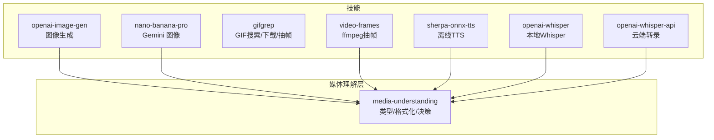
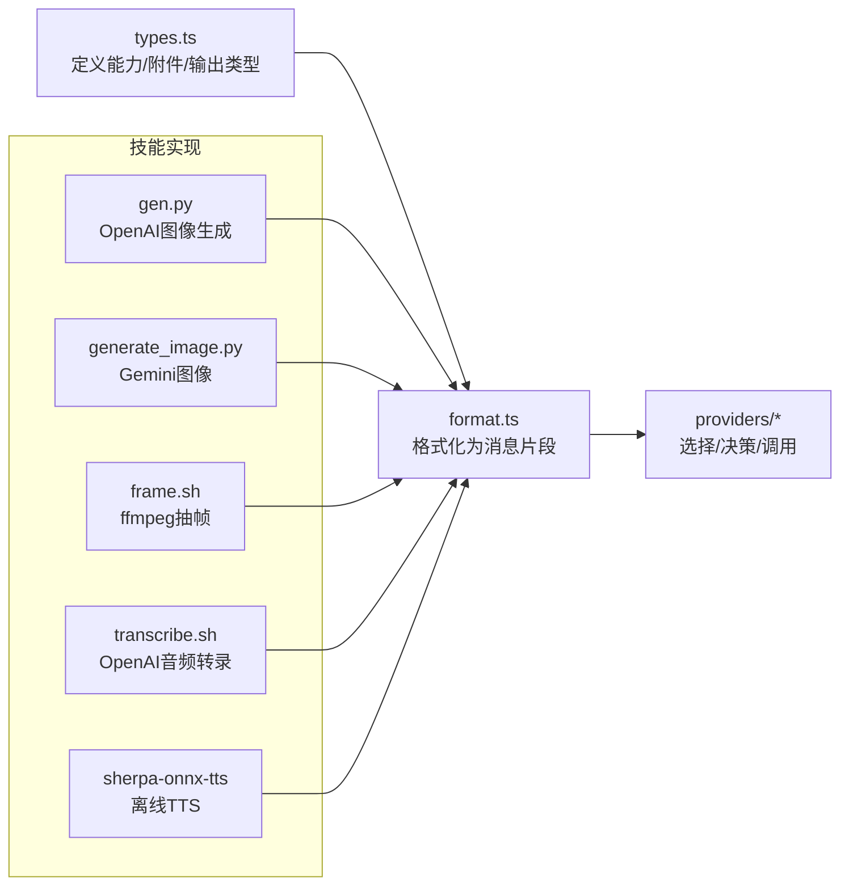
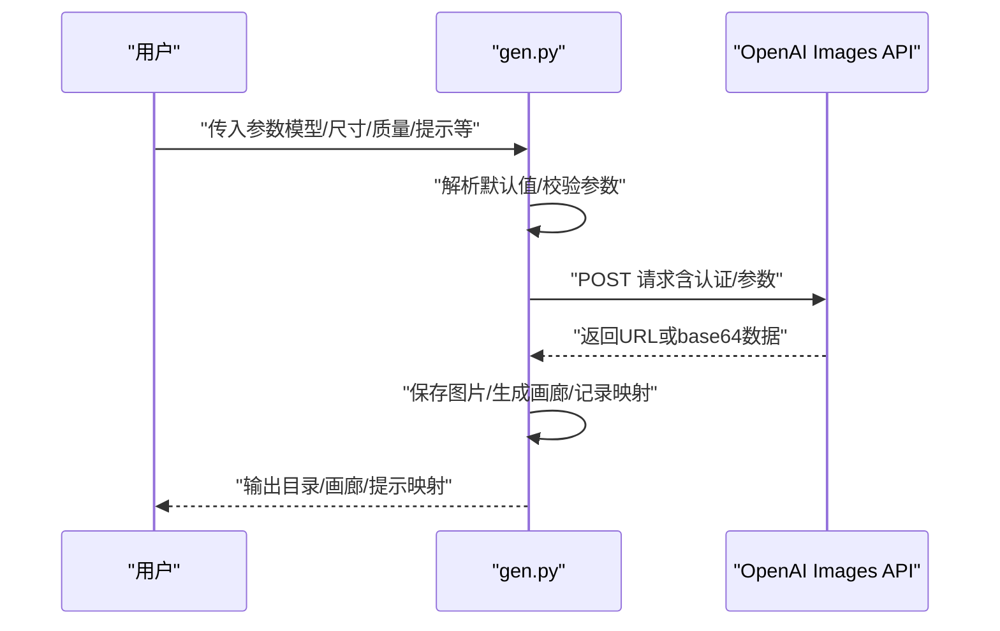
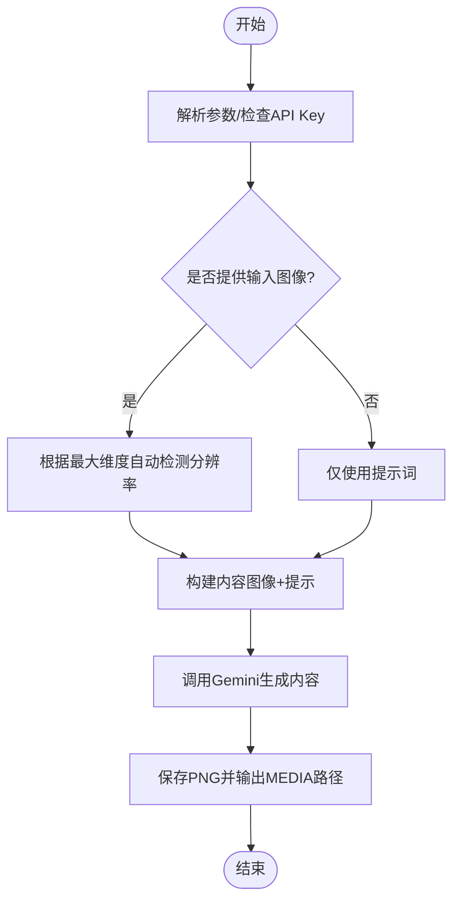
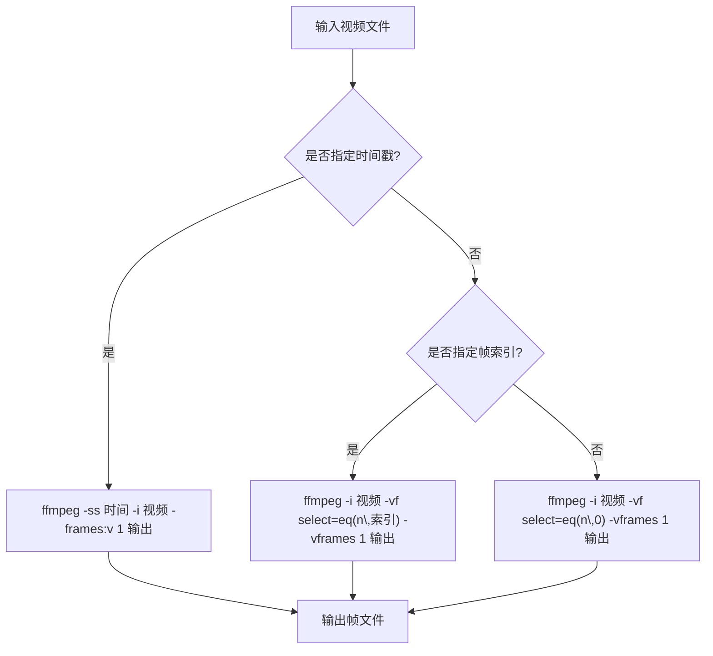
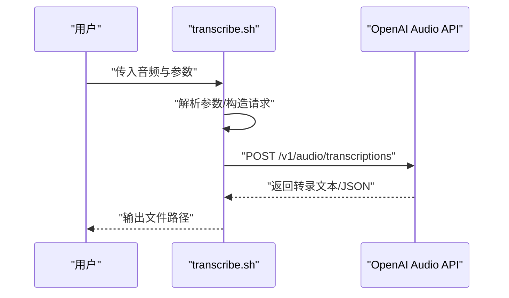
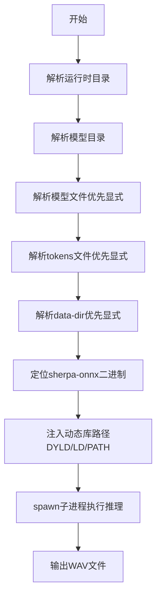
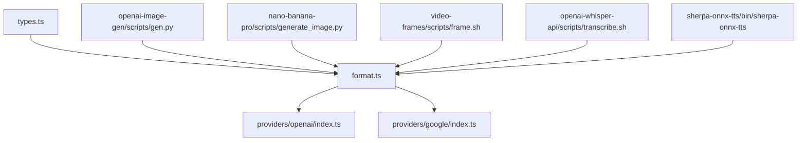

# 媒体处理技能

<cite>
**本文引用的文件**
- [openai-image-gen/SKILL.md](file://skills/openai-image-gen/SKILL.md)
- [openai-image-gen/scripts/gen.py](file://skills/openai-image-gen/scripts/gen.py)
- [nano-banana-pro/SKILL.md](file://skills/nano-banana-pro/SKILL.md)
- [nano-banana-pro/scripts/generate_image.py](file://skills/nano-banana-pro/scripts/generate_image.py)
- [gifgrep/SKILL.md](file://skills/gifgrep/SKILL.md)
- [video-frames/SKILL.md](file://skills/video-frames/SKILL.md)
- [video-frames/scripts/frame.sh](file://skills/video-frames/scripts/frame.sh)
- [sherpa-onnx-tts/SKILL.md](file://skills/sherpa-onnx-tts/SKILL.md)
- [sherpa-onnx-tts/bin/sherpa-onnx-tts](file://skills/sherpa-onnx-tts/bin/sherpa-onnx-tts)
- [openai-whisper/SKILL.md](file://skills/openai-whisper/SKILL.md)
- [openai-whisper-api/SKILL.md](file://skills/openai-whisper-api/SKILL.md)
- [openai-whisper-api/scripts/transcribe.sh](file://skills/openai-whisper-api/scripts/transcribe.sh)
- [src/media-understanding/types.ts](file://src/media-understanding/types.ts)
- [src/media-understanding/format.ts](file://src/media-understanding/format.ts)
- [src/media-understanding/providers/openai/index.ts](file://src/media-understanding/providers/openai/index.ts)
- [src/media-understanding/providers/google/index.ts](file://src/media-understanding/providers/google/index.ts)
</cite>

## 目录

1. [引言](#引言)
2. [项目结构](#项目结构)
3. [核心组件](#核心组件)
4. [架构总览](#架构总览)
5. [详细组件分析](#详细组件分析)
6. [依赖关系分析](#依赖关系分析)
7. [性能考虑](#性能考虑)
8. [故障排查指南](#故障排查指南)
9. [结论](#结论)
10. [附录](#附录)

## 引言

本文件面向OpenClaw媒体处理技能，系统化梳理图像生成（OpenAI与Google）、GIF搜索与帧提取、视频帧导出、音频转录（本地Whisper与云端OpenAI）以及离线文本转语音（sherpa-onnx）等能力。文档覆盖技术实现、参数与格式支持、调用示例、错误处理与资源优化，并给出媒体文件存储、传输与缓存策略建议，帮助开发者与用户高效、稳定地使用这些媒体技能。

## 项目结构

媒体处理技能主要分布在skills目录下的各子技能中，每个技能包含：

- 技能说明文档（SKILL.md），描述功能、安装要求、环境变量、运行示例与注意事项
- 可执行脚本或包装器，负责具体任务的调用与输出格式化
- 配套的安装与下载流程（如sherpa-onnx的多平台二进制与模型）

图表来源

- [openai-image-gen/SKILL.md](file://skills/openai-image-gen/SKILL.md#L1-L90)
- [nano-banana-pro/SKILL.md](file://skills/nano-banana-pro/SKILL.md#L1-L59)
- [gifgrep/SKILL.md](file://skills/gifgrep/SKILL.md#L1-L80)
- [video-frames/SKILL.md](file://skills/video-frames/SKILL.md#L1-L47)
- [sherpa-onnx-tts/SKILL.md](file://skills/sherpa-onnx-tts/SKILL.md#L1-L104)
- [openai-whisper/SKILL.md](file://skills/openai-whisper/SKILL.md#L1-L39)
- [openai-whisper-api/SKILL.md](file://skills/openai-whisper-api/SKILL.md#L1-L53)
- [src/media-understanding/types.ts](file://src/media-understanding/types.ts#L1-L49)

章节来源

- [openai-image-gen/SKILL.md](file://skills/openai-image-gen/SKILL.md#L1-L90)
- [nano-banana-pro/SKILL.md](file://skills/nano-banana-pro/SKILL.md#L1-L59)
- [gifgrep/SKILL.md](file://skills/gifgrep/SKILL.md#L1-L80)
- [video-frames/SKILL.md](file://skills/video-frames/SKILL.md#L1-L47)
- [sherpa-onnx-tts/SKILL.md](file://skills/sherpa-onnx-tts/SKILL.md#L1-L104)
- [openai-whisper/SKILL.md](file://skills/openai-whisper/SKILL.md#L1-L39)
- [openai-whisper-api/SKILL.md](file://skills/openai-whisper-api/SKILL.md#L1-L53)
- [src/media-understanding/types.ts](file://src/media-understanding/types.ts#L1-L49)

## 核心组件

- 图像生成
  - OpenAI图像生成：批量生成、随机提示采样、画廊输出、尺寸/质量/风格/透明背景等参数控制
  - Google Gemini Nano Banana Pro：多图合成/编辑、分辨率自动检测、PNG输出与“MEDIA:”自动附件
- 帧提取与GIF处理
  - ffmpeg抽帧：按索引或时间戳抽取单帧；支持JPG/PNG输出
  - GIF搜索：多源搜索、TUI预览、下载、抽静帧/拼接图板
- 音频转录
  - 本地Whisper：离线转写，模型缓存于本地
  - 云端OpenAI Whisper API：通过HTTP上传音频进行转录，支持语言、提示词、JSON输出
- 文本转语音
  - sherpa-onnx离线TTS：跨平台运行时+模型目录解析、动态库路径注入、VITS模型推理

章节来源

- [openai-image-gen/scripts/gen.py](file://skills/openai-image-gen/scripts/gen.py#L163-L241)
- [nano-banana-pro/scripts/generate_image.py](file://skills/nano-banana-pro/scripts/generate_image.py#L32-L185)
- [video-frames/scripts/frame.sh](file://skills/video-frames/scripts/frame.sh#L1-L82)
- [openai-whisper-api/scripts/transcribe.sh](file://skills/openai-whisper-api/scripts/transcribe.sh#L1-L86)
- [sherpa-onnx-tts/bin/sherpa-onnx-tts](file://skills/sherpa-onnx-tts/bin/sherpa-onnx-tts#L1-L179)

## 架构总览

媒体理解层统一抽象了“图像/音频/视频”的理解结果类型与格式化策略，具体能力由各技能脚本实现，部分能力可被OpenAI/Google等提供商封装后接入统一接口。

图表来源

- [src/media-understanding/types.ts](file://src/media-understanding/types.ts#L1-L49)
- [src/media-understanding/format.ts](file://src/media-understanding/format.ts#L47-L98)
- [src/media-understanding/providers/openai/index.ts](file://src/media-understanding/providers/openai/index.ts#L1-L10)
- [src/media-understanding/providers/google/index.ts](file://src/media-understanding/providers/google/index.ts#L1-L12)
- [openai-image-gen/scripts/gen.py](file://skills/openai-image-gen/scripts/gen.py#L163-L241)
- [nano-banana-pro/scripts/generate_image.py](file://skills/nano-banana-pro/scripts/generate_image.py#L32-L185)
- [video-frames/scripts/frame.sh](file://skills/video-frames/scripts/frame.sh#L1-L82)
- [openai-whisper-api/scripts/transcribe.sh](file://skills/openai-whisper-api/scripts/transcribe.sh#L1-L86)
- [sherpa-onnx-tts/bin/sherpa-onnx-tts](file://skills/sherpa-onnx-tts/bin/sherpa-onnx-tts#L1-L179)

## 详细组件分析

### 组件A：OpenAI 图像生成（批量）

- 功能要点
  - 随机但结构化的提示词池，支持指定数量批量生成
  - 模型默认值与参数兼容：尺寸、质量、背景透明度、输出格式、风格等
  - 输出包括PNG/JPEG/WEBP图片、提示映射JSON与缩略画廊HTML
- 关键流程
  - 解析参数与模型默认值
  - 调用OpenAI Images API（POST），处理返回URL或base64数据
  - 写入文件、生成画廊、记录提示映射
- 参数与格式
  - 尺寸：不同模型支持集合不同
  - 质量：不同模型支持集合不同
  - 其他：背景透明度（GPT系列）、输出格式（GPT系列）、风格（dall-e-3）
- 错误处理
  - 缺少API密钥、HTTP错误、下载失败、响应异常等情况均抛出明确错误
- 性能与优化
  - 并发生成需谨慎，避免触发速率限制；合理选择模型与尺寸
  - 使用合适的输出格式以平衡体积与质量

图表来源

- [openai-image-gen/scripts/gen.py](file://skills/openai-image-gen/scripts/gen.py#L77-L127)
- [openai-image-gen/scripts/gen.py](file://skills/openai-image-gen/scripts/gen.py#L203-L236)

章节来源

- [openai-image-gen/SKILL.md](file://skills/openai-image-gen/SKILL.md#L1-L90)
- [openai-image-gen/scripts/gen.py](file://skills/openai-image-gen/scripts/gen.py#L65-L127)
- [openai-image-gen/scripts/gen.py](file://skills/openai-image-gen/scripts/gen.py#L163-L241)

### 组件B：Google Gemini 图像（Nano Banana Pro）

- 功能要点
  - 支持生成与编辑（多图合成/编辑，最多14张）
  - 分辨率自动检测与手动指定（1K/2K/4K）
  - 输出统一为PNG，打印“MEDIA:”路径供平台自动附件
- 关键流程
  - 解析API Key与输入图像列表
  - 自动推断分辨率，构建内容（图像+提示）
  - 调用Gemini API生成内容，保存PNG并输出MEDIA标记
- 错误处理
  - 缺失API Key、输入图像过多、加载失败、无图像生成等场景均报错退出
- 性能与优化
  - 多图合成会显著增加耗时，建议控制数量与分辨率
  - 合理选择分辨率以平衡清晰度与体积

图表来源

- [nano-banana-pro/scripts/generate_image.py](file://skills/nano-banana-pro/scripts/generate_image.py#L32-L185)

章节来源

- [nano-banana-pro/SKILL.md](file://skills/nano-banana-pro/SKILL.md#L1-L59)
- [nano-banana-pro/scripts/generate_image.py](file://skills/nano-banana-pro/scripts/generate_image.py#L32-L185)

### 组件C：GIF搜索与抽帧（gifgrep）

- 功能要点
  - 搜索GIF（Tenor/Giphy），TUI预览，下载结果
  - 抽取静帧或拼接图板（网格），支持帧数、列数、间距等参数
- 环境与依赖
  - 依赖gifgrep命令行工具，可从brew或Go模块安装
  - 可选环境变量用于强制软件动画与预览几何
- 输出
  - JSON数组结果、URL管道友好字段、下载到用户下载目录、自动打开查看

章节来源

- [gifgrep/SKILL.md](file://skills/gifgrep/SKILL.md#L1-L80)

### 组件D：视频帧提取（ffmpeg）

- 功能要点
  - 支持按首帧、指定时间戳、指定帧索引抽取单帧
  - 输出JPG/PNG，便于快速分享与UI截图
- 调用方式
  - 提供脚本入口，支持--time/--index/--out等参数
- 错误处理
  - 输入文件不存在、缺少输出路径等直接报错并退出

图表来源

- [video-frames/scripts/frame.sh](file://skills/video-frames/scripts/frame.sh#L61-L79)

章节来源

- [video-frames/SKILL.md](file://skills/video-frames/SKILL.md#L1-L47)
- [video-frames/scripts/frame.sh](file://skills/video-frames/scripts/frame.sh#L1-L82)

### 组件E：OpenAI Whisper API（云端转录）

- 功能要点
  - 通过HTTP上传音频至OpenAI转录端点，支持语言、提示词、JSON输出
  - 默认模型whisper-1，输出TXT或JSON
- 调用方式
  - 提供脚本入口，支持--model/--out/--language/--prompt/--json等参数
- 错误处理
  - 缺少API Key、文件不存在、网络错误等均给出明确错误

图表来源

- [openai-whisper-api/scripts/transcribe.sh](file://skills/openai-whisper-api/scripts/transcribe.sh#L75-L83)

章节来源

- [openai-whisper-api/SKILL.md](file://skills/openai-whisper-api/SKILL.md#L1-L53)
- [openai-whisper-api/scripts/transcribe.sh](file://skills/openai-whisper-api/scripts/transcribe.sh#L1-L86)

### 组件F：本地 Whisper（离线转录）

- 功能要点
  - 本地CLI转录，无需API Key；模型首次运行自动下载至本地缓存
  - 支持任务切换（转写/翻译）、输出格式与模型选择
- 使用建议
  - 优先使用较小模型提升速度，对准确性有要求时再选用较大模型

章节来源

- [openai-whisper/SKILL.md](file://skills/openai-whisper/SKILL.md#L1-L39)

### 组件G：sherpa-onnx 离线TTS

- 功能要点
  - 跨平台离线TTS，支持多种模型与发音人
  - 运行时与模型目录解析、动态库路径注入、VITS模型推理
- 安装与配置
  - 下载对应平台运行时与模型包，配置环境变量或在配置文件中设置
- 使用建议
  - 若模型目录包含多个ONNX文件，需显式指定模型文件或通过标志覆盖
  - Windows平台可通过Node包装器直接调用

图表来源

- [sherpa-onnx-tts/bin/sherpa-onnx-tts](file://skills/sherpa-onnx-tts/bin/sherpa-onnx-tts#L18-L179)

章节来源

- [sherpa-onnx-tts/SKILL.md](file://skills/sherpa-onnx-tts/SKILL.md#L1-L104)
- [sherpa-onnx-tts/bin/sherpa-onnx-tts](file://skills/sherpa-onnx-tts/bin/sherpa-onnx-tts#L1-L179)

## 依赖关系分析

媒体理解层统一抽象能力类型与输出格式，具体能力由各技能脚本实现；OpenAI与Google提供者封装了各自的调用逻辑，便于在统一框架下调度。

图表来源

- [src/media-understanding/types.ts](file://src/media-understanding/types.ts#L1-L49)
- [src/media-understanding/format.ts](file://src/media-understanding/format.ts#L47-L98)
- [src/media-understanding/providers/openai/index.ts](file://src/media-understanding/providers/openai/index.ts#L1-L10)
- [src/media-understanding/providers/google/index.ts](file://src/media-understanding/providers/google/index.ts#L1-L12)
- [openai-image-gen/scripts/gen.py](file://skills/openai-image-gen/scripts/gen.py#L163-L241)
- [nano-banana-pro/scripts/generate_image.py](file://skills/nano-banana-pro/scripts/generate_image.py#L32-L185)
- [video-frames/scripts/frame.sh](file://skills/video-frames/scripts/frame.sh#L1-L82)
- [openai-whisper-api/scripts/transcribe.sh](file://skills/openai-whisper-api/scripts/transcribe.sh#L1-L86)
- [sherpa-onnx-tts/bin/sherpa-onnx-tts](file://skills/sherpa-onnx-tts/bin/sherpa-onnx-tts#L1-L179)

章节来源

- [src/media-understanding/types.ts](file://src/media-understanding/types.ts#L1-L49)
- [src/media-understanding/format.ts](file://src/media-understanding/format.ts#L47-L98)
- [src/media-understanding/providers/openai/index.ts](file://src/media-understanding/providers/openai/index.ts#L1-L10)
- [src/media-understanding/providers/google/index.ts](file://src/media-understanding/providers/google/index.ts#L1-L12)

## 性能考虑

- 图像生成
  - 控制批量大小与并发，避免触发速率限制；优先选择合适尺寸与质量
  - GPT系列支持透明背景与多格式输出，注意文件体积与渲染成本
- 视频帧提取
  - 优先使用--time而非--index以减少解码开销；PNG适合UI截图，JPG适合快速分享
- 音频转录
  - 本地Whisper：小模型更快，大模型更准；首次下载模型需网络开销
  - 云端OpenAI Whisper API：适合高准确度需求，注意网络与API配额
- TTS
  - 选择合适模型与发音人；Windows/Linux/macOS需正确注入动态库路径
  - 输出WAV便于后续处理，注意磁盘空间与I/O吞吐

## 故障排查指南

- 缺少API Key
  - OpenAI图像生成与Whisper API均需设置OPENAI_API_KEY；Gemini需设置GEMINI_API_KEY
- 文件与路径
  - ffmpeg/whisper/gifgrep等外部工具未安装或不在PATH；确认输入文件存在且可读
- 运行时与模型
  - sherpa-onnx需正确设置运行时与模型目录，确保动态库路径已注入；模型目录缺失必要文件时需显式指定
- 输出与附件
  - Gemini图像输出为PNG并通过“MEDIA:”标记自动附加；确认聊天平台支持该标记

章节来源

- [openai-image-gen/scripts/gen.py](file://skills/openai-image-gen/scripts/gen.py#L176-L180)
- [openai-whisper-api/scripts/transcribe.sh](file://skills/openai-whisper-api/scripts/transcribe.sh#L59-L62)
- [nano-banana-pro/scripts/generate_image.py](file://skills/nano-banana-pro/scripts/generate_image.py#L66-L74)
- [sherpa-onnx-tts/bin/sherpa-onnx-tts](file://skills/sherpa-onnx-tts/bin/sherpa-onnx-tts#L120-L132)

## 结论

OpenClaw媒体处理技能通过标准化的媒体理解层与各技能脚本，实现了从图像生成、视频帧提取、GIF处理到音频转录与离线TTS的完整链路。遵循本文档的参数配置、错误处理与性能优化建议，可在保证质量的同时提升稳定性与效率。

## 附录

- 媒体格式支持概览
  - 图像：PNG/JPEG/WEBP（取决于模型与参数）
  - 视频帧：JPG/PNG
  - 音频：WAV（TTS）、MP3/M4A等（转录输入）
- 存储、传输与缓存策略
  - 输出目录采用时间戳命名，便于归档与检索
  - 云端图像生成优先使用URL直链，本地生成则保存文件并生成画廊
  - 本地模型缓存于用户目录，首次运行时下载，后续复用
  - TTS输出WAV，建议结合压缩或分段处理以降低体积
