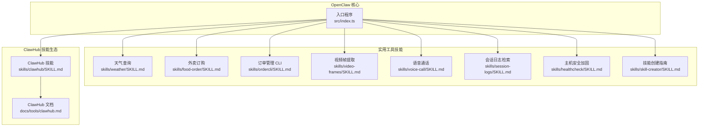
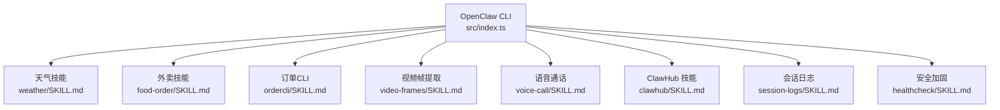
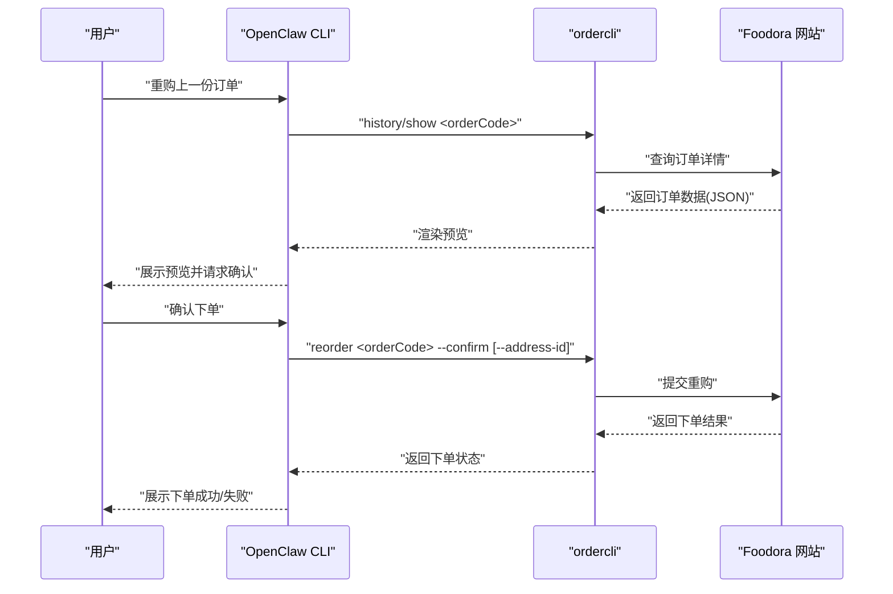
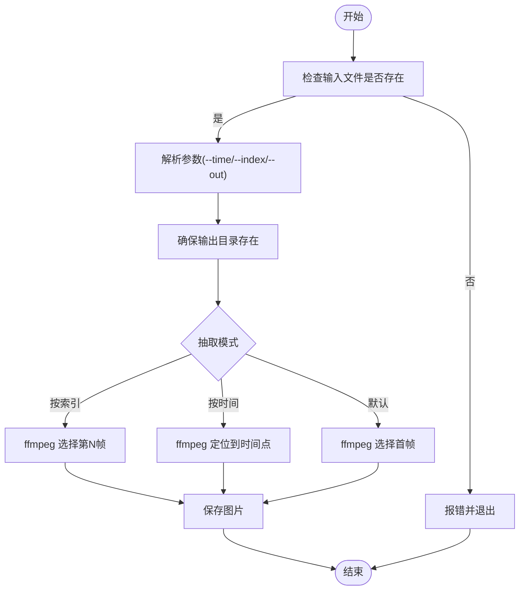
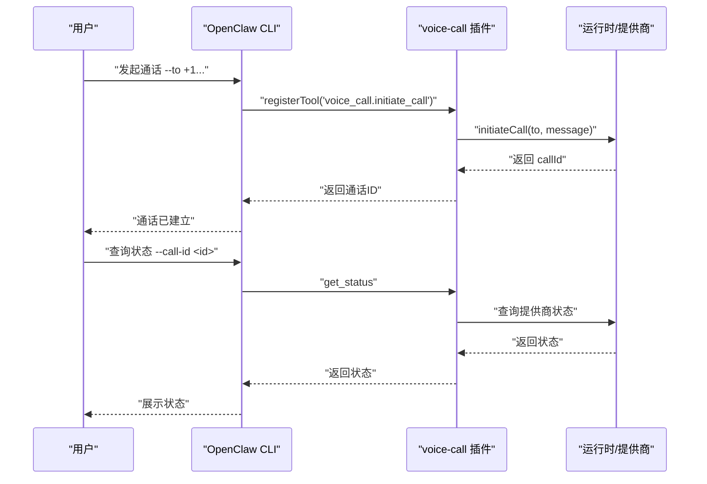
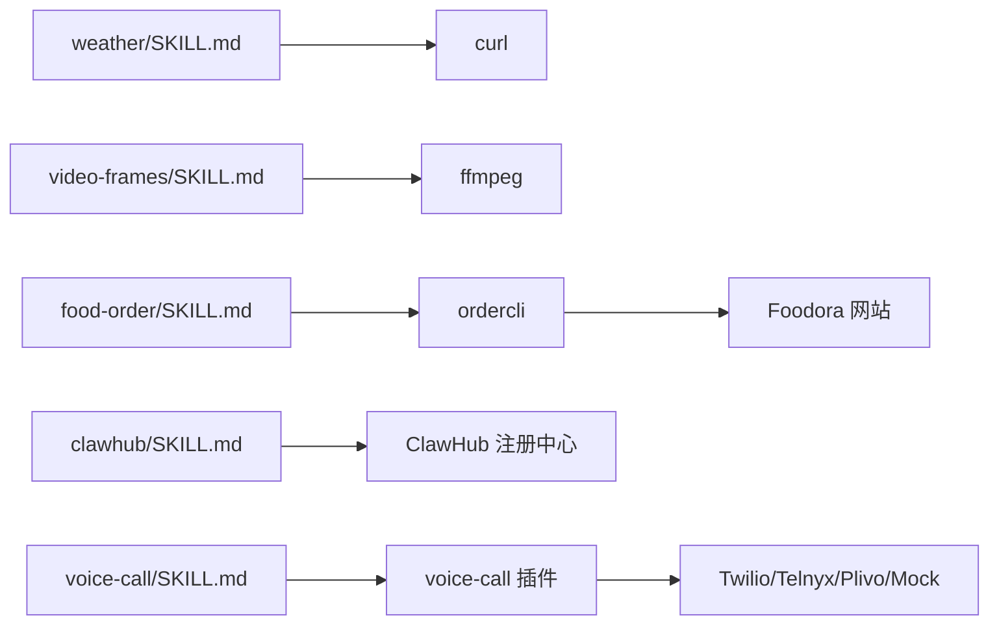

# 实用工具技能

<cite>
**本文引用的文件**
- [src/index.ts](file://src/index.ts)
- [skills/weather/SKILL.md](file://skills/weather/SKILL.md)
- [skills/food-order/SKILL.md](file://skills/food-order/SKILL.md)
- [skills/ordercli/SKILL.md](file://skills/ordercli/SKILL.md)
- [skills/clawhub/SKILL.md](file://skills/clawhub/SKILL.md)
- [docs/tools/clawhub.md](file://docs/tools/clawhub.md)
- [skills/video-frames/SKILL.md](file://skills/video-frames/SKILL.md)
- [skills/video-frames/scripts/frame.sh](file://skills/video-frames/scripts/frame.sh)
- [skills/voice-call/SKILL.md](file://skills/voice-call/SKILL.md)
- [extensions/voice-call/index.ts](file://extensions/voice-call/index.ts)
- [skills/session-logs/SKILL.md](file://skills/session-logs/SKILL.md)
- [skills/healthcheck/SKILL.md](file://skills/healthcheck/SKILL.md)
- [skills/skill-creator/SKILL.md](file://skills/skill-creator/SKILL.md)
</cite>

## 目录

1. [简介](#简介)
2. [项目结构](#项目结构)
3. [核心组件](#核心组件)
4. [架构总览](#架构总览)
5. [详细组件分析](#详细组件分析)
6. [依赖关系分析](#依赖关系分析)
7. [性能考虑](#性能考虑)
8. [故障排除指南](#故障排除指南)
9. [结论](#结论)
10. [附录](#附录)

## 简介

本文件系统性梳理 OpenClaw 的“实用工具技能”，围绕以下主题展开：天气查询、外卖订购与订单管理、监控查看、智能代理、视频帧提取、语音通话、ClawHub 技能市场。文档覆盖每个技能的应用场景、配置要求、使用方法、API/外部工具集成方式、数据获取与处理流程、实际使用案例与配置示例、定制化与扩展方法、故障排除与性能优化建议。

## 项目结构

OpenClaw 的实用工具技能主要分布在 skills 目录下，每个技能以独立文件夹形式提供自包含的使用说明与可选脚本资源。核心 CLI 入口负责解析命令、加载配置并启动相应能力。ClawHub 提供技能的发现、安装、更新与发布能力，贯穿技能生命周期管理。

图表来源

- [src/index.ts](file://src/index.ts#L1-L94)
- [skills/weather/SKILL.md](file://skills/weather/SKILL.md#L1-L55)
- [skills/food-order/SKILL.md](file://skills/food-order/SKILL.md#L1-L49)
- [skills/ordercli/SKILL.md](file://skills/ordercli/SKILL.md#L1-L79)
- [skills/video-frames/SKILL.md](file://skills/video-frames/SKILL.md#L1-L47)
- [skills/voice-call/SKILL.md](file://skills/voice-call/SKILL.md#L1-L46)
- [skills/session-logs/SKILL.md](file://skills/session-logs/SKILL.md#L1-L116)
- [skills/healthcheck/SKILL.md](file://skills/healthcheck/SKILL.md#L1-L246)
- [skills/skill-creator/SKILL.md](file://skills/skill-creator/SKILL.md#L1-L371)
- [skills/clawhub/SKILL.md](file://skills/clawhub/SKILL.md#L1-L78)
- [docs/tools/clawhub.md](file://docs/tools/clawhub.md#L1-L206)

章节来源

- [src/index.ts](file://src/index.ts#L1-L94)

## 核心组件

- 天气查询：基于免费公共服务（wttr.in 为主、open-meteo 为备选），无需 API 密钥，适合快速获取当前天气与简要预报。
- 外卖订购与订单管理：通过 ordercli 对 Foodora 订单进行历史查询、预览重购、下单确认与实时跟踪，强调“先预览、再确认”的安全原则。
- 视频帧提取：基于 ffmpeg 的命令行工具，支持按时间戳或帧索引抽取画面，便于快速生成缩略图或审查关键帧。
- 语音通话：通过 voice-call 插件提供发起通话、状态查询、转写与播报等能力，支持多提供商（Twilio/Telnyx/Plivo/Mock）。
- ClawHub：提供技能搜索、安装、更新、发布与同步的 CLI 工作流，统一管理技能版本与权限。
- 会话日志检索：基于 jq/ripgrep 对会话 JSONL 进行全文检索、成本统计、工具调用分析等。
- 主机安全加固：面向部署环境的安全审计、风险评估、合规建议与周期性检查调度。
- 技能创建指南：提供技能设计原则、资源组织、打包与迭代的最佳实践。

章节来源

- [skills/weather/SKILL.md](file://skills/weather/SKILL.md#L1-L55)
- [skills/food-order/SKILL.md](file://skills/food-order/SKILL.md#L1-L49)
- [skills/ordercli/SKILL.md](file://skills/ordercli/SKILL.md#L1-L79)
- [skills/video-frames/SKILL.md](file://skills/video-frames/SKILL.md#L1-L47)
- [skills/voice-call/SKILL.md](file://skills/voice-call/SKILL.md#L1-L46)
- [skills/clawhub/SKILL.md](file://skills/clawhub/SKILL.md#L1-L78)
- [docs/tools/clawhub.md](file://docs/tools/clawhub.md#L1-L206)
- [skills/session-logs/SKILL.md](file://skills/session-logs/SKILL.md#L1-L116)
- [skills/healthcheck/SKILL.md](file://skills/healthcheck/SKILL.md#L1-L246)
- [skills/skill-creator/SKILL.md](file://skills/skill-creator/SKILL.md#L1-L371)

## 架构总览

OpenClaw 的实用工具技能遵循“技能即插即用”的模块化设计。核心 CLI 负责加载配置、解析命令并路由到对应技能；部分技能依赖外部二进制（如 curl、ffmpeg、ordercli、clawhub）或第三方服务（如 wttr.in、open-meteo）。ClawHub 作为技能生态的注册中心，提供版本化分发与工作区优先加载策略。

图表来源

- [src/index.ts](file://src/index.ts#L1-L94)
- [skills/weather/SKILL.md](file://skills/weather/SKILL.md#L1-L55)
- [skills/food-order/SKILL.md](file://skills/food-order/SKILL.md#L1-L49)
- [skills/ordercli/SKILL.md](file://skills/ordercli/SKILL.md#L1-L79)
- [skills/video-frames/SKILL.md](file://skills/video-frames/SKILL.md#L1-L47)
- [skills/voice-call/SKILL.md](file://skills/voice-call/SKILL.md#L1-L46)
- [skills/clawhub/SKILL.md](file://skills/clawhub/SKILL.md#L1-L78)
- [skills/session-logs/SKILL.md](file://skills/session-logs/SKILL.md#L1-L116)
- [skills/healthcheck/SKILL.md](file://skills/healthcheck/SKILL.md#L1-L246)

## 详细组件分析

### 天气查询（weather）

- 应用场景
  - 快速获取当前天气与简要预报，适合日常提醒、行程规划与跨城市对比。
- 配置与前置条件
  - 依赖 curl；无需 API 密钥。
- 使用方法
  - 通过 wttr.in 获取简洁格式或完整预报；必要时切换单位与编码。
  - 当 wttr.in 不可用时，可回退至 open-meteo 的 JSON 接口。
- 数据获取与处理
  - 直接 HTTP 请求获取文本/JSON；根据格式参数选择输出样式。
- 实际使用案例
  - 查询伦敦天气、按需输出 PNG 图片、按机场代码查询。
- 定制化与扩展
  - 可封装为函数或工具，增加缓存、多城市聚合、本地化展示。
- 性能与可靠性
  - 低延迟、无密钥开销；网络抖动时建议增加重试与降级策略。

章节来源

- [skills/weather/SKILL.md](file://skills/weather/SKILL.md#L1-L55)

### 外卖订购（food-order）与订单管理（ordercli）

- 应用场景
  - 安全地重购过往 Foodora 订单，先预览后确认，避免误操作。
- 配置与前置条件
  - 依赖 ordercli；首次使用需设置国家、登录账户（密码或无密码会话导入）。
- 使用方法
  - 查看历史订单、预览重购、确认下单、跟踪 ETA。
- 数据获取与处理
  - 通过 ordercli 与 Foodora 网站交互，支持 JSON 输出便于机器消费。
- 实际使用案例
  - 未确认前仅预览；多地址场景明确地址 ID；测试使用临时配置文件。
- 定制化与扩展
  - 可扩展对 Deliveroo 的支持；增加自动下单策略与风控校验。
- 性能与可靠性
  - 注意反爬虫与会话有效期；建议使用浏览器登录与会话复用。

图表来源

- [skills/food-order/SKILL.md](file://skills/food-order/SKILL.md#L1-L49)
- [skills/ordercli/SKILL.md](file://skills/ordercli/SKILL.md#L1-L79)

章节来源

- [skills/food-order/SKILL.md](file://skills/food-order/SKILL.md#L1-L49)
- [skills/ordercli/SKILL.md](file://skills/ordercli/SKILL.md#L1-L79)

### 视频帧提取（video-frames）

- 应用场景
  - 从视频中抽取关键帧或指定时间点画面，用于审查、截图或生成缩略图。
- 配置与前置条件
  - 依赖 ffmpeg；脚本提供参数校验与错误提示。
- 使用方法
  - 指定输入视频、时间戳或帧索引、输出路径；支持默认首帧与 PNG/JPG 选择。
- 数据获取与处理
  - 调用 ffmpeg 执行抽取，输出文件路径由脚本返回。
- 实际使用案例
  - 快速定位视频某时刻画面、生成 UI 截图。
- 定制化与扩展
  - 可批量处理、并行加速、生成 GIF/短视频片段。
- 性能与可靠性
  - 大文件注意内存与磁盘 IO；可结合进度条与断点续传。

图表来源

- [skills/video-frames/scripts/frame.sh](file://skills/video-frames/scripts/frame.sh#L1-L81)
- [skills/video-frames/SKILL.md](file://skills/video-frames/SKILL.md#L1-L47)

章节来源

- [skills/video-frames/SKILL.md](file://skills/video-frames/SKILL.md#L1-L47)
- [skills/video-frames/scripts/frame.sh](file://skills/video-frames/scripts/frame.sh#L1-L81)

### 语音通话（voice-call）

- 应用场景
  - 通过插件发起或查询电话状态，支持多种提供商与模拟环境。
- 配置与前置条件
  - 需启用 voice-call 插件；在配置中声明提供商与号码信息。
- 使用方法
  - CLI：发起通话、查询状态；工具：initiate_call/continue_call/speak_to_user/end_call/get_status。
- 数据获取与处理
  - 插件内部管理运行时与提供商 SDK；CLI 与工具均通过统一接口访问。
- 实际使用案例
  - 自动通知、转写对话、播报消息。
- 定制化与扩展
  - 新增提供商适配、增强转写与 TTS 集成。
- 性能与可靠性
  - 关注网络与提供商 SLA；提供 Mock 降低开发成本。

图表来源

- [skills/voice-call/SKILL.md](file://skills/voice-call/SKILL.md#L1-L46)
- [extensions/voice-call/index.ts](file://extensions/voice-call/index.ts#L480-L512)

章节来源

- [skills/voice-call/SKILL.md](file://skills/voice-call/SKILL.md#L1-L46)
- [extensions/voice-call/index.ts](file://extensions/voice-call/index.ts#L480-L512)

### ClawHub 技能市场（clawhub）

- 应用场景
  - 搜索、安装、更新、发布与同步技能，统一版本与权限管理。
- 配置与前置条件
  - 安装 clawhub CLI；登录后可发布与同步。
- 使用方法
  - 搜索、安装、更新、列出、发布、同步等命令；支持版本与标签管理。
- 数据获取与处理
  - 通过注册中心 API 拉取/推送技能包；更新时进行哈希比对与升级。
- 实际使用案例
  - 新用户快速获取所需技能；团队内共享与审计。
- 定制化与扩展
  - 自建私有注册中心、扩展审核与权限控制。
- 性能与可靠性
  - 并发检查与增量同步；网络异常时重试与断点续传。

章节来源

- [skills/clawhub/SKILL.md](file://skills/clawhub/SKILL.md#L1-L78)
- [docs/tools/clawhub.md](file://docs/tools/clawhub.md#L1-L206)

### 会话日志检索（session-logs）

- 应用场景
  - 检索历史会话、关键词搜索、成本统计、工具使用分析。
- 配置与前置条件
  - 依赖 jq 与 ripgrep；会话日志位于用户目录下的工作区。
- 使用方法
  - 列举会话、按日期筛选、提取用户/助手消息、统计成本与工具调用。
- 数据获取与处理
  - 解析 JSONL 结构，利用 jq/ripgrep 进行过滤与汇总。
- 实际使用案例
  - 回溯上下文、审计成本、分析工具使用频率。
- 定制化与扩展
  - 增加可视化报告、导出 CSV/PDF。
- 性能与可靠性
  - 大文件建议分段处理与缓存中间结果。

章节来源

- [skills/session-logs/SKILL.md](file://skills/session-logs/SKILL.md#L1-L116)

### 主机安全加固（healthcheck）

- 应用场景
  - 安全审计、防火墙/SSH/更新策略检查、风险评估与周期性巡检。
- 配置与前置条件
  - 遵循最小权限与可逆原则；执行前需明确用户授权。
- 使用方法
  - 读取系统上下文、运行安全审计、确定风险姿态、生成整改计划、调度周期任务。
- 数据获取与处理
  - 通过命令行与 OpenClaw 安全子命令收集信息，形成可执行清单。
- 实际使用案例
  - VPS 硬化、个人工作站加固、容器/远程主机巡检。
- 定制化与扩展
  - 自定义风险档案、对接企业合规基线。
- 性能与可靠性
  - 读取型检查尽量幂等；变更型操作必须可回滚。

章节来源

- [skills/healthcheck/SKILL.md](file://skills/healthcheck/SKILL.md#L1-L246)

### 技能创建指南（skill-creator）

- 应用场景
  - 设计、打包与迭代技能，确保触发准确、资源组织合理、上下文高效。
- 配置与前置条件
  - 明确技能边界与触发条件；资源按需拆分至 scripts/references/assets。
- 使用方法
  - 初始化模板、编辑 SKILL.md、打包分发、持续迭代。
- 数据获取与处理
  - 采用渐进披露设计，按需加载参考材料。
- 实际使用案例
  - 从零构建领域专用技能、复用现有工作流。
- 定制化与扩展
  - 多变体/多框架组织、条件化细节链接。
- 性能与可靠性
  - 控制 SKILL.md 长度与上下文占用；脚本可免上下文执行。

章节来源

- [skills/skill-creator/SKILL.md](file://skills/skill-creator/SKILL.md#L1-L371)

## 依赖关系分析

- 外部二进制依赖
  - curl：天气查询
  - ffmpeg：视频帧提取
  - ordercli：外卖订单管理
  - clawhub：技能生态 CLI
- 插件与运行时
  - voice-call 插件提供通话能力，需在配置中启用并设置提供商参数。
- 文档与技能映射
  - 技能 SKILL.md 与 ClawHub 文档共同构成技能使用与生态管理的双轨说明。

图表来源

- [skills/weather/SKILL.md](file://skills/weather/SKILL.md#L1-L55)
- [skills/video-frames/SKILL.md](file://skills/video-frames/SKILL.md#L1-L47)
- [skills/food-order/SKILL.md](file://skills/food-order/SKILL.md#L1-L49)
- [skills/clawhub/SKILL.md](file://skills/clawhub/SKILL.md#L1-L78)
- [skills/voice-call/SKILL.md](file://skills/voice-call/SKILL.md#L1-L46)
- [extensions/voice-call/index.ts](file://extensions/voice-call/index.ts#L480-L512)

章节来源

- [skills/weather/SKILL.md](file://skills/weather/SKILL.md#L1-L55)
- [skills/video-frames/SKILL.md](file://skills/video-frames/SKILL.md#L1-L47)
- [skills/food-order/SKILL.md](file://skills/food-order/SKILL.md#L1-L49)
- [skills/clawhub/SKILL.md](file://skills/clawhub/SKILL.md#L1-L78)
- [skills/voice-call/SKILL.md](file://skills/voice-call/SKILL.md#L1-L46)
- [extensions/voice-call/index.ts](file://extensions/voice-call/index.ts#L480-L512)

## 性能考虑

- 天气查询
  - 优先使用 wttr.in 的轻量接口；必要时缓存响应；对 open-meteo 的 JSON 响应做字段裁剪。
- 外卖订单
  - 预览阶段避免写入操作；批量重购时增加速率限制与去重；会话复用减少登录成本。
- 视频帧提取
  - 大文件分块处理；并行抽取多个时间点；输出格式按用途选择（PNG/JPG）。
- 语音通话
  - 选择就近提供商节点；对转写与 TTS 增加重试与降级；Mock 环境用于开发联调。
- ClawHub
  - 并发检查与增量同步；离线缓存常用技能元数据；网络异常时指数退避。
- 会话日志
  - 分页与采样读取；对大文件使用 head/tail；索引化常用查询。
- 安全加固
  - 读取型检查幂等化；变更型操作记录回滚点；最小化变更窗口。

## 故障排除指南

- 天气查询
  - 现象：无法获取天气
  - 排查：检查网络连通性、是否使用了正确的格式参数、是否需要编码空格
  - 参考：[skills/weather/SKILL.md](file://skills/weather/SKILL.md#L1-L55)
- 外卖订单
  - 现象：重购失败或被拦截
  - 排查：确认预览无误后再确认；检查地址 ID；尝试浏览器登录或会话导入
  - 参考：[skills/food-order/SKILL.md](file://skills/food-order/SKILL.md#L1-L49)、[skills/ordercli/SKILL.md](file://skills/ordercli/SKILL.md#L1-L79)
- 视频帧提取
  - 现象：抽取失败或输出为空
  - 排查：检查输入文件存在性、时间戳格式、输出目录权限
  - 参考：[skills/video-frames/scripts/frame.sh](file://skills/video-frames/scripts/frame.sh#L1-L81)
- 语音通话
  - 现象：通话无法发起或状态异常
  - 排查：确认插件已启用、提供商配置正确、号码格式符合 E.164
  - 参考：[skills/voice-call/SKILL.md](file://skills/voice-call/SKILL.md#L1-L46)、[extensions/voice-call/index.ts](file://extensions/voice-call/index.ts#L480-L512)
- ClawHub
  - 现象：安装/更新失败或版本不匹配
  - 排查：检查登录状态、工作区路径、版本标签；必要时强制覆盖
  - 参考：[skills/clawhub/SKILL.md](file://skills/clawhub/SKILL.md#L1-L78)、[docs/tools/clawhub.md](file://docs/tools/clawhub.md#L1-L206)
- 会话日志
  - 现象：检索缓慢或结果不全
  - 排查：确认会话文件路径、使用 jq/ripgrep 的合适参数、避免全量扫描
  - 参考：[skills/session-logs/SKILL.md](file://skills/session-logs/SKILL.md#L1-L116)
- 安全加固
  - 现象：变更后无法远程访问
  - 排查：确认访问路径与回滚方案、逐项验证防火墙规则与端口状态
  - 参考：[skills/healthcheck/SKILL.md](file://skills/healthcheck/SKILL.md#L1-L246)

章节来源

- [skills/weather/SKILL.md](file://skills/weather/SKILL.md#L1-L55)
- [skills/food-order/SKILL.md](file://skills/food-order/SKILL.md#L1-L49)
- [skills/ordercli/SKILL.md](file://skills/ordercli/SKILL.md#L1-L79)
- [skills/video-frames/scripts/frame.sh](file://skills/video-frames/scripts/frame.sh#L1-L81)
- [skills/voice-call/SKILL.md](file://skills/voice-call/SKILL.md#L1-L46)
- [extensions/voice-call/index.ts](file://extensions/voice-call/index.ts#L480-L512)
- [skills/clawhub/SKILL.md](file://skills/clawhub/SKILL.md#L1-L78)
- [docs/tools/clawhub.md](file://docs/tools/clawhub.md#L1-L206)
- [skills/session-logs/SKILL.md](file://skills/session-logs/SKILL.md#L1-L116)
- [skills/healthcheck/SKILL.md](file://skills/healthcheck/SKILL.md#L1-L246)

## 结论

OpenClaw 的实用工具技能以“安全、可审计、可扩展”为核心设计原则，覆盖日常任务与运维需求。通过清晰的触发条件、最小化的外部依赖与完善的生态工具链（ClawHub），用户可在不同场景下快速组合与复用技能，同时保持对关键动作的可控与可观测。

## 附录

- 快速参考
  - 天气：使用 wttr.in 获取当前天气与简要预报
  - 外卖：先预览后确认，使用 ordercli 管理订单
  - 视频：使用 ffmpeg 抽取关键帧或指定时间点画面
  - 通话：启用 voice-call 插件，配置提供商参数后发起通话
  - 技能：使用 clawhub 搜索、安装、更新与发布技能
  - 日志：使用 jq/ripgrep 检索会话历史与分析指标
  - 安全：按风险姿态执行审计与整改，定期调度巡检
