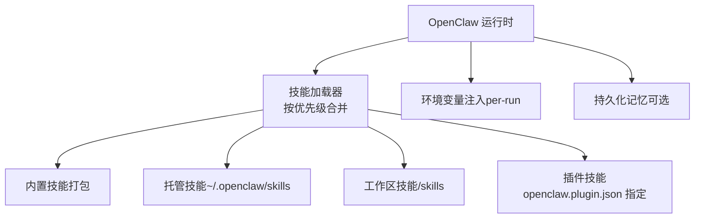
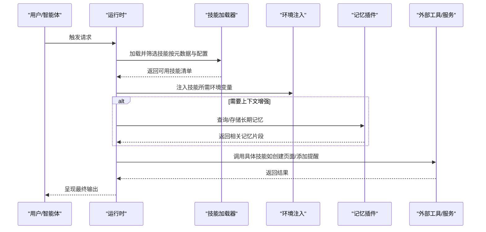
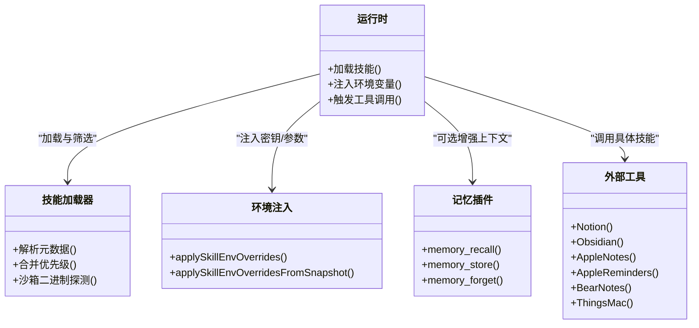

# 生产力工具技能

<cite>
**本文引用的文件**
- [skills/notion/SKILL.md](file://skills/notion/SKILL.md)
- [skills/obsidian/SKILL.md](file://skills/obsidian/SKILL.md)
- [skills/apple-notes/SKILL.md](file://skills/apple-notes/SKILL.md)
- [skills/apple-reminders/SKILL.md](file://skills/apple-reminders/SKILL.md)
- [skills/bear-notes/SKILL.md](file://skills/bear-notes/SKILL.md)
- [skills/things-mac/SKILL.md](file://skills/things-mac/SKILL.md)
- [docs/tools/skills.md](file://docs/tools/skills.md)
- [docs/tools/skills-config.md](file://docs/tools/skills-config.md)
- [extensions/memory-core/index.ts](file://extensions/memory-core/index.ts)
- [extensions/memory-lancedb/index.ts](file://extensions/memory-lancedb/index.ts)
- [src/agents/skills/env-overrides.ts](file://src/agents/skills/env-overrides.ts)
</cite>

## 目录

1. [简介](#简介)
2. [项目结构](#项目结构)
3. [核心组件](#核心组件)
4. [架构总览](#架构总览)
5. [详细组件分析](#详细组件分析)
6. [依赖关系分析](#依赖关系分析)
7. [性能考量](#性能考量)
8. [故障排查指南](#故障排查指南)
9. [结论](#结论)
10. [附录](#附录)

## 简介

本文件面向OpenClaw生产力工具技能，系统化梳理笔记应用与任务管理相关内置技能：Notion、Obsidian、Apple Notes、Apple Reminders、Bear Notes、Things Mac。内容覆盖功能特性、配置项与使用方法；说明各技能的“前置条件（环境/二进制/权限）”、可执行操作、参数要点与集成方式；并提供跨技能协作与数据同步策略、常见问题排查与性能优化建议。同时补充OpenClaw技能体系的加载、筛选、注入与持久化记忆能力，帮助读者在多平台与多工具间建立稳定、可维护的工作流。

## 项目结构

OpenClaw通过“技能（Skill）”目录中的SKILL.md与元数据定义，将外部工具或服务的能力暴露给智能体。技能支持按优先级从三处加载：打包内置、用户托管（~/.openclaw/skills）、工作区覆盖（<workspace>/skills）。此外，插件可自带技能目录，随插件启用参与加载与优先级判定。

图表来源

- [docs/tools/skills.md](file://docs/tools/skills.md#L13-L48)
- [docs/tools/skills-config.md](file://docs/tools/skills-config.md#L11-L38)

章节来源

- [docs/tools/skills.md](file://docs/tools/skills.md#L9-L48)
- [docs/tools/skills-config.md](file://docs/tools/skills-config.md#L11-L38)

## 核心组件

- 技能元数据与加载规则：通过SKILL.md的YAML前端数据声明前置条件（操作系统、二进制、环境变量、配置项），并在运行时按优先级与沙箱要求进行筛选与注入。
- 环境变量注入：在单次会话运行前，根据配置向进程注入所需密钥或参数，结束后恢复原环境，避免全局污染。
- 可选长期记忆：通过内存插件实现向量检索与自动捕获，辅助上下文增强与跨轮对话一致性。

章节来源

- [docs/tools/skills.md](file://docs/tools/skills.md#L105-L186)
- [src/agents/skills/env-overrides.ts](file://src/agents/skills/env-overrides.ts#L6-L42)
- [extensions/memory-core/index.ts](file://extensions/memory-core/index.ts#L10-L35)
- [extensions/memory-lancedb/index.ts](file://extensions/memory-lancedb/index.ts#L242-L256)

## 架构总览

下图展示OpenClaw如何在运行期加载与筛选技能、注入环境变量，并可选地调用长期记忆能力：

图表来源

- [docs/tools/skills.md](file://docs/tools/skills.md#L105-L146)
- [src/agents/skills/env-overrides.ts](file://src/agents/skills/env-overrides.ts#L45-L89)
- [extensions/memory-lancedb/index.ts](file://extensions/memory-lancedb/index.ts#L494-L522)

## 详细组件分析

### Notion 技能

- 功能特性
  - 支持搜索页面与数据源、读取页面与块内容、在数据源中创建页面、查询数据源、创建数据源、更新页面属性、追加块内容。
  - 使用最新API版本头（Notion-Version），数据源在该版本中称为“数据源”，需区分database_id与data_source_id。
- 前置条件
  - 需要在Notion中创建Integration并授予目标页面/数据库访问权限。
  - 通过环境变量或配置提供API密钥。
- 关键参数与端点
  - Authorization: Bearer <密钥>
  - Notion-Version: 2025-09-03
  - 数据源查询端点：/v1/data_sources/{data_source_id}/query
  - 创建页面时父对象使用database_id
- 使用建议
  - 在创建数据源时可设置is_inline以嵌入到页面。
  - 注意速率限制约为每秒3次请求。
- 实际场景
  - 将任务列表从Obsidian迁移至Notion数据库，批量创建条目并设置初始状态。
  - 通过查询筛选“待办”状态的任务，再在页面中追加说明块。

章节来源

- [skills/notion/SKILL.md](file://skills/notion/SKILL.md#L1-L173)

### Obsidian 技能

- 功能特性
  - 基于obsidian-cli对Vault进行搜索、创建、移动/重命名、删除与内容搜索。
  - Vault本质是磁盘上的普通文件夹，配置与Canvas、附件位于特定子目录。
- 前置条件
  - 安装obsidian-cli（可通过包管理器）。
  - 通过配置文件识别当前活动Vault，避免硬编码路径。
- 关键命令
  - 设置默认Vault、打印默认路径
  - 搜索笔记标题与内容
  - 创建新笔记并可直接打开
  - 移动/重命名时自动更新wikilink与Markdown链接
- 使用建议
  - 多Vault场景下优先读取配置而非猜测路径。
  - 避免在隐藏目录下创建笔记（Obsidian可能拒绝）。

章节来源

- [skills/obsidian/SKILL.md](file://skills/obsidian/SKILL.md#L1-L82)

### Apple Notes 技能

- 功能特性
  - 通过memo CLI管理Apple Notes，支持列出、按文件夹过滤、模糊搜索、快速创建、交互式编辑、删除、在文件夹间移动、导出HTML/Markdown。
- 前置条件
  - macOS平台，安装memo并授予Notes.app自动化权限。
- 使用建议
  - 对含图片/附件的笔记无法直接编辑。
  - 自动化场景需在系统设置中授权终端/应用访问Notes。

章节来源

- [skills/apple-notes/SKILL.md](file://skills/apple-notes/SKILL.md#L1-L78)

### Apple Reminders 技能

- 功能特性
  - 通过remindctl管理Reminders，支持列表过滤、日期视图（今日/明日/本周/逾期/即将到来/完成/全部）、JSON/纯文本输出。
- 前置条件
  - macOS平台，安装remindctl并授予Reminders权限。
- 关键命令
  - 查看不同时间维度的任务清单
  - 列表管理（创建/重命名/删除）
  - 添加/编辑/完成/删除提醒
  - 输出格式：JSON/TSV/计数模式
- 使用建议
  - 若无权限，先执行授权流程。
  - 远程SSH执行时需在目标Mac上授予权限。

章节来源

- [skills/apple-reminders/SKILL.md](file://skills/apple-reminders/SKILL.md#L1-L97)

### Bear Notes 技能

- 功能特性
  - 通过grizzly CLI创建、打开、追加文本、列出标签、基于标签搜索笔记。
- 前置条件
  - Bear应用已安装且运行；部分操作需要Bear API Token（保存在配置文件中）。
- 配置与令牌
  - 支持通过CLI标志、环境变量、当前目录配置文件或用户配置文件覆盖。
  - 获取Token后写入指定位置，供追加文本、标签、选择性打开等操作使用。
- 使用建议
  - 读取数据通常需要启用回调等待Bear响应。
  - Bear内部笔记ID用于后续操作。

章节来源

- [skills/bear-notes/SKILL.md](file://skills/bear-notes/SKILL.md#L1-L108)

### Things Mac 技能

- 功能特性
  - 通过things CLI读取本地数据库（收件箱/今日/即将开始/搜索/项目/区域/标签）；通过URL Scheme安全预览后添加/更新任务。
- 前置条件
  - macOS平台，安装things CLI；必要时授予全盘访问权限。
  - 可通过环境变量或参数传入数据库路径与认证令牌。
- 关键操作
  - 读取：收件箱、今日、即将开始、搜索、项目/区域/标签
  - 写入：添加任务（支持备注、时间、截止日期、项目/区域、清单项、标签等），更新任务（标题、备注、列表/标题、标签、完成/取消），支持安全预览
- 使用建议
  - 删除任务暂不支持，可标记完成/取消或在UI中删除。
  - 使用--dry-run进行安全预览。

章节来源

- [skills/things-mac/SKILL.md](file://skills/things-mac/SKILL.md#L1-L87)

### 技能加载与配置（通用）

- 加载顺序与优先级
  - 工作区技能 > 托管技能 > 内置技能；插件技能随插件启用参与合并。
- 元数据与门控
  - metadata.openclaw支持声明：操作系统、二进制依赖、环境变量、配置项、安装器、主密钥字段等。
  - 沙箱内运行时，二进制需在容器内存在，可通过构建命令提前安装。
- 环境变量注入
  - 在一次会话运行期间，按配置向进程注入所需环境变量，结束后恢复原值。
- 记忆插件（可选）
  - 提供检索、存储、遗忘工具，支持生命周期钩子自动注入与捕获，提升上下文连贯性。

章节来源

- [docs/tools/skills.md](file://docs/tools/skills.md#L13-L48)
- [docs/tools/skills.md](file://docs/tools/skills.md#L105-L186)
- [docs/tools/skills-config.md](file://docs/tools/skills-config.md#L11-L38)
- [src/agents/skills/env-overrides.ts](file://src/agents/skills/env-overrides.ts#L6-L42)
- [extensions/memory-core/index.ts](file://extensions/memory-core/index.ts#L10-L35)
- [extensions/memory-lancedb/index.ts](file://extensions/memory-lancedb/index.ts#L242-L256)

## 依赖关系分析

以下类图总结了技能与运行时、环境注入及记忆插件之间的关系：

图表来源

- [docs/tools/skills.md](file://docs/tools/skills.md#L105-L186)
- [src/agents/skills/env-overrides.ts](file://src/agents/skills/env-overrides.ts#L45-L89)
- [extensions/memory-lancedb/index.ts](file://extensions/memory-lancedb/index.ts#L262-L371)
- [skills/notion/SKILL.md](file://skills/notion/SKILL.md#L1-L173)
- [skills/obsidian/SKILL.md](file://skills/obsidian/SKILL.md#L1-L82)
- [skills/apple-notes/SKILL.md](file://skills/apple-notes/SKILL.md#L1-L78)
- [skills/apple-reminders/SKILL.md](file://skills/apple-reminders/SKILL.md#L1-L97)
- [skills/bear-notes/SKILL.md](file://skills/bear-notes/SKILL.md#L1-L108)
- [skills/things-mac/SKILL.md](file://skills/things-mac/SKILL.md#L1-L87)

## 性能考量

- 技能列表提示成本
  - 当存在技能时，系统会在提示词中注入技能列表XML，字符开销与技能数量、名称/描述长度相关。建议控制技能数量与名称长度，减少token占用。
- Notion速率限制
  - API平均约3次/秒，请合理安排批量操作与退避策略。
- 记忆检索
  - 向量检索与嵌入计算有延迟，建议在高频查询场景下结合缓存与阈值过滤，避免重复检索。

章节来源

- [docs/tools/skills.md](file://docs/tools/skills.md#L267-L284)
- [skills/notion/SKILL.md](file://skills/notion/SKILL.md#L167-L173)
- [extensions/memory-lancedb/index.ts](file://extensions/memory-lancedb/index.ts#L115-L139)

## 故障排查指南

- 技能不可用
  - 检查元数据中的门控条件是否满足（操作系统、二进制、环境变量、配置项）。
  - 若在沙箱运行，确认容器内具备所需二进制。
- 环境变量未生效
  - 确认配置中entries.<skillKey>.env/apiKey已正确设置；注意仅在未被进程已有值覆盖时才注入。
- 记忆插件异常
  - 检查数据库路径与向量维度配置；确保嵌入模型可用；查看生命周期钩子日志。
- 平台专属工具
  - Apple系列工具需在系统设置中授予相应自动化/提醒权限；远程SSH执行时需在目标机授予权限。
- 第三方技能风险
  - 第三方技能视为不受信任代码，启用前请审阅其内容与权限需求。

章节来源

- [docs/tools/skills.md](file://docs/tools/skills.md#L69-L76)
- [docs/tools/skills.md](file://docs/tools/skills.md#L137-L146)
- [docs/tools/skills-config.md](file://docs/tools/skills-config.md#L66-L77)
- [src/agents/skills/env-overrides.ts](file://src/agents/skills/env-overrides.ts#L6-L42)
- [extensions/memory-lancedb/index.ts](file://extensions/memory-lancedb/index.ts#L30-L36)

## 结论

通过统一的技能框架与门控机制，OpenClaw能够安全、可控地整合多平台笔记与任务工具。配合环境变量注入与可选的记忆增强，可在复杂工作流中实现稳定的跨工具协作与上下文延续。建议在生产环境中遵循最小权限原则、定期审查第三方技能、合理规划批量操作与速率控制，并利用记忆能力提升对话一致性与效率。

## 附录

### 技能间协作与数据同步策略

- 协作模式
  - 以Obsidian作为“知识入口”，通过Notion作为“任务/项目中心”，借助Apple Reminders与Things Mac进行日常任务管理，必要时通过Bear Notes快速记录灵感。
- 数据同步
  - 采用“单向写入、双向读取”：由智能体在Obsidian/Notion中创建/更新，再通过Reminders/Things同步到本地日历/任务面板；避免双向写冲突。
  - 使用记忆插件记录关键上下文（偏好、决策、联系人信息），减少重复输入与上下文丢失。
- 最佳实践
  - 统一标签/模板规范，确保跨工具一致呈现。
  - 对高价值内容启用记忆捕获，定期清理与归档低价值片段。

### API与参数速览（节选）

- Notion
  - 必需头：Authorization、Notion-Version、Content-Type
  - 关键端点：/v1/search、/v1/pages/{page_id}、/v1/blocks/{page_id}/children、/v1/pages、/v1/data_sources、/v1/data_sources/{data_source_id}/query、/v1/pages/{page_id}
  - 属性类型：标题、富文本、选择、多选、日期、复选框、数字、URL、邮箱、关联
- Obsidian
  - 常用命令：set-default、print-default、search、search-content、create、move、delete
- Apple Notes
  - 常用命令：列出、按文件夹过滤、模糊搜索、快速创建、交互式编辑、删除、移动、导出
- Apple Reminders
  - 常用命令：today、tomorrow、week、overdue、upcoming、completed、all、list、add、edit、complete、delete
- Bear Notes
  - 常用命令：create、open-note、add-text、tags、open-tag；支持回调与JSON输出
- Things Mac
  - 常用命令：inbox、today、upcoming、search、projects/areas/tags、add、update

章节来源

- [skills/notion/SKILL.md](file://skills/notion/SKILL.md#L29-L173)
- [skills/obsidian/SKILL.md](file://skills/obsidian/SKILL.md#L54-L82)
- [skills/apple-notes/SKILL.md](file://skills/apple-notes/SKILL.md#L30-L78)
- [skills/apple-reminders/SKILL.md](file://skills/apple-reminders/SKILL.md#L30-L97)
- [skills/bear-notes/SKILL.md](file://skills/bear-notes/SKILL.md#L42-L108)
- [skills/things-mac/SKILL.md](file://skills/things-mac/SKILL.md#L30-L87)
