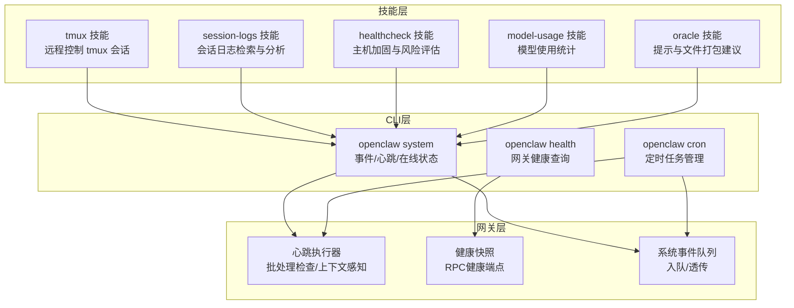
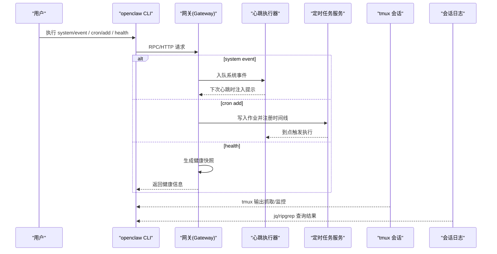
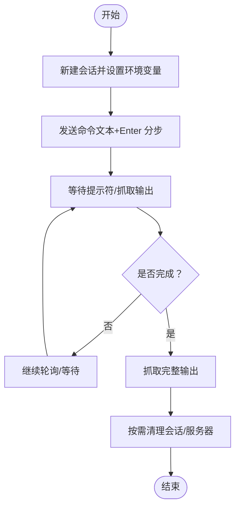
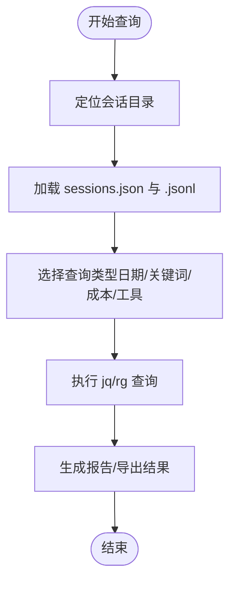
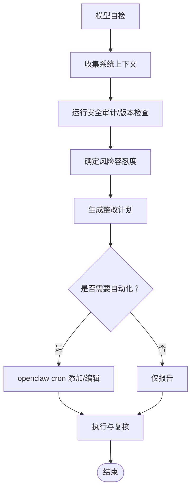
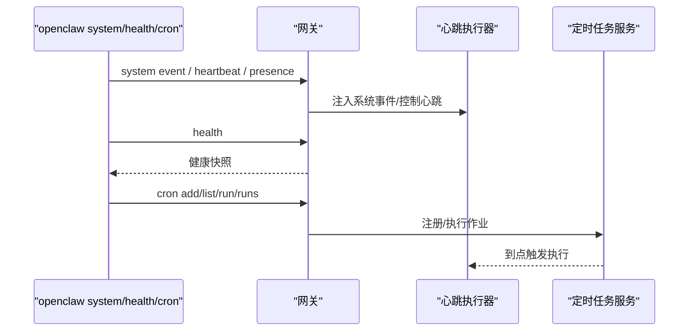
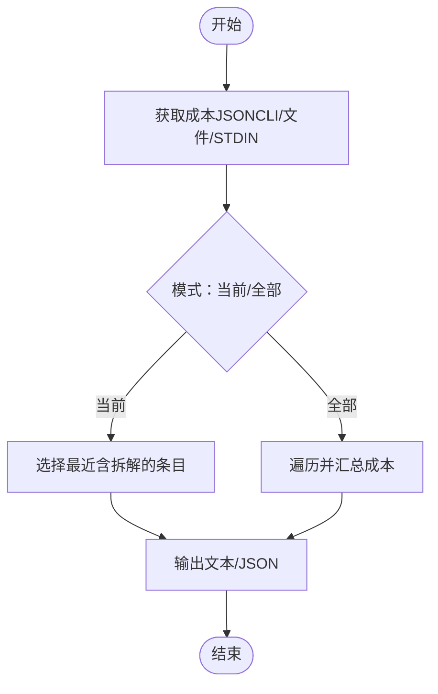
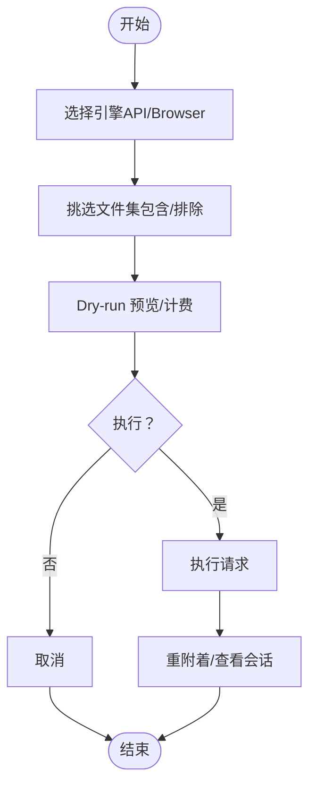
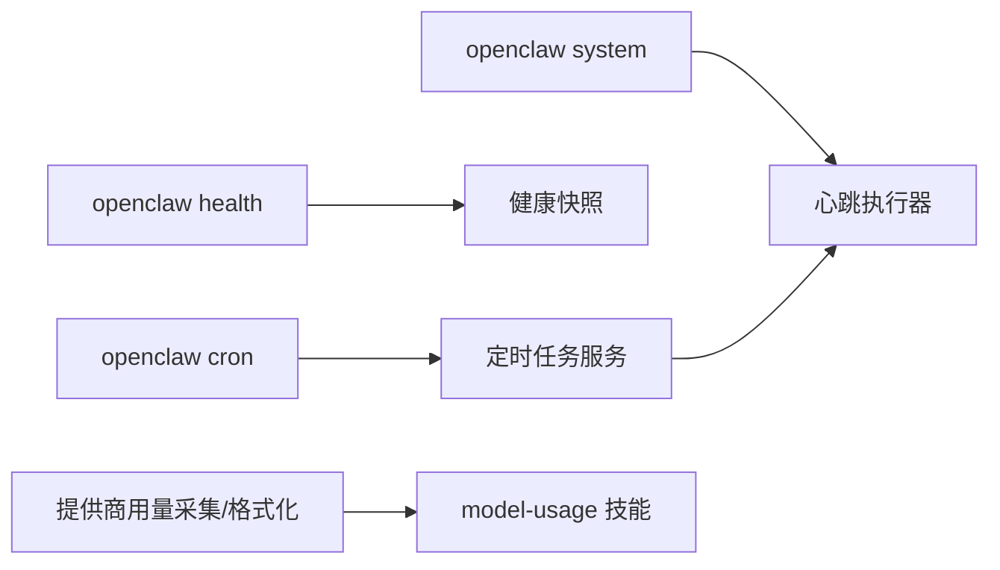

# 系统管理技能

<cite>
**本文引用的文件**
- [skills/tmux/SKILL.md](file://skills/tmux/SKILL.md)
- [skills/session-logs/SKILL.md](file://skills/session-logs/SKILL.md)
- [skills/healthcheck/SKILL.md](file://skills/healthcheck/SKILL.md)
- [skills/model-usage/SKILL.md](file://skills/model-usage/SKILL.md)
- [skills/oracle/SKILL.md](file://skills/oracle/SKILL.md)
- [docs/cli/system.md](file://docs/cli/system.md)
- [docs/cli/health.md](file://docs/cli/health.md)
- [docs/cli/cron.md](file://docs/cli/cron.md)
- [docs/automation/cron-jobs.md](file://docs/automation/cron-jobs.md)
- [docs/automation/cron-vs-heartbeat.md](file://docs/automation/cron-vs-heartbeat.md)
- [src/cli/system-cli.ts](file://src/cli/system-cli.ts)
- [src/gateway/server/health-state.ts](file://src/gateway/server/health-state.ts)
- [src/commands/status.command.ts](file://src/commands/status.command.ts)
- [src/cron/service/state.ts](file://src/cron/service/state.ts)
- [src/infra/provider-usage.fetch.gemini.ts](file://src/infra/provider-usage.fetch.gemini.ts)
- [src/infra/provider-usage.format.ts](file://src/infra/provider-usage.format.ts)
- [src/infra/provider-usage.fetch.minimax.ts](file://src/infra/provider-usage.fetch.minimax.ts)
</cite>

## 目录

1. [简介](#简介)
2. [项目结构](#项目结构)
3. [核心组件](#核心组件)
4. [架构总览](#架构总览)
5. [详细组件分析](#详细组件分析)
6. [依赖关系分析](#依赖关系分析)
7. [性能考量](#性能考量)
8. [故障排查指南](#故障排查指南)
9. [结论](#结论)
10. [附录](#附录)

## 简介

本文件面向OpenClaw系统管理员与自动化工程师，系统性梳理与实操“系统管理技能”，覆盖终端管理（tmux）、会话监控（会话日志）、健康检查（主机加固与网关健康）、系统诊断（资源与性能指标）、模型使用统计（Codex/Claude成本）与Oracle数据库连接辅助等主题。文档同时给出自动化运维场景下的使用示例、最佳实践、系统集成要点、权限与安全注意事项，并提供可视化流程图帮助快速理解端到端工作流。

## 项目结构

围绕系统管理技能，OpenClaw在以下层次提供能力：

- 技能层：各内置技能（如tmux、session-logs、healthcheck、model-usage、oracle）定义了可调用的工具与使用规范。
- CLI层：提供system、health、cron等命令，用于系统事件入队、心跳控制、网关健康查询与定时任务编排。
- 网关层：维护心跳、健康状态、系统事件队列与会话存储，支撑跨通道交付与可观测性。
- 资源与指标层：提供多提供商用量聚合与格式化展示，便于成本与配额洞察。

图表来源

- [skills/tmux/SKILL.md](file://skills/tmux/SKILL.md#L1-L136)
- [skills/session-logs/SKILL.md](file://skills/session-logs/SKILL.md#L1-L116)
- [skills/healthcheck/SKILL.md](file://skills/healthcheck/SKILL.md#L1-L246)
- [skills/model-usage/SKILL.md](file://skills/model-usage/SKILL.md#L1-L70)
- [skills/oracle/SKILL.md](file://skills/oracle/SKILL.md#L1-L126)
- [docs/cli/system.md](file://docs/cli/system.md#L1-L61)
- [docs/cli/health.md](file://docs/cli/health.md#L1-L22)
- [docs/cli/cron.md](file://docs/cli/cron.md#L1-L45)
- [docs/automation/cron-jobs.md](file://docs/automation/cron-jobs.md#L1-L479)

章节来源

- [docs/cli/system.md](file://docs/cli/system.md#L1-L61)
- [docs/cli/health.md](file://docs/cli/health.md#L1-L22)
- [docs/cli/cron.md](file://docs/cli/cron.md#L1-L45)
- [docs/automation/cron-jobs.md](file://docs/automation/cron-jobs.md#L1-L479)

## 核心组件

- 终端管理（tmux）
  - 通过私有socket隔离tmux会话，支持发送键入、抓取面板输出、并行多会话编排。
  - 提供查找会话、等待文本、清理会话等辅助能力。
- 会话监控（session-logs）
  - 基于jq/ripgrep对会话JSONL进行检索、统计与成本分析，支持按日期、关键词、工具调用等维度查询。
- 健康检查（healthcheck）
  - 主机安全加固与风险容忍度对齐，结合OpenClaw安全审计、版本状态与周期性巡检，提供可执行的整改计划与可选自动化调度。
- 系统诊断（system/health/cron）
  - system事件入队与心跳控制；health查询网关健康；cron统一调度与交付。
- 模型使用统计（model-usage）
  - 从CodexBar本地成本日志汇总当前模型或全量模型的成本，支持文本/JSON输出。
- Oracle数据库连接辅助（oracle）
  - 提供提示模板、文件打包策略、引擎选择（API/Browser）、会话管理与安全注意事项，强调“一次性请求”与“验证优先”。

章节来源

- [skills/tmux/SKILL.md](file://skills/tmux/SKILL.md#L1-L136)
- [skills/session-logs/SKILL.md](file://skills/session-logs/SKILL.md#L1-L116)
- [skills/healthcheck/SKILL.md](file://skills/healthcheck/SKILL.md#L1-L246)
- [skills/model-usage/SKILL.md](file://skills/model-usage/SKILL.md#L1-L70)
- [skills/oracle/SKILL.md](file://skills/oracle/SKILL.md#L1-L126)
- [docs/cli/system.md](file://docs/cli/system.md#L1-L61)
- [docs/cli/health.md](file://docs/cli/health.md#L1-L22)
- [docs/cli/cron.md](file://docs/cli/cron.md#L1-L45)

## 架构总览

下图展示从用户触发到系统响应的关键路径：CLI命令进入网关，心跳/定时任务驱动系统事件与会话运行，健康端点返回状态，会话日志与tmux输出作为可观测性数据源。

图表来源

- [src/cli/system-cli.ts](file://src/cli/system-cli.ts#L32-L58)
- [src/gateway/server/health-state.ts](file://src/gateway/server/health-state.ts#L63-L78)
- [src/cron/service/state.ts](file://src/cron/service/state.ts#L25-L66)
- [docs/automation/cron-jobs.md](file://docs/automation/cron-jobs.md#L1-L479)
- [skills/tmux/SKILL.md](file://skills/tmux/SKILL.md#L1-L136)
- [skills/session-logs/SKILL.md](file://skills/session-logs/SKILL.md#L1-L116)

## 详细组件分析

### 终端管理（tmux）

- 会话命名与目标定位
  - 使用socket隔离，目标格式为“会话:窗口.窗格”，默认“:0.0”。建议短名、避免空格。
- 输入与输出
  - 发送键入优先使用“逐字发送”，交互式TUI应用中需将文本与回车分步发送并加延时，避免被识别为粘贴。
  - 抓取最近历史、等待特定文本、附加/分离会话。
- 并行编排
  - 多会话并行执行不同任务，通过检查提示符判断完成状态，完成后抓取完整输出。
- 清理
  - 支持按会话或全部会话清理，或直接关闭服务器释放socket。

图表来源

- [skills/tmux/SKILL.md](file://skills/tmux/SKILL.md#L78-L121)

章节来源

- [skills/tmux/SKILL.md](file://skills/tmux/SKILL.md#L1-L136)

### 会话监控（session-logs）

- 数据位置与结构
  - 会话日志位于“~/.openclaw/agents/<agentId>/sessions/”，包含索引文件与JSONL对话记录。
- 常用查询
  - 按日期列出会话、按日期筛选、提取用户/助手消息、统计成本、按天汇总成本、统计消息数与时间范围、工具调用分布、跨会话检索关键词。
- 实战技巧
  - 大文件建议先采样，利用索引映射渠道与会话ID的关系，删除会话以“.deleted.<timestamp>”结尾。

图表来源

- [skills/session-logs/SKILL.md](file://skills/session-logs/SKILL.md#L15-L116)

章节来源

- [skills/session-logs/SKILL.md](file://skills/session-logs/SKILL.md#L1-L116)

### 健康检查（healthcheck）

- 工作流
  - 模型自检（推荐高阶模型）、建立上下文（OS/权限/访问路径/暴露面/备份/磁盘加密/自动更新）、运行OpenClaw安全审计与版本检查、确定风险容忍度、生成整改计划、可选自动化调度、执行与复核。
- 关键要求
  - 所有变更需显式批准；仅收紧OpenClaw默认而非修改主机防火墙/SSH/系统更新策略；记录审计轨迹，避免泄露凭证。
- 周期性检查
  - 建议至少一次基线审计与版本检查；可使用cron添加定期任务，稳定作业名，避免凭空创建重复项。

图表来源

- [skills/healthcheck/SKILL.md](file://skills/healthcheck/SKILL.md#L23-L246)
- [docs/cli/cron.md](file://docs/cli/cron.md#L1-L45)
- [docs/automation/cron-jobs.md](file://docs/automation/cron-jobs.md#L1-L479)

章节来源

- [skills/healthcheck/SKILL.md](file://skills/healthcheck/SKILL.md#L1-L246)
- [docs/cli/cron.md](file://docs/cli/cron.md#L1-L45)
- [docs/automation/cron-jobs.md](file://docs/automation/cron-jobs.md#L1-L479)

### 系统诊断（system/health/cron）

- system
  - 入队系统事件（立即或下次心跳），启用/禁用心跳，查看在线状态。
- health
  - 查询网关健康，支持机器可读与详细探针输出。
- cron
  - 统一管理定时任务，支持一次性、固定间隔与Cron表达式；可选择主会话或独立会话执行，并可配置交付模式（公告/不交付）。

图表来源

- [docs/cli/system.md](file://docs/cli/system.md#L15-L61)
- [docs/cli/health.md](file://docs/cli/health.md#L10-L22)
- [docs/cli/cron.md](file://docs/cli/cron.md#L9-L45)
- [src/cli/system-cli.ts](file://src/cli/system-cli.ts#L32-L58)
- [src/gateway/server/health-state.ts](file://src/gateway/server/health-state.ts#L63-L78)
- [src/cron/service/state.ts](file://src/cron/service/state.ts#L25-L66)

章节来源

- [docs/cli/system.md](file://docs/cli/system.md#L1-L61)
- [docs/cli/health.md](file://docs/cli/health.md#L1-L22)
- [docs/cli/cron.md](file://docs/cli/cron.md#L1-L45)
- [src/cli/system-cli.ts](file://src/cli/system-cli.ts#L32-L58)
- [src/gateway/server/health-state.ts](file://src/gateway/server/health-state.ts#L63-L78)
- [src/cron/service/state.ts](file://src/cron/service/state.ts#L25-L66)

### 模型使用统计（model-usage）

- 输入
  - 默认通过CodexBar CLI获取成本JSON；也支持文件或标准输入。
- 逻辑
  - 当前模型：优先取最近一天含模型拆解的条目，否则回退至“已用模型列表”；可通过参数覆盖指定模型。
- 输出
  - 文本或JSON格式；仅统计成本，不区分token。
- 参考
  - 参阅references中的CodexBar CLI说明以获取字段与标志位细节。

图表来源

- [skills/model-usage/SKILL.md](file://skills/model-usage/SKILL.md#L27-L70)

章节来源

- [skills/model-usage/SKILL.md](file://skills/model-usage/SKILL.md#L1-L70)

### Oracle数据库连接辅助（oracle）

- 使用建议
  - 采用“一次性请求”模式，先预览负载与token消耗，再决定执行；浏览器模式适合长时推理，API模式适合多模型/非浏览器场景。
- 文件打包
  - 精简文件集合，支持包含/排除规则，默认忽略常见目录且尊重.gitignore；限制单文件大小。
- 引擎与会话
  - 自动根据环境选择引擎；支持远程浏览器宿主；会话持久化，超时/断开会话可重附着。
- 安全
  - 不要默认附带敏感文件，需严格脱敏。

图表来源

- [skills/oracle/SKILL.md](file://skills/oracle/SKILL.md#L27-L126)

章节来源

- [skills/oracle/SKILL.md](file://skills/oracle/SKILL.md#L1-L126)

## 依赖关系分析

- CLI与网关
  - system命令通过RPC唤醒网关的心跳执行器，将系统事件注入下一次心跳提示；health命令拉取网关健康快照。
- 定时任务与心跳
  - cron服务在网关内持久化作业，到点触发心跳执行器或独立会话运行；支持公告/内部交付与模型/思考级别覆盖。
- 资源与指标
  - 多提供商用量采集与格式化，用于成本与配额洞察，辅助模型使用统计与成本分析。

图表来源

- [src/cli/system-cli.ts](file://src/cli/system-cli.ts#L32-L58)
- [src/gateway/server/health-state.ts](file://src/gateway/server/health-state.ts#L63-L78)
- [src/cron/service/state.ts](file://src/cron/service/state.ts#L25-L66)
- [src/infra/provider-usage.fetch.gemini.ts](file://src/infra/provider-usage.fetch.gemini.ts#L53-L89)
- [src/infra/provider-usage.format.ts](file://src/infra/provider-usage.format.ts#L1-L48)
- [src/infra/provider-usage.fetch.minimax.ts](file://src/infra/provider-usage.fetch.minimax.ts#L194-L232)
- [skills/model-usage/SKILL.md](file://skills/model-usage/SKILL.md#L1-L70)

章节来源

- [src/cli/system-cli.ts](file://src/cli/system-cli.ts#L32-L58)
- [src/gateway/server/health-state.ts](file://src/gateway/server/health-state.ts#L63-L78)
- [src/cron/service/state.ts](file://src/cron/service/state.ts#L25-L66)
- [src/infra/provider-usage.fetch.gemini.ts](file://src/infra/provider-usage.fetch.gemini.ts#L53-L89)
- [src/infra/provider-usage.format.ts](file://src/infra/provider-usage.format.ts#L1-L48)
- [src/infra/provider-usage.fetch.minimax.ts](file://src/infra/provider-usage.fetch.minimax.ts#L194-L232)
- [skills/model-usage/SKILL.md](file://skills/model-usage/SKILL.md#L1-L70)

## 性能考量

- 心跳与定时任务
  - 心跳适合批量上下文感知检查，减少API调用次数；cron适合后台例行事务，支持指数退避与并发控制。
- tmux
  - 合理拆分会话与延迟发送，避免交互式应用误判为粘贴；使用“最近N行抓取”降低I/O开销。
- 会话日志
  - 对大文件先采样，必要时使用正则限定范围；跨会话检索建议先过滤后搜索。
- 模型使用统计
  - 仅统计成本，避免对token进行模型级拆分；批量汇总可减少多次IO。
- 资源与指标
  - 用量采集按最小必要字段扫描，格式化时计算剩余百分比与重置时间，便于快速定位瓶颈。

## 故障排查指南

- 系统事件未触发
  - 检查system事件是否成功入队、心跳是否启用、网关是否可达；必要时使用“立即唤醒”模式。
- 健康查询失败
  - 确认网关可达；使用--verbose运行实时探测，关注多账户时的逐账户耗时。
- 定时任务未执行
  - 检查cron是否启用、作业是否处于启用状态、时区是否匹配；观察错误后的指数退避行为。
- tmux会话卡住
  - 分离会话、检查提示符、逐步发送命令并增加延时；必要时清理会话或服务器。
- 会话日志查询慢
  - 使用head/tail采样、缩小搜索范围、优先使用jq的路径表达式。
- 模型使用统计异常
  - 确认CodexBar成本JSON可用；若缺少模型拆解，回退到“已用模型列表”；必要时手动指定模型。

章节来源

- [docs/cli/system.md](file://docs/cli/system.md#L57-L61)
- [docs/cli/health.md](file://docs/cli/health.md#L18-L22)
- [docs/automation/cron-jobs.md](file://docs/automation/cron-jobs.md#L459-L479)
- [skills/tmux/SKILL.md](file://skills/tmux/SKILL.md#L63-L121)
- [skills/session-logs/SKILL.md](file://skills/session-logs/SKILL.md#L104-L116)
- [skills/model-usage/SKILL.md](file://skills/model-usage/SKILL.md#L44-L70)

## 结论

通过tmux、session-logs、healthcheck、system/health/cron与model-usage/oracle等技能与工具，OpenClaw提供了从终端交互、会话可观测、主机安全到系统健康与成本洞察的完整管理闭环。建议在生产环境中：

- 将主机加固与周期性巡检纳入自动化（cron），并以心跳为载体批量执行上下文感知检查；
- 使用tmux进行交互式任务编排，配合会话日志进行事后审计；
- 以health命令与cron运行情况作为系统健康度量基准；
- 以model-usage与提供商用量格式化输出为成本优化依据；
- 以oracle技能指导数据库/代码上下文的一次性请求与安全脱敏。

## 附录

- 最佳实践清单
  - 会话命名简洁、目标定位明确；交互式输入分步发送并加延时。
  - 会话日志按需采样，优先文本过滤；跨会话检索先限域后搜索。
  - 主机加固遵循“可逆、可回滚、最小暴露面”原则；变更需显式批准。
  - cron作业使用稳定名称，避免重复创建；公告/内部交付按场景选择。
  - 模型使用统计仅看成本，避免误判token分配；批量汇总减少IO。
  - oracle请求先预览、再执行；文件打包精简、默认忽略常见目录。
- 权限与安全
  - 严格脱敏敏感文件；避免在日志中记录令牌；审计轨迹中红名单敏感信息。
  - 保持磁盘加密开启，启用自动安全更新；远程访问限制在受控网络或隧道。
