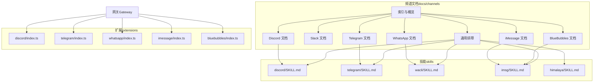
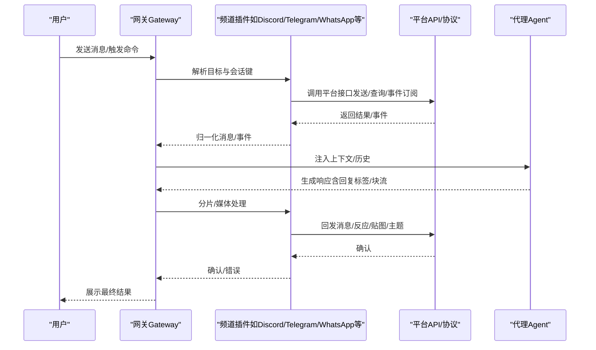
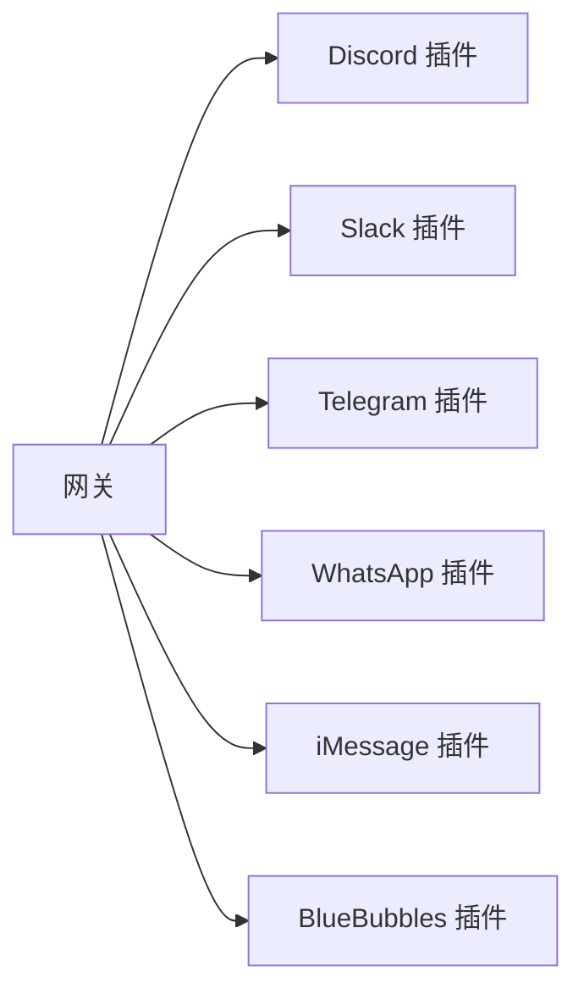

# 通信渠道技能

<cite>
**本文引用的文件**
- [docs/channels/index.md](file://docs/channels/index.md)
- [docs/channels/discord.md](file://docs/channels/discord.md)
- [docs/channels/slack.md](file://docs/channels/slack.md)
- [docs/channels/telegram.md](file://docs/channels/telegram.md)
- [docs/channels/whatsapp.md](file://docs/channels/whatsapp.md)
- [docs/channels/imessage.md](file://docs/channels/imessage.md)
- [docs/channels/bluebubbles.md](file://docs/channels/bluebubbles.md)
- [docs/channels/troubleshooting.md](file://docs/channels/troubleshooting.md)
</cite>

## 目录

1. [简介](#简介)
2. [项目结构](#项目结构)
3. [核心组件](#核心组件)
4. [架构总览](#架构总览)
5. [详细组件分析](#详细组件分析)
6. [依赖关系分析](#依赖关系分析)
7. [性能考量](#性能考量)
8. [故障排除指南](#故障排除指南)
9. [结论](#结论)
10. [附录](#附录)

## 简介

本文件面向OpenClaw的“通信渠道技能”，系统梳理并说明以下消息平台的集成能力：GitHub（作为开发协作与工单入口）、Discord、Slack、Telegram、WhatsApp、iMessage、BlueBubbles、Himalaya（邮件通道）。内容覆盖各渠道的认证方式、配置要点、使用限制、API接口规范、消息格式与事件处理机制，并补充跨渠道消息同步、群组管理与媒体传输能力，以及渠道特定的配置项、权限策略与排障方法。

## 项目结构

OpenClaw通过“网关（Gateway）+ 渠道插件/扩展”的架构连接各类消息平台。各渠道在文档侧以“频道（Channel）”维度组织，提供统一的配置模型、会话路由、访问控制与事件映射。核心结构包括：

- 频道文档：集中于docs/channels目录，按平台拆分，包含快速上手、配置参考、特性说明与排障。
- 扩展/插件：extensions目录下各平台独立实现，负责具体协议对接与运行时行为。
- 技能（Skills）：skills目录下的平台专用技能，提供命令菜单、工具动作与自动化流程。

图表来源

- [docs/channels/index.md](file://docs/channels/index.md#L1-L48)
- [docs/channels/discord.md](file://docs/channels/discord.md#L1-L485)
- [docs/channels/slack.md](file://docs/channels/slack.md#L1-L455)
- [docs/channels/telegram.md](file://docs/channels/telegram.md#L1-L697)
- [docs/channels/whatsapp.md](file://docs/channels/whatsapp.md#L1-L435)
- [docs/channels/imessage.md](file://docs/channels/imessage.md#L1-L352)
- [docs/channels/bluebubbles.md](file://docs/channels/bluebubbles.md#L1-L341)
- [docs/channels/troubleshooting.md](file://docs/channels/troubleshooting.md#L1-L117)

章节来源

- [docs/channels/index.md](file://docs/channels/index.md#L1-L48)

## 核心组件

- 网关（Gateway）
  - 统一持有各频道连接，负责会话路由、历史上下文注入、事件映射与系统事件生成。
  - 支持多账户、多频道并发运行，按会话键隔离不同聊天域。
- 频道（Channel）
  - 按平台抽象出统一的接入层：令牌/凭据解析、入站消息归一化、出站发送与分片、媒体下载与上传、反应/贴图/主题等事件映射。
  - 提供访问控制（DM/群组策略、提及规则、允许名单）、线程/话题会话、回复标签与块流式输出等能力。
- 插件/扩展（Plugin/Extension）
  - 各平台独立实现，如Discord、Telegram、WhatsApp、iMessage、BlueBubbles等，负责具体协议细节与运行时行为。
- 技能（Skill）
  - 平台专属技能，提供命令菜单、工具动作与自动化流程，例如设备配对、群组管理、媒体处理等。

章节来源

- [docs/channels/discord.md](file://docs/channels/discord.md#L81-L90)
- [docs/channels/slack.md](file://docs/channels/slack.md#L216-L230)
- [docs/channels/telegram.md](file://docs/channels/telegram.md#L208-L217)
- [docs/channels/whatsapp.md](file://docs/channels/whatsapp.md#L126-L133)
- [docs/channels/imessage.md](file://docs/channels/imessage.md#L127-L177)
- [docs/channels/bluebubbles.md](file://docs/channels/bluebubbles.md#L14-L24)

## 架构总览

下图展示OpenClaw与各消息平台的交互关系与数据流：网关统一调度，各频道插件负责与平台API/协议对接，事件经由系统事件进入代理会话，最终生成回复并通过对应频道回发。

图表来源

- [docs/channels/discord.md](file://docs/channels/discord.md#L261-L372)
- [docs/channels/slack.md](file://docs/channels/slack.md#L264-L285)
- [docs/channels/telegram.md](file://docs/channels/telegram.md#L218-L282)
- [docs/channels/whatsapp.md](file://docs/channels/whatsapp.md#L284-L307)
- [docs/channels/imessage.md](file://docs/channels/imessage.md#L238-L272)
- [docs/channels/bluebubbles.md](file://docs/channels/bluebubbles.md#L206-L246)

## 详细组件分析

### GitHub（开发协作与工单入口）

- 认证方式
  - 使用个人访问令牌（PAT）或应用集成（App），支持细粒度权限与组织/仓库级访问控制。
- 配置要求
  - 定义仓库白名单、事件订阅（issue/pr/comment/commit等）、分支保护策略与审核流程。
- 使用限制
  - 遵循GitHub API速率限制；敏感操作需管理员授权；私有仓库需明确授权范围。
- API接口规范
  - REST API：仓库、问题、拉取请求、评论、提交等资源读写。
  - GraphQL API：复杂查询与批量操作。
- 消息格式与事件处理
  - 将平台事件映射为系统事件，注入到代理会话中，支持模板变量与上下文扩展。
- 跨渠道同步与群组管理
  - 可将GitHub工单状态同步至聊天渠道，形成“工单-沟通”闭环；支持多仓库聚合与筛选。
- 媒体传输
  - 附件上传与链接引用，支持图片、文档与二进制文件。
- 权限设置与故障排除
  - 最小权限原则；检查令牌作用域与组织策略；验证Webhook签名校验与网络可达性。

章节来源

- [docs/channels/index.md](file://docs/channels/index.md#L16-L17)

### Discord（Bot API）

- 认证方式
  - 机器人令牌（Bot Token），启用“消息内容意图”和“服务器成员意图”。
- 配置要点
  - 启用Socket Mode或HTTP Events API；配置事件订阅（消息、反应、成员加入/离开、话题等）。
  - DM策略：配对/允许名单/开放/禁用；群组策略：开放/允许名单/禁用；提及规则与通道允许列表。
- 使用限制
  - 未启用消息内容意图时无法看到消息正文；权限不足会导致事件缺失。
- API接口规范
  - Bot API：发送/编辑/删除消息、反应、线程、权限管理、成员信息、频道信息等。
- 消息格式与事件处理
  - 入站消息归一化为共享信封；反应/话题/成员变更映射为系统事件；线程继承父通道配置。
- 跨渠道同步与群组管理
  - 角色绑定路由到不同代理；PluralKit解析代理身份；执行审批按钮（DM）。
- 媒体传输与分片
  - 文件大小上限、文本分片与换行优先策略；支持表情包与贴纸。
- 权限设置与故障排除
  - 检查意图开关、权限范围、通道ID解析、配对码有效期与通道探测。

章节来源

- [docs/channels/discord.md](file://docs/channels/discord.md#L24-L75)
- [docs/channels/discord.md](file://docs/channels/discord.md#L90-L172)
- [docs/channels/discord.md](file://docs/channels/discord.md#L261-L372)
- [docs/channels/discord.md](file://docs/channels/discord.md#L374-L454)

### Slack（Socket Mode + HTTP Events API）

- 认证方式
  - Socket Mode：App Token（xapp-...）+ Bot Token（xoxb-...）；HTTP模式：Bot Token + Signing Secret。
- 配置要点
  - 事件订阅：app_mention、message.channels/groups/im/mpim、reaction_added/removed、成员加入/离开、频道重命名、Pin事件等。
  - DM策略：配对/允许名单/开放/禁用；通道策略：开放/允许名单/禁用；提及规则与通道允许名单。
- 使用限制
  - 未启用必要事件或权限不足会导致消息/反应/成员事件缺失。
- API接口规范
  - Socket Mode：实时事件推送；HTTP模式：Webhook回调与签名验证。
- 消息格式与事件处理
  - 入站消息归一化；反应/成员/频道事件映射为系统事件；线程会话后缀与历史抓取。
- 跨渠道同步与群组管理
  - 多账户HTTP模式需唯一Webhook路径；支持用户令牌只读与写入回退。
- 媒体传输与分片
  - 文件下载与上传、文本分片、线程回复；默认20MB入站上限可调。
- 权限设置与故障排除
  - 检查Socket/HTTP模式配置、签名密钥、Webhook路径与权限范围；通道探测与日志排查。

章节来源

- [docs/channels/slack.md](file://docs/channels/slack.md#L24-L121)
- [docs/channels/slack.md](file://docs/channels/slack.md#L135-L194)
- [docs/channels/slack.md](file://docs/channels/slack.md#L216-L262)
- [docs/channels/slack.md](file://docs/channels/slack.md#L264-L285)
- [docs/channels/slack.md](file://docs/channels/slack.md#L374-L431)

### Telegram（Bot API，长轮询/Webhook）

- 认证方式
  - Bot Token（BotFather），支持长轮询与Webhook两种模式。
- 配置要点
  - DM策略：配对/允许名单/开放/禁用；群组策略：开放/允许名单/禁用；提及规则与群组允许名单。
  - Bot隐私模式：若需接收所有群消息需关闭隐私或设为管理员。
- 使用限制
  - setMyCommands失败通常为DNS/HTTPS不可达；隐私模式切换后需重新加群。
- API接口规范
  - Bot API：发送/编辑/删除消息、反应、贴纸、内联键盘、草稿气泡、Webhook。
- 消息格式与事件处理
  - 入站消息归一化；反应事件映射为系统事件；论坛话题会话隔离；草稿气泡与块流式输出。
- 跨渠道同步与群组管理
  - 群迁移事件自动更新配置；支持自定义命令菜单与插件命令。
- 媒体传输与分片
  - 图片/视频/音频/文档；默认5MB入站上限；文本分片与换行优先；链接预览可禁用。
- 权限设置与故障排除
  - 检查隐私模式、命令注册、网络连通性与Webhook签名；通道探测与会话测试。

章节来源

- [docs/channels/telegram.md](file://docs/channels/telegram.md#L24-L68)
- [docs/channels/telegram.md](file://docs/channels/telegram.md#L104-L206)
- [docs/channels/telegram.md](file://docs/channels/telegram.md#L218-L624)
- [docs/channels/telegram.md](file://docs/channels/telegram.md#L626-L670)

### WhatsApp（Web，Baileys）

- 认证方式
  - 二维码登录（QR），多账户凭据存储于~/.openclaw/credentials/whatsapp/<accountId>/creds.json。
- 配置要点
  - DM策略：配对/允许名单/开放/禁用；群组策略：开放/允许名单/禁用；提及规则与群组允许名单。
  - 自聊天保护：当自身号码在允许名单中时跳过自读回与自触发。
- 使用限制
  - 不支持状态/广播聊天；需要活跃监听器才能发送；Bun不兼容。
- API接口规范
  - Baileys Web：发送/接收消息、媒体、位置/联系人、反应、已读回执。
- 消息格式与事件处理
  - 入站消息归一化，带回复上下文与媒体占位符；群组上下文注入；已读回执可配置。
- 跨渠道同步与群组管理
  - 群组历史缓冲注入；支持ack反应（👀）与自聊天前缀。
- 媒体传输与分片
  - 图片/视频/音频/文档；默认50MB入站上限；语音备忘录OPUS编码；首项回退策略。
- 权限设置与故障排除
  - 检查QR登录状态、重连日志、账户凭据目录健康度；通道探测与医生命令。

章节来源

- [docs/channels/whatsapp.md](file://docs/channels/whatsapp.md#L24-L76)
- [docs/channels/whatsapp.md](file://docs/channels/whatsapp.md#L134-L192)
- [docs/channels/whatsapp.md](file://docs/channels/whatsapp.md#L202-L282)
- [docs/channels/whatsapp.md](file://docs/channels/whatsapp.md#L284-L307)
- [docs/channels/whatsapp.md](file://docs/channels/whatsapp.md#L334-L355)
- [docs/channels/whatsapp.md](file://docs/channels/whatsapp.md#L357-L414)

### iMessage（遗留：imsg JSON-RPC）

- 认证方式
  - 本地CLI（imsg）通过JSON-RPC与Messages数据库交互；支持本地Mac或SSH远程Mac。
- 配置要点
  - CLI路径、数据库路径、远程主机与附件下载；DM策略：配对/允许名单/开放/禁用；群组策略与提及规则。
- 使用限制
  - 需要Full Disk Access与Automation权限；远程附件需SCP密钥认证。
- API接口规范
  - JSON-RPC over stdio：聊天列表、发送、附件下载、会话路由。
- 消息格式与事件处理
  - 入站消息归一化；组会话隔离；回复路由回iMessage。
- 跨渠道同步与群组管理
  - 多账户配置；组似线程行为（部分多人口iMessage线程按配置视为组）。
- 媒体传输与分片
  - 可选附件下载；默认16MB出站上限；文本分片与换行优先。
- 权限设置与故障排除
  - 检查权限提示、远程SSH/SCP连通性、数据库路径可读性。

章节来源

- [docs/channels/imessage.md](file://docs/channels/imessage.md#L31-L108)
- [docs/channels/imessage.md](file://docs/channels/imessage.md#L127-L177)
- [docs/channels/imessage.md](file://docs/channels/imessage.md#L238-L272)
- [docs/channels/imessage.md](file://docs/channels/imessage.md#L290-L344)

### BlueBubbles（macOS REST，推荐）

- 认证方式
  - BlueBubbles macOS服务REST API；Webhook回调；密码校验；localhost请求放行。
- 配置要点
  - 服务器URL、密码、Webhook路径；DM策略：配对/允许名单/开放/禁用；群组策略与提及规则。
- 使用限制
  - edit/unsend需macOS 13+且兼容版本；macOS 26（Tahoe）编辑功能当前损坏；群组图标更新在Tahoe可能不同步。
- API接口规范
  - REST：/ping、/message/text、/chat/:id/\*；Webhook：入站消息；出站：回复、打字、已读、tapback。
- 消息格式与事件处理
  - 入站消息归一化；反应事件映射为系统事件；线程/话题会话；短消息ID与全ID并存。
- 跨渠道同步与群组管理
  - 高级动作：编辑、撤回、回复、特效、改名、设图标、加减成员、退出群、发送附件。
- 媒体传输与分片
  - 默认8MB入站上限；默认4000字符分片；块流式输出可选。
- 权限设置与故障排除
  - Webhook鉴权、HTTPS与防火墙、macOS权限与后台唤醒脚本、通道状态与深度状态。

章节来源

- [docs/channels/bluebubbles.md](file://docs/channels/bluebubbles.md#L25-L46)
- [docs/channels/bluebubbles.md](file://docs/channels/bluebubbles.md#L143-L189)
- [docs/channels/bluebubbles.md](file://docs/channels/bluebubbles.md#L206-L246)
- [docs/channels/bluebubbles.md](file://docs/channels/bluebubbles.md#L277-L282)
- [docs/channels/bluebubbles.md](file://docs/channels/bluebubbles.md#L330-L341)

### Himalaya（邮件通道）

- 认证方式
  - IMAP/SMTP凭据或OAuth（如Gmail），支持多账户与凭据安全存储。
- 配置要点
  - 邮箱白名单、收件夹过滤、主题/发件人匹配规则、自动回复策略。
- 使用限制
  - 遵循邮箱服务商速率限制与安全策略；敏感操作需双重确认。
- API接口规范
  - IMAP：拉取邮件、标记已读/删除；SMTP：发送邮件、附件上传。
- 消息格式与事件处理
  - 邮件正文/附件归一化为系统事件；支持模板变量与上下文注入。
- 跨渠道同步与群组管理
  - 工单/通知邮件与聊天渠道联动；多邮箱聚合与筛选。
- 媒体传输
  - 附件下载与上传；大小限制与类型过滤。
- 权限设置与故障排除
  - 检查IMAP/SMTP权限、OAuth授权范围、网络可达性与Webhook签名校验。

章节来源

- [docs/channels/index.md](file://docs/channels/index.md#L22-L23)

## 依赖关系分析

- 组件耦合
  - 网关与频道插件松耦合：通过统一信封与会话键解耦平台差异。
  - 频插件与平台API紧耦合：遵循平台意图/权限/速率限制。
- 外部依赖
  - 各平台SDK/REST API、WebSocket/Socket Mode、Webhook签名、数据库/缓存（媒体存储）。
- 循环依赖
  - 无直接循环；事件通过系统事件单向流入代理会话。
- 接口契约
  - 频道需实现：启动/停止、事件订阅、消息发送、媒体处理、权限校验、配置写入。

图表来源

- [docs/channels/discord.md](file://docs/channels/discord.md#L81-L90)
- [docs/channels/slack.md](file://docs/channels/slack.md#L216-L230)
- [docs/channels/telegram.md](file://docs/channels/telegram.md#L208-L217)
- [docs/channels/whatsapp.md](file://docs/channels/whatsapp.md#L126-L133)
- [docs/channels/imessage.md](file://docs/channels/imessage.md#L165-L177)
- [docs/channels/bluebubbles.md](file://docs/channels/bluebubbles.md#L14-L24)

## 性能考量

- 连接与重连
  - WebSocket/Socket Mode应启用心跳与指数退避重连；HTTP模式需幂等与去重。
- 事件吞吐
  - 长轮询/Webhook模式下，入站并发与出站分片需平衡；草稿气泡与块流式输出减少往返。
- 媒体处理
  - 入站媒体下载需限速与缓存；出站媒体压缩与首项回退策略降低失败率。
- 会话隔离
  - 群组/论坛话题/线程会话键避免冲突；历史上下文限制防止内存膨胀。
- 代理渲染
  - 文本分片与换行优先策略提升可读性；Markdown到HTML转换与回退逻辑。

## 故障排除指南

- 通用命令阶梯
  - status → gateway status → logs --follow → doctor → channels status --probe
- 平台特定签名与修复
  - WhatsApp：配对列表检查、提及规则与隐私模式、重登与凭据目录健康度。
  - Telegram：配对列表、隐私模式与命令注册、DNS/IPv6与Webhook签名。
  - Discord：通道探测、意图开关、权限范围、配对码有效期。
  - Slack：Socket/HTTP模式、签名密钥、Webhook路径与权限范围。
  - iMessage/BlueBubbles：Webhook可达性、macOS权限、配对码与通道状态。

章节来源

- [docs/channels/troubleshooting.md](file://docs/channels/troubleshooting.md#L13-L117)

## 结论

OpenClaw通过统一的网关与平台无关的频道抽象，实现了对多种消息平台的一致接入与治理。各平台在认证、配置、权限与事件处理方面具备清晰的边界与最佳实践。结合技能与工具动作，OpenClaw可在多渠道间实现跨平台消息同步、群组管理与媒体传输，满足从个人到企业级的多样化协作需求。

## 附录

- 快速定位
  - 配置参考：各平台“配置参考指针”章节提供字段清单与说明。
  - 常见问题：各平台“排障”章节提供症状-检查-修复三段式流程。
  - 安全建议：最小权限原则、凭证保密、HTTPS与防火墙、反向代理信任配置。
