# 集成服务技能

<cite>
**本文引用的文件**
- [skills/canvas/SKILL.md](file://skills/canvas/SKILL.md)
- [skills/gemini/SKILL.md](file://skills/gemini/SKILL.md)
- [skills/camsnap/SKILL.md](file://skills/camsnap/SKILL.md)
- [skills/blogwatcher/SKILL.md](file://skills/blogwatcher/SKILL.md)
- [skills/spotify-player/SKILL.md](file://skills/spotify-player/SKILL.md)
- [skills/openhue/SKILL.md](file://skills/openhue/SKILL.md)
- [skills/healthcheck/SKILL.md](file://skills/healthcheck/SKILL.md)
- [skills/peekaboo/SKILL.md](file://skills/peekaboo/SKILL.md)
- [skills/video-frames/SKILL.md](file://skills/video-frames/SKILL.md)
- [skills/sonoscli/SKILL.md](file://skills/sonoscli/SKILL.md)
- [skills/voice-call/SKILL.md](file://skills/voice-call/SKILL.md)
- [docs/gateway/configuration-reference.md](file://docs/gateway/configuration-reference.md)
</cite>

## 目录

1. [简介](#简介)
2. [项目结构](#项目结构)
3. [核心组件](#核心组件)
4. [架构总览](#架构总览)
5. [详细组件分析](#详细组件分析)
6. [依赖关系分析](#依赖关系分析)
7. [性能考量](#性能考量)
8. [故障排查指南](#故障排查指南)
9. [结论](#结论)
10. [附录](#附录)

## 简介

本文件面向OpenClaw集成服务技能，系统化梳理以下能力：Canvas可视化、摄像头监控（RTSP/ONVIF）、Gemini AI命令行、游戏平台与自动化工具、博客监控、音乐播放（Spotify、Sonos）、智能家居（Philips Hue）以及语音通话。文档覆盖各服务的API接入方式、配置参数、使用限制、认证流程、数据同步与事件处理机制，并提供多服务协同场景示例与最佳实践，以及可用性监控与故障恢复策略。

## 项目结构

OpenClaw通过“技能”（Skill）与“插件”（Plugin）两类扩展组织能力：

- 技能（skills/\*）：以独立README形式定义命令行工具或外部服务的调用方式、安装与配置要点。
- 插件（extensions/\*）：封装通道/平台能力（如Discord、Telegram、Feishu等），并与网关对接。
- 网关配置（docs/gateway/configuration-reference.md）：集中描述openclaw.json字段、通道策略、重试与安全等通用机制。

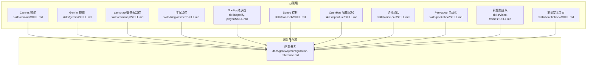

**图示来源**

- [skills/canvas/SKILL.md](file://skills/canvas/SKILL.md#L1-L199)
- [skills/gemini/SKILL.md](file://skills/gemini/SKILL.md#L1-L44)
- [skills/camsnap/SKILL.md](file://skills/camsnap/SKILL.md#L1-L46)
- [skills/blogwatcher/SKILL.md](file://skills/blogwatcher/SKILL.md#L1-L70)
- [skills/spotify-player/SKILL.md](file://skills/spotify-player/SKILL.md#L1-L65)
- [skills/sonoscli/SKILL.md](file://skills/sonoscli/SKILL.md#L1-L47)
- [skills/openhue/SKILL.md](file://skills/openhue/SKILL.md#L1-L52)
- [skills/voice-call/SKILL.md](file://skills/voice-call/SKILL.md#L1-L46)
- [skills/peekaboo/SKILL.md](file://skills/peekaboo/SKILL.md#L1-L191)
- [skills/video-frames/SKILL.md](file://skills/video-frames/SKILL.md#L1-L47)
- [skills/healthcheck/SKILL.md](file://skills/healthcheck/SKILL.md#L1-L246)
- [docs/gateway/configuration-reference.md](file://docs/gateway/configuration-reference.md#L1-L800)

**章节来源**

- [skills/canvas/SKILL.md](file://skills/canvas/SKILL.md#L1-L199)
- [skills/gemini/SKILL.md](file://skills/gemini/SKILL.md#L1-L44)
- [skills/camsnap/SKILL.md](file://skills/camsnap/SKILL.md#L1-L46)
- [skills/blogwatcher/SKILL.md](file://skills/blogwatcher/SKILL.md#L1-L70)
- [skills/spotify-player/SKILL.md](file://skills/spotify-player/SKILL.md#L1-L65)
- [skills/sonoscli/SKILL.md](file://skills/sonoscli/SKILL.md#L1-L47)
- [skills/openhue/SKILL.md](file://skills/openhue/SKILL.md#L1-L52)
- [skills/voice-call/SKILL.md](file://skills/voice-call/SKILL.md#L1-L46)
- [skills/peekaboo/SKILL.md](file://skills/peekaboo/SKILL.md#L1-L191)
- [skills/video-frames/SKILL.md](file://skills/video-frames/SKILL.md#L1-L47)
- [skills/healthcheck/SKILL.md](file://skills/healthcheck/SKILL.md#L1-L246)
- [docs/gateway/configuration-reference.md](file://docs/gateway/configuration-reference.md#L1-L800)

## 核心组件

- Canvas可视化：在连接节点（Mac/iOS/Android）的画布视图展示HTML内容，支持本地开发热重载与跨节点URL分发。
- 摄像头监控：基于camsnap抓取RTSP/ONVIF快照、片段与运动事件，依赖ffmpeg。
- Gemini AI：通过gemini CLI进行问答、摘要与生成，支持扩展管理与认证登录。
- 音乐播放：Spotify（spogo优先）与Sonos控制，支持设备发现、播放控制与队列操作。
- 智能家居：OpenHue控制Hue灯光与场景，需桥接发现与引导设置。
- 语音通话：通过voice-call插件发起或查询通话状态，支持Twilio/Telnyx/Plivo/mock。
- 博客监控：blogwatcher跟踪RSS/Atom源，扫描更新并标记已读。
- 自动化工具：Peekaboo用于macOS UI自动化；video-frames用于视频抽帧。
- 主机安全：healthcheck提供安全审计、版本检查与周期性任务调度建议。

**章节来源**

- [skills/canvas/SKILL.md](file://skills/canvas/SKILL.md#L1-L199)
- [skills/camsnap/SKILL.md](file://skills/camsnap/SKILL.md#L1-L46)
- [skills/gemini/SKILL.md](file://skills/gemini/SKILL.md#L1-L44)
- [skills/spotify-player/SKILL.md](file://skills/spotify-player/SKILL.md#L1-L65)
- [skills/sonoscli/SKILL.md](file://skills/sonoscli/SKILL.md#L1-L47)
- [skills/openhue/SKILL.md](file://skills/openhue/SKILL.md#L1-L52)
- [skills/voice-call/SKILL.md](file://skills/voice-call/SKILL.md#L1-L46)
- [skills/blogwatcher/SKILL.md](file://skills/blogwatcher/SKILL.md#L1-L70)
- [skills/peekaboo/SKILL.md](file://skills/peekaboo/SKILL.md#L1-L191)
- [skills/video-frames/SKILL.md](file://skills/video-frames/SKILL.md#L1-L47)
- [skills/healthcheck/SKILL.md](file://skills/healthcheck/SKILL.md#L1-L246)

## 架构总览

下图展示OpenClaw如何通过技能与插件对接外部服务，并由网关统一编排与路由。

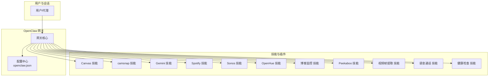

**图示来源**

- [docs/gateway/configuration-reference.md](file://docs/gateway/configuration-reference.md#L1-L800)
- [skills/canvas/SKILL.md](file://skills/canvas/SKILL.md#L1-L199)
- [skills/camsnap/SKILL.md](file://skills/camsnap/SKILL.md#L1-L46)
- [skills/gemini/SKILL.md](file://skills/gemini/SKILL.md#L1-L44)
- [skills/spotify-player/SKILL.md](file://skills/spotify-player/SKILL.md#L1-L65)
- [skills/sonoscli/SKILL.md](file://skills/sonoscli/SKILL.md#L1-L47)
- [skills/openhue/SKILL.md](file://skills/openhue/SKILL.md#L1-L52)
- [skills/blogwatcher/SKILL.md](file://skills/blogwatcher/SKILL.md#L1-L70)
- [skills/peekaboo/SKILL.md](file://skills/peekaboo/SKILL.md#L1-L191)
- [skills/video-frames/SKILL.md](file://skills/video-frames/SKILL.md#L1-L47)
- [skills/voice-call/SKILL.md](file://skills/voice-call/SKILL.md#L1-L46)
- [skills/healthcheck/SKILL.md](file://skills/healthcheck/SKILL.md#L1-L246)

## 详细组件分析

### Canvas 可视化

- 能力概述：在连接节点的画布视图展示HTML/CSS/JS内容，支持导航、隐藏、执行脚本与截图。
- 架构与绑定：画布主机（HTTP服务器）通过网关绑定策略（loopback、LAN、Tailnet、auto）决定可访问地址；节点通过桥接接收URL并在WebView渲染。
- 配置要点：canvasHost.enabled/port/root/liveReload；gateway.bind决定URL前缀与可访问性。
- 使用限制：localhost URL在Tailnet绑定下不可用，需使用Tailnet主机名；默认路径前缀为/**openclaw**/canvas/。
- 最佳实践：开发期启用liveReload；保持HTML自包含；先用默认index.html验证桥接诊断。
- 故障排查：白屏/加载失败通常因URL不匹配；检查bind模式、端口占用与直接curl测试；未指定node参数或节点离线会报错。

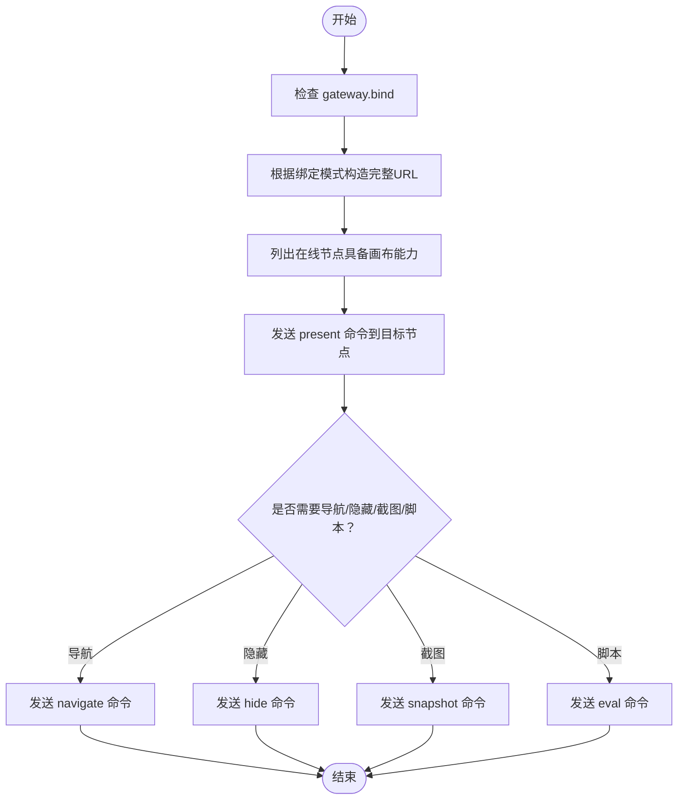

**图示来源**

- [skills/canvas/SKILL.md](file://skills/canvas/SKILL.md#L1-L199)

**章节来源**

- [skills/canvas/SKILL.md](file://skills/canvas/SKILL.md#L1-L199)

### 摄像头监控（camsnap）

- 能力概述：从RTSP/ONVIF摄像头抓取快照、录制短片、监控运动事件。
- 安装与配置：通过brew安装camsnap；配置文件位于~/.config/camsnap/config.yaml；添加摄像头时需提供主机、用户名、密码。
- 使用限制：依赖ffmpeg；建议先做短时测试再录制长片段。
- 最佳实践：使用discover探测设备信息；对阈值与动作进行小范围试验；定期doctor探针确保连通性。

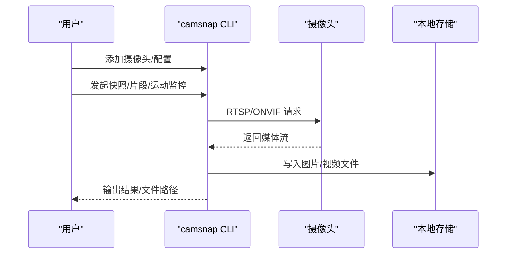

**图示来源**

- [skills/camsnap/SKILL.md](file://skills/camsnap/SKILL.md#L1-L46)

**章节来源**

- [skills/camsnap/SKILL.md](file://skills/camsnap/SKILL.md#L1-L46)

### Gemini AI（CLI）

- 能力概述：以一次性问答、摘要与生成为主，避免交互式模式。
- 认证与安装：通过brew安装gemini-cli；首次运行按提示完成交互式登录；避免使用--yolo。
- 使用限制：需网络可达；注意输出格式与模型选择。
- 最佳实践：先单次调用验证认证；结合扩展管理与输出格式控制。

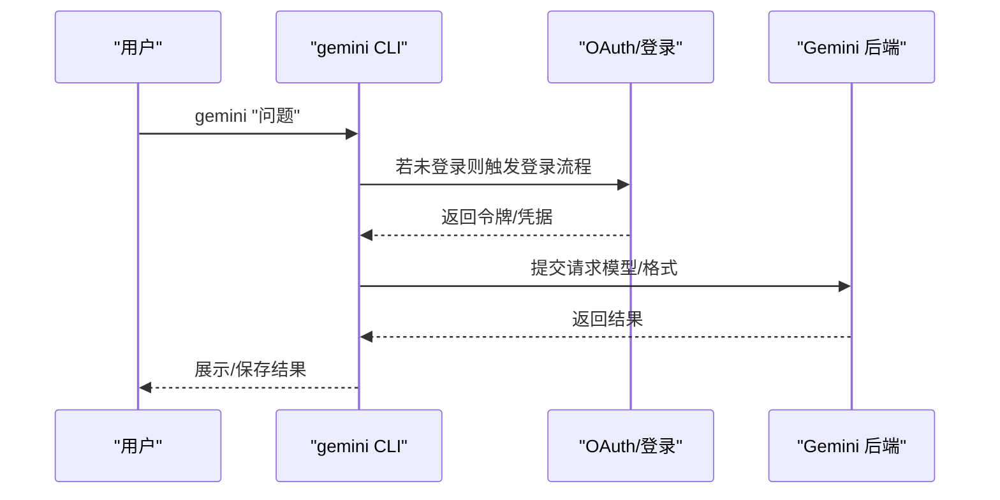

**图示来源**

- [skills/gemini/SKILL.md](file://skills/gemini/SKILL.md#L1-L44)

**章节来源**

- [skills/gemini/SKILL.md](file://skills/gemini/SKILL.md#L1-L44)

### 音乐播放（Spotify）

- 能力概述：使用spogo（首选）或spotify_player进行搜索、播放、设备切换与状态查询。
- 安装与认证：安装spogo或spotify_player；spogo可通过导入浏览器Cookie完成认证；需Premium账户。
- 使用限制：依赖Spotify Connect；设备名称可能冲突时需指定房间/ID。
- 最佳实践：先discover设备；使用status确认当前状态；通过device list/set选择目标设备。

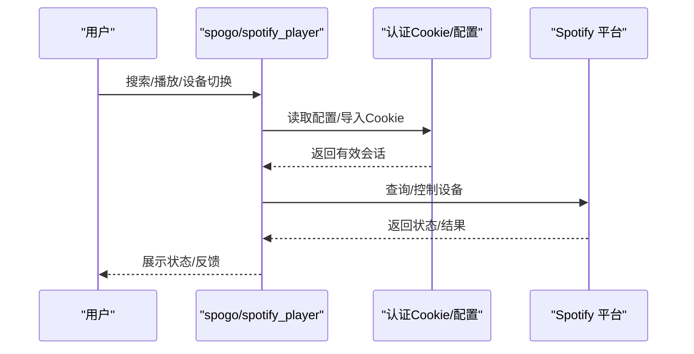

**图示来源**

- [skills/spotify-player/SKILL.md](file://skills/spotify-player/SKILL.md#L1-L65)

**章节来源**

- [skills/spotify-player/SKILL.md](file://skills/spotify-player/SKILL.md#L1-L65)

### Sonos 控制

- 能力概述：发现、状态查询、播放控制、音量调节、分组与收藏。
- 安装与使用：通过go安装sonoscli；若SSDP失败可指定IP；可选配置Spotify搜索（需客户端密钥）。
- 使用限制：局域网内通信；部分功能依赖服务端支持。
- 最佳实践：先discover；对分组与Party模式进行小范围测试。

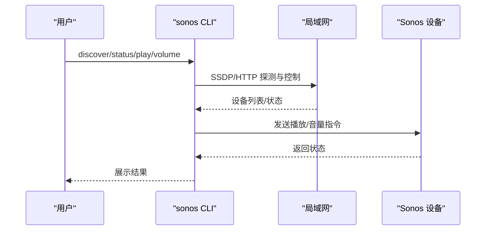

**图示来源**

- [skills/sonoscli/SKILL.md](file://skills/sonoscli/SKILL.md#L1-L47)

**章节来源**

- [skills/sonoscli/SKILL.md](file://skills/sonoscli/SKILL.md#L1-L47)

### 智能家居（OpenHue）

- 能力概述：通过OpenHue CLI控制Hue灯光、亮度、颜色与场景，需桥接发现与引导设置。
- 安装与使用：brew安装openhue；先discover桥接，再setup引导；随后可读写灯光/房间/场景。
- 使用限制：需按下Hue桥按钮完成配对；当灯光名称冲突时可指定房间。
- 最佳实践：先get light/room/scene核对状态；再set执行变更。

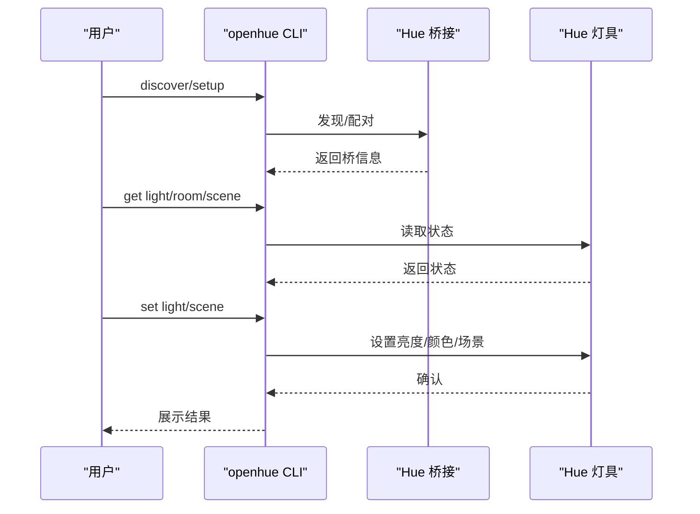

**图示来源**

- [skills/openhue/SKILL.md](file://skills/openhue/SKILL.md#L1-L52)

**章节来源**

- [skills/openhue/SKILL.md](file://skills/openhue/SKILL.md#L1-L52)

### 语音通话（Voice Call）

- 能力概述：通过voice-call插件发起或查询通话状态，支持Twilio、Telnyx、Plivo或mock。
- 配置要求：启用插件并配置provider（accountSid/authToken/fromNumber或apiKey/connectionId/fromNumber等）。
- 使用限制：需网络或mock环境；需明确callId进行后续操作。
- 最佳实践：先status查询；再initiate_call；必要时end_call或continue_call。

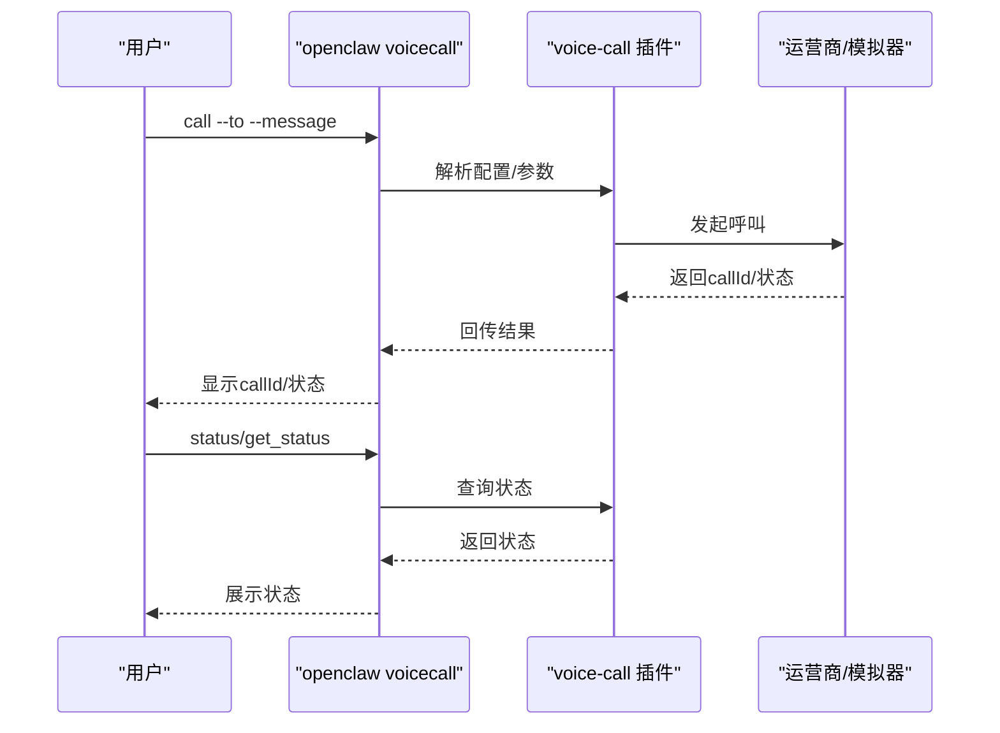

**图示来源**

- [skills/voice-call/SKILL.md](file://skills/voice-call/SKILL.md#L1-L46)

**章节来源**

- [skills/voice-call/SKILL.md](file://skills/voice-call/SKILL.md#L1-L46)

### 博客监控（blogwatcher）

- 能力概述：跟踪RSS/Atom订阅源，扫描新文章并标记已读。
- 安装与使用：通过go安装；add/list/scan/articles/read/read-all/remove等常用命令。
- 使用限制：需网络可达；命令行输出便于集成自动化。
- 最佳实践：先add订阅源；scan后read-all清理；定期维护订阅列表。

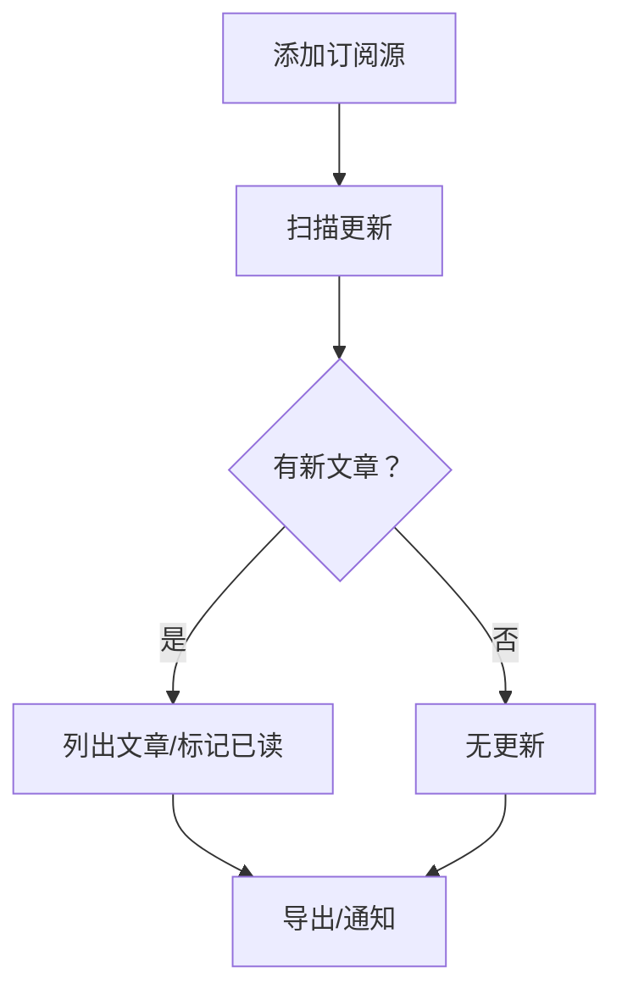

**图示来源**

- [skills/blogwatcher/SKILL.md](file://skills/blogwatcher/SKILL.md#L1-L70)

**章节来源**

- [skills/blogwatcher/SKILL.md](file://skills/blogwatcher/SKILL.md#L1-L70)

### 自动化工具（Peekaboo）

- 能力概述：macOS UI自动化，支持截图、元素识别、点击/输入、窗口/应用管理、菜单栏Dock操作等。
- 安装与权限：brew安装peekaboo；需屏幕录制与辅助功能权限；建议先permissions检查。
- 使用限制：需目标应用可见且元素可识别；建议先see标注再click/type。
- 最佳实践：see标注UI地图；click/type组合；app/窗口管理配合使用。

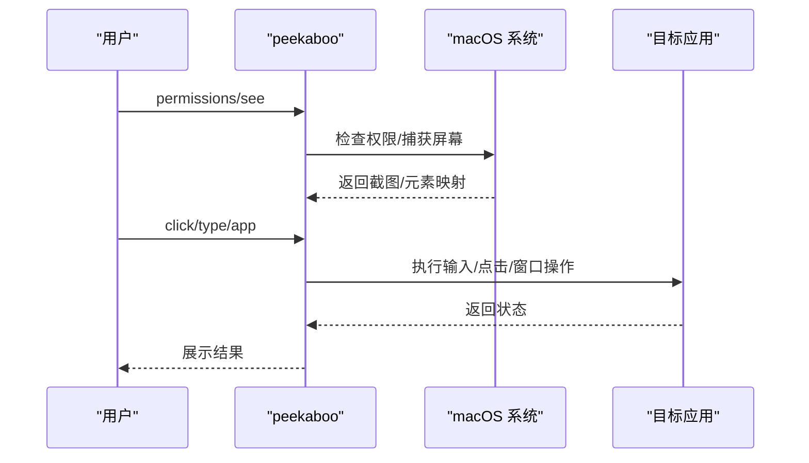

**图示来源**

- [skills/peekaboo/SKILL.md](file://skills/peekaboo/SKILL.md#L1-L191)

**章节来源**

- [skills/peekaboo/SKILL.md](file://skills/peekaboo/SKILL.md#L1-L191)

### 视频帧提取（video-frames）

- 能力概述：使用ffmpeg从视频中抽取首帧或指定时间戳帧，生成缩略图。
- 安装与使用：brew安装ffmpeg；通过脚本frame.sh指定输入与输出；推荐使用--time定位关键帧。
- 使用限制：需ffmpeg可用；图片质量可按用途选择.jpg/.png。
- 最佳实践：先用--time定位；再调整输出格式与质量。

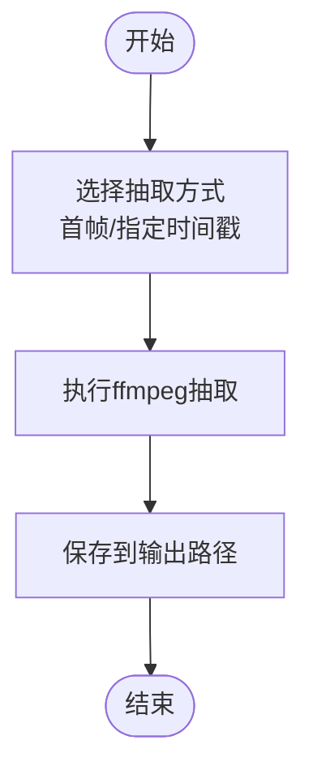

**图示来源**

- [skills/video-frames/SKILL.md](file://skills/video-frames/SKILL.md#L1-L47)

**章节来源**

- [skills/video-frames/SKILL.md](file://skills/video-frames/SKILL.md#L1-L47)

### 主机安全（healthcheck）

- 能力概述：评估与加固运行OpenClaw的主机，对防火墙、SSH、自动更新、备份、磁盘加密等进行检查与建议。
- 工作流：模型自检→建立上下文→只读检查→运行OpenClaw安全审计→版本状态检查→确定风险容忍度→生成修复计划→执行与验证→周期性任务调度建议。
- 使用限制：仅提供建议与安全默认收紧，不直接修改主机防火墙/SSH/系统更新策略；需显式批准变更。
- 最佳实践：先只读检查获得基线；再按风险等级制定修复计划；使用cron定期审计与版本检查。

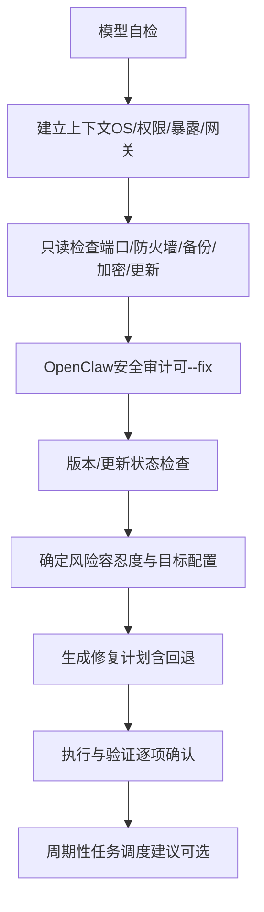

**图示来源**

- [skills/healthcheck/SKILL.md](file://skills/healthcheck/SKILL.md#L1-L246)

**章节来源**

- [skills/healthcheck/SKILL.md](file://skills/healthcheck/SKILL.md#L1-L246)

## 依赖关系分析

- 技能与外部二进制：多数技能通过系统包管理器安装外部CLI（如brew/go），并在技能文档中声明所需二进制与安装方式。
- 网关配置耦合：技能行为受openclaw.json影响（如通道策略、重试、超时、心跳等），尤其涉及跨节点分发（如Canvas）与消息路由（如聊天通道）。
- 插件与通道：语音通话等能力依赖插件配置（providers、凭证、fromNumber等），并通过网关统一调度。

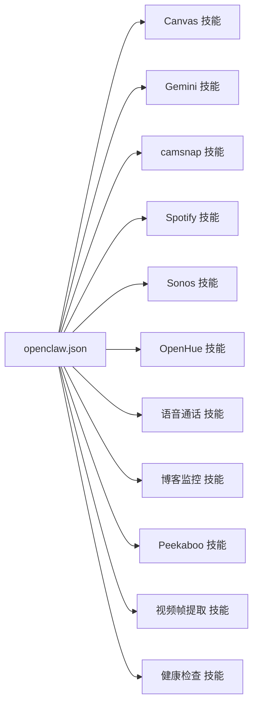

**图示来源**

- [docs/gateway/configuration-reference.md](file://docs/gateway/configuration-reference.md#L1-L800)
- [skills/canvas/SKILL.md](file://skills/canvas/SKILL.md#L1-L199)
- [skills/gemini/SKILL.md](file://skills/gemini/SKILL.md#L1-L44)
- [skills/camsnap/SKILL.md](file://skills/camsnap/SKILL.md#L1-L46)
- [skills/spotify-player/SKILL.md](file://skills/spotify-player/SKILL.md#L1-L65)
- [skills/sonoscli/SKILL.md](file://skills/sonoscli/SKILL.md#L1-L47)
- [skills/openhue/SKILL.md](file://skills/openhue/SKILL.md#L1-L52)
- [skills/voice-call/SKILL.md](file://skills/voice-call/SKILL.md#L1-L46)
- [skills/blogwatcher/SKILL.md](file://skills/blogwatcher/SKILL.md#L1-L70)
- [skills/peekaboo/SKILL.md](file://skills/peekaboo/SKILL.md#L1-L191)
- [skills/video-frames/SKILL.md](file://skills/video-frames/SKILL.md#L1-L47)
- [skills/healthcheck/SKILL.md](file://skills/healthcheck/SKILL.md#L1-L246)

**章节来源**

- [docs/gateway/configuration-reference.md](file://docs/gateway/configuration-reference.md#L1-L800)

## 性能考量

- Canvas热重载：开发期启用liveReload可显著提升迭代效率，但需关注文件监视与WebSocket注入带来的资源开销。
- 媒体处理：camsnap/ffmpeg抽帧/转码对CPU/GPU与I/O有压力，建议在空闲时段或专用节点执行。
- 网络调用：Gemini/Spotify/Sonos等均依赖网络，建议结合重试策略与超时配置（见网关配置参考）。
- UI自动化：Peekaboo频繁截图/元素识别会消耗系统资源，建议批量执行并减少不必要的标注。
- 音频/视频流：Sonos/Spotify播放时注意带宽与延迟，避免同时高并发操作。

## 故障排查指南

- Canvas白屏/无法加载
  - 检查gateway.bind与实际URL是否一致；使用curl直接访问确认；确保liveReload开启且根目录正确。
- Canvas报“node required/未连接”
  - 使用openclaw nodes list确认在线节点；确保目标节点具备画布能力。
- camsnap无法连接/无输出
  - 检查ffmpeg是否在PATH；使用discover与doctor探针；短时测试后再延长录制。
- Gemini认证失败
  - 首次运行gemini交互式登录；避免--yolo；确认网络可达。
- Spotify/sonos无法控制
  - 先status/ discover确认设备；检查Spotify Connect或局域网连通性；必要时指定IP。
- OpenHue配对失败
  - 按下桥按钮完成引导；确认网络与桥接可达。
- 语音通话异常
  - 检查插件配置与fromNumber；使用status查询callId；必要时end_call后重试。
- blogwatcher扫描无结果
  - 确认订阅源URL与网络；使用scan后read-all清理；定期维护订阅列表。
- Peekaboo权限不足
  - 运行peekaboo permissions检查；确保屏幕录制与辅助功能授权。
- healthcheck执行阻塞
  - 逐项审批变更；保留回退方案；记录审计日志。

**章节来源**

- [skills/canvas/SKILL.md](file://skills/canvas/SKILL.md#L151-L199)
- [skills/camsnap/SKILL.md](file://skills/camsnap/SKILL.md#L42-L46)
- [skills/gemini/SKILL.md](file://skills/gemini/SKILL.md#L40-L44)
- [skills/spotify-player/SKILL.md](file://skills/spotify-player/SKILL.md#L37-L65)
- [skills/sonoscli/SKILL.md](file://skills/sonoscli/SKILL.md#L43-L47)
- [skills/openhue/SKILL.md](file://skills/openhue/SKILL.md#L48-L52)
- [skills/voice-call/SKILL.md](file://skills/voice-call/SKILL.md#L38-L46)
- [skills/blogwatcher/SKILL.md](file://skills/blogwatcher/SKILL.md#L67-L70)
- [skills/peekaboo/SKILL.md](file://skills/peekaboo/SKILL.md#L187-L191)
- [skills/healthcheck/SKILL.md](file://skills/healthcheck/SKILL.md#L153-L246)

## 结论

OpenClaw通过技能与插件将多种外部服务整合到统一的网关框架中，既保证了灵活性，又提供了标准化的配置与安全策略。针对不同场景（可视化、监控、AI、娱乐、家居、通讯、自动化与安全），建议遵循“最小权限、显式批准、可观测性与可回退”的原则，结合网关配置与技能文档，构建稳定可靠的多服务协同体系。

## 附录

- 多服务协同示例
  - 场景一：家庭监控与可视化
    - camsnap定时抓拍→video-frames抽帧→Canvas展示→Peekaboo自动化点击“查看详情”→Spotify播放提醒音效。
  - 场景二：内容创作工作流
    - blogwatcher扫描→Gemini生成摘要→Canvas生成图文报告→OpenHue调节氛围灯→Sonos播放背景音乐。
  - 场景三：安全巡检与告警
    - healthcheck定期审计→生成修复计划→执行与验证→Canvas展示报告→语音通话通知负责人。
- 可用性监控与故障恢复
  - 使用网关配置中的重试、超时与心跳策略；为关键技能设置周期性任务；记录审计日志并保留回退方案；对认证失败与网络波动设计重试与降级路径。
