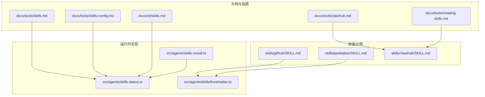
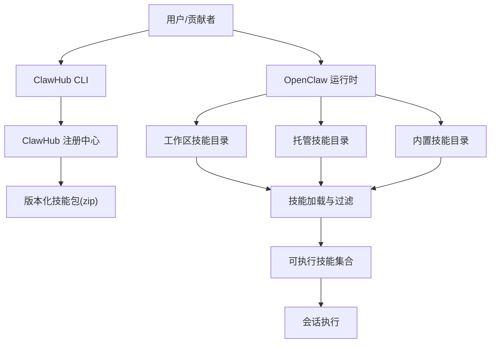
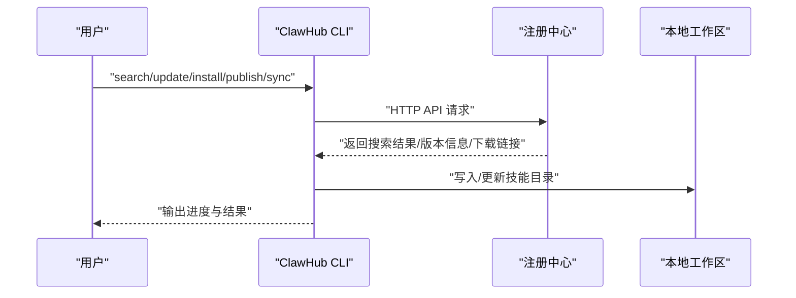
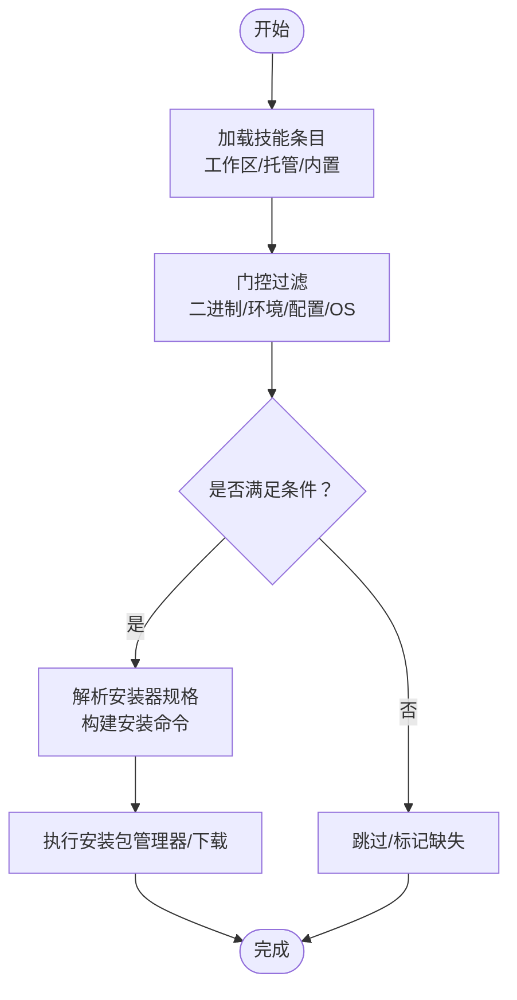
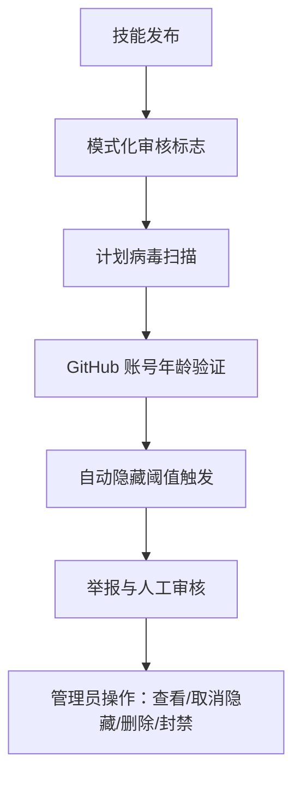
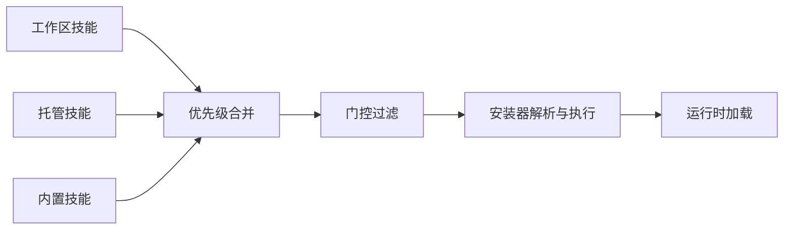

# 技能市场

<cite>
**本文引用的文件**
- [docs/tools/clawhub.md](file://docs/tools/clawhub.md)
- [docs/zh-CN/tools/clawhub.md](file://docs/zh-CN/tools/clawhub.md)
- [skills/clawhub/SKILL.md](file://skills/clawhub/SKILL.md)
- [docs/tools/skills.md](file://docs/tools/skills.md)
- [docs/tools/skills-config.md](file://docs/tools/skills-config.md)
- [docs/tools/creating-skills.md](file://docs/tools/creating-skills.md)
- [src/agents/skills-install.ts](file://src/agents/skills-install.ts)
- [src/agents/skills-status.ts](file://src/agents/skills-status.ts)
- [src/agents/skills/frontmatter.ts](file://src/agents/skills/frontmatter.ts)
- [docs/cli/skills.md](file://docs/cli/skills.md)
- [skills/github/SKILL.md](file://skills/github/SKILL.md)
- [skills/peekaboo/SKILL.md](file://skills/peekaboo/SKILL.md)
- [docs/security/THREAT-MODEL-ATLAS.md](file://docs/security/THREAT-MODEL-ATLAS.md)
- [extensions/open-prose/skills/prose/examples/38-skill-scan.prose](file://extensions/open-prose/skills/prose/examples/38-skill-scan.prose)
- [docs/start/showcase.md](file://docs/start/showcase.md)
</cite>

## 目录

1. [简介](#简介)
2. [项目结构](#项目结构)
3. [核心组件](#核心组件)
4. [架构总览](#架构总览)
5. [详细组件分析](#详细组件分析)
6. [依赖关系分析](#依赖关系分析)
7. [性能考量](#性能考量)
8. [故障排查指南](#故障排查指南)
9. [结论](#结论)
10. [附录](#附录)

## 简介

本文件面向OpenClaw技能市场（ClawHub）的使用者与贡献者，系统性阐述技能注册表的工作原理、技能发现与搜索机制、发布与审核流程、版本管理与更新策略、安装与依赖解析、安全与信誉体系，以及面向贡献者的开发指南与社区参与方式。文档同时给出面向非技术用户的操作步骤与最佳实践，帮助快速上手并安全地扩展智能体能力。

## 项目结构

围绕技能市场的关键知识与实现分布在以下区域：

- 文档层：ClawHub使用指南、技能系统说明、技能创建与配置参考、CLI参考等
- 技能层：大量示例技能（如GitHub、Peekaboo等），展示元数据、安装器与使用方法
- 运行时层：技能加载、安装、状态检查与依赖解析逻辑



**图表来源**

- [docs/tools/clawhub.md](file://docs/tools/clawhub.md#L1-L258)
- [docs/tools/skills.md](file://docs/tools/skills.md#L1-L301)
- [docs/tools/skills-config.md](file://docs/tools/skills-config.md#L1-L77)
- [docs/tools/creating-skills.md](file://docs/tools/creating-skills.md#L1-L55)
- [docs/cli/skills.md](file://docs/cli/skills.md#L1-L27)
- [skills/github/SKILL.md](file://skills/github/SKILL.md#L1-L78)
- [skills/peekaboo/SKILL.md](file://skills/peekaboo/SKILL.md#L1-L191)
- [skills/clawhub/SKILL.md](file://skills/clawhub/SKILL.md#L1-L78)
- [src/agents/skills-install.ts](file://src/agents/skills-install.ts#L396-L443)
- [src/agents/skills-status.ts](file://src/agents/skills-status.ts#L297-L323)
- [src/agents/skills/frontmatter.ts](file://src/agents/skills/frontmatter.ts#L46-L100)

**章节来源**

- [docs/tools/clawhub.md](file://docs/tools/clawhub.md#L1-L258)
- [docs/tools/skills.md](file://docs/tools/skills.md#L1-L301)
- [docs/tools/skills-config.md](file://docs/tools/skills-config.md#L1-L77)
- [docs/tools/creating-skills.md](file://docs/tools/creating-skills.md#L1-L55)
- [docs/cli/skills.md](file://docs/cli/skills.md#L1-L27)
- [skills/github/SKILL.md](file://skills/github/SKILL.md#L1-L78)
- [skills/peekaboo/SKILL.md](file://skills/peekaboo/SKILL.md#L1-L191)
- [skills/clawhub/SKILL.md](file://skills/clawhub/SKILL.md#L1-L78)
- [src/agents/skills-install.ts](file://src/agents/skills-install.ts#L396-L443)
- [src/agents/skills-status.ts](file://src/agents/skills-status.ts#L297-L323)
- [src/agents/skills/frontmatter.ts](file://src/agents/skills/frontmatter.ts#L46-L100)

## 核心组件

- 技能注册表（ClawHub）：公共技能注册中心，提供浏览、搜索、版本化下载、星评与评论、审核与举报、CLI友好API等能力
- 技能系统（OpenClaw）：多来源技能加载（内置、托管、工作区），按环境与配置进行加载过滤与依赖解析
- CLI工具链：ClawHub CLI负责搜索、安装、更新、发布、同步；OpenClaw CLI提供技能状态检查与调试
- 示例技能：展示元数据、安装器定义、使用示例与跨平台要求

**章节来源**

- [docs/tools/clawhub.md](file://docs/tools/clawhub.md#L12-L98)
- [docs/tools/skills.md](file://docs/tools/skills.md#L9-L49)
- [docs/cli/skills.md](file://docs/cli/skills.md#L9-L26)
- [skills/github/SKILL.md](file://skills/github/SKILL.md#L1-L28)
- [skills/peekaboo/SKILL.md](file://skills/peekaboo/SKILL.md#L1-L23)

## 架构总览

ClawHub作为公共注册中心，提供技能的版本化打包与元数据索引；OpenClaw侧负责在工作区、托管与内置技能之间进行优先级合并与加载过滤；CLI工具链贯穿技能的发现、安装、更新与发布。



**图表来源**

- [docs/tools/clawhub.md](file://docs/tools/clawhub.md#L67-L72)
- [docs/tools/skills.md](file://docs/tools/skills.md#L13-L26)
- [src/agents/skills-status.ts](file://src/agents/skills-status.ts#L297-L323)

**章节来源**

- [docs/tools/clawhub.md](file://docs/tools/clawhub.md#L67-L72)
- [docs/tools/skills.md](file://docs/tools/skills.md#L13-L26)
- [src/agents/skills-status.ts](file://src/agents/skills-status.ts#L297-L323)

## 详细组件分析

### 组件A：ClawHub技能注册与CLI工作流

- 功能要点
  - 公共浏览与搜索：基于嵌入向量的语义搜索，支持标签与版本
  - 版本化与下载：每个版本以zip形式提供，支持latest等标签
  - 社区反馈：星评与评论
  - 审核与举报：报告机制与自动隐藏阈值，管理员可处理
  - CLI友好API：支持自动化与脚本
- 用户工作流
  - 搜索：clawhub search "查询"
  - 安装：clawhub install <slug>，支持指定版本与强制覆盖
  - 更新：clawhub update <slug> 或 --all，支持强制覆盖
  - 发布/同步：clawhub publish 或 sync，支持批量与干运行
- 安全与合规
  - 默认开放上传，但对GitHub账号年龄有要求
  - 举报与自动隐藏机制，滥用举报可能封禁账户



**图表来源**

- [docs/tools/clawhub.md](file://docs/tools/clawhub.md#L118-L186)
- [docs/zh-CN/tools/clawhub.md](file://docs/zh-CN/tools/clawhub.md#L70-L138)

**章节来源**

- [docs/tools/clawhub.md](file://docs/tools/clawhub.md#L12-L98)
- [docs/tools/clawhub.md](file://docs/tools/clawhub.md#L118-L186)
- [docs/zh-CN/tools/clawhub.md](file://docs/zh-CN/tools/clawhub.md#L41-L138)

### 组件B：OpenClaw技能加载与依赖解析

- 多源加载与优先级
  - 内置技能（最低优先级）
  - 托管技能（~/.openclaw/skills）
  - 工作区技能（<workspace>/skills，最高优先级）
- 加载过滤（门控）
  - 基于元数据的条件：二进制、环境变量、配置项、操作系统
  - 支持安装器定义（brew/node/go/download），按平台与偏好选择
- 状态检查与调试
  - openclaw skills list/info/check，识别缺失依赖与可用技能
- 安装实现
  - 解析安装器规格，构建安装命令，执行下载或包管理器安装
  - 对下载型安装器进行目标路径与归档解压处理



**图表来源**

- [docs/tools/skills.md](file://docs/tools/skills.md#L105-L186)
- [src/agents/skills-install.ts](file://src/agents/skills-install.ts#L396-L443)
- [src/agents/skills/frontmatter.ts](file://src/agents/skills/frontmatter.ts#L46-L90)

**章节来源**

- [docs/tools/skills.md](file://docs/tools/skills.md#L13-L49)
- [docs/tools/skills.md](file://docs/tools/skills.md#L105-L186)
- [src/agents/skills-install.ts](file://src/agents/skills-install.ts#L396-L443)
- [src/agents/skills/frontmatter.ts](file://src/agents/skills/frontmatter.ts#L46-L100)
- [docs/cli/skills.md](file://docs/cli/skills.md#L9-L26)

### 组件C：示例技能与最佳实践

- GitHub技能：展示二进制依赖（gh）、多平台安装器（brew/apt）
- Peekaboo技能：展示macOS专属能力、权限要求与丰富命令示例
- 元数据与安装器：强调metadata.openclaw.requires与install字段的重要性
- 创建指南：从理解场景、规划资源、初始化模板、编辑与打包到迭代优化

```mermaid
classDiagram
class GitHubSkill {
+name : "github"
+description : "使用 gh CLI 与 GitHub 交互"
+requires : bins["gh"]
+install : [{brew}, {apt}]
}
class PeekabooSkill {
+name : "peekaboo"
+description : "macOS UI 自动化"
+os : ["darwin"]
+requires : bins["peekaboo"]
+install : [{brew}]
}
class SkillCreator {
+init_skill.py
+package_skill.py
+quick_validate.py
}
GitHubSkill --> SkillCreator : "遵循创建规范"
PeekabooSkill --> SkillCreator : "遵循创建规范"
```

**图表来源**

- [skills/github/SKILL.md](file://skills/github/SKILL.md#L1-L28)
- [skills/peekaboo/SKILL.md](file://skills/peekaboo/SKILL.md#L1-L23)
- [docs/tools/creating-skills.md](file://docs/tools/creating-skills.md#L1-L55)

**章节来源**

- [skills/github/SKILL.md](file://skills/github/SKILL.md#L1-L78)
- [skills/peekaboo/SKILL.md](file://skills/peekaboo/SKILL.md#L1-L191)
- [docs/tools/creating-skills.md](file://docs/tools/creating-skills.md#L1-L55)

### 组件D：安全机制与信誉体系

- 供应链信任边界：ClawHub作为第5道信任边界，实施模式化审核标志、未来计划引入病毒扫描、验证发布者GitHub账号年龄
- 安全扫描与历史追踪：可维护扫描历史、风险趋势与内容哈希对比，建议定期重扫与修复
- 举报与自动隐藏：用户可举报，超过阈值自动隐藏；管理员可查看、取消隐藏、删除或封禁
- 运行时安全建议：第三方技能视为不受信代码，优先沙箱执行，谨慎注入密钥



**图表来源**

- [docs/security/THREAT-MODEL-ATLAS.md](file://docs/security/THREAT-MODEL-ATLAS.md#L114-L122)
- [extensions/open-prose/skills/prose/examples/38-skill-scan.prose](file://extensions/open-prose/skills/prose/examples/38-skill-scan.prose#L226-L245)

**章节来源**

- [docs/security/THREAT-MODEL-ATLAS.md](file://docs/security/THREAT-MODEL-ATLAS.md#L114-L122)
- [extensions/open-prose/skills/prose/examples/38-skill-scan.prose](file://extensions/open-prose/skills/prose/examples/38-skill-scan.prose#L226-L245)

## 依赖关系分析

- 技能来源与优先级：工作区 > 托管 > 内置
- 门控规则：二进制存在、环境变量、配置项、操作系统
- 安装器偏好：brew优先、node管理器可配置
- CLI与运行时协作：ClawHub CLI负责下载与版本管理，OpenClaw负责加载与执行



**图表来源**

- [docs/tools/skills.md](file://docs/tools/skills.md#L13-L26)
- [docs/tools/skills-config.md](file://docs/tools/skills-config.md#L17-L25)
- [src/agents/skills-install.ts](file://src/agents/skills-install.ts#L396-L443)

**章节来源**

- [docs/tools/skills.md](file://docs/tools/skills.md#L13-L26)
- [docs/tools/skills-config.md](file://docs/tools/skills-config.md#L17-L25)
- [src/agents/skills-install.ts](file://src/agents/skills-install.ts#L396-L443)

## 性能考量

- 技能快照：会话启动时对可执行技能进行快照，后续回合复用，避免重复构建提示成本
- 上下文开销估算：技能列表注入到系统提示的成本与字符长度相关，建议控制技能数量与描述长度
- 监视与热重载：启用技能监视可在文件变更时刷新技能快照，减少重启成本

**章节来源**

- [docs/tools/skills.md](file://docs/tools/skills.md#L240-L244)
- [docs/tools/skills.md](file://docs/tools/skills.md#L267-L283)

## 故障排查指南

- 使用openclaw skills命令检查技能状态，识别缺失二进制、环境变量或配置项
- 若安装失败，检查安装器规格与平台兼容性，确认包管理器可用
- 若更新冲突，确认本地文件与已发布版本的哈希差异，必要时使用强制覆盖
- 如遇权限问题，检查macOS权限或容器内二进制是否存在

**章节来源**

- [docs/cli/skills.md](file://docs/cli/skills.md#L9-L26)
- [src/agents/skills-install.ts](file://src/agents/skills-install.ts#L396-L443)
- [src/agents/skills-status.ts](file://src/agents/skills-status.ts#L297-L323)

## 结论

ClawHub为OpenClaw生态提供了开放、可发现、可版本化的技能市场，结合OpenClaw的多源加载与门控机制，实现了灵活、可控且安全的能力扩展。通过标准化的元数据与安装器定义、完善的CLI工具链与安全审核体系，用户与贡献者可以高效地发现、安装、更新与发布技能，同时保障运行时的安全与稳定性。

## 附录

### A. 浏览、搜索与安装操作指南（非技术用户）

- 浏览与搜索
  - 在ClawHub网站或使用clawhub search "关键词"
- 安装技能
  - clawhub install <技能标识>
  - 支持指定版本：--version <版本号>
- 更新技能
  - clawhub update --all 或针对单个技能
  - 强制覆盖：--force
- 启动新会话以加载新技能

**章节来源**

- [docs/tools/clawhub.md](file://docs/tools/clawhub.md#L37-L53)
- [docs/tools/clawhub.md](file://docs/tools/clawhub.md#L141-L158)

### B. 发布与同步（贡献者指南）

- 单次发布
  - clawhub publish <路径> --slug <标识> --name <名称> --version <版本> --tags latest
- 批量同步
  - clawhub sync --all
  - 支持干运行：--dry-run
  - 版本号递增：--bump patch|minor|major
- 环境变量
  - CLAWHUB_REGISTRY、CLAWHUB_WORKDIR、CLAWHUB_DISABLE_TELEMETRY

**章节来源**

- [docs/tools/clawhub.md](file://docs/tools/clawhub.md#L163-L186)
- [docs/tools/clawhub.md](file://docs/tools/clawhub.md#L251-L258)

### C. 版本管理与更新通知

- 语义化版本：每次发布创建新版本，保留历史便于审计
- 标签策略：latest等标签指向具体版本，支持回滚
- 更新策略：基于内容哈希比对，未匹配版本需确认或强制覆盖

**章节来源**

- [docs/tools/clawhub.md](file://docs/tools/clawhub.md#L224-L232)

### D. 依赖解析与安装器

- 安装器类型：brew、apt、node、go、download
- 平台过滤：os字段限制
- 偏好设置：preferBrew、nodeManager

**章节来源**

- [docs/tools/skills.md](file://docs/tools/skills.md#L147-L183)
- [docs/tools/skills-config.md](file://docs/tools/skills-config.md#L17-L25)

### E. 安全与信誉

- 供应链安全：ClawHub作为信任边界，实施审核与举报机制
- 运行时安全：第三方技能视为不受信，建议沙箱执行与最小权限原则
- 举报与封禁：滥用举报将导致封禁

**章节来源**

- [docs/security/THREAT-MODEL-ATLAS.md](file://docs/security/THREAT-MODEL-ATLAS.md#L114-L122)
- [docs/tools/skills.md](file://docs/tools/skills.md#L69-L75)

### F. 社区参与与案例

- 展示案例：社区构建的自动化、知识记忆、语音电话、基础设施部署等项目
- 参与方式：在Discord/#showcase分享项目，获取展示机会

**章节来源**

- [docs/start/showcase.md](file://docs/start/showcase.md#L1-L417)
