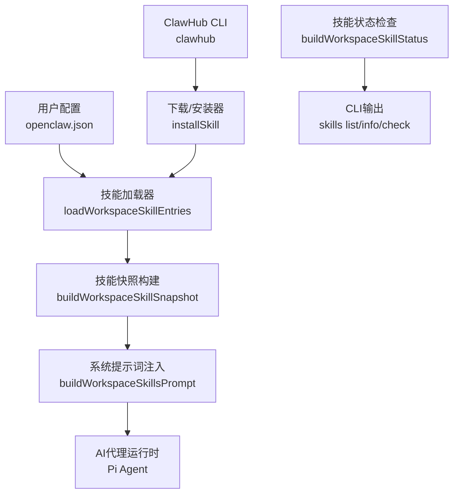
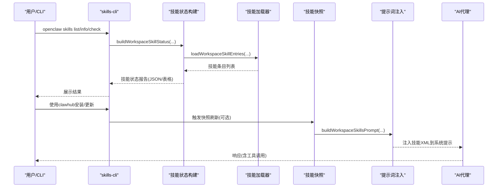
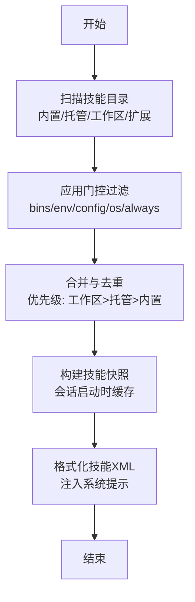
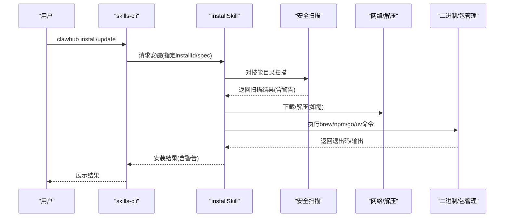
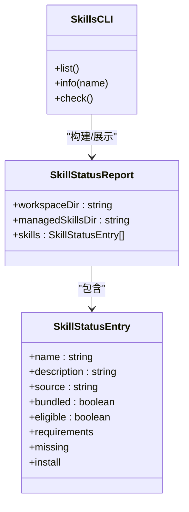
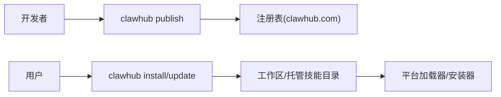
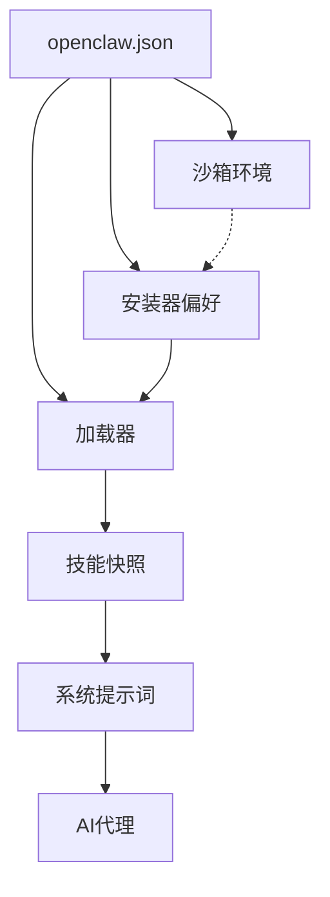

# 技能平台

<cite>
**本文引用的文件**
- [README.md](file://README.md)
- [skills.md](file://docs/tools/skills.md)
- [creating-skills.md](file://docs/tools/creating-skills.md)
- [skills-config.md](file://docs/tools/skills-config.md)
- [clawhub/SKILL.md](file://skills/clawhub/SKILL.md)
- [skills.ts](file://src/agents/skills.ts)
- [skills-install.ts](file://src/agents/skills-install.ts)
- [skills-status.ts](file://src/agents/skills-status.ts)
- [skills-cli.ts](file://src/cli/skills-cli.ts)
</cite>

## 目录

1. [简介](#简介)
2. [项目结构](#项目结构)
3. [核心组件](#核心组件)
4. [架构总览](#架构总览)
5. [组件详解](#组件详解)
6. [依赖关系分析](#依赖关系分析)
7. [性能考量](#性能考量)
8. [故障排查指南](#故障排查指南)
9. [结论](#结论)
10. [附录](#附录)

## 简介

本文件面向OpenClaw技能平台，系统化阐述技能系统的设计原理、开发流程、配置管理、安装门控与UI集成、生命周期与发布流程、与AI代理的集成方式、工具调用与上下文处理，以及ClawHub技能注册表的工作机制。目标是帮助开发者快速上手、规范开发与发布，并在多平台与多Agent环境下稳定运行。

## 项目结构

OpenClaw采用“多Agent工作区 + 技能目录”的组织方式，技能来源包括内置（bundled）、本地覆盖（managed/local）与工作区（workspace），并通过统一的加载与筛选机制在运行时构建“技能快照”，注入到系统提示词中供模型使用。

图示来源

- [skills.ts](file://src/agents/skills.ts#L26-L34)
- [skills-install.ts](file://src/agents/skills-install.ts#L396-L571)
- [skills-status.ts](file://src/agents/skills-status.ts#L297-L323)
- [skills-cli.ts](file://src/cli/skills-cli.ts#L342-L415)

章节来源

- [README.md](file://README.md#L259-L264)
- [skills.md](file://docs/tools/skills.md#L13-L40)

## 核心组件

- 技能加载与快照：负责扫描多源技能目录、解析元数据、过滤门控条件、生成会话级技能快照。
- 安装器与安全扫描：支持brew/node/go/uv/download等多种安装方式，并对技能目录进行安全扫描与警告。
- 技能状态报告：汇总技能可用性、缺失项、可选安装项，用于CLI展示与用户决策。
- CLI技能子命令：提供list/info/check等能力，辅助开发者与运维人员诊断与管理技能。
- ClawHub集成：通过clawhub技能向导式安装、更新与发布，打通技能生态。

章节来源

- [skills.ts](file://src/agents/skills.ts#L1-L47)
- [skills-install.ts](file://src/agents/skills-install.ts#L1-L572)
- [skills-status.ts](file://src/agents/skills-status.ts#L1-L324)
- [skills-cli.ts](file://src/cli/skills-cli.ts#L1-L416)
- [clawhub/SKILL.md](file://skills/clawhub/SKILL.md#L1-L78)

## 架构总览

技能系统围绕“配置驱动 + 多源加载 + 运行时快照 + 提示词注入”的闭环设计，确保在不同平台、不同Agent与不同沙箱模式下保持一致的行为与可观测性。

图示来源

- [skills-cli.ts](file://src/cli/skills-cli.ts#L342-L415)
- [skills-status.ts](file://src/agents/skills-status.ts#L297-L323)
- [skills.ts](file://src/agents/skills.ts#L26-L34)

## 组件详解

### 技能加载与快照

- 加载顺序与优先级：工作区技能 > 本地/托管技能 > 内置技能；可通过配置扩展额外扫描目录。
- 过滤门控：基于metadata.openclaw中的requires.bins/anyBins/env/config/os/always等字段在加载期剔除不满足条件的技能。
- 快照复用：会话开始时缓存“可用技能”列表，同一会话内复用，变更在新会话生效或启用监视后热更新。
- 提示词注入：将技能清单以紧凑XML形式注入系统提示，影响token开销与成本。

图示来源

- [skills.md](file://docs/tools/skills.md#L105-L187)
- [skills.ts](file://src/agents/skills.ts#L26-L34)

章节来源

- [skills.md](file://docs/tools/skills.md#L13-L40)
- [skills.md](file://docs/tools/skills.md#L105-L187)
- [skills.ts](file://src/agents/skills.ts#L26-L34)

### 安装器与安全扫描

- 支持安装器类型：brew、node/npm/pnpm/yarn/bun、go、uv、download（含自动解压与stripComponents）。
- 平台与二进制探测：优先使用brew（可配置偏好），缺失时尝试通过Homebrew安装对应工具链；download类型按URL与归档类型自动识别并解压。
- 安全扫描：安装前对技能目录执行代码模式扫描，发现高危/可疑模式时发出警告，建议后续执行深度审计。
- 输出与失败处理：标准化stdout/stderr/code输出，失败时给出摘要信息便于排障。

图示来源

- [skills-install.ts](file://src/agents/skills-install.ts#L396-L571)
- [skills-install.ts](file://src/agents/skills-install.ts#L104-L131)
- [clawhub/SKILL.md](file://skills/clawhub/SKILL.md#L44-L77)

章节来源

- [skills-install.ts](file://src/agents/skills-install.ts#L1-L572)
- [clawhub/SKILL.md](file://skills/clawhub/SKILL.md#L1-L78)

### 技能状态与CLI

- 状态维度：可用性(eligible)、禁用(disabled)、被允许列表(blockedByAllowlist)、缺失项(bins/env/config/os)、可选安装选项。
- CLI能力：list（全部/仅可用）、info（详情与要求）、check（汇总统计与缺失清单）。
- 可视化输出：支持表格与JSON两种格式，便于自动化集成。

图示来源

- [skills-status.ts](file://src/agents/skills-status.ts#L33-L70)
- [skills-cli.ts](file://src/cli/skills-cli.ts#L342-L415)

章节来源

- [skills-status.ts](file://src/agents/skills-status.ts#L1-L324)
- [skills-cli.ts](file://src/cli/skills-cli.ts#L1-L416)

### ClawHub技能注册表

- 功能：搜索、安装、更新、列出、发布技能；默认注册表与工作目录可配置。
- 与平台集成：clawhub作为技能入口，安装后由平台加载器与安装器接管后续生命周期管理。
- 发布流程：通过clawhub CLI发布至注册表，支持语义化版本与变更日志。

图示来源

- [clawhub/SKILL.md](file://skills/clawhub/SKILL.md#L67-L77)
- [skills.md](file://docs/tools/skills.md#L50-L68)

章节来源

- [skills.md](file://docs/tools/skills.md#L50-L68)
- [clawhub/SKILL.md](file://skills/clawhub/SKILL.md#L1-L78)

### 与AI代理的集成与上下文处理

- 模型提示词：平台将“可用技能XML”注入系统提示，影响模型对工具调用的决策与行为。
- 令牌开销：提供估算公式，便于成本控制与提示长度规划。
- 运行时环境：支持在会话启动时注入技能所需环境变量，结束后恢复原环境，避免全局污染。
- 跨节点能力：当Gateway运行于Linux且存在允许system.run的macOS节点时，可将节点上的二进制能力纳入技能可用性评估。

章节来源

- [skills.md](file://docs/tools/skills.md#L228-L251)
- [skills.md](file://docs/tools/skills.md#L267-L284)

## 依赖关系分析

- 配置驱动：openclaw.json决定技能启用/禁用、额外扫描目录、安装偏好、沙箱环境注入等。
- 平台差异：不同操作系统与包管理器影响安装器选择与二进制探测；Node运行时偏好可配置。
- 安全边界：沙箱模式下，技能进程不在宿主继承环境，需通过沙箱镜像或全局环境注入。

图示来源

- [skills-config.md](file://docs/tools/skills-config.md#L13-L39)
- [skills-install.ts](file://src/agents/skills-install.ts#L42-L46)
- [skills-status.ts](file://src/agents/skills-status.ts#L66-L77)

章节来源

- [skills-config.md](file://docs/tools/skills-config.md#L1-L77)
- [skills-install.ts](file://src/agents/skills-install.ts#L42-L46)
- [skills-status.ts](file://src/agents/skills-status.ts#L66-L77)

## 性能考量

- 技能提示词长度：技能XML注入具有确定性开销，建议控制技能数量与描述长度，必要时启用watch减少频繁扫描。
- 会话快照复用：同一会话内复用技能快照，避免重复解析；变更在新会话或监视触发后生效。
- 安装超时与失败：安装器设置合理超时，失败时输出摘要便于快速定位；下载/解压失败需检查网络与归档类型。

章节来源

- [skills.md](file://docs/tools/skills.md#L240-L245)
- [skills.md](file://docs/tools/skills.md#L267-L284)
- [skills-install.ts](file://src/agents/skills-install.ts#L396-L571)

## 故障排查指南

- 技能不可用
  - 使用openclaw skills check查看缺失项（二进制、环境变量、配置、操作系统）。
  - 若为brew/node/go/uv缺失，根据提示安装或调整偏好。
  - 若为download类型，检查URL与归档类型是否匹配。
- 安全扫描告警
  - 安装前扫描发现可疑模式会发出警告，建议运行深度审计或修正脚本。
- 提示词过长导致成本上升
  - 减少不必要的技能暴露，或优化描述长度；必要时调整提示策略。
- 沙箱环境变量未生效
  - 在沙箱配置中显式注入环境变量，或使用自定义镜像。

章节来源

- [skills-cli.ts](file://src/cli/skills-cli.ts#L258-L337)
- [skills-install.ts](file://src/agents/skills-install.ts#L104-L131)
- [skills-status.ts](file://src/agents/skills-status.ts#L66-L77)

## 结论

OpenClaw技能平台以“配置驱动 + 多源加载 + 运行时快照 + 提示词注入”为核心，结合ClawHub生态与完善的安装器与安全扫描机制，提供了从开发、测试、发布到运行维护的全生命周期支持。通过合理的门控与环境管理，可在多Agent、多平台与沙箱场景下稳定扩展AI代理的能力边界。

## 附录

### 开发者速查

- 创建技能：在工作区skills目录下新建目录与SKILL.md，遵循AgentSkills规范。
- 配置技能：在openclaw.json中通过skills.entries覆盖启用/禁用、环境变量与自定义配置。
- 安装与更新：使用clawhub CLI进行安装、更新与发布。
- 监控与诊断：使用openclaw skills list/info/check进行可视化诊断。

章节来源

- [creating-skills.md](file://docs/tools/creating-skills.md#L13-L55)
- [skills-config.md](file://docs/tools/skills-config.md#L13-L39)
- [skills.md](file://docs/tools/skills.md#L50-L68)
- [skills-cli.ts](file://src/cli/skills-cli.ts#L342-L415)
