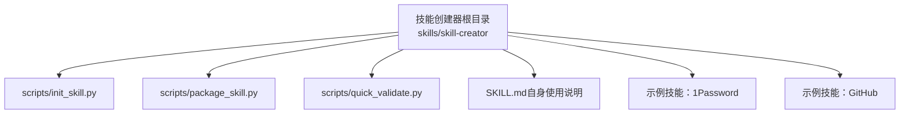
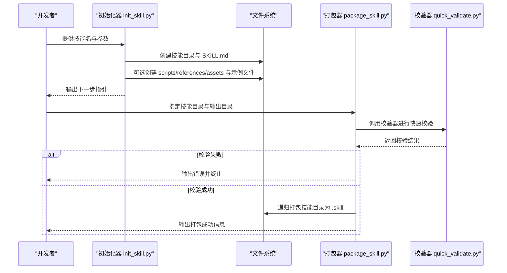
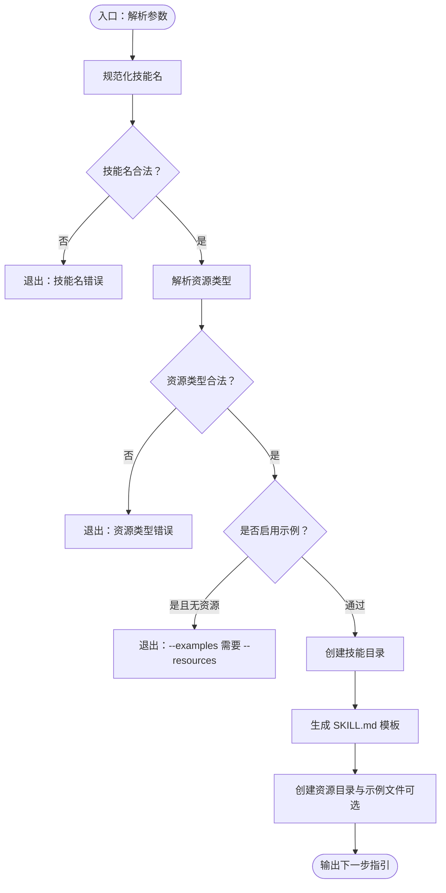
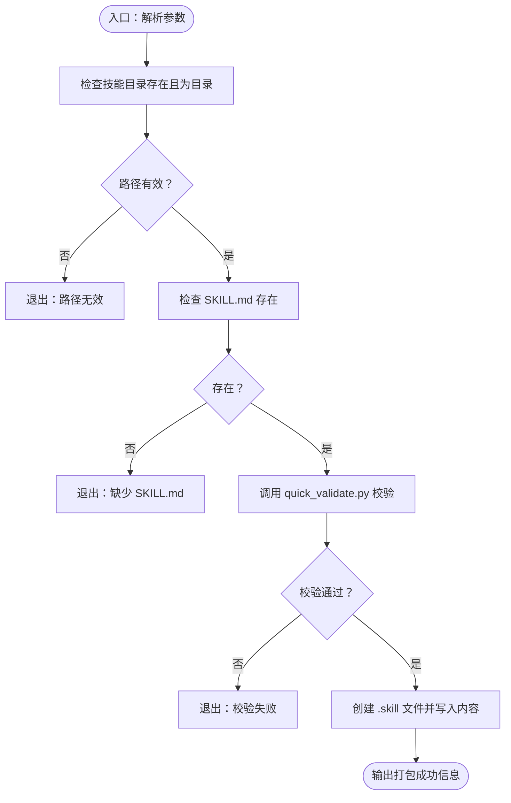
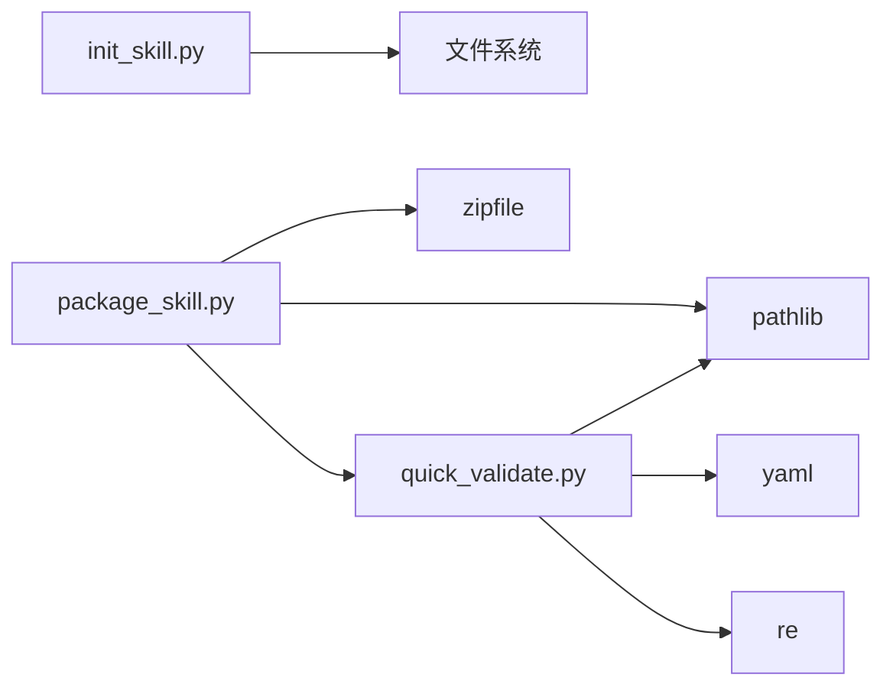

# 技能创建器使用指南

<cite>
**本文引用的文件**
- [init_skill.py](file://skills/skill-creator/scripts/init_skill.py)
- [package_skill.py](file://skills/skill-creator/scripts/package_skill.py)
- [quick_validate.py](file://skills/skill-creator/scripts/quick_validate.py)
- [技能创建器 SKILL.md](file://skills/skill-creator/SKILL.md)
- [1Password 技能 SKILL.md](file://skills/1password/SKILL.md)
- [GitHub 技能 SKILL.md](file://skills/github/SKILL.md)
- [1Password 参考：get-started.md](file://skills/1password/references/get-started.md)
- [创建技能（文档）](file://docs/tools/creating-skills.md)
</cite>

## 目录

1. [简介](#简介)
2. [项目结构](#项目结构)
3. [核心组件](#核心组件)
4. [架构总览](#架构总览)
5. [详细组件分析](#详细组件分析)
6. [依赖关系分析](#依赖关系分析)
7. [性能与可维护性建议](#性能与可维护性建议)
8. [故障排查指南](#故障排查指南)
9. [结论](#结论)
10. [附录：命令行与最佳实践](#附录命令行与最佳实践)

## 简介

本指南面向希望基于 OpenClaw 快速创建、打包与发布“技能”的开发者与运营人员。技能是模块化、自包含的知识包，用于向 Codex 扩展特定领域的能力。技能创建器由两部分组成：

- 初始化器：一键生成符合规范的技能目录与模板 SKILL.md，并按需创建 scripts/references/assets 资源目录与示例文件。
- 打包器：在发布前自动校验技能结构与元数据，将技能目录打包为 .skill 文件（实质为 zip），便于分发与安装。

通过本指南，你将掌握：

- 技能创建器的工作原理与控制流
- 如何使用命令行从零开始创建一个技能并完成打包
- 配置项、参数与自定义选项
- 常见使用场景与最佳实践

## 项目结构

技能创建器位于 skills/skill-creator 目录中，包含：

- scripts/init_skill.py：技能初始化脚本
- scripts/package_skill.py：技能打包脚本
- scripts/quick_validate.py：轻量级技能校验工具（被打包器调用）
- SKILL.md：技能创建器自身的使用说明与设计原则
- 示例技能：如 1password、github 等，展示标准技能结构与参考材料组织方式

图示来源

- [技能创建器 SKILL.md](file://skills/skill-creator/SKILL.md#L1-L371)
- [init_skill.py](file://skills/skill-creator/scripts/init_skill.py#L1-L379)
- [package_skill.py](file://skills/skill-creator/scripts/package_skill.py#L1-L112)
- [quick_validate.py](file://skills/skill-creator/scripts/quick_validate.py#L1-L101)

章节来源

- [技能创建器 SKILL.md](file://skills/skill-creator/SKILL.md#L1-L371)

## 核心组件

- 初始化器（init_skill.py）
  - 功能：创建技能目录、生成 SKILL.md 模板、按需创建资源目录（scripts/references/assets）与示例文件
  - 关键特性：名称规范化、资源类型校验、示例文件可选生成、下一步指引输出
- 打包器（package_skill.py）
  - 功能：在打包前执行快速校验（调用 quick_validate.py），将技能目录压缩为 .skill 文件
  - 关键特性：自动验证、输出路径控制、递归打包、错误提示
- 校验器（quick_validate.py）
  - 功能：对 SKILL.md 的 YAML frontmatter 进行基础校验（字段、格式、长度等）

章节来源

- [init_skill.py](file://skills/skill-creator/scripts/init_skill.py#L1-L379)
- [package_skill.py](file://skills/skill-creator/scripts/package_skill.py#L1-L112)
- [quick_validate.py](file://skills/skill-creator/scripts/quick_validate.py#L1-L101)

## 架构总览

技能创建器的端到端流程如下：

图示来源

- [init_skill.py](file://skills/skill-creator/scripts/init_skill.py#L255-L318)
- [package_skill.py](file://skills/skill-creator/scripts/package_skill.py#L20-L84)
- [quick_validate.py](file://skills/skill-creator/scripts/quick_validate.py#L15-L91)

## 详细组件分析

### 初始化器 init_skill.py

- 输入参数
  - 必填：技能名（将被规范化为小写连字符形式）
  - 必填：--path（目标输出目录）
  - 可选：--resources（逗号分隔，允许值：scripts,references,assets）
  - 可选：--examples（仅在启用 --resources 时有效）
- 处理逻辑
  - 规范化技能名（字母、数字、连字符，去除多余连字符）
  - 校验资源类型合法性并去重
  - 创建技能目录与 SKILL.md（含 YAML frontmatter 与 TODO 指引）
  - 按需创建资源目录与示例文件（scripts 示例脚本、references 示例文档、assets 示例占位文件）
  - 输出下一步操作指引（编辑 SKILL.md、定制资源、运行校验器）
- 错误处理
  - 技能名为空或过长
  - 资源类型未知
  - --examples 未配合 --resources 使用
  - 目标目录已存在或创建失败
  - SKILL.md 写入失败

图示来源

- [init_skill.py](file://skills/skill-creator/scripts/init_skill.py#L194-L379)

章节来源

- [init_skill.py](file://skills/skill-creator/scripts/init_skill.py#L1-L379)

### 打包器 package_skill.py

- 输入参数
  - 必填：技能目录路径
  - 可选：输出目录（默认当前目录）
- 校验流程
  - 检查技能目录存在性与类型
  - 检查 SKILL.md 是否存在
  - 调用 quick_validate.py 执行快速校验
- 打包流程
  - 解析输出目录并确保存在
  - 以技能名命名 .skill 文件（zip 格式）
  - 递归遍历技能目录，将文件相对路径写入 zip
  - 输出每个添加的文件路径
- 错误处理
  - 目录不存在或非目录
  - 缺少 SKILL.md
  - 校验失败（直接终止，不生成 .skill）

图示来源

- [package_skill.py](file://skills/skill-creator/scripts/package_skill.py#L20-L84)
- [quick_validate.py](file://skills/skill-creator/scripts/quick_validate.py#L15-L91)

章节来源

- [package_skill.py](file://skills/skill-creator/scripts/package_skill.py#L1-L112)

### 校验器 quick_validate.py

- 校验范围
  - SKILL.md 存在性
  - YAML frontmatter 格式与必需字段（name、description）
  - 字段类型与取值约束（字符串、连字符命名、长度限制、禁止尖括号）
- 返回值
  - 成功/失败状态与提示信息

章节来源

- [quick_validate.py](file://skills/skill-creator/scripts/quick_validate.py#L1-L101)

### 示例技能结构参考

- 1Password 技能：展示了 frontmatter 元数据、references 引用与工作流步骤
- GitHub 技能：展示了多平台安装指引与命令示例
- 1Password 参考：get-started.md 展示了安装与集成要点

章节来源

- [1Password 技能 SKILL.md](file://skills/1password/SKILL.md#L1-L71)
- [GitHub 技能 SKILL.md](file://skills/github/SKILL.md#L1-L78)
- [1Password 参考：get-started.md](file://skills/1password/references/get-started.md#L1-L18)

## 依赖关系分析

- 初始化器依赖文件系统写入能力与正则表达式、argparse 库
- 打包器依赖 zipfile、pathlib 与 quick_validate.py
- 校验器依赖 yaml、re、pathlib 与标准库

图示来源

- [init_skill.py](file://skills/skill-creator/scripts/init_skill.py#L15-L18)
- [package_skill.py](file://skills/skill-creator/scripts/package_skill.py#L13-L17)
- [quick_validate.py](file://skills/skill-creator/scripts/quick_validate.py#L6-L10)

章节来源

- [init_skill.py](file://skills/skill-creator/scripts/init_skill.py#L1-L379)
- [package_skill.py](file://skills/skill-creator/scripts/package_skill.py#L1-L112)
- [quick_validate.py](file://skills/skill-creator/scripts/quick_validate.py#L1-L101)

## 性能与可维护性建议

- 初始化阶段
  - 尽量避免一次性创建过多资源目录；按需启用 --resources 与 --examples
  - 合理命名技能名，避免超长与非法字符，减少后续校验失败概率
- 打包阶段
  - 在本地先运行 quick_validate.py 自检，减少打包失败重试成本
  - 控制 .skill 文件体积，避免包含不必要的大文件
- 维护阶段
  - 将复杂参考文档放入 references 目录，保持 SKILL.md 精简
  - 使用 assets 存放模板与资源文件，避免将其加载到上下文窗口

[本节为通用建议，无需特定文件引用]

## 故障排查指南

- 报错：技能名包含非法字符或过长
  - 现象：初始化失败并提示技能名错误
  - 处理：使用小写字母、数字与连字符组合，长度不超过限制
- 报错：资源类型未知
  - 现象：初始化失败并列出允许的资源类型
  - 处理：仅使用 scripts、references、assets 三者之一或组合
- 报错：--examples 未配合 --resources 使用
  - 现象：初始化失败
  - 处理：启用 --examples 前必须指定 --resources
- 报错：目标目录已存在
  - 现象：初始化失败
  - 处理：更换技能名或输出路径，或删除已有目录后重试
- 报错：缺少 SKILL.md 或 YAML frontmatter 不合法
  - 现象：打包失败并提示校验错误
  - 处理：先完善 SKILL.md 的 frontmatter（name、description），再重新打包
- 报错：打包过程中异常
  - 现象：打包失败
  - 处理：检查磁盘权限、输出目录可写性，确认技能目录可读

章节来源

- [init_skill.py](file://skills/skill-creator/scripts/init_skill.py#L340-L356)
- [package_skill.py](file://skills/skill-creator/scripts/package_skill.py#L34-L46)
- [quick_validate.py](file://skills/skill-creator/scripts/quick_validate.py#L20-L29)

## 结论

技能创建器提供了从“初始化 → 编辑 → 校验 → 打包 → 发布”的完整闭环。遵循本文档的命令行示例与最佳实践，你可以高效地创建高质量、可复用、可分发的技能包，提升团队协作效率与技能交付质量。

[本节为总结，无需特定文件引用]

## 附录：命令行与最佳实践

### 完整命令行操作示例（从创建到打包）

- 步骤一：初始化技能
  - 创建公共技能并包含 scripts 与 references 目录（不含示例文件）
  - 创建公共技能并包含 scripts 与 references 目录（包含示例文件）
  - 创建私有技能并仅包含 scripts 目录（包含示例文件）
  - 自定义输出路径创建技能
- 步骤二：编辑 SKILL.md 并填充 TODO
- 步骤三：打包技能
  - 默认输出到当前目录
  - 指定输出目录

章节来源

- [技能创建器 SKILL.md](file://skills/skill-creator/SKILL.md#L271-L293)
- [技能创建器 SKILL.md](file://skills/skill-creator/SKILL.md#L339-L358)

### 参数与配置选项

- 初始化器（init_skill.py）
  - 必填：技能名（将被规范化为小写连字符）
  - 必填：--path（输出目录）
  - 可选：--resources（逗号分隔，允许值：scripts,references,assets）
  - 可选：--examples（仅在启用 --resources 时有效）
- 打包器（package_skill.py）
  - 必填：技能目录路径
  - 可选：输出目录（默认当前目录）
- 校验器（quick_validate.py）
  - 必填：技能目录路径
  - 输出：校验通过/失败与提示信息

章节来源

- [init_skill.py](file://skills/skill-creator/scripts/init_skill.py#L320-L379)
- [package_skill.py](file://skills/skill-creator/scripts/package_skill.py#L86-L112)
- [quick_validate.py](file://skills/skill-creator/scripts/quick_validate.py#L94-L101)

### 最佳实践建议

- 命名规范：使用短小、动词开头的连字符命名，必要时按工具进行命名空间区分
- 内容组织：将核心流程保留在 SKILL.md，将详细参考放入 references，将模板与资源放入 assets
- 安全与测试：对 scripts 进行本地测试，避免在 SKILL.md 中暴露敏感信息
- 分发策略：优先使用 .skill 文件进行分发，确保包含 SKILL.md 与必要的资源

章节来源

- [技能创建器 SKILL.md](file://skills/skill-creator/SKILL.md#L214-L221)
- [技能创建器 SKILL.md](file://skills/skill-creator/SKILL.md#L315-L330)
- [创建技能（文档）](file://docs/tools/creating-skills.md#L46-L54)
