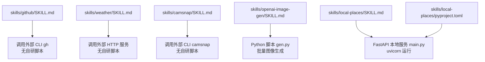
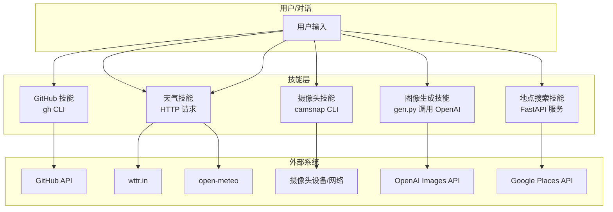
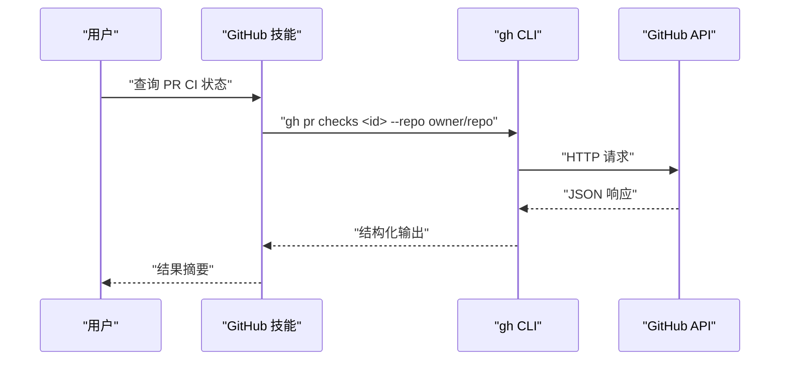
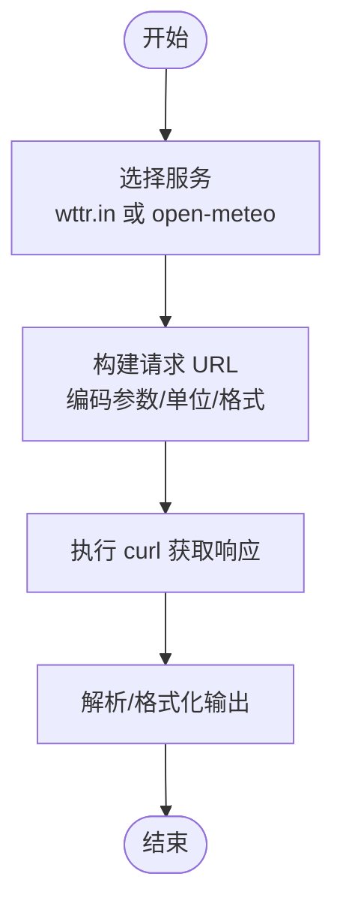
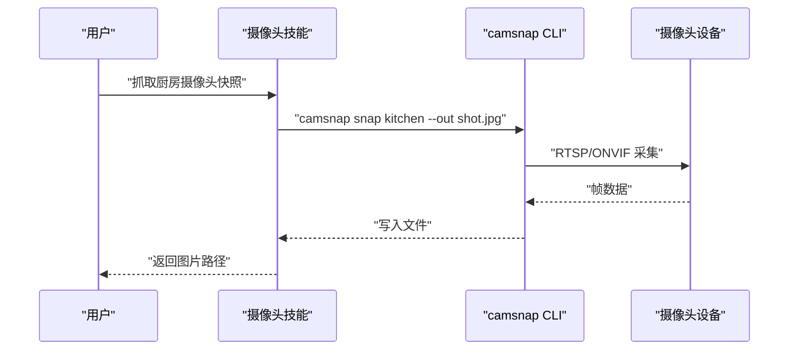
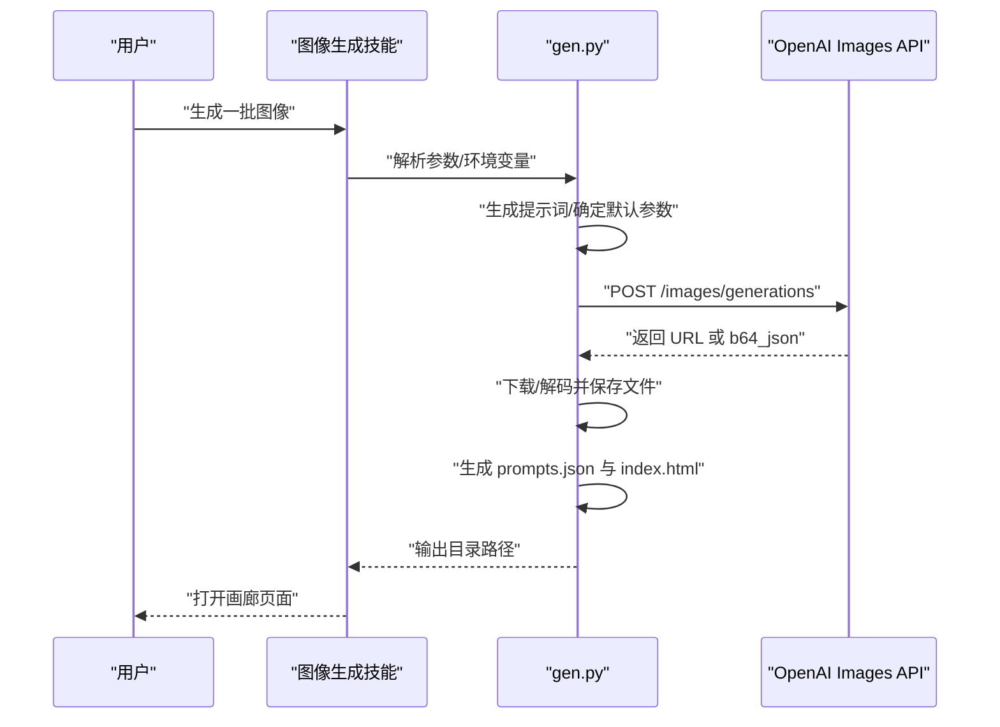
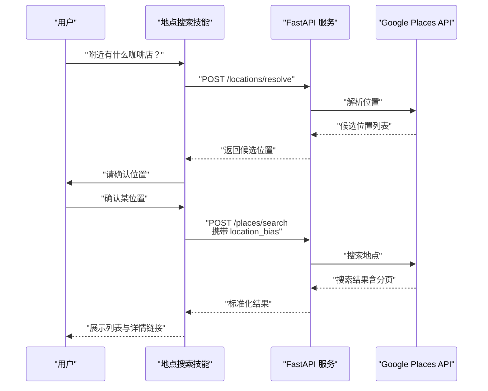
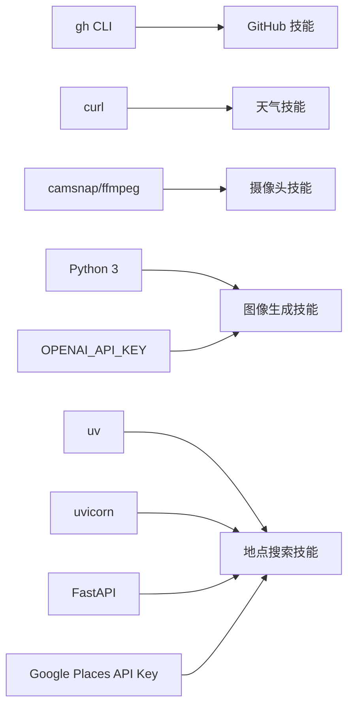

# 技能开发实例展示

<cite>
**本文引用的文件**
- [skills/github/SKILL.md](file://skills/github/SKILL.md)
- [skills/weather/SKILL.md](file://skills/weather/SKILL.md)
- [skills/camsnap/SKILL.md](file://skills/camsnap/SKILL.md)
- [skills/openai-image-gen/SKILL.md](file://skills/openai-image-gen/SKILL.md)
- [skills/openai-image-gen/scripts/gen.py](file://skills/openai-image-gen/scripts/gen.py)
- [skills/local-places/SKILL.md](file://skills/local-places/SKILL.md)
- [skills/local-places/src/local_places/main.py](file://skills/local-places/src/local_places/main.py)
- [skills/local-places/pyproject.toml](file://skills/local-places/pyproject.toml)
</cite>

## 目录

1. [引言](#引言)
2. [项目结构](#项目结构)
3. [核心组件](#核心组件)
4. [架构总览](#架构总览)
5. [详细组件分析](#详细组件分析)
6. [依赖关系分析](#依赖关系分析)
7. [性能考量](#性能考量)
8. [故障排查指南](#故障排查指南)
9. [结论](#结论)
10. [附录](#附录)

## 引言

本文件面向希望在 OpenClaw 平台上进行“技能（Skill）”开发的工程师与产品人员，系统性地展示五类典型技能实例：GitHub 集成技能、天气查询技能、摄像头截图技能、图像生成技能与本地地点搜索技能。我们将从实现思路、关键技术点、代码结构与运行流程等维度进行拆解，并总结不同技能类型的开发模式与适用场景，最后给出从简单到复杂的技能开发进阶路线图。

## 项目结构

OpenClaw 的技能以“技能目录 + 文档 + 可选脚本”的方式组织，每个技能通常包含：

- 技能说明文档（SKILL.md），描述功能、安装要求、使用示例与元数据
- 可执行脚本或服务（如 Python 脚本、本地服务等）
- 环境变量与依赖声明（如 API Key、二进制依赖）

下图展示了本次涉及的五个技能在仓库中的位置与关系：

图表来源

- [skills/github/SKILL.md](file://skills/github/SKILL.md#L1-L78)
- [skills/weather/SKILL.md](file://skills/weather/SKILL.md#L1-L55)
- [skills/camsnap/SKILL.md](file://skills/camsnap/SKILL.md#L1-L46)
- [skills/openai-image-gen/SKILL.md](file://skills/openai-image-gen/SKILL.md#L1-L90)
- [skills/openai-image-gen/scripts/gen.py](file://skills/openai-image-gen/scripts/gen.py#L1-L241)
- [skills/local-places/SKILL.md](file://skills/local-places/SKILL.md#L1-L103)
- [skills/local-places/src/local_places/main.py](file://skills/local-places/src/local_places/main.py#L1-L66)
- [skills/local-places/pyproject.toml](file://skills/local-places/pyproject.toml#L1-L22)

章节来源

- [skills/github/SKILL.md](file://skills/github/SKILL.md#L1-L78)
- [skills/weather/SKILL.md](file://skills/weather/SKILL.md#L1-L55)
- [skills/camsnap/SKILL.md](file://skills/camsnap/SKILL.md#L1-L46)
- [skills/openai-image-gen/SKILL.md](file://skills/openai-image-gen/SKILL.md#L1-L90)
- [skills/openai-image-gen/scripts/gen.py](file://skills/openai-image-gen/scripts/gen.py#L1-L241)
- [skills/local-places/SKILL.md](file://skills/local-places/SKILL.md#L1-L103)
- [skills/local-places/src/local_places/main.py](file://skills/local-places/src/local_places/main.py#L1-L66)
- [skills/local-places/pyproject.toml](file://skills/local-places/pyproject.toml#L1-L22)

## 核心组件

- GitHub 集成技能：通过外部 CLI gh 与 GitHub API 交互，强调命令行工具的可用性与 JSON 输出能力。
- 天气查询技能：通过两个免费 HTTP 服务（wttr.in 与 open-meteo）提供当前天气与预报，强调无需密钥的快速体验。
- 摄像头截图技能：通过外部 CLI camsnap 抓取 RTSP/ONVIF 摄像头帧或片段，强调本地设备与外部工具链。
- 图像生成技能：通过 Python 脚本批量调用 OpenAI Images API，支持多模型参数与输出格式，强调可配置与产物可视化。
- 本地地点搜索技能：通过本地 FastAPI 服务代理 Google Places API，强调两步式流程（定位 + 搜索）与过滤约束。

章节来源

- [skills/github/SKILL.md](file://skills/github/SKILL.md#L1-L78)
- [skills/weather/SKILL.md](file://skills/weather/SKILL.md#L1-L55)
- [skills/camsnap/SKILL.md](file://skills/camsnap/SKILL.md#L1-L46)
- [skills/openai-image-gen/SKILL.md](file://skills/openai-image-gen/SKILL.md#L1-L90)
- [skills/local-places/SKILL.md](file://skills/local-places/SKILL.md#L1-L103)

## 架构总览

下图展示了五个技能的典型运行路径与外部依赖关系：

图表来源

- [skills/github/SKILL.md](file://skills/github/SKILL.md#L31-L78)
- [skills/weather/SKILL.md](file://skills/weather/SKILL.md#L12-L55)
- [skills/camsnap/SKILL.md](file://skills/camsnap/SKILL.md#L25-L46)
- [skills/openai-image-gen/SKILL.md](file://skills/openai-image-gen/SKILL.md#L26-L90)
- [skills/local-places/SKILL.md](file://skills/local-places/SKILL.md#L16-L103)

## 详细组件分析

### GitHub 集成技能

- 实现思路
  - 通过外部 CLI gh 与 GitHub API 交互，支持问题、拉取请求、CI 运行与高级查询。
  - 强调在非 Git 目录中使用 --repo 或直接使用 URL 的最佳实践。
- 关键技术点
  - 命令行工具可用性检测（requires: bins: gh）
  - 结构化输出与过滤（--json 与 --jq）
  - 高级查询使用 gh api 子命令
- 代码结构与运行流程
  - 该技能以文档为主，无自研脚本；运行时由系统调用 gh CLI 完成。
- 适用场景
  - 团队协作、自动化检查 CI 状态、批量查询 PR/Issue。

图表来源

- [skills/github/SKILL.md](file://skills/github/SKILL.md#L31-L78)

章节来源

- [skills/github/SKILL.md](file://skills/github/SKILL.md#L1-L78)

### 天气查询技能

- 实现思路
  - 提供两个免费服务：wttr.in（人类友好）、open-meteo（程序友好）。
  - 支持多种格式与参数（单位、时间粒度、PNG 输出等）。
- 关键技术点
  - 无需 API Key 的快速体验
  - curl 命令组合与 URL 编码
- 代码结构与运行流程
  - 该技能以文档为主，无自研脚本；运行时由系统发起 HTTP 请求。
- 适用场景
  - 快速获取天气概览、嵌入到聊天机器人或自动化脚本。

图表来源

- [skills/weather/SKILL.md](file://skills/weather/SKILL.md#L12-L55)

章节来源

- [skills/weather/SKILL.md](file://skills/weather/SKILL.md#L1-L55)

### 摄像头截图技能

- 实现思路
  - 通过外部 CLI camsnap 抓取摄像头帧或片段，支持发现、快照、片段、运动监测与诊断。
- 关键技术点
  - 依赖 ffmpeg 在 PATH 中
  - 先短时测试再长时间录制
- 代码结构与运行流程
  - 该技能以文档为主，无自研脚本；运行时由系统调用 camsnap CLI 完成。
- 适用场景
  - 家庭安防、远程监控、设备调试。

图表来源

- [skills/camsnap/SKILL.md](file://skills/camsnap/SKILL.md#L25-L46)

章节来源

- [skills/camsnap/SKILL.md](file://skills/camsnap/SKILL.md#L1-L46)

### 图像生成技能

- 实现思路
  - 使用 Python 脚本批量调用 OpenAI Images API，支持多模型参数与输出格式，自动生成画廊页面。
- 关键技术点
  - 模型特定默认值与参数校验（如 dall-e-3 仅支持单图）
  - 输出目录与文件命名规则（含提示词的 slug 化）
  - 产物可视化（生成 index.html 缩略画廊）
- 代码结构与运行流程
  - 主入口为 scripts/gen.py，包含参数解析、随机提示词生成、API 请求、文件写入与画廊生成。
- 适用场景
  - 批量创意图像生成、演示素材准备、AIGC 工作流集成。

图表来源

- [skills/openai-image-gen/SKILL.md](file://skills/openai-image-gen/SKILL.md#L26-L90)
- [skills/openai-image-gen/scripts/gen.py](file://skills/openai-image-gen/scripts/gen.py#L163-L241)

章节来源

- [skills/openai-image-gen/SKILL.md](file://skills/openai-image-gen/SKILL.md#L1-L90)
- [skills/openai-image-gen/scripts/gen.py](file://skills/openai-image-gen/scripts/gen.py#L1-L241)

### 本地地点搜索技能

- 实现思路
  - 通过本地 FastAPI 服务代理 Google Places API，采用两步流程：先解析位置，再按偏好搜索。
- 关键技术点
  - 本地服务启动与健康检查（/ping）
  - 位置解析与地点搜索接口
  - 过滤条件与分页令牌
- 代码结构与运行流程
  - FastAPI 应用位于 src/local_places/main.py，使用 pyproject.toml 管理依赖与构建。
- 适用场景
  - 本地化地点检索、推荐系统、智能助手的周边服务查询。

图表来源

- [skills/local-places/SKILL.md](file://skills/local-places/SKILL.md#L33-L103)
- [skills/local-places/src/local_places/main.py](file://skills/local-places/src/local_places/main.py#L25-L60)
- [skills/local-places/pyproject.toml](file://skills/local-places/pyproject.toml#L1-L22)

章节来源

- [skills/local-places/SKILL.md](file://skills/local-places/SKILL.md#L1-L103)
- [skills/local-places/src/local_places/main.py](file://skills/local-places/src/local_places/main.py#L1-L66)
- [skills/local-places/pyproject.toml](file://skills/local-places/pyproject.toml#L1-L22)

## 依赖关系分析

- 外部依赖
  - GitHub 技能：gh CLI（二进制依赖）
  - 天气技能：curl（二进制依赖）
  - 摄像头技能：camsnap CLI、ffmpeg
  - 图像生成技能：Python 3、OPENAI_API_KEY 环境变量
  - 地点搜索技能：uv、uvicorn、FastAPI、Google Places API Key
- 内部依赖
  - 图像生成技能：gen.py 作为单一入口，内部模块化函数（参数解析、请求、写入、画廊）
  - 地点搜索技能：FastAPI 应用与路由、请求/响应模型、异常处理

图表来源

- [skills/github/SKILL.md](file://skills/github/SKILL.md#L4-L28)
- [skills/weather/SKILL.md](file://skills/weather/SKILL.md#L5-L5)
- [skills/camsnap/SKILL.md](file://skills/camsnap/SKILL.md#L5-L22)
- [skills/openai-image-gen/SKILL.md](file://skills/openai-image-gen/SKILL.md#L5-L23)
- [skills/local-places/SKILL.md](file://skills/local-places/SKILL.md#L5-L13)
- [skills/local-places/pyproject.toml](file://skills/local-places/pyproject.toml#L1-L22)

章节来源

- [skills/github/SKILL.md](file://skills/github/SKILL.md#L1-L78)
- [skills/weather/SKILL.md](file://skills/weather/SKILL.md#L1-L55)
- [skills/camsnap/SKILL.md](file://skills/camsnap/SKILL.md#L1-L46)
- [skills/openai-image-gen/SKILL.md](file://skills/openai-image-gen/SKILL.md#L1-L90)
- [skills/local-places/SKILL.md](file://skills/local-places/SKILL.md#L1-L103)
- [skills/local-places/pyproject.toml](file://skills/local-places/pyproject.toml#L1-L22)

## 性能考量

- 天气查询技能
  - 优先使用 wttr.in 的轻量请求；需要结构化数据时切换 open-meteo。
- 摄像头技能
  - 先短时抓取验证设备连通性，避免长时间录制导致资源占用。
- 图像生成技能
  - 控制并发与批量大小，合理设置输出尺寸与质量，减少 API 调用成本。
- 地点搜索技能
  - 合理使用 location_bias 与 filters，避免超大范围扫描；利用分页令牌增量获取。
- 通用建议
  - 对外部 API 添加超时与重试策略
  - 将敏感信息（API Key）置于受控环境变量中
  - 对输出结果进行缓存与去重

## 故障排查指南

- 外部依赖缺失
  - 检查 gh、curl、camsnap、ffmpeg、uv、uvicorn 是否在 PATH 中
- 环境变量未配置
  - OPENAI_API_KEY、GOOGLE_PLACES_API_KEY 未设置或为空
- 网络与权限
  - 确认网络可达性与代理设置；摄像头设备权限与网络访问
- 错误日志
  - 图像生成技能：关注 HTTP 错误码与 API 返回体
  - 地点搜索技能：关注 FastAPI 的 422 校验错误与日志

章节来源

- [skills/openai-image-gen/SKILL.md](file://skills/openai-image-gen/SKILL.md#L10-L23)
- [skills/local-places/SKILL.md](file://skills/local-places/SKILL.md#L10-L13)
- [skills/local-places/src/local_places/main.py](file://skills/local-places/src/local_places/main.py#L30-L44)

## 结论

上述五个技能覆盖了“外部 CLI 集成、外部 HTTP 服务、本地设备采集、云端模型调用、本地代理服务”五种常见模式。开发者可据此选择合适的技术栈与实现路径：若目标是快速接入现有工具链，优先考虑 CLI/HTTP 技能；若需要更强的定制化与数据处理，可采用本地服务或脚本方案。结合本文的进阶路线图，可逐步提升复杂度与稳定性。

## 附录

- 开发模式与适用场景对照
  - 外部 CLI 集成：适合已有成熟命令行工具的场景（如 GitHub、摄像头）
  - 外部 HTTP 服务：适合公开 API 或无需密钥的服务（如天气）
  - 本地服务代理：适合私有 API 或需要本地处理的场景（如地点搜索）
  - 云端模型调用：适合需要高质量生成或理解能力的任务（如图像生成）
- 技能开发进阶路线图（从简单到复杂）
  1. 文本/命令转发型：基于外部 CLI/HTTP 的最小可行技能
  2. 参数化与格式化：增加参数解析、输出格式化与错误处理
  3. 本地服务化：封装为本地 HTTP 服务，支持健康检查与异常处理
  4. 数据持久化与缓存：引入缓存与本地存储，优化性能与用户体验
  5. 安全与可观测性：统一鉴权、日志与指标，完善监控与告警
