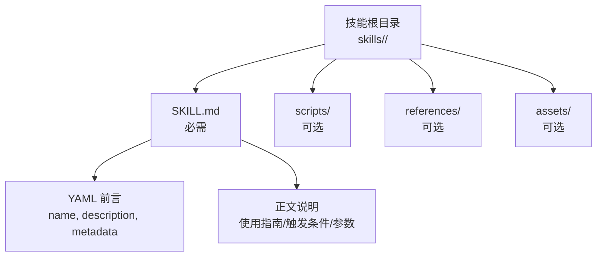
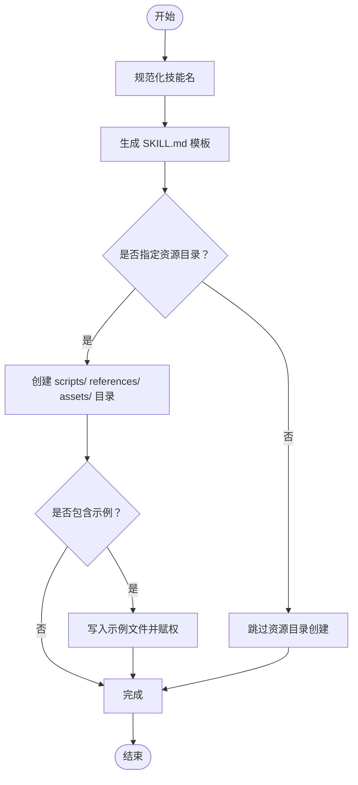
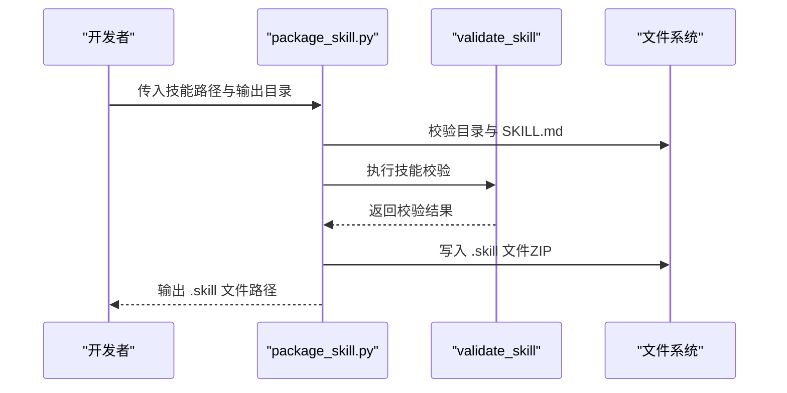
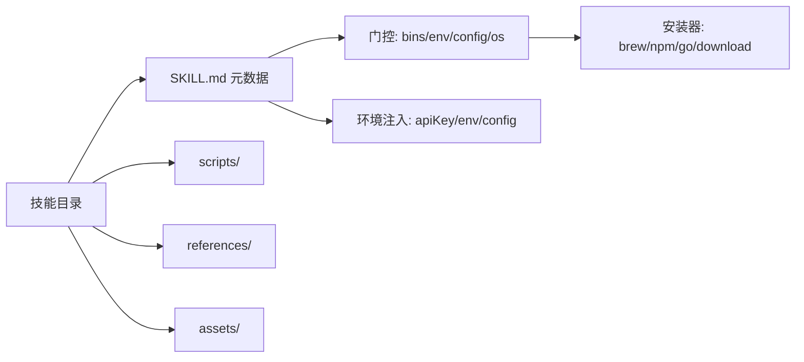

# 技能开发教程

<cite>
**本文引用的文件**
- [README.md](file://README.md)
- [creating-skills.md](file://docs/tools/creating-skills.md)
- [skills.md](file://docs/tools/skills.md)
- [test.md](file://docs/reference/test.md)
- [init_skill.py](file://skills/skill-creator/scripts/init_skill.py)
- [package_skill.py](file://skills/skill-creator/scripts/package_skill.py)
- [SKILL.md](file://skills/skill-creator/SKILL.md)
- [summarize/SKILL.md](file://skills/summarize/SKILL.md)
- [weather/SKILL.md](file://skills/weather/SKILL.md)
- [1password/SKILL.md](file://skills/1password/SKILL.md)
</cite>

## 目录

1. [简介](#简介)
2. [项目结构](#项目结构)
3. [核心组件](#核心组件)
4. [架构总览](#架构总览)
5. [详细组件分析](#详细组件分析)
6. [依赖关系分析](#依赖关系分析)
7. [性能考量](#性能考量)
8. [故障排查指南](#故障排查指南)
9. [结论](#结论)
10. [附录](#附录)

## 简介

本教程面向希望在 OpenClaw 上开发“技能（Skill）”的开发者，系统讲解从项目初始化、模板使用、脚手架工具、到打包分发与版本管理的全流程。内容覆盖：

- 技能目录结构与 SKILL.md 元数据规范
- 工具类、查询类、自动化类等典型技能的开发范式
- 测试、调试与性能优化方法
- 打包、分发与版本管理操作指南

## 项目结构

OpenClaw 的技能体系基于“AgentSkills 兼容”的目录结构，每个技能是一个独立目录，包含：

- 必需文件：SKILL.md（含 YAML 前言元数据与正文说明）
- 可选资源：scripts/（可执行脚本）、references/（参考文档）、assets/（输出资产）

图示来源

- [skills.md](file://docs/tools/skills.md#L77-L104)

章节来源

- [skills.md](file://docs/tools/skills.md#L13-L40)
- [creating-skills.md](file://docs/tools/creating-skills.md#L9-L11)

## 核心组件

- 技能定义文件 SKILL.md
  - 前言元数据：name、description、metadata（可选）
  - 正文：使用说明、触发条件、参数与示例
- 资源目录
  - scripts/：可执行脚本（Python/Bash 等），用于确定性任务与重复性工作
  - references/：参考文档，按需加载入上下文
  - assets/：模板、图标、字体等，用于最终输出而非上下文加载
- 脚手架与打包工具
  - init_skill.py：生成标准化技能模板
  - package_skill.py：校验并通过 ZIP 形式打包为 .skill 文件

章节来源

- [skills.md](file://docs/tools/skills.md#L77-L104)
- [init_skill.py](file://skills/skill-creator/scripts/init_skill.py#L23-L108)
- [package_skill.py](file://skills/skill-creator/scripts/package_skill.py#L20-L84)

## 架构总览

技能在运行期由 OpenClaw 加载并参与系统提示构建，具备以下关键特性：

- 多级加载优先级：工作区技能 > 本地/托管技能 > 内置技能
- 条件加载（门控）：基于二进制、环境变量、配置项与平台
- 环境注入：按会话注入密钥与配置，结束后恢复
- 热重载：监听 SKILL.md 变化以刷新可用技能列表

图示来源

- [skills.md](file://docs/tools/skills.md#L13-L40)
- [skills.md](file://docs/tools/skills.md#L105-L187)
- [skills.md](file://docs/tools/skills.md#L228-L244)

章节来源

- [skills.md](file://docs/tools/skills.md#L13-L40)
- [skills.md](file://docs/tools/skills.md#L105-L187)
- [skills.md](file://docs/tools/skills.md#L228-L244)

## 详细组件分析

### 组件一：技能模板与脚手架（init_skill.py）

- 功能
  - 将用户输入的技能名规范化为短横线命名
  - 生成包含 TODO 指南的 SKILL.md 模板
  - 可选创建 scripts/、references/、assets/ 目录及示例文件
- 最佳实践
  - 使用“任务型/工作流型/参考型/能力型”结构建议，结合具体技能选择
  - 仅创建实际需要的资源目录，避免冗余
  - 示例文件用于快速验证，后续替换为真实实现

图示来源

- [init_skill.py](file://skills/skill-creator/scripts/init_skill.py#L255-L317)

章节来源

- [init_skill.py](file://skills/skill-creator/scripts/init_skill.py#L1-L379)
- [SKILL.md](file://skills/skill-creator/SKILL.md#L294-L317)

### 组件二：技能打包与发布（package_skill.py）

- 功能
  - 校验技能目录结构与 SKILL.md 存在性
  - 通过 validate_skill 校验（由 quick_validate 提供）
  - 将技能目录压缩为 .skill 文件（ZIP）
- 发布建议
  - 包含必要的 scripts/references/assets
  - 保持 SKILL.md 清晰描述触发条件与使用场景
  - 在 README 或 ClawHub 页面提供使用说明与示例

图示来源

- [package_skill.py](file://skills/skill-creator/scripts/package_skill.py#L20-L84)

章节来源

- [package_skill.py](file://skills/skill-creator/scripts/package_skill.py#L1-L112)

### 组件三：技能元数据与门控（SKILL.md + metadata）

- 元数据字段
  - name、description（必填）
  - metadata.openclaw（可选）：requires（bins/env/config/os）、install、emoji、homepage、primaryEnv 等
- 门控规则
  - 二进制存在（PATH）、环境变量、配置项、平台过滤
  - 支持安装器（brew/npm/go/download），按平台筛选
- 环境注入
  - 仅在进程未设置时注入；会话结束后恢复

章节来源

- [skills.md](file://docs/tools/skills.md#L77-L104)
- [skills.md](file://docs/tools/skills.md#L105-L187)
- [skills.md](file://docs/tools/skills.md#L228-L244)

### 组件四：典型技能开发范式

#### 工具类技能（以 weather 为例）

- 特点：直接调用外部命令（如 curl）提供信息
- 关键点：明确触发词、参数与输出格式；必要时提供替代服务
- 示例参考：weather 技能展示了两个免费服务的使用方式与格式码

章节来源

- [weather/SKILL.md](file://skills/weather/SKILL.md#L1-L55)

#### 查询类技能（以 1password 为例）

- 特点：需要安全流程与桌面应用集成，强调 tmux 会话与安全守则
- 关键点：前置条件检查、安全命令执行、错误处理与回退
- 示例参考：1password 技能提供了完整的安装、登录与安全守则

章节来源

- [1password/SKILL.md](file://skills/1password/SKILL.md#L1-L71)

#### 自动化类技能（以 summarize 为例）

- 特点：封装复杂 CLI 工具，支持多模型与多种输入源
- 关键点：门控二进制、安装器、API 密钥注入、常用参数与配置文件
- 示例参考：summarize 技能展示了 YouTube/URL/本地文件的摘要与转录能力

章节来源

- [summarize/SKILL.md](file://skills/summarize/SKILL.md#L1-L88)

## 依赖关系分析

- 技能对宿主环境的依赖
  - 二进制依赖：PATH 中的可执行文件（如 curl、op、summarize）
  - 环境变量：API 密钥、服务端点等
  - 配置项：openclaw.json 中的布尔开关与自定义字段
- 脚手架与打包工具
  - init_skill.py 生成标准化模板
  - package_skill.py 依赖 quick_validate 的校验逻辑

图示来源

- [skills.md](file://docs/tools/skills.md#L105-L187)
- [init_skill.py](file://skills/skill-creator/scripts/init_skill.py#L227-L253)
- [package_skill.py](file://skills/skill-creator/scripts/package_skill.py#L48-L55)

章节来源

- [skills.md](file://docs/tools/skills.md#L105-L187)
- [init_skill.py](file://skills/skill-creator/scripts/init_skill.py#L227-L253)
- [package_skill.py](file://skills/skill-creator/scripts/package_skill.py#L48-L55)

## 性能考量

- 技能列表注入成本
  - 系统会在系统提示中注入可用技能的紧凑 XML 列表，字符开销与技能数量、名称/描述长度相关
  - 建议保持 SKILL.md 精炼，减少不必要的上下文膨胀
- 资源加载策略
  - scripts 可在不加载到上下文的前提下执行
  - references 按需加载，避免一次性塞满上下文窗口
- 会话快照
  - 技能列表在会话开始时快照，变更在新会话生效；可通过热重载机制在启用监视时更快感知

章节来源

- [skills.md](file://docs/tools/skills.md#L267-L284)
- [skills.md](file://docs/tools/skills.md#L240-L244)

## 故障排查指南

- 常见问题
  - 二进制缺失：检查 PATH 是否包含所需可执行文件；若无，使用 metadata.openclaw.install 安装器
  - 环境变量未注入：确认 process.env 未被覆盖；注意会话级注入，结束后恢复
  - 触发不当：确保 SKILL.md 的 description 能准确覆盖触发场景
- 测试与调试
  - 使用本地代理/模拟提供商进行确定性测试
  - 对于实时测试，使用环境变量开关，避免在 CI 缺少安全条件时失败
  - 使用“强制测试”模式清理占用端口后运行全量测试套件

章节来源

- [skills.md](file://docs/tools/skills.md#L69-L76)
- [test.md](file://docs/reference/test.md#L12-L15)
- [test.md](file://docs/reference/test.md#L355-L376)

## 结论

通过标准化的 SKILL.md 元数据、脚手架模板与打包流程，OpenClaw 为技能开发提供了清晰的路径。遵循门控与安全注入原则，结合资源目录的渐进披露设计，可在保证性能的同时提升技能的可维护性与复用性。建议在开发周期中持续进行单元与端到端测试，并利用热重载机制加速迭代。

## 附录

### A. 从零开始创建你的第一个技能

- 步骤
  - 创建技能目录与 SKILL.md（参考模板）
  - 如需，添加 scripts/references/assets
  - 使用脚手架工具生成模板与示例
  - 运行测试与校验
  - 打包为 .skill 文件并分发

章节来源

- [creating-skills.md](file://docs/tools/creating-skills.md#L13-L44)
- [init_skill.py](file://skills/skill-creator/scripts/init_skill.py#L255-L317)
- [package_skill.py](file://skills/skill-creator/scripts/package_skill.py#L20-L84)

### B. 不同类型技能的开发要点

- 工具类：聚焦触发词与参数，提供简洁示例
- 查询类：强调前置条件与安全流程，给出错误处理
- 自动化类：封装复杂 CLI，提供安装器与配置项

章节来源

- [weather/SKILL.md](file://skills/weather/SKILL.md#L1-L55)
- [1password/SKILL.md](file://skills/1password/SKILL.md#L1-L71)
- [summarize/SKILL.md](file://skills/summarize/SKILL.md#L1-L88)

### C. 打包、分发与版本管理

- 打包
  - 使用 package_skill.py 校验并生成 .skill 文件
- 分发
  - 可上传至 ClawHub 或私有仓库，配合版本标签管理
- 版本管理
  - 建议以语义化版本命名 .skill 文件，配合变更日志与兼容性说明

章节来源

- [package_skill.py](file://skills/skill-creator/scripts/package_skill.py#L20-L84)
- [skills.md](file://docs/tools/skills.md#L50-L67)
