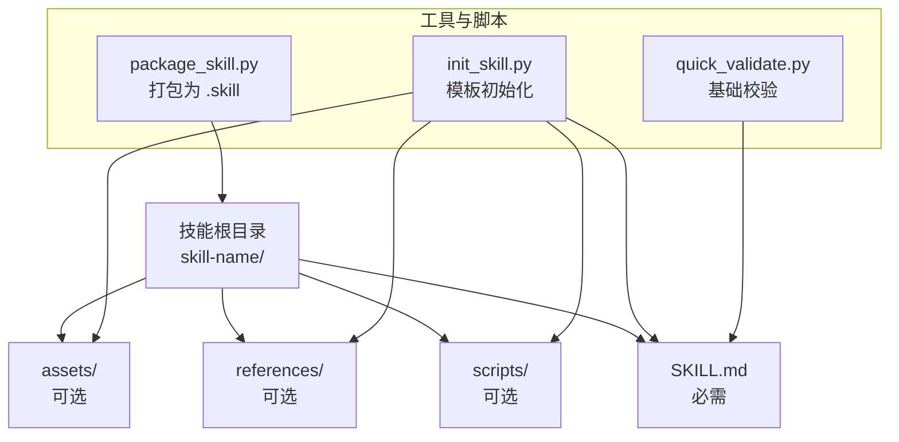
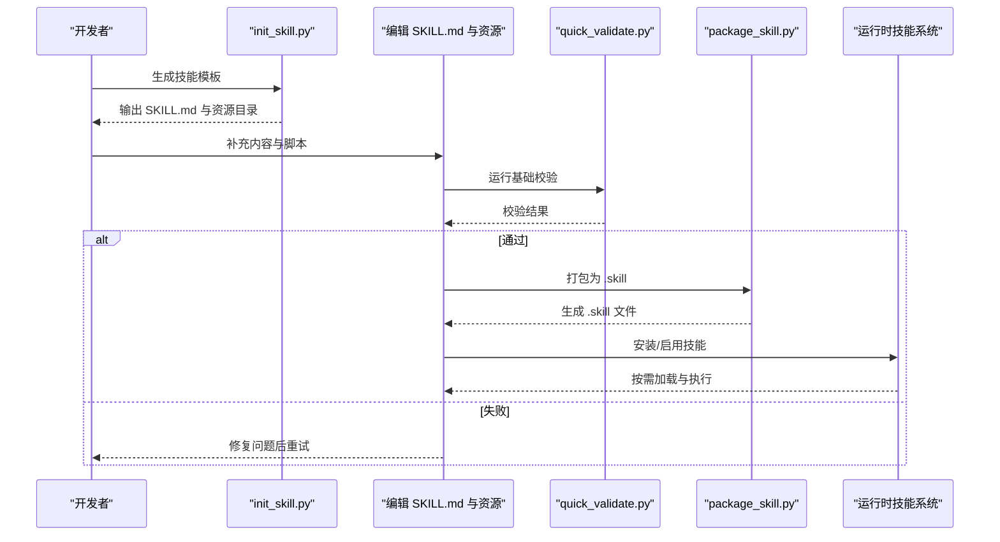
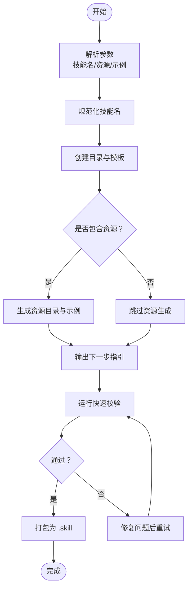
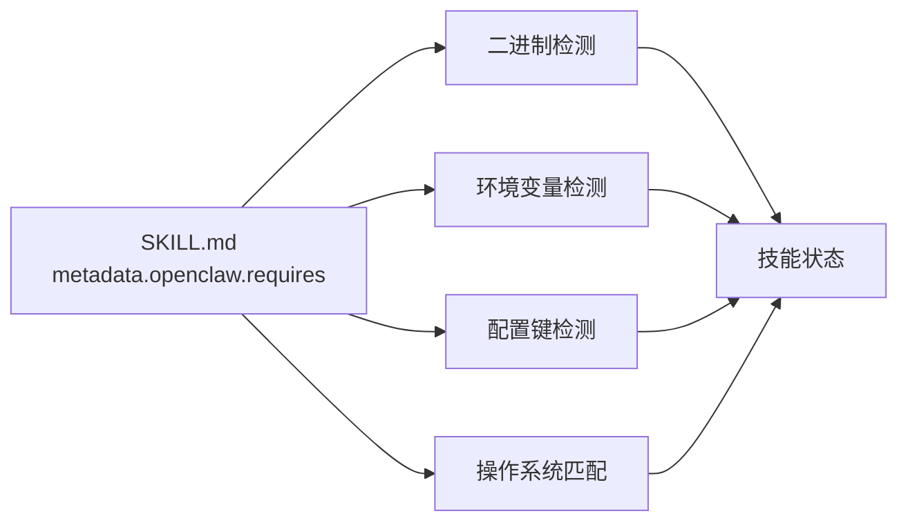

# 技能模板和标准规范

<cite>
**本文引用的文件**
- [技能创建器/SKILL.md](file://skills/skill-creator/SKILL.md)
- [技能创建器/初始化脚本](file://skills/skill-creator/scripts/init_skill.py)
- [技能创建器/打包脚本](file://skills/skill-creator/scripts/package_skill.py)
- [技能创建器/快速校验脚本](file://skills/skill-creator/scripts/quick_validate.py)
- [技能创建器/许可证](file://skills/skill-creator/license.txt)
- [创建技能指南](file://docs/tools/creating-skills.md)
- [技能配置参考](file://docs/tools/skills-config.md)
- [示例技能：summarize](file://skills/summarize/SKILL.md)
- [示例技能：tmux](file://skills/tmux/SKILL.md)
- [示例技能：nano-pdf](file://skills/nano-pdf/SKILL.md)
- [示例技能：voice-call](file://skills/voice-call/SKILL.md)
- [示例技能：lobster](file://extensions/lobster/SKILL.md)
- [技能安装与状态检查](file://src/agents/skills-install.ts)
- [技能状态检查（运行时）](file://src/agents/skills-status.ts)
- [技能摘要测试（前端）](file://src/agents/skills.summarize-skill-description.test.ts)
</cite>

## 目录

1. 引言
2. 项目结构
3. 核心组件
4. 架构总览
5. 详细组件分析
6. 依赖关系分析
7. 性能考量
8. 故障排查指南
9. 结论
10. 附录

## 引言

本文件为 OpenClaw 技能开发提供统一的模板与标准规范，覆盖目录结构、文件命名、配置语法、模板类型、注释与日志规范、错误处理模式、最佳实践、性能优化与安全注意事项。目标是帮助开发者以一致的方式构建高质量、可复用、可分发的技能模块。

## 项目结构

OpenClaw 的技能以“技能包”形式存在，每个技能是一个独立目录，包含必需的 SKILL.md 以及可选的资源目录（scripts、references、assets）。仓库中提供了完整的模板生成器与打包器，确保技能的一致性与可验证性。

**图表来源**

- [技能创建器/SKILL.md](file://skills/skill-creator/SKILL.md#L46-L61)
- [技能创建器/初始化脚本](file://skills/skill-creator/scripts/init_skill.py#L227-L253)
- [技能创建器/打包脚本](file://skills/skill-creator/scripts/package_skill.py#L20-L84)
- [技能创建器/快速校验脚本](file://skills/skill-creator/scripts/quick_validate.py#L15-L49)

**章节来源**

- [技能创建器/SKILL.md](file://skills/skill-creator/SKILL.md#L46-L61)
- [创建技能指南](file://docs/tools/creating-skills.md#L9-L11)

## 核心组件

- SKILL.md：技能的“元数据 + 使用说明”，由 YAML 前言与 Markdown 正文组成，决定触发条件与使用方式。
- 资源目录：
  - scripts/：可执行脚本（Python/Bash 等），用于确定性任务或重复性自动化。
  - references/：按需加载的参考文档，避免占用上下文窗口。
  - assets/：输出使用的资源文件（模板、图标、字体等）。
- 初始化与打包工具：自动生成模板、校验结构、打包为 .skill 文件，便于分发与安装。

**章节来源**

- [技能创建器/SKILL.md](file://skills/skill-creator/SKILL.md#L63-L100)
- [技能创建器/初始化脚本](file://skills/skill-creator/scripts/init_skill.py#L227-L317)
- [技能创建器/打包脚本](file://skills/skill-creator/scripts/package_skill.py#L20-L84)

## 架构总览

技能生命周期从“模板初始化”到“开发完善”再到“打包分发”，期间通过“快速校验”保证结构正确性；运行时通过“技能状态检查”与“安装流程”保障可用性。

**图表来源**

- [技能创建器/初始化脚本](file://skills/skill-creator/scripts/init_skill.py#L255-L317)
- [技能创建器/快速校验脚本](file://skills/skill-creator/scripts/quick_validate.py#L15-L91)
- [技能创建器/打包脚本](file://skills/skill-creator/scripts/package_skill.py#L20-L84)
- [技能安装与状态检查](file://src/agents/skills-install.ts#L43-L90)
- [技能状态检查（运行时）](file://src/agents/skills-status.ts#L199-L241)

## 详细组件分析

### SKILL.md 配置语法与字段规范

- 必填字段
  - name：技能名称（小写短横线命名，不超过长度限制）
  - description：触发描述，明确“何时使用此技能”的场景、任务类型、文件类型等
- 可选字段
  - homepage：技能主页链接
  - metadata.openclaw：扩展元数据
    - emoji：展示表情符号
    - skillKey：覆盖默认键名（当需要与配置项映射时）
    - os：支持的操作系统列表
    - requires：运行时依赖声明
      - bins：必需二进制
      - anyBins：任一可用二进制
      - env：必需环境变量
      - config：必需配置键路径
    - install：安装声明（数组）
      - id/kind/formula/package/bins/label 等
- 写作规范
  - 前言仅保留 name 与 description（其余字段在 metadata 中）
  - 正文采用“概览 + 触发场景 + 快速开始 + 用法细节 + 配置/依赖说明”的结构
  - 使用祈使句/动词原形，保持简洁与可操作性

**章节来源**

- [示例技能：summarize](file://skills/summarize/SKILL.md#L1-L23)
- [示例技能：nano-pdf](file://skills/nano-pdf/SKILL.md#L1-L23)
- [示例技能：voice-call](file://skills/voice-call/SKILL.md#L1-L13)
- [技能创建器/快速校验脚本](file://skills/skill-creator/scripts/quick_validate.py#L40-L49)

### 目录结构与文件命名规范

- 目录名：使用小写短横线命名，长度不超过限制，与技能名称一致
- 必需文件：SKILL.md
- 可选目录：scripts/、references/、assets/
- 资源组织原则
  - scripts：可直接执行的脚本，避免冗长逻辑，优先确定性任务
  - references：按主题拆分的参考文档，避免与 SKILL.md 重复
  - assets：最终产物使用的资源，不加载入上下文

**章节来源**

- [技能创建器/SKILL.md](file://skills/skill-creator/SKILL.md#L46-L100)
- [技能创建器/初始化脚本](file://skills/skill-creator/scripts/init_skill.py#L194-L206)

### 初始化与打包流程

- 初始化
  - 支持选择资源类型（scripts、references、assets）与是否生成示例
  - 自动生成 SKILL.md 模板与资源目录
- 打包
  - 自动校验：存在 SKILL.md、前言格式与字段合法
  - 打包为 .skill（zip），保持目录结构
- 校验
  - 基础校验：前言存在、字段合法、描述长度与字符限制

**图表来源**

- [技能创建器/初始化脚本](file://skills/skill-creator/scripts/init_skill.py#L320-L379)
- [技能创建器/快速校验脚本](file://skills/skill-creator/scripts/quick_validate.py#L15-L91)
- [技能创建器/打包脚本](file://skills/skill-creator/scripts/package_skill.py#L20-L84)

**章节来源**

- [技能创建器/初始化脚本](file://skills/skill-creator/scripts/init_skill.py#L255-L317)
- [技能创建器/打包脚本](file://skills/skill-creator/scripts/package_skill.py#L20-L84)
- [技能创建器/快速校验脚本](file://skills/skill-creator/scripts/quick_validate.py#L15-L91)

### 不同类型技能的标准模板

- Python 脚本技能
  - 适用：需要确定性执行、可复用的数据处理或自动化
  - 结构：scripts/ 下放置 .py；在 SKILL.md 中提供调用示例与参数说明
  - 示例参考：其他技能中的 scripts/ 目录组织方式
- Shell 脚本技能
  - 适用：系统命令组合、文件处理、CLI 工具链
  - 结构：scripts/ 下放置 .sh；注意权限与跨平台兼容
- Node.js 工具技能
  - 适用：Node 生态工具、HTTP 请求、复杂数据转换
  - 结构：scripts/ 下放置 .js；在 metadata.install 中声明安装方式
- 插件集成技能
  - 适用：与外部插件联动（如 voice-call）
  - 结构：metadata.openclaw.requires.config 指定配置键；在 SKILL.md 说明工具动作与参数

**章节来源**

- [示例技能：tmux](file://skills/tmux/SKILL.md#L1-L136)
- [示例技能：voice-call](file://skills/voice-call/SKILL.md#L1-L46)
- [示例技能：lobster](file://extensions/lobster/SKILL.md#L1-L98)

### 代码注释规范、错误处理与日志标准

- 注释规范
  - SKILL.md：使用祈使句，聚焦“做什么”而非“如何做”
  - 脚本：函数/模块注释说明用途、输入输出、异常情况
- 错误处理
  - 安装失败：汇总 stdout/stderr 关键行，截断至合理长度
  - 依赖缺失：在运行时检测并提示具体缺失项（二进制、环境变量、配置）
- 日志标准
  - 保持简洁、可读性强；避免泄露敏感信息
  - 在 SKILL.md 中提供“故障排查”或“常见问题”段落

**章节来源**

- [技能安装与状态检查](file://src/agents/skills-install.ts#L43-L90)
- [技能状态检查（运行时）](file://src/agents/skills-status.ts#L199-L241)
- [技能创建器/SKILL.md](file://skills/skill-creator/SKILL.md#L294-L333)

### 最佳实践

- 触发描述要具体：在 description 中明确“何时使用此技能”的场景
- 资源分离：将详细参考放入 references，正文保持精炼
- 脚本可执行：scripts/ 中的脚本应可直接运行，并进行最小化测试
- 安装声明：在 metadata.openclaw.install 中提供清晰的安装步骤与回退策略
- 包装分发：使用 package_skill.py 生成 .skill 文件，便于共享与版本管理

**章节来源**

- [技能创建器/SKILL.md](file://skills/skill-creator/SKILL.md#L315-L371)
- [技能创建器/打包脚本](file://skills/skill-creator/scripts/package_skill.py#L20-L84)

### 性能优化建议

- 上下文窗口控制：利用 references 的按需加载机制，减少 SKILL.md 正文字数
- 脚本优先：对重复性高、确定性强的任务使用 scripts/，避免在上下文中反复解释
- 缓存与去重：对大型参考文档提供索引与搜索提示，降低检索成本

**章节来源**

- [技能创建器/SKILL.md](file://skills/skill-creator/SKILL.md#L113-L200)

### 安全考虑

- Bash/脚本安全：避免用户输入拼接到命令行，防止注入；必要时进行白名单校验
- 环境变量：不要在 description 或正文暴露敏感值；通过 metadata.env 或配置项注入
- 权限与沙箱：在沙箱环境中运行时，确保仅注入必要的环境变量或使用自定义镜像

**章节来源**

- [创建技能指南](file://docs/tools/creating-skills.md#L48-L50)
- [技能配置参考](file://docs/tools/skills-config.md#L66-L77)

## 依赖关系分析

技能运行时依赖由 metadata.openclaw.requires 声明，系统在加载时进行匹配与提示。

**图表来源**

- [技能状态检查（运行时）](file://src/agents/skills-status.ts#L199-L241)
- [示例技能：summarize](file://skills/summarize/SKILL.md#L5-L22)
- [示例技能：tmux](file://skills/tmux/SKILL.md#L4-L5)

**章节来源**

- [技能状态检查（运行时）](file://src/agents/skills-status.ts#L199-L241)

## 性能考量

- 尽量将长篇参考文档放入 references，正文保持在 500 行以内
- 对于大型参考文件，提供目录与搜索提示，提升检索效率
- 脚本可直接执行，无需加载到上下文，减少 token 消耗

**章节来源**

- [技能创建器/SKILL.md](file://skills/skill-creator/SKILL.md#L113-L126)

## 故障排查指南

- 安装失败
  - 查看安装输出的关键行，系统会自动摘要错误信息
  - 检查依赖是否满足（二进制、环境变量、配置）
- 依赖缺失
  - 运行时会列出缺失项，按提示补齐
- 描述不触发
  - 检查 description 是否包含明确触发场景与关键词

**章节来源**

- [技能安装与状态检查](file://src/agents/skills-install.ts#L43-L90)
- [技能状态检查（运行时）](file://src/agents/skills-status.ts#L199-L241)
- [技能摘要测试（前端）](file://src/agents/skills.summarize-skill-description.test.ts#L1-L17)

## 结论

通过统一的模板与规范，OpenClaw 技能能够实现“高内聚、低耦合、可复用、易维护”。遵循本文档的结构、语法与最佳实践，可以显著提升技能质量与交付效率，并在运行时获得更好的稳定性与性能表现。

## 附录

### SKILL.md 字段清单与示例

- name：技能名称（必填）
- description：触发描述（必填）
- homepage：主页链接（可选）
- metadata.openclaw
  - emoji：展示表情（可选）
  - skillKey：覆盖键名（可选）
  - os：支持系统（可选）
  - requires
    - bins：必需二进制（可选）
    - anyBins：任一可用二进制（可选）
    - env：必需环境变量（可选）
    - config：必需配置键（可选）
  - install：安装声明（可选）

**章节来源**

- [示例技能：summarize](file://skills/summarize/SKILL.md#L1-L23)
- [示例技能：nano-pdf](file://skills/nano-pdf/SKILL.md#L1-L23)
- [示例技能：voice-call](file://skills/voice-call/SKILL.md#L1-L13)

### 许可证与合规

- 技能包可使用 Apache 2.0 许可证，发布时请保留版权与许可声明
- 分发 .skill 文件时，确保遵守第三方依赖的许可证要求

**章节来源**

- [技能创建器/许可证](file://skills/skill-creator/license.txt#L1-L203)
