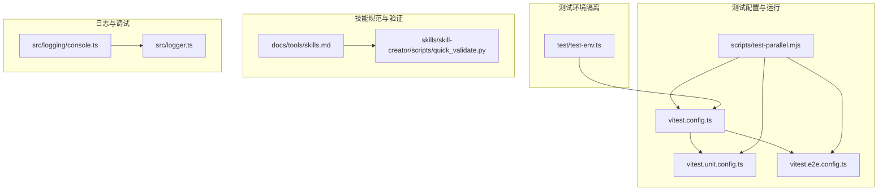
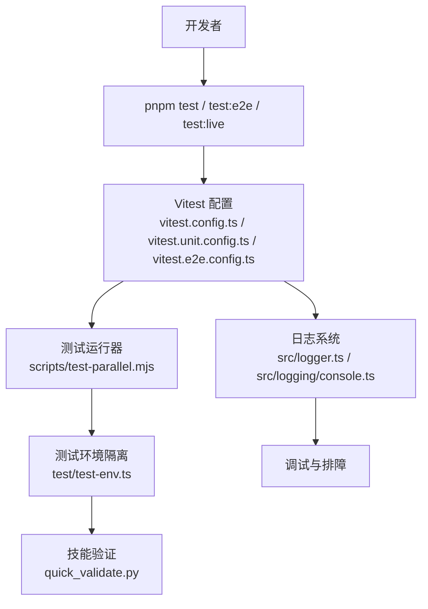
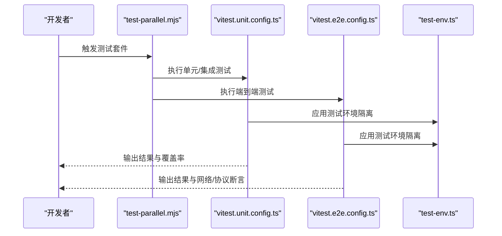
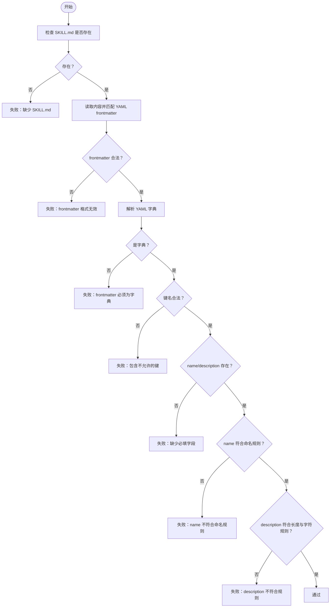
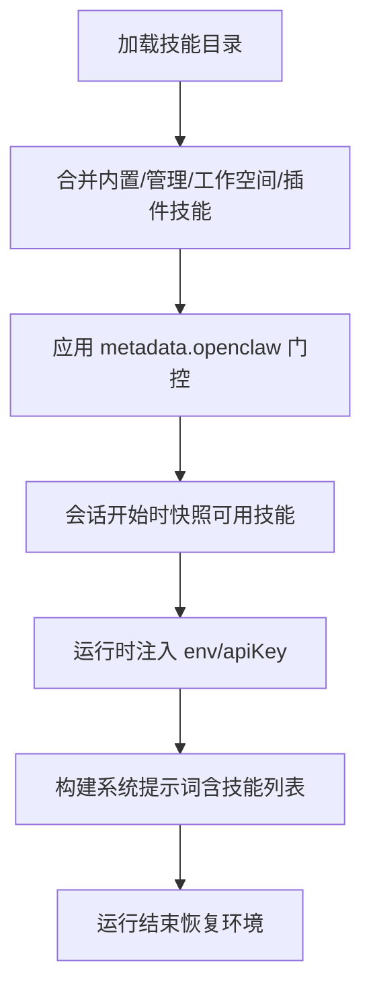
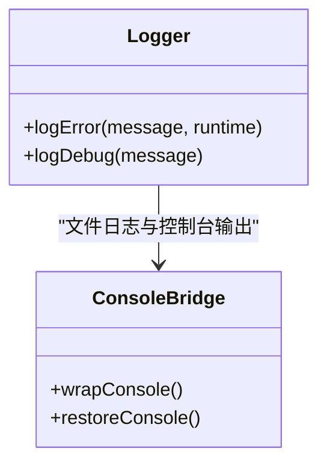
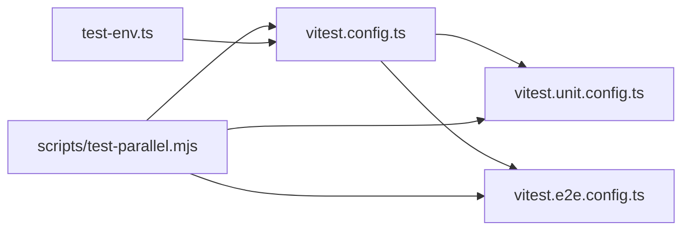

# 技能测试和调试

<cite>
**本文引用的文件**
- [quick_validate.py](file://skills/skill-creator/scripts/quick_validate.py)
- [vitest.config.ts](file://vitest.config.ts)
- [vitest.unit.config.ts](file://vitest.unit.config.ts)
- [vitest.e2e.config.ts](file://vitest.e2e.config.ts)
- [test-env.ts](file://test/test-env.ts)
- [testing.md](file://docs/help/testing.md)
- [skills.md](file://docs/tools/skills.md)
- [console.ts](file://src/logging/console.ts)
- [logger.ts](file://src/logger.ts)
- [test-parallel.mjs](file://scripts/test-parallel.mjs)
</cite>

## 目录

1. [引言](#引言)
2. [项目结构](#项目结构)
3. [核心组件](#核心组件)
4. [架构总览](#架构总览)
5. [详细组件分析](#详细组件分析)
6. [依赖分析](#依赖分析)
7. [性能考量](#性能考量)
8. [故障排查指南](#故障排查指南)
9. [结论](#结论)
10. [附录](#附录)

## 引言

本指南面向OpenClaw技能开发者，系统化讲解技能测试与调试方法论与实践，覆盖单元测试、集成测试与端到端（E2E）测试的实施策略；详解quick_validate.py验证脚本的使用与规则；提供技能调试的实用技巧（日志分析、错误排查、性能监控）；并总结常见问题的诊断与解决路径（权限、依赖冲突、环境变量配置等）。同时给出测试用例编写建议与自动化测试集成方案，帮助在CI与本地环境中稳定推进技能开发。

## 项目结构

OpenClaw仓库采用多语言混合工程组织方式：TypeScript源码位于src目录，测试配置集中在根目录的vitest.\*.config.ts中，测试运行器通过scripts/test-parallel.mjs进行并行调度；技能规范与测试指南位于docs目录；技能验证脚本位于skills/skill-creator/scripts。

**图示来源**

- [vitest.config.ts](file://vitest.config.ts#L1-L105)
- [vitest.unit.config.ts](file://vitest.unit.config.ts#L1-L20)
- [vitest.e2e.config.ts](file://vitest.e2e.config.ts#L1-L21)
- [test-env.ts](file://test/test-env.ts#L1-L148)
- [skills.md](file://docs/tools/skills.md#L1-L301)
- [quick_validate.py](file://skills/skill-creator/scripts/quick_validate.py#L1-L102)
- [console.ts](file://src/logging/console.ts#L207-L228)
- [logger.ts](file://src/logger.ts#L47-L61)

**章节来源**

- [vitest.config.ts](file://vitest.config.ts#L1-L105)
- [vitest.unit.config.ts](file://vitest.unit.config.ts#L1-L20)
- [vitest.e2e.config.ts](file://vitest.e2e.config.ts#L1-L21)
- [test-env.ts](file://test/test-env.ts#L1-L148)
- [skills.md](file://docs/tools/skills.md#L1-L301)
- [quick_validate.py](file://skills/skill-creator/scripts/quick_validate.py#L1-L102)
- [console.ts](file://src/logging/console.ts#L207-L228)
- [logger.ts](file://src/logger.ts#L47-L61)

## 核心组件

- 测试配置与套件
  - 单元/集成套件：默认vitest配置，包含覆盖率阈值与排除规则，支持forks池与超时设置。
  - E2E套件：独立配置，启用“.e2e.test.ts”文件，限制并发以适配网络与进程开销。
  - 并行运行器：scripts/test-parallel.mjs按套件分发任务，支持vmForks/forks池选择与信号处理。
- 测试环境隔离
  - test-env.ts负责在非live模式下隔离HOME/XDG目录，注入临时状态目录与端口，避免污染真实用户环境；live模式则加载用户profile以复用真实凭据。
- 技能规范与验证
  - skills.md定义技能目录结构、前置元数据、加载与门控规则、环境注入与会话快照等；quick_validate.py用于快速校验单个技能的SKILL.md格式与字段合规性。
- 日志与调试
  - console.ts与logger.ts提供统一日志入口与子系统日志分离能力，便于定位问题与性能分析。

**章节来源**

- [vitest.config.ts](file://vitest.config.ts#L1-L105)
- [vitest.e2e.config.ts](file://vitest.e2e.config.ts#L1-L21)
- [test-env.ts](file://test/test-env.ts#L1-L148)
- [skills.md](file://docs/tools/skills.md#L1-L301)
- [quick_validate.py](file://skills/skill-creator/scripts/quick_validate.py#L1-L102)
- [console.ts](file://src/logging/console.ts#L207-L228)
- [logger.ts](file://src/logger.ts#L47-L61)

## 架构总览

下图展示测试与调试在OpenClaw中的整体关系：测试配置驱动不同套件执行，test-env确保环境隔离，quick_validate.py在CI前对技能进行基础校验，日志系统贯穿调试全流程。

**图示来源**

- [vitest.config.ts](file://vitest.config.ts#L1-L105)
- [vitest.unit.config.ts](file://vitest.unit.config.ts#L1-L20)
- [vitest.e2e.config.ts](file://vitest.e2e.config.ts#L1-L21)
- [test-env.ts](file://test/test-env.ts#L1-L148)
- [quick_validate.py](file://skills/skill-creator/scripts/quick_validate.py#L1-L102)
- [logger.ts](file://src/logger.ts#L47-L61)
- [console.ts](file://src/logging/console.ts#L207-L228)

## 详细组件分析

### 组件A：测试套件与并行运行器

- 套件职责
  - 默认套件：纯单元与进程内集成测试，强调稳定性与速度，不依赖真实密钥或外部网络。
  - E2E套件：多实例网关行为、WebSocket/HTTP表面、节点配对与重连等，适合网络与协议回归。
  - Live套件：真实提供商与模型，覆盖工具调用、图像探针、会话历史与沙箱边界，需真实凭据与成本控制。
- 并行策略
  - test-parallel.mjs根据平台与CI环境选择vmForks或forks池，拆分unit-fast与unit-isolated两类任务，提升吞吐并降低资源竞争。
- 覆盖率与排除
  - vitest.config.ts设定覆盖率阈值与排除清单，将入口、CLI命令、交互式UI、部分通道与网关桥接层排除在覆盖率之外，聚焦核心逻辑。

**图示来源**

- [test-parallel.mjs](file://scripts/test-parallel.mjs#L30-L290)
- [vitest.unit.config.ts](file://vitest.unit.config.ts#L1-L20)
- [vitest.e2e.config.ts](file://vitest.e2e.config.ts#L1-L21)
- [test-env.ts](file://test/test-env.ts#L1-L148)

**章节来源**

- [vitest.config.ts](file://vitest.config.ts#L1-L105)
- [vitest.unit.config.ts](file://vitest.unit.config.ts#L1-L20)
- [vitest.e2e.config.ts](file://vitest.e2e.config.ts#L1-L21)
- [test-env.ts](file://test/test-env.ts#L1-L148)
- [test-parallel.mjs](file://scripts/test-parallel.mjs#L30-L290)

### 组件B：技能验证脚本 quick_validate.py

- 功能概述
  - 对单个技能目录进行最小化验证，检查SKILL.md是否存在、frontmatter是否为合法YAML字典、必需字段（name、description）是否存在、字段类型与格式约束（如名称必须为小写/数字/短横线且长度限制、描述不含尖括号且长度限制）。
- 使用方法
  - 命令行参数为技能目录路径；返回非零退出码表示验证失败，并输出具体原因。
- 验证规则
  - 必填键：name、description；可选键：license、allowed-tools、metadata。
  - 名称规则：仅允许小写英文字母、数字与短横线，不可以短横线开头或结尾，不可包含连续短横线，最大长度限制。
  - 描述规则：不可包含“<”或“>”，最大长度限制。
  - 其他：frontmatter必须是合法YAML字典。

**图示来源**

- [quick_validate.py](file://skills/skill-creator/scripts/quick_validate.py#L15-L91)

**章节来源**

- [quick_validate.py](file://skills/skill-creator/scripts/quick_validate.py#L1-L102)

### 组件C：技能规范与加载门控（skills.md）

- 目录与优先级
  - 按“工作空间技能 > 管理/本地技能 > 内置技能”顺序加载，支持额外目录通过配置注入。
- 加载门控
  - metadata.openclaw支持always、os、requires.bins/anyBins、requires.env、requires.config、primaryEnv、install等字段，用于在加载期过滤技能。
- 环境注入
  - 运行时按技能元数据注入env与apiKey，完成后恢复原环境；变更在新会话生效。
- 会话快照
  - 会话开始时快照可用技能列表，同一会话复用；可通过技能监视器或远程节点变化热更新。

**图示来源**

- [skills.md](file://docs/tools/skills.md#L105-L186)

**章节来源**

- [skills.md](file://docs/tools/skills.md#L1-L301)

### 组件D：日志与调试（console.ts 与 logger.ts）

- 日志接口
  - 提供logError/logDebug等统一入口；支持子系统日志分离与文件落盘。
- 控制台桥接
  - console.ts对原始console方法进行包装，保留原始方法引用以便在需要时直接输出。
- 调试建议
  - 在关键流程前后打点；结合verbose模式观察细节；利用子系统日志区分模块。

**图示来源**

- [logger.ts](file://src/logger.ts#L47-L61)
- [console.ts](file://src/logging/console.ts#L207-L228)

**章节来源**

- [logger.ts](file://src/logger.ts#L47-L61)
- [console.ts](file://src/logging/console.ts#L207-L228)

## 依赖分析

- 测试配置耦合
  - vitest.e2e.config.ts基于vitest.config.ts扩展，仅调整include/exclude与并发数；vitest.unit.config.ts进一步缩小范围，剔除网关与扩展测试。
- 运行器与配置
  - test-parallel.mjs根据平台与CI环境动态选择池类型与并发度，保证在Windows与Linux上的稳定性。
- 环境隔离
  - test-env.ts在非live模式下隔离HOME/XDG与状态目录，避免测试相互干扰；live模式加载用户profile以复用真实凭据。

**图示来源**

- [vitest.config.ts](file://vitest.config.ts#L1-L105)
- [vitest.unit.config.ts](file://vitest.unit.config.ts#L1-L20)
- [vitest.e2e.config.ts](file://vitest.e2e.config.ts#L1-L21)
- [test-env.ts](file://test/test-env.ts#L1-L148)
- [test-parallel.mjs](file://scripts/test-parallel.mjs#L30-L290)

**章节来源**

- [vitest.config.ts](file://vitest.config.ts#L1-L105)
- [vitest.unit.config.ts](file://vitest.unit.config.ts#L1-L20)
- [vitest.e2e.config.ts](file://vitest.e2e.config.ts#L1-L21)
- [test-env.ts](file://test/test-env.ts#L1-L148)
- [test-parallel.mjs](file://scripts/test-parallel.mjs#L30-L290)

## 性能考量

- 测试并发与资源
  - 单元套件默认使用forks池，CPU密集型任务可考虑vmForks；E2E套件限制并发以减少网络与进程争抢。
- 覆盖率与排除
  - 排除入口、CLI、交互式UI与部分网关桥接层，聚焦核心逻辑，平衡覆盖率与CI时间。
- 日志开销
  - 使用子系统日志与文件落盘，避免在高频路径中过度打印；必要时开启verbose模式辅助定位。

[本节为通用指导，无需特定文件引用]

## 故障排查指南

- 权限问题
  - 确认测试运行用户对临时HOME与XDG目录有读写权限；在Windows上注意状态目录偏好。
- 依赖冲突
  - 使用隔离环境（test-env.ts）避免宿主环境变量与二进制影响；若涉及沙箱，确认容器内已安装所需二进制。
- 环境变量配置
  - 非live测试会清理敏感变量（如GitHub/Copilot令牌），确保凭据来自profile或显式注入；live模式可从~/.profile加载。
- 日志分析
  - 使用统一日志接口输出关键路径；结合子系统日志定位模块；必要时开启verbose模式。
- 性能监控
  - 关注测试套件耗时分布，优先优化最慢的E2E与Live套件；合理设置并发与池类型。

**章节来源**

- [test-env.ts](file://test/test-env.ts#L54-L148)
- [logger.ts](file://src/logger.ts#L47-L61)
- [console.ts](file://src/logging/console.ts#L207-L228)

## 结论

通过明确的测试套件划分、严格的环境隔离、完善的技能验证与日志体系，OpenClaw为技能开发提供了稳健的测试与调试保障。建议在日常开发中优先运行单元测试，配合quick_validate.py进行前置校验；在网络/协议回归时启用E2E；在真实提供商与模型验证时使用Live套件并严格控制范围与成本；遇到问题时结合日志与环境隔离快速定位根因。

[本节为总结，无需特定文件引用]

## 附录

### A. 测试方法论与工具使用

- 单元测试
  - 聚焦纯函数与确定性逻辑；使用mock与stub隔离外部依赖；关注覆盖率阈值与排除清单。
- 集成测试
  - 在进程内验证路由、配置、工具与解析；避免真实密钥与网络。
- 端到端测试
  - 多实例网关、WebSocket/HTTP、节点配对与重连；关注网络波动与资源竞争。
- 自动化测试集成
  - 使用test-parallel.mjs并行执行多个套件；在CI中根据平台与runner选择vmForks或forks池。

**章节来源**

- [testing.md](file://docs/help/testing.md#L10-L369)
- [vitest.config.ts](file://vitest.config.ts#L1-L105)
- [vitest.e2e.config.ts](file://vitest.e2e.config.ts#L1-L21)
- [test-parallel.mjs](file://scripts/test-parallel.mjs#L30-L290)

### B. quick_validate.py 使用说明

- 用法
  - python skills/skill-creator/scripts/quick_validate.py <技能目录>
- 返回
  - 成功：退出码0，提示“技能有效”；失败：非0退出码，提示具体原因。
- 建议
  - 在提交PR前先本地运行该脚本，确保SKILL.md格式与字段合规。

**章节来源**

- [quick_validate.py](file://skills/skill-creator/scripts/quick_validate.py#L94-L102)

### C. 技能调试实用技巧

- 日志
  - 在关键分支与工具调用处打点；使用子系统日志区分模块；必要时开启verbose模式。
- 错误排查
  - 从环境隔离入手，确认HOME/XDG与状态目录；核对metadata.openclaw门控与env注入；检查会话快照与热更新。
- 性能监控
  - 关注套件耗时分布，优化最慢环节；合理设置并发与池类型。

**章节来源**

- [logger.ts](file://src/logger.ts#L47-L61)
- [console.ts](file://src/logging/console.ts#L207-L228)
- [skills.md](file://docs/tools/skills.md#L228-L244)
