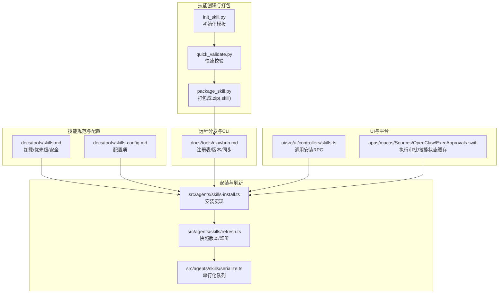
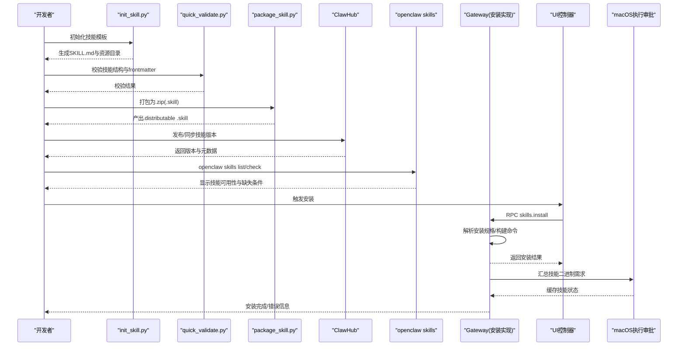
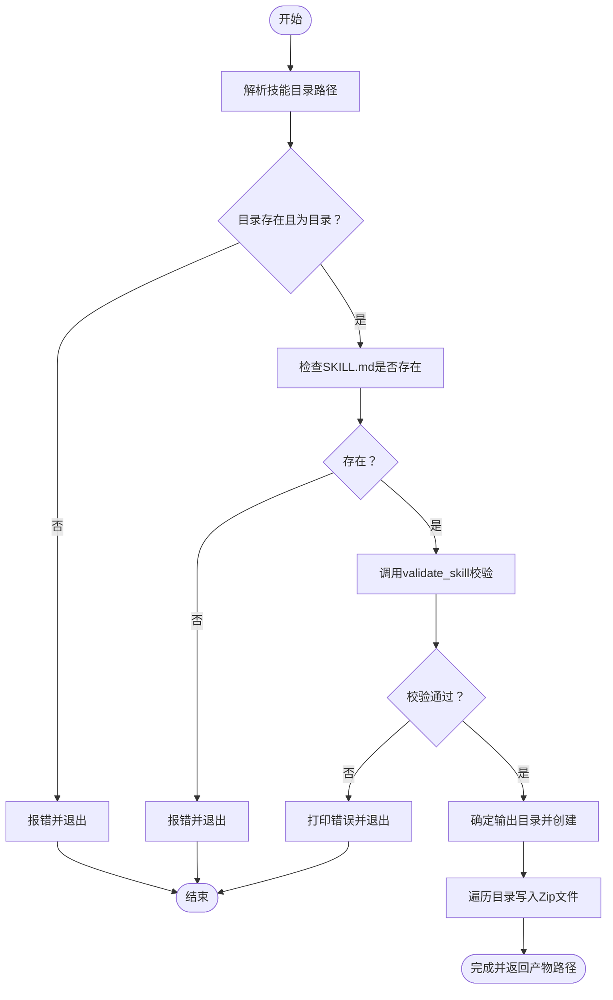
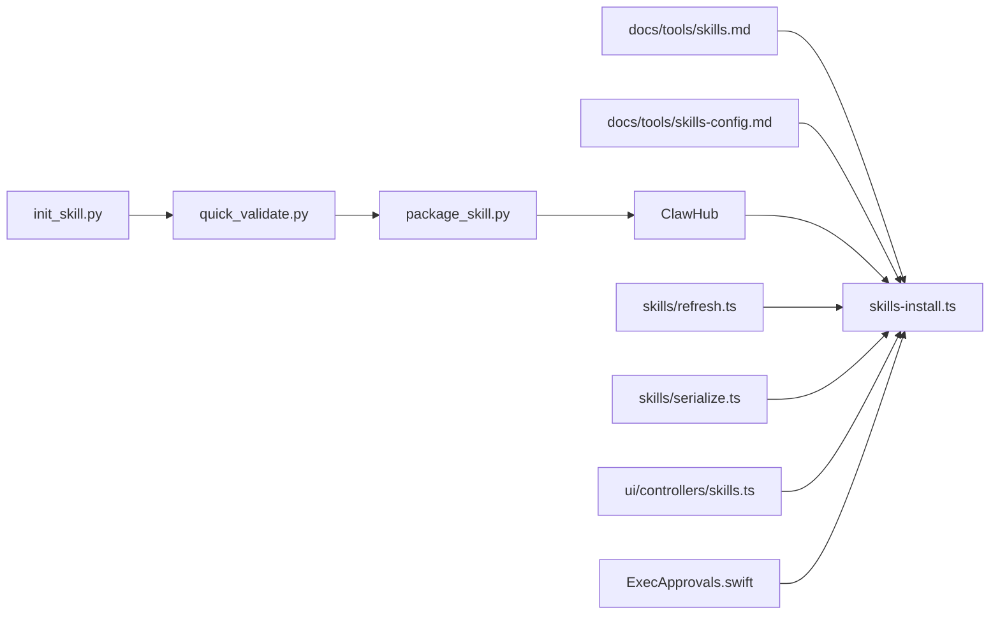

# 技能部署和分发

<cite>
**本文引用的文件**
- [skills/skill-creator/scripts/package_skill.py](file://skills/skill-creator/scripts/package_skill.py)
- [skills/skill-creator/scripts/quick_validate.py](file://skills/skill-creator/scripts/quick_validate.py)
- [skills/skill-creator/scripts/init_skill.py](file://skills/skill-creator/scripts/init_skill.py)
- [skills/skill-creator/SKILL.md](file://skills/skill-creator/SKILL.md)
- [docs/tools/skills.md](file://docs/tools/skills.md)
- [docs/tools/clawhub.md](file://docs/tools/clawhub.md)
- [docs/cli/skills.md](file://docs/cli/skills.md)
- [docs/tools/skills-config.md](file://docs/tools/skills-config.md)
- [src/agents/skills-install.ts](file://src/agents/skills-install.ts)
- [src/agents/skills/refresh.ts](file://src/agents/skills/refresh.ts)
- [src/agents/skills/serialize.ts](file://src/agents/skills/serialize.ts)
- [ui/src/ui/controllers/skills.ts](file://ui/src/ui/controllers/skills.ts)
- [apps/macos/Sources/OpenClaw/ExecApprovals.swift](file://apps/macos/Sources/OpenClaw/ExecApprovals.swift)
</cite>

## 目录

1. [简介](#简介)
2. [项目结构](#项目结构)
3. [核心组件](#核心组件)
4. [架构总览](#架构总览)
5. [详细组件分析](#详细组件分析)
6. [依赖关系分析](#依赖关系分析)
7. [性能考量](#性能考量)
8. [故障排查指南](#故障排查指南)
9. [结论](#结论)
10. [附录](#附录)

## 简介

本指南面向OpenClaw技能开发者与运维人员，系统阐述技能从创建、打包、校验到安装、更新、卸载与分发的全生命周期流程。文档重点覆盖以下方面：

- 技能打包机制：基于package_skill.py的打包流程、依赖与版本控制建议
- 安装、更新与卸载：本地安装（含下载型安装器）、通过ClawHub的远程分发与同步
- 版本管理、兼容性与回滚：语义化版本、标签策略与回退方案
- 技能市场发布：发布流程、审核与推广
- 性能监控、使用统计与用户反馈：可操作的实施方案

## 项目结构

围绕“技能部署与分发”的关键目录与文件如下：

- 技能创建与打包工具：skills/skill-creator/scripts/\*
- 技能规范与加载机制：docs/tools/skills.md、docs/tools/skills-config.md
- 远程分发与CLI：docs/tools/clawhub.md
- 安装与刷新逻辑：src/agents/skills-install.ts、src/agents/skills/refresh.ts、src/agents/skills/serialize.ts
- UI安装入口：ui/src/ui/controllers/skills.ts
- macOS执行审批与技能状态缓存：apps/macos/Sources/OpenClaw/ExecApprovals.swift
- CLI技能子命令参考：docs/cli/skills.md

**图表来源**

- [skills/skill-creator/scripts/init_skill.py](file://skills/skill-creator/scripts/init_skill.py#L1-L379)
- [skills/skill-creator/scripts/quick_validate.py](file://skills/skill-creator/scripts/quick_validate.py#L1-L102)
- [skills/skill-creator/scripts/package_skill.py](file://skills/skill-creator/scripts/package_skill.py#L1-L112)
- [docs/tools/skills.md](file://docs/tools/skills.md#L1-L301)
- [docs/tools/skills-config.md](file://docs/tools/skills-config.md#L1-L77)
- [docs/tools/clawhub.md](file://docs/tools/clawhub.md#L1-L258)
- [src/agents/skills-install.ts](file://src/agents/skills-install.ts#L396-L443)
- [src/agents/skills/refresh.ts](file://src/agents/skills/refresh.ts#L82-L119)
- [src/agents/skills/serialize.ts](file://src/agents/skills/serialize.ts#L1-L14)
- [ui/src/ui/controllers/skills.ts](file://ui/src/ui/controllers/skills.ts#L132-L164)
- [apps/macos/Sources/OpenClaw/ExecApprovals.swift](file://apps/macos/Sources/OpenClaw/ExecApprovals.swift#L744-L790)

**章节来源**

- [skills/skill-creator/scripts/package_skill.py](file://skills/skill-creator/scripts/package_skill.py#L1-L112)
- [skills/skill-creator/scripts/quick_validate.py](file://skills/skill-creator/scripts/quick_validate.py#L1-L102)
- [skills/skill-creator/scripts/init_skill.py](file://skills/skill-creator/scripts/init_skill.py#L1-L379)
- [docs/tools/skills.md](file://docs/tools/skills.md#L1-L301)
- [docs/tools/clawhub.md](file://docs/tools/clawhub.md#L1-L258)
- [docs/tools/skills-config.md](file://docs/tools/skills-config.md#L1-L77)
- [src/agents/skills-install.ts](file://src/agents/skills-install.ts#L396-L443)
- [src/agents/skills/refresh.ts](file://src/agents/skills/refresh.ts#L82-L119)
- [src/agents/skills/serialize.ts](file://src/agents/skills/serialize.ts#L1-L14)
- [ui/src/ui/controllers/skills.ts](file://ui/src/ui/controllers/skills.ts#L132-L164)
- [apps/macos/Sources/OpenClaw/ExecApprovals.swift](file://apps/macos/Sources/OpenClaw/ExecApprovals.swift#L744-L790)

## 核心组件

- 技能打包器：将技能目录打包为.zip格式的.distributable .skill文件，内置基础校验
- 快速校验器：对SKILL.md的YAML frontmatter、名称/描述合法性进行检查
- 初始化器：生成标准化的技能模板与资源目录
- 技能规范与加载：定义技能位置优先级、环境注入、安装器、安全与性能影响
- 远程分发与同步：ClawHub作为公共注册表，支持搜索、安装、更新、发布与版本管理
- 安装实现与刷新：在运行时解析安装规格、执行安装命令或下载，维护技能快照版本并支持热刷新
- UI安装入口：通过RPC触发安装流程，并展示结果与错误
- 平台侧执行审批与状态缓存：macOS侧缓存技能二进制需求，辅助UI与安装决策

**章节来源**

- [skills/skill-creator/scripts/package_skill.py](file://skills/skill-creator/scripts/package_skill.py#L20-L84)
- [skills/skill-creator/scripts/quick_validate.py](file://skills/skill-creator/scripts/quick_validate.py#L15-L91)
- [skills/skill-creator/scripts/init_skill.py](file://skills/skill-creator/scripts/init_skill.py#L255-L317)
- [docs/tools/skills.md](file://docs/tools/skills.md#L11-L186)
- [docs/tools/clawhub.md](file://docs/tools/clawhub.md#L22-L258)
- [src/agents/skills-install.ts](file://src/agents/skills-install.ts#L396-L443)
- [src/agents/skills/refresh.ts](file://src/agents/skills/refresh.ts#L82-L119)
- [ui/src/ui/controllers/skills.ts](file://ui/src/ui/controllers/skills.ts#L132-L164)
- [apps/macos/Sources/OpenClaw/ExecApprovals.swift](file://apps/macos/Sources/OpenClaw/ExecApprovals.swift#L753-L790)

## 架构总览

下图展示了从技能创建到安装、更新与分发的关键交互路径。

**图表来源**

- [skills/skill-creator/scripts/init_skill.py](file://skills/skill-creator/scripts/init_skill.py#L255-L317)
- [skills/skill-creator/scripts/quick_validate.py](file://skills/skill-creator/scripts/quick_validate.py#L15-L91)
- [skills/skill-creator/scripts/package_skill.py](file://skills/skill-creator/scripts/package_skill.py#L20-L84)
- [docs/tools/clawhub.md](file://docs/tools/clawhub.md#L163-L186)
- [docs/cli/skills.md](file://docs/cli/skills.md#L19-L26)
- [src/agents/skills-install.ts](file://src/agents/skills-install.ts#L396-L443)
- [ui/src/ui/controllers/skills.ts](file://ui/src/ui/controllers/skills.ts#L132-L164)
- [apps/macos/Sources/OpenClaw/ExecApprovals.swift](file://apps/macos/Sources/OpenClaw/ExecApprovals.swift#L753-L790)

## 详细组件分析

### 组件A：技能打包器 package_skill.py

- 功能要点
  - 输入：技能目录路径与可选输出目录
  - 校验：前置调用quick_validate.py确保SKILL.md存在且frontmatter合法
  - 打包：将技能目录递归写入Zip文件，文件名为“技能名.skill”
  - 输出：返回打包产物路径或错误信息
- 关键流程

**图表来源**

- [skills/skill-creator/scripts/package_skill.py](file://skills/skill-creator/scripts/package_skill.py#L20-L84)
- [skills/skill-creator/scripts/quick_validate.py](file://skills/skill-creator/scripts/quick_validate.py#L15-L91)

**章节来源**

- [skills/skill-creator/scripts/package_skill.py](file://skills/skill-creator/scripts/package_skill.py#L20-L84)
- [skills/skill-creator/scripts/quick_validate.py](file://skills/skill-creator/scripts/quick_validate.py#L15-L91)

### 组件B：技能初始化器 init_skill.py

- 功能要点
  - 将用户输入规范化为hyphen-case技能名
  - 生成SKILL.md模板与可选的scripts/references/assets目录
  - 支持可选示例文件填充
- 使用场景
  - 新建技能骨架
  - 快速生成资源目录以承载脚本、参考文档与资产

**章节来源**

- [skills/skill-creator/scripts/init_skill.py](file://skills/skill-creator/scripts/init_skill.py#L194-L317)
- [skills/skill-creator/SKILL.md](file://skills/skill-creator/SKILL.md#L263-L293)

### 组件C：技能规范与加载（skills.md）

- 加载位置与优先级
  - 内置技能（bundled）< 本地管理技能（~/.openclaw/skills）< 工作区技能（<workspace>/skills）
  - 可通过配置添加额外扫描目录
- 多代理共享
  - per-agent工作区仅该代理可见；shared技能对本机所有代理可见
- 插件技能
  - 插件可通过openclaw.plugin.json声明skills目录，参与加载与优先级规则
- 安全与环境
  - 第三方技能视为不受信任代码；支持在运行时注入env/apiKey
  - 沙箱模式下需注意容器内二进制可用性与网络/权限要求

**章节来源**

- [docs/tools/skills.md](file://docs/tools/skills.md#L13-L48)
- [docs/tools/skills.md](file://docs/tools/skills.md#L105-L186)

### 组件D：安装实现（skills-install.ts）

- 流程概览
  - 解析工作区与技能条目
  - 查找匹配的安装规格（download或系统安装器）
  - 下载型安装直接执行下载安装流程
  - 其他类型安装器根据偏好构建命令并执行
  - 收集安装扫描警告并返回结果
- 超时与参数范围控制
  - 对超时时间进行最小/最大边界约束

**章节来源**

- [src/agents/skills-install.ts](file://src/agents/skills-install.ts#L396-L443)

### 组件E：安装入口（UI控制器）

- UI通过RPC请求触发安装
- 成功后刷新技能列表并展示消息
- 异常时捕获错误并提示

**章节来源**

- [ui/src/ui/controllers/skills.ts](file://ui/src/ui/controllers/skills.ts#L132-L164)

### 组件F：技能快照与刷新（refresh.ts / serialize.ts）

- 快照版本
  - bumpSkillsSnapshotVersion用于递增全局或工作区版本号
  - getSkillsSnapshotVersion用于查询当前快照版本
- 文件监听
  - ensureSkillsWatcher启用/配置技能目录监听与去抖动
- 串行化
  - serializeByKey确保同一key的安装/刷新任务串行执行，避免竞态

**章节来源**

- [src/agents/skills/refresh.ts](file://src/agents/skills/refresh.ts#L82-L119)
- [src/agents/skills/serialize.ts](file://src/agents/skills/serialize.ts#L1-L14)

### 组件G：平台侧执行审批与技能状态缓存（macOS）

- 缓存技能二进制需求集合，定期刷新
- 截断长输出，避免日志膨胀
- 为UI与安装流程提供技能可用性参考

**章节来源**

- [apps/macos/Sources/OpenClaw/ExecApprovals.swift](file://apps/macos/Sources/OpenClaw/ExecApprovals.swift#L744-L790)

### 组件H：ClawHub 远程分发与版本管理

- 注册表能力
  - 公共浏览、搜索（向量+关键词）、版本化存储、下载、星标与评论、审核与举报
- 发布与同步
  - 发布新版本或更新现有版本；支持批量扫描与同步
  - 版本采用语义化版本，标签指向具体版本，便于回滚
- 更新策略
  - 基于内容哈希比较本地与注册表差异，必要时提示覆盖或强制覆盖

**章节来源**

- [docs/tools/clawhub.md](file://docs/tools/clawhub.md#L16-L98)
- [docs/tools/clawhub.md](file://docs/tools/clawhub.md#L224-L258)

## 依赖关系分析

- 创建期依赖
  - init_skill.py → quick_validate.py → package_skill.py
- 运行期依赖
  - skills.md（规范）→ skills-install.ts（安装实现）
  - skills-config.md（配置）→ skills-install.ts（安装偏好）
  - clawhub.md（远程分发）→ skills-install.ts（安装来源）
  - refresh.ts/serialize.ts → 安装/刷新一致性
  - ui/controllers/skills.ts → RPC安装入口
  - macOS ExecApprovals.swift → 技能可用性与输出截断

**图表来源**

- [skills/skill-creator/scripts/init_skill.py](file://skills/skill-creator/scripts/init_skill.py#L255-L317)
- [skills/skill-creator/scripts/quick_validate.py](file://skills/skill-creator/scripts/quick_validate.py#L15-L91)
- [skills/skill-creator/scripts/package_skill.py](file://skills/skill-creator/scripts/package_skill.py#L20-L84)
- [docs/tools/skills.md](file://docs/tools/skills.md#L105-L186)
- [docs/tools/skills-config.md](file://docs/tools/skills-config.md#L13-L77)
- [docs/tools/clawhub.md](file://docs/tools/clawhub.md#L22-L98)
- [src/agents/skills-install.ts](file://src/agents/skills-install.ts#L396-L443)
- [src/agents/skills/refresh.ts](file://src/agents/skills/refresh.ts#L82-L119)
- [src/agents/skills/serialize.ts](file://src/agents/skills/serialize.ts#L1-L14)
- [ui/src/ui/controllers/skills.ts](file://ui/src/ui/controllers/skills.ts#L132-L164)
- [apps/macos/Sources/OpenClaw/ExecApprovals.swift](file://apps/macos/Sources/OpenClaw/ExecApprovals.swift#L753-L790)

**章节来源**

- [skills/skill-creator/scripts/package_skill.py](file://skills/skill-creator/scripts/package_skill.py#L20-L84)
- [skills/skill-creator/scripts/quick_validate.py](file://skills/skill-creator/scripts/quick_validate.py#L15-L91)
- [skills/skill-creator/scripts/init_skill.py](file://skills/skill-creator/scripts/init_skill.py#L255-L317)
- [docs/tools/skills.md](file://docs/tools/skills.md#L105-L186)
- [docs/tools/clawhub.md](file://docs/tools/clawhub.md#L22-L98)
- [src/agents/skills-install.ts](file://src/agents/skills-install.ts#L396-L443)
- [src/agents/skills/refresh.ts](file://src/agents/skills/refresh.ts#L82-L119)
- [src/agents/skills/serialize.ts](file://src/agents/skills/serialize.ts#L1-L14)
- [ui/src/ui/controllers/skills.ts](file://ui/src/ui/controllers/skills.ts#L132-L164)
- [apps/macos/Sources/OpenClaw/ExecApprovals.swift](file://apps/macos/Sources/OpenClaw/ExecApprovals.swift#L753-L790)

## 性能考量

- 技能列表注入成本
  - 当有技能时，系统会将技能清单注入系统提示词，字符开销与技能数量及字段长度相关
  - 建议保持SKILL.md简洁，减少不必要的上下文占用
- 快照与热刷新
  - 会话开始时快照技能列表，后续回合复用；变更在新会话生效或启用监听后热刷新
  - 合理设置监听去抖动时间，平衡响应速度与I/O压力
- 安装超时与重试
  - 安装实现对超时进行边界控制；网络/下载类安装建议结合重试与进度反馈
- 平台侧输出截断
  - 长输出会被截断，避免日志膨胀与内存压力

**章节来源**

- [docs/tools/skills.md](file://docs/tools/skills.md#L267-L284)
- [src/agents/skills/refresh.ts](file://src/agents/skills/refresh.ts#L82-L119)
- [apps/macos/Sources/OpenClaw/ExecApprovals.swift](file://apps/macos/Sources/OpenClaw/ExecApprovals.swift#L744-L750)

## 故障排查指南

- 打包失败
  - 检查技能目录是否为有效目录且包含SKILL.md
  - 先运行quick_validate.py确认frontmatter与命名规范
- 安装失败
  - 使用openclaw skills list/check定位缺失的二进制/环境变量/配置
  - 查看安装命令构建结果与错误码
  - 若为下载型安装，检查网络与目标URL有效性
- 热刷新未生效
  - 确认已启用skills.load.watch并设置合理去抖动时间
  - 检查是否有并发安装/刷新任务阻塞
- macOS二进制不可用
  - 检查ExecApprovals缓存中的bins集合与实际可用性
  - 在沙箱环境中确保容器内具备所需二进制与权限

**章节来源**

- [docs/cli/skills.md](file://docs/cli/skills.md#L19-L26)
- [src/agents/skills-install.ts](file://src/agents/skills-install.ts#L396-L443)
- [src/agents/skills/refresh.ts](file://src/agents/skills/refresh.ts#L82-L119)
- [apps/macos/Sources/OpenClaw/ExecApprovals.swift](file://apps/macos/Sources/OpenClaw/ExecApprovals.swift#L753-L790)

## 结论

OpenClaw的技能部署与分发体系以“标准化技能模板 + 自动化打包校验 + 远程注册表 + 运行时安装与刷新”为核心闭环。通过严格的规范与工具链，开发者可以高效地创建、测试、打包与分发技能；通过ClawHub实现版本化与社区协作；通过运行时的快照与监听机制保障体验稳定与性能可控。

## 附录

### A. 技能打包与依赖管理最佳实践

- 创建阶段
  - 使用init_skill.py生成模板，按需创建scripts/references/assets目录
  - 在编写SKILL.md前先完成Concrete Examples与规划
- 校验阶段
  - 运行quick_validate.py确保frontmatter与命名规范
  - 保持描述简洁明确，避免冗余信息
- 打包阶段
  - package_skill.py会自动校验并打包为.zip(.skill)
  - 建议在CI中集成校验与打包步骤，统一产物命名与输出目录
- 依赖管理
  - 优先使用系统安装器（如brew/npm/pnpm/yarn/bun），并在metadata.openclaw.install中声明
  - 对于下载型安装器，指定URL、压缩格式与解压目标目录
  - 沙箱场景下确保容器内具备所需二进制与网络/权限

**章节来源**

- [skills/skill-creator/scripts/init_skill.py](file://skills/skill-creator/scripts/init_skill.py#L255-L317)
- [skills/skill-creator/scripts/quick_validate.py](file://skills/skill-creator/scripts/quick_validate.py#L15-L91)
- [skills/skill-creator/scripts/package_skill.py](file://skills/skill-creator/scripts/package_skill.py#L20-L84)
- [docs/tools/skills.md](file://docs/tools/skills.md#L147-L184)

### B. 版本控制与回滚策略

- 版本与标签
  - 发布即产生新的语义化版本；标签指向版本，支持回滚
- 回滚方法
  - 通过ClawHub移动标签至历史版本，或在安装时指定版本
- 兼容性保证
  - 通过metadata.openclaw.os与bins/env/config等门禁规则，确保技能在目标平台与环境下可用

**章节来源**

- [docs/tools/clawhub.md](file://docs/tools/clawhub.md#L224-L228)
- [docs/tools/skills.md](file://docs/tools/skills.md#L124-L146)

### C. 技能市场发布流程与审核

- 发布流程
  - 本地打包后通过clawhub publish或sync上传
  - 提供slug/name/version/changelog/tags等元数据
- 审核与举报
  - 举报触发自动隐藏阈值；管理员可查看/恢复/删除/封禁
- 推广方法
  - 使用标签与搜索优化；通过星标与评论提升可见度

**章节来源**

- [docs/tools/clawhub.md](file://docs/tools/clawhub.md#L163-L186)
- [docs/tools/clawhub.md](file://docs/tools/clawhub.md#L100-L116)

### D. 安装、更新与卸载（本地与远程）

- 本地安装
  - 通过openclaw skills子命令查看技能可用性
  - UI触发RPC安装；安装实现解析安装规格并执行
- 远程分发
  - 通过ClawHub安装/更新；支持按slug或全部更新
  - 同步扫描本地技能并发布新版本
- 卸载
  - 删除工作区或本地技能目录对应文件夹即可
  - 对于受控安装器，可结合其自带卸载流程（若提供）

**章节来源**

- [docs/cli/skills.md](file://docs/cli/skills.md#L19-L26)
- [ui/src/ui/controllers/skills.ts](file://ui/src/ui/controllers/skills.ts#L132-L164)
- [src/agents/skills-install.ts](file://src/agents/skills-install.ts#L396-L443)
- [docs/tools/clawhub.md](file://docs/tools/clawhub.md#L177-L186)

### E. 性能监控、使用统计与用户反馈

- 性能监控
  - 利用会话快照与监听机制观察技能变更对提示词长度与token消耗的影响
  - 在沙箱场景关注容器内二进制可用性与网络延迟
- 使用统计
  - ClawHub提供星标与评论，可用于社区反馈与热度指标
- 用户反馈
  - 通过ClawHub举报与评论功能收集问题与改进建议
  - 在技能描述中提供“网站/主页”链接以便用户获取帮助

**章节来源**

- [docs/tools/skills.md](file://docs/tools/skills.md#L240-L251)
- [docs/tools/clawhub.md](file://docs/tools/clawhub.md#L90-L98)
- [docs/tools/clawhub.md](file://docs/tools/clawhub.md#L243-L249)
