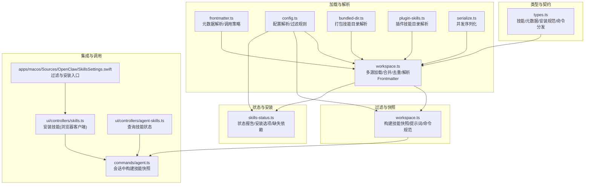
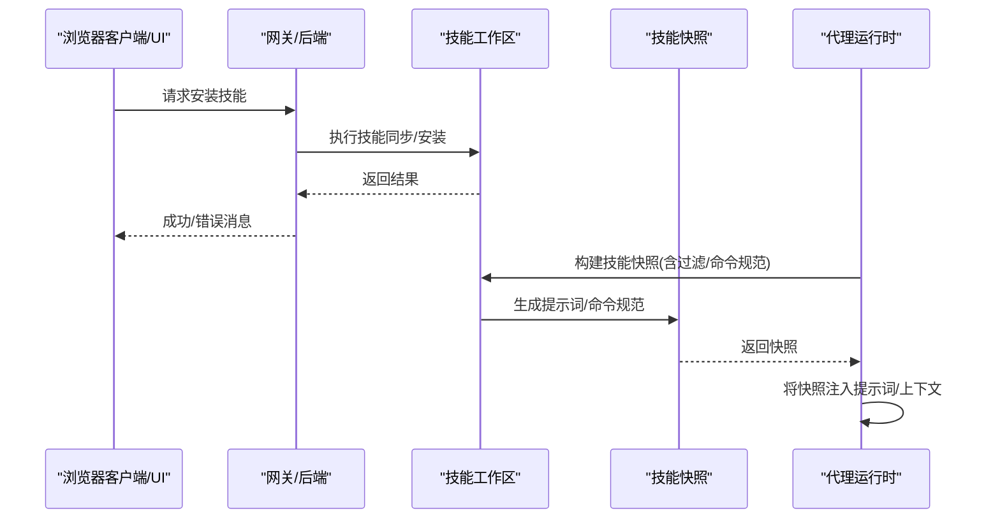
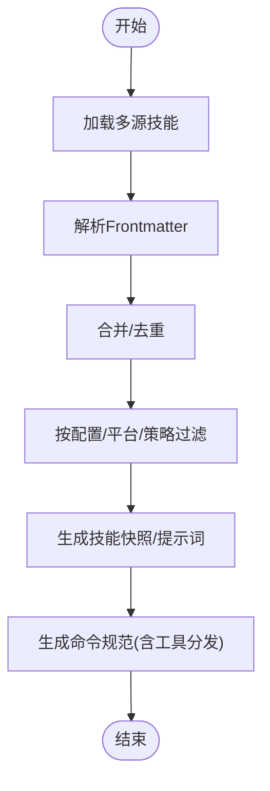
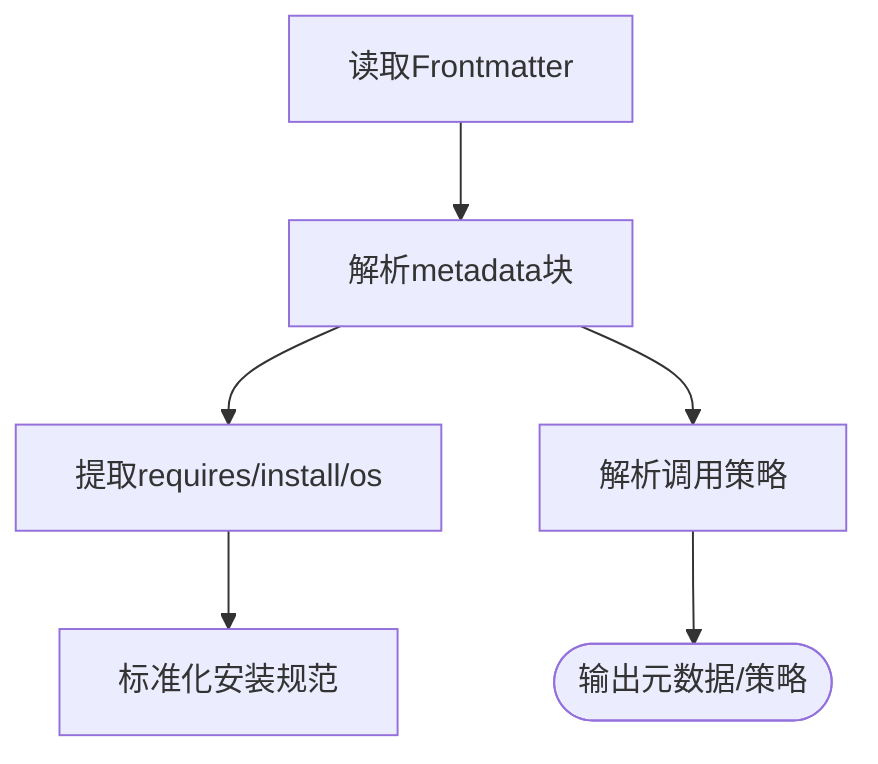
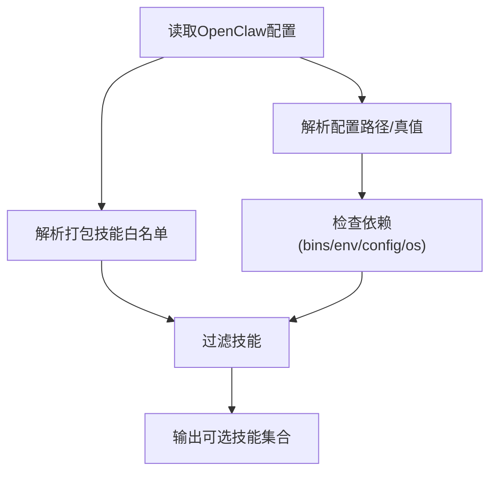
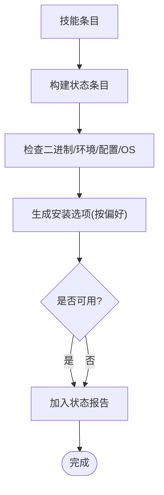
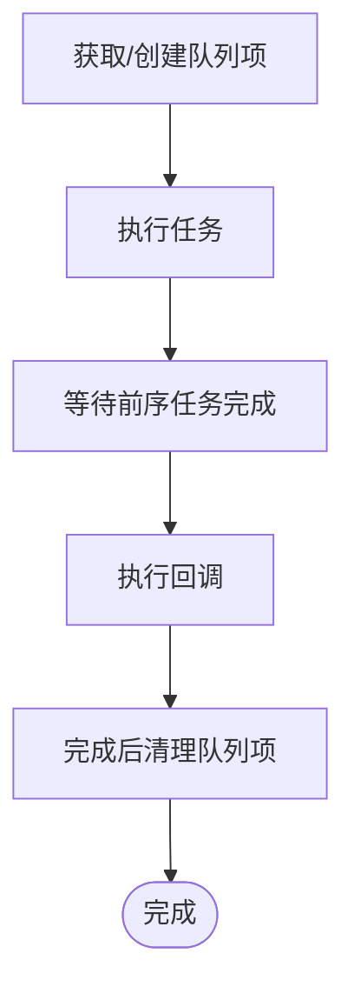
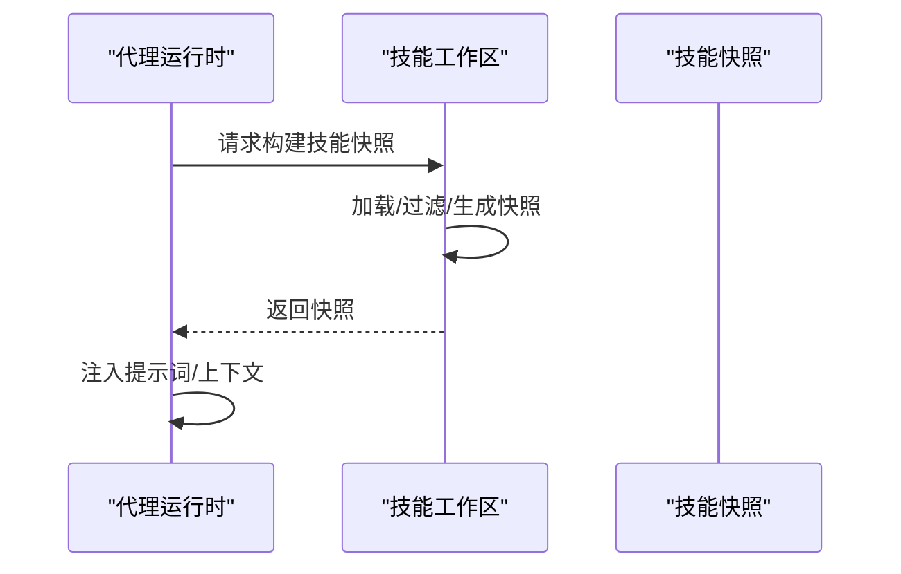
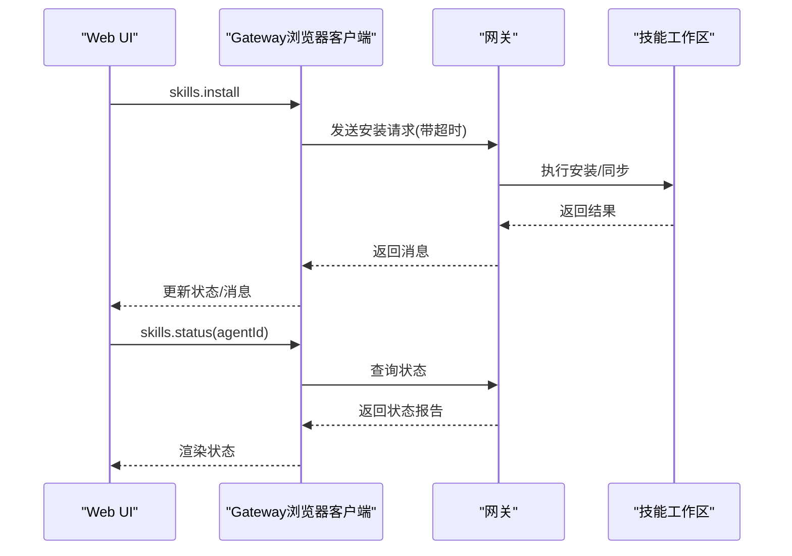
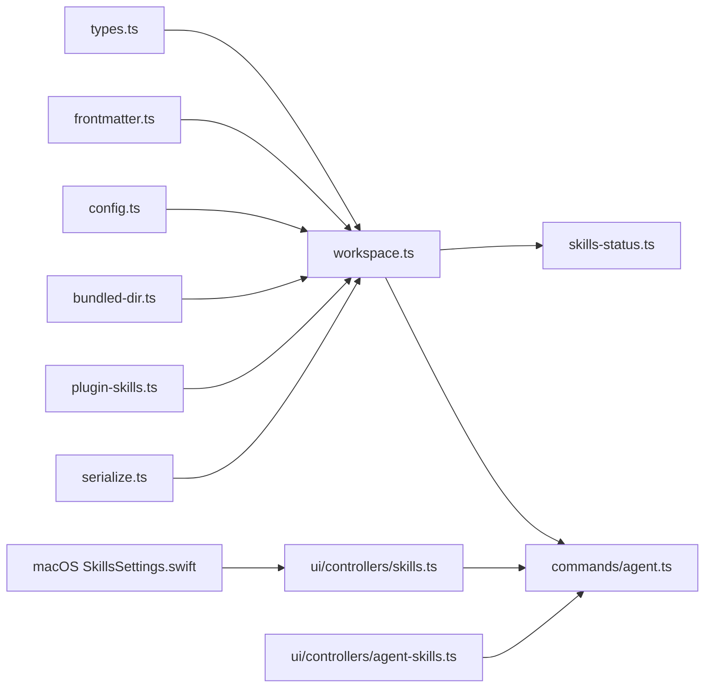

# 技能系统设计

<cite>
**本文引用的文件**
- [src/agents/skills/types.ts](file://src/agents/skills/types.ts)
- [src/agents/skills/workspace.ts](file://src/agents/skills/workspace.ts)
- [src/agents/skills/frontmatter.ts](file://src/agents/skills/frontmatter.ts)
- [src/agents/skills/config.ts](file://src/agents/skills/config.ts)
- [src/agents/skills/bundled-dir.ts](file://src/agents/skills/bundled-dir.ts)
- [src/agents/skills/plugin-skills.ts](file://src/agents/skills/plugin-skills.ts)
- [src/agents/skills/serialize.ts](file://src/agents/skills/serialize.ts)
- [src/agents/skills-status.ts](file://src/agents/skills-status.ts)
- [src/commands/agent.ts](file://src/commands/agent.ts)
- [ui/src/ui/controllers/skills.ts](file://ui/src/ui/controllers/skills.ts)
- [ui/src/ui/controllers/agent-skills.ts](file://ui/src/ui/controllers/agent-skills.ts)
- [apps/macos/Sources/OpenClaw/SkillsSettings.swift](file://apps/macos/Sources/OpenClaw/SkillsSettings.swift)
</cite>

## 目录

1. [引言](#引言)
2. [项目结构](#项目结构)
3. [核心组件](#核心组件)
4. [架构总览](#架构总览)
5. [详细组件分析](#详细组件分析)
6. [依赖关系分析](#依赖关系分析)
7. [性能考虑](#性能考虑)
8. [故障排查指南](#故障排查指南)
9. [结论](#结论)
10. [附录](#附录)

## 引言

本文件面向OpenClaw技能系统的设计与实现，系统性阐述其架构理念、核心组件、技能生命周期管理、加载机制、执行流程、与AI代理的集成方式、工具调用机制与上下文处理，并覆盖技能配置文件格式、元数据定义、依赖管理、分类体系、权限控制与安全机制，以及扩展性与性能优化策略。目标是帮助开发者与运维人员快速理解并高效使用与扩展该技能系统。

## 项目结构

技能系统主要由以下层次构成：

- 类型与契约层：定义技能、元数据、安装规范、命令分发等类型与接口。
- 加载与解析层：从工作区、打包目录、插件目录等多源加载技能，解析Frontmatter元数据与调用策略。
- 过滤与快照层：根据配置、平台、依赖与策略过滤技能，生成提示词与命令规范。
- 状态与安装层：评估技能可用性、缺失依赖、安装选项，支持安装与同步。
- 集成与调用层：与AI代理会话、命令行、Web UI、桌面应用集成，支持工具调用与上下文传递。

**图表来源**

- [src/agents/skills/types.ts](file://src/agents/skills/types.ts#L1-L88)
- [src/agents/skills/workspace.ts](file://src/agents/skills/workspace.ts#L1-L518)
- [src/agents/skills/frontmatter.ts](file://src/agents/skills/frontmatter.ts#L1-L173)
- [src/agents/skills/config.ts](file://src/agents/skills/config.ts#L1-L192)
- [src/agents/skills/bundled-dir.ts](file://src/agents/skills/bundled-dir.ts#L1-L91)
- [src/agents/skills/plugin-skills.ts](file://src/agents/skills/plugin-skills.ts#L1-L75)
- [src/agents/skills/serialize.ts](file://src/agents/skills/serialize.ts#L1-L14)
- [src/agents/skills-status.ts](file://src/agents/skills-status.ts#L1-L324)
- [src/commands/agent.ts](file://src/commands/agent.ts#L160-L199)
- [ui/src/ui/controllers/skills.ts](file://ui/src/ui/controllers/skills.ts#L132-L164)
- [ui/src/ui/controllers/agent-skills.ts](file://ui/src/ui/controllers/agent-skills.ts#L1-L33)
- [apps/macos/Sources/OpenClaw/SkillsSettings.swift](file://apps/macos/Sources/OpenClaw/SkillsSettings.swift#L111-L164)

**章节来源**

- [src/agents/skills/workspace.ts](file://src/agents/skills/workspace.ts#L1-L518)
- [src/agents/skills/frontmatter.ts](file://src/agents/skills/frontmatter.ts#L1-L173)
- [src/agents/skills/config.ts](file://src/agents/skills/config.ts#L1-L192)
- [src/agents/skills/bundled-dir.ts](file://src/agents/skills/bundled-dir.ts#L1-L91)
- [src/agents/skills/plugin-skills.ts](file://src/agents/skills/plugin-skills.ts#L1-L75)
- [src/agents/skills/serialize.ts](file://src/agents/skills/serialize.ts#L1-L14)
- [src/agents/skills-status.ts](file://src/agents/skills-status.ts#L1-L324)
- [src/commands/agent.ts](file://src/commands/agent.ts#L160-L199)
- [ui/src/ui/controllers/skills.ts](file://ui/src/ui/controllers/skills.ts#L132-L164)
- [ui/src/ui/controllers/agent-skills.ts](file://ui/src/ui/controllers/agent-skills.ts#L1-L33)
- [apps/macos/Sources/OpenClaw/SkillsSettings.swift](file://apps/macos/Sources/OpenClaw/SkillsSettings.swift#L111-L164)

## 核心组件

- 技能类型与契约
  - 定义技能安装规范、OpenClaw技能元数据、调用策略、命令分发、快照结构等。
  - 关键类型包括：安装规范、元数据、调用策略、命令规范、快照、技能条目等。
- 多源加载与合并
  - 支持从打包目录、额外目录、管理目录、个人与项目级agents目录、工作区skills目录等多源加载，并按优先级合并，去重后返回技能条目。
- 元数据解析与调用策略
  - 解析Frontmatter中的metadata块（支持新旧键名），提取依赖、安装、平台等信息；解析用户可调用与模型禁用调用策略。
- 过滤与快照
  - 基于配置、平台、依赖、策略进行过滤；生成用于提示词的技能列表与命令规范；支持保留已解析技能以复用。
- 状态与安装
  - 评估技能是否可用、缺失哪些依赖（二进制、环境变量、配置路径、操作系统）、允许的安装选项；生成状态报告。
- 并发控制
  - 使用键控序列化确保对同一目标的技能同步操作串行化，避免竞态。
- 集成与调用
  - 在代理运行时构建技能快照；通过浏览器客户端安装技能；在桌面端提供过滤与安装入口。

**章节来源**

- [src/agents/skills/types.ts](file://src/agents/skills/types.ts#L1-L88)
- [src/agents/skills/workspace.ts](file://src/agents/skills/workspace.ts#L101-L207)
- [src/agents/skills/frontmatter.ts](file://src/agents/skills/frontmatter.ts#L102-L172)
- [src/agents/skills/config.ts](file://src/agents/skills/config.ts#L114-L191)
- [src/agents/skills/serialize.ts](file://src/agents/skills/serialize.ts#L1-L14)
- [src/agents/skills-status.ts](file://src/agents/skills-status.ts#L66-L324)

## 架构总览

技能系统围绕“类型—加载—过滤—快照—状态—安装—集成”形成闭环。前端（Web UI/桌面）负责触发安装与状态查询；后端在代理运行时构建技能快照并注入到提示词；工具调用通过命令分发机制桥接到具体工具。

**图表来源**

- [ui/src/ui/controllers/skills.ts](file://ui/src/ui/controllers/skills.ts#L132-L164)
- [src/agents/skills/workspace.ts](file://src/agents/skills/workspace.ts#L209-L244)
- [src/commands/agent.ts](file://src/commands/agent.ts#L189-L199)

## 详细组件分析

### 组件A：技能加载与合并（workspace.ts）

- 多源加载顺序与优先级：extra < bundled < managed < agents-skills-personal < agents-skills-project < workspace
- Frontmatter解析：读取每个技能文件内容，解析头部元数据，生成技能条目
- 合并与去重：以技能名称为键合并，后者覆盖前者
- 过滤：支持按配置、技能过滤器、远程能力进行过滤
- 快照与提示词：生成用于模型提示的技能描述文本与命令规范
- 命令规范化：清洗命令名、去重、长度限制、描述截断
- 工具分发：支持将技能命令转发给指定工具（raw模式）

**图表来源**

- [src/agents/skills/workspace.ts](file://src/agents/skills/workspace.ts#L101-L207)
- [src/agents/skills/workspace.ts](file://src/agents/skills/workspace.ts#L209-L272)
- [src/agents/skills/workspace.ts](file://src/agents/skills/workspace.ts#L411-L517)

**章节来源**

- [src/agents/skills/workspace.ts](file://src/agents/skills/workspace.ts#L101-L207)
- [src/agents/skills/workspace.ts](file://src/agents/skills/workspace.ts#L209-L272)
- [src/agents/skills/workspace.ts](file://src/agents/skills/workspace.ts#L411-L517)

### 组件B：元数据解析与调用策略（frontmatter.ts）

- 元数据解析：支持新旧manifest键名，提取requires/install/os/skillKey/primaryEnv等
- 调用策略：解析用户可调用与模型禁用调用
- 安装规范解析：标准化安装项字段，支持brew/node/go/uv/download等类型

**图表来源**

- [src/agents/skills/frontmatter.ts](file://src/agents/skills/frontmatter.ts#L102-L172)

**章节来源**

- [src/agents/skills/frontmatter.ts](file://src/agents/skills/frontmatter.ts#L1-L173)

### 组件C：配置与过滤（config.ts）

- 配置路径解析与真值判定
- 技能配置解析与启用状态
- 打包技能白名单与允许策略
- 二进制检测、平台判断、依赖检查
- 综合过滤逻辑：禁用、白名单、平台、二进制/环境/配置依赖

**图表来源**

- [src/agents/skills/config.ts](file://src/agents/skills/config.ts#L114-L191)

**章节来源**

- [src/agents/skills/config.ts](file://src/agents/skills/config.ts#L1-L192)

### 组件D：状态与安装（skills-status.ts）

- 状态条目：技能基本信息、来源、是否打包、是否总是、是否禁用、是否被白名单阻止、是否可用、缺失依赖、配置检查、安装选项
- 安装偏好选择：优先brew（若偏好且存在），否则uv、node、brew、go，或随机选择首个
- 下载类安装直接暴露全部，其他类型仅暴露首选项
- 可用性判定：综合禁用、白名单、always标志与缺失依赖

**图表来源**

- [src/agents/skills-status.ts](file://src/agents/skills-status.ts#L174-L295)

**章节来源**

- [src/agents/skills-status.ts](file://src/agents/skills-status.ts#L1-L324)

### 组件E：并发序列化（serialize.ts）

- 键控队列：同一目标的同步任务串行执行，避免竞态与重复
- 释放机制：任务完成后清理队列项

**图表来源**

- [src/agents/skills/serialize.ts](file://src/agents/skills/serialize.ts#L1-L14)

**章节来源**

- [src/agents/skills/serialize.ts](file://src/agents/skills/serialize.ts#L1-L14)

### 组件F：与AI代理的集成（commands/agent.ts 与 workspace.ts）

- 代理运行时构建技能快照：根据会话状态决定是否需要重建快照，结合过滤器与远程能力
- 提示词注入：将技能快照中的提示文本注入到代理上下文中

**图表来源**

- [src/commands/agent.ts](file://src/commands/agent.ts#L189-L199)
- [src/agents/skills/workspace.ts](file://src/agents/skills/workspace.ts#L209-L244)

**章节来源**

- [src/commands/agent.ts](file://src/commands/agent.ts#L160-L199)
- [src/agents/skills/workspace.ts](file://src/agents/skills/workspace.ts#L209-L244)

### 组件G：Web UI与桌面端集成

- 浏览器客户端安装技能：向网关请求安装，设置超时，更新状态与消息
- 查询技能状态：向网关请求技能状态报告
- 桌面端过滤与安装：提供All/Ready/Needs Setup/Disabled四类过滤，支持安装目标选择

**图表来源**

- [ui/src/ui/controllers/skills.ts](file://ui/src/ui/controllers/skills.ts#L132-L164)
- [ui/src/ui/controllers/agent-skills.ts](file://ui/src/ui/controllers/agent-skills.ts#L13-L33)
- [apps/macos/Sources/OpenClaw/SkillsSettings.swift](file://apps/macos/Sources/OpenClaw/SkillsSettings.swift#L111-L164)

**章节来源**

- [ui/src/ui/controllers/skills.ts](file://ui/src/ui/controllers/skills.ts#L132-L164)
- [ui/src/ui/controllers/agent-skills.ts](file://ui/src/ui/controllers/agent-skills.ts#L1-L33)
- [apps/macos/Sources/OpenClaw/SkillsSettings.swift](file://apps/macos/Sources/OpenClaw/SkillsSettings.swift#L111-L164)

## 依赖关系分析

- 类型依赖：所有模块共享types.ts中的类型定义
- 解析依赖：workspace.ts依赖frontmatter.ts解析元数据；依赖config.ts进行过滤与依赖检查
- 目录解析：bundled-dir.ts与plugin-skills.ts分别解析打包目录与插件技能目录
- 并发依赖：serialize.ts被workspace.ts用于同步技能复制
- 状态依赖：skills-status.ts依赖config.ts与workspace.ts加载的条目
- 集成依赖：commands/agent.ts依赖workspace.ts生成的快照；UI控制器依赖网关RPC

**图表来源**

- [src/agents/skills/types.ts](file://src/agents/skills/types.ts#L1-L88)
- [src/agents/skills/workspace.ts](file://src/agents/skills/workspace.ts#L1-L518)
- [src/agents/skills/frontmatter.ts](file://src/agents/skills/frontmatter.ts#L1-L173)
- [src/agents/skills/config.ts](file://src/agents/skills/config.ts#L1-L192)
- [src/agents/skills/bundled-dir.ts](file://src/agents/skills/bundled-dir.ts#L1-L91)
- [src/agents/skills/plugin-skills.ts](file://src/agents/skills/plugin-skills.ts#L1-L75)
- [src/agents/skills/serialize.ts](file://src/agents/skills/serialize.ts#L1-L14)
- [src/agents/skills-status.ts](file://src/agents/skills-status.ts#L1-L324)
- [src/commands/agent.ts](file://src/commands/agent.ts#L160-L199)
- [ui/src/ui/controllers/skills.ts](file://ui/src/ui/controllers/skills.ts#L132-L164)
- [ui/src/ui/controllers/agent-skills.ts](file://ui/src/ui/controllers/agent-skills.ts#L1-L33)
- [apps/macos/Sources/OpenClaw/SkillsSettings.swift](file://apps/macos/Sources/OpenClaw/SkillsSettings.swift#L111-L164)

**章节来源**

- [src/agents/skills/workspace.ts](file://src/agents/skills/workspace.ts#L1-L518)
- [src/agents/skills-status.ts](file://src/agents/skills-status.ts#L1-L324)
- [src/commands/agent.ts](file://src/commands/agent.ts#L160-L199)

## 性能考虑

- 并发控制：使用键控序列化避免重复同步导致的IO竞争与资源浪费
- 快照复用：在代理运行时缓存技能快照，减少重复构建成本
- 过滤前置：在加载阶段尽早过滤不可用技能，缩小后续处理规模
- 命令规范化：统一命令命名与去重，降低路由与冲突开销
- 安装偏好：优先本地成熟包管理器（如brew），减少下载与解压成本

[本节为通用指导，无需特定文件引用]

## 故障排查指南

- 安装失败
  - 检查安装选项是否与当前平台匹配（os字段）
  - 确认二进制依赖是否可用或远程平台支持
  - 查看状态报告中的缺失依赖与配置检查结果
- 技能不可用
  - 确认是否被禁用或白名单阻止
  - 检查always标志与缺失依赖
- Web UI/桌面端问题
  - 确认网关连接状态与RPC响应
  - 检查超时设置与错误消息
- 并发冲突
  - 若多次触发安装/同步，确认序列化是否生效

**章节来源**

- [src/agents/skills-status.ts](file://src/agents/skills-status.ts#L66-L324)
- [ui/src/ui/controllers/skills.ts](file://ui/src/ui/controllers/skills.ts#L132-L164)
- [src/agents/skills/serialize.ts](file://src/agents/skills/serialize.ts#L1-L14)

## 结论

OpenClaw技能系统通过清晰的类型契约、多源加载与合并、严格的依赖与策略过滤、可复用的技能快照与命令规范，以及完善的Web/桌面集成，实现了高扩展性与安全性。并发序列化与快照复用提升了性能，而状态报告与安装偏好则增强了可观测性与易用性。未来可在跨平台远程安装、增量同步与更细粒度的权限控制方面进一步演进。

[本节为总结性内容，无需特定文件引用]

## 附录

### 技能配置文件格式与元数据定义

- Frontmatter元数据键
  - metadata：JSON5块，包含以下子键
    - always：布尔，标记技能始终可用
    - skillKey：字符串，技能唯一标识
    - primaryEnv：字符串，主密钥环境变量名
    - emoji/homepage：字符串，展示信息
    - os：字符串数组，适用的操作系统
    - requires：对象，包含bins/anyBins/env/config数组
    - install：数组，安装规范条目
- 调用策略键
  - user-invocable：布尔，是否允许用户调用
  - disable-model-invocation：布尔，是否禁止模型调用

**章节来源**

- [src/agents/skills/frontmatter.ts](file://src/agents/skills/frontmatter.ts#L102-L172)
- [src/agents/skills/types.ts](file://src/agents/skills/types.ts#L19-L38)

### 依赖管理与安装规范

- 依赖类型
  - 二进制：精确匹配或anyBins任一满足
  - 环境变量：进程环境、技能配置、或主密钥场景下豁免
  - 配置路径：通过点号路径解析，支持默认真值
  - 操作系统：支持本地与远程平台
- 安装规范
  - 支持brew/node/go/uv/download五种类型
  - 字段标准化：id/label/bins/os/formula/package/module/url/archive/extract/stripComponents/targetDir等

**章节来源**

- [src/agents/skills/config.ts](file://src/agents/skills/config.ts#L99-L191)
- [src/agents/skills/frontmatter.ts](file://src/agents/skills/frontmatter.ts#L34-L90)
- [src/agents/skills/types.ts](file://src/agents/skills/types.ts#L3-L17)

### 分类体系与权限控制

- 分类
  - 来源：打包/管理/工作区/插件/agents目录
  - 可用性：always/禁用/白名单/依赖满足
- 权限与安全
  - 白名单控制打包技能启用
  - 远程能力探测（二进制/平台/任意二进制）
  - 主密钥场景下的环境变量豁免
  - 并发序列化避免竞态

**章节来源**

- [src/agents/skills/config.ts](file://src/agents/skills/config.ts#L84-L97)
- [src/agents/skills-status.ts](file://src/agents/skills-status.ts#L199-L294)

### 扩展性设计

- 插件技能目录解析：通过插件清单动态发现技能目录
- 打包技能目录解析：支持多种定位策略（exec同级、包根、模块目录回溯）
- 安装器扩展：新增安装类型时，只需完善安装规范解析与偏好选择逻辑

**章节来源**

- [src/agents/skills/plugin-skills.ts](file://src/agents/skills/plugin-skills.ts#L14-L74)
- [src/agents/skills/bundled-dir.ts](file://src/agents/skills/bundled-dir.ts#L36-L90)
