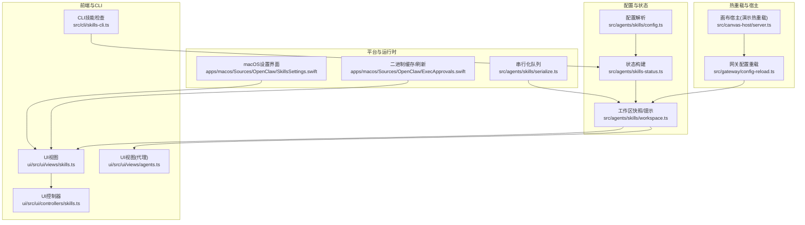
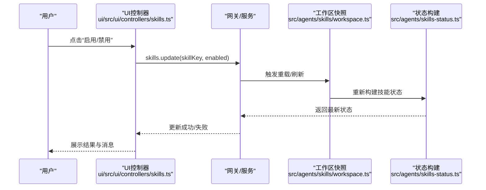
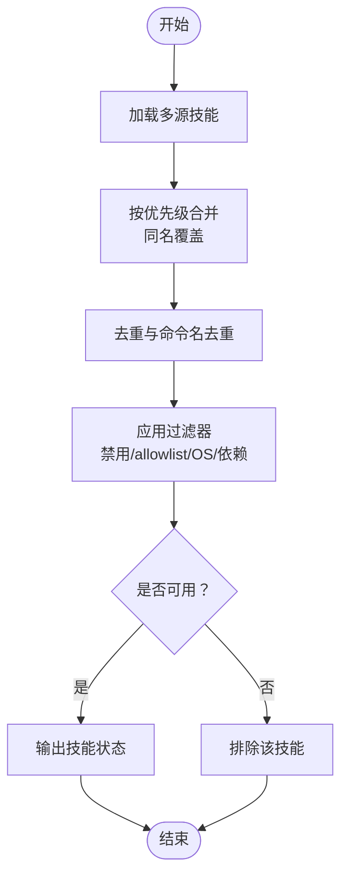
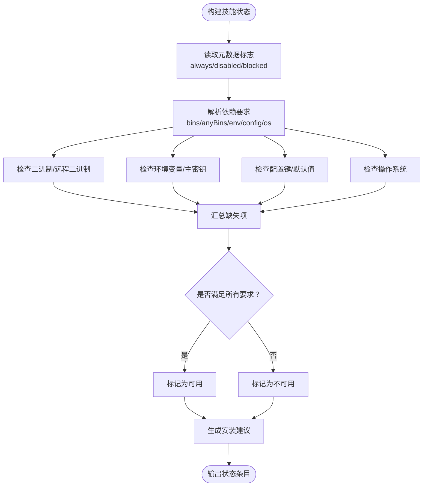
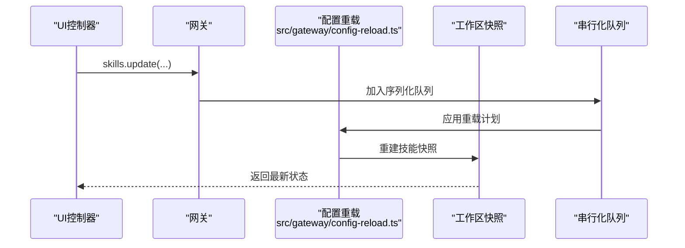
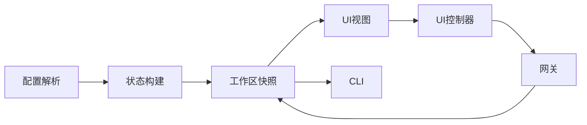

# 技能配置管理

<cite>
**本文引用的文件**
- [src/agents/skills/config.ts](file://src/agents/skills/config.ts)
- [src/agents/skills-status.ts](file://src/agents/skills-status.ts)
- [src/agents/skills/workspace.ts](file://src/agents/skills/workspace.ts)
- [src/agents/skills/serialize.ts](file://src/agents/skills/serialize.ts)
- [src/canvas-host/server.ts](file://src/canvas-host/server.ts)
- [src/gateway/config-reload.ts](file://src/gateway/config-reload.ts)
- [apps/macos/Sources/OpenClaw/ExecApprovals.swift](file://apps/macos/Sources/OpenClaw/ExecApprovals.swift)
- [apps/macos/Sources/OpenClaw/SkillsSettings.swift](file://apps/macos/Sources/OpenClaw/SkillsSettings.swift)
- [ui/src/ui/views/skills.ts](file://ui/src/ui/views/skills.ts)
- [ui/src/ui/views/agents.ts](file://ui/src/ui/views/agents.ts)
- [ui/src/ui/controllers/skills.ts](file://ui/src/ui/controllers/skills.ts)
- [src/cli/skills-cli.ts](file://src/cli/skills-cli.ts)
- [skills/skill-creator/scripts/quick_validate.py](file://skills/skill-creator/scripts/quick_validate.py)
- [skills/1password/SKILL.md](file://skills/1password/SKILL.md)
- [skills/discord/SKILL.md](file://skills/discord/SKILL.md)
- [skills/canvas/SKILL.md](file://skills/canvas/SKILL.md)
</cite>

## 目录

1. [简介](#简介)
2. [项目结构](#项目结构)
3. [核心组件](#核心组件)
4. [架构总览](#架构总览)
5. [详细组件分析](#详细组件分析)
6. [依赖关系分析](#依赖关系分析)
7. [性能考量](#性能考量)
8. [故障排查指南](#故障排查指南)
9. [结论](#结论)
10. [附录](#附录)

## 简介

本技术文档围绕 OpenClaw 的“技能配置管理”进行系统化梳理，目标是帮助开发者与运维人员理解技能配置文件的结构与语法规则、元数据字段、依赖声明与执行参数；掌握技能的启用/禁用机制、优先级与冲突解决策略；明确配置验证规则、默认值处理与错误恢复机制；并提供动态更新、热重载与状态同步的实现方式与最佳实践。

## 项目结构

技能配置管理涉及以下关键层次：

- 配置解析与验证：负责从配置文件中解析技能条目、校验依赖与环境变量、计算可执行性与可用性。
- 技能状态构建：汇总技能的可用性、缺失项、安装选项等信息，形成统一的状态报告。
- 工作区扫描与合并：从多源目录加载技能，按优先级合并，生成最终技能集合。
- 前端与CLI交互：提供 UI 与 CLI 展示与操作入口，支持启用/禁用、安装、编辑配置等。
- 热重载与同步：在配置变更时触发热重载或重启，并保证状态一致性。

图表来源

- [src/agents/skills/config.ts](file://src/agents/skills/config.ts#L1-L192)
- [src/agents/skills-status.ts](file://src/agents/skills-status.ts#L1-L324)
- [src/agents/skills/workspace.ts](file://src/agents/skills/workspace.ts#L1-L518)
- [ui/src/ui/views/skills.ts](file://ui/src/ui/views/skills.ts#L286-L330)
- [ui/src/ui/views/agents.ts](file://ui/src/ui/views/agents.ts#L1718-L1972)
- [ui/src/ui/controllers/skills.ts](file://ui/src/ui/controllers/skills.ts#L81-L130)
- [apps/macos/Sources/OpenClaw/SkillsSettings.swift](file://apps/macos/Sources/OpenClaw/SkillsSettings.swift#L1-L109)
- [apps/macos/Sources/OpenClaw/ExecApprovals.swift](file://apps/macos/Sources/OpenClaw/ExecApprovals.swift#L744-L790)
- [src/agents/skills/serialize.ts](file://src/agents/skills/serialize.ts#L1-L14)
- [src/gateway/config-reload.ts](file://src/gateway/config-reload.ts#L89-L355)
- [src/canvas-host/server.ts](file://src/canvas-host/server.ts#L263-L342)

章节来源

- [src/agents/skills/config.ts](file://src/agents/skills/config.ts#L1-L192)
- [src/agents/skills-status.ts](file://src/agents/skills-status.ts#L1-L324)
- [src/agents/skills/workspace.ts](file://src/agents/skills/workspace.ts#L1-L518)

## 核心组件

- 配置解析与过滤器
  - 解析配置路径、判断布尔值、解析技能条目、判定是否允许内置技能、检测二进制、过滤不可用技能。
- 技能状态构建器
  - 计算缺失依赖（二进制、环境变量、配置键、操作系统）、评估可执行性、生成安装建议、汇总状态报告。
- 工作区技能快照与命令规范
  - 合并多源技能目录、去重与优先级排序、生成提示文本、构建命令规范、同步到沙箱。
- 前端与CLI交互
  - UI 展示技能状态、允许/禁用、安装、编辑密钥；CLI 输出技能状态检查结果。
- 平台与运行时
  - macOS 设置界面、二进制缓存刷新、串行化队列避免并发冲突。
- 热重载与宿主
  - 网关配置重载策略、画布宿主热重载演示。

章节来源

- [src/agents/skills/config.ts](file://src/agents/skills/config.ts#L48-L191)
- [src/agents/skills-status.ts](file://src/agents/skills-status.ts#L174-L324)
- [src/agents/skills/workspace.ts](file://src/agents/skills/workspace.ts#L101-L207)
- [ui/src/ui/views/skills.ts](file://ui/src/ui/views/skills.ts#L286-L330)
- [ui/src/ui/views/agents.ts](file://ui/src/ui/views/agents.ts#L1718-L1972)
- [ui/src/ui/controllers/skills.ts](file://ui/src/ui/controllers/skills.ts#L81-L130)
- [apps/macos/Sources/OpenClaw/SkillsSettings.swift](file://apps/macos/Sources/OpenClaw/SkillsSettings.swift#L1-L109)
- [apps/macos/Sources/OpenClaw/ExecApprovals.swift](file://apps/macos/Sources/OpenClaw/ExecApprovals.swift#L744-L790)
- [src/agents/skills/serialize.ts](file://src/agents/skills/serialize.ts#L1-L14)
- [src/gateway/config-reload.ts](file://src/gateway/config-reload.ts#L89-L355)
- [src/canvas-host/server.ts](file://src/canvas-host/server.ts#L263-L342)

## 架构总览

技能配置管理采用“配置解析 → 状态构建 → 快照/提示 → 多入口展示/操作”的分层架构。配置变更通过网关重载策略影响运行时行为；前端与CLI通过 RPC 或本地调用获取最新状态；macOS 设置界面提供便捷的启用/禁用与密钥管理。

图表来源

- [ui/src/ui/controllers/skills.ts](file://ui/src/ui/controllers/skills.ts#L81-L130)
- [src/agents/skills/workspace.ts](file://src/agents/skills/workspace.ts#L209-L244)
- [src/agents/skills-status.ts](file://src/agents/skills-status.ts#L174-L295)

## 详细组件分析

### 组件A：技能配置文件结构与语法

- 文件位置与命名
  - 每个技能由一个必需的 SKILL.md 文件组成，可选包含 scripts/、references/、assets/ 等资源目录。
- 元数据字段
  - 基础元数据：name、description（必填）。
  - 扩展元数据（metadata.openclaw）：emoji、homepage、requires（bins/anyBins/env/config/os/always）、install（安装器列表）、primaryEnv（主密钥环境变量名）。
- 依赖声明
  - 二进制依赖（bins/anyBins）、环境变量（env）、配置键（config）、操作系统（os）、always（始终可用）。
- 执行参数与安装选项
  - 安装器支持 brew、node、go、uv、download 等类型，自动选择首选安装器并生成安装按钮标签。
- 示例参考
  - 1Password 技能展示了 metadata.openclaw.requires/install 的完整用法。
  - Discord 技能展示了 metadata.openclaw.requires.config 的使用。
  - Canvas 技能展示了配置项与 URL 路径结构。

章节来源

- [skills/1password/SKILL.md](file://skills/1password/SKILL.md#L1-L71)
- [skills/discord/SKILL.md](file://skills/discord/SKILL.md#L1-L5)
- [skills/canvas/SKILL.md](file://skills/canvas/SKILL.md#L58-L74)

### 组件B：启用/禁用机制、优先级与冲突解决

- 启用/禁用
  - 通过配置中的 skills.entries.<skillKey>.enabled 控制；禁用后直接排除。
- 优先级与来源合并
  - 来源优先级：extra < bundled < managed < agents-skills-personal < agents-skills-project < workspace。
  - 同名技能后者覆盖前者，确保工作区覆盖内置与托管技能。
- 冲突解决
  - 去重：同一名称仅保留一个实例。
  - 命令名去重：对命令名进行规范化与去重，避免冲突。
- 允许清单（allowlist）
  - 支持对内置技能进行白名单控制；未列入允许清单的内置技能将被屏蔽。

图表来源

- [src/agents/skills/workspace.ts](file://src/agents/skills/workspace.ts#L170-L207)
- [src/agents/skills/workspace.ts](file://src/agents/skills/workspace.ts#L46-L65)
- [src/agents/skills/workspace.ts](file://src/agents/skills/workspace.ts#L411-L517)

章节来源

- [src/agents/skills/workspace.ts](file://src/agents/skills/workspace.ts#L170-L207)
- [src/agents/skills/workspace.ts](file://src/agents/skills/workspace.ts#L46-L65)
- [src/agents/skills/workspace.ts](file://src/agents/skills/workspace.ts#L411-L517)

### 组件C：依赖验证、默认值与错误恢复

- 依赖验证
  - 二进制：PATH 中查找可执行文件；远程能力可通过 eligibility.remote.hasBin/hasAnyBin 判断。
  - 环境变量：优先取 process.env，其次取技能配置 env，再其次当 primaryEnv 且存在 apiKey 时视为满足。
  - 配置键：通过点号路径解析，支持默认值映射；isConfigPathTruthy 将空字符串、0、false 视为假。
  - 操作系统：若 metadata.os 指定，则仅在匹配平台或远程平台之一可用。
- 默认值
  - 对部分配置键提供默认值（如浏览器相关），用于在未显式配置时的行为收敛。
- 错误恢复
  - 解析 frontmatter 失败时忽略该技能；复制/同步失败时记录警告并继续处理其他技能。

章节来源

- [src/agents/skills/config.ts](file://src/agents/skills/config.ts#L12-L46)
- [src/agents/skills/config.ts](file://src/agents/skills/config.ts#L99-L191)
- [src/agents/skills/workspace.ts](file://src/agents/skills/workspace.ts#L194-L205)

### 组件D：技能状态构建与安装建议

- 缺失项计算
  - 分别统计缺失的二进制、任一满足的二进制、环境变量、配置键与操作系统。
- 可用性判定
  - 若 disabled 或 blockedByAllowlist，则不可用；否则需满足所有 required 项（除非 always）。
- 安装建议
  - 过滤不支持当前 OS 的安装器；根据偏好选择首选安装器；下载类安装器单独处理；生成安装按钮标签与所需二进制列表。

图表来源

- [src/agents/skills-status.ts](file://src/agents/skills-status.ts#L174-L295)
- [src/agents/skills-status.ts](file://src/agents/skills-status.ts#L110-L172)

章节来源

- [src/agents/skills-status.ts](file://src/agents/skills-status.ts#L174-L295)
- [src/agents/skills-status.ts](file://src/agents/skills-status.ts#L110-L172)

### 组件E：动态更新、热重载与状态同步

- 动态更新
  - UI 通过 RPC 请求 skills.update 更新技能启用状态；随后重新加载技能列表并显示反馈。
- 热重载
  - 网关配置重载根据变更路径匹配规则，决定热重载、无操作或重启；支持通道插件贡献前缀规则。
- 状态同步
  - 使用串行化队列 serializeByKey 防止并发更新导致状态不一致；macOS 侧维护二进制缓存并定期刷新。
- 画布宿主热重载演示
  - 画布宿主监听文件变化并通过 WebSocket 推送 reload 事件，实现开发期热更新。

图表来源

- [ui/src/ui/controllers/skills.ts](file://ui/src/ui/controllers/skills.ts#L81-L130)
- [src/gateway/config-reload.ts](file://src/gateway/config-reload.ts#L310-L349)
- [src/agents/skills/workspace.ts](file://src/agents/skills/workspace.ts#L209-L244)
- [src/agents/skills/serialize.ts](file://src/agents/skills/serialize.ts#L1-L14)

章节来源

- [ui/src/ui/controllers/skills.ts](file://ui/src/ui/controllers/skills.ts#L81-L130)
- [src/gateway/config-reload.ts](file://src/gateway/config-reload.ts#L89-L355)
- [src/agents/skills/serialize.ts](file://src/agents/skills/serialize.ts#L1-L14)
- [src/canvas-host/server.ts](file://src/canvas-host/server.ts#L263-L342)

### 组件F：前端与CLI交互

- UI 展示
  - 展示技能分组、可用性、缺失项、安装按钮、API 密钥编辑入口；支持启用/禁用切换。
- CLI 检查
  - 输出技能总数、可用数、禁用数、拦截数、缺失依赖数，并列出可使用的技能清单。

章节来源

- [ui/src/ui/views/skills.ts](file://ui/src/ui/views/skills.ts#L286-L330)
- [ui/src/ui/views/agents.ts](file://ui/src/ui/views/agents.ts#L1718-L1972)
- [src/cli/skills-cli.ts](file://src/cli/skills-cli.ts#L293-L309)

## 依赖关系分析

- 组件耦合
  - 配置解析与状态构建紧密耦合，共同决定技能可用性。
  - 工作区快照依赖于配置解析与状态构建的结果，为提示与命令规范提供输入。
  - 前端与CLI通过 RPC/本地接口访问状态，UI控制器负责错误处理与消息反馈。
- 外部依赖
  - PATH 查找二进制；远程平台能力通过 eligibility 上下文注入。
- 循环依赖
  - 未发现直接循环依赖；各模块职责清晰，通过函数调用传递数据。

图表来源

- [src/agents/skills/config.ts](file://src/agents/skills/config.ts#L1-L192)
- [src/agents/skills-status.ts](file://src/agents/skills-status.ts#L1-L324)
- [src/agents/skills/workspace.ts](file://src/agents/skills/workspace.ts#L1-L518)
- [ui/src/ui/views/skills.ts](file://ui/src/ui/views/skills.ts#L286-L330)
- [ui/src/ui/controllers/skills.ts](file://ui/src/ui/controllers/skills.ts#L81-L130)

章节来源

- [src/agents/skills/config.ts](file://src/agents/skills/config.ts#L1-L192)
- [src/agents/skills-status.ts](file://src/agents/skills-status.ts#L1-L324)
- [src/agents/skills/workspace.ts](file://src/agents/skills/workspace.ts#L1-L518)

## 性能考量

- 串行化更新
  - 使用 serializeByKey 避免并发更新导致的重复计算与状态竞争。
- 文件监控与热重载
  - 画布宿主使用 chokidar 监听文件变化，配合防抖减少频繁广播。
- 二进制缓存
  - macOS 侧缓存已知二进制列表并定期刷新，降低频繁查询开销。
- 提示生成
  - 仅对允许模型调用的技能生成提示内容，减少上下文负担。

章节来源

- [src/agents/skills/serialize.ts](file://src/agents/skills/serialize.ts#L1-L14)
- [src/canvas-host/server.ts](file://src/canvas-host/server.ts#L263-L342)
- [apps/macos/Sources/OpenClaw/ExecApprovals.swift](file://apps/macos/Sources/OpenClaw/ExecApprovals.swift#L744-L790)
- [src/agents/skills/workspace.ts](file://src/agents/skills/workspace.ts#L229-L234)

## 故障排查指南

- 技能不可用
  - 检查 disabled、allowlist、OS 不匹配、缺失二进制/环境变量/配置键。
- 安装按钮不可见
  - 当前平台不支持该技能的 OS 要求，或没有合适的安装器。
- 热重载无效
  - 确认配置重载模式与变更路径匹配规则；检查画布宿主文件监控与 WebSocket 连接。
- UI 更新不同步
  - 确认串行化队列是否阻塞；检查 RPC 调用是否返回错误并正确处理。

章节来源

- [src/agents/skills-status.ts](file://src/agents/skills-status.ts#L199-L295)
- [src/agents/skills/workspace.ts](file://src/agents/skills/workspace.ts#L114-L172)
- [src/gateway/config-reload.ts](file://src/gateway/config-reload.ts#L310-L349)
- [src/canvas-host/server.ts](file://src/canvas-host/server.ts#L263-L342)
- [ui/src/ui/controllers/skills.ts](file://ui/src/ui/controllers/skills.ts#L81-L130)

## 结论

OpenClaw 的技能配置管理通过“配置解析 → 状态构建 → 快照/提示 → 多入口展示/操作”的架构实现了高可扩展与强一致性的技能生命周期管理。其以元数据驱动的依赖声明、严格的验证与默认值处理、以及热重载与串行化同步机制，确保了在复杂多源环境下仍能稳定地提供技能能力。建议在实际使用中遵循命名规范、最小化 frontmatter 字段、合理设置依赖与安装器，并结合 UI/CLI 进行持续验证与调试。

## 附录

- 最佳实践
  - 保持 name 为短横线连接的小写形式；description 清晰描述触发条件与使用场景。
  - 仅在必要时声明 requires，避免过度限制可用性。
  - 使用 metadata.openclaw.install 提供多种安装器，提升跨平台可用性。
  - 在 SKILL.md 中明确引用 references 与 assets，避免将大段内容放入正文。
- 常见问题
  - 报错“缺少依赖”：确认 PATH、环境变量、配置键与 OS 是否满足。
  - 报错“安装器不可用”：检查当前平台是否在 metadata.os 列表中。
  - 热重载不生效：检查配置重载模式与文件监控日志。

章节来源

- [skills/skill-creator/scripts/quick_validate.py](file://skills/skill-creator/scripts/quick_validate.py#L15-L101)
- [skills/1password/SKILL.md](file://skills/1password/SKILL.md#L1-L71)
- [skills/discord/SKILL.md](file://skills/discord/SKILL.md#L1-L5)
- [skills/canvas/SKILL.md](file://skills/canvas/SKILL.md#L58-L74)
