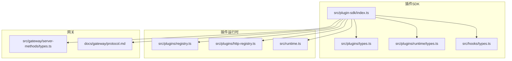
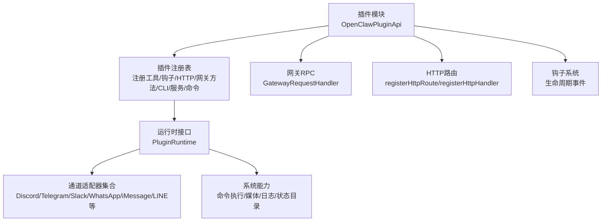
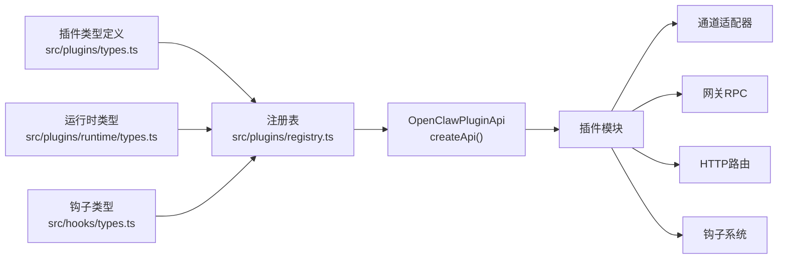

# 插件API参考

<cite>
**本文档引用的文件**
- [src/plugin-sdk/index.ts](file://src/plugin-sdk/index.ts)
- [src/plugins/types.ts](file://src/plugins/types.ts)
- [src/plugins/runtime/types.ts](file://src/plugins/runtime/types.ts)
- [src/runtime.ts](file://src/runtime.ts)
- [src/hooks/types.ts](file://src/hooks/types.ts)
- [src/plugins/registry.ts](file://src/plugins/registry.ts)
- [src/plugins/http-registry.ts](file://src/plugins/http-registry.ts)
- [src/gateway/server-methods/types.ts](file://src/gateway/server-methods/types.ts)
- [docs/plugins/manifest.md](file://docs/plugins/manifest.md)
- [docs/plugins/agent-tools.md](file://docs/plugins/agent-tools.md)
- [docs/plugins/voice-call.md](file://docs/plugins/voice-call.md)
- [docs/cli/plugins.md](file://docs/cli/plugins.md)
- [docs/gateway/protocol.md](file://docs/gateway/protocol.md)
- [docs/gateway/configuration-reference.md](file://docs/gateway/configuration-reference.md)
- [extensions/voice-call/openclaw.plugin.json](file://extensions/voice-call/openclaw.plugin.json)
- [extensions/memory-core/openclaw.plugin.json](file://extensions/memory-core/openclaw.plugin.json)
- [src/plugins/config-schema.ts](file://src/plugins/config-schema.ts)
</cite>

## 目录

1. [简介](#简介)
2. [项目结构](#项目结构)
3. [核心组件](#核心组件)
4. [架构总览](#架构总览)
5. [详细组件分析](#详细组件分析)
6. [依赖关系分析](#依赖关系分析)
7. [性能考虑](#性能考虑)
8. [故障排除指南](#故障排除指南)
9. [结论](#结论)
10. [附录](#附录)

## 简介

本参考文档面向OpenClaw插件开发者，系统性梳理插件API、钩子系统、运行时环境、通道适配器、网关RPC、HTTP路由、配置与状态存储、以及错误处理与日志等能力。文档基于仓库中的源码与官方文档，提供接口定义、数据模型、调用流程与最佳实践，帮助你快速构建稳定、可维护的插件。

## 项目结构

OpenClaw将插件能力集中在“插件SDK”与“插件运行时”两大模块，并通过“注册表”统一管理插件注册项（工具、钩子、HTTP路由、网关方法、CLI命令、服务等）。通道适配器与运行时工具通过统一的运行时接口暴露给插件使用；网关协议定义了客户端与网关之间的通信规范。

图表来源

- [src/plugin-sdk/index.ts](file://src/plugin-sdk/index.ts#L1-L392)
- [src/plugins/types.ts](file://src/plugins/types.ts#L1-L538)
- [src/plugins/runtime/types.ts](file://src/plugins/runtime/types.ts#L1-L363)
- [src/hooks/types.ts](file://src/hooks/types.ts#L1-L68)
- [src/plugins/registry.ts](file://src/plugins/registry.ts#L178-L515)
- [src/plugins/http-registry.ts](file://src/plugins/http-registry.ts#L1-L52)
- [src/runtime.ts](file://src/runtime.ts#L1-L25)
- [src/gateway/server-methods/types.ts](file://src/gateway/server-methods/types.ts#L1-L120)
- [docs/gateway/protocol.md](file://docs/gateway/protocol.md#L1-L222)

章节来源

- [src/plugin-sdk/index.ts](file://src/plugin-sdk/index.ts#L1-L392)
- [src/plugins/types.ts](file://src/plugins/types.ts#L1-L538)
- [src/plugins/runtime/types.ts](file://src/plugins/runtime/types.ts#L1-L363)
- [src/hooks/types.ts](file://src/hooks/types.ts#L1-L68)
- [src/plugins/registry.ts](file://src/plugins/registry.ts#L178-L515)
- [src/plugins/http-registry.ts](file://src/plugins/http-registry.ts#L1-L52)
- [src/runtime.ts](file://src/runtime.ts#L1-L25)
- [src/gateway/server-methods/types.ts](file://src/gateway/server-methods/types.ts#L1-L120)
- [docs/gateway/protocol.md](file://docs/gateway/protocol.md#L1-L222)

## 核心组件

- 插件API接口：由OpenClawPluginApi提供，包括工具注册、钩子注册、HTTP路由注册、通道注册、网关方法注册、CLI注册、服务注册、命令注册、路径解析与生命周期钩子等。
- 钩子系统：支持事件驱动的生命周期钩子，覆盖代理运行、消息收发、工具调用、会话、网关启停等阶段。
- 运行时环境：提供日志、系统命令执行、媒体处理、TTS、工具工厂、通道能力、状态目录解析等能力。
- 通道适配器：抽象各渠道（Discord、Telegram、Slack、WhatsApp、iMessage、LINE等）的账户、消息、动作、状态检查等能力。
- 网关通信：通过WebSocket协议与网关交互，支持RPC方法、事件广播、节点订阅、健康状态等。
- HTTP路由：插件可注册HTTP路由用于Webhook或内部服务端点。
- 配置与状态：插件清单与配置Schema要求严格校验；状态目录与会话元数据持久化；内存插件可替换默认内存实现。
- 错误处理与日志：统一的日志接口与诊断事件，便于定位问题与上报。

章节来源

- [src/plugins/types.ts](file://src/plugins/types.ts#L244-L283)
- [src/plugins/types.ts](file://src/plugins/types.ts#L298-L538)
- [src/plugins/runtime/types.ts](file://src/plugins/runtime/types.ts#L178-L362)
- [src/runtime.ts](file://src/runtime.ts#L4-L24)
- [src/gateway/server-methods/types.ts](file://src/gateway/server-methods/types.ts#L15-L119)
- [src/plugins/http-registry.ts](file://src/plugins/http-registry.ts#L11-L51)
- [docs/plugins/manifest.md](file://docs/plugins/manifest.md#L1-L72)
- [src/plugins/config-schema.ts](file://src/plugins/config-schema.ts#L1-L34)

## 架构总览

下图展示插件在OpenClaw中的位置与交互关系：插件通过OpenClawPluginApi注册能力；运行时提供统一工具集；通道适配器桥接多平台；网关提供RPC与事件总线；HTTP路由用于外部接入。

图表来源

- [src/plugins/registry.ts](file://src/plugins/registry.ts#L468-L515)
- [src/plugins/runtime/types.ts](file://src/plugins/runtime/types.ts#L178-L362)
- [src/gateway/server-methods/types.ts](file://src/gateway/server-methods/types.ts#L108-L119)
- [src/plugins/http-registry.ts](file://src/plugins/http-registry.ts#L11-L51)
- [src/hooks/types.ts](file://src/hooks/types.ts#L35-L67)

章节来源

- [src/plugins/registry.ts](file://src/plugins/registry.ts#L468-L515)
- [src/plugins/runtime/types.ts](file://src/plugins/runtime/types.ts#L178-L362)
- [src/gateway/server-methods/types.ts](file://src/gateway/server-methods/types.ts#L108-L119)
- [src/plugins/http-registry.ts](file://src/plugins/http-registry.ts#L11-L51)
- [src/hooks/types.ts](file://src/hooks/types.ts#L35-L67)

## 详细组件分析

### 插件API接口与方法签名

OpenClawPluginApi是插件开发的核心入口，提供以下能力：

- 工具注册：registerTool，支持工厂函数与直接工具定义，可标记为可选。
- 钩子注册：registerHook与on，分别用于通用钩子与类型化生命周期钩子。
- HTTP路由：registerHttpRoute与registerHttpHandler，支持Webhook与内部路由。
- 通道注册：registerChannel，注入ChannelPlugin与可选的ChannelDock。
- 网关方法：registerGatewayMethod，注册RPC方法处理器。
- CLI注册：registerCli，向CLI注册命令与子程序。
- 服务注册：registerService，启动/停止服务。
- 命令注册：registerCommand，注册绕过LLM的简单命令。
- 路径解析：resolvePath，解析用户路径。
- 生命周期钩子：on，按名称注册类型化钩子，支持优先级。

章节来源

- [src/plugins/types.ts](file://src/plugins/types.ts#L244-L283)
- [src/plugins/registry.ts](file://src/plugins/registry.ts#L468-L515)

### 钩子系统与事件类型

钩子系统支持如下事件类型与上下文：

- 代理生命周期：before_agent_start、agent_end
- 消息流：message_received、message_sending、message_sent
- 工具调用：before_tool_call、after_tool_call、tool_result_persist
- 会话：session_start、session_end
- 网关：gateway_start、gateway_stop
- 内容压缩：before_compaction、after_compaction

每个事件携带对应的上下文对象（如Agent、Message、Tool、Session、Gateway），部分事件允许修改结果（如message_sending可取消或修改内容；tool_result_persist可修改写入的消息）。

章节来源

- [src/plugins/types.ts](file://src/plugins/types.ts#L298-L538)
- [src/hooks/types.ts](file://src/hooks/types.ts#L1-L68)

### 运行时环境与内置工具

运行时环境提供以下能力：

- 日志：getChildLogger、shouldLogVerbose
- 配置：loadConfig、writeConfigFile
- 系统：enqueueSystemEvent、runCommandWithTimeout、格式化原生依赖提示
- 媒体：loadWebMedia、detectMime、媒体类型判定、语音兼容性、图像元数据、缩放
- TTS：电话场景TTS
- 工具：内存检索/搜索工具、内存CLI注册
- 通道：文本分块、回复派发、路由、配对、媒体抓取与保存、活动记录、会话元数据、提及匹配、反应确认、群组策略、入站防抖、命令授权、各平台消息发送与探测
- 状态：resolveStateDir

章节来源

- [src/plugins/runtime/types.ts](file://src/plugins/runtime/types.ts#L171-L362)
- [src/runtime.ts](file://src/runtime.ts#L4-L24)

### 通道适配器与账户管理

通道适配器为各渠道提供统一接口，包括：

- 账户解析：resolveDefault<Channel>AccountId、resolve<Channel>Account、list<Channel>AccountIds
- 规范化：normalize<Channel>MessagingTarget
- 探测与审计：probe<Channel>、audit<Channel>（如Telegram群组成员）
- 状态检查：collect<Channel>StatusIssues
- Onboarding适配器：discord、telegram、slack、whatsapp、imessage等
- 消息动作：Discord/Telegram/Signal等消息动作封装

章节来源

- [src/plugin-sdk/index.ts](file://src/plugin-sdk/index.ts#L269-L392)

### 网关通信与RPC

- WebSocket协议：握手、帧格式（req/res/event）、角色与作用域、设备身份与配对、TLS与证书指纹、版本协商。
- RPC方法：通过GatewayRequestHandler注册，结合GatewayRequestContext进行广播、节点订阅、会话管理、健康状态等操作。
- 协议生成：基于TypeBox定义的Schema生成模型与校验。

章节来源

- [docs/gateway/protocol.md](file://docs/gateway/protocol.md#L1-L222)
- [src/gateway/server-methods/types.ts](file://src/gateway/server-methods/types.ts#L15-L119)

### HTTP路由与Webhook

- registerHttpRoute：注册插件HTTP路由，自动规范化路径，避免重复注册。
- registerHttpHandler：注册通用HTTP处理器。
- 典型用途：Webhook接收、内部服务端点、静态资源服务。

章节来源

- [src/plugins/http-registry.ts](file://src/plugins/http-registry.ts#L11-L51)
- [src/plugins/types.ts](file://src/plugins/types.ts#L192-L200)

### 插件配置管理与状态存储

- 清单与Schema：openclaw.plugin.json必须包含id与configSchema；Schema在配置读写时严格校验。
- 空Schema：emptyPluginConfigSchema提供空对象校验模板。
- 状态目录：resolveStateDir用于确定插件状态文件存放位置。
- 会话元数据：recordSessionMetaFromInbound、recordInboundSession、updateLastRoute等。
- 内存插件：kind为memory的插件可替换默认内存实现（如memory-core）。

章节来源

- [docs/plugins/manifest.md](file://docs/plugins/manifest.md#L1-L72)
- [src/plugins/config-schema.ts](file://src/plugins/config-schema.ts#L13-L33)
- [src/plugins/runtime/types.ts](file://src/plugins/runtime/types.ts#L359-L361)
- [src/plugin-sdk/index.ts](file://src/plugin-sdk/index.ts#L189-L189)
- [extensions/memory-core/openclaw.plugin.json](file://extensions/memory-core/openclaw.plugin.json#L1-L10)

### 代理工具与可选工具

- 工具注册：registerTool支持工厂函数与直接定义，可声明为可选。
- 可选工具：需在代理工具允许列表中显式启用。
- 策略控制：工具允许/拒绝列表、按提供者分组、沙箱策略等。

章节来源

- [docs/plugins/agent-tools.md](file://docs/plugins/agent-tools.md#L1-L100)
- [src/plugins/types.ts](file://src/plugins/types.ts#L68-L76)

### 语音通话插件示例

- 安装与配置：支持twilio、telnyx、plivo、mock四种提供方；可配置公网URL、隧道、签名安全、TTS覆盖、入站策略等。
- CLI与RPC：提供命令行与网关RPC方法（initiate/continue/speak/end/status）。
- Webhook安全：支持受信主机白名单、转发头信任策略、代理IP白名单。

章节来源

- [docs/plugins/voice-call.md](file://docs/plugins/voice-call.md#L1-L285)
- [extensions/voice-call/openclaw.plugin.json](file://extensions/voice-call/openclaw.plugin.json#L1-L560)

### CLI插件管理

- 支持命令：list、info、enable、disable、uninstall、doctor、update。
- 安全建议：插件安装如同运行代码，建议固定版本；支持本地链接安装。
- 更新策略：仅对npm安装的插件生效。

章节来源

- [docs/cli/plugins.md](file://docs/cli/plugins.md#L1-L82)

## 依赖关系分析

插件API与运行时、注册表、通道适配器、网关RPC之间存在清晰的依赖关系：

图表来源

- [src/plugins/types.ts](file://src/plugins/types.ts#L1-L538)
- [src/plugins/runtime/types.ts](file://src/plugins/runtime/types.ts#L1-L363)
- [src/hooks/types.ts](file://src/hooks/types.ts#L1-L68)
- [src/plugins/registry.ts](file://src/plugins/registry.ts#L468-L515)

章节来源

- [src/plugins/types.ts](file://src/plugins/types.ts#L1-L538)
- [src/plugins/runtime/types.ts](file://src/plugins/runtime/types.ts#L1-L363)
- [src/hooks/types.ts](file://src/hooks/types.ts#L1-L68)
- [src/plugins/registry.ts](file://src/plugins/registry.ts#L468-L515)

## 性能考虑

- 钩子并发：部分钩子（如session_end、gateway_start/stop）采用并行触发，注意避免阻塞。
- 文本分块与Markdown表格：合理设置分块模式与表格渲染策略，减少大消息传输成本。
- 媒体处理：使用异步加载与MIME检测，避免阻塞主线程。
- 会话与历史：合理设置历史限制与压缩策略，降低上下文大小。
- 网关广播：批量广播时可选择丢弃慢消息选项，平衡实时性与吞吐。

## 故障排除指南

- 插件清单缺失或Schema无效：导致插件无法加载，需修复openclaw.plugin.json与configSchema。
- HTTP路由冲突：同一路径重复注册会被忽略并记录警告。
- 钩子加载失败：插件钩子导出非函数或未声明事件，将被跳过并记录告警。
- 网关方法冲突：与核心方法同名将报错。
- Webhook签名验证失败：检查受信主机白名单、转发头信任策略与代理IP白名单。
- CLI插件管理：doctor命令可用于诊断插件加载问题；uninstall可保留文件以便复用。

章节来源

- [docs/plugins/manifest.md](file://docs/plugins/manifest.md#L53-L63)
- [src/plugins/http-registry.ts](file://src/plugins/http-registry.ts#L32-L36)
- [src/hooks/plugin-hooks.ts](file://src/hooks/plugin-hooks.ts#L91-L113)
- [src/plugins/registry.ts](file://src/plugins/registry.ts#L265-L285)
- [docs/plugins/voice-call.md](file://docs/plugins/voice-call.md#L120-L150)
- [docs/cli/plugins.md](file://docs/cli/plugins.md#L27-L37)

## 结论

OpenClaw插件体系通过统一的API、严格的配置Schema、完善的运行时工具与通道适配器，为开发者提供了强大的扩展能力。遵循本文档的接口定义、事件模型与最佳实践，可快速构建高质量的插件，实现从消息通道到网关RPC、从HTTP路由到钩子事件的全链路集成。

## 附录

### 插件API方法速查

- 注册工具：registerTool(tool, opts?)
- 注册钩子：registerHook(events, handler, opts?)、on(hookName, handler, opts?)
- 注册HTTP：registerHttpRoute({path, handler})、registerHttpHandler(handler)
- 注册通道：registerChannel(registration|ChannelPlugin)
- 注册网关方法：registerGatewayMethod(method, handler)
- 注册CLI：registerCli(registrar, opts?)
- 注册服务：registerService(service)
- 注册命令：registerCommand(command)
- 路径解析：resolvePath(input)
- 生命周期钩子：on(hookName, handler, {priority?})

章节来源

- [src/plugins/types.ts](file://src/plugins/types.ts#L244-L283)
- [src/plugins/registry.ts](file://src/plugins/registry.ts#L468-L515)

### 钩子事件一览

- 代理：before_agent_start、agent_end
- 消息：message_received、message_sending、message_sent
- 工具：before_tool_call、after_tool_call、tool_result_persist
- 会话：session_start、session_end
- 网关：gateway_start、gateway_stop
- 压缩：before_compaction、after_compaction

章节来源

- [src/plugins/types.ts](file://src/plugins/types.ts#L298-L538)

### 运行时能力分类

- 日志：getChildLogger、shouldLogVerbose
- 配置：loadConfig、writeConfigFile
- 系统：enqueueSystemEvent、runCommandWithTimeout、格式化原生依赖提示
- 媒体：loadWebMedia、detectMime、媒体类型判定、语音兼容、图像元数据、缩放
- TTS：电话场景TTS
- 工具：内存检索/搜索、内存CLI
- 通道：文本分块、回复派发、路由、配对、媒体抓取/保存、活动记录、会话元数据、提及匹配、反应确认、群组策略、入站防抖、命令授权
- 状态：resolveStateDir

章节来源

- [src/plugins/runtime/types.ts](file://src/plugins/runtime/types.ts#L178-L362)

### 网关协议要点

- 帧格式：req/res/event
- 角色与作用域：operator/node
- 设备身份与配对：nonce签名、设备令牌
- 版本协商：最小/最大协议版本
- TLS与证书指纹：可选证书固定

章节来源

- [docs/gateway/protocol.md](file://docs/gateway/protocol.md#L127-L222)
