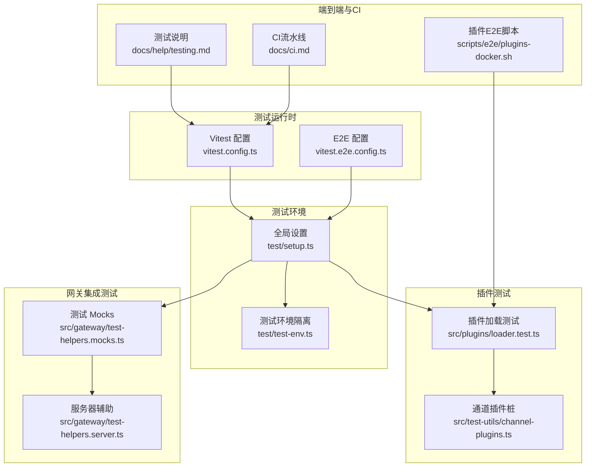
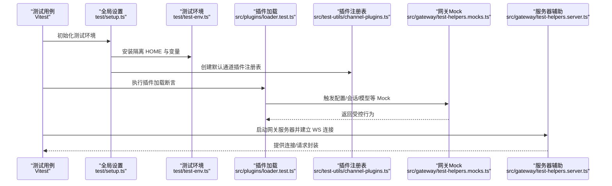
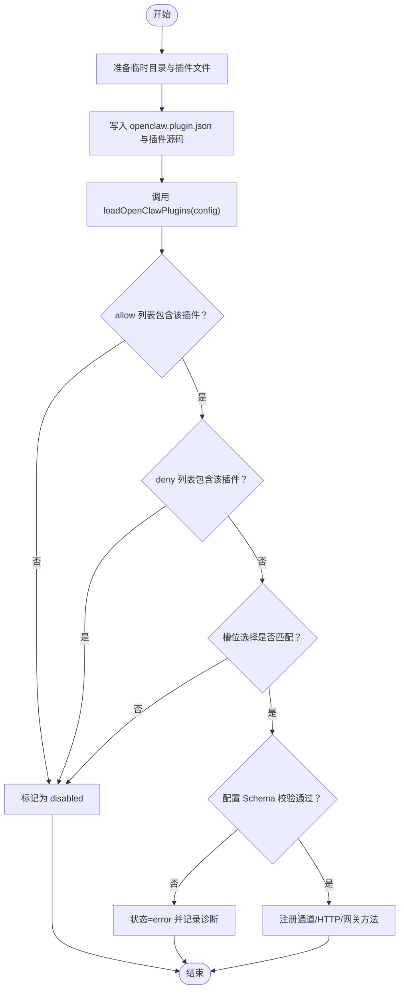
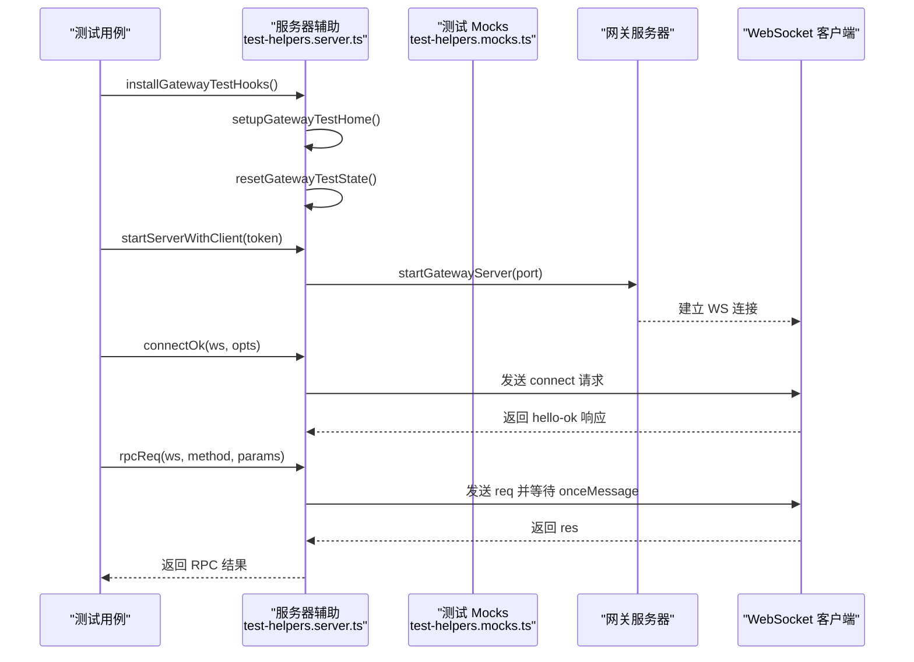
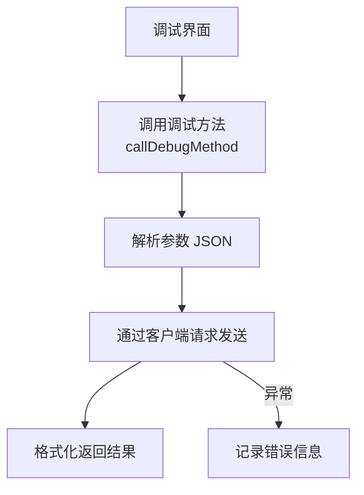
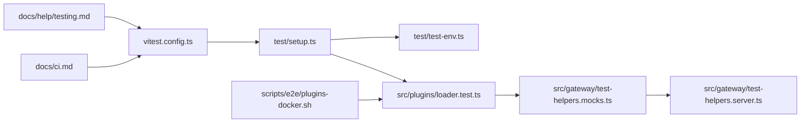

# 插件测试与调试API

<cite>
**本文引用的文件**
- [vitest.config.ts](file://vitest.config.ts)
- [vitest.e2e.config.ts](file://vitest.e2e.config.ts)
- [test/setup.ts](file://test/setup.ts)
- [test/test-env.ts](file://test/test-env.ts)
- [src/plugins/loader.test.ts](file://src/plugins/loader.test.ts)
- [src/test-utils/channel-plugins.ts](file://src/test-utils/channel-plugins.ts)
- [src/gateway/test-helpers.mocks.ts](file://src/gateway/test-helpers.mocks.ts)
- [src/gateway/test-helpers.server.ts](file://src/gateway/test-helpers.server.ts)
- [scripts/e2e/plugins-docker.sh](file://scripts/e2e/plugins-docker.sh)
- [docs/help/testing.md](file://docs/help/testing.md)
- [docs/ci.md](file://docs/ci.md)
- [src/infra/diagnostic-flags.ts](file://src/infra/diagnostic-flags.ts)
- [ui/src/ui/controllers/debug.ts](file://ui/src/ui/controllers/debug.ts)
- [apps/macos/Sources/OpenClaw/MenuContentView.swift](file://apps/macos/Sources/OpenClaw/MenuContentView.swift)
</cite>

## 目录

1. [简介](#简介)
2. [项目结构](#项目结构)
3. [核心组件](#核心组件)
4. [架构总览](#架构总览)
5. [详细组件分析](#详细组件分析)
6. [依赖关系分析](#依赖关系分析)
7. [性能考量](#性能考量)
8. [故障排查指南](#故障排查指南)
9. [结论](#结论)
10. [附录](#附录)

## 简介

本文件为 OpenClaw 插件测试与调试 API 的完整参考文档，覆盖单元测试、集成测试与端到端测试的测试框架与调试工具，涵盖插件模拟环境搭建（依赖注入、Mock 对象、测试数据准备）、调试工具（日志、断点、性能分析）、发布前质量保证流程与自动化策略，以及常见问题排查与故障诊断技巧。内容以仓库现有实现为依据，确保可操作性与一致性。

## 项目结构

OpenClaw 在测试与调试方面采用分层设计：

- 测试运行时：基于 Vitest，通过统一配置控制超时、并发、覆盖率与排除范围。
- 单元测试：隔离业务模块，使用 Mock 与测试注册表。
- 集成测试：在网关服务器上下文中验证插件加载、路由与协议交互。
- 端到端测试：通过 CLI 或脚本验证插件清单与能力导出。
- 调试工具：前端 UI 调试控制器、日志开关、诊断标志位与平台级日志菜单。

**图表来源**

- [vitest.config.ts](file://vitest.config.ts#L12-L103)
- [vitest.e2e.config.ts](file://vitest.e2e.config.ts#L12-L19)
- [test/setup.ts](file://test/setup.ts#L1-L169)
- [test/test-env.ts](file://test/test-env.ts#L54-L143)
- [src/plugins/loader.test.ts](file://src/plugins/loader.test.ts#L1-L484)
- [src/test-utils/channel-plugins.ts](file://src/test-utils/channel-plugins.ts#L1-L105)
- [src/gateway/test-helpers.mocks.ts](file://src/gateway/test-helpers.mocks.ts#L1-L606)
- [src/gateway/test-helpers.server.ts](file://src/gateway/test-helpers.server.ts#L1-L538)
- [scripts/e2e/plugins-docker.sh](file://scripts/e2e/plugins-docker.sh#L51-L80)
- [docs/help/testing.md](file://docs/help/testing.md#L330-L358)
- [docs/ci.md](file://docs/ci.md#L1-L25)

**章节来源**

- [vitest.config.ts](file://vitest.config.ts#L12-L103)
- [vitest.e2e.config.ts](file://vitest.e2e.config.ts#L12-L19)
- [test/setup.ts](file://test/setup.ts#L1-L169)
- [test/test-env.ts](file://test/test-env.ts#L54-L143)

## 核心组件

- 测试运行时配置：统一超时、并发、覆盖率阈值与排除路径，支持别名映射至插件 SDK。
- 全局测试设置：安装警告过滤器、隔离 HOME、创建默认通道插件注册表、重置假定时器。
- 插件加载测试：验证插件启用/禁用、槽位选择、HTTP 路由与处理器注册、错误处理等。
- 网关测试辅助：集中式 Mock（配置读写、会话存储、模型发现、嵌入式运行等）、服务器生命周期钩子、WebSocket 连接与 RPC 请求封装。
- 端到端脚本：通过 CLI 输出插件清单并断言工具、网关方法、CLI 命令与服务存在性。
- 调试工具：前端调试控制器（RPC 调用）、日志开关（应用菜单）、诊断标志位匹配。

**章节来源**

- [vitest.config.ts](file://vitest.config.ts#L12-L103)
- [test/setup.ts](file://test/setup.ts#L1-L169)
- [src/plugins/loader.test.ts](file://src/plugins/loader.test.ts#L61-L484)
- [src/gateway/test-helpers.mocks.ts](file://src/gateway/test-helpers.mocks.ts#L148-L193)
- [src/gateway/test-helpers.server.ts](file://src/gateway/test-helpers.server.ts#L210-L237)
- [scripts/e2e/plugins-docker.sh](file://scripts/e2e/plugins-docker.sh#L51-L80)
- [ui/src/ui/controllers/debug.ts](file://ui/src/ui/controllers/debug.ts#L45-L60)
- [apps/macos/Sources/OpenClaw/MenuContentView.swift](file://apps/macos/Sources/OpenClaw/MenuContentView.swift#L255-L285)

## 架构总览

下图展示从测试入口到插件加载与网关交互的关键路径，以及 Mock 与测试数据准备如何协同工作。

**图表来源**

- [test/setup.ts](file://test/setup.ts#L1-L169)
- [test/test-env.ts](file://test/test-env.ts#L54-L143)
- [src/plugins/loader.test.ts](file://src/plugins/loader.test.ts#L1-L484)
- [src/test-utils/channel-plugins.ts](file://src/test-utils/channel-plugins.ts#L1-L105)
- [src/gateway/test-helpers.mocks.ts](file://src/gateway/test-helpers.mocks.ts#L1-L606)
- [src/gateway/test-helpers.server.ts](file://src/gateway/test-helpers.server.ts#L286-L360)

## 详细组件分析

### 组件A：插件加载与注册测试

- 目标：验证插件加载器对允许/拒绝列表、槽位选择、配置校验、HTTP 路由与处理器注册的行为。
- 关键点：
  - 默认禁用内置插件，显式启用后才加载。
  - 槽位选择仅加载被选中插件，其余禁用。
  - 配置错误导致状态为 error 并产生诊断信息。
  - 注册通道插件、HTTP 处理器与路由，并统计处理器数量。
- 流程图（算法实现）：

**图表来源**

- [src/plugins/loader.test.ts](file://src/plugins/loader.test.ts#L61-L484)

**章节来源**

- [src/plugins/loader.test.ts](file://src/plugins/loader.test.ts#L61-L484)

### 组件B：网关服务器与客户端测试辅助

- 目标：在真实网关服务器上下文中进行集成测试，提供稳定的配置根、会话存储、设备身份与协议握手。
- 关键点：
  - 预加载服务器模块一次，避免重复初始化。
  - 设置测试 HOME 与配置路径，屏蔽真实环境变量。
  - 提供一次性消息等待、连接请求、RPC 请求与系统事件等待。
  - 通过 Mock 控制配置读写、会话保存延迟、模型发现与嵌入式运行。
- 序列图（函数调用链）：

**图表来源**

- [src/gateway/test-helpers.server.ts](file://src/gateway/test-helpers.server.ts#L286-L360)
- [src/gateway/test-helpers.server.ts](file://src/gateway/test-helpers.server.ts#L370-L496)
- [src/gateway/test-helpers.server.ts](file://src/gateway/test-helpers.server.ts#L498-L524)
- [src/gateway/test-helpers.mocks.ts](file://src/gateway/test-helpers.mocks.ts#L288-L532)

**章节来源**

- [src/gateway/test-helpers.server.ts](file://src/gateway/test-helpers.server.ts#L210-L237)
- [src/gateway/test-helpers.server.ts](file://src/gateway/test-helpers.server.ts#L286-L360)
- [src/gateway/test-helpers.server.ts](file://src/gateway/test-helpers.server.ts#L370-L496)
- [src/gateway/test-helpers.server.ts](file://src/gateway/test-helpers.server.ts#L498-L524)
- [src/gateway/test-helpers.mocks.ts](file://src/gateway/test-helpers.mocks.ts#L288-L532)

### 组件C：调试工具与日志

- 前端调试控制器：支持向客户端发送任意调试方法请求，解析参数与结果，捕获错误。
- 应用日志菜单：提供切换详细日志、调整日志级别、开启文件日志与打开会话存储等功能。
- 诊断标志位：支持通配符匹配与前缀匹配，用于启用特定诊断通道或子系统。

**图表来源**

- [ui/src/ui/controllers/debug.ts](file://ui/src/ui/controllers/debug.ts#L45-L60)

**章节来源**

- [ui/src/ui/controllers/debug.ts](file://ui/src/ui/controllers/debug.ts#L45-L60)
- [apps/macos/Sources/OpenClaw/MenuContentView.swift](file://apps/macos/Sources/OpenClaw/MenuContentView.swift#L255-L285)
- [src/infra/diagnostic-flags.ts](file://src/infra/diagnostic-flags.ts#L53-L92)

## 依赖关系分析

- 测试配置与运行时耦合：Vitest 配置决定测试超时、并发与覆盖率策略；E2E 配置独立于单元测试。
- 全局设置与环境隔离：setup.ts 依赖 test-env.ts 进行 HOME 与 XDG 目录隔离，避免污染真实状态。
- 插件测试与网关测试：loader.test.ts 通过 test-helpers.mocks.ts 的 Mock 控制配置与会话行为；集成测试通过 test-helpers.server.ts 提供服务器与 WS 交互。
- 端到端脚本：plugins-docker.sh 依赖 CLI 输出插件清单并断言能力。

**图表来源**

- [vitest.config.ts](file://vitest.config.ts#L12-L103)
- [test/setup.ts](file://test/setup.ts#L1-L169)
- [test/test-env.ts](file://test/test-env.ts#L54-L143)
- [src/plugins/loader.test.ts](file://src/plugins/loader.test.ts#L1-L484)
- [src/gateway/test-helpers.mocks.ts](file://src/gateway/test-helpers.mocks.ts#L1-L606)
- [src/gateway/test-helpers.server.ts](file://src/gateway/test-helpers.server.ts#L1-L538)
- [scripts/e2e/plugins-docker.sh](file://scripts/e2e/plugins-docker.sh#L51-L80)
- [docs/help/testing.md](file://docs/help/testing.md#L330-L358)
- [docs/ci.md](file://docs/ci.md#L1-L25)

**章节来源**

- [vitest.config.ts](file://vitest.config.ts#L12-L103)
- [test/setup.ts](file://test/setup.ts#L1-L169)
- [src/plugins/loader.test.ts](file://src/plugins/loader.test.ts#L1-L484)
- [src/gateway/test-helpers.mocks.ts](file://src/gateway/test-helpers.mocks.ts#L1-L606)
- [src/gateway/test-helpers.server.ts](file://src/gateway/test-helpers.server.ts#L1-L538)
- [scripts/e2e/plugins-docker.sh](file://scripts/e2e/plugins-docker.sh#L51-L80)
- [docs/help/testing.md](file://docs/help/testing.md#L330-L358)
- [docs/ci.md](file://docs/ci.md#L1-L25)

## 性能考量

- 并发与超时：根据 CI/本地环境动态设置 worker 数量与测试/钩子超时，降低长任务阻塞风险。
- 排除与覆盖率：通过排除入口、桥接与 UI 层面，聚焦核心逻辑覆盖率，平衡成本与收益。
- E2E 并发：E2E 使用较小并发数，避免资源争用与容器/网络限制。
- 会话存储延迟：可通过测试辅助设置保存延迟，模拟真实写入开销。

**章节来源**

- [vitest.config.ts](file://vitest.config.ts#L7-L23)
- [vitest.config.ts](file://vitest.config.ts#L35-L101)
- [vitest.e2e.config.ts](file://vitest.e2e.config.ts#L5-L19)
- [src/gateway/test-helpers.mocks.ts](file://src/gateway/test-helpers.mocks.ts#L273-L286)

## 故障排查指南

- 插件未加载或状态为 error
  - 检查 allow/deny 列表与槽位配置。
  - 校验 openclaw.plugin.json 与配置 Schema 是否正确。
  - 查看诊断输出中的错误信息。
- 网关连接失败或超时
  - 确认端口占用与重试机制。
  - 校验 OPENCLAW_GATEWAY_TOKEN/密码与角色权限。
  - 使用 onceMessage/rpcReq 明确响应类型与错误码。
- 端到端断言失败
  - 使用 scripts/e2e/plugins-docker.sh 输出插件清单并逐项比对工具、网关方法、CLI 命令与服务。
- 日志与调试
  - 前端调试控制器可直接发起任意调试方法请求。
  - macOS 应用菜单支持切换详细日志、文件日志与打开会话存储。
  - 诊断标志位支持通配符匹配，便于按模块启用诊断。

**章节来源**

- [src/plugins/loader.test.ts](file://src/plugins/loader.test.ts#L258-L283)
- [src/gateway/test-helpers.server.ts](file://src/gateway/test-helpers.server.ts#L314-L360)
- [src/gateway/test-helpers.server.ts](file://src/gateway/test-helpers.server.ts#L498-L524)
- [scripts/e2e/plugins-docker.sh](file://scripts/e2e/plugins-docker.sh#L51-L80)
- [ui/src/ui/controllers/debug.ts](file://ui/src/ui/controllers/debug.ts#L45-L60)
- [apps/macos/Sources/OpenClaw/MenuContentView.swift](file://apps/macos/Sources/OpenClaw/MenuContentView.swift#L255-L285)
- [src/infra/diagnostic-flags.ts](file://src/infra/diagnostic-flags.ts#L53-L92)

## 结论

OpenClaw 的测试与调试体系以 Vitest 为核心，结合 Mock 与测试辅助，覆盖从单元到端到端的全链路验证。通过严格的环境隔离、可控的服务器上下文与丰富的调试工具，开发者可以高效地构建、验证与排错插件。建议在新增插件时优先补充单元与集成测试，并在 CI 中执行端到端脚本，确保发布前质量。

## 附录

- 自动化测试策略
  - 单元测试：聚焦插件加载、注册与配置校验。
  - 集成测试：在网关服务器上下文中验证协议交互与会话行为。
  - 端到端测试：通过 CLI 输出与脚本断言插件能力清单。
- CI 流水线要点
  - 按变更范围智能跳过昂贵作业，优先执行检查与测试。
  - Windows 与非 Windows 的 worker 数量差异化配置。

**章节来源**

- [docs/help/testing.md](file://docs/help/testing.md#L330-L358)
- [docs/ci.md](file://docs/ci.md#L1-L25)
