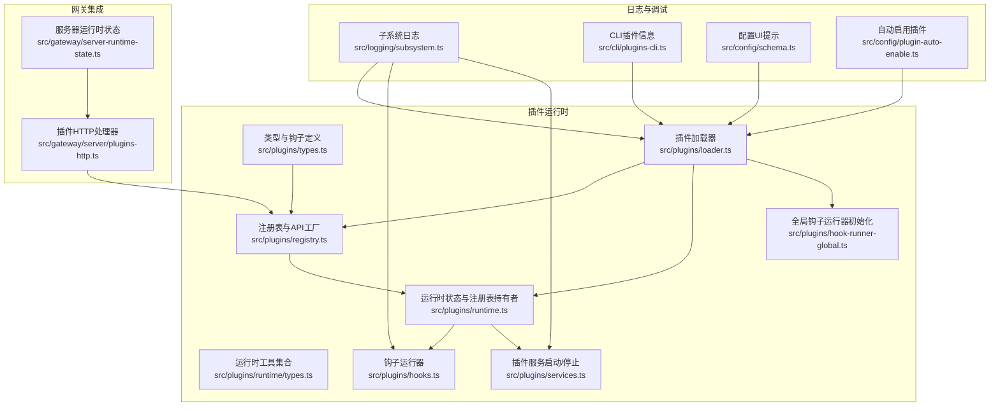
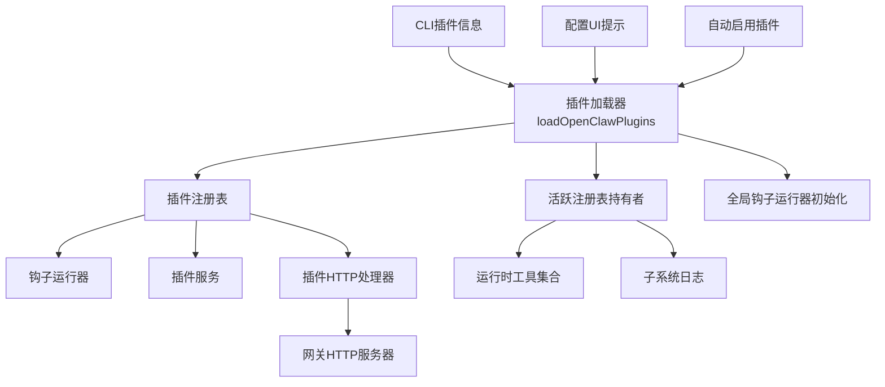
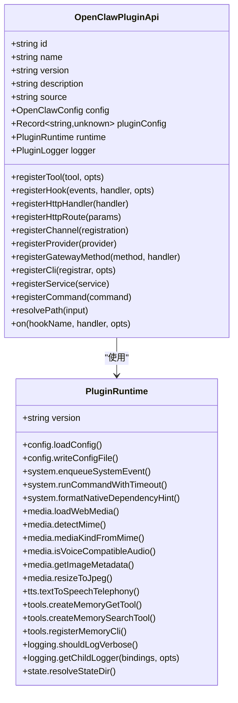
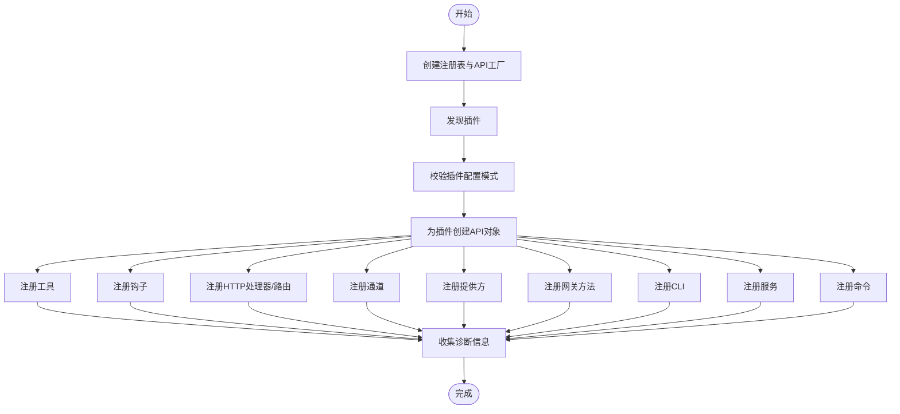
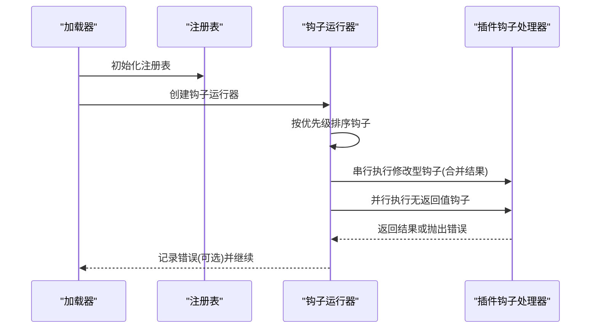
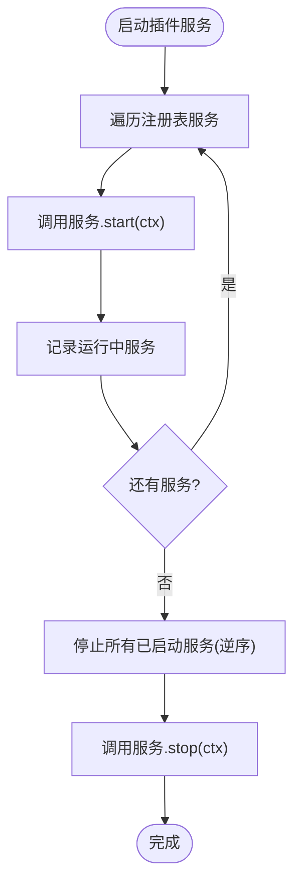
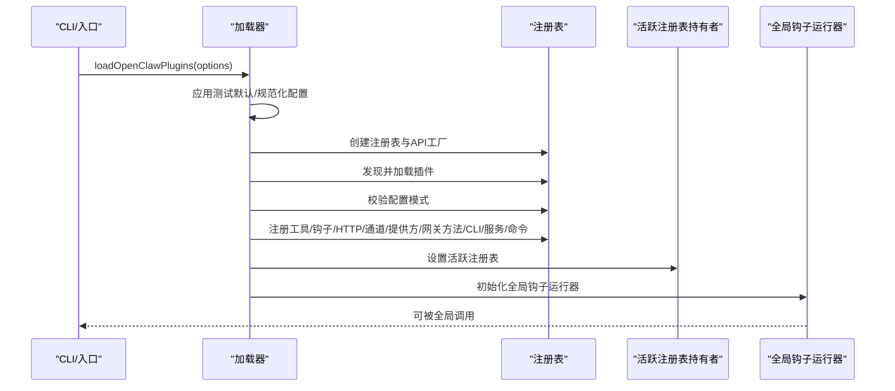
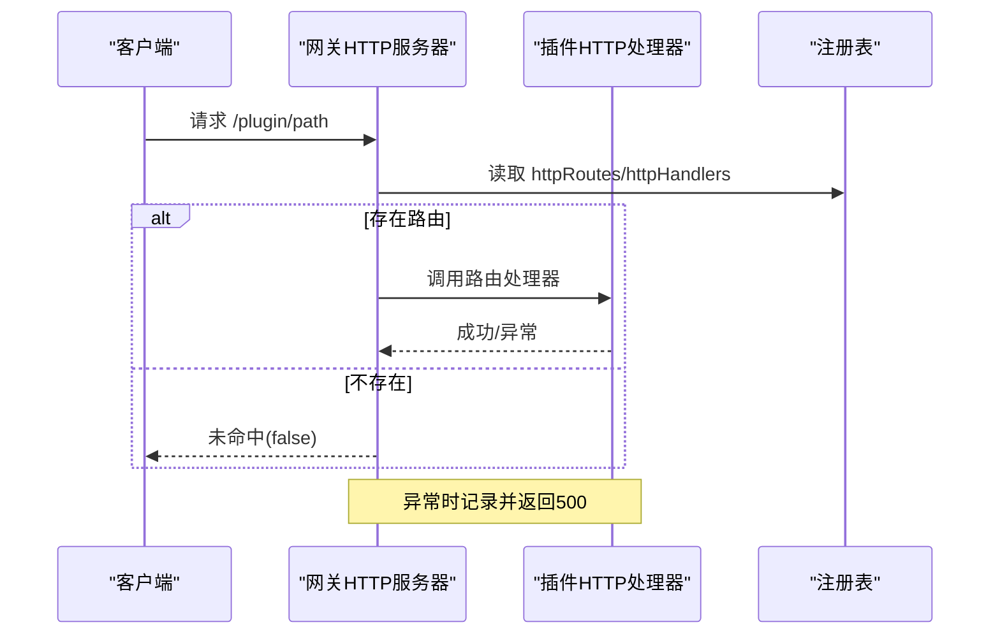
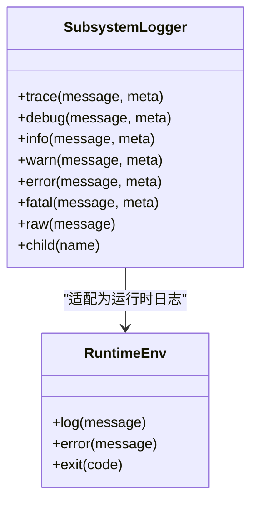
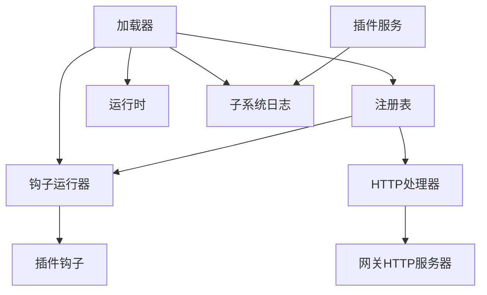

# 插件运行时API

<cite>
**本文引用的文件**
- [src/plugins/types.ts](file://src/plugins/types.ts)
- [src/plugins/registry.ts](file://src/plugins/registry.ts)
- [src/plugins/runtime.ts](file://src/plugins/runtime.ts)
- [src/plugins/runtime/types.ts](file://src/plugins/runtime/types.ts)
- [src/plugins/hooks.ts](file://src/plugins/hooks.ts)
- [src/plugins/hook-runner-global.ts](file://src/plugins/hook-runner-global.ts)
- [src/plugins/services.ts](file://src/plugins/services.ts)
- [src/plugins/loader.ts](file://src/plugins/loader.ts)
- [src/gateway/server/plugins-http.ts](file://src/gateway/server/plugins-http.ts)
- [src/gateway/server-runtime-state.ts](file://src/gateway/server-runtime-state.ts)
- [src/logging/subsystem.ts](file://src/logging/subsystem.ts)
- [src/cli/plugins-cli.ts](file://src/cli/plugins-cli.ts)
- [src/config/schema.ts](file://src/config/schema.ts)
- [src/config/plugin-auto-enable.ts](file://src/config/plugin-auto-enable.ts)
- [extensions/tlon/src/runtime.ts](file://extensions/tlon/src/runtime.ts)
</cite>

## 目录

1. [简介](#简介)
2. [项目结构](#项目结构)
3. [核心组件](#核心组件)
4. [架构总览](#架构总览)
5. [详细组件分析](#详细组件分析)
6. [依赖关系分析](#依赖关系分析)
7. [性能考量](#性能考量)
8. [故障排查指南](#故障排查指南)
9. [结论](#结论)
10. [附录](#附录)

## 简介

本文件为 OpenClaw 插件运行时 API 的完整参考文档。内容覆盖插件运行时环境提供的全局对象、内置服务与工具函数；深入解释插件生命周期管理、状态存储与内存管理机制；记录插件与网关通信的 API 接口、事件监听与广播机制；并提供插件配置管理、日志记录与调试接口的详细说明，以及错误处理、异常捕获与恢复策略的 API 文档。

## 项目结构

围绕插件运行时的核心模块包括：

- 类型与注册表：定义插件 API、钩子类型、注册表结构与注册流程
- 运行时与全局状态：维护当前活跃的插件注册表、提供运行时工具集
- 钩子系统：统一的生命周期钩子执行器，支持优先级与错误隔离
- 服务管理：启动/停止插件服务（如持久化、后台任务）
- 加载器：发现、验证、加载插件并构建注册表
- 网关集成：HTTP 路由与请求处理器、全局钩子运行器
- 日志与调试：子系统日志、CLI 插件信息展示、配置 UI 提示

图表来源

- [src/plugins/types.ts](file://src/plugins/types.ts#L1-L538)
- [src/plugins/registry.ts](file://src/plugins/registry.ts#L1-L516)
- [src/plugins/runtime.ts](file://src/plugins/runtime.ts#L1-L58)
- [src/plugins/runtime/types.ts](file://src/plugins/runtime/types.ts#L1-L363)
- [src/plugins/hooks.ts](file://src/plugins/hooks.ts#L1-L471)
- [src/plugins/hook-runner-global.ts](file://src/plugins/hook-runner-global.ts#L1-L52)
- [src/plugins/services.ts](file://src/plugins/services.ts#L1-L73)
- [src/plugins/loader.ts](file://src/plugins/loader.ts#L1-L457)
- [src/gateway/server/plugins-http.ts](file://src/gateway/server/plugins-http.ts#L1-L41)
- [src/gateway/server-runtime-state.ts](file://src/gateway/server-runtime-state.ts#L110-L124)
- [src/logging/subsystem.ts](file://src/logging/subsystem.ts#L229-L318)
- [src/cli/plugins-cli.ts](file://src/cli/plugins-cli.ts#L30-L82)
- [src/config/schema.ts](file://src/config/schema.ts#L91-L132)
- [src/config/plugin-auto-enable.ts](file://src/config/plugin-auto-enable.ts#L309-L357)

章节来源

- [src/plugins/types.ts](file://src/plugins/types.ts#L1-L538)
- [src/plugins/registry.ts](file://src/plugins/registry.ts#L1-L516)
- [src/plugins/runtime.ts](file://src/plugins/runtime.ts#L1-L58)
- [src/plugins/runtime/types.ts](file://src/plugins/runtime/types.ts#L1-L363)
- [src/plugins/hooks.ts](file://src/plugins/hooks.ts#L1-L471)
- [src/plugins/hook-runner-global.ts](file://src/plugins/hook-runner-global.ts#L1-L52)
- [src/plugins/services.ts](file://src/plugins/services.ts#L1-L73)
- [src/plugins/loader.ts](file://src/plugins/loader.ts#L1-L457)
- [src/gateway/server/plugins-http.ts](file://src/gateway/server/plugins-http.ts#L1-L41)
- [src/gateway/server-runtime-state.ts](file://src/gateway/server-runtime-state.ts#L110-L124)
- [src/logging/subsystem.ts](file://src/logging/subsystem.ts#L229-L318)
- [src/cli/plugins-cli.ts](file://src/cli/plugins-cli.ts#L30-L82)
- [src/config/schema.ts](file://src/config/schema.ts#L91-L132)
- [src/config/plugin-auto-enable.ts](file://src/config/plugin-auto-enable.ts#L309-L357)

## 核心组件

- 插件 API 对象：插件通过该对象注册工具、钩子、HTTP 处理器、通道、网关方法、CLI、服务、命令等，并访问运行时工具与日志。
- 注册表：集中管理插件记录、工具、钩子、通道、提供方、网关方法、HTTP 处理器/路由、CLI 注册器、服务、命令与诊断信息。
- 钩子运行器：按优先级顺序串行执行修改型钩子，或并行执行无返回值钩子；可选择捕获错误并记录而不中断整体流程。
- 全局钩子运行器：在插件加载完成后初始化一次，供全局任意位置调用。
- 插件服务：插件可声明服务，在网关启动/停止阶段统一启动与停止。
- 插件加载器：解析配置、发现插件、校验配置模式、构建注册表、设置活跃注册表并初始化全局钩子运行器。
- 网关 HTTP 集成：将插件注册的 HTTP 路由与处理器接入网关 HTTP 服务器。
- 日志与调试：子系统日志、CLI 插件信息展示、配置 UI 提示、自动启用策略。

章节来源

- [src/plugins/types.ts](file://src/plugins/types.ts#L244-L283)
- [src/plugins/registry.ts](file://src/plugins/registry.ts#L124-L138)
- [src/plugins/hooks.ts](file://src/plugins/hooks.ts#L93-L471)
- [src/plugins/hook-runner-global.ts](file://src/plugins/hook-runner-global.ts#L21-L52)
- [src/plugins/services.ts](file://src/plugins/services.ts#L12-L73)
- [src/plugins/loader.ts](file://src/plugins/loader.ts#L170-L457)
- [src/gateway/server/plugins-http.ts](file://src/gateway/server/plugins-http.ts#L12-L41)
- [src/logging/subsystem.ts](file://src/logging/subsystem.ts#L229-L318)
- [src/cli/plugins-cli.ts](file://src/cli/plugins-cli.ts#L30-L82)
- [src/config/schema.ts](file://src/config/schema.ts#L91-L132)
- [src/config/plugin-auto-enable.ts](file://src/config/plugin-auto-enable.ts#L309-L357)

## 架构总览

下图展示了插件运行时与网关、日志、CLI、配置系统的交互关系。

图表来源

- [src/plugins/loader.ts](file://src/plugins/loader.ts#L170-L457)
- [src/plugins/registry.ts](file://src/plugins/registry.ts#L124-L138)
- [src/plugins/hooks.ts](file://src/plugins/hooks.ts#L93-L471)
- [src/plugins/services.ts](file://src/plugins/services.ts#L12-L73)
- [src/gateway/server/plugins-http.ts](file://src/gateway/server/plugins-http.ts#L12-L41)
- [src/logging/subsystem.ts](file://src/logging/subsystem.ts#L229-L318)
- [src/cli/plugins-cli.ts](file://src/cli/plugins-cli.ts#L30-L82)
- [src/config/schema.ts](file://src/config/schema.ts#L91-L132)
- [src/config/plugin-auto-enable.ts](file://src/config/plugin-auto-enable.ts#L309-L357)

## 详细组件分析

### 插件 API 对象与运行时工具

- 插件 API 字段
  - 基本信息：id、name、version、description、source
  - 配置：config（全局配置）、pluginConfig（插件自定义配置）
  - 运行时：runtime（运行时工具集合）
  - 日志：logger（debug/info/warn/error）
  - 注册能力：registerTool、registerHook、registerHttpHandler、registerHttpRoute、registerChannel、registerProvider、registerGatewayMethod、registerCli、registerService、registerCommand、on（生命周期钩子）
  - 工具：resolvePath（解析用户路径）
- 运行时工具集合（部分）
  - 配置：loadConfig、writeConfigFile
  - 系统：enqueueSystemEvent、runCommandWithTimeout、formatNativeDependencyHint
  - 媒体：loadWebMedia、detectMime、mediaKindFromMime、isVoiceCompatibleAudio、getImageMetadata、resizeToJpeg
  - TTS：textToSpeechTelephony
  - 工具：createMemoryGetTool、createMemorySearchTool、registerMemoryCli
  - 通道：文本分块、回复派发、路由、配对、媒体存取、活动记录、会话管理、提及匹配、反应处理、群组策略、防抖、命令授权与检测
  - 平台通道：Discord、Slack、Telegram、Signal、iMessage、WhatsApp、LINE 等
  - 日志：shouldLogVerbose、getChildLogger
  - 状态：resolveStateDir

图表来源

- [src/plugins/types.ts](file://src/plugins/types.ts#L244-L283)
- [src/plugins/runtime/types.ts](file://src/plugins/runtime/types.ts#L178-L362)

章节来源

- [src/plugins/types.ts](file://src/plugins/types.ts#L244-L283)
- [src/plugins/runtime/types.ts](file://src/plugins/runtime/types.ts#L178-L362)

### 注册表与 API 工厂

- 注册表结构：包含插件记录、工具、钩子、通道、提供方、网关方法、HTTP 处理器/路由、CLI 注册器、服务、命令与诊断信息
- API 工厂：为每个插件创建 API 对象，注入运行时、日志、配置与插件自定义配置
- 注册流程：工具、钩子、HTTP、通道、提供方、网关方法、CLI、服务、命令的注册与冲突检查、诊断收集

图表来源

- [src/plugins/registry.ts](file://src/plugins/registry.ts#L146-L515)
- [src/plugins/loader.ts](file://src/plugins/loader.ts#L170-L457)

章节来源

- [src/plugins/registry.ts](file://src/plugins/registry.ts#L124-L138)
- [src/plugins/registry.ts](file://src/plugins/registry.ts#L468-L515)
- [src/plugins/loader.ts](file://src/plugins/loader.ts#L170-L457)

### 生命周期钩子系统

- 钩子类型：before_agent_start、agent_end、before_compaction、after_compaction、message_received、message_sending、message_sent、before_tool_call、after_tool_call、tool_result_persist、session_start、session_end、gateway_start、gateway_stop
- 执行模型：
  - 修改型钩子：按优先级顺序串行执行，合并结果
  - 无返回值钩子：并行执行（fire-and-forget）
  - 同步钩子：tool_result_persist 严格同步，禁止异步返回
- 错误处理：可选择捕获错误并记录，避免中断其他钩子执行

图表来源

- [src/plugins/hooks.ts](file://src/plugins/hooks.ts#L93-L471)
- [src/plugins/hook-runner-global.ts](file://src/plugins/hook-runner-global.ts#L21-L52)

章节来源

- [src/plugins/hooks.ts](file://src/plugins/hooks.ts#L78-L471)
- [src/plugins/hook-runner-global.ts](file://src/plugins/hook-runner-global.ts#L1-L52)

### 插件服务管理

- 服务启动：遍历注册表中的服务，传入配置、工作区目录、状态目录与日志适配器，调用服务 start
- 服务停止：逆序调用服务 stop（若存在），捕获并记录失败但不中断整体停止流程

图表来源

- [src/plugins/services.ts](file://src/plugins/services.ts#L12-L73)

章节来源

- [src/plugins/services.ts](file://src/plugins/services.ts#L1-L73)

### 插件加载与配置管理

- 加载流程：应用测试默认、规范化插件配置、构建缓存键、发现插件、创建运行时与注册表、解析导出、校验配置模式、创建 API、注册各项能力、设置活跃注册表、初始化全局钩子运行器
- 配置模式：支持 JSON Schema 校验、UI 提示、自动启用策略（基于通道与提供方配置）

图表来源

- [src/plugins/loader.ts](file://src/plugins/loader.ts#L170-L457)
- [src/plugins/registry.ts](file://src/plugins/registry.ts#L146-L515)
- [src/plugins/runtime.ts](file://src/plugins/runtime.ts#L39-L57)
- [src/plugins/hook-runner-global.ts](file://src/plugins/hook-runner-global.ts#L21-L36)

章节来源

- [src/plugins/loader.ts](file://src/plugins/loader.ts#L170-L457)
- [src/config/schema.ts](file://src/config/schema.ts#L91-L132)
- [src/config/plugin-auto-enable.ts](file://src/config/plugin-auto-enable.ts#L309-L357)

### 网关通信与事件监听

- HTTP 路由与处理器：从注册表读取 httpRoutes 与 httpHandlers，匹配 URL 或直接执行处理器；异常时记录并返回 500
- 广播与钩子：服务器运行时状态中创建广播器与钩子请求处理器，结合全局钩子运行器实现事件传播

图表来源

- [src/gateway/server/plugins-http.ts](file://src/gateway/server/plugins-http.ts#L12-L41)
- [src/gateway/server-runtime-state.ts](file://src/gateway/server-runtime-state.ts#L110-L124)

章节来源

- [src/gateway/server/plugins-http.ts](file://src/gateway/server/plugins-http.ts#L1-L41)
- [src/gateway/server-runtime-state.ts](file://src/gateway/server-runtime-state.ts#L110-L124)

### 日志记录与调试接口

- 子系统日志：提供 trace/debug/info/warn/error/fatal/raw 与 child logger；支持控制台样式、时间戳、元数据输出
- 运行时日志适配：将子系统日志适配为运行时环境日志接口
- CLI 插件信息：格式化插件状态、来源、版本、提供商、错误等信息
- 配置 UI 提示：为插件配置生成标签、帮助文本与敏感字段标记

图表来源

- [src/logging/subsystem.ts](file://src/logging/subsystem.ts#L14-L318)

章节来源

- [src/logging/subsystem.ts](file://src/logging/subsystem.ts#L229-L318)
- [src/cli/plugins-cli.ts](file://src/cli/plugins-cli.ts#L30-L82)
- [src/config/schema.ts](file://src/config/schema.ts#L91-L132)

### 错误处理、异常捕获与恢复策略

- 钩子错误：可选择 catchErrors=true 捕获并记录，避免中断其他钩子执行
- HTTP 处理器：异常时记录并返回 500，确保客户端得到明确响应
- 服务启动/停止：异常记录并继续，保证其他服务正常启停
- 插件注册：捕获注册阶段异常，记录错误并标记插件状态为 error
- 网络/平台错误：可基于错误码、名称或消息片段判断是否可恢复

章节来源

- [src/plugins/hooks.ts](file://src/plugins/hooks.ts#L72-L127)
- [src/gateway/server/plugins-http.ts](file://src/gateway/server/plugins-http.ts#L28-L40)
- [src/plugins/services.ts](file://src/plugins/services.ts#L53-L70)
- [src/plugins/loader.ts](file://src/plugins/loader.ts#L426-L440)

## 依赖关系分析

- 组件耦合
  - 注册表与 API 工厂紧密耦合，负责能力注册与诊断收集
  - 钩子运行器依赖注册表中的钩子条目，按优先级执行
  - 加载器同时依赖注册表、运行时、钩子运行器与日志系统
  - 网关 HTTP 处理器依赖注册表中的 HTTP 能力
- 外部依赖
  - Node.js 内置模块（fs、path、url、http）用于文件系统与网络
  - 第三方库（chalk、tslog）用于日志输出与样式
  - 平台通道（Discord、Slack、Telegram、Signal、iMessage、WhatsApp、LINE）作为通道提供方

图表来源

- [src/plugins/loader.ts](file://src/plugins/loader.ts#L170-L457)
- [src/plugins/registry.ts](file://src/plugins/registry.ts#L124-L138)
- [src/plugins/hooks.ts](file://src/plugins/hooks.ts#L93-L471)
- [src/gateway/server/plugins-http.ts](file://src/gateway/server/plugins-http.ts#L12-L41)
- [src/logging/subsystem.ts](file://src/logging/subsystem.ts#L229-L318)

章节来源

- [src/plugins/loader.ts](file://src/plugins/loader.ts#L1-L457)
- [src/plugins/registry.ts](file://src/plugins/registry.ts#L1-L516)
- [src/plugins/hooks.ts](file://src/plugins/hooks.ts#L1-L471)
- [src/gateway/server/plugins-http.ts](file://src/gateway/server/plugins-http.ts#L1-L41)
- [src/logging/subsystem.ts](file://src/logging/subsystem.ts#L1-L318)

## 性能考量

- 钩子执行策略
  - 修改型钩子串行执行以保证结果合并一致性
  - 无返回值钩子并行执行以提升吞吐
  - 同步钩子（如 tool_result_persist）避免异步开销
- 缓存与复用
  - 插件注册表支持缓存，基于工作区与插件配置构建缓存键
  - 运行时工具集合按需创建，避免重复初始化
- I/O 与网络
  - HTTP 处理器异常快速失败并返回 500，减少无效重试
  - 媒体与通道操作采用流式处理与最小化依赖

## 故障排查指南

- 插件未加载或状态为 error
  - 检查插件注册阶段的异常记录与诊断信息
  - 使用 CLI 查看插件状态、来源、版本与错误详情
- 钩子不生效
  - 确认钩子名称正确且优先级设置合理
  - 检查 catchErrors 配置是否导致错误被吞掉
- HTTP 路由不匹配
  - 确认路由路径标准化与唯一性
  - 检查处理器是否抛出异常并被转换为 500
- 服务无法停止
  - 检查服务 stop 实现与日志中的警告信息
- 配置问题
  - 使用配置 UI 提示确认字段标签与帮助文本
  - 自动启用策略是否因通道或提供方配置触发

章节来源

- [src/plugins/loader.ts](file://src/plugins/loader.ts#L426-L440)
- [src/cli/plugins-cli.ts](file://src/cli/plugins-cli.ts#L30-L82)
- [src/plugins/hooks.ts](file://src/plugins/hooks.ts#L72-L127)
- [src/gateway/server/plugins-http.ts](file://src/gateway/server/plugins-http.ts#L28-L40)
- [src/plugins/services.ts](file://src/plugins/services.ts#L59-L70)
- [src/config/schema.ts](file://src/config/schema.ts#L91-L132)
- [src/config/plugin-auto-enable.ts](file://src/config/plugin-auto-enable.ts#L309-L357)

## 结论

OpenClaw 插件运行时提供了完善的生命周期管理、事件钩子系统、HTTP 集成、服务管理与日志调试能力。通过注册表与 API 工厂，插件可以安全地注册各类能力；通过钩子运行器与全局钩子运行器，实现一致的事件传播与错误隔离；通过服务管理与网关集成，实现稳定的运行时体验。配合配置模式与 CLI 工具，开发者可以高效地开发、调试与运维插件。

## 附录

- 全局运行时对象（示例）
  - 在扩展中可通过 set/get 方法保存/读取插件运行时对象，便于跨模块共享
- 插件 SDK 别名解析
  - 加载器支持解析插件 SDK 的别名路径，优先选择源码或产物路径

章节来源

- [extensions/tlon/src/runtime.ts](file://extensions/tlon/src/runtime.ts#L1-L14)
- [src/plugins/loader.ts](file://src/plugins/loader.ts#L46-L75)
