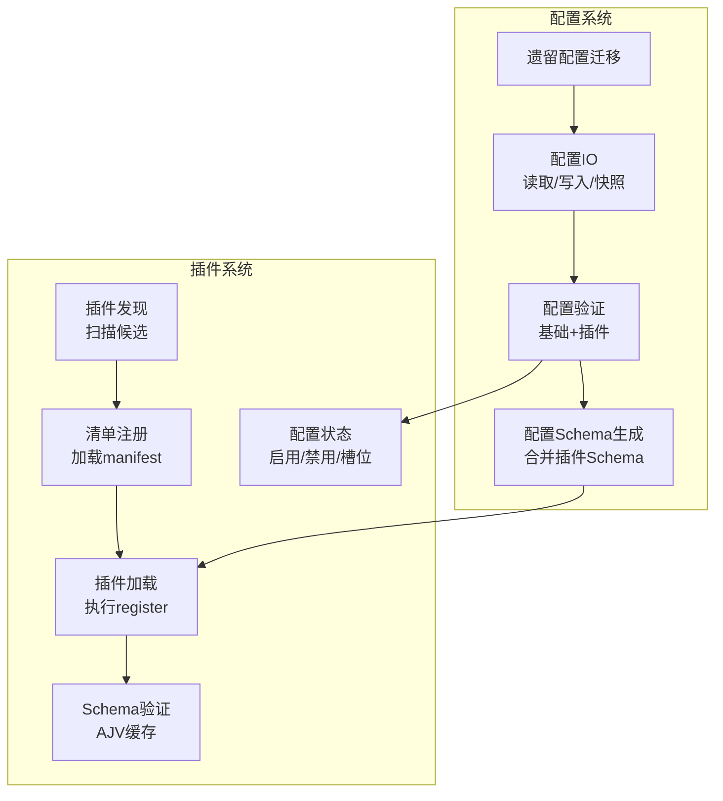
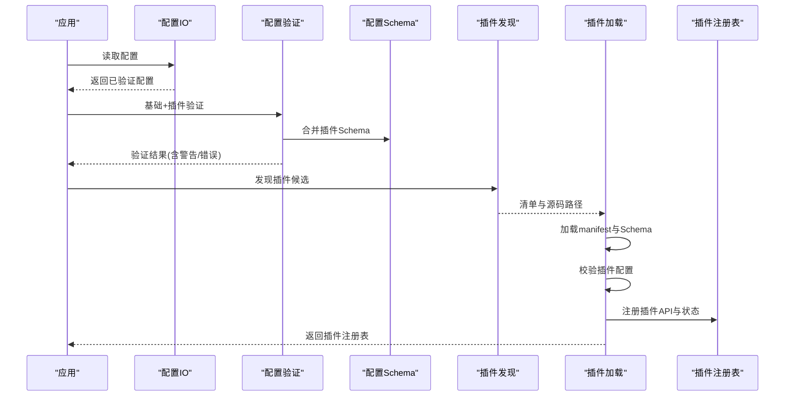
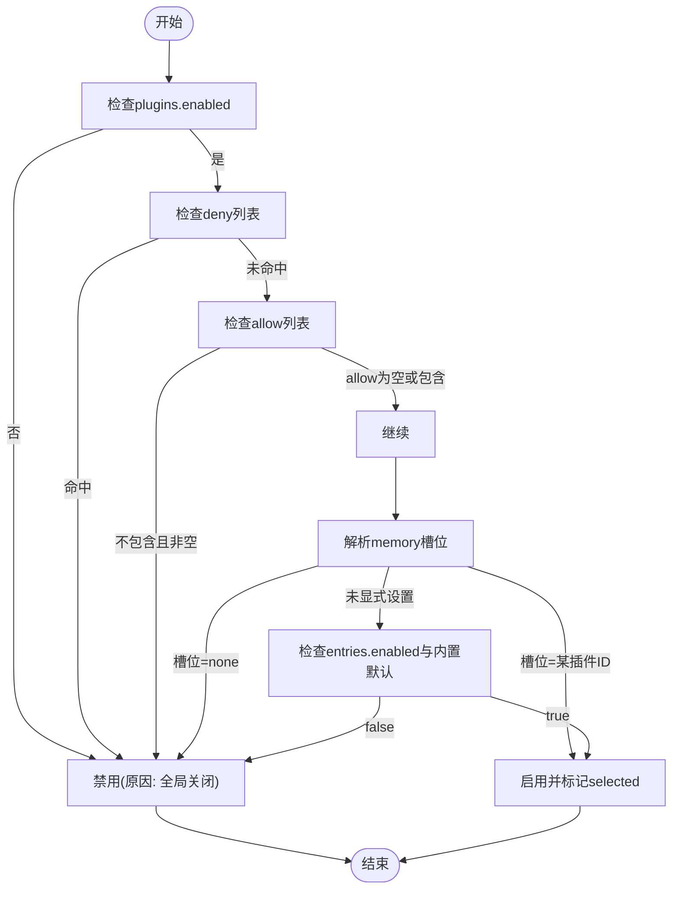
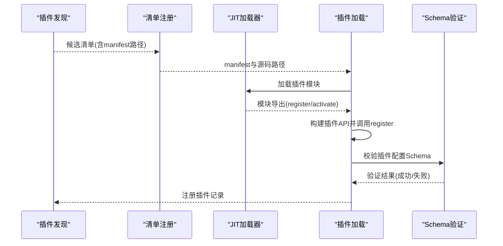
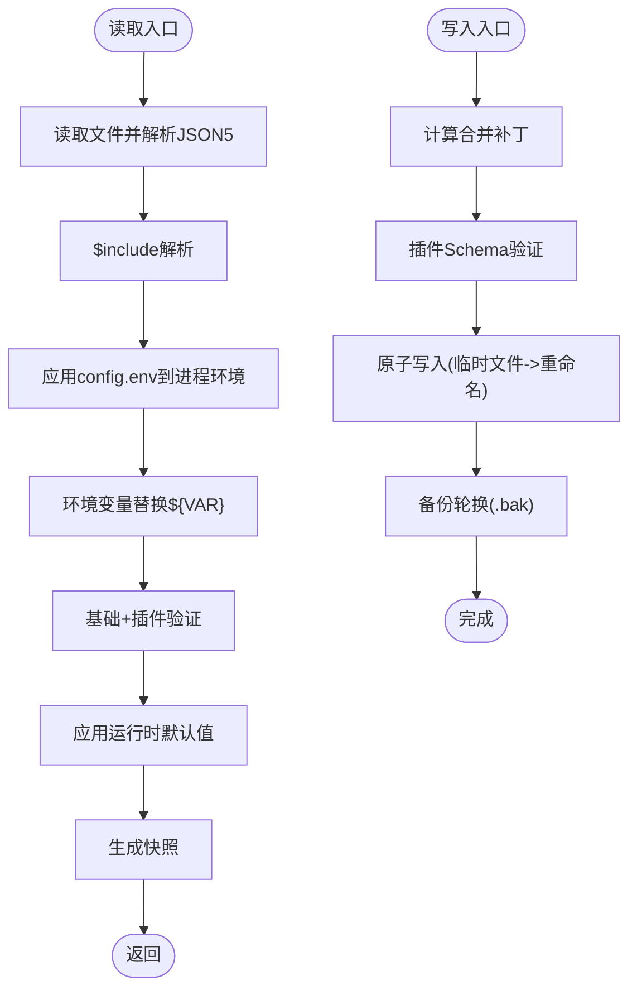
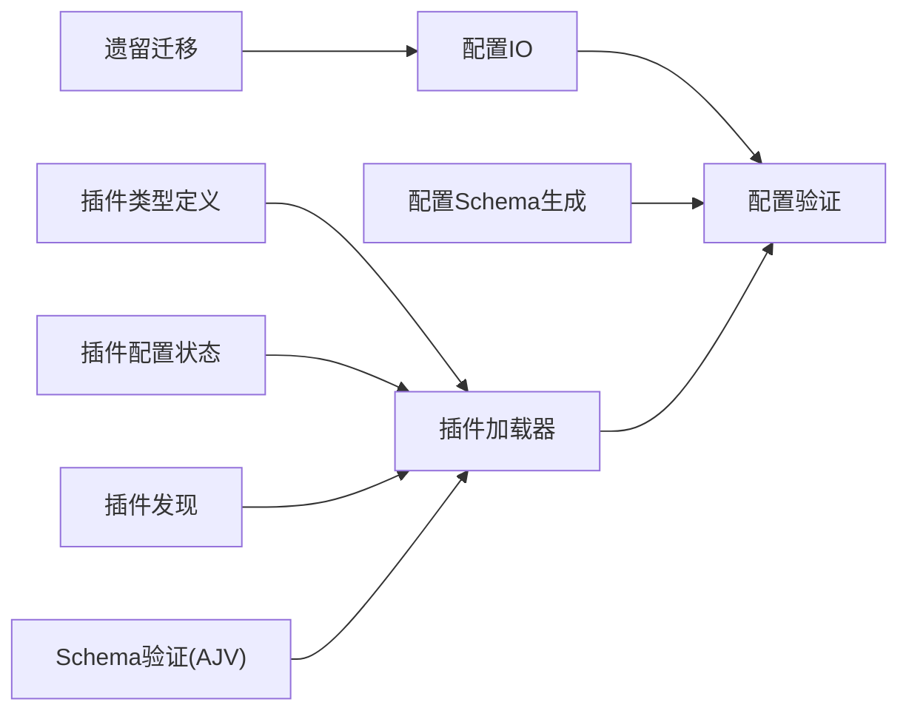

# 插件配置API

<cite>
**本文档引用的文件**
- [src/plugins/types.ts](file://src/plugins/types.ts)
- [src/plugins/config-state.ts](file://src/plugins/config-state.ts)
- [src/plugins/config-schema.ts](file://src/plugins/config-schema.ts)
- [src/plugins/loader.ts](file://src/plugins/loader.ts)
- [src/plugins/discovery.ts](file://src/plugins/discovery.ts)
- [src/plugins/schema-validator.ts](file://src/plugins/schema-validator.ts)
- [src/config/types.plugins.ts](file://src/config/types.plugins.ts)
- [src/config/schema.ts](file://src/config/schema.ts)
- [src/config/io.ts](file://src/config/io.ts)
- [src/config/validation.ts](file://src/config/validation.ts)
- [src/config/merge-patch.ts](file://src/config/merge-patch.ts)
- [src/config/legacy.ts](file://src/config/legacy.ts)
- [docs/plugins/manifest.md](file://docs/plugins/manifest.md)
- [extensions/memory-core/openclaw.plugin.json](file://extensions/memory-core/openclaw.plugin.json)
- [extensions/voice-call/openclaw.plugin.json](file://extensions/voice-call/openclaw.plugin.json)
</cite>

## 目录

1. [简介](#简介)
2. [项目结构](#项目结构)
3. [核心组件](#核心组件)
4. [架构总览](#架构总览)
5. [详细组件分析](#详细组件分析)
6. [依赖关系分析](#依赖关系分析)
7. [性能考虑](#性能考虑)
8. [故障排查指南](#故障排查指南)
9. [结论](#结论)
10. [附录](#附录)

## 简介

本文件为 OpenClaw 插件配置API的权威参考文档，面向插件开发者与系统集成者，系统性阐述插件配置系统的架构设计、配置模式、验证流程、默认值处理与动态更新机制，并详细说明插件清单文件（openclaw.plugin.json）的结构与字段语义。同时提供配置的读取、写入与持久化API接口说明，以及配置迁移、版本兼容性与回滚机制的实现方法，并给出配置安全、权限控制与最佳实践指导。

## 项目结构

OpenClaw 的插件配置API由“配置系统”和“插件系统”两大子系统协同完成：

- 配置系统：负责配置的解析、校验、合并补丁、持久化与备份轮换、环境变量注入、默认值应用等。
- 插件系统：负责插件发现、清单加载、注册API构建、插件配置Schema验证、启用状态决策与内存槽位选择等。

图表来源

- [src/config/io.ts](file://src/config/io.ts#L263-L625)
- [src/config/validation.ts](file://src/config/validation.ts#L176-L404)
- [src/config/schema.ts](file://src/config/schema.ts#L313-L335)
- [src/plugins/discovery.ts](file://src/plugins/discovery.ts#L301-L364)
- [src/plugins/loader.ts](file://src/plugins/loader.ts#L170-L456)
- [src/plugins/config-state.ts](file://src/plugins/config-state.ts#L65-L225)
- [src/plugins/schema-validator.ts](file://src/plugins/schema-validator.ts#L27-L44)

章节来源

- [src/config/io.ts](file://src/config/io.ts#L263-L625)
- [src/config/validation.ts](file://src/config/validation.ts#L176-L404)
- [src/config/schema.ts](file://src/config/schema.ts#L313-L335)
- [src/plugins/discovery.ts](file://src/plugins/discovery.ts#L301-L364)
- [src/plugins/loader.ts](file://src/plugins/loader.ts#L170-L456)
- [src/plugins/config-state.ts](file://src/plugins/config-state.ts#L65-L225)
- [src/plugins/schema-validator.ts](file://src/plugins/schema-validator.ts#L27-L44)

## 核心组件

- 插件类型与API定义：定义插件生命周期钩子、工具注册、HTTP路由、命令、服务、提供商等能力接口。
- 插件配置Schema：支持空Schema与完整JSON Schema，提供安全解析与UI提示。
- 插件配置状态：统一规范化plugins配置，计算启用状态、内存槽位决策与测试默认值。
- 插件发现与加载：扫描候选目录、加载清单、构建注册表、执行register并进行Schema验证。
- 配置IO与持久化：读取/写入配置、快照、合并补丁、备份轮换、缓存策略。
- 配置验证：基础Schema校验与插件Schema校验双层验证，输出问题与警告。
- 配置Schema生成：将插件Schema与通道Schema动态合并到基础配置Schema中，生成UI提示。

章节来源

- [src/plugins/types.ts](file://src/plugins/types.ts#L229-L283)
- [src/plugins/config-schema.ts](file://src/plugins/config-schema.ts#L13-L33)
- [src/plugins/config-state.ts](file://src/plugins/config-state.ts#L65-L225)
- [src/plugins/loader.ts](file://src/plugins/loader.ts#L170-L456)
- [src/config/io.ts](file://src/config/io.ts#L263-L625)
- [src/config/validation.ts](file://src/config/validation.ts#L176-L404)
- [src/config/schema.ts](file://src/config/schema.ts#L313-L335)

## 架构总览

下图展示从配置读取到插件加载的端到端流程，包括Schema生成、验证与插件注册阶段：

图表来源

- [src/config/io.ts](file://src/config/io.ts#L272-L382)
- [src/config/validation.ts](file://src/config/validation.ts#L148-L174)
- [src/config/schema.ts](file://src/config/schema.ts#L313-L335)
- [src/plugins/discovery.ts](file://src/plugins/discovery.ts#L301-L364)
- [src/plugins/loader.ts](file://src/plugins/loader.ts#L170-L456)

## 详细组件分析

### 插件清单文件（openclaw.plugin.json）

- 必填字段
  - id：插件标识符，用于配置键与注册表索引。
  - configSchema：插件配置的JSON Schema（必须提供，即使为空）。
- 可选字段
  - kind：插件种类（如 memory），影响内存槽位决策。
  - channels/providers/skills：声明插件注册的频道、提供商与技能目录。
  - name/description/uiHints/version：元数据与UI提示。
- 行为约束
  - manifest缺失或Schema无效将导致插件错误并阻塞配置验证。
  - 未知频道/插件ID引用将报错；已禁用插件但存在配置会发出警告。
  - 运行时仍需加载模块，manifest仅用于发现与验证。

章节来源

- [docs/plugins/manifest.md](file://docs/plugins/manifest.md#L9-L72)
- [extensions/memory-core/openclaw.plugin.json](file://extensions/memory-core/openclaw.plugin.json#L1-L10)
- [extensions/voice-call/openclaw.plugin.json](file://extensions/voice-call/openclaw.plugin.json#L1-L560)

### 插件配置Schema与UI提示

- 空Schema：允许未设置任何配置，内部实现通过safeParse校验空对象。
- 完整Schema：插件可提供复杂JSON Schema，配合uiHints生成UI标签、帮助文本、敏感字段标记等。
- 动态Schema合并：在基础配置Schema上按插件ID合并其configSchema，生成最终UI可用的配置Schema。

章节来源

- [src/plugins/config-schema.ts](file://src/plugins/config-schema.ts#L13-L33)
- [src/config/schema.ts](file://src/config/schema.ts#L209-L248)
- [src/config/schema.ts](file://src/config/schema.ts#L313-L335)

### 插件配置状态与启用逻辑

- 规范化plugins配置：统一allow/deny/entries/load/slots等字段，确保类型安全。
- 启用状态决策：全局开关、黑名单、白名单、显式条目enabled、内置默认启用集合、来源优先级共同决定是否启用。
- 内存槽位决策：memory槽位可显式禁用（null）或指定具体插件ID；若多个memory插件被选中，仅第一个生效并发出冲突警告。

图表来源

- [src/plugins/config-state.ts](file://src/plugins/config-state.ts#L164-L195)
- [src/plugins/config-state.ts](file://src/plugins/config-state.ts#L197-L225)

章节来源

- [src/plugins/config-state.ts](file://src/plugins/config-state.ts#L65-L110)
- [src/plugins/config-state.ts](file://src/plugins/config-state.ts#L164-L195)
- [src/plugins/config-state.ts](file://src/plugins/config-state.ts#L197-L225)

### 插件发现与加载流程

- 发现阶段：扫描工作区、全局、内置扩展目录与配置指定路径，收集候选插件源码与根目录信息。
- 清单加载：读取openclaw.plugin.json，提取id、kind、channels、providers、skills、uiHints、configSchema等。
- 加载阶段：使用JIT编译器加载插件模块，解析导出（register/activate），构建插件API并调用register。
- 验证阶段：对插件配置执行JSON Schema校验，记录诊断信息与错误。

图表来源

- [src/plugins/discovery.ts](file://src/plugins/discovery.ts#L301-L364)
- [src/plugins/loader.ts](file://src/plugins/loader.ts#L170-L456)
- [src/plugins/schema-validator.ts](file://src/plugins/schema-validator.ts#L27-L44)

章节来源

- [src/plugins/discovery.ts](file://src/plugins/discovery.ts#L115-L201)
- [src/plugins/discovery.ts](file://src/plugins/discovery.ts#L301-L364)
- [src/plugins/loader.ts](file://src/plugins/loader.ts#L170-L456)
- [src/plugins/schema-validator.ts](file://src/plugins/schema-validator.ts#L27-L44)

### 配置读取、写入与持久化API

- 读取配置
  - createConfigIO().loadConfig：解析JSON5、$include、环境变量替换、基础与运行时默认值应用、重复代理目录检测、Shell环境回退。
  - createConfigIO().readConfigFileSnapshot：返回快照（路径、是否存在、原始/解析后/最终配置、哈希、问题与警告、遗留问题）。
- 写入配置
  - createConfigIO().writeConfigFile：基于快照生成合并补丁，应用插件Schema验证，原子写入并进行备份轮换。
- 缓存策略
  - 支持通过环境变量控制缓存时长，默认短缓存；clearConfigCache可手动清空。
- 合并补丁
  - 使用标准合并补丁算法，仅写入用户显式设置的差异值，避免污染默认值。

图表来源

- [src/config/io.ts](file://src/config/io.ts#L272-L382)
- [src/config/io.ts](file://src/config/io.ts#L384-L549)
- [src/config/io.ts](file://src/config/io.ts#L551-L617)
- [src/config/merge-patch.ts](file://src/config/merge-patch.ts#L5-L26)

章节来源

- [src/config/io.ts](file://src/config/io.ts#L263-L625)
- [src/config/merge-patch.ts](file://src/config/merge-patch.ts#L5-L26)

### 配置验证与Schema生成

- 基础验证：使用Zod Schema进行结构与类型校验，检测代理目录重复、头像路径合法性等。
- 插件验证：加载插件清单注册表，校验plugins.entries、allow/deny、slots.memory、未知频道ID、心跳目标有效性；对每个启用或存在配置的插件执行JSON Schema验证。
- Schema生成：将插件configSchema与通道configSchema动态合并至基础配置Schema，并生成UI提示映射。

章节来源

- [src/config/validation.ts](file://src/config/validation.ts#L86-L146)
- [src/config/validation.ts](file://src/config/validation.ts#L148-L174)
- [src/config/validation.ts](file://src/config/validation.ts#L176-L404)
- [src/config/schema.ts](file://src/config/schema.ts#L209-L248)
- [src/config/schema.ts](file://src/config/schema.ts#L313-L335)

### 配置迁移、版本兼容性与回滚

- 遗留配置检测：遍历规则集，识别过时字段并报告问题。
- 迁移应用：对原始配置结构执行一系列迁移步骤，生成变更列表；若无变更则不修改。
- 版本兼容：写入时自动打上当前版本戳；读取时若检测到未来版本，发出警告。
- 回滚机制：写入采用原子重命名；若失败则回退到临时文件清理；同时保留固定数量的.bak备份，便于人工回滚。

章节来源

- [src/config/legacy.ts](file://src/config/legacy.ts#L5-L43)
- [src/config/io.ts](file://src/config/io.ts#L551-L617)
- [src/config/io.ts](file://src/config/io.ts#L143-L160)
- [src/config/io.ts](file://src/config/io.ts#L186-L196)
- [src/config/io.ts](file://src/config/io.ts#L198-L212)

### 配置安全、权限控制与最佳实践

- 敏感字段UI提示：通过uiHints标记sensitive字段，驱动前端隐藏输入或安全渲染。
- 环境变量注入：支持config.env与Shell环境回退，注意仅在真实进程环境中启用dotenv；避免在测试隔离上下文中污染。
- 路径与头像限制：禁止代理头像指向工作区外路径，防止越权访问。
- 最佳实践
  - 插件应提供完整的JSON Schema，包含所有可配置字段与枚举约束。
  - 对敏感字段（API Key、令牌）使用sensitive标记并在UI中隐藏。
  - 使用allow/deny精确控制插件启用范围，避免加载不必要的插件。
  - 将内存插件显式配置到memory槽位，避免多插件竞争。
  - 定期检查Doctor输出的插件警告，及时修复配置问题。

章节来源

- [src/config/schema.ts](file://src/config/schema.ts#L91-L131)
- [src/config/io.ts](file://src/config/io.ts#L243-L250)
- [src/config/validation.ts](file://src/config/validation.ts#L36-L84)

## 依赖关系分析

- 插件系统依赖配置系统提供的Schema生成与验证能力，以确保插件配置在加载前即通过严格校验。
- 配置系统依赖插件清单注册表，以便在验证阶段对plugins.entries、allow/deny、slots等进行一致性检查。
- 插件加载器依赖JIT编译器与Schema验证器，保证模块加载与配置校验的可靠性与性能。

图表来源

- [src/plugins/types.ts](file://src/plugins/types.ts#L229-L283)
- [src/plugins/loader.ts](file://src/plugins/loader.ts#L170-L456)
- [src/plugins/discovery.ts](file://src/plugins/discovery.ts#L301-L364)
- [src/plugins/schema-validator.ts](file://src/plugins/schema-validator.ts#L27-L44)
- [src/config/io.ts](file://src/config/io.ts#L263-L625)
- [src/config/validation.ts](file://src/config/validation.ts#L176-L404)
- [src/config/schema.ts](file://src/config/schema.ts#L313-L335)
- [src/config/legacy.ts](file://src/config/legacy.ts#L30-L43)

章节来源

- [src/plugins/types.ts](file://src/plugins/types.ts#L229-L283)
- [src/plugins/loader.ts](file://src/plugins/loader.ts#L170-L456)
- [src/plugins/discovery.ts](file://src/plugins/discovery.ts#L301-L364)
- [src/plugins/schema-validator.ts](file://src/plugins/schema-validator.ts#L27-L44)
- [src/config/io.ts](file://src/config/io.ts#L263-L625)
- [src/config/validation.ts](file://src/config/validation.ts#L176-L404)
- [src/config/schema.ts](file://src/config/schema.ts#L313-L335)
- [src/config/legacy.ts](file://src/config/legacy.ts#L30-L43)

## 性能考虑

- Schema验证缓存：AJV编译后的验证器按cacheKey缓存，避免重复编译开销。
- 插件注册表缓存：按工作区与plugins配置构建缓存键，减少重复加载成本。
- 写入原子性：临时文件写入后重命名，Windows环境下回退到复制+删除，确保一致性与最小IO。
- 配置快照与合并补丁：仅写入差异，降低磁盘写入量与序列化成本。

章节来源

- [src/plugins/schema-validator.ts](file://src/plugins/schema-validator.ts#L32-L37)
- [src/plugins/loader.ts](file://src/plugins/loader.ts#L77-L83)
- [src/config/io.ts](file://src/config/io.ts#L580-L617)
- [src/config/merge-patch.ts](file://src/config/merge-patch.ts#L5-L26)

## 故障排查指南

- 插件清单错误
  - 现象：插件被标记为error，诊断信息包含缺失manifest或Schema。
  - 处理：检查openclaw.plugin.json格式与字段完整性，确保提供configSchema。
- 插件配置无效
  - 现象：plugins.entries.<id>.config验证失败，出现具体路径与错误消息。
  - 处理：根据错误路径修正字段类型、必填项或枚举值。
- 插件未启用但配置存在
  - 现象：发出警告，提示插件被禁用但配置仍存在。
  - 处理：移除或注释掉该插件的配置，或调整plugins.allow/deny/entries.enabled。
- 未知插件ID或频道
  - 现象：plugins.allow/plugins.deny/plugins.slots/plugins.entries引用了不存在的ID。
  - 处理：核对插件ID拼写与清单中的id一致。
- 配置写入失败
  - 现象：写入抛出异常或.bak备份未生成。
  - 处理：检查磁盘权限与空间；必要时手动回滚.bak文件。

章节来源

- [src/plugins/loader.ts](file://src/plugins/loader.ts#L283-L294)
- [src/plugins/loader.ts](file://src/plugins/loader.ts#L373-L385)
- [src/config/validation.ts](file://src/config/validation.ts#L223-L267)
- [src/config/io.ts](file://src/config/io.ts#L590-L617)

## 结论

OpenClaw的插件配置API通过严格的清单与Schema验证、完善的启用状态与槽位决策、健壮的读写与持久化机制，实现了高可靠性的插件生态管理。结合UI提示与遗留迁移能力，开发者可以快速构建安全、可维护的插件配置体系。建议在生产环境中遵循敏感字段标记、最小权限启用、定期校验与备份策略，确保系统稳定与安全。

## 附录

- 插件清单字段速查
  - id：插件唯一标识
  - kind：插件种类（如memory）
  - channels/providers/skills：声明注册项
  - name/description/uiHints/version：元数据与UI提示
  - configSchema：插件配置Schema（必填）
- 配置文件读写接口
  - 读取：createConfigIO().loadConfig / readConfigFileSnapshot
  - 写入：createConfigIO().writeConfigFile
  - 缓存：clearConfigCache / 环境变量控制缓存时长

章节来源

- [docs/plugins/manifest.md](file://docs/plugins/manifest.md#L18-L72)
- [src/config/io.ts](file://src/config/io.ts#L263-L625)
- [src/config/schema.ts](file://src/config/schema.ts#L72-L131)
