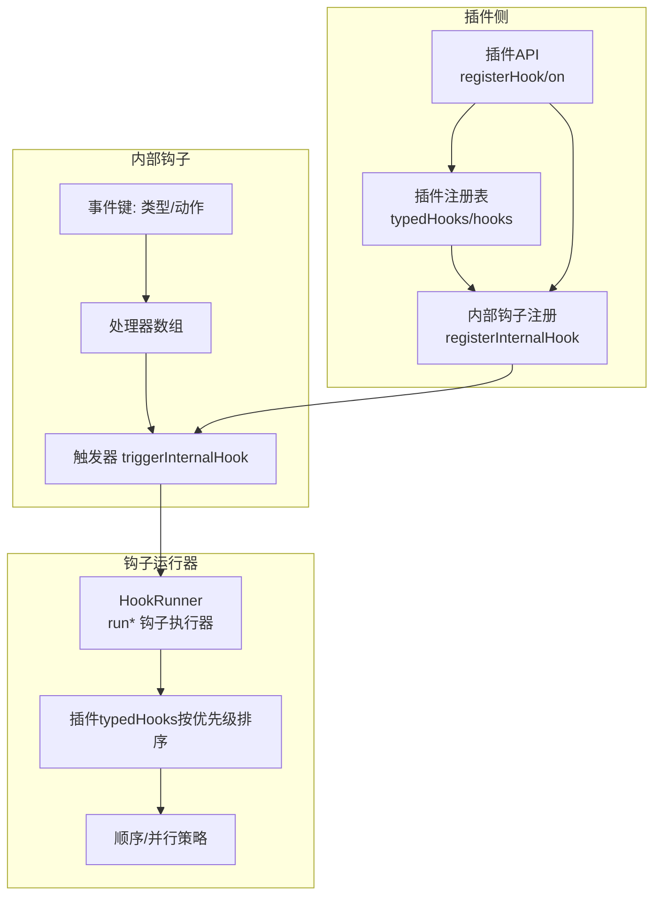
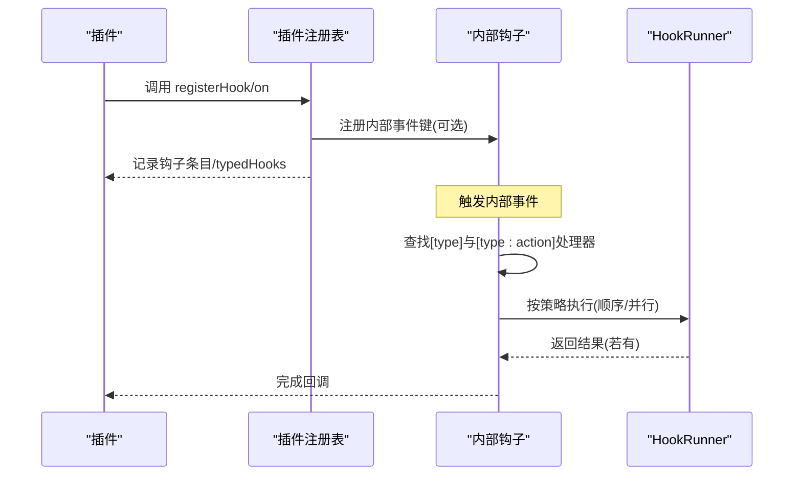
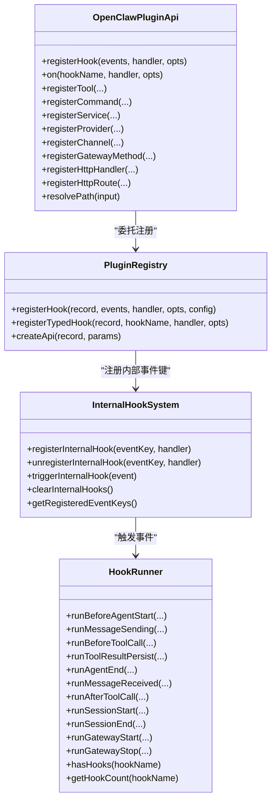
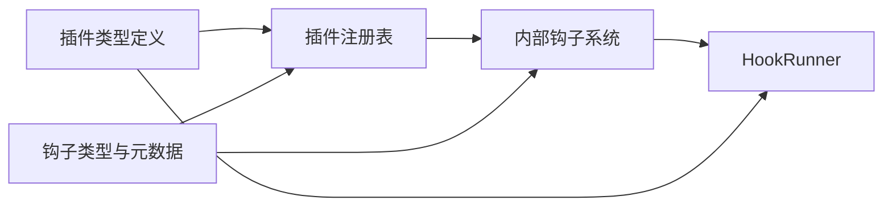

# 插件钩子系统

<cite>
**本文引用的文件**
- [src/plugins/types.ts](file://src/plugins/types.ts)
- [src/plugins/registry.ts](file://src/plugins/registry.ts)
- [src/plugins/hooks.ts](file://src/plugins/hooks.ts)
- [src/hooks/internal-hooks.ts](file://src/hooks/internal-hooks.ts)
- [src/hooks/plugin-hooks.ts](file://src/hooks/plugin-hooks.ts)
- [src/hooks/types.ts](file://src/hooks/types.ts)
- [src/hooks/bundled/session-memory/HOOK.md](file://src/hooks/bundled/session-memory/HOOK.md)
- [src/hooks/bundled/session-memory/handler.ts](file://src/hooks/bundled/session-memory/handler.ts)
- [src/hooks/bundled/command-logger/HOOK.md](file://src/hooks/bundled/command-logger/HOOK.md)
- [src/hooks/bundled/command-logger/handler.ts](file://src/hooks/bundled/command-logger/handler.ts)
- [docs/cli/hooks.md](file://docs/cli/hooks.md)
</cite>

## 目录

1. [简介](#简介)
2. [项目结构](#项目结构)
3. [核心组件](#核心组件)
4. [架构总览](#架构总览)
5. [详细组件分析](#详细组件分析)
6. [依赖关系分析](#依赖关系分析)
7. [性能考量](#性能考量)
8. [故障排查指南](#故障排查指南)
9. [结论](#结论)
10. [附录](#附录)

## 简介

本文件面向OpenClaw插件开发者与使用者，系统化阐述插件钩子（Plugin Hooks）体系的架构设计、事件类型与生命周期管理，并完整覆盖消息处理钩子、会话管理钩子、工具调用钩子、代理生命周期钩子、网关生命周期钩子等。文档同时提供钩子注册、执行与取消注册的方法说明，明确参数类型、返回值规范与错误处理机制，并给出在插件中实现与使用钩子的最佳实践与参考路径。

## 项目结构

OpenClaw的钩子系统由“插件侧钩子”和“内部钩子”两层组成：

- 插件侧钩子：通过插件API注册，映射到内部事件键，形成统一的事件驱动模型。
- 内部钩子：负责事件的注册、触发与清理，支持通用事件类型与具体事件动作组合。

图表来源

- [src/plugins/registry.ts](file://src/plugins/registry.ts#L195-L263)
- [src/hooks/internal-hooks.ts](file://src/hooks/internal-hooks.ts#L67-L143)
- [src/plugins/hooks.ts](file://src/plugins/hooks.ts#L93-L471)

章节来源

- [src/plugins/registry.ts](file://src/plugins/registry.ts#L1-L516)
- [src/hooks/internal-hooks.ts](file://src/hooks/internal-hooks.ts#L1-L182)
- [src/plugins/hooks.ts](file://src/plugins/hooks.ts#L1-L471)

## 核心组件

- 插件API与钩子注册
  - 插件通过OpenClawPluginApi.registerHook或on注册钩子，绑定事件名与处理器。
  - 注册时可携带HookEntry元数据与是否自动注册到内部钩子系统的选项。
- 插件注册表
  - 维护插件的工具、通道、提供方、命令、HTTP路由、服务、钩子等清单。
  - 将插件钩子条目转换为内部事件键并注册到内部钩子系统。
- 内部钩子系统
  - 提供事件键注册、注销、触发与调试查询能力。
  - 支持事件类型与具体动作两种维度的处理器匹配。
- 钩子运行器
  - 基于注册表中的typedHooks，按优先级顺序执行修改型钩子；并行执行无返回值钩子。
  - 提供hasHooks/getHookCount等实用方法。

章节来源

- [src/plugins/types.ts](file://src/plugins/types.ts#L244-L283)
- [src/plugins/registry.ts](file://src/plugins/registry.ts#L195-L263)
- [src/hooks/internal-hooks.ts](file://src/hooks/internal-hooks.ts#L67-L143)
- [src/plugins/hooks.ts](file://src/plugins/hooks.ts#L93-L471)

## 架构总览

下图展示了从插件注册到内部事件触发再到钩子运行器执行的整体流程：

图表来源

- [src/plugins/registry.ts](file://src/plugins/registry.ts#L195-L263)
- [src/hooks/internal-hooks.ts](file://src/hooks/internal-hooks.ts#L123-L143)
- [src/plugins/hooks.ts](file://src/plugins/hooks.ts#L101-L172)

## 详细组件分析

### 事件类型与生命周期

- 事件类型
  - command：命令类事件，如/new、/reset等。
  - session：会话生命周期事件，如开始、结束。
  - agent：代理生命周期事件，如启动前、结束。
  - gateway：网关生命周期事件，如启动、停止。
- 生命周期
  - 插件注册阶段：插件通过API注册钩子，注册表根据配置决定是否同时注册到内部钩子系统。
  - 运行阶段：内部钩子触发器根据事件类型与动作匹配处理器；HookRunner按策略执行。
  - 取消阶段：插件可注销钩子，注册表移除对应条目；内部钩子系统清理对应事件键的处理器列表。

章节来源

- [src/hooks/internal-hooks.ts](file://src/hooks/internal-hooks.ts#L11-L41)
- [src/plugins/registry.ts](file://src/plugins/registry.ts#L195-L263)
- [src/plugins/hooks.ts](file://src/plugins/hooks.ts#L93-L471)

### 钩子接口与参数规范

- 钩子名称（PluginHookName）
  - 包括：before_agent_start、agent_end、before_compaction、after_compaction、message_received、message_sending、message_sent、before_tool_call、after_tool_call、tool_result_persist、session_start、session_end、gateway_start、gateway_stop。
- 事件与上下文
  - 代理相关：PluginHookAgentContext、PluginHookBeforeAgentStartEvent、PluginHookAgentEndEvent、PluginHookBeforeCompactionEvent、PluginHookAfterCompactionEvent。
  - 消息相关：PluginHookMessageContext、PluginHookMessageReceivedEvent、PluginHookMessageSendingEvent、PluginHookMessageSendingResult、PluginHookMessageSentEvent。
  - 工具相关：PluginHookToolContext、PluginHookBeforeToolCallEvent、PluginHookBeforeToolCallResult、PluginHookAfterToolCallEvent、PluginHookToolResultPersistEvent、PluginHookToolResultPersistResult、PluginHookToolResultPersistContext。
  - 会话相关：PluginHookSessionContext、PluginHookSessionStartEvent、PluginHookSessionEndEvent。
  - 网关相关：PluginHookGatewayContext、PluginHookGatewayStartEvent、PluginHookGatewayStopEvent。
- 处理器签名
  - 修改型钩子：返回值合并策略由运行器提供，常见为逐项覆盖或拼接。
  - 无返回值钩子：异步执行，不等待结果，适合通知型钩子。
  - 同步钩子：tool_result_persist为同步钩子，要求处理器同步返回，避免Promise导致的忽略。

章节来源

- [src/plugins/types.ts](file://src/plugins/types.ts#L298-L538)

### 钩子注册、执行与取消注册

- 注册
  - 插件API：registerHook(events, handler, opts)与on(hookName, handler, { priority? })。
  - 注册表：将HookEntry标准化，写入hooks与typedHooks；若启用内部钩子系统且允许注册，则向内部注册事件键。
- 执行
  - HookRunner按钩子类型选择策略：
    - 顺序执行：before_agent_start、message_sending、before_tool_call、tool_result_persist。
    - 并行执行：agent_end、message_received、message_sent、after_tool_call、session_start、session_end、gateway_start、gateway_stop。
  - 顺序执行的钩子会将多个处理器的结果进行合并（如systemPrompt、prependContext、content、cancel等）。
- 取消注册
  - 插件侧：插件可自行管理处理器引用并在合适时机不再触发。
  - 注册表侧：内部钩子系统提供unregisterInternalHook按事件键移除处理器；注册表维护typedHooks与hooks清单，便于统计与诊断。

章节来源

- [src/plugins/registry.ts](file://src/plugins/registry.ts#L195-L263)
- [src/plugins/hooks.ts](file://src/plugins/hooks.ts#L93-L471)
- [src/hooks/internal-hooks.ts](file://src/hooks/internal-hooks.ts#L67-L95)

### 钩子参数类型与返回值规范

- 代理钩子
  - before_agent_start：event包含prompt与messages，ctx包含agentId、sessionKey、workspaceDir、messageProvider；返回可选的systemPrompt与prependContext。
  - agent_end：event包含messages、success、error、durationMs；无返回值。
  - before_compaction/after_compaction：event包含messageCount、tokenCount、compactedCount；无返回值。
- 消息钩子
  - message_received：event包含from、content、timestamp、metadata；无返回值。
  - message_sending：event包含to、content、metadata；返回可选的content与cancel标志。
  - message_sent：event包含to、content、success、error；无返回值。
- 工具钩子
  - before_tool_call：event包含toolName、params；返回可选的params、block与blockReason。
  - after_tool_call：event包含toolName、params、result、error、durationMs；无返回值。
  - tool_result_persist：event包含toolName、toolCallId、message与isSynthetic；返回可选的message以替换后续处理器输入。
- 会话钩子
  - session_start：event包含sessionId、resumedFrom；无返回值。
  - session_end：event包含sessionId、messageCount、durationMs；无返回值。
- 网关钩子
  - gateway_start：event包含port；无返回值。
  - gateway_stop：event包含reason；无返回值。

章节来源

- [src/plugins/types.ts](file://src/plugins/types.ts#L314-L538)

### 错误处理机制

- HookRunner
  - 默认catchErrors=true：处理器抛错会被捕获并记录日志，不影响其他处理器执行。
  - catchErrors=false：错误向上抛出，中断当前执行链。
- 内部钩子
  - 触发时对每个处理器try/catch，保证单个处理器异常不阻断整体流程。
- 插件侧
  - 插件应确保处理器健壮性，必要时在内部钩子中进行容错与降级。

章节来源

- [src/plugins/hooks.ts](file://src/plugins/hooks.ts#L114-L126)
- [src/hooks/internal-hooks.ts](file://src/hooks/internal-hooks.ts#L133-L142)

### 在插件中实现与使用钩子

- 实现步骤
  - 在插件模块中调用api.on或api.registerHook注册所需钩子。
  - 对于修改型钩子，按返回值规范构造结果对象；对于通知型钩子，直接执行副作用逻辑。
  - 使用priority控制执行顺序（数值越大越先执行）。
- 最佳实践
  - 修改型钩子：仅返回必要的字段，避免覆盖全局行为；对可选字段采用“后到优先”的合并策略。
  - 通知型钩子：避免长时间阻塞，必要时使用异步非阻塞方式。
  - 同步钩子：严格遵守同步约束，不要返回Promise。
  - 日志与诊断：在关键路径输出日志，便于定位问题；利用hasHooks与getHookCount进行运行时检查。
- 参考实现
  - 会话内存钩子：在command:new事件中保存会话摘要到记忆文件。
  - 命令审计钩子：在command事件中追加JSONL日志到集中文件。

章节来源

- [src/hooks/bundled/session-memory/handler.ts](file://src/hooks/bundled/session-memory/handler.ts#L73-L205)
- [src/hooks/bundled/command-logger/handler.ts](file://src/hooks/bundled/command-logger/handler.ts#L35-L68)
- [src/plugins/hooks.ts](file://src/plugins/hooks.ts#L177-L424)

### 钩子注册与生命周期管理（代码级）

图表来源

- [src/plugins/types.ts](file://src/plugins/types.ts#L244-L283)
- [src/plugins/registry.ts](file://src/plugins/registry.ts#L195-L263)
- [src/hooks/internal-hooks.ts](file://src/hooks/internal-hooks.ts#L67-L143)
- [src/plugins/hooks.ts](file://src/plugins/hooks.ts#L93-L471)

## 依赖关系分析

- 插件API依赖插件注册表与内部钩子系统，用于将插件钩子映射到内部事件键。
- HookRunner依赖typedHooks与优先级排序，决定顺序/并行执行策略。
- 内部钩子系统提供事件键到处理器数组的映射，支持类型与动作两级匹配。
- 钩子元数据（HookEntry、OpenClawHookMetadata）描述事件、导出名、安装信息等，影响钩子的发现与加载。

图表来源

- [src/plugins/types.ts](file://src/plugins/types.ts#L244-L283)
- [src/plugins/registry.ts](file://src/plugins/registry.ts#L195-L263)
- [src/hooks/internal-hooks.ts](file://src/hooks/internal-hooks.ts#L67-L143)
- [src/hooks/types.ts](file://src/hooks/types.ts#L1-L68)

章节来源

- [src/plugins/types.ts](file://src/plugins/types.ts#L1-L538)
- [src/hooks/types.ts](file://src/hooks/types.ts#L1-L68)

## 性能考量

- 并行执行
  - 无返回值钩子采用Promise.all并行执行，提升吞吐量。
- 顺序执行
  - 修改型钩子按优先级顺序执行，避免竞态；合并策略需轻量。
- 同步钩子
  - tool_result_persist为热路径同步钩子，必须避免异步返回，防止被忽略。
- 资源与I/O
  - 避免在钩子中进行重IO或长耗时操作；必要时使用异步但不阻塞主流程。
- 诊断与可观测性
  - 利用HookRunner的日志与hasHooks/getHookCount进行性能与覆盖率监控。

章节来源

- [src/plugins/hooks.ts](file://src/plugins/hooks.ts#L97-L172)

## 故障排查指南

- 常见问题
  - 钩子未生效：确认内部钩子系统已启用、事件键正确、处理器函数有效。
  - 修改型钩子无效：检查返回值字段是否符合规范，合并策略是否覆盖预期。
  - 同步钩子被忽略：确保处理器为同步函数，不返回Promise。
  - 并发冲突：检查是否有多个处理器对同一资源进行竞态更新。
- 排查步骤
  - 使用openclaw hooks命令查看钩子状态与启用情况。
  - 在内部钩子系统中查询已注册事件键，确认处理器数量。
  - 在HookRunner中开启日志，观察执行链路与错误堆栈。
- 相关文档
  - CLI钩子管理命令参考：hooks list/info/check/enable/disable/install/update。

章节来源

- [docs/cli/hooks.md](file://docs/cli/hooks.md#L1-L292)
- [src/hooks/internal-hooks.ts](file://src/hooks/internal-hooks.ts#L107-L109)
- [src/plugins/hooks.ts](file://src/plugins/hooks.ts#L114-L126)

## 结论

OpenClaw的插件钩子系统通过“插件侧钩子+内部钩子+钩子运行器”的分层设计，实现了事件驱动的扩展点。它既保证了插件开发的灵活性，又通过统一的事件模型与严格的执行策略确保了系统的稳定性与性能。遵循本文的参数规范、返回值约定与最佳实践，可在不侵入核心逻辑的前提下，安全地扩展消息处理、会话管理、工具调用与网关生命周期等场景。

## 附录

### 钩子清单与用途概览

- 代理生命周期
  - before_agent_start：注入系统提示词与前置上下文。
  - agent_end：分析完成对话后的收尾工作。
  - before_compaction/after_compaction：压缩前后处理。
- 消息流
  - message_received：收到消息后的处理。
  - message_sending：发送前的修改或取消。
  - message_sent：发送后的通知。
- 工具调用
  - before_tool_call：调用前的参数调整或阻断。
  - after_tool_call：调用后的通知。
  - tool_result_persist：持久化工具结果的同步钩子。
- 会话生命周期
  - session_start/session_end：会话开始与结束的通知。
- 网关生命周期
  - gateway_start/gateway_stop：网关启动与停止的通知。

章节来源

- [src/plugins/types.ts](file://src/plugins/types.ts#L298-L538)
- [src/plugins/hooks.ts](file://src/plugins/hooks.ts#L177-L424)

### 示例钩子实现参考

- 会话内存钩子
  - 事件：command:new
  - 行为：解析最近N条消息，生成描述性slug，写入记忆文件。
  - 参考路径：[src/hooks/bundled/session-memory/handler.ts](file://src/hooks/bundled/session-memory/handler.ts#L73-L205)
- 命令审计钩子
  - 事件：command
  - 行为：将命令事件追加到JSONL审计文件。
  - 参考路径：[src/hooks/bundled/command-logger/handler.ts](file://src/hooks/bundled/command-logger/handler.ts#L35-L68)

章节来源

- [src/hooks/bundled/session-memory/HOOK.md](file://src/hooks/bundled/session-memory/HOOK.md#L1-L110)
- [src/hooks/bundled/session-memory/handler.ts](file://src/hooks/bundled/session-memory/handler.ts#L73-L205)
- [src/hooks/bundled/command-logger/HOOK.md](file://src/hooks/bundled/command-logger/HOOK.md#L1-L123)
- [src/hooks/bundled/command-logger/handler.ts](file://src/hooks/bundled/command-logger/handler.ts#L35-L68)
