# 消息渠道插件API

<cite>
**本文引用的文件**
- [src/channels/plugins/types.plugin.ts](file://src/channels/plugins/types.plugin.ts)
- [src/channels/plugins/types.adapters.ts](file://src/channels/plugins/types.adapters.ts)
- [src/channels/plugins/types.core.ts](file://src/channels/plugins/types.core.ts)
- [src/channels/plugins/message-action-names.ts](file://src/channels/plugins/message-action-names.ts)
- [src/channels/dock.ts](file://src/channels/dock.ts)
- [src/infra/outbound/channel-adapters.ts](file://src/infra/outbound/channel-adapters.ts)
- [extensions/whatsapp/src/channel.ts](file://extensions/whatsapp/src/channel.ts)
- [docs/channels/index.md](file://docs/channels/index.md)
- [docs/channels/telegram.md](file://docs/channels/telegram.md)
- [ui/src/ui/types.ts](file://ui/src/ui/types.ts)
- [apps/macos/Sources/OpenClaw/ChannelsStore+Lifecycle.swift](file://apps/macos/Sources/OpenClaw/ChannelsStore+Lifecycle.swift)
</cite>

## 目录

1. [简介](#简介)
2. [项目结构](#项目结构)
3. [核心组件](#核心组件)
4. [架构总览](#架构总览)
5. [组件详解](#组件详解)
6. [依赖关系分析](#依赖关系分析)
7. [性能考量](#性能考量)
8. [故障排查指南](#故障排查指南)
9. [结论](#结论)
10. [附录](#附录)

## 简介

本文件为 OpenClaw 消息渠道插件API的权威参考，面向插件开发者与集成工程师，系统阐述渠道插件的架构设计、接口规范与实现要点，覆盖消息适配器、认证适配器、目录适配器、命令与权限控制、消息路由与线程化、以及主流平台（Telegram、WhatsApp、Discord 等）的集成方式与最佳实践。文档同时提供测试、调试与部署建议，帮助快速构建稳定可靠的跨平台消息通道。

## 项目结构

OpenClaw 的渠道插件体系由“核心类型定义”“渠道停靠(Dock)”“适配器接口”“具体平台插件”四层构成：

- 核心类型：定义渠道能力、账户状态、消息动作、线程上下文等通用模型
- 适配器接口：抽象出配置、认证、目录、网关、命令、安全、心跳、消息发送等能力契约
- 渠道停靠：对核心能力进行轻量化封装，供共享逻辑复用
- 平台插件：在具体平台实现适配器，完成认证、消息收发、目录查询等

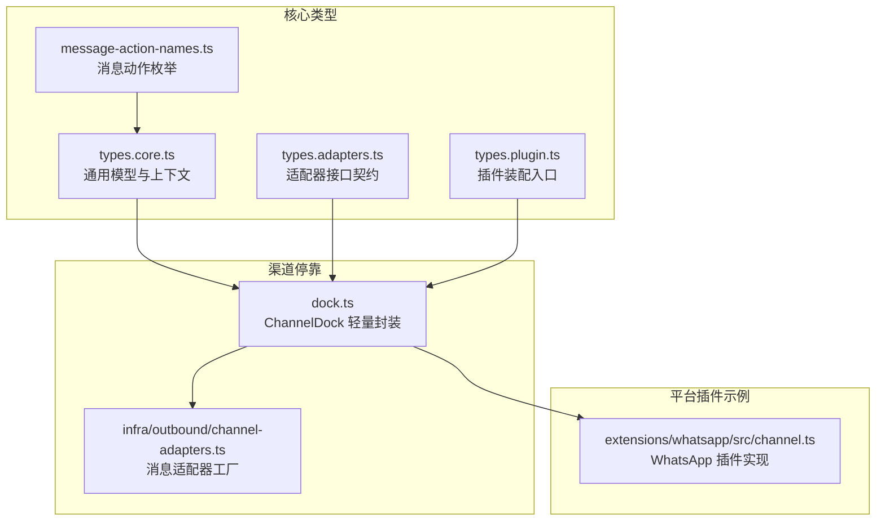

**图表来源**

- [src/channels/plugins/types.core.ts](file://src/channels/plugins/types.core.ts#L1-L338)
- [src/channels/plugins/types.adapters.ts](file://src/channels/plugins/types.adapters.ts#L1-L313)
- [src/channels/plugins/types.plugin.ts](file://src/channels/plugins/types.plugin.ts#L1-L84)
- [src/channels/plugins/message-action-names.ts](file://src/channels/plugins/message-action-names.ts#L1-L55)
- [src/channels/dock.ts](file://src/channels/dock.ts#L1-L525)
- [src/infra/outbound/channel-adapters.ts](file://src/infra/outbound/channel-adapters.ts#L1-L26)
- [extensions/whatsapp/src/channel.ts](file://extensions/whatsapp/src/channel.ts#L71-L261)

**章节来源**

- [src/channels/plugins/types.core.ts](file://src/channels/plugins/types.core.ts#L1-L338)
- [src/channels/plugins/types.adapters.ts](file://src/channels/plugins/types.adapters.ts#L1-L313)
- [src/channels/plugins/types.plugin.ts](file://src/channels/plugins/types.plugin.ts#L1-L84)
- [src/channels/dock.ts](file://src/channels/dock.ts#L1-L525)
- [src/infra/outbound/channel-adapters.ts](file://src/infra/outbound/channel-adapters.ts#L1-L26)
- [extensions/whatsapp/src/channel.ts](file://extensions/whatsapp/src/channel.ts#L71-L261)

## 核心组件

- 渠道插件装配入口：定义插件元数据、能力、适配器集合与可选的 UI 配置模式
- 适配器接口族：涵盖配置、认证、目录、网关、命令、安全、心跳、消息发送、线程化、代理工具等
- 渠道停靠：对插件能力进行轻量化封装，统一暴露给共享逻辑使用
- 通用模型：账户快照、消息动作、线程上下文、分组策略、安全策略等

**章节来源**

- [src/channels/plugins/types.plugin.ts](file://src/channels/plugins/types.plugin.ts#L48-L84)
- [src/channels/plugins/types.adapters.ts](file://src/channels/plugins/types.adapters.ts#L22-L313)
- [src/channels/dock.ts](file://src/channels/dock.ts#L44-L68)
- [src/channels/plugins/types.core.ts](file://src/channels/plugins/types.core.ts#L74-L338)

## 架构总览

OpenClaw 通过“插件装配 + 停靠封装 + 适配器契约”的三层架构，将不同平台的消息能力抽象为一致的调用面：

- 插件装配：以 ChannelPlugin 为核心，按需注入各适配器
- 停靠封装：ChannelDock 将插件能力与默认行为合并，形成共享能力视图
- 适配器契约：定义清晰的输入输出与职责边界，便于扩展与替换

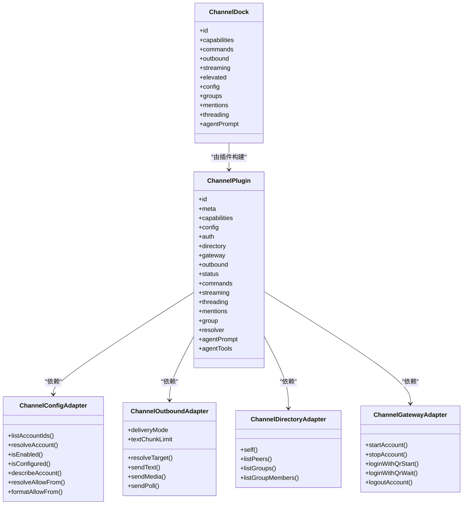

**图表来源**

- [src/channels/plugins/types.plugin.ts](file://src/channels/plugins/types.plugin.ts#L48-L84)
- [src/channels/plugins/types.adapters.ts](file://src/channels/plugins/types.adapters.ts#L41-L273)
- [src/channels/dock.ts](file://src/channels/dock.ts#L447-L470)

**章节来源**

- [src/channels/plugins/types.plugin.ts](file://src/channels/plugins/types.plugin.ts#L48-L84)
- [src/channels/plugins/types.adapters.ts](file://src/channels/plugins/types.adapters.ts#L41-L273)
- [src/channels/dock.ts](file://src/channels/dock.ts#L447-L470)

## 组件详解

### 渠道插件装配与配置模式

- 插件装配：ChannelPlugin 定义 id、meta、capabilities、适配器集合与可选 UI 配置模式
- 配置模式：支持 schema 与 UI 提示，用于 CLI 引导与可视化配置
- 默认行为：如队列去抖动参数、网关方法白名单等

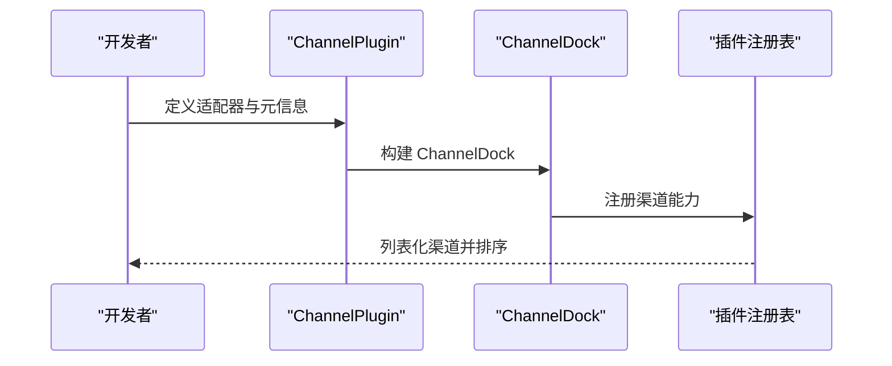

**图表来源**

- [src/channels/plugins/types.plugin.ts](file://src/channels/plugins/types.plugin.ts#L48-L84)
- [src/channels/dock.ts](file://src/channels/dock.ts#L472-L490)

**章节来源**

- [src/channels/plugins/types.plugin.ts](file://src/channels/plugins/types.plugin.ts#L32-L84)
- [src/channels/dock.ts](file://src/channels/dock.ts#L472-L490)

### 配置适配器（ChannelConfigAdapter）

- 账户生命周期：列出账户、解析账户、启用/禁用、删除、描述
- 可用性判定：是否已配置、未配置原因、是否启用
- 允许来源：解析与格式化 allowFrom，支持前缀归一化与大小写处理

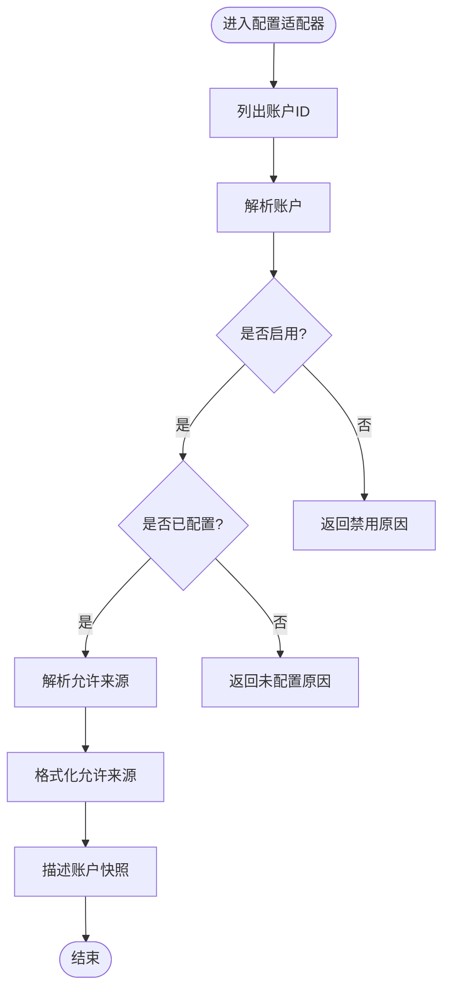

**图表来源**

- [src/channels/plugins/types.adapters.ts](file://src/channels/plugins/types.adapters.ts#L41-L65)

**章节来源**

- [src/channels/plugins/types.adapters.ts](file://src/channels/plugins/types.adapters.ts#L41-L65)

### 认证适配器（ChannelAuthAdapter）与网关适配器（ChannelGatewayAdapter）

- 认证适配器：提供登录入口，按渠道需要执行令牌获取或交互式登录
- 网关适配器：负责账户生命周期管理（启动/停止）、二维码登录（开始/等待）、登出

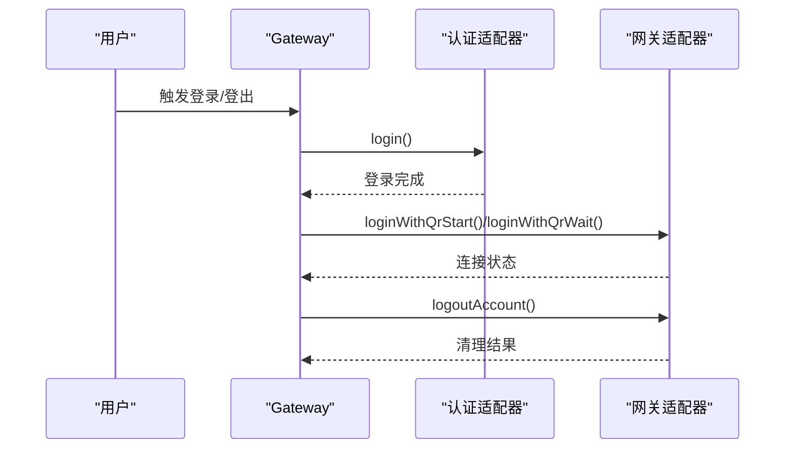

**图表来源**

- [src/channels/plugins/types.adapters.ts](file://src/channels/plugins/types.adapters.ts#L210-L208)

**章节来源**

- [src/channels/plugins/types.adapters.ts](file://src/channels/plugins/types.adapters.ts#L210-L208)

### 目录适配器（ChannelDirectoryAdapter）

- 自身身份：查询当前账号身份
- 同伴与群组：列出用户、群组及其成员，支持带查询条件与限制
- 实时列表：部分平台支持实时拉取

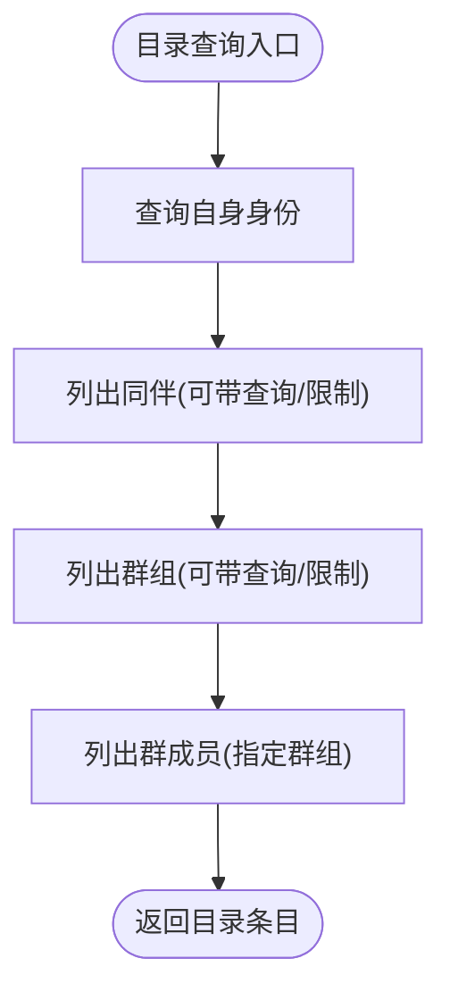

**图表来源**

- [src/channels/plugins/types.adapters.ts](file://src/channels/plugins/types.adapters.ts#L232-L273)

**章节来源**

- [src/channels/plugins/types.adapters.ts](file://src/channels/plugins/types.adapters.ts#L232-L273)

### 消息发送适配器（ChannelOutboundAdapter）

- 发送模式：direct/gateway/hybrid
- 文本/媒体/投票：统一的发送接口与目标解析
- 分块策略：文本长度限制与分块模式

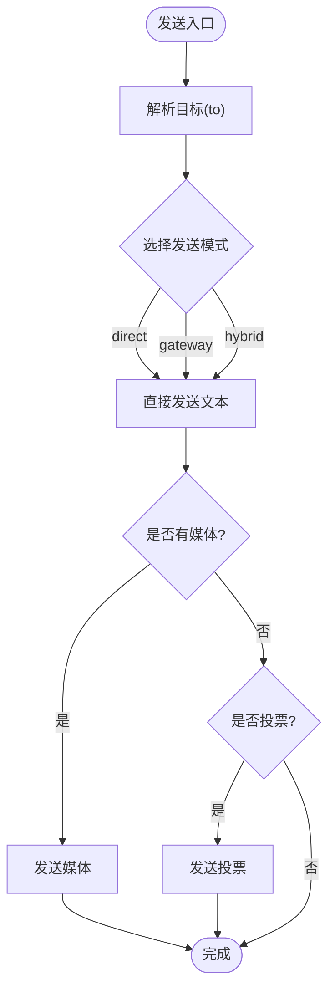

**图表来源**

- [src/channels/plugins/types.adapters.ts](file://src/channels/plugins/types.adapters.ts#L89-L106)
- [src/infra/outbound/channel-adapters.ts](file://src/infra/outbound/channel-adapters.ts#L21-L26)

**章节来源**

- [src/channels/plugins/types.adapters.ts](file://src/channels/plugins/types.adapters.ts#L89-L106)
- [src/infra/outbound/channel-adapters.ts](file://src/infra/outbound/channel-adapters.ts#L1-L26)

### 线程化与消息动作（ChannelThreadingAdapter / ChannelMessageActionAdapter）

- 线程化：回复模式（关闭/首个/全部）、工具上下文构建
- 消息动作：列出动作、支持校验、按钮/卡片支持、提取工具发送参数、处理动作

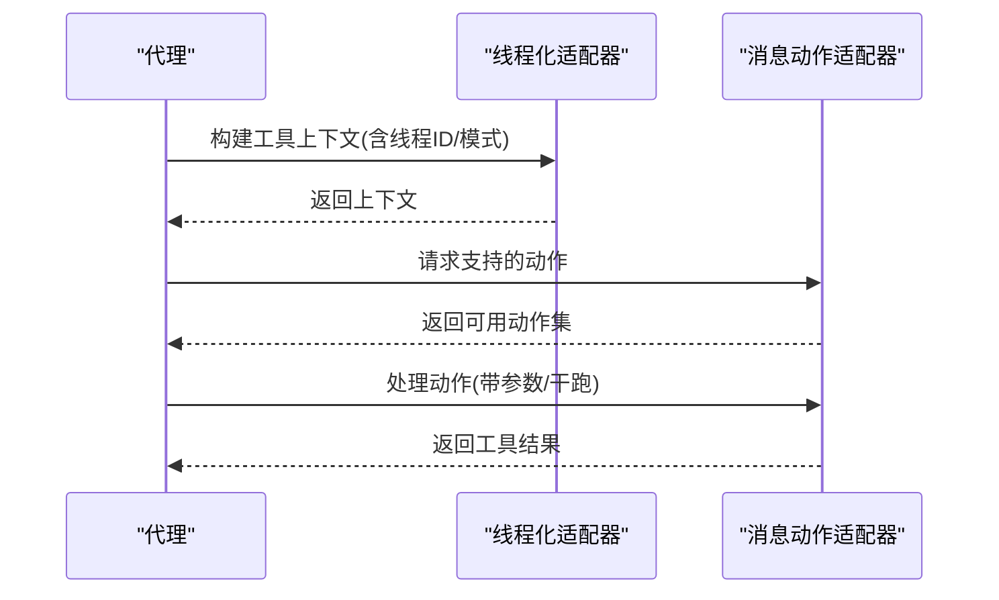

**图表来源**

- [src/channels/plugins/types.core.ts](file://src/channels/plugins/types.core.ts#L220-L258)
- [src/channels/plugins/types.core.ts](file://src/channels/plugins/types.core.ts#L314-L321)

**章节来源**

- [src/channels/plugins/types.core.ts](file://src/channels/plugins/types.core.ts#L220-L258)
- [src/channels/plugins/types.core.ts](file://src/channels/plugins/types.core.ts#L314-L321)

### 安全与心跳（ChannelSecurityAdapter / ChannelHeartbeatAdapter）

- 安全：解析 DM 策略、收集安全警告
- 心跳：检查就绪、解析收件人

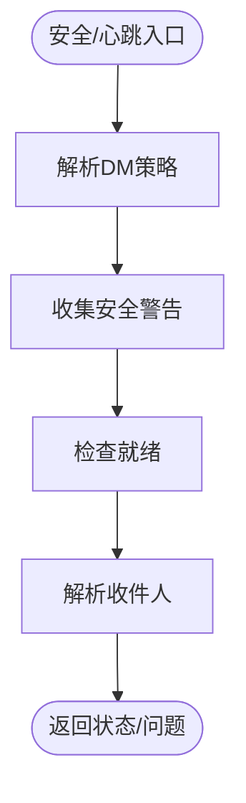

**图表来源**

- [src/channels/plugins/types.adapters.ts](file://src/channels/plugins/types.adapters.ts#L307-L312)
- [src/channels/plugins/types.adapters.ts](file://src/channels/plugins/types.adapters.ts#L220-L230)

**章节来源**

- [src/channels/plugins/types.adapters.ts](file://src/channels/plugins/types.adapters.ts#L307-L312)
- [src/channels/plugins/types.adapters.ts](file://src/channels/plugins/types.adapters.ts#L220-L230)

### 渠道停靠（ChannelDock）与默认行为

- 能力与默认：不同渠道的能力差异（聊天类型、投票、反应、媒体、原生命令、线程等）
- 允许来源格式化：针对不同渠道的前缀与大小写处理
- 线程上下文：根据平台特性构建工具上下文

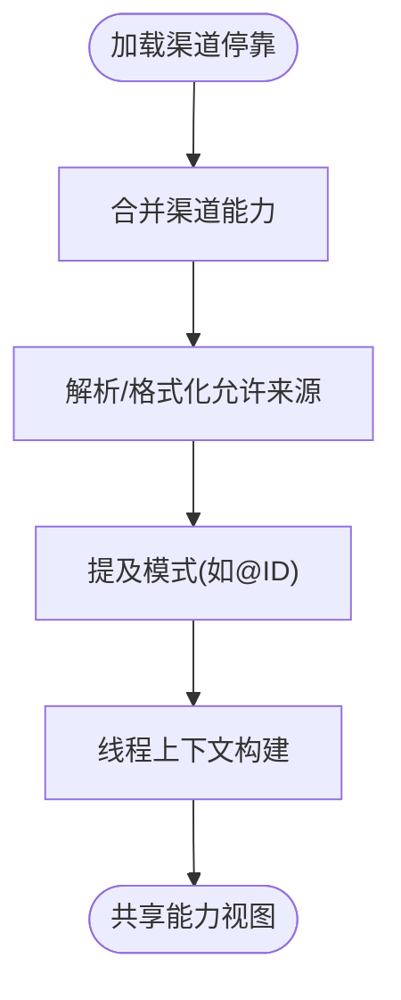

**图表来源**

- [src/channels/dock.ts](file://src/channels/dock.ts#L92-L444)

**章节来源**

- [src/channels/dock.ts](file://src/channels/dock.ts#L92-L444)

### 主流平台集成要点

#### Telegram

- 配置要点：botToken、dmPolicy、allowFrom、群组策略、回复模式、内联按钮、草稿流式、Webhook
- 行为特性：长轮询/Webhook、论坛主题线程、链接预览、音频/视频/贴纸、反应通知、配置写入
- 诊断与限制：隐私模式、命令注册失败、DNS/IPv6、重试与历史限制

**章节来源**

- [docs/channels/telegram.md](file://docs/channels/telegram.md#L1-L697)
- [src/channels/dock.ts](file://src/channels/dock.ts#L92-L128)

#### WhatsApp

- 配置要点：账户启用、authDir、允许来源、提及剥离、消息目标解析、目录查询
- 行为特性：E.164/JID、群组要求提及、工具策略、动作门控（反应/投票）

**章节来源**

- [extensions/whatsapp/src/channel.ts](file://extensions/whatsapp/src/channel.ts#L71-L261)
- [src/channels/dock.ts](file://src/channels/dock.ts#L129-L178)

#### Discord

- 能力与默认：投票、反应、媒体、线程、原生命令
- 允许来源与提及：正则剥离、线程模式

**章节来源**

- [src/channels/dock.ts](file://src/channels/dock.ts#L179-L218)

#### 其他平台

- IRC、Google Chat、Slack、Signal、iMessage 等：能力差异、文本分块限制、提及与线程策略

**章节来源**

- [src/channels/dock.ts](file://src/channels/dock.ts#L219-L444)

## 依赖关系分析

- 插件到适配器：ChannelPlugin 依赖各适配器接口
- 停靠到插件：ChannelDock 从插件构建，或使用内置默认行为
- 共享逻辑：outbound 适配器工厂按渠道返回消息适配器

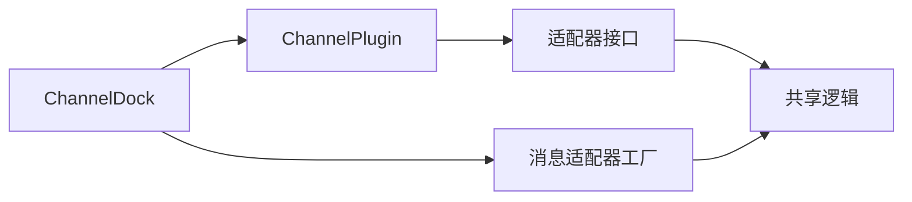

**图表来源**

- [src/channels/plugins/types.plugin.ts](file://src/channels/plugins/types.plugin.ts#L48-L84)
- [src/channels/dock.ts](file://src/channels/dock.ts#L447-L470)
- [src/infra/outbound/channel-adapters.ts](file://src/infra/outbound/channel-adapters.ts#L21-L26)

**章节来源**

- [src/channels/plugins/types.plugin.ts](file://src/channels/plugins/types.plugin.ts#L48-L84)
- [src/channels/dock.ts](file://src/channels/dock.ts#L447-L470)
- [src/infra/outbound/channel-adapters.ts](file://src/infra/outbound/channel-adapters.ts#L1-L26)

## 性能考量

- 文本分块与模式：合理设置 textChunkLimit 与 chunkMode，避免超限与重复拆分
- 流式输出：Telegram 草稿流式与块流式的选择，结合 blockStreamingCoalesceDefaults 控制拼接节奏
- 并发与序列化：长轮询按会话/线程序列化，避免并发冲突
- 网络与代理：DNS 解析、IPv6、代理与自动地址族选择影响稳定性

[本节为通用指导，无需特定文件引用]

## 故障排查指南

- Telegram
  - 非提及群消息无响应：检查隐私模式与 requireMention；使用探测命令验证
  - 命令不生效：确认授权来源与命令启用；关注 setMyCommands 失败提示
  - 轮询不稳定：检查 DNS/A/AAAA、网络代理与 IPv6 出口
- 渠道通用
  - 登录/登出：通过网关适配器触发，观察日志与 UI 状态
  - 目录/权限：核对 allowFrom、dmPolicy、群组策略与账户状态

**章节来源**

- [docs/channels/telegram.md](file://docs/channels/telegram.md#L626-L668)
- [ui/src/ui/types.ts](file://ui/src/ui/types.ts#L64-L128)
- [apps/macos/Sources/OpenClaw/ChannelsStore+Lifecycle.swift](file://apps/macos/Sources/OpenClaw/ChannelsStore+Lifecycle.swift#L121-L145)

## 结论

OpenClaw 的渠道插件体系以清晰的适配器契约与轻量停靠封装，实现了跨平台消息能力的一致抽象。通过标准化的配置、认证、目录、消息发送与线程化接口，开发者可以快速扩展新渠道，并在 Telegram、WhatsApp、Discord 等主流平台上获得稳定的集成体验。配合完善的诊断与性能建议，可显著降低集成成本与运维风险。

[本节为总结，无需特定文件引用]

## 附录

### 开发者指南（步骤）

- 定义 ChannelPlugin：填写 id、meta、capabilities，按需注入适配器
- 实现适配器：遵循 types.adapters.ts 中的接口约束，处理账户、认证、目录、发送、线程化等
- 配置 UI：提供 schema 与 UI 提示，支持 CLI 引导与可视化配置
- 注册与测试：将插件注册到运行时，使用 e2e/单元测试验证功能
- 调试与部署：利用日志、UI 状态与诊断命令定位问题，按平台要求配置证书/密钥/Webhook

**章节来源**

- [src/channels/plugins/types.plugin.ts](file://src/channels/plugins/types.plugin.ts#L48-L84)
- [src/channels/plugins/types.adapters.ts](file://src/channels/plugins/types.adapters.ts#L41-L273)
- [docs/channels/index.md](file://docs/channels/index.md#L14-L36)
