# 渠道插件开发指南

<cite>
**本文档引用的文件**
- [README.md](file://README.md)
- [extensions/telegram/openclaw.plugin.json](file://extensions/telegram/openclaw.plugin.json)
- [extensions/discord/openclaw.plugin.json](file://extensions/discord/openclaw.plugin.json)
- [extensions/whatsapp/openclaw.plugin.json](file://extensions/whatsapp/openclaw.plugin.json)
- [extensions/matrix/openclaw.plugin.json](file://extensions/matrix/openclaw.plugin.json)
- [extensions/telegram/index.ts](file://extensions/telegram/index.ts)
- [extensions/discord/index.ts](file://extensions/discord/index.ts)
- [extensions/whatsapp/index.ts](file://extensions/whatsapp/index.ts)
- [extensions/matrix/index.ts](file://extensions/matrix/index.ts)
- [docs/plugins/manifest.md](file://docs/plugins/manifest.md)
- [docs/plugins/agent-tools.md](file://docs/plugins/agent-tools.md)
- [docs/channels/telegram.md](file://docs/channels/telegram.md)
- [src/plugin-sdk/index.ts](file://src/plugin-sdk/index.ts)
</cite>

## 目录

1. [简介](#简介)
2. [项目结构](#项目结构)
3. [核心组件](#核心组件)
4. [架构概览](#架构概览)
5. [详细组件分析](#详细组件分析)
6. [依赖关系分析](#依赖关系分析)
7. [性能考虑](#性能考虑)
8. [故障排除指南](#故障排除指南)
9. [结论](#结论)
10. [附录](#附录)

## 简介

OpenClaw是一个个人AI助手平台，支持多种消息渠道集成。本指南专注于渠道插件开发，提供从零开始开发渠道插件的完整流程，包括项目初始化、接口实现、配置管理和测试策略。

OpenClaw支持的主要渠道包括：Telegram、WhatsApp、Discord、Slack、Google Chat、Signal、iMessage、Microsoft Teams、Matrix、Zalo等。每个渠道都通过独立的插件模块实现，使用统一的插件SDK接口。

## 项目结构

OpenClaw采用模块化架构，主要结构如下：

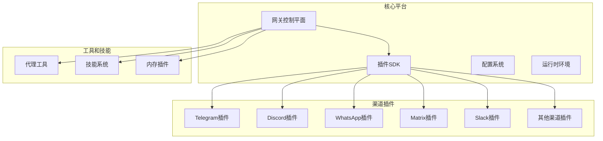

**图表来源**

- [README.md](file://README.md#L146-L149)
- [src/plugin-sdk/index.ts](file://src/plugin-sdk/index.ts#L1-L392)

**章节来源**

- [README.md](file://README.md#L146-L149)

## 核心组件

### 插件SDK架构

OpenClaw的插件系统基于统一的SDK接口，提供以下核心能力：

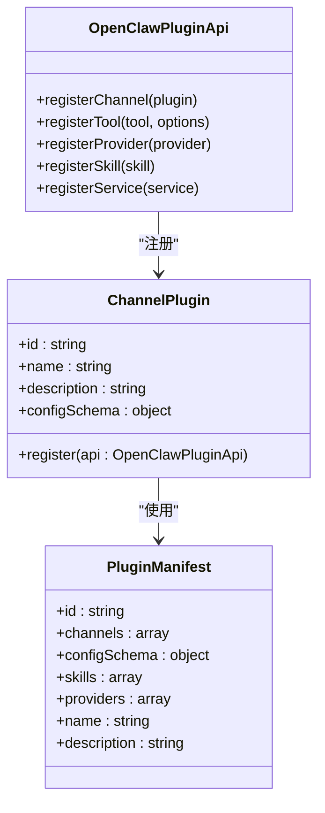

**图表来源**

- [src/plugin-sdk/index.ts](file://src/plugin-sdk/index.ts#L60-L78)
- [docs/plugins/manifest.md](file://docs/plugins/manifest.md#L18-L46)

### 渠道插件标准结构

每个渠道插件都遵循相同的标准化结构：

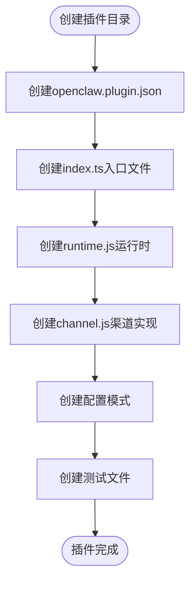

**图表来源**

- [extensions/telegram/index.ts](file://extensions/telegram/index.ts#L1-L18)
- [extensions/discord/index.ts](file://extensions/discord/index.ts#L1-L18)

**章节来源**

- [src/plugin-sdk/index.ts](file://src/plugin-sdk/index.ts#L1-L392)
- [docs/plugins/manifest.md](file://docs/plugins/manifest.md#L9-L72)

## 架构概览

### 插件生命周期

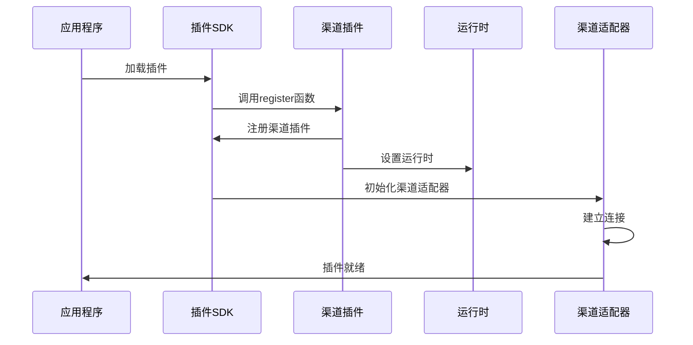

**图表来源**

- [extensions/telegram/index.ts](file://extensions/telegram/index.ts#L11-L14)
- [extensions/discord/index.ts](file://extensions/discord/index.ts#L11-L14)

### 配置验证流程

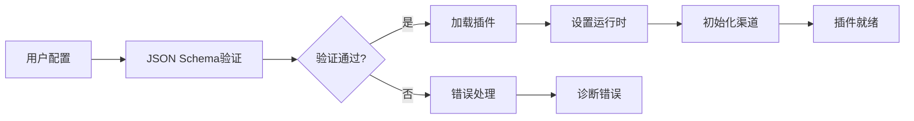

**图表来源**

- [docs/plugins/manifest.md](file://docs/plugins/manifest.md#L47-L63)

**章节来源**

- [docs/plugins/manifest.md](file://docs/plugins/manifest.md#L53-L63)

## 详细组件分析

### Telegram插件实现

Telegram插件是最成熟的渠道实现之一，提供了完整的功能集：

#### 插件清单配置

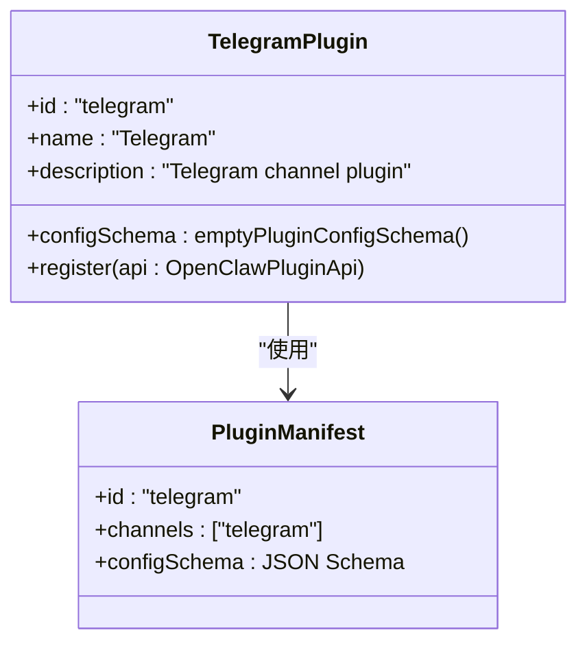

**图表来源**

- [extensions/telegram/index.ts](file://extensions/telegram/index.ts#L6-L15)
- [extensions/telegram/openclaw.plugin.json](file://extensions/telegram/openclaw.plugin.json#L1-L10)

#### 关键特性实现

Telegram插件实现了以下核心功能：

1. **消息路由**：支持私聊和群组消息的智能路由
2. **媒体处理**：支持图片、视频、音频等多媒体内容
3. **内联按钮**：支持交互式键盘按钮
4. **草稿流式传输**：支持实时消息流式输出
5. **论坛主题**：支持Telegram论坛的子主题管理

**章节来源**

- [extensions/telegram/index.ts](file://extensions/telegram/index.ts#L1-L18)
- [extensions/telegram/openclaw.plugin.json](file://extensions/telegram/openclaw.plugin.json#L1-L10)
- [docs/channels/telegram.md](file://docs/channels/telegram.md#L218-L624)

### Discord插件实现

Discord插件提供了企业级的消息传递功能：

#### 插件架构

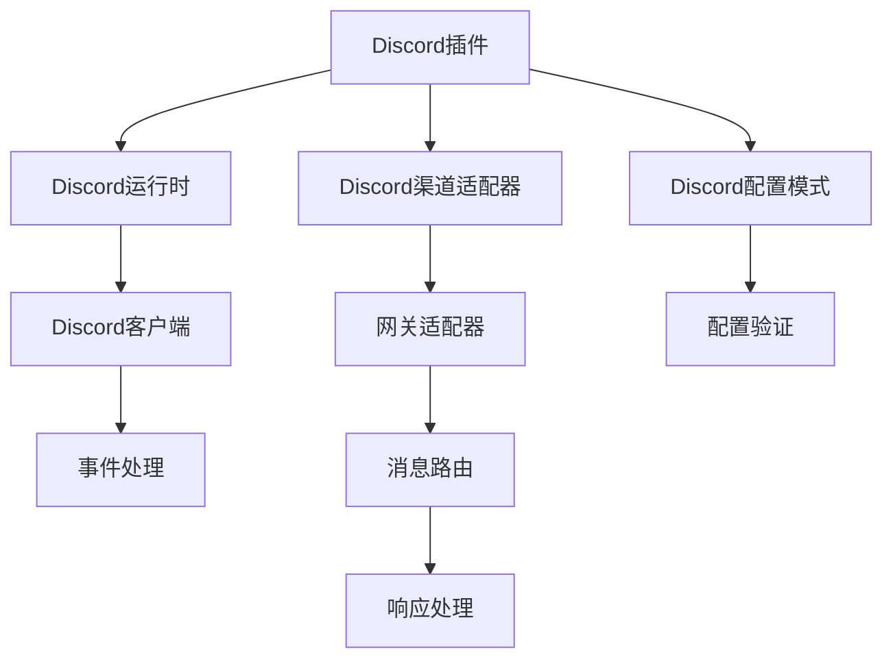

**图表来源**

- [extensions/discord/index.ts](file://extensions/discord/index.ts#L1-L18)

#### 核心功能

- **服务器管理**：支持多服务器配置和权限管理
- **频道路由**：支持文本频道和语音频道的智能路由
- **角色权限**：基于Discord角色的访问控制
- **嵌入消息**：支持富文本和多媒体嵌入

**章节来源**

- [extensions/discord/index.ts](file://extensions/discord/index.ts#L1-L18)
- [extensions/discord/openclaw.plugin.json](file://extensions/discord/openclaw.plugin.json#L1-L10)

### WhatsApp插件实现

WhatsApp插件基于Baileys库实现，提供原生的WhatsApp集成：

#### 技术架构

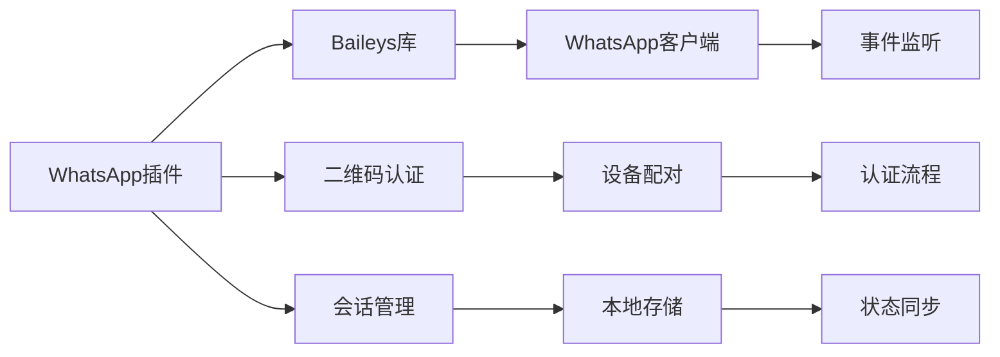

**图表来源**

- [extensions/whatsapp/index.ts](file://extensions/whatsapp/index.ts#L1-L18)

#### 认证机制

WhatsApp插件支持多种认证方式：

1. **二维码登录**：扫描二维码进行设备配对
2. **会话持久化**：保存登录状态以避免重复扫码
3. **多账户支持**：支持同时管理多个WhatsApp账号

**章节来源**

- [extensions/whatsapp/index.ts](file://extensions/whatsapp/index.ts#L1-L18)
- [extensions/whatsapp/openclaw.plugin.json](file://extensions/whatsapp/openclaw.plugin.json#L1-L10)

### Matrix插件实现

Matrix插件基于matrix-js-sdk，提供去中心化的通信功能：

#### 分布式架构

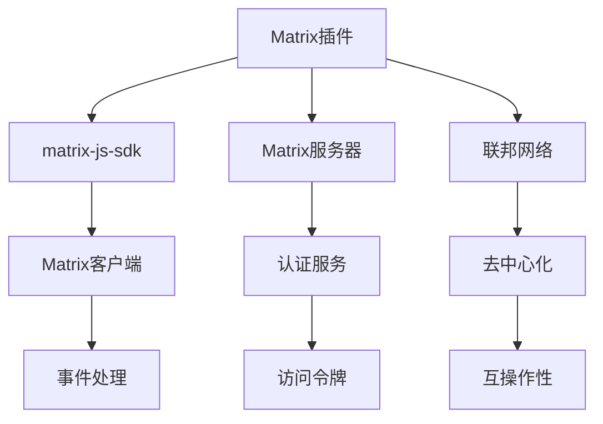

**图表来源**

- [extensions/matrix/index.ts](file://extensions/matrix/index.ts#L1-L18)

#### 去中心化特性

- **联邦协议**：支持与其他Matrix服务器通信
- **加密聊天**：端到端加密的私密聊天
- **分布式存储**：数据分布在多个服务器上
- **开放标准**：基于Matrix开源协议

**章节来源**

- [extensions/matrix/index.ts](file://extensions/matrix/index.ts#L1-L18)
- [extensions/matrix/openclaw.plugin.json](file://extensions/matrix/openclaw.plugin.json#L1-L10)

## 依赖关系分析

### 插件依赖图

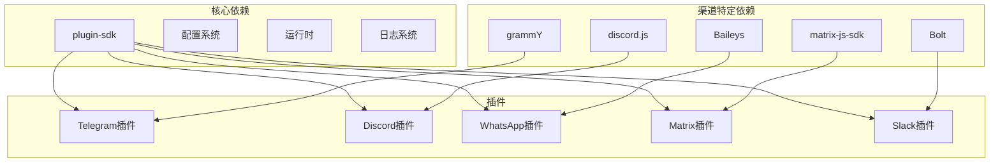

**图表来源**

- [src/plugin-sdk/index.ts](file://src/plugin-sdk/index.ts#L1-L392)

### 版本兼容性

| 组件         | 最低版本 | 推荐版本 | 兼容性      |
| ------------ | -------- | -------- | ----------- |
| Node.js      | 22.0     | 22.x     | ✅ 完全兼容 |
| TypeScript   | 5.0      | 5.x      | ✅ 完全兼容 |
| OpenClaw SDK | 1.0      | 最新版本 | ✅ 向后兼容 |
| 渠道库       | 各自版本 | 最新版本 | ⚠️ 需要测试 |

**章节来源**

- [README.md](file://README.md#L47-L50)

## 性能考虑

### 内存管理

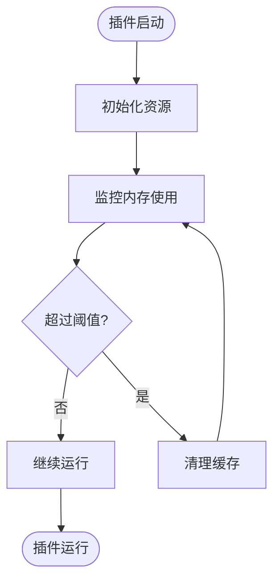

### 并发处理

- **消息并发**：使用队列系统处理并发消息
- **API限制**：遵守各平台的API速率限制
- **资源池**：复用数据库连接和HTTP客户端

### 缓存策略

- **会话缓存**：缓存活跃会话以减少重新认证
- **媒体缓存**：缓存已下载的媒体文件
- **配置缓存**：缓存配置以减少磁盘I/O

## 故障排除指南

### 常见问题诊断

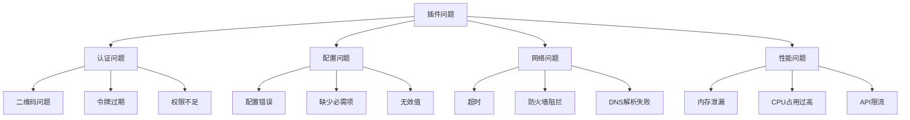

### 调试技巧

1. **启用详细日志**：使用`--verbose`参数获取详细信息
2. **检查配置验证**：确保`openclaw.plugin.json`格式正确
3. **测试网络连接**：验证对外部API的访问权限
4. **监控资源使用**：定期检查内存和CPU使用情况

**章节来源**

- [docs/plugins/manifest.md](file://docs/plugins/manifest.md#L53-L63)

## 结论

OpenClaw渠道插件开发提供了完整的框架和工具链，支持快速开发和部署各种消息渠道集成。通过遵循本文档的指导，开发者可以：

- 快速搭建新的渠道插件项目
- 实现标准的插件接口和配置模式
- 处理常见的集成挑战和故障
- 优化插件性能和资源使用

建议在开发过程中：

1. 参考现有成熟插件（如Telegram）的实现模式
2. 严格遵守配置验证规则
3. 充分测试各种边界情况
4. 持续监控插件性能指标

## 附录

### 开发最佳实践

1. **模块化设计**：将功能分解为独立的模块
2. **错误处理**：实现完善的错误捕获和恢复机制
3. **文档编写**：为每个插件编写详细的使用文档
4. **测试覆盖**：编写全面的单元测试和集成测试

### 发布流程

### 社区贡献

- 提交PR时请包含测试用例
- 更新相关文档和README
- 遵循代码风格指南
- 及时响应社区反馈
