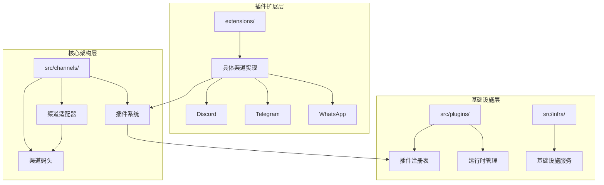
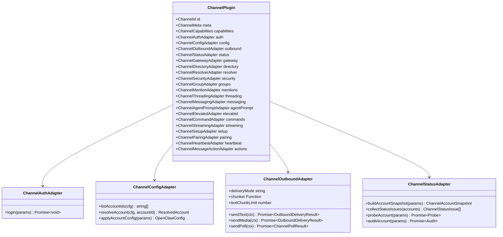
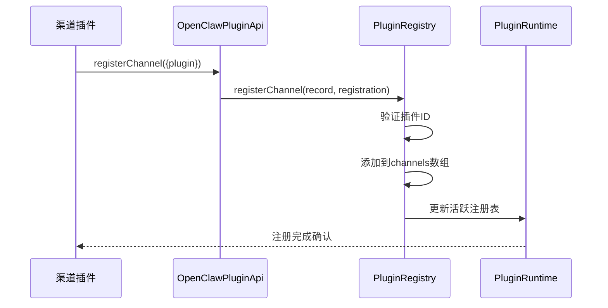
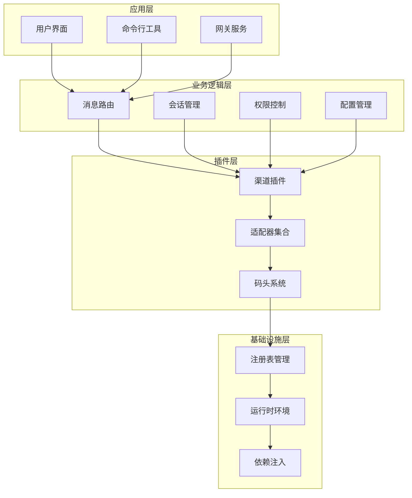
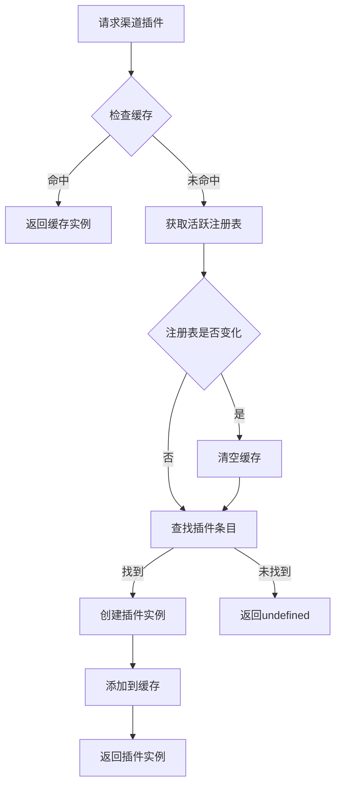
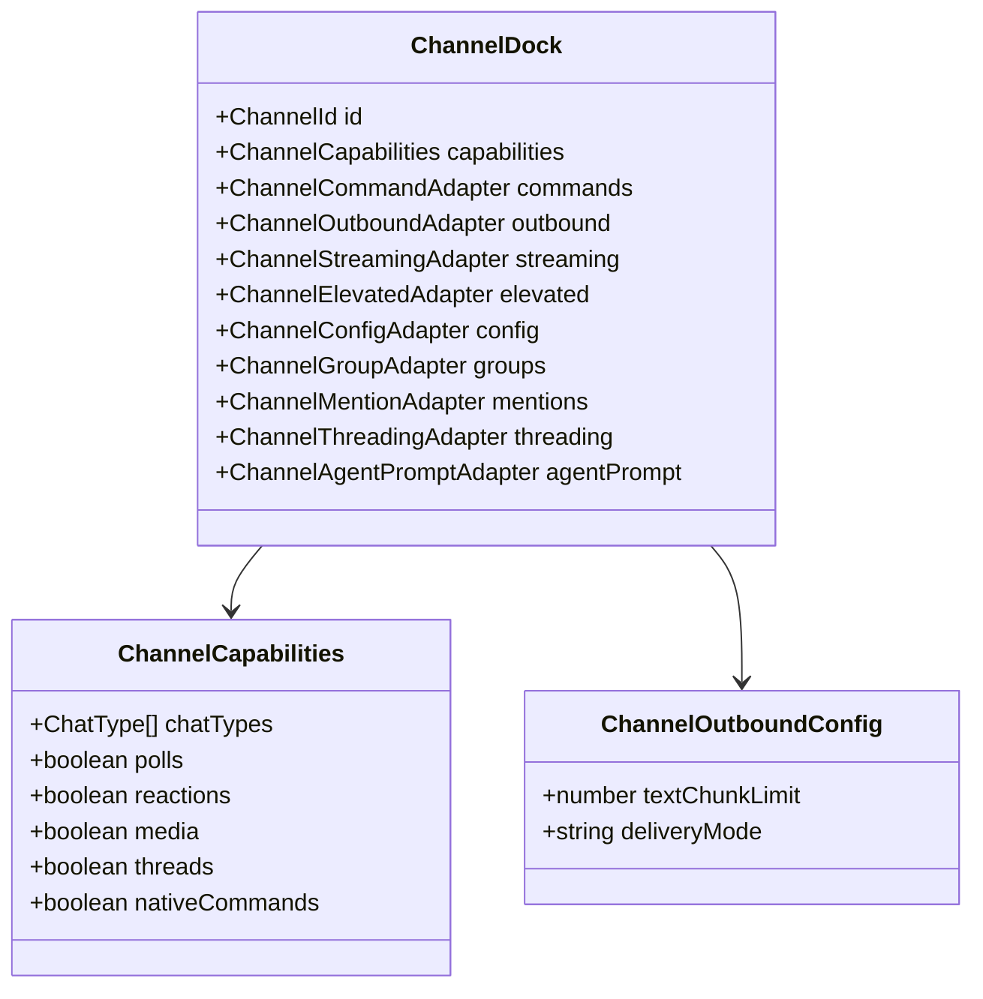
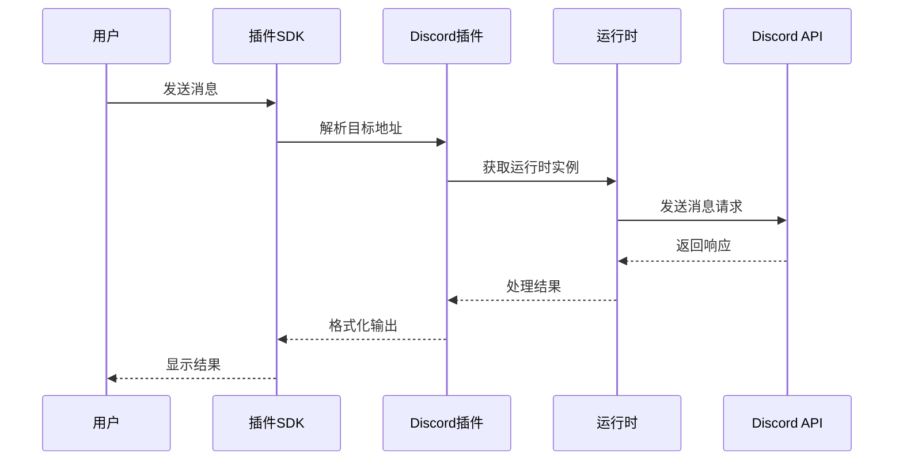

# 渠道插件架构设计

<cite>
**本文档引用的文件**
- [src/channels/plugins/types.ts](file://src/channels/plugins/types.ts)
- [src/channels/plugins/types.adapters.ts](file://src/channels/plugins/types.adapters.ts)
- [src/channels/plugins/types.core.ts](file://src/channels/plugins/types.core.ts)
- [src/channels/plugins/types.plugin.ts](file://src/channels/plugins/types.plugin.ts)
- [src/channels/plugins/load.ts](file://src/channels/plugins/load.ts)
- [src/channels/plugins/outbound/load.ts](file://src/channels/plugins/outbound/load.ts)
- [src/channels/dock.ts](file://src/channels/dock.ts)
- [src/plugins/registry.ts](file://src/plugins/registry.ts)
- [src/plugins/runtime.ts](file://src/plugins/runtime.ts)
- [extensions/discord/index.ts](file://extensions/discord/index.ts)
- [extensions/discord/src/channel.ts](file://extensions/discord/src/channel.ts)
- [extensions/telegram/index.ts](file://extensions/telegram/index.ts)
- [src/plugin-sdk/index.ts](file://src/plugin-sdk/index.ts)
- [src/infra/outbound/target-resolver.ts](file://src/infra/outbound/target-resolver.ts)
</cite>

## 目录

1. [引言](#引言)
2. [项目结构](#项目结构)
3. [核心组件](#核心组件)
4. [架构概览](#架构概览)
5. [详细组件分析](#详细组件分析)
6. [依赖分析](#依赖分析)
7. [性能考虑](#性能考虑)
8. [故障排除指南](#故障排除指南)
9. [结论](#结论)

## 引言

OpenClaw渠道插件架构是一个高度模块化的系统，采用适配器模式设计，支持多种通信渠道（Discord、Telegram、WhatsApp等）的统一接入。该架构通过标准化的插件接口和灵活的注册机制，实现了渠道功能的可扩展性和可维护性。

## 项目结构

OpenClaw项目采用分层架构设计，主要包含以下核心目录：



**图表来源**

- [src/channels/plugins/types.ts](file://src/channels/plugins/types.ts#L1-L64)
- [src/plugins/registry.ts](file://src/plugins/registry.ts#L1-L516)

**章节来源**

- [src/channels/plugins/types.ts](file://src/channels/plugins/types.ts#L1-L64)
- [src/plugins/registry.ts](file://src/plugins/registry.ts#L1-L516)

## 核心组件

### 适配器模式架构

OpenClaw采用经典的适配器模式，将不同渠道的差异封装在标准化接口中：



**图表来源**

- [src/channels/plugins/types.adapters.ts](file://src/channels/plugins/types.adapters.ts#L22-L313)
- [src/channels/plugins/types.core.ts](file://src/channels/plugins/types.core.ts#L15-L338)

### 插件注册机制

插件系统通过注册表管理所有已加载的渠道插件：



**图表来源**

- [src/plugins/registry.ts](file://src/plugins/registry.ts#L328-L354)
- [src/plugins/runtime.ts](file://src/plugins/runtime.ts#L39-L57)

**章节来源**

- [src/channels/plugins/types.adapters.ts](file://src/channels/plugins/types.adapters.ts#L1-L313)
- [src/channels/plugins/types.core.ts](file://src/channels/plugins/types.core.ts#L1-L338)
- [src/plugins/registry.ts](file://src/plugins/registry.ts#L1-L516)
- [src/plugins/runtime.ts](file://src/plugins/runtime.ts#L1-L58)

## 架构概览

OpenClaw渠道插件架构采用分层设计，确保了高内聚低耦合的系统结构：



**图表来源**

- [src/channels/dock.ts](file://src/channels/dock.ts#L44-L68)
- [src/plugins/registry.ts](file://src/plugins/registry.ts#L124-L138)

## 详细组件分析

### 渠道插件核心接口

#### ChannelAuthAdapter - 认证适配器

负责处理渠道特定的认证流程，支持多种认证方式：

- OAuth认证
- API密钥认证
- 扫码登录
- 环境变量认证

#### ChannelConfigAdapter - 配置适配器

管理渠道账户配置的完整生命周期：

- 账户列表管理
- 配置验证
- 动态配置更新
- 启用状态管理

#### ChannelOutboundAdapter - 出站消息适配器

处理消息发送的核心组件：

- 文本消息发送
- 媒体内容传输
- 投票功能支持
- 分块发送优化

#### ChannelStatusAdapter - 状态适配器

监控和报告渠道连接状态：

- 运行时状态跟踪
- 健康检查
- 错误诊断
- 性能指标收集

### 插件加载与缓存机制

系统实现了智能的插件加载和缓存策略：



**图表来源**

- [src/channels/plugins/load.ts](file://src/channels/plugins/load.ts#L16-L29)
- [src/channels/plugins/outbound/load.ts](file://src/channels/plugins/outbound/load.ts#L21-L37)

### 渠道码头系统

ChannelDock提供了轻量级的渠道元数据和行为定义：



**图表来源**

- [src/channels/dock.ts](file://src/channels/dock.ts#L44-L68)
- [src/channels/dock.ts](file://src/channels/dock.ts#L92-L445)

**章节来源**

- [src/channels/plugins/load.ts](file://src/channels/plugins/load.ts#L1-L29)
- [src/channels/plugins/outbound/load.ts](file://src/channels/plugins/outbound/load.ts#L1-L37)
- [src/channels/dock.ts](file://src/channels/dock.ts#L1-L525)

### 具体渠道实现示例

以Discord渠道为例，展示完整的插件实现模式：



**图表来源**

- [extensions/discord/src/channel.ts](file://extensions/discord/src/channel.ts#L288-L311)
- [extensions/discord/src/channel.ts](file://extensions/discord/src/channel.ts#L418-L427)

**章节来源**

- [extensions/discord/src/channel.ts](file://extensions/discord/src/channel.ts#L1-L430)
- [extensions/discord/index.ts](file://extensions/discord/index.ts#L1-L18)
- [extensions/telegram/index.ts](file://extensions/telegram/index.ts#L1-L18)

## 依赖分析

### 组件间依赖关系

```mermaid
graph LR
subgraph "核心依赖"
A[ChannelPlugin] --> B[ChannelAuthAdapter]
A --> C[ChannelConfigAdapter]
A --> D[ChannelOutboundAdapter]
A --> E[ChannelStatusAdapter]
end
subgraph "运行时依赖"
F[PluginRuntime] --> G[PluginRegistry]
G --> H[活跃注册表]
H --> I[渠道插件实例]
end
subgraph "外部依赖"
J[渠道API] <- --> K[HTTP客户端]
L[配置存储] <- --> M[Zod配置验证]
N[日志系统] <- --> O[结构化日志]
end
A --> J
C --> L
D --> K
E --> N
G --> F
```

**图表来源**

- [src/channels/plugins/types.adapters.ts](file://src/channels/plugins/types.adapters.ts#L1-L313)
- [src/plugins/runtime.ts](file://src/plugins/runtime.ts#L1-L58)
- [src/plugins/registry.ts](file://src/plugins/registry.ts#L1-L516)

### 模块化设计原则

1. **单一职责原则**: 每个适配器只负责特定的功能领域
2. **开闭原则**: 通过接口扩展新渠道，无需修改现有代码
3. **依赖倒置原则**: 高层模块不依赖于低层模块的具体实现
4. **接口隔离原则**: 将复杂的适配器接口拆分为更小的专用接口

**章节来源**

- [src/channels/plugins/types.ts](file://src/channels/plugins/types.ts#L1-L64)
- [src/plugins/registry.ts](file://src/plugins/registry.ts#L1-L516)
- [src/plugins/runtime.ts](file://src/plugins/runtime.ts#L1-L58)

## 性能考虑

### 缓存策略

系统实现了多层次的缓存机制来优化性能：

1. **插件实例缓存**: 避免重复创建相同的插件实例
2. **注册表变更检测**: 当注册表发生变化时自动清理缓存
3. **轻量级码头缓存**: 通道码头信息的快速访问

### 并发处理

- 异步插件加载避免阻塞主进程
- 并行渠道操作提升整体吞吐量
- 连接池管理减少资源消耗

## 故障排除指南

### 常见问题诊断

1. **插件加载失败**
   - 检查插件ID格式和唯一性
   - 验证配置模式的有效性
   - 确认运行时依赖的完整性

2. **渠道连接问题**
   - 验证认证凭据的有效性
   - 检查网络连接和防火墙设置
   - 查看渠道API的速率限制

3. **消息发送失败**
   - 确认目标地址的正确性
   - 检查媒体文件的大小和格式
   - 验证权限设置和白名单配置

**章节来源**

- [src/channels/plugins/types.adapters.ts](file://src/channels/plugins/types.adapters.ts#L108-L147)
- [src/infra/outbound/target-resolver.ts](file://src/infra/outbound/target-resolver.ts#L215-L255)

## 结论

OpenClaw渠道插件架构通过精心设计的适配器模式和模块化结构，成功实现了多渠道支持的统一解决方案。该架构具有以下优势：

1. **高度可扩展性**: 新增渠道只需实现标准接口
2. **强类型安全**: TypeScript类型系统确保代码质量
3. **灵活的配置管理**: 支持动态配置和热重载
4. **完善的错误处理**: 全面的异常捕获和恢复机制
5. **优秀的性能表现**: 智能缓存和并发处理优化

这种设计为构建复杂的企业级通信平台提供了坚实的基础，同时保持了良好的可维护性和可扩展性。
