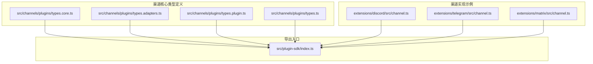
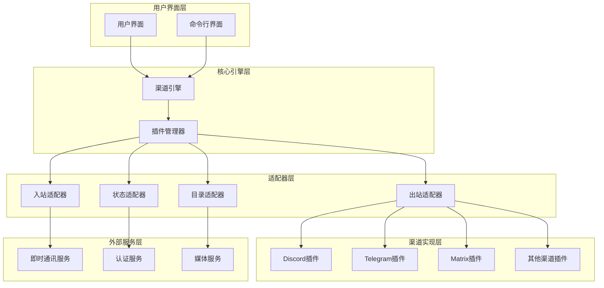
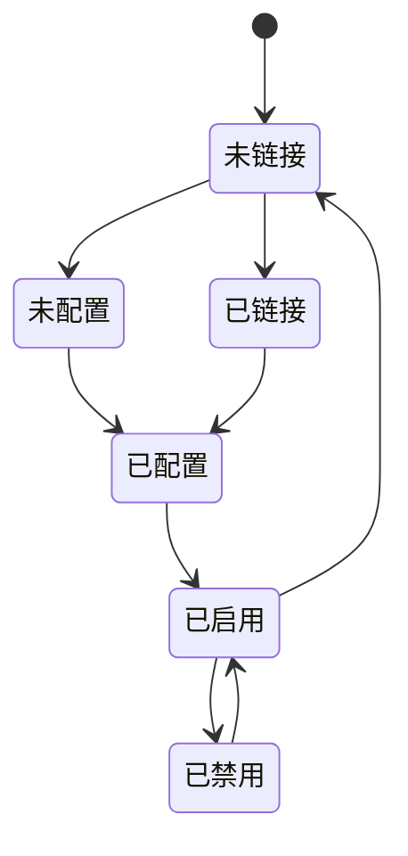
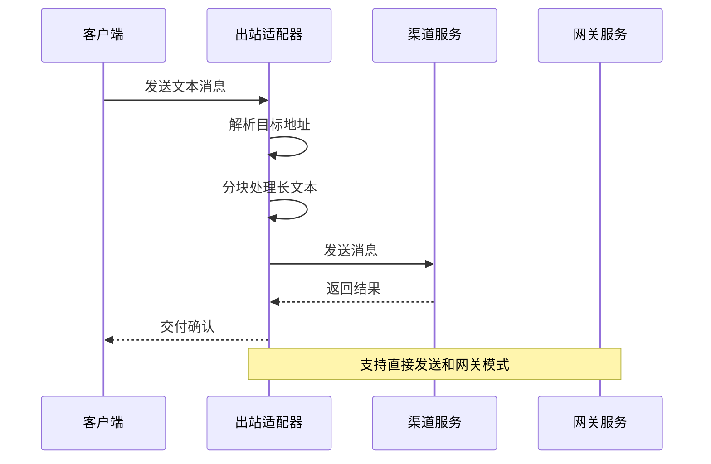
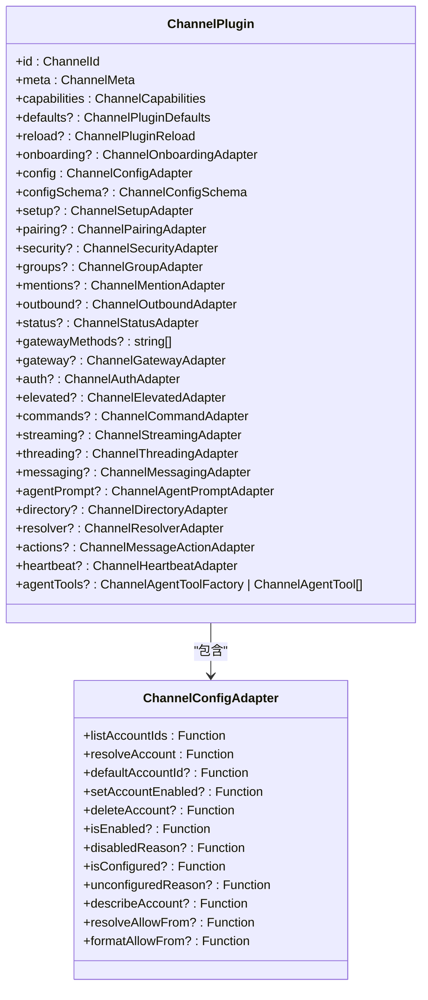

# 渠道核心类型定义

<cite>
**本文档引用的文件**
- [src/channels/plugins/types.core.ts](file://src/channels/plugins/types.core.ts)
- [src/channels/plugins/types.adapters.ts](file://src/channels/plugins/types.adapters.ts)
- [src/channels/plugins/types.plugin.ts](file://src/channels/plugins/types.plugin.ts)
- [src/channels/plugins/types.ts](file://src/channels/plugins/types.ts)
- [extensions/discord/src/channel.ts](file://extensions/discord/src/channel.ts)
- [extensions/telegram/src/channel.ts](file://extensions/telegram/src/channel.ts)
- [extensions/matrix/src/channel.ts](file://extensions/matrix/src/channel.ts)
</cite>

## 目录

1. [简介](#简介)
2. [项目结构](#项目结构)
3. [核心组件](#核心组件)
4. [架构概览](#架构概览)
5. [详细组件分析](#详细组件分析)
6. [依赖分析](#依赖分析)
7. [性能考虑](#性能考虑)
8. [故障排除指南](#故障排除指南)
9. [结论](#结论)

## 简介

OpenClaw渠道核心类型定义是整个渠道插件系统的基础架构。本文档深入解析渠道插件系统中的核心数据类型，包括ChannelAccountState、ChannelDirectoryEntry、ChannelGroupContext、ChannelMessageActionContext等关键类型。这些类型构成了OpenClaw渠道系统的数据骨架，定义了不同渠道之间的统一接口和数据交换格式。

渠道插件系统采用模块化设计，通过标准化的类型定义实现了对多种即时通讯平台（如Discord、Telegram、Matrix等）的统一支持。每个渠道都遵循相同的类型契约，确保了系统的可扩展性和维护性。

## 项目结构

OpenClaw的渠道核心类型定义主要分布在以下位置：



**图表来源**

- [src/channels/plugins/types.core.ts](file://src/channels/plugins/types.core.ts#L1-L338)
- [src/channels/plugins/types.adapters.ts](file://src/channels/plugins/types.adapters.ts#L1-L313)
- [src/channels/plugins/types.plugin.ts](file://src/channels/plugins/types.plugin.ts#L1-L85)
- [src/channels/plugins/types.ts](file://src/channels/plugins/types.ts#L1-L63)

**章节来源**

- [src/channels/plugins/types.core.ts](file://src/channels/plugins/types.core.ts#L1-L338)
- [src/channels/plugins/types.adapters.ts](file://src/channels/plugins/types.adapters.ts#L1-L313)
- [src/channels/plugins/types.plugin.ts](file://src/channels/plugins/types.plugin.ts#L1-L85)
- [src/channels/plugins/types.ts](file://src/channels/plugins/types.ts#L1-L63)

## 核心组件

### 类型系统概述

OpenClaw的渠道类型系统采用分层设计，主要分为三个层次：

1. **核心类型层**：定义基础数据结构和通用接口
2. **适配器类型层**：定义各渠道特定的功能接口
3. **插件类型层**：组合所有功能形成完整的渠道插件

```mermaid
classDiagram
class ChannelAccountState {
<<enumeration>>
"linked"
"not linked"
"configured"
"not configured"
"enabled"
"disabled"
}
class ChannelDirectoryEntry {
+kind : ChannelDirectoryEntryKind
+id : string
+name? : string
+handle? : string
+avatarUrl? : string
+rank? : number
+raw? : unknown
}
class ChannelGroupContext {
+cfg : OpenClawConfig
+groupId? : string
+groupChannel? : string
+groupSpace? : string
+accountId? : string
+senderId? : string
+senderName? : string
+senderUsername? : string
+senderE164? : string
}
class ChannelMessageActionContext {
+channel : ChannelId
+action : ChannelMessageActionName
+cfg : OpenClawConfig
+params : Record[string, unknown]
+accountId? : string
+gateway? : GatewayContext
+toolContext? : ChannelThreadingToolContext
+dryRun? : boolean
}
class ChannelOutboundAdapter {
+deliveryMode : "direct" | "gateway" | "hybrid"
+chunker? : Function
+chunkerMode? : "text" | "markdown"
+textChunkLimit? : number
+pollMaxOptions? : number
+resolveTarget? : Function
+sendPayload? : Function
+sendText? : Function
+sendMedia? : Function
+sendPoll? : Function
}
ChannelDirectoryEntry --> ChannelDirectoryEntryKind : "uses"
ChannelMessageActionContext --> ChannelMessageActionName : "uses"
ChannelOutboundAdapter --> ChannelOutboundTargetMode : "uses"
```

**图表来源**

- [src/channels/plugins/types.core.ts](file://src/channels/plugins/types.core.ts#L61-L338)
- [src/channels/plugins/types.adapters.ts](file://src/channels/plugins/types.adapters.ts#L89-L106)

**章节来源**

- [src/channels/plugins/types.core.ts](file://src/channels/plugins/types.core.ts#L61-L338)
- [src/channels/plugins/types.adapters.ts](file://src/channels/plugins/types.adapters.ts#L89-L106)

## 架构概览

OpenClaw的渠道插件系统采用插件化架构，通过标准化的类型定义实现对多渠道的支持：



**图表来源**

- [src/channels/plugins/types.plugin.ts](file://src/channels/plugins/types.plugin.ts#L48-L84)
- [src/channels/plugins/types.adapters.ts](file://src/channels/plugins/types.adapters.ts#L89-L313)

## 详细组件分析

### ChannelAccountState 类型

ChannelAccountState定义了渠道账户的状态枚举，用于表示账户在不同阶段的配置状态。



**图表来源**

- [src/channels/plugins/types.core.ts](file://src/channels/plugins/types.core.ts#L61-L67)

**字段定义**：

- `linked`: 账户已成功链接到渠道服务
- `not linked`: 账户未链接到渠道服务
- `configured`: 账户已完成基本配置
- `not configured`: 账户未完成配置
- `enabled`: 账户处于启用状态
- `disabled`: 账户处于禁用状态

**使用场景**：

- 账户状态监控和显示
- 权限控制和访问限制
- 生命周期管理

**章节来源**

- [src/channels/plugins/types.core.ts](file://src/channels/plugins/types.core.ts#L61-L67)

### ChannelDirectoryEntry 类型

ChannelDirectoryEntry定义了渠道目录条目的数据结构，用于表示用户、群组或频道的信息。

**字段定义**：

- `kind`: 条目类型（user/group/channel）
- `id`: 唯一标识符
- `name`: 显示名称
- `handle`: 用户名或处理名
- `avatarUrl`: 头像URL
- `rank`: 排序权重
- `raw`: 原始数据对象

**数据结构复杂度**：

- 时间复杂度：O(1) 访问所有字段
- 空间复杂度：O(n) 存储原始数据

**使用场景**：

- 用户和群组列表展示
- 消息提及解析
- 目录查询和搜索

**章节来源**

- [src/channels/plugins/types.core.ts](file://src/channels/plugins/types.core.ts#L279-L287)

### ChannelGroupContext 类型

ChannelGroupContext提供了群组上下文信息，用于在群组环境中执行操作时传递相关参数。

**字段定义**：

- `cfg`: OpenClaw配置对象
- `groupId`: 群组ID
- `groupChannel`: 频道名称
- `groupSpace`: 空间信息
- `accountId`: 账户ID
- `senderId`: 发送者ID
- `senderName`: 发送者名称
- `senderUsername`: 发送者用户名
- `senderE164`: 发送者E164号码

**使用场景**：

- 群组消息处理
- 权限验证和策略应用
- 上下文感知的操作执行

**章节来源**

- [src/channels/plugins/types.core.ts](file://src/channels/plugins/types.core.ts#L156-L167)

### ChannelMessageActionContext 类型

ChannelMessageActionContext定义了消息动作执行的上下文信息，支持各种消息操作如编辑、删除、反应等。

**字段定义**：

- `channel`: 渠道标识符
- `action`: 动作名称
- `cfg`: 配置对象
- `params`: 参数映射
- `accountId`: 账户ID
- `gateway`: 网关配置
- `toolContext`: 工具上下文
- `dryRun`: 是否为预演模式

**使用场景**：

- 消息动作处理（编辑、删除、反应）
- 工具调用和集成
- 预演和调试模式

**章节来源**

- [src/channels/plugins/types.core.ts](file://src/channels/plugins/types.core.ts#L291-L307)

### ChannelOutboundAdapter 类型

ChannelOutboundAdapter定义了出站消息发送的适配器接口，支持多种消息类型和传输模式。



**图表来源**

- [src/channels/plugins/types.adapters.ts](file://src/channels/plugins/types.adapters.ts#L89-L106)

**字段定义**：

- `deliveryMode`: 交付模式（direct/gateway/hybrid）
- `chunker`: 文本分块函数
- `chunkerMode`: 分块模式
- `textChunkLimit`: 文本分块限制
- `pollMaxOptions`: 投票选项最大数量
- `resolveTarget`: 目标解析函数
- `sendPayload`: 负载发送函数
- `sendText`: 文本发送函数
- `sendMedia`: 媒体发送函数
- `sendPoll`: 投票发送函数

**使用场景**：

- 文本消息发送
- 媒体内容传输
- 交互式投票创建
- 自动分块和重试机制

**章节来源**

- [src/channels/plugins/types.adapters.ts](file://src/channels/plugins/types.adapters.ts#L89-L106)

### ChannelPlugin 类型

ChannelPlugin是渠道插件的完整接口定义，组合了所有必要的适配器和功能。



**图表来源**

- [src/channels/plugins/types.plugin.ts](file://src/channels/plugins/types.plugin.ts#L48-L84)

**字段定义**：

- `id`: 渠道唯一标识符
- `meta`: 渠道元数据
- `capabilities`: 渠道功能能力
- `defaults`: 插件默认配置
- `reload`: 重新加载配置
- `onboarding`: 引导流程适配器
- `config`: 配置管理适配器
- `configSchema`: 配置模式定义
- `setup`: 设置流程适配器
- `pairing`: 配对管理适配器
- `security`: 安全策略适配器
- `groups`: 群组管理适配器
- `mentions`: 提及处理适配器
- `outbound`: 出站消息适配器
- `status`: 状态监控适配器
- `gatewayMethods`: 网关方法列表
- `gateway`: 网关管理适配器
- `auth`: 认证适配器
- `elevated`: 提升权限适配器
- `commands`: 命令处理适配器
- `streaming`: 流式传输适配器
- `threading`: 线程管理适配器
- `messaging`: 消息处理适配器
- `agentPrompt`: 代理提示适配器
- `directory`: 目录服务适配器
- `resolver`: 目标解析适配器
- `actions`: 消息动作适配器
- `heartbeat`: 心跳检测适配器
- `agentTools`: 代理工具工厂

**使用场景**：

- 渠道插件开发
- 功能模块组合
- 生命周期管理
- 配置和状态维护

**章节来源**

- [src/channels/plugins/types.plugin.ts](file://src/channels/plugins/types.plugin.ts#L48-L84)

## 依赖分析

OpenClaw渠道类型系统具有清晰的依赖关系和模块化设计：

```mermaid
graph TD
subgraph "核心依赖"
Core[types.core.ts]
Adapters[types.adapters.ts]
Plugin[types.plugin.ts]
Types[types.ts]
end
subgraph "渠道实现"
Discord[discord/channel.ts]
Telegram[telegram/channel.ts]
Matrix[matrix/channel.ts]
end
subgraph "外部依赖"
Config[config/config.js]
Utils[utils/message-channel.js]
AutoReply[auto-reply/templating.js]
TypeBox[@sinclair/typebox]
end
Core --> Config
Core --> Utils
Core --> AutoReply
Core --> TypeBox
Adapters --> Core
Plugin --> Core
Plugin --> Adapters
Discord --> Plugin
Telegram --> Plugin
Matrix --> Plugin
Types --> Core
Types --> Adapters
Types --> Plugin
```

**图表来源**

- [src/channels/plugins/types.core.ts](file://src/channels/plugins/types.core.ts#L1-L10)
- [src/channels/plugins/types.adapters.ts](file://src/channels/plugins/types.adapters.ts#L1-L20)
- [src/channels/plugins/types.plugin.ts](file://src/channels/plugins/types.plugin.ts#L1-L30)

**依赖关系分析**：

- 核心类型依赖于配置系统和工具库
- 适配器类型依赖于核心类型
- 插件类型组合了核心类型和适配器类型
- 渠道实现依赖于插件类型定义
- 导出入口统一暴露所有类型定义

**章节来源**

- [src/channels/plugins/types.core.ts](file://src/channels/plugins/types.core.ts#L1-L10)
- [src/channels/plugins/types.adapters.ts](file://src/channels/plugins/types.adapters.ts#L1-L20)
- [src/channels/plugins/types.plugin.ts](file://src/channels/plugins/types.plugin.ts#L1-L30)

## 性能考虑

OpenClaw渠道类型系统在设计时充分考虑了性能优化：

### 内存管理

- 使用只读类型定义减少内存分配
- 泛型约束确保类型安全的同时保持运行时效率
- 可选字段设计避免不必要的内存占用

### 类型检查优化

- 编译时类型检查减少运行时错误
- 泛型推断提高代码复用率
- 接口分离降低耦合度

### 并发处理

- 异步适配器支持非阻塞操作
- 流式传输适配器优化大数据传输
- 连接池和重用机制减少资源消耗

## 故障排除指南

### 常见类型错误

**类型不匹配错误**：

- 确保ChannelId类型与具体渠道实现一致
- 验证ChannelMessageActionName枚举值的有效性
- 检查泛型参数的正确性

**配置验证失败**：

- 使用ChannelSetupAdapter.validateInput进行输入验证
- 检查必需字段是否完整
- 验证配置格式和范围

**适配器实现错误**：

- 确保所有必需的适配器方法都已实现
- 验证返回值类型符合预期
- 检查异步方法的正确处理

### 调试技巧

**类型检查**：

- 使用TypeScript编译器检查类型定义
- 利用IDE的类型提示功能
- 实现最小可复现示例

**日志记录**：

- 在关键节点添加日志输出
- 记录类型转换和验证过程
- 监控性能指标和错误率

**章节来源**

- [src/channels/plugins/types.core.ts](file://src/channels/plugins/types.core.ts#L19-L51)
- [src/channels/plugins/types.adapters.ts](file://src/channels/plugins/types.adapters.ts#L22-L39)

## 结论

OpenClaw渠道核心类型定义展现了现代软件架构的设计理念，通过标准化的类型系统实现了高度的模块化和可扩展性。核心类型如ChannelAccountState、ChannelDirectoryEntry、ChannelGroupContext、ChannelMessageActionContext等为整个渠道插件系统提供了坚实的数据基础。

类型系统的成功体现在以下几个方面：

1. **一致性**：统一的类型定义确保了不同渠道间的兼容性
2. **可扩展性**：模块化的类型设计支持新渠道的快速集成
3. **类型安全**：严格的类型检查减少了运行时错误
4. **性能优化**：合理的数据结构和算法提高了系统效率

通过深入理解和正确使用这些核心类型，开发者可以构建稳定、高效且易于维护的渠道插件系统。未来的发展方向包括进一步优化类型系统的性能、增强类型安全性以及扩展对更多即时通讯平台的支持。
