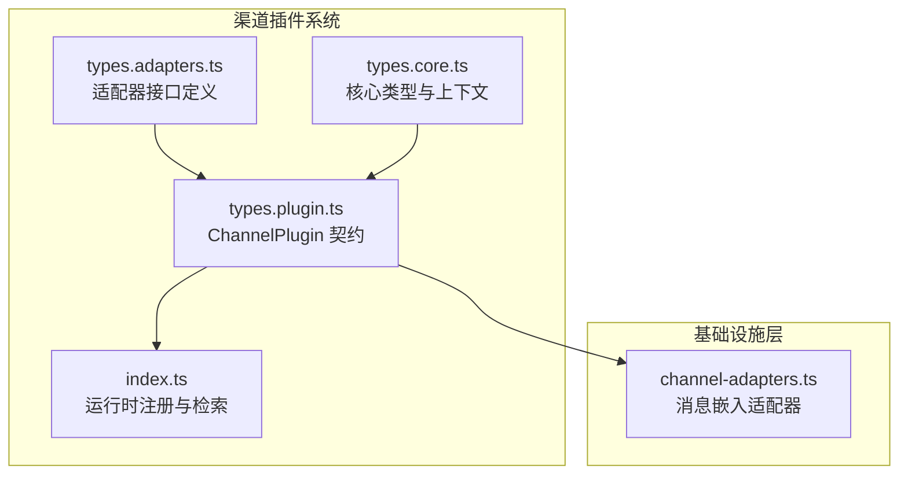
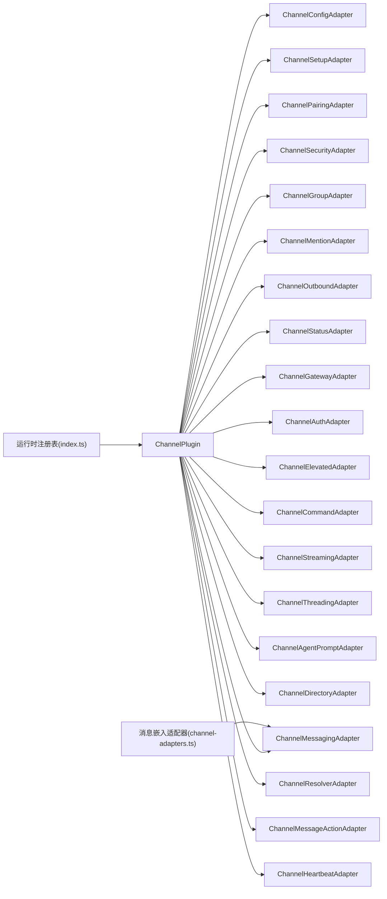

# 渠道适配器接口

<cite>
**本文档引用的文件**
- [types.adapters.ts](file://src/channels/plugins/types.adapters.ts)
- [types.core.ts](file://src/channels/plugins/types.core.ts)
- [types.plugin.ts](file://src/channels/plugins/types.plugin.ts)
- [channel-adapters.ts](file://src/infra/outbound/channel-adapters.ts)
- [index.ts](file://src/channels/plugins/index.ts)
</cite>

## 目录

1. [简介](#简介)
2. [项目结构](#项目结构)
3. [核心组件](#核心组件)
4. [架构总览](#架构总览)
5. [详细组件分析](#详细组件分析)
6. [依赖关系分析](#依赖关系分析)
7. [性能考量](#性能考量)
8. [故障排查指南](#故障排查指南)
9. [结论](#结论)

## 简介

本文件为 OpenClaw 渠道适配器接口的权威 API 参考，覆盖认证、消息、目录、解析等核心适配器接口的定义、方法签名、参数类型、返回值与异常处理建议，并给出最佳实践与常见陷阱。文档同时阐述适配器之间的协作模式与数据流转机制，帮助开发者在扩展新渠道或维护现有渠道时保持一致性和可维护性。

## 项目结构

OpenClaw 的渠道适配器接口主要位于 channels 插件系统中，核心类型分布在以下文件：

- 类型定义：src/channels/plugins/types.adapters.ts、src/channels/plugins/types.core.ts
- 插件契约：src/channels/plugins/types.plugin.ts
- 运行时注册与检索：src/channels/plugins/index.ts
- 消息嵌入适配器（基础设施层）：src/infra/outbound/channel-adapters.ts

图表来源

- [types.adapters.ts](file://src/channels/plugins/types.adapters.ts#L1-L313)
- [types.core.ts](file://src/channels/plugins/types.core.ts#L1-L338)
- [types.plugin.ts](file://src/channels/plugins/types.plugin.ts#L1-L85)
- [index.ts](file://src/channels/plugins/index.ts#L1-L85)
- [channel-adapters.ts](file://src/infra/outbound/channel-adapters.ts#L1-L27)

章节来源

- [types.adapters.ts](file://src/channels/plugins/types.adapters.ts#L1-L313)
- [types.core.ts](file://src/channels/plugins/types.core.ts#L1-L338)
- [types.plugin.ts](file://src/channels/plugins/types.plugin.ts#L1-L85)
- [index.ts](file://src/channels/plugins/index.ts#L1-L85)
- [channel-adapters.ts](file://src/infra/outbound/channel-adapters.ts#L1-L27)

## 核心组件

本节概述所有核心适配器接口及其职责边界：

- 认证适配器 ChannelAuthAdapter：负责渠道登录流程（如令牌获取、QR 登录等）
- 消息适配器 ChannelMessagingAdapter：负责目标规范化、显示格式化等消息相关能力
- 目录适配器 ChannelDirectoryAdapter：提供自描述、用户/群组列表查询与成员查询
- 解析适配器 ChannelResolverAdapter：将输入文本解析为具体目标 ID 与名称
- 网关适配器 ChannelGatewayAdapter：账户生命周期管理（启动/停止）、QR 登录、登出
- 心跳适配器 ChannelHeartbeatAdapter：就绪检查、收件人解析
- 配置适配器 ChannelConfigAdapter：账户枚举、解析、启用/禁用、配置状态判断
- 状态适配器 ChannelStatusAdapter：探针、审计、快照构建、状态计算
- 分组适配器 ChannelGroupAdapter：提及要求、分组提示、工具策略
- 安全适配器 ChannelSecurityAdapter：私信策略、安全告警收集
- 其他：命令、提及、线程、代理提示、消息动作、提升访问等

章节来源

- [types.adapters.ts](file://src/channels/plugins/types.adapters.ts#L22-L313)
- [types.core.ts](file://src/channels/plugins/types.core.ts#L169-L338)
- [types.plugin.ts](file://src/channels/plugins/types.plugin.ts#L48-L84)

## 架构总览

下图展示 ChannelPlugin 作为统一入口，聚合各适配器并由运行时注册表进行管理与检索：

```mermaid
classDiagram
class ChannelPlugin {
+id : ChannelId
+meta : ChannelMeta
+capabilities : ChannelCapabilities
+defaults
+reload
+config : ChannelConfigAdapter
+setup : ChannelSetupAdapter
+pairing : ChannelPairingAdapter
+security : ChannelSecurityAdapter
+groups : ChannelGroupAdapter
+mentions : ChannelMentionAdapter
+outbound : ChannelOutboundAdapter
+status : ChannelStatusAdapter
+gateway : ChannelGatewayAdapter
+auth : ChannelAuthAdapter
+elevated : ChannelElevatedAdapter
+commands : ChannelCommandAdapter
+streaming : ChannelStreamingAdapter
+threading : ChannelThreadingAdapter
+messaging : ChannelMessagingAdapter
+agentPrompt : ChannelAgentPromptAdapter
+directory : ChannelDirectoryAdapter
+resolver : ChannelResolverAdapter
+actions : ChannelMessageActionAdapter
+heartbeat : ChannelHeartbeatAdapter
+agentTools
}
class ChannelConfigAdapter
class ChannelSetupAdapter
class ChannelPairingAdapter
class ChannelSecurityAdapter
class ChannelGroupAdapter
class ChannelMentionAdapter
class ChannelOutboundAdapter
class ChannelStatusAdapter
class ChannelGatewayAdapter
class ChannelAuthAdapter
class ChannelElevatedAdapter
class ChannelCommandAdapter
class ChannelStreamingAdapter
class ChannelThreadingAdapter
class ChannelMessagingAdapter
class ChannelAgentPromptAdapter
class ChannelDirectoryAdapter
class ChannelResolverAdapter
class ChannelMessageActionAdapter
class ChannelHeartbeatAdapter
ChannelPlugin --> ChannelConfigAdapter
ChannelPlugin --> ChannelSetupAdapter
ChannelPlugin --> ChannelPairingAdapter
ChannelPlugin --> ChannelSecurityAdapter
ChannelPlugin --> ChannelGroupAdapter
ChannelPlugin --> ChannelMentionAdapter
ChannelPlugin --> ChannelOutboundAdapter
ChannelPlugin --> ChannelStatusAdapter
ChannelPlugin --> ChannelGatewayAdapter
ChannelPlugin --> ChannelAuthAdapter
ChannelPlugin --> ChannelElevatedAdapter
ChannelPlugin --> ChannelCommandAdapter
ChannelPlugin --> ChannelStreamingAdapter
ChannelPlugin --> ChannelThreadingAdapter
ChannelPlugin --> ChannelMessagingAdapter
ChannelPlugin --> ChannelAgentPromptAdapter
ChannelPlugin --> ChannelDirectoryAdapter
ChannelPlugin --> ChannelResolverAdapter
ChannelPlugin --> ChannelMessageActionAdapter
ChannelPlugin --> ChannelHeartbeatAdapter
```

图表来源

- [types.plugin.ts](file://src/channels/plugins/types.plugin.ts#L48-L84)
- [types.adapters.ts](file://src/channels/plugins/types.adapters.ts#L41-L313)
- [types.core.ts](file://src/channels/plugins/types.core.ts#L169-L338)

## 详细组件分析

### 认证适配器 ChannelAuthAdapter

- 职责：执行渠道登录流程，支持令牌、环境变量、交互式输入等多种方式
- 关键方法与签名要点
  - login(params): Promise<void>
    - 参数：
      - cfg: OpenClawConfig
      - accountId?: string | null
      - runtime: RuntimeEnv
      - verbose?: boolean
      - channelInput?: string | null
    - 返回：Promise<void>
    - 异常：登录失败应抛出明确错误，便于上层重试或提示
- 最佳实践
  - 在 verbose=true 时输出关键步骤日志
  - 支持 channelInput 作为外部触发输入，避免阻塞式 UI
  - 对敏感信息使用受控存储与最小暴露原则
- 常见陷阱
  - 忘记处理多账户场景下的 accountId 切换
  - 直接在登录流程中写入全局配置，未通过返回值合并

章节来源

- [types.adapters.ts](file://src/channels/plugins/types.adapters.ts#L210-L218)

### 消息适配器 ChannelMessagingAdapter

- 职责：目标规范化、显示格式化、目标识别提示
- 关键方法与签名要点
  - normalizeTarget(raw: string): string | undefined
  - targetResolver.looksLikeId(raw: string, normalized?: string): boolean
  - formatTargetDisplay(params): string
- 最佳实践
  - 提供清晰的 hint，帮助用户识别目标类型
  - 保持 normalizeTarget 的幂等性
- 常见陷阱
  - 未考虑大小写与前缀差异导致的目标不匹配
  - 显示格式与内部 ID 不一致引发混淆

章节来源

- [types.core.ts](file://src/channels/plugins/types.core.ts#L260-L271)

### 目录适配器 ChannelDirectoryAdapter

- 职责：查询自身身份、对等用户、群组、在线状态；支持分页与查询过滤
- 关键方法与签名要点
  - self(params): Promise<ChannelDirectoryEntry | null>
  - listPeers/PeersLive/Groups/GroupsLive/GroupMembers(params): Promise<ChannelDirectoryEntry[]>
- 最佳实践
  - 对于在线查询接口，提供合理的 limit 与缓存策略
  - 将 name/handle/avatar 等字段标准化，便于 UI 展示
- 常见陷阱
  - 未区分在线与离线列表，导致 UI 闪烁或误导
  - 查询无限制导致性能问题

章节来源

- [types.adapters.ts](file://src/channels/plugins/types.adapters.ts#L232-L273)

### 解析适配器 ChannelResolverAdapter

- 职责：将输入字符串批量解析为目标 ID 与名称
- 关键方法与签名要点
  - resolveTargets(params): Promise<ChannelResolveResult[]>
    - 输入 kind: "user" | "group"
    - 返回数组包含 input/resolved/id/name/note
- 最佳实践
  - 批量解析时并发控制与去重
  - 对无法解析的输入保留原始 input 并标记 resolved=false
- 常见陷阱
  - 忽略大小写与别名导致解析偏差
  - 未处理重复输入与空输入

章节来源

- [types.adapters.ts](file://src/channels/plugins/types.adapters.ts#L285-L293)

### 网关适配器 ChannelGatewayAdapter

- 职责：账户生命周期管理（启动/停止）、QR 登录（开始/等待）、登出
- 关键方法与签名要点
  - startAccount(ctx: ChannelGatewayContext): Promise<unknown>
  - stopAccount(ctx: ChannelGatewayContext): Promise<void>
  - loginWithQrStart(params): Promise<ChannelLoginWithQrStartResult>
  - loginWithQrWait(params): Promise<ChannelLoginWithQrWaitResult>
  - logoutAccount(ctx: ChannelLogoutContext): Promise<ChannelLogoutResult>
- 最佳实践
  - 使用 AbortSignal 控制长任务取消
  - QR 登录流程中提供清晰的状态消息与超时控制
- 常见陷阱
  - 忘记清理资源导致 stopAccount 无效
  - 未正确传递 runtime 与 log 上下文

章节来源

- [types.adapters.ts](file://src/channels/plugins/types.adapters.ts#L194-L208)

### 心跳适配器 ChannelHeartbeatAdapter

- 职责：就绪检查、收件人解析
- 关键方法与签名要点
  - checkReady(params): Promise<{ ok: boolean; reason: string }>
  - resolveRecipients(params): { recipients: string[]; source: string }
- 最佳实践
  - 将就绪检查结果缓存至合理时间窗口
  - 收件人解析支持 to/all 两种模式
- 常见陷阱
  - 仅基于本地状态判断，忽略网络/鉴权变化

章节来源

- [types.adapters.ts](file://src/channels/plugins/types.adapters.ts#L220-L230)

### 配置适配器 ChannelConfigAdapter

- 职责：账户枚举、解析、启用/禁用、删除、配置状态判断
- 关键方法与签名要点
  - listAccountIds(cfg): string[]
  - resolveAccount(cfg, accountId?): ResolvedAccount
  - setAccountEnabled/deleteAccount/isConfigured/isEnabled/disabledReason/unconfiguredReason/describeAccount/resolveAllowFrom/formatAllowFrom(...)
- 最佳实践
  - 默认账户与显式账户分离处理
  - isConfigured 应覆盖 token、凭证、权限等多维度
- 常见陷阱
  - 未考虑多账户切换导致的上下文污染
  - describeAccount 缺少关键字段导致 UI 信息不足

章节来源

- [types.adapters.ts](file://src/channels/plugins/types.adapters.ts#L41-L65)

### 状态适配器 ChannelStatusAdapter

- 职责：构建摘要、探针、审计、快照、状态计算、日志记录、问题收集
- 关键方法与签名要点
  - buildChannelSummary/buildAccountSnapshot/logSelfId/resolveAccountState/collectStatusIssues(...)
  - probeAccount(auditAccount(...))
- 最佳实践
  - 探针与审计分离，避免阻塞主流程
  - 日志包含 channel 前缀与运行时标识
- 常见陷阱
  - 快照字段缺失导致 UI 无法渲染
  - 未区分 configured/enabled 与 linked 状态

章节来源

- [types.adapters.ts](file://src/channels/plugins/types.adapters.ts#L108-L147)

### 分组适配器 ChannelGroupAdapter

- 职责：分组场景下的提及要求、介绍提示、工具策略
- 关键方法与签名要点
  - resolveRequireMention/resolveGroupIntroHint/resolveToolPolicy(...)
- 最佳实践
  - 工具策略与分组上下文解耦，支持动态变更
- 常见陷阱
  - 未考虑跨频道的策略差异

章节来源

- [types.adapters.ts](file://src/channels/plugins/types.adapters.ts#L67-L71)

### 安全适配器 ChannelSecurityAdapter

- 职责：私信策略解析、安全告警收集
- 关键方法与签名要点
  - resolveDmPolicy(ctx): ChannelSecurityDmPolicy | null
  - collectWarnings(ctx): string[] | Promise<string[]>
- 最佳实践
  - 策略路径与允许列表路径清晰可追踪
  - 告警信息包含修复建议
- 常见陷阱
  - 未校验允许列表的规范化

章节来源

- [types.adapters.ts](file://src/channels/plugins/types.adapters.ts#L307-L312)

### 其他适配器（简述）

- 命令适配器 ChannelCommandAdapter：命令权限与跳过策略
- 提及适配器 ChannelMentionAdapter：提及剥离与正则
- 线程适配器 ChannelThreadingAdapter：回复模式、工具上下文
- 代理提示适配器 ChannelAgentPromptAdapter：工具提示
- 消息动作适配器 ChannelMessageActionAdapter：动作清单、按钮/卡片支持、工具发送提取
- 提升访问适配器 ChannelElevatedAdapter：回退允许列表

章节来源

- [types.adapters.ts](file://src/channels/plugins/types.adapters.ts#L302-L301)
- [types.core.ts](file://src/channels/plugins/types.core.ts#L199-L321)

## 依赖关系分析

ChannelPlugin 作为统一契约，聚合各适配器并通过运行时注册表进行管理与检索。消息嵌入适配器在基础设施层按渠道类型提供差异化能力。

图表来源

- [types.plugin.ts](file://src/channels/plugins/types.plugin.ts#L48-L84)
- [index.ts](file://src/channels/plugins/index.ts#L12-L51)
- [channel-adapters.ts](file://src/infra/outbound/channel-adapters.ts#L21-L26)

章节来源

- [types.plugin.ts](file://src/channels/plugins/types.plugin.ts#L48-L84)
- [index.ts](file://src/channels/plugins/index.ts#L12-L51)
- [channel-adapters.ts](file://src/infra/outbound/channel-adapters.ts#L1-L27)

## 性能考量

- 批量解析与查询
  - 目录与解析接口支持批量输入，应采用并发限流与去重策略，避免对上游渠道造成压力
- 缓存与探针
  - 状态适配器的 probe/audit 结果应设置合理 TTL，减少频繁调用
- 文本分片与媒体
  - 出站适配器的分片器应根据渠道限制与内容类型选择合适模式
- 线程与回复
  - 线程适配器的回复模式影响消息路由与性能，需按渠道特性优化

## 故障排查指南

- 登录失败
  - 检查认证适配器的输入参数与运行时环境变量
  - 关注网关适配器的 QR 登录状态与超时设置
- 目录查询为空
  - 确认配置适配器的 isConfigured 与 isEnabled
  - 使用在线查询接口时检查 limit 与过滤条件
- 解析失败
  - 核对解析适配器的输入格式与别名映射
  - 确保 normalizeTarget 与显示格式一致
- 状态异常
  - 查看状态适配器的快照字段是否完整
  - 收集状态问题并定位到具体账户与渠道

## 结论

通过 ChannelPlugin 统一契约与各适配器的职责划分，OpenClaw 实现了渠道能力的模块化与可扩展性。遵循本文档的接口规范、最佳实践与常见陷阱规避建议，可显著提升渠道实现的一致性、稳定性与可维护性。
