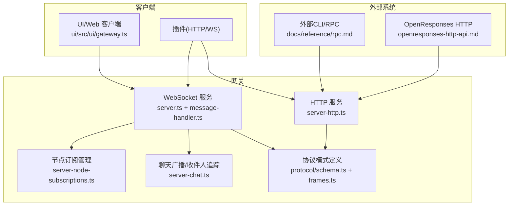
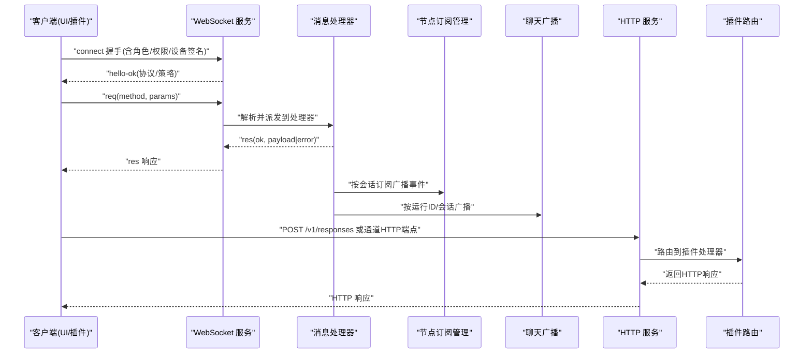
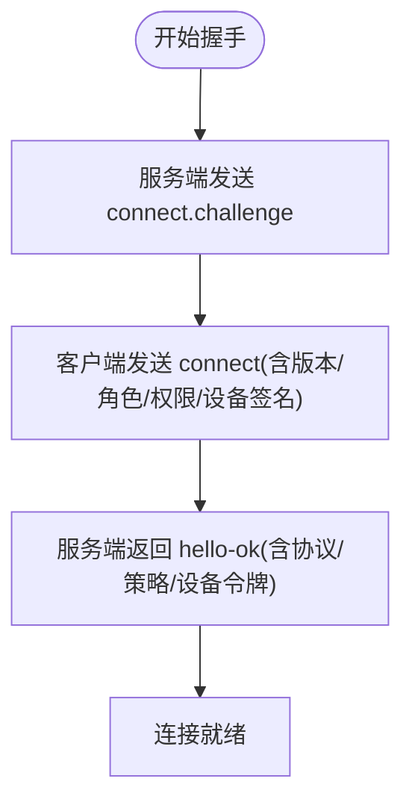
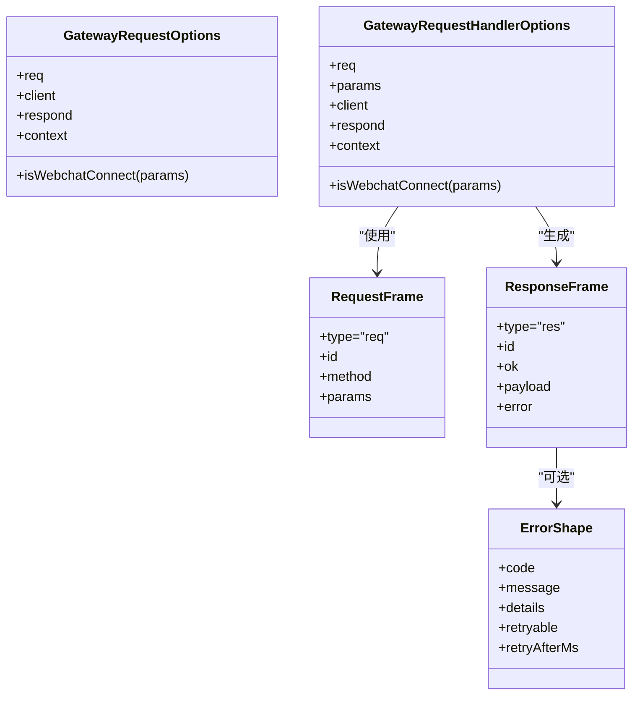
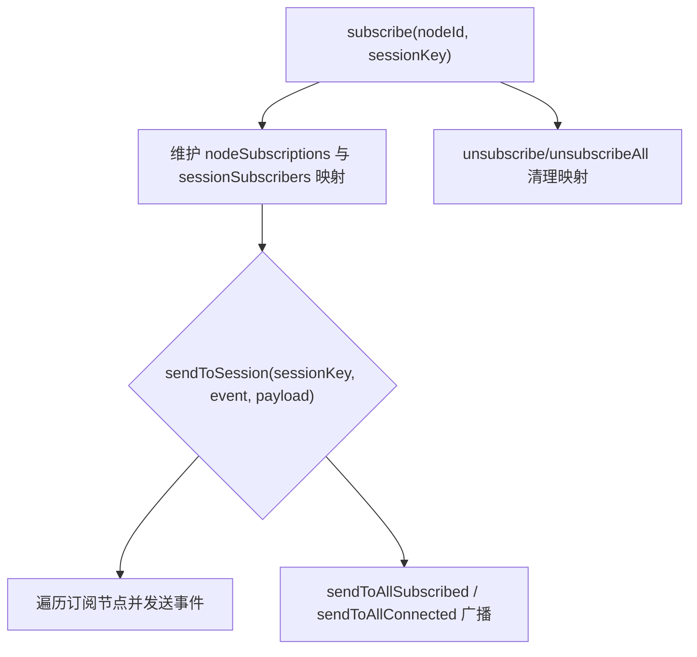
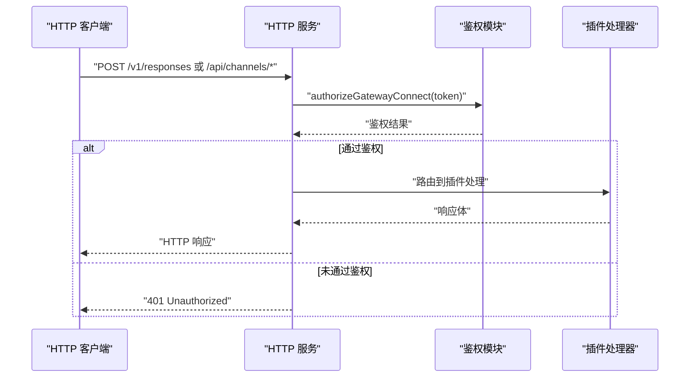
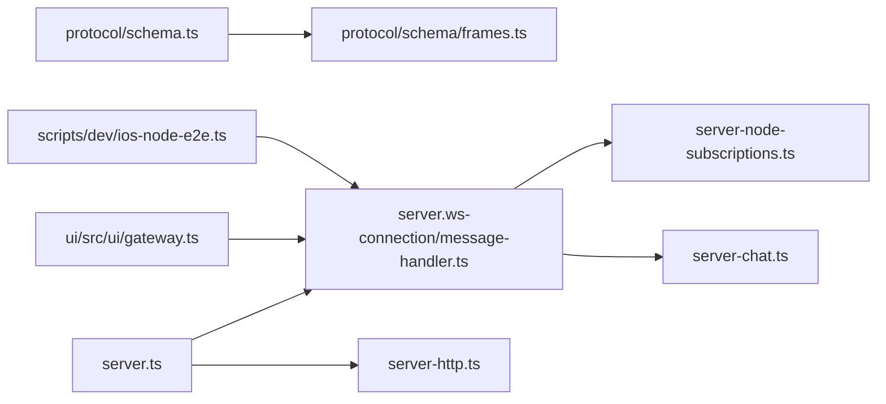

# 网关通信API

<cite>
**本文引用的文件**
- [docs/gateway/protocol.md](file://docs/gateway/protocol.md)
- [docs/gateway/authentication.md](file://docs/gateway/authentication.md)
- [docs/gateway/openresponses-http-api.md](file://docs/gateway/openresponses-http-api.md)
- [docs/reference/rpc.md](file://docs/reference/rpc.md)
- [src/gateway/protocol/schema.ts](file://src/gateway/protocol/schema.ts)
- [src/gateway/protocol/schema/frames.ts](file://src/gateway/protocol/schema/frames.ts)
- [src/gateway/server.ts](file://src/gateway/server.ts)
- [src/gateway/server-http.ts](file://src/gateway/server-http.ts)
- [src/gateway/server-node-subscriptions.ts](file://src/gateway/server-node-subscriptions.ts)
- [src/gateway/server-node-subscriptions.test.ts](file://src/gateway/server-node-subscriptions.test.ts)
- [src/gateway/server-chat.ts](file://src/gateway/server-chat.ts)
- [src/gateway/server.ws-connection/message-handler.ts](file://src/gateway/server.ws-connection/message-handler.ts)
- [ui/src/ui/gateway.ts](file://ui/src/ui/gateway.ts)
- [scripts/dev/ios-node-e2e.ts](file://scripts/dev/ios-node-e2e.ts)
- [src/infra/unhandled-rejections.ts](file://src/infra/unhandled-rejections.ts)
- [extensions/telegram/openclaw.plugin.json](file://extensions/telegram/openclaw.plugin.json)
- [extensions/discord/openclaw.plugin.json](file://extensions/discord/openclaw.plugin.json)
- [docs/gateway/configuration-reference.md](file://docs/gateway/configuration-reference.md)
</cite>

## 目录

1. [简介](#简介)
2. [项目结构](#项目结构)
3. [核心组件](#核心组件)
4. [架构总览](#架构总览)
5. [详细组件分析](#详细组件分析)
6. [依赖关系分析](#依赖关系分析)
7. [性能考虑](#性能考虑)
8. [故障排查指南](#故障排查指南)
9. [结论](#结论)
10. [附录](#附录)

## 简介

本文件为 OpenClaw 网关通信API的完整参考文档，覆盖以下内容：

- 插件与网关之间的 WebSocket 协议（握手、帧格式、版本控制、角色与权限）
- HTTP API 端点与 RPC 调用机制（OpenResponses 兼容端点、通道插件HTTP路由、外部CLI集成）
- 网关请求处理器的使用方法、响应格式与错误处理
- 会话管理、消息路由与事件订阅
- 插件向网关注册服务、查询状态与获取配置的方法
- 通信安全、认证授权与性能优化的API使用指南

## 项目结构

围绕“网关通信API”的相关代码与文档主要分布在如下位置：

- 协议与模式：docs/gateway/protocol.md、src/gateway/protocol/schema.ts、src/gateway/protocol/schema/frames.ts
- 网关服务与HTTP：src/gateway/server.ts、src/gateway/server-http.ts
- WebSocket 消息处理：src/gateway/server.ws-connection/message-handler.ts
- 事件订阅与节点路由：src/gateway/server-node-subscriptions.ts、src/gateway/server-chat.ts
- UI 客户端示例：ui/src/ui/gateway.ts
- 外部集成与RPC：docs/reference/rpc.md、docs/gateway/openresponses-http-api.md
- 插件注册与配置：extensions/\*/openclaw.plugin.json、docs/gateway/configuration-reference.md

图表来源

- [src/gateway/server.ts](file://src/gateway/server.ts#L1-L4)
- [src/gateway/server-http.ts](file://src/gateway/server-http.ts#L404-L445)
- [src/gateway/server-node-subscriptions.ts](file://src/gateway/server-node-subscriptions.ts#L1-L164)
- [src/gateway/server-chat.ts](file://src/gateway/server-chat.ts#L178-L224)
- [src/gateway/protocol/schema.ts](file://src/gateway/protocol/schema.ts#L1-L17)
- [src/gateway/protocol/schema/frames.ts](file://src/gateway/protocol/schema/frames.ts#L115-L164)
- [docs/reference/rpc.md](file://docs/reference/rpc.md#L1-L44)
- [docs/gateway/openresponses-http-api.md](file://docs/gateway/openresponses-http-api.md#L1-L61)

章节来源

- [docs/gateway/protocol.md](file://docs/gateway/protocol.md#L1-L222)
- [src/gateway/protocol/schema.ts](file://src/gateway/protocol/schema.ts#L1-L17)
- [src/gateway/protocol/schema/frames.ts](file://src/gateway/protocol/schema/frames.ts#L115-L164)
- [src/gateway/server.ts](file://src/gateway/server.ts#L1-L4)
- [src/gateway/server-http.ts](file://src/gateway/server-http.ts#L404-L445)
- [src/gateway/server-node-subscriptions.ts](file://src/gateway/server-node-subscriptions.ts#L1-L164)
- [src/gateway/server-chat.ts](file://src/gateway/server-chat.ts#L178-L224)
- [docs/reference/rpc.md](file://docs/reference/rpc.md#L1-L44)
- [docs/gateway/openresponses-http-api.md](file://docs/gateway/openresponses-http-api.md#L1-L61)

## 核心组件

- WebSocket 协议与帧格式：统一的三类帧（请求、响应、事件），支持版本协商与设备身份校验。
- 请求处理器与上下文：通过处理器选项注入请求、参数、客户端信息、响应函数与上下文。
- 事件订阅与节点路由：按会话键分发事件，支持全局广播与连接列表广播。
- HTTP 服务与插件路由：默认对通道类HTTP端点进行网关级鉴权，插件可自定义路由与鉴权。
- OpenResponses 兼容HTTP端点：启用后以标准HTTP方式执行代理任务，复用网关路由与权限。
- 外部CLI/RPC：两类模式（HTTP守护或stdio子进程），遵循稳定ID与健壮性原则。

章节来源

- [docs/gateway/protocol.md](file://docs/gateway/protocol.md#L10-L222)
- [src/gateway/protocol/schema/frames.ts](file://src/gateway/protocol/schema/frames.ts#L115-L164)
- [src/gateway/server.ws-connection/message-handler.ts](file://src/gateway/server.ws-connection/message-handler.ts#L232-L261)
- [src/gateway/server-node-subscriptions.ts](file://src/gateway/server-node-subscriptions.ts#L1-L164)
- [src/gateway/server-http.ts](file://src/gateway/server-http.ts#L404-L445)
- [docs/gateway/openresponses-http-api.md](file://docs/gateway/openresponses-http-api.md#L1-L61)
- [docs/reference/rpc.md](file://docs/reference/rpc.md#L1-L44)

## 架构总览

下图展示从客户端到网关、再到插件与外部系统的整体交互路径，以及消息在网关内部的路由与广播机制。

图表来源

- [docs/gateway/protocol.md](file://docs/gateway/protocol.md#L22-L90)
- [src/gateway/server.ws-connection/message-handler.ts](file://src/gateway/server.ws-connection/message-handler.ts#L232-L261)
- [src/gateway/server-node-subscriptions.ts](file://src/gateway/server-node-subscriptions.ts#L100-L148)
- [src/gateway/server-chat.ts](file://src/gateway/server-chat.ts#L178-L224)
- [src/gateway/server-http.ts](file://src/gateway/server-http.ts#L404-L445)
- [docs/gateway/openresponses-http-api.md](file://docs/gateway/openresponses-http-api.md#L15-L46)

## 详细组件分析

### WebSocket 协议与帧格式

- 连接与握手
  - 首帧必须是 connect 请求；服务端先发送挑战事件，客户端随后提交 connect 参数（包含最小/最大协议版本、客户端元数据、角色、作用域、能力声明、权限、认证、设备签名等）。
  - 成功后返回 hello-ok，包含实际使用的协议版本与策略（如心跳间隔）；若已签发设备令牌，也会在此返回。
- 帧类型
  - 请求：req（包含 id、method、params）
  - 响应：res（包含 id、ok、payload 或 error）
  - 事件：event（包含 event 名称、payload、可选序号与状态版本）
- 版本与模式
  - 协议版本在源码中集中定义，并通过生成工具维护一致性。
- 角色与作用域
  - operator：控制面客户端（CLI/UI/自动化）
  - node：能力宿主（相机/屏幕/画布/系统命令）
  - 作用域用于控制访问范围（只读/写/管理/审批/配对等）

图表来源

- [docs/gateway/protocol.md](file://docs/gateway/protocol.md#L22-L90)
- [src/gateway/protocol/schema/frames.ts](file://src/gateway/protocol/schema/frames.ts#L115-L164)

章节来源

- [docs/gateway/protocol.md](file://docs/gateway/protocol.md#L10-L222)
- [src/gateway/protocol/schema/frames.ts](file://src/gateway/protocol/schema/frames.ts#L115-L164)

### 请求处理器与响应格式

- 处理器选项
  - 包含请求帧、参数、客户端信息、是否为Web聊天连接判断、响应函数与上下文。
- 响应模型
  - 成功：ok=true，携带 payload
  - 失败：ok=false，携带 error 结构（包含错误码、消息、详情、可重试标记与重试间隔）
- 错误处理
  - 网关对未捕获异常进行分类，区分致命错误、配置错误与瞬时网络错误，避免不必要的崩溃。

图表来源

- [src/gateway/server.ws-connection/message-handler.ts](file://src/gateway/server.ws-connection/message-handler.ts#L232-L261)
- [src/gateway/protocol/schema/frames.ts](file://src/gateway/protocol/schema/frames.ts#L115-L164)
- [src/infra/unhandled-rejections.ts](file://src/infra/unhandled-rejections.ts#L1-L95)

章节来源

- [src/gateway/server.ws-connection/message-handler.ts](file://src/gateway/server.ws-connection/message-handler.ts#L232-L261)
- [src/gateway/protocol/schema/frames.ts](file://src/gateway/protocol/schema/frames.ts#L115-L164)
- [src/infra/unhandled-rejections.ts](file://src/infra/unhandled-rejections.ts#L1-L95)

### 会话管理、消息路由与事件订阅

- 订阅管理
  - 支持按节点ID与会话键建立订阅映射，按会话广播事件，或广播至所有订阅节点/所有已连接节点。
  - 提供清理与批量取消功能，确保内存与状态一致性。
- 聊天广播与收件人追踪
  - 基于运行ID维护连接集合，支持最终化标记与定期裁剪，避免内存膨胀。
- 测试验证
  - 单测覆盖事件路由与取消订阅后的清空行为。

图表来源

- [src/gateway/server-node-subscriptions.ts](file://src/gateway/server-node-subscriptions.ts#L33-L164)
- [src/gateway/server-node-subscriptions.test.ts](file://src/gateway/server-node-subscriptions.test.ts#L1-L38)
- [src/gateway/server-chat.ts](file://src/gateway/server-chat.ts#L178-L224)

章节来源

- [src/gateway/server-node-subscriptions.ts](file://src/gateway/server-node-subscriptions.ts#L1-L164)
- [src/gateway/server-node-subscriptions.test.ts](file://src/gateway/server-node-subscriptions.test.ts#L1-L38)
- [src/gateway/server-chat.ts](file://src/gateway/server-chat.ts#L178-L224)

### HTTP API 端点与 RPC 调用机制

- OpenResponses 兼容端点
  - 默认关闭，需在配置中启用；使用与网关相同的路由与权限体系。
  - 支持通过 model 字段或头指定代理的 agent；可显式指定会话键。
  - 使用 Bearer Token 进行鉴权（与网关一致）。
- 通道插件HTTP路由
  - 默认对 /api/channels/\* 路径进行网关级鉴权；非通道插件路由由插件自行鉴权。
- 外部CLI/RPC
  - 两类模式：HTTP守护（signal-cli）与 stdio 子进程（imsg）。
  - 遵循稳定ID、超时与重启策略，保持鲁棒性。

图表来源

- [docs/gateway/openresponses-http-api.md](file://docs/gateway/openresponses-http-api.md#L15-L46)
- [src/gateway/server-http.ts](file://src/gateway/server-http.ts#L404-L445)
- [docs/reference/rpc.md](file://docs/reference/rpc.md#L13-L38)

章节来源

- [docs/gateway/openresponses-http-api.md](file://docs/gateway/openresponses-http-api.md#L1-L61)
- [src/gateway/server-http.ts](file://src/gateway/server-http.ts#L404-L445)
- [docs/reference/rpc.md](file://docs/reference/rpc.md#L1-L44)

### 插件注册、状态查询与配置获取

- 插件注册
  - 插件通过 openclaw.plugin.json 声明 id 与支持的通道；网关加载插件注册表并路由HTTP与WS请求。
- 状态查询
  - 通过 channels.status 等RPC方法查询各通道的配置状态、探测结果与最后探测时间等。
- 配置获取
  - 通道与模型等配置项在网关配置文件中集中管理，支持多账户与策略（DM/群组策略、媒体限制、代理等）。

章节来源

- [extensions/telegram/openclaw.plugin.json](file://extensions/telegram/openclaw.plugin.json#L1-L10)
- [extensions/discord/openclaw.plugin.json](file://extensions/discord/openclaw.plugin.json#L1-L10)
- [docs/gateway/configuration-reference.md](file://docs/gateway/configuration-reference.md#L1-L200)
- [src/gateway/server.channels.e2e.test.ts](file://src/gateway/server.channels.e2e.test.ts#L158-L185)

### 通信安全、认证授权与性能优化

- 认证与授权
  - 支持网关级令牌或密码模式；设备身份与签名用于非本地连接的挑战-响应校验；设备令牌可轮换与撤销。
- 性能优化
  - 心跳间隔策略、事件广播的可选丢弃策略、收件人追踪的定期裁剪。
- 错误与可观测性
  - 对未捕获异常进行分类处理，避免因瞬时网络错误导致进程崩溃；提供错误码与可重试信息。

章节来源

- [docs/gateway/authentication.md](file://docs/gateway/authentication.md#L1-L146)
- [docs/gateway/protocol.md](file://docs/gateway/protocol.md#L178-L222)
- [src/gateway/server-chat.ts](file://src/gateway/server-chat.ts#L218-L224)
- [src/infra/unhandled-rejections.ts](file://src/infra/unhandled-rejections.ts#L1-L95)

## 依赖关系分析

- 协议层
  - 协议模式由 schema.ts 统一导出，frames.ts 定义帧结构与联合类型，确保客户端与服务端类型一致。
- 服务层
  - server.ts 暴露启动入口；server-http.ts 负责HTTP端点与插件路由；message-handler.ts 解析WS帧并派发到处理器。
- 订阅与路由
  - server-node-subscriptions.ts 提供订阅管理；server-chat.ts 提供聊天广播辅助。
- 客户端示例
  - ui/src/ui/gateway.ts 展示了请求封装、连接队列与错误处理；ios-node-e2e.ts 展示了消息解析与等待响应的典型流程。

图表来源

- [src/gateway/protocol/schema.ts](file://src/gateway/protocol/schema.ts#L1-L17)
- [src/gateway/protocol/schema/frames.ts](file://src/gateway/protocol/schema/frames.ts#L115-L164)
- [src/gateway/server.ts](file://src/gateway/server.ts#L1-L4)
- [src/gateway/server.ws-connection/message-handler.ts](file://src/gateway/server.ws-connection/message-handler.ts#L232-L261)
- [src/gateway/server-http.ts](file://src/gateway/server-http.ts#L404-L445)
- [src/gateway/server-node-subscriptions.ts](file://src/gateway/server-node-subscriptions.ts#L1-L164)
- [src/gateway/server-chat.ts](file://src/gateway/server-chat.ts#L178-L224)
- [ui/src/ui/gateway.ts](file://ui/src/ui/gateway.ts#L290-L313)
- [scripts/dev/ios-node-e2e.ts](file://scripts/dev/ios-node-e2e.ts#L127-L180)

章节来源

- [src/gateway/protocol/schema.ts](file://src/gateway/protocol/schema.ts#L1-L17)
- [src/gateway/protocol/schema/frames.ts](file://src/gateway/protocol/schema/frames.ts#L115-L164)
- [src/gateway/server.ts](file://src/gateway/server.ts#L1-L4)
- [src/gateway/server-http.ts](file://src/gateway/server-http.ts#L404-L445)
- [src/gateway/server-node-subscriptions.ts](file://src/gateway/server-node-subscriptions.ts#L1-L164)
- [src/gateway/server-chat.ts](file://src/gateway/server-chat.ts#L178-L224)
- [ui/src/ui/gateway.ts](file://ui/src/ui/gateway.ts#L290-L313)
- [scripts/dev/ios-node-e2e.ts](file://scripts/dev/ios-node-e2e.ts#L127-L180)

## 性能考虑

- 广播策略
  - 可通过事件帧中的可选字段控制在慢速接收者处丢弃事件，降低拥塞风险。
- 内存与状态
  - 订阅映射与收件人追踪均支持定期裁剪，避免长期运行下的内存累积。
- 瞬时错误处理
  - 将瞬时网络错误视为可恢复，避免进程崩溃影响整体可用性。

章节来源

- [src/gateway/server-chat.ts](file://src/gateway/server-chat.ts#L218-L224)
- [src/gateway/server-node-subscriptions.ts](file://src/gateway/server-node-subscriptions.ts#L1-L164)
- [src/infra/unhandled-rejections.ts](file://src/infra/unhandled-rejections.ts#L1-L95)

## 故障排查指南

- WebSocket 连接失败
  - 检查握手参数（协议版本、角色、作用域、设备签名）是否匹配；确认服务端返回的 hello-ok 中协议版本与策略。
- 请求无响应
  - 确认客户端是否正确保存并等待对应 id 的响应；检查服务端日志与处理器是否抛出异常。
- HTTP 401
  - 确认 Authorization 头与网关鉴权模式（令牌/密码）一致；通道类HTTP端点默认需要网关级令牌。
- 事件未到达
  - 检查订阅是否建立、会话键是否正确；确认 sendToSession 的目标会话是否存在订阅。
- 外部CLI集成问题
  - 遵循两类模式的约定（HTTP守护或stdio），确保稳定ID与超时/重启策略配置正确。

章节来源

- [docs/gateway/protocol.md](file://docs/gateway/protocol.md#L22-L90)
- [src/gateway/server.ws-connection/message-handler.ts](file://src/gateway/server.ws-connection/message-handler.ts#L232-L261)
- [src/gateway/server-http.ts](file://src/gateway/server-http.ts#L404-L445)
- [docs/reference/rpc.md](file://docs/reference/rpc.md#L1-L44)

## 结论

本文档系统梳理了 OpenClaw 网关的通信API，涵盖协议、处理器、路由、HTTP与RPC集成、插件注册与配置、安全与性能优化等方面。建议在实现客户端或插件时：

- 严格遵循协议版本与握手流程；
- 正确使用请求/响应与事件帧格式；
- 合理设计订阅与广播策略；
- 在HTTP与RPC场景中遵循鉴权与稳定性原则；
- 利用配置参考完善通道与模型策略。

## 附录

- 协议与模式
  - 协议版本与帧结构定义见 schema.ts 与 frames.ts
- 配置参考
  - 通道与模型配置项详见配置参考文档
- 示例与测试
  - UI 客户端与iOS端到端脚本展示了典型的消息处理流程

章节来源

- [src/gateway/protocol/schema.ts](file://src/gateway/protocol/schema.ts#L1-L17)
- [src/gateway/protocol/schema/frames.ts](file://src/gateway/protocol/schema/frames.ts#L115-L164)
- [docs/gateway/configuration-reference.md](file://docs/gateway/configuration-reference.md#L1-L200)
- [ui/src/ui/gateway.ts](file://ui/src/ui/gateway.ts#L290-L313)
- [scripts/dev/ios-node-e2e.ts](file://scripts/dev/ios-node-e2e.ts#L127-L180)
