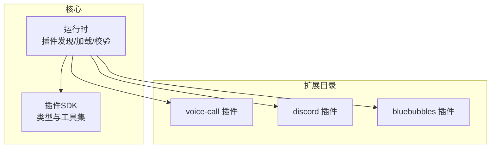
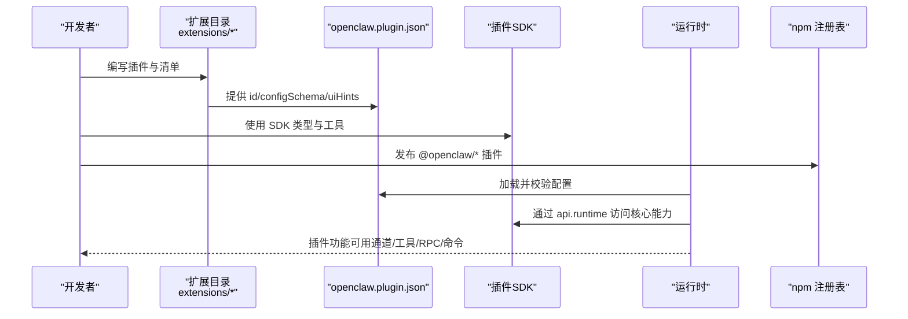
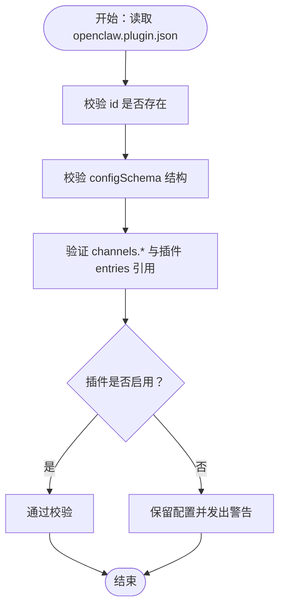
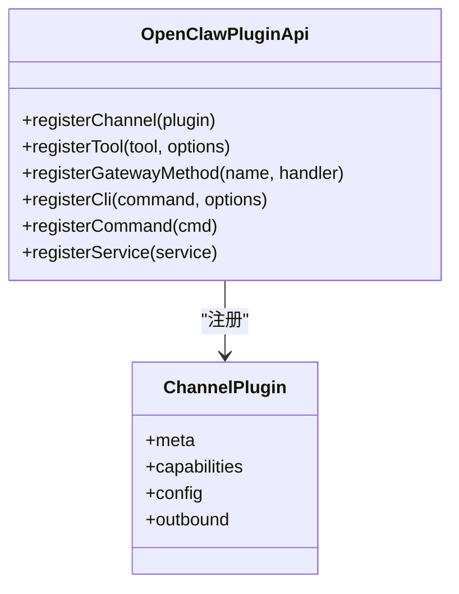
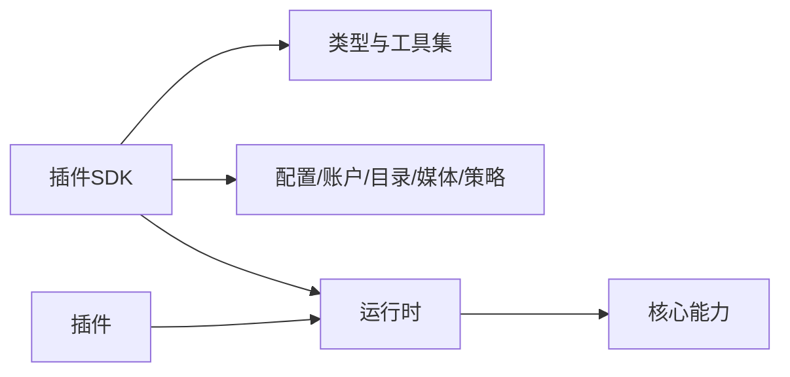
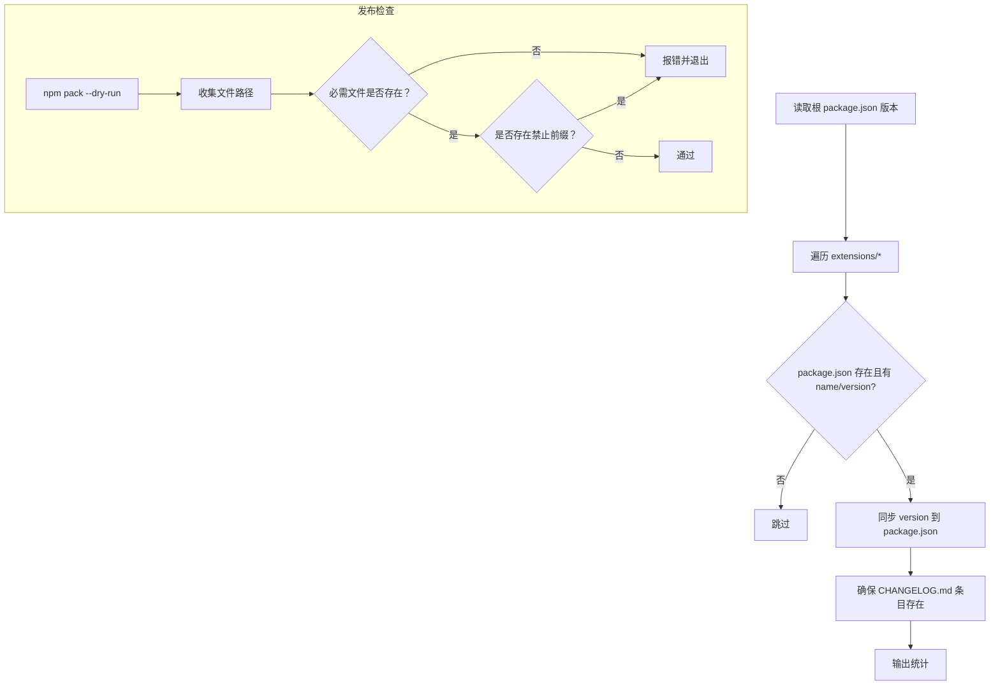
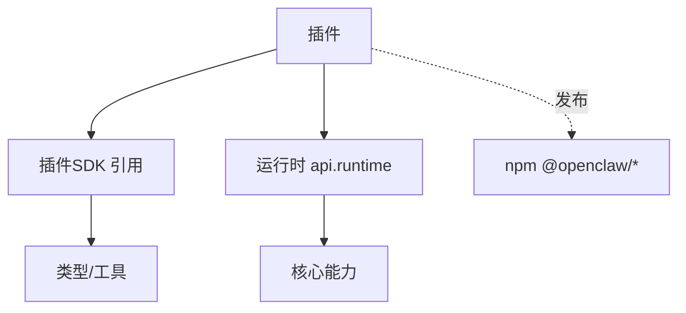

# 插件市场与发布

<cite>
**本文引用的文件**
- [docs/plugins/manifest.md](file://docs/plugins/manifest.md)
- [docs/plugins/agent-tools.md](file://docs/plugins/agent-tools.md)
- [docs/tools/plugin.md](file://docs/tools/plugin.md)
- [docs/refactor/plugin-sdk.md](file://docs/refactor/plugin-sdk.md)
- [src/plugin-sdk/index.ts](file://src/plugin-sdk/index.ts)
- [extensions/voice-call/openclaw.plugin.json](file://extensions/voice-call/openclaw.plugin.json)
- [extensions/discord/openclaw.plugin.json](file://extensions/discord/openclaw.plugin.json)
- [extensions/bluebubbles/openclaw.plugin.json](file://extensions/bluebubbles/openclaw.plugin.json)
- [scripts/sync-plugin-versions.ts](file://scripts/sync-plugin-versions.ts)
- [scripts/release-check.ts](file://scripts/release-check.ts)
- [docs/reference/RELEASING.md](file://docs/reference/RELEASING.md)
- [docs/help/submitting-a-pr.md](file://docs/help/submitting-a-pr.md)
- [docs/help/submitting-an-issue.md](file://docs/help/submitting-an-issue.md)
- [docs/start/showcase.md](file://docs/start/showcase.md)
</cite>

## 目录

1. [简介](#简介)
2. [项目结构](#项目结构)
3. [核心组件](#核心组件)
4. [架构总览](#架构总览)
5. [详细组件分析](#详细组件分析)
6. [依赖关系分析](#依赖关系分析)
7. [性能考量](#性能考量)
8. [故障排查指南](#故障排查指南)
9. [结论](#结论)
10. [附录](#附录)

## 简介

本指南面向希望在 OpenClaw 生态中开发、发布与维护插件（扩展）的作者，覆盖从准备到发布的全流程：插件清单与配置校验、版本与变更日志同步、打包与发布检查、插件市场注册与分发、版本控制与更新策略、文档与示例要求、推广与社区反馈、以及商店的搜索与评价体系建议。内容基于仓库内现有文档与脚本，确保可操作性与一致性。

## 项目结构

OpenClaw 的插件生态由“核心运行时 + 插件 SDK + 扩展目录”构成：

- 核心运行时负责插件发现、加载、配置校验与执行。
- 插件 SDK 提供稳定类型与工具集，约束插件对核心的访问方式。
- 扩展目录（extensions/\*）包含官方与社区插件源码与清单文件。

图表来源

- [docs/tools/plugin.md](file://docs/tools/plugin.md#L89-L121)
- [docs/refactor/plugin-sdk.md](file://docs/refactor/plugin-sdk.md#L19-L44)
- [extensions/voice-call/openclaw.plugin.json](file://extensions/voice-call/openclaw.plugin.json#L1-L10)
- [extensions/discord/openclaw.plugin.json](file://extensions/discord/openclaw.plugin.json#L1-L10)
- [extensions/bluebubbles/openclaw.plugin.json](file://extensions/bluebubbles/openclaw.plugin.json#L1-L10)

章节来源

- [docs/tools/plugin.md](file://docs/tools/plugin.md#L89-L121)
- [docs/refactor/plugin-sdk.md](file://docs/refactor/plugin-sdk.md#L19-L44)

## 核心组件

- 插件清单（openclaw.plugin.json）
  - 必备字段：id、configSchema；可选字段：kind、channels、providers、skills、name、description、uiHints、version。
  - 清单用于严格配置校验，缺失或无效将阻断安装与配置。
- 插件 API 与钩子
  - 支持注册通道、工具、RPC 方法、CLI 命令、自动回复命令、后台服务等。
  - 钩子可随插件打包，统一生命周期管理。
- 插件 SDK
  - 提供稳定的类型、配置辅助、账户与目录适配器、媒体处理、分组与提及策略等工具。
  - 运行时通过 api.runtime 暴露核心能力，避免直接导入 src/\*\*。
- 版本与发布
  - 使用脚本同步插件版本与变更日志；发布前进行 npm 包内容检查；仅发布已存在于 npm 的 @openclaw/\* 插件。

章节来源

- [docs/plugins/manifest.md](file://docs/plugins/manifest.md#L18-L72)
- [docs/tools/plugin.md](file://docs/tools/plugin.md#L301-L380)
- [docs/refactor/plugin-sdk.md](file://docs/refactor/plugin-sdk.md#L40-L145)
- [scripts/sync-plugin-versions.ts](file://scripts/sync-plugin-versions.ts#L1-L77)
- [scripts/release-check.ts](file://scripts/release-check.ts#L1-L117)

## 架构总览

下图展示插件从清单到运行的关键路径与职责边界：

图表来源

- [docs/tools/plugin.md](file://docs/tools/plugin.md#L122-L182)
- [docs/refactor/plugin-sdk.md](file://docs/refactor/plugin-sdk.md#L40-L145)
- [docs/plugins/manifest.md](file://docs/plugins/manifest.md#L11-L14)
- [docs/reference/RELEASING.md](file://docs/reference/RELEASING.md#L93-L122)

## 详细组件分析

### 组件A：插件清单与配置校验

- 必填项与可选项
  - 必填：id、configSchema。
  - 可选：kind、channels、providers、skills、name、description、uiHints、version。
- 校验行为
  - 未知 channels.\* 或插件 id 将触发错误。
  - 若清单缺失或 schema 无效，Doctor 会报告插件错误。
  - 已禁用插件保留配置并发出警告。
- UI 提示
  - 在清单中提供 uiHints，可增强配置表单的标签、占位符与敏感字段标记。

图表来源

- [docs/plugins/manifest.md](file://docs/plugins/manifest.md#L53-L63)

章节来源

- [docs/plugins/manifest.md](file://docs/plugins/manifest.md#L18-L72)

### 组件B：插件 API 与功能注册

- 支持的功能
  - 通道注册（消息通道）、工具注册（必选/可选）、RPC 方法、CLI 命令、自动回复命令、后台服务。
- 工具注册要点
  - 可选工具需显式允许列表启用；避免与核心工具名冲突。
- 通道插件模板
  - 定义 meta、capabilities、config、outbound 等适配器，并在插件入口注册。

图表来源

- [docs/tools/plugin.md](file://docs/tools/plugin.md#L514-L598)

章节来源

- [docs/tools/plugin.md](file://docs/tools/plugin.md#L510-L598)

### 组件C：插件 SDK 与运行时

- SDK 职责
  - 提供类型、配置 schema 构建器、账户与目录适配器、分组与提及策略、媒体处理、日志与诊断事件等。
- 运行时职责
  - 通过 api.runtime 暴露核心能力，插件不得直接导入 src/\*\*。
- 版本与兼容性
  - SDK 语义化版本；运行时版本与核心版本一致；插件声明所需运行时范围。

图表来源

- [src/plugin-sdk/index.ts](file://src/plugin-sdk/index.ts#L1-L392)
- [docs/refactor/plugin-sdk.md](file://docs/refactor/plugin-sdk.md#L40-L145)

章节来源

- [src/plugin-sdk/index.ts](file://src/plugin-sdk/index.ts#L1-L392)
- [docs/refactor/plugin-sdk.md](file://docs/refactor/plugin-sdk.md#L188-L193)

### 组件D：版本同步与发布检查

- 版本同步
  - 同步核心版本到所有扩展 package.json，并在 CHANGELOG.md 中追加条目。
- 发布检查
  - 校验 npm pack 内容完整性（必需文件、禁止文件前缀），确保发布物符合规范。

图表来源

- [scripts/sync-plugin-versions.ts](file://scripts/sync-plugin-versions.ts#L33-L77)
- [scripts/release-check.ts](file://scripts/release-check.ts#L78-L117)

章节来源

- [scripts/sync-plugin-versions.ts](file://scripts/sync-plugin-versions.ts#L1-L77)
- [scripts/release-check.ts](file://scripts/release-check.ts#L1-L117)
- [docs/reference/RELEASING.md](file://docs/reference/RELEASING.md#L93-L122)

### 组件E：插件示例与清单参考

- voice-call 插件清单展示了丰富的 uiHints 与 configSchema 字段组织方式。
- discord、bluebubbles 等插件清单体现了 channels 字段与最小化 schema 的实践。

章节来源

- [extensions/voice-call/openclaw.plugin.json](file://extensions/voice-call/openclaw.plugin.json#L1-L161)
- [extensions/discord/openclaw.plugin.json](file://extensions/discord/openclaw.plugin.json#L1-L10)
- [extensions/bluebubbles/openclaw.plugin.json](file://extensions/bluebubbles/openclaw.plugin.json#L1-L10)

## 依赖关系分析

- 插件对 SDK 的依赖
  - 插件通过 SDK 获取类型与工具，避免直接依赖核心实现细节。
- 插件对运行时的依赖
  - 通过 api.runtime 访问核心能力，保证升级与行为一致性。
- 发布与注册
  - 仅发布已在 npm 上存在的 @openclaw/\* 插件；未在 npm 的内置插件不参与外部发布。

图表来源

- [docs/refactor/plugin-sdk.md](file://docs/refactor/plugin-sdk.md#L188-L193)
- [docs/tools/plugin.md](file://docs/tools/plugin.md#L623-L636)
- [docs/reference/RELEASING.md](file://docs/reference/RELEASING.md#L93-L122)

章节来源

- [docs/refactor/plugin-sdk.md](file://docs/refactor/plugin-sdk.md#L188-L193)
- [docs/tools/plugin.md](file://docs/tools/plugin.md#L623-L636)
- [docs/reference/RELEASING.md](file://docs/reference/RELEASING.md#L93-L122)

## 性能考量

- 插件以进程内方式运行，应遵循安全与资源使用最佳实践，避免阻塞与高开销操作。
- 使用 SDK 工具与运行时接口可减少重复实现，提升稳定性与性能一致性。
- 对于媒体与网络调用，建议在插件中进行必要的节流与缓存策略。

## 故障排查指南

- 插件清单问题
  - 缺失 id 或 configSchema：无法通过校验，需补齐。
  - 未知 channels.\* 或插件 id：需在清单中声明或修正引用。
- 配置错误
  - 使用 Doctor 命令查看诊断信息；禁用插件时配置会被保留但发出警告。
- 发布失败
  - npm pack 缺少必要文件或包含禁止前缀：根据检查脚本输出修复。
  - 版本不一致：使用版本同步脚本对齐扩展版本与变更日志。

章节来源

- [docs/plugins/manifest.md](file://docs/plugins/manifest.md#L53-L63)
- [scripts/release-check.ts](file://scripts/release-check.ts#L78-L117)
- [scripts/sync-plugin-versions.ts](file://scripts/sync-plugin-versions.ts#L33-L77)

## 结论

通过严格的清单与配置校验、清晰的 SDK 与运行时边界、完善的版本与发布检查流程，OpenClaw 为插件作者提供了可复用、可维护、可发布的基础设施。遵循本指南可显著降低发布成本、提升质量与用户体验。

## 附录

### A. 插件发布准备清单

- 准备 openclaw.plugin.json（id、configSchema、uiHints、可选 channels/providers/skills/name/description/version）。
- 在本地完成功能测试与 lint/build/test。
- 使用版本同步脚本对齐扩展版本与变更日志。
- 运行发布检查脚本确保 npm 包内容完整。
- 仅发布已在 npm 的 @openclaw/\* 插件。

章节来源

- [docs/plugins/manifest.md](file://docs/plugins/manifest.md#L18-L72)
- [scripts/sync-plugin-versions.ts](file://scripts/sync-plugin-versions.ts#L33-L77)
- [scripts/release-check.ts](file://scripts/release-check.ts#L78-L117)
- [docs/reference/RELEASING.md](file://docs/reference/RELEASING.md#L93-L122)

### B. 版本管理与更新策略

- 采用语义化版本；插件声明所需运行时范围。
- 发布前统一扩展版本与变更日志；发布后在 GitHub 创建对应标签与发行说明。
- 对外仅发布 @openclaw/\* 插件，内置未发布的插件仍保留在仓库内。

章节来源

- [docs/refactor/plugin-sdk.md](file://docs/refactor/plugin-sdk.md#L188-L193)
- [docs/reference/RELEASING.md](file://docs/reference/RELEASING.md#L93-L122)

### C. 文档编写与示例要求

- 插件应提供清晰的 README 与示例配置片段。
- 示例插件（如 voice-call）可作为模板参考其清单与配置组织方式。
- 社区案例与展示页可用于推广与参考。

章节来源

- [extensions/voice-call/openclaw.plugin.json](file://extensions/voice-call/openclaw.plugin.json#L1-L161)
- [docs/start/showcase.md](file://docs/start/showcase.md#L1-L417)

### D. 用户支持与社区反馈

- 提交 PR 与 Issue 的模板与清单可帮助快速定位问题与推进修复。
- 社区展示页鼓励用户分享项目，形成正向反馈循环。

章节来源

- [docs/help/submitting-a-pr.md](file://docs/help/submitting-a-pr.md#L1-L399)
- [docs/help/submitting-an-issue.md](file://docs/help/submitting-an-issue.md#L1-L153)
- [docs/start/showcase.md](file://docs/start/showcase.md#L1-L417)

### E. 推广策略与商店运营建议

- 基于现有展示页与社区渠道进行推广。
- 鼓励作者在社区平台分享项目与使用体验，扩大影响力。
- 保持插件质量与文档完善，有助于提升用户信任与留存。

章节来源

- [docs/start/showcase.md](file://docs/start/showcase.md#L1-L417)
