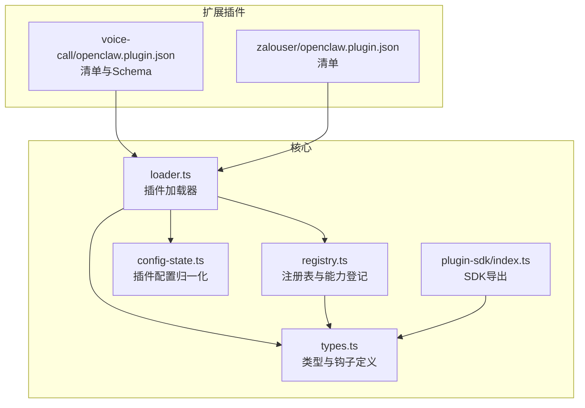
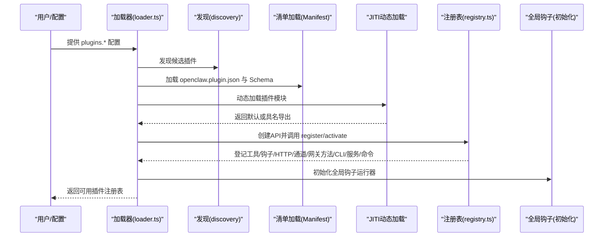
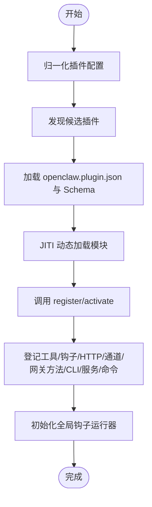
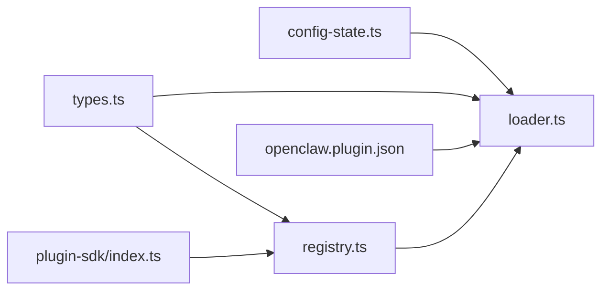

# 插件开发

<cite>
**本文引用的文件**
- [README.md](file://README.md)
- [docs/plugins/manifest.md](file://docs/plugins/manifest.md)
- [docs/plugins/agent-tools.md](file://docs/plugins/agent-tools.md)
- [docs/plugins/voice-call.md](file://docs/plugins/voice-call.md)
- [docs/plugins/zalouser.md](file://docs/plugins/zalouser.md)
- [src/plugins/loader.ts](file://src/plugins/loader.ts)
- [src/plugins/types.ts](file://src/plugins/types.ts)
- [src/plugins/registry.ts](file://src/plugins/registry.ts)
- [src/plugins/config-state.ts](file://src/plugins/config-state.ts)
- [src/plugin-sdk/index.ts](file://src/plugin-sdk/index.ts)
- [extensions/voice-call/openclaw.plugin.json](file://extensions/voice-call/openclaw.plugin.json)
- [extensions/voice-call/package.json](file://extensions/voice-call/package.json)
- [extensions/zalouser/openclaw.plugin.json](file://extensions/zalouser/openclaw.plugin.json)
</cite>

## 目录

1. [简介](#简介)
2. [项目结构](#项目结构)
3. [核心组件](#核心组件)
4. [架构总览](#架构总览)
5. [组件详解](#组件详解)
6. [依赖关系分析](#依赖关系分析)
7. [性能考量](#性能考量)
8. [故障排查指南](#故障排查指南)
9. [结论](#结论)
10. [附录](#附录)

## 简介

本指南面向希望在 OpenClaw 平台上开发与发布插件的开发者。内容覆盖插件系统架构、开发流程、API 参考、生命周期与注册机制、事件钩子、中间件与 HTTP 路由、配置与校验、依赖与版本管理、最佳实践、安全与性能优化，以及测试与调试方法。文中所有技术细节均基于仓库中的实际实现与文档。

## 项目结构

OpenClaw 的插件体系由“核心加载器”“类型定义”“注册表”“配置状态解析”“SDK 导出”等模块构成，并通过各扩展插件（如 voice-call、zalouser）进行实践验证。插件清单（openclaw.plugin.json）与 JSON Schema 配置共同确保插件在加载前即可完成严格校验。

图示来源

- [src/plugins/loader.ts](file://src/plugins/loader.ts#L170-L456)
- [src/plugins/registry.ts](file://src/plugins/registry.ts#L146-L515)
- [src/plugins/config-state.ts](file://src/plugins/config-state.ts#L65-L195)
- [src/plugins/types.ts](file://src/plugins/types.ts#L229-L538)
- [src/plugin-sdk/index.ts](file://src/plugin-sdk/index.ts#L1-L392)
- [extensions/voice-call/openclaw.plugin.json](file://extensions/voice-call/openclaw.plugin.json#L1-L560)
- [extensions/zalouser/openclaw.plugin.json](file://extensions/zalouser/openclaw.plugin.json#L1-L10)

章节来源

- [README.md](file://README.md#L1-L550)

## 核心组件

- 插件加载器：负责发现候选插件、加载清单、解析配置、执行注册回调、建立注册表并初始化全局钩子运行器。
- 类型与钩子：统一定义插件 API、工具、命令、HTTP 处理器、网关方法、服务、通道与提供者等能力接口及生命周期钩子。
- 注册表：集中登记插件已注册的能力（工具、钩子、通道、提供者、网关方法、HTTP 路由、CLI 命令、服务），并维护诊断信息。
- 配置状态：对用户配置进行归一化处理，决定插件启用/禁用、内存槽位选择、允许/拒绝列表与路径加载等策略。
- SDK：向插件作者暴露统一的 API（注册工具、钩子、HTTP、通道、网关方法、CLI、服务、命令、路径解析、生命周期钩子）。

章节来源

- [src/plugins/loader.ts](file://src/plugins/loader.ts#L170-L456)
- [src/plugins/types.ts](file://src/plugins/types.ts#L229-L538)
- [src/plugins/registry.ts](file://src/plugins/registry.ts#L146-L515)
- [src/plugins/config-state.ts](file://src/plugins/config-state.ts#L65-L195)
- [src/plugin-sdk/index.ts](file://src/plugin-sdk/index.ts#L1-L392)

## 架构总览

下图展示从配置到插件注册、再到能力暴露与运行的整体流程。

图示来源

- [src/plugins/loader.ts](file://src/plugins/loader.ts#L170-L456)
- [src/plugins/registry.ts](file://src/plugins/registry.ts#L468-L515)

## 组件详解

### 插件清单与配置校验

- 每个插件必须在根目录提供 openclaw.plugin.json，其中至少包含 id 与 configSchema。
- 即使插件不接收配置，也必须提供空的 JSON Schema。
- 校验在配置读写时进行，而非运行时；缺失或错误的清单会导致验证失败。
- 清单还支持 uiHints、channels、providers、skills 等元数据字段，用于 UI 呈现与能力声明。

章节来源

- [docs/plugins/manifest.md](file://docs/plugins/manifest.md#L1-L72)
- [extensions/voice-call/openclaw.plugin.json](file://extensions/voice-call/openclaw.plugin.json#L1-L560)
- [extensions/zalouser/openclaw.plugin.json](file://extensions/zalouser/openclaw.plugin.json#L1-L10)

### 插件加载与注册流程

- 归一化配置：将 plugins.enabled、allow、deny、load.paths、slots.memory、entries 映射为内部结构。
- 发现与清单加载：扫描候选路径，读取 openclaw.plugin.json 并构建清单注册表。
- 动态加载：使用 JITI 按扩展名解析模块，支持 .ts/.js/.mjs/.cjs 等。
- 注册回调：调用插件导出的 register 或 activate，传入 OpenClawPluginApi。
- 能力登记：根据 API 调用登记工具、钩子、HTTP、通道、网关方法、CLI、服务、命令等。
- 全局钩子：初始化全局钩子运行器以支持生命周期钩子。

图示来源

- [src/plugins/loader.ts](file://src/plugins/loader.ts#L170-L456)
- [src/plugins/registry.ts](file://src/plugins/registry.ts#L146-L515)
- [src/plugins/config-state.ts](file://src/plugins/config-state.ts#L65-L195)

章节来源

- [src/plugins/loader.ts](file://src/plugins/loader.ts#L170-L456)
- [src/plugins/config-state.ts](file://src/plugins/config-state.ts#L65-L195)

### 插件 API 与能力注册

- 工具注册：registerTool 支持必选与可选工具，可传入工厂函数或直接对象。
- 钩子注册：registerHook 与 on 分别用于内部钩子与生命周期钩子，支持事件数组与描述信息。
- HTTP 注册：registerHttpHandler 与 registerHttpRoute 支持通用处理器与路由注册。
- 通道与提供者：registerChannel 与 registerProvider 将插件能力注入通道与模型提供者生态。
- 网关方法：registerGatewayMethod 注册网关 RPC 方法。
- CLI 与命令：registerCli 与 registerCommand 注册 CLI 子命令与自定义命令。
- 路径解析：resolvePath 解析用户路径。
- 生命周期钩子：on 接口支持优先级设置。

章节来源

- [src/plugins/types.ts](file://src/plugins/types.ts#L244-L283)
- [src/plugins/registry.ts](file://src/plugins/registry.ts#L168-L515)
- [src/plugin-sdk/index.ts](file://src/plugin-sdk/index.ts#L1-L392)

### 事件钩子与中间件系统

- 内部钩子：消息收发、会话、工具调用、压缩前后、代理启动/停止等事件。
- 生命周期钩子：before*agent_start、agent_end、before_compaction、after_compaction、message*_、tool\__、session\_\*、gateway_start、gateway_stop 等。
- 钩子上下文：包含 agentId、sessionKey、workspaceDir、messageProvider、channelId、accountId、conversationId、toolName 等。
- 钩子结果：部分钩子支持修改参数、取消发送、阻断工具调用、修改工具结果消息等。

章节来源

- [src/plugins/types.ts](file://src/plugins/types.ts#L298-L538)

### 插件开发流程与示例

- 安装与配置：以 voice-call 插件为例，支持从 npm 安装或本地路径安装，配置 provider、号码、webhook、隧道、TTS 等。
- 清单与 Schema：voice-call 的 openclaw.plugin.json 包含丰富的 uiHints 与完整 JSON Schema。
- 工具与命令：voice-call 提供 voice_call 工具与 CLI 命令；zalouser 提供 zalouser 工具与 CLI 命令。
- 安全与暴露：支持 webhook 安全配置、公共 URL、隧道模式与 Tailscale 暴露。

章节来源

- [docs/plugins/voice-call.md](file://docs/plugins/voice-call.md#L1-L285)
- [docs/plugins/zalouser.md](file://docs/plugins/zalouser.md#L1-L82)
- [extensions/voice-call/openclaw.plugin.json](file://extensions/voice-call/openclaw.plugin.json#L1-L560)
- [extensions/voice-call/package.json](file://extensions/voice-call/package.json#L1-L20)
- [extensions/zalouser/openclaw.plugin.json](file://extensions/zalouser/openclaw.plugin.json#L1-L10)

### 插件生命周期管理

- 启停阶段：gateway_start/gateway_stop 生命周期钩子可用于资源初始化与清理。
- 会话阶段：session_start/session_end 钩子可用于会话级别的状态管理。
- 代理阶段：before_agent_start/agent_end 钩子可用于系统提示词与上下文的动态调整。
- 压缩阶段：before_compaction/after_compaction 钩子可用于压缩前后的数据处理。
- 工具阶段：before_tool_call/after_tool_call/tool_result_persist 钩子可用于工具调用拦截与结果持久化。

章节来源

- [src/plugins/types.ts](file://src/plugins/types.ts#L298-L538)

### 中间件与 HTTP 路由

- registerHttpHandler：注册通用 HTTP 处理器，返回布尔值表示是否已处理。
- registerHttpRoute：注册特定路径的路由处理器，自动规范化路径。
- 与网关方法的区别：registerGatewayMethod 注册的是网关 RPC 方法，而 HTTP 路由直接处理 HTTP 请求。

章节来源

- [src/plugins/registry.ts](file://src/plugins/registry.ts#L287-L326)
- [src/plugins/types.ts](file://src/plugins/types.ts#L192-L200)

### 配置系统与依赖管理

- 配置归一化：plugins.enabled、allow、deny、load.paths、slots.memory、entries。
- 插件启用策略：deny 列表优先于 allow 列表；显式 entries.enabled=true/false 覆盖默认；bundled 插件按默认集合启用。
- 内存槽位：slots.memory 支持字符串（指定插件 id）、null（禁用）与未设置（默认值）；同一时刻仅允许一个 memory 插件被选中。
- 依赖与版本：插件 package.json 中的 openclaw 字段声明入口；依赖通过包管理器安装；插件清单中可声明敏感字段与 UI 提示。

章节来源

- [src/plugins/config-state.ts](file://src/plugins/config-state.ts#L65-L195)
- [extensions/voice-call/package.json](file://extensions/voice-call/package.json#L1-L20)
- [extensions/voice-call/openclaw.plugin.json](file://extensions/voice-call/openclaw.plugin.json#L1-L560)

### 版本控制与发布管理

- 插件版本：openclaw.plugin.json 中的 version 字段为信息性标记。
- 包版本：extensions/\*/package.json 的 version 字段用于包管理与分发。
- 发布渠道：推荐通过 npm 发布；本地开发可使用本地路径安装。
- 清单与 Schema：发布前确保清单与 Schema 完整且通过验证。

章节来源

- [extensions/voice-call/openclaw.plugin.json](file://extensions/voice-call/openclaw.plugin.json#L1-L560)
- [extensions/voice-call/package.json](file://extensions/voice-call/package.json#L1-L20)
- [docs/plugins/voice-call.md](file://docs/plugins/voice-call.md#L34-L52)

### 最佳实践

- 清单与 Schema：始终提供完整且严格的 JSON Schema，避免运行期错误。
- 工具设计：优先使用 optional 工具，减少副作用与外部依赖。
- 钩子使用：合理利用生命周期钩子进行上下文增强与结果净化。
- HTTP 路由：为路由设置唯一路径，避免冲突。
- 安全：在公网暴露 webhook 时启用签名验证与受信代理校验。
- 性能：避免在 register 阶段执行重任务；将初始化延迟到首次使用。

章节来源

- [docs/plugins/agent-tools.md](file://docs/plugins/agent-tools.md#L94-L100)
- [docs/plugins/manifest.md](file://docs/plugins/manifest.md#L47-L72)
- [docs/plugins/voice-call.md](file://docs/plugins/voice-call.md#L120-L151)

### 安全考虑

- 默认 DM 策略：未配对发送方需经配对流程；公开 DM 需显式开启。
- webhook 安全：允许主机白名单、可信代理 IP、转发头信任策略。
- 敏感字段：在 uiHints 中标记 sensitive 字段，避免明文显示。
- 远程网关：在远程机器上安装与配置插件后重启网关。

章节来源

- [README.md](file://README.md#L113-L120)
- [docs/plugins/voice-call.md](file://docs/plugins/voice-call.md#L120-L151)
- [extensions/voice-call/openclaw.plugin.json](file://extensions/voice-call/openclaw.plugin.json#L1-L560)

### 性能优化建议

- 减少 register 阶段 IO 与网络请求。
- 使用缓存键与缓存策略（加载器支持 registry 缓存）。
- 合理拆分工具，避免一次性注册过多可选工具。
- 在 HTTP 路由中尽早返回，减少不必要的处理。

章节来源

- [src/plugins/loader.ts](file://src/plugins/loader.ts#L42-L83)
- [src/plugins/registry.ts](file://src/plugins/registry.ts#L287-L326)

## 依赖关系分析

插件系统内部模块之间的耦合与协作如下：

图示来源

- [src/plugins/config-state.ts](file://src/plugins/config-state.ts#L65-L195)
- [src/plugins/loader.ts](file://src/plugins/loader.ts#L170-L456)
- [src/plugins/registry.ts](file://src/plugins/registry.ts#L146-L515)
- [src/plugins/types.ts](file://src/plugins/types.ts#L229-L538)
- [src/plugin-sdk/index.ts](file://src/plugin-sdk/index.ts#L1-L392)
- [extensions/voice-call/openclaw.plugin.json](file://extensions/voice-call/openclaw.plugin.json#L1-L560)

章节来源

- [src/plugins/loader.ts](file://src/plugins/loader.ts#L170-L456)
- [src/plugins/registry.ts](file://src/plugins/registry.ts#L146-L515)
- [src/plugins/types.ts](file://src/plugins/types.ts#L229-L538)
- [src/plugins/config-state.ts](file://src/plugins/config-state.ts#L65-L195)
- [src/plugin-sdk/index.ts](file://src/plugin-sdk/index.ts#L1-L392)

## 性能考量

- 加载缓存：加载器内置 registry 缓存，相同配置与工作区路径可复用注册表。
- 测试环境默认：测试环境下默认禁用插件与内存槽位，加速测试套件。
- 动态加载：JITI 支持多扩展名解析，减少打包开销。
- 钩子与工具：避免在高频钩子中执行昂贵操作；必要时采用异步与节流。

章节来源

- [src/plugins/loader.ts](file://src/plugins/loader.ts#L42-L83)
- [src/plugins/config-state.ts](file://src/plugins/config-state.ts#L112-L148)

## 故障排查指南

- 清单缺失或 Schema 错误：加载器会记录错误并标记插件状态为 error。
- 注册导出缺失：若插件未导出 register/activate，将记录错误。
- 配置校验失败：manifest 中的 configSchema 与实例配置不匹配时，会报错并记录诊断。
- 冲突与覆盖：同 id 插件重复出现时，后发现的会被禁用并给出来源说明。
- 内存槽位：当 slots.memory 设置为具体 id 但不匹配或已被其他插件占用，会给出原因。

章节来源

- [src/plugins/loader.ts](file://src/plugins/loader.ts#L283-L440)
- [src/plugins/registry.ts](file://src/plugins/registry.ts#L338-L383)

## 结论

OpenClaw 的插件系统以严格清单与 Schema 校验为基础，结合统一的 API 与注册表，提供了强大的扩展能力。通过生命周期钩子、工具与命令、HTTP 路由、通道与提供者集成，开发者可以快速构建功能完备的插件。遵循本文的最佳实践与安全建议，可在保证稳定性的同时获得良好的性能与可维护性。

## 附录

### 开发步骤速览

- 新建 openclaw.plugin.json 并编写 JSON Schema。
- 实现 register/activate 导出，使用 OpenClawPluginApi 注册能力。
- 在本地或 npm 上发布插件包。
- 在配置中启用插件并设置参数。
- 使用 Doctor 与日志排查问题。

章节来源

- [docs/plugins/manifest.md](file://docs/plugins/manifest.md#L1-L72)
- [src/plugins/types.ts](file://src/plugins/types.ts#L244-L283)
- [docs/plugins/voice-call.md](file://docs/plugins/voice-call.md#L34-L52)
