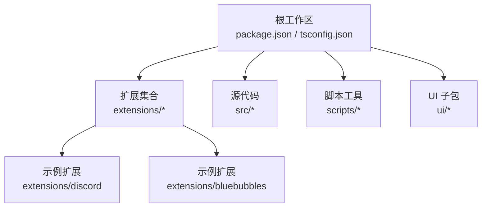
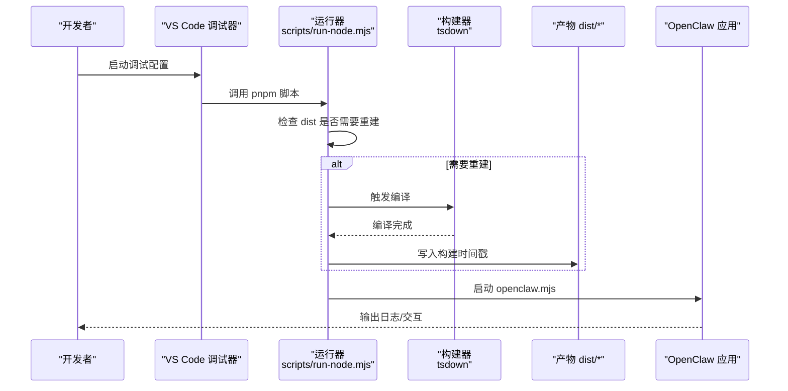
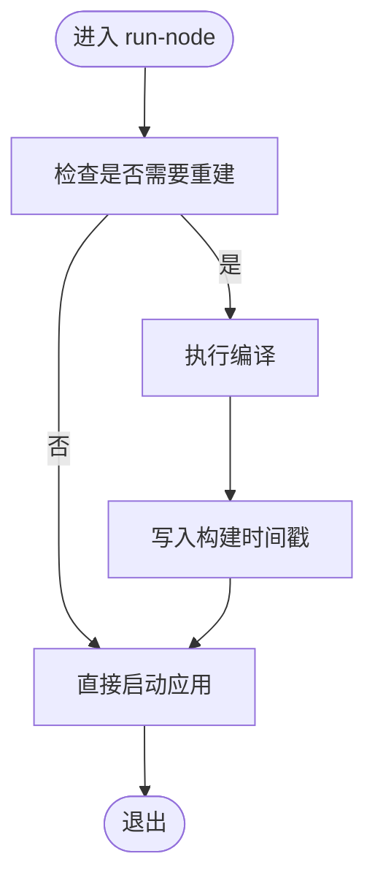
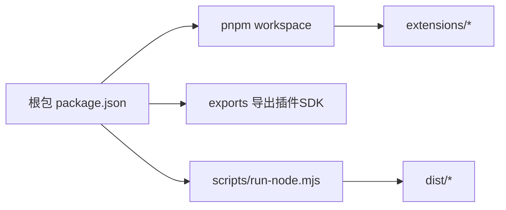

# 开发环境搭建

<cite>
**本文档引用的文件**
- [package.json](file://package.json)
- [tsconfig.json](file://tsconfig.json)
- [tsconfig.plugin-sdk.dts.json](file://tsconfig.plugin-sdk.dts.json)
- [.env.example](file://.env.example)
- [.vscode/settings.json](file://.vscode/settings.json)
- [.vscode/launch.json](file://.vscode/launch.json)
- [.vscode/extensions.json](file://.vscode/extensions.json)
- [scripts/run-node.mjs](file://scripts/run-node.mjs)
- [scripts/watch-node.mjs](file://scripts/watch-node.mjs)
- [scripts/write-plugin-sdk-entry-dts.ts](file://scripts/write-plugin-sdk-entry-dts.ts)
- [src/plugin-sdk/index.ts](file://src/plugin-sdk/index.ts)
- [extensions/discord/openclaw.plugin.json](file://extensions/discord/openclaw.plugin.json)
- [extensions/bluebubbles/openclaw.plugin.json](file://extensions/bluebubbles/openclaw.plugin.json)
</cite>

## 目录

1. [简介](#简介)
2. [项目结构](#项目结构)
3. [核心组件](#核心组件)
4. [架构总览](#架构总览)
5. [详细组件分析](#详细组件分析)
6. [依赖关系分析](#依赖关系分析)
7. [性能考虑](#性能考虑)
8. [故障排查指南](#故障排查指南)
9. [结论](#结论)
10. [附录](#附录)

## 简介

本指南面向希望在OpenClaw生态中开发“插件（extension）”的开发者，目标是帮助你从零搭建可运行的本地开发环境，涵盖以下要点：

- Node.js版本要求与包管理器选择
- TypeScript配置与构建流程
- 插件SDK的安装与类型导出
- 依赖包管理与开发环境变量设置
- IDE（VS Code）配置与调试
- 插件项目的目录结构与文件组织规范
- 环境验证步骤与常见问题排查

## 项目结构

OpenClaw采用多包工作区（pnpm workspace），根目录即工作区根，主要涉及以下区域：

- 根包：包含核心应用、CLI入口、构建脚本与测试配置
- 扩展（extensions）：每个插件以独立子包形式存在，包含插件清单与实现
- UI与文档：独立子包或文档目录
- 脚本：统一的构建、打包、协议生成、测试等自动化脚本

图表来源

- [package.json](file://package.json#L1-L219)
- [extensions/discord/openclaw.plugin.json](file://extensions/discord/openclaw.plugin.json#L1-L10)
- [extensions/bluebubbles/openclaw.plugin.json](file://extensions/bluebubbles/openclaw.plugin.json#L1-L10)

章节来源

- [package.json](file://package.json#L1-L219)

## 核心组件

- Node.js与包管理器
  - Node.js版本要求：引擎字段明确要求Node版本≥指定版本
  - 包管理器：使用pnpm，并在工作区配置中声明仅构建依赖列表
- TypeScript配置
  - 根tsconfig启用严格模式、NodeNext模块解析、路径映射等
  - 为插件SDK单独提供声明输出配置，确保类型导出稳定
- 构建与运行脚本
  - 提供开发运行器与热重载监视器，自动检测源码变更并触发编译
  - 插件SDK的类型入口由脚本生成，保证dist中类型入口稳定
- 插件清单
  - 每个扩展通过openclaw.plugin.json声明其ID、支持的通道与配置Schema

章节来源

- [package.json](file://package.json#L192-L196)
- [package.json](file://package.json#L196-L217)
- [tsconfig.json](file://tsconfig.json#L1-L28)
- [tsconfig.plugin-sdk.dts.json](file://tsconfig.plugin-sdk.dts.json#L1-L16)
- [scripts/run-node.mjs](file://scripts/run-node.mjs#L1-L159)
- [scripts/watch-node.mjs](file://scripts/watch-node.mjs#L1-L60)
- [scripts/write-plugin-sdk-entry-dts.ts](file://scripts/write-plugin-sdk-entry-dts.ts#L1-L10)
- [src/plugin-sdk/index.ts](file://src/plugin-sdk/index.ts#L1-L392)
- [extensions/discord/openclaw.plugin.json](file://extensions/discord/openclaw.plugin.json#L1-L10)
- [extensions/bluebubbles/openclaw.plugin.json](file://extensions/bluebubbles/openclaw.plugin.json#L1-L10)

## 架构总览

下图展示了从IDE到运行时的整体链路，包括TypeScript编译、插件SDK类型生成、以及运行器对源码变更的响应。

图表来源

- [scripts/run-node.mjs](file://scripts/run-node.mjs#L77-L101)
- [scripts/run-node.mjs](file://scripts/run-node.mjs#L135-L158)

## 详细组件分析

### Node.js与包管理器

- 版本要求
  - 项目在engines字段声明最低Node版本，确保TypeScript与工具链兼容性
- 包管理器
  - 使用pnpm作为包管理器，配合workspace与onlyBuiltDependencies优化二进制依赖安装
- 建议
  - 使用nvm或同类型工具切换到满足要求的Node版本后再安装依赖

章节来源

- [package.json](file://package.json#L192-L196)
- [package.json](file://package.json#L196-L217)

### TypeScript配置与构建

- 根tsconfig
  - 严格模式、NodeNext模块解析、DOM/ES2023库、路径别名映射至src
  - 包含src、ui、extensions，排除测试与dist
- 插件SDK类型导出
  - 单独的tsconfig.plugin-sdk.dts.json用于仅生成声明文件，输出到dist/plugin-sdk
  - 构建后由脚本写入稳定的dist/plugin-sdk/index.d.ts，便于TypeScript用户导入
- 建议
  - 在IDE中使用内置TS服务或指定TS SDK路径，避免与oxlint冲突

章节来源

- [tsconfig.json](file://tsconfig.json#L1-L28)
- [tsconfig.plugin-sdk.dts.json](file://tsconfig.plugin-sdk.dts.json#L1-L16)
- [scripts/write-plugin-sdk-entry-dts.ts](file://scripts/write-plugin-sdk-entry-dts.ts#L1-L10)

### 运行器与热重载

- 运行器逻辑
  - 自动判断dist是否过期（基于构建时间戳、tsconfig/package.json修改时间、源码变更）
  - 若需要重建则调用tsdown执行编译，完成后写入构建时间戳并启动应用
- 热重载监视器
  - 同时启动编译器watch与Node进程watch，监听源码变化并重启应用
- 建议
  - 开发时优先使用gateway:dev或watch命令，减少手动编译

图表来源

- [scripts/run-node.mjs](file://scripts/run-node.mjs#L77-L101)
- [scripts/run-node.mjs](file://scripts/run-node.mjs#L135-L158)

章节来源

- [scripts/run-node.mjs](file://scripts/run-node.mjs#L1-L159)
- [scripts/watch-node.mjs](file://scripts/watch-node.mjs#L1-L60)

### 插件SDK与类型导出

- SDK入口
  - src/plugin-sdk/index.ts集中导出插件开发所需类型与工具函数
- 类型产物
  - 通过tsconfig.plugin-sdk.dts.json生成声明文件
  - 通过脚本生成稳定的dist/plugin-sdk/index.d.ts，便于外部消费
- 建议
  - 在插件开发中优先使用开放的类型接口，避免直接依赖内部实现细节

章节来源

- [src/plugin-sdk/index.ts](file://src/plugin-sdk/index.ts#L1-L392)
- [tsconfig.plugin-sdk.dts.json](file://tsconfig.plugin-sdk.dts.json#L1-L16)
- [scripts/write-plugin-sdk-entry-dts.ts](file://scripts/write-plugin-sdk-entry-dts.ts#L1-L10)

### 插件清单与配置Schema

- 清单结构
  - 每个扩展包含openclaw.plugin.json，定义插件ID、支持的通道数组、配置Schema等
- 配置Schema
  - Schema用于校验扩展配置，确保运行时参数合法
- 建议
  - 新增扩展时同步完善openclaw.plugin.json与对应配置Schema

章节来源

- [extensions/discord/openclaw.plugin.json](file://extensions/discord/openclaw.plugin.json#L1-L10)
- [extensions/bluebubbles/openclaw.plugin.json](file://extensions/bluebubbles/openclaw.plugin.json#L1-L10)

### IDE配置（VS Code）

- 推荐扩展
  - oxc（格式化+Lint）、TypeScript Next、GitLens、Vitest Explorer、Swift/Kotlin/YAML/Docker等
  - 避免与oxc冲突的格式化工具（如Prettier、ESLint）
- 设置要点
  - 统一使用oxc作为JS/TS/JSON格式化器
  - 启用TS SDK路径与严格报告
  - 关闭内置JS/TS验证，交由oxlint处理
- 调试配置
  - 支持调试CLI、网关、当前测试文件、TUI等场景
  - 可通过输入参数传入CLI参数

章节来源

- [.vscode/extensions.json](file://.vscode/extensions.json#L1-L40)
- [.vscode/settings.json](file://.vscode/settings.json#L1-L86)
- [.vscode/launch.json](file://.vscode/launch.json#L1-L61)

### 开发环境变量

- 示例环境变量
  - 网关鉴权令牌、状态目录、配置路径、模型提供商密钥、各渠道Token等
- 加载顺序
  - 优先级：进程环境变量 > 仓库内.env > 用户目录下的.env > 配置文件中的env块
- 建议
  - 将真实密钥保存在系统环境或安全存储，不要提交到版本控制

章节来源

- [.env.example](file://.env.example#L1-L71)

## 依赖关系分析

- 工作区与包管理
  - pnpm workspace包含根包、UI子包与所有扩展
  - onlyBuiltDependencies限定需原生编译的包，减少跨平台安装失败
- 构建与导出
  - 根包通过exports导出插件SDK入口，供外部消费
- 运行时与开发时
  - 运行器根据源码变更自动触发增量编译，避免全量重建

图表来源

- [package.json](file://package.json#L1-L219)
- [package.json](file://package.json#L25-L32)
- [scripts/run-node.mjs](file://scripts/run-node.mjs#L1-L159)

章节来源

- [package.json](file://package.json#L1-L219)
- [package.json](file://package.json#L196-L217)

## 性能考虑

- 仅构建依赖
  - 通过onlyBuiltDependencies减少不必要的原生包安装，提升安装速度与稳定性
- 构建缓存与增量编译
  - 运行器基于时间戳与源码变更判断是否重建，避免重复编译
- 并行与并发
  - 测试与脚本提供并行执行选项，缩短整体开发周期

章节来源

- [package.json](file://package.json#L196-L217)
- [scripts/run-node.mjs](file://scripts/run-node.mjs#L77-L101)

## 故障排查指南

- Node版本不匹配
  - 症状：安装或运行时报错
  - 处理：切换到满足engines要求的Node版本
- pnpm安装失败或二进制包不可用
  - 症状：原生依赖安装报错
  - 处理：确认onlyBuiltDependencies策略；必要时清理缓存后重试
- 插件SDK类型缺失
  - 症状：无法找到插件SDK类型
  - 处理：执行插件SDK类型生成脚本，确保dist/plugin-sdk/index.d.ts存在
- 运行器未触发编译
  - 症状：修改源码后无变化
  - 处理：删除dist或设置强制构建环境变量，检查构建时间戳文件
- VS Code格式化冲突
  - 症状：保存时格式化行为异常
  - 处理：禁用冲突扩展，确保oxc为默认格式化器

章节来源

- [package.json](file://package.json#L192-L196)
- [package.json](file://package.json#L196-L217)
- [scripts/write-plugin-sdk-entry-dts.ts](file://scripts/write-plugin-sdk-entry-dts.ts#L1-L10)
- [scripts/run-node.mjs](file://scripts/run-node.mjs#L77-L101)
- [.vscode/settings.json](file://.vscode/settings.json#L37-L55)
- [.vscode/extensions.json](file://.vscode/extensions.json#L34-L39)

## 结论

通过遵循本指南，你可以快速搭建OpenClaw插件开发环境：使用满足要求的Node版本与pnpm，配置TypeScript与插件SDK类型导出，结合VS Code的推荐扩展与调试配置，即可高效进行插件开发与调试。遇到问题时，可依据故障排查指南逐项定位并解决。

## 附录

### A. 插件项目目录结构与文件组织规范

- 扩展根目录
  - 必备文件：openclaw.plugin.json、index.ts（实现入口）、package.json（声明导出）
  - 可选文件：README.md、技能模板、测试等
- 清单字段建议
  - id：插件唯一标识
  - channels：支持的通道名称数组
  - configSchema：配置Schema，用于运行时校验
- 类型与导出
  - 通过根包的exports与插件SDK类型生成脚本，确保外部可正确导入类型

章节来源

- [extensions/discord/openclaw.plugin.json](file://extensions/discord/openclaw.plugin.json#L1-L10)
- [extensions/bluebubbles/openclaw.plugin.json](file://extensions/bluebubbles/openclaw.plugin.json#L1-L10)
- [package.json](file://package.json#L25-L32)
- [scripts/write-plugin-sdk-entry-dts.ts](file://scripts/write-plugin-sdk-entry-dts.ts#L1-L10)

### B. 环境验证步骤

- 安装依赖
  - 使用pnpm安装根包与工作区内所有包
- 生成插件SDK类型
  - 执行插件SDK类型生成脚本，确认dist/plugin-sdk/index.d.ts存在
- 运行开发服务器
  - 使用gateway:dev或watch命令启动，观察编译与热重载
- 验证调试
  - 在VS Code中选择相应调试配置，断点命中且日志输出正常

章节来源

- [package.json](file://package.json#L39-L39)
- [scripts/write-plugin-sdk-entry-dts.ts](file://scripts/write-plugin-sdk-entry-dts.ts#L1-L10)
- [scripts/watch-node.mjs](file://scripts/watch-node.mjs#L1-L60)
- [.vscode/launch.json](file://.vscode/launch.json#L1-L61)
