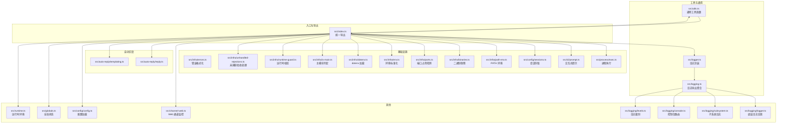
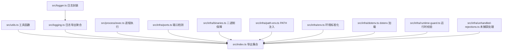
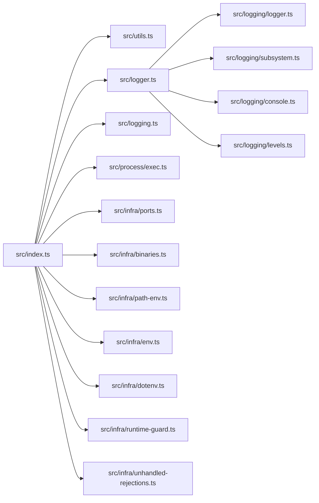

# 工具函数API

<cite>
**本文引用的文件**
- [src/utils.ts](file://src/utils.ts)
- [src/logger.ts](file://src/logger.ts)
- [src/logging.ts](file://src/logging.ts)
- [src/index.ts](file://src/index.ts)
- [src/infra/errors.ts](file://src/infra/errors.ts)
- [src/process/exec.ts](file://src/process/exec.ts)
- [src/cli/prompt.ts](file://src/cli/prompt.ts)
- [src/config/sessions.ts](file://src/config/sessions.ts)
- [src/infra/path-env.ts](file://src/infra/path-env.ts)
- [src/infra/binaries.ts](file://src/infra/binaries.ts)
- [src/infra/ports.ts](file://src/infra/ports.ts)
- [src/infra/env.ts](file://src/infra/env.ts)
- [src/infra/dotenv.ts](file://src/infra/dotenv.ts)
- [src/infra/is-main.ts](file://src/infra/is-main.ts)
- [src/infra/runtime-guard.ts](file://src/infra/runtime-guard.ts)
- [src/infra/unhandled-rejections.ts](file://src/infra/unhandled-rejections.ts)
- [src/channel-web.ts](file://src/channel-web.ts)
- [src/auto-reply/reply.ts](file://src/auto-reply/reply.ts)
- [src/auto-reply/templating.ts](file://src/auto-reply/templating.ts)
- [src/cli/deps.ts](file://src/cli/deps.ts)
- [src/cli/wait.ts](file://src/cli/wait.ts)
- [src/config/config.ts](file://src/config/config.ts)
- [src/globals.ts](file://src/globals.ts)
- [src/logging/logger.ts](file://src/logging/logger.ts)
- [src/logging/subsystem.ts](file://src/logging/subsystem.ts)
- [src/logging/console.ts](file://src/logging/console.ts)
- [src/logging/levels.ts](file://src/logging/levels.ts)
- [src/runtime.ts](file://src/runtime.ts)
</cite>

## 目录

1. [简介](#简介)
2. [项目结构](#项目结构)
3. [核心组件](#核心组件)
4. [架构总览](#架构总览)
5. [详细组件分析](#详细组件分析)
6. [依赖关系分析](#依赖关系分析)
7. [性能考量](#性能考量)
8. [故障排查指南](#故障排查指南)
9. [结论](#结论)
10. [附录](#附录)

## 简介

本参考文档面向插件开发者，系统性梳理 OpenClaw 的基础工具函数与辅助能力，覆盖字符串处理、数值转换、路径解析、JSON 安全解析、类型守卫、通道与号码规范化、日志记录、诊断事件、进程执行、会话管理、环境与运行时保障等常用能力。文档以“可直接用于插件开发”的方式组织，强调使用场景、参数约束、返回值语义与常见问题的解决思路。

## 项目结构

OpenClaw 将工具函数集中于 src/utils.ts，并通过 src/index.ts 汇总导出供上层模块使用；日志体系由 src/logger.ts 与 src/logging.ts 提供统一入口；运行时与基础设施（端口、二进制、环境变量、未捕获异常）在 src/infra/_ 与 src/process/_ 下实现；自动回复与模板化在 src/auto-reply/_ 中提供；CLI 依赖与默认依赖构建在 src/cli/_ 中。

图表来源

- [src/utils.ts](file://src/utils.ts#L1-L402)
- [src/logger.ts](file://src/logger.ts#L1-L62)
- [src/logging.ts](file://src/logging.ts#L1-L68)
- [src/index.ts](file://src/index.ts#L1-L94)
- [src/infra/errors.ts](file://src/infra/errors.ts)
- [src/process/exec.ts](file://src/process/exec.ts)
- [src/cli/prompt.ts](file://src/cli/prompt.ts)
- [src/config/sessions.ts](file://src/config/sessions.ts)
- [src/infra/path-env.ts](file://src/infra/path-env.ts)
- [src/infra/binaries.ts](file://src/infra/binaries.ts)
- [src/infra/ports.ts](file://src/infra/ports.ts)
- [src/infra/env.ts](file://src/infra/env.ts)
- [src/infra/dotenv.ts](file://src/infra/dotenv.ts)
- [src/infra/is-main.ts](file://src/infra/is-main.ts)
- [src/infra/runtime-guard.ts](file://src/infra/runtime-guard.ts)
- [src/infra/unhandled-rejections.ts](file://src/infra/unhandled-rejections.ts)
- [src/channel-web.ts](file://src/channel-web.ts)
- [src/auto-reply/reply.ts](file://src/auto-reply/reply.ts)
- [src/auto-reply/templating.ts](file://src/auto-reply/templating.ts)
- [src/config/config.ts](file://src/config/config.ts)
- [src/globals.ts](file://src/globals.ts)
- [src/logging/logger.ts](file://src/logging/logger.ts)
- [src/logging/subsystem.ts](file://src/logging/subsystem.ts)
- [src/logging/console.ts](file://src/logging/console.ts)
- [src/logging/levels.ts](file://src/logging/levels.ts)
- [src/runtime.ts](file://src/runtime.ts)

章节来源

- [src/index.ts](file://src/index.ts#L1-L94)

## 核心组件

- 字符串与路径处理：路径存在性检查、路径规范化、用户路径解析、家目录短名显示、终端链接格式化、UTF-16 安全切片与截断、正则转义、安全 JSON 解析、类型守卫。
- 数值与范围：数字与整数夹取（clamp）、睡眠等待。
- 通信与号码：Web 通道断言、WhatsApp 号码前缀与 E.164 规范化、JID 与 E.164 转换、LID 映射查找、自对话模式判断。
- 日志与诊断：统一 info/warn/success/error/debug 输出、子系统日志、控制台路由与时间戳、日志级别与最小级别映射、日志文件位置与重置。
- 进程与系统：命令执行与超时、端口可用性检查、二进制保障、PATH 注入、环境变量标准化、dotenv 加载、主模块判定、运行时版本校验、未捕获异常与拒绝处理。
- 自动回复：模板应用与自动回复生成。
- 会话：会话密钥派生、会话存储读写、会话路径解析。

章节来源

- [src/utils.ts](file://src/utils.ts#L12-L402)
- [src/logger.ts](file://src/logger.ts#L17-L61)
- [src/logging.ts](file://src/logging.ts#L33-L67)
- [src/process/exec.ts](file://src/process/exec.ts)
- [src/infra/ports.ts](file://src/infra/ports.ts)
- [src/infra/binaries.ts](file://src/infra/binaries.ts)
- [src/infra/path-env.ts](file://src/infra/path-env.ts)
- [src/infra/env.ts](file://src/infra/env.ts)
- [src/infra/dotenv.ts](file://src/infra/dotenv.ts)
- [src/infra/is-main.ts](file://src/infra/is-main.ts)
- [src/infra/runtime-guard.ts](file://src/infra/runtime-guard.ts)
- [src/infra/unhandled-rejections.ts](file://src/infra/unhandled-rejections.ts)
- [src/auto-reply/reply.ts](file://src/auto-reply/reply.ts)
- [src/auto-reply/templating.ts](file://src/auto-reply/templating.ts)
- [src/config/sessions.ts](file://src/config/sessions.ts)

## 架构总览

下图展示工具函数与日志、进程、基础设施之间的交互关系，以及插件开发中最常使用的导出集合。

图表来源

- [src/index.ts](file://src/index.ts#L50-L73)
- [src/utils.ts](file://src/utils.ts#L12-L402)
- [src/logger.ts](file://src/logger.ts#L17-L61)
- [src/logging.ts](file://src/logging.ts#L33-L67)
- [src/process/exec.ts](file://src/process/exec.ts)
- [src/infra/ports.ts](file://src/infra/ports.ts)
- [src/infra/binaries.ts](file://src/infra/binaries.ts)
- [src/infra/path-env.ts](file://src/infra/path-env.ts)
- [src/infra/env.ts](file://src/infra/env.ts)
- [src/infra/dotenv.ts](file://src/infra/dotenv.ts)
- [src/infra/runtime-guard.ts](file://src/infra/runtime-guard.ts)
- [src/infra/unhandled-rejections.ts](file://src/infra/unhandled-rejections.ts)

## 详细组件分析

### 字符串与路径处理

- 路径存在性检查：异步判断目标路径是否存在，返回布尔值，适合插件初始化阶段的前置检查。
- 路径规范化：确保路径以斜杠开头，便于统一拼接。
- 用户路径解析：支持波浪号展开与绝对路径解析，兼容不同平台的家目录表示。
- 家目录短名显示：将真实路径中的家目录替换为 ~ 或环境变量前缀，提升日志可读性。
- 终端链接格式化：在 TTY 环境输出可点击链接，非 TTY 环境回退为文本形式。
- UTF-16 安全切片与截断：避免在代理字符边界切割导致的字符损坏，适用于消息长度限制与分片场景。
- 正则转义：对特殊字符进行转义，保证作为字面量参与正则匹配的安全性。
- 安全 JSON 解析：捕获异常并返回空值，避免插件因非法输入崩溃。
- 类型守卫：区分纯对象与任意记录类型，便于在运行时做更严格的类型约束。

使用建议

- 在插件读取配置或外部输入时，优先使用安全 JSON 解析与类型守卫。
- 对跨平台路径操作，统一使用用户路径解析与短名显示，减少平台差异带来的问题。
- 处理用户输入的正则表达式时，务必先进行转义。

章节来源

- [src/utils.ts](file://src/utils.ts#L19-L26)
- [src/utils.ts](file://src/utils.ts#L86-L91)
- [src/utils.ts](file://src/utils.ts#L295-L309)
- [src/utils.ts](file://src/utils.ts#L347-L382)
- [src/utils.ts](file://src/utils.ts#L384-L398)
- [src/utils.ts](file://src/utils.ts#L258-L293)
- [src/utils.ts](file://src/utils.ts#L42-L44)
- [src/utils.ts](file://src/utils.ts#L49-L55)
- [src/utils.ts](file://src/utils.ts#L61-L76)

### 数值与范围控制

- 数字夹取与整数夹取：clampNumber 支持浮点夹取，clampInt 先向下取整再夹取，适合 UI 与阈值控制。
- 睡眠等待：基于 Promise 的毫秒级延迟，常用于重试、节流与异步调度。

使用建议

- 在需要限制输入范围时，优先使用 clamp；若需严格整数，使用 clampInt。
- 使用 sleep 实现幂等重试策略时，结合指数退避与最大重试次数。

章节来源

- [src/utils.ts](file://src/utils.ts#L28-L34)
- [src/utils.ts](file://src/utils.ts#L246-L248)

### 通信与号码规范

- Web 通道断言：确保仅在 web 渠道调用相关逻辑，避免误用。
- WhatsApp 前缀与 E.164 规范化：统一号码格式，去除前缀与非数字字符，确保 + 开头。
- JID 与 E.164 转换：支持标准 JID 与 LID 格式，从 LID 查找反向映射，必要时通过 lidLookup 回退。
- 自对话模式判断：当网关以自身号码登录且允许来源包含该号码时，进入自对话模式，避免无意义副作用。

使用建议

- 插件在处理 WhatsApp 消息时，先进行 E.164 规范化，再进行 JID 转换。
- 在多设备或 LID 场景，优先尝试本地映射，失败后再使用 lidLookup 查询。

章节来源

- [src/utils.ts](file://src/utils.ts#L80-L84)
- [src/utils.ts](file://src/utils.ts#L93-L104)
- [src/utils.ts](file://src/utils.ts#L134-L142)
- [src/utils.ts](file://src/utils.ts#L190-L213)
- [src/utils.ts](file://src/utils.ts#L215-L244)
- [src/utils.ts](file://src/utils.ts#L111-L132)

### 日志记录与诊断

- 统一日志接口：logInfo/logWarn/logSuccess/logError/logDebug，支持子系统前缀自动拆分与定向路由。
- 子系统日志：按子系统创建独立 logger，便于筛选与聚合。
- 控制台路由：可设置子系统到控制台的过滤器、时间戳前缀、是否将控制台输出路由至 stderr。
- 日志级别：提供级别归一化、最小级别映射与文件级别开关。
- 日志文件：默认日志目录与文件名，支持重置与覆盖。

使用建议

- 在插件中，优先使用 logInfo/logWarn/logError 记录业务事件与异常；调试信息使用 logDebug 并配合 verbose。
- 为关键流程添加子系统前缀，便于在大规模日志中快速定位。

章节来源

- [src/logger.ts](file://src/logger.ts#L17-L61)
- [src/logging.ts](file://src/logging.ts#L33-L67)
- [src/logging/logger.ts](file://src/logging/logger.ts)
- [src/logging/subsystem.ts](file://src/logging/subsystem.ts)
- [src/logging/console.ts](file://src/logging/console.ts)
- [src/logging/levels.ts](file://src/logging/levels.ts)

### 进程执行与系统能力

- 命令执行与超时：runExec/runCommandWithTimeout，支持超时控制与错误传播。
- 端口占用检测：ensurePortAvailable/describePortOwner/handlePortError，用于服务启动前的端口健康检查。
- 二进制保障：ensureBinary，确保外部二进制存在于 PATH 或指定目录。
- PATH 注入：ensureOpenClawCliOnPath，保证 CLI 工具在执行链路中可用。
- 环境标准化：normalizeEnv/loadDotEnv，统一环境变量来源与格式。
- 主模块判定：isMainModule，用于区分脚本直接运行与被导入。
- 运行时校验：assertSupportedRuntime，强制最低运行时版本。
- 未捕获异常与拒绝处理：installUnhandledRejectionHandler，防止静默崩溃。

使用建议

- 在插件中调用外部命令时，务必设置合理超时并捕获错误。
- 启动服务前使用端口检测，避免冲突。
- 通过 PATH 注入与二进制保障，确保依赖稳定可用。

章节来源

- [src/process/exec.ts](file://src/process/exec.ts)
- [src/infra/ports.ts](file://src/infra/ports.ts#L25-L29)
- [src/infra/binaries.ts](file://src/infra/binaries.ts)
- [src/infra/path-env.ts](file://src/infra/path-env.ts)
- [src/infra/env.ts](file://src/infra/env.ts)
- [src/infra/dotenv.ts](file://src/infra/dotenv.ts)
- [src/infra/is-main.ts](file://src/infra/is-main.ts)
- [src/infra/runtime-guard.ts](file://src/infra/runtime-guard.ts)
- [src/infra/unhandled-rejections.ts](file://src/infra/unhandled-rejections.ts)

### 自动回复与模板化

- 自动回复生成：getReplyFromConfig，根据配置生成回复内容。
- 模板应用：applyTemplate，支持占位符替换与上下文渲染。

使用建议

- 在消息通道中，先生成模板化回复，再进行号码与通道规范化处理。

章节来源

- [src/auto-reply/reply.ts](file://src/auto-reply/reply.ts)
- [src/auto-reply/templating.ts](file://src/auto-reply/templating.ts)

### 会话管理

- 会话密钥派生：deriveSessionKey，从配置或上下文派生会话密钥。
- 会话存储：loadSessionStore/saveSessionStore，持久化与恢复会话状态。
- 会话路径解析：resolveSessionKey/resolveStorePath，定位会话数据文件。

使用建议

- 插件在多轮对话中应复用会话存储，避免重复初始化。
- 注意会话路径权限与跨平台兼容。

章节来源

- [src/config/sessions.ts](file://src/config/sessions.ts)

### Web 通道监控

- monitorWebChannel：监控 Web 通道状态与事件，便于插件感知前端交互。

使用建议

- 在 Web 插件中，结合通道监控与日志记录，追踪用户行为与异常。

章节来源

- [src/channel-web.ts](file://src/channel-web.ts)

### CLI 依赖与交互

- 创建默认依赖：createDefaultDeps，为 CLI 初始化提供依赖注入。
- 交互式提示：promptYesNo，简化确认流程。
- 等待：waitForever，用于守护进程或长任务。

使用建议

- 在 CLI 插件中，使用 promptYesNo 获取用户确认，避免误操作。

章节来源

- [src/cli/deps.ts](file://src/cli/deps.ts)
- [src/cli/prompt.ts](file://src/cli/prompt.ts)
- [src/cli/wait.ts](file://src/cli/wait.ts)

## 依赖关系分析

工具函数与日志、进程、基础设施之间存在清晰的分层依赖：index.ts 作为统一出口，向上层模块提供稳定的 API；utils.ts 位于核心层，被广泛依赖；logger.ts 与 logging.ts 提供一致的日志抽象；infra/_ 与 process/_ 为系统级能力提供支撑。

图表来源

- [src/index.ts](file://src/index.ts#L50-L73)
- [src/utils.ts](file://src/utils.ts#L12-L402)
- [src/logger.ts](file://src/logger.ts#L17-L61)
- [src/logging.ts](file://src/logging.ts#L33-L67)
- [src/process/exec.ts](file://src/process/exec.ts)
- [src/infra/ports.ts](file://src/infra/ports.ts)
- [src/infra/binaries.ts](file://src/infra/binaries.ts)
- [src/infra/path-env.ts](file://src/infra/path-env.ts)
- [src/infra/env.ts](file://src/infra/env.ts)
- [src/infra/dotenv.ts](file://src/infra/dotenv.ts)
- [src/infra/runtime-guard.ts](file://src/infra/runtime-guard.ts)
- [src/infra/unhandled-rejections.ts](file://src/infra/unhandled-rejections.ts)
- [src/logging/logger.ts](file://src/logging/logger.ts)
- [src/logging/subsystem.ts](file://src/logging/subsystem.ts)
- [src/logging/console.ts](file://src/logging/console.ts)
- [src/logging/levels.ts](file://src/logging/levels.ts)

## 性能考量

- 异步 I/O：路径存在性检查与文件读取采用异步 API，避免阻塞主线程。
- UTF-16 安全切片：在长文本截断时避免字符边界破坏，减少重试与修复成本。
- 日志级别与文件路由：通过最小级别与文件级别开关，降低磁盘写入压力。
- 进程执行超时：为外部命令设置超时，避免长时间挂起影响插件响应。

## 故障排查指南

- 日志无法输出到控制台
  - 检查控制台路由设置与子系统过滤器，确认 shouldLogSubsystemToConsole 与 setConsoleSubsystemFilter。
  - 确认是否启用了控制台捕获 enableConsoleCapture。
- 端口占用导致启动失败
  - 使用 ensurePortAvailable 检测端口，结合 describePortOwner 定位占用者，必要时 handlePortError 进行友好报错。
- 外部二进制缺失
  - 使用 ensureBinary 确保二进制存在；如需注入 PATH，使用 ensureOpenClawCliOnPath。
- 环境变量不生效
  - 使用 normalizeEnv 与 loadDotEnv 标准化环境来源，避免大小写与格式差异。
- 插件崩溃无栈
  - 确保已安装未捕获拒绝处理器 installUnhandledRejectionHandler，并在主模块中注册 uncaughtException 处理。
- WhatsApp 号码格式异常
  - 使用 normalizeE164 与 toWhatsappJid 规范化号码与 JID，必要时通过 jidToE164 与 resolveJidToE164 解析 LID。
- JSON 解析失败
  - 使用 safeParseJson 替代原生 JSON.parse，避免异常传播。

章节来源

- [src/infra/ports.ts](file://src/infra/ports.ts#L25-L29)
- [src/infra/binaries.ts](file://src/infra/binaries.ts)
- [src/infra/path-env.ts](file://src/infra/path-env.ts)
- [src/infra/env.ts](file://src/infra/env.ts)
- [src/infra/dotenv.ts](file://src/infra/dotenv.ts)
- [src/infra/unhandled-rejections.ts](file://src/infra/unhandled-rejections.ts)
- [src/utils.ts](file://src/utils.ts#L97-L104)
- [src/utils.ts](file://src/utils.ts#L134-L142)
- [src/utils.ts](file://src/utils.ts#L190-L213)
- [src/utils.ts](file://src/utils.ts#L215-L244)
- [src/utils.ts](file://src/utils.ts#L49-L55)

## 结论

OpenClaw 的工具函数 API 以“安全、可组合、可观测”为核心设计原则，覆盖插件开发所需的字符串处理、数值控制、路径解析、日志记录、进程执行、系统保障与通信规范。通过统一导出与清晰的分层依赖，插件开发者可以快速集成并稳定运行。

## 附录

- 常用导出一览（来自 index.ts）
  - 通道与号码：assertWebChannel、normalizeE164、toWhatsappJid
  - 日志：logInfo、logWarn、logSuccess、logError、logDebug
  - 进程：runExec、runCommandWithTimeout
  - 系统：ensurePortAvailable、describePortOwner、handlePortError、PortInUseError
  - 二进制与 PATH：ensureBinary、ensureOpenClawCliOnPath
  - 环境：normalizeEnv、loadDotEnv
  - 会话：deriveSessionKey、loadSessionStore、resolveSessionKey、resolveStorePath、saveSessionStore
  - 其他：applyTemplate、monitorWebChannel、waitForever、createDefaultDeps、promptYesNo

章节来源

- [src/index.ts](file://src/index.ts#L50-L73)
