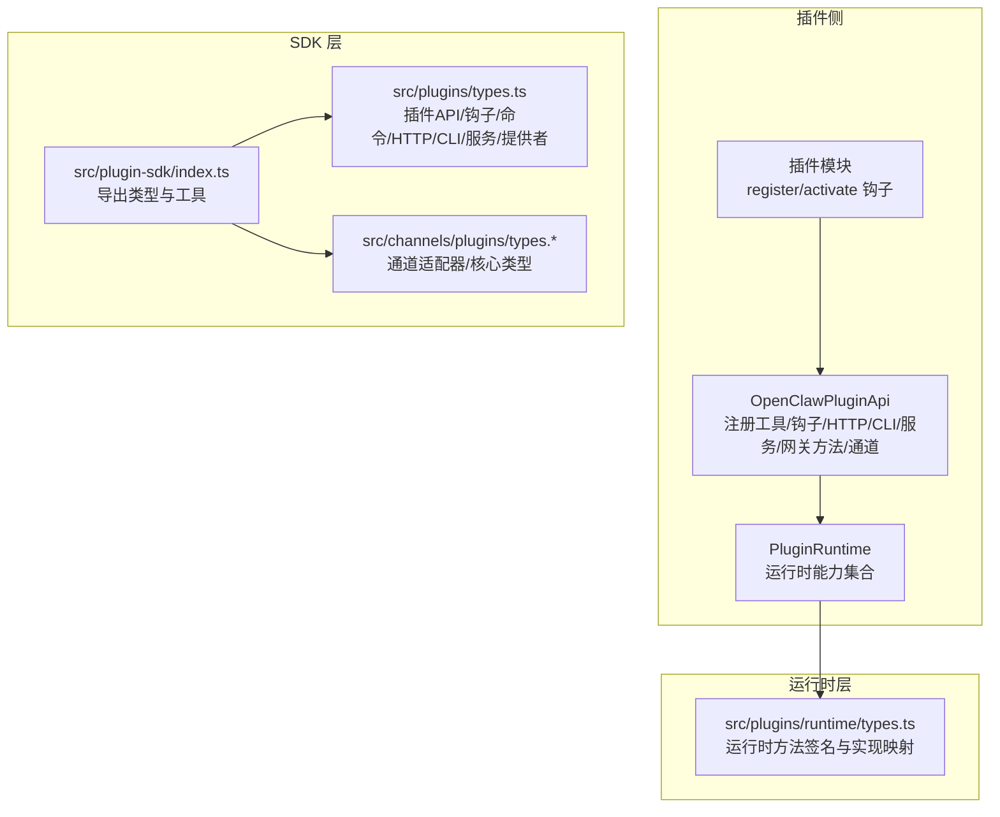
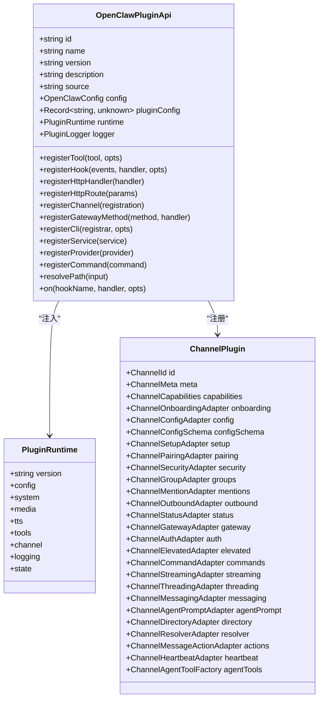
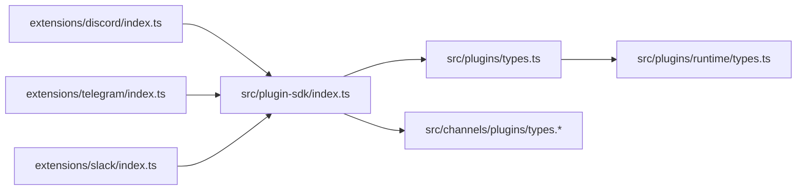

# 插件API参考

<cite>
**本文引用的文件**
- [src/plugin-sdk/index.ts](file://src/plugin-sdk/index.ts)
- [src/plugins/types.ts](file://src/plugins/types.ts)
- [src/plugins/runtime/types.ts](file://src/plugins/runtime/types.ts)
- [src/channels/plugins/types.ts](file://src/channels/plugins/types.ts)
- [src/channels/plugins/types.plugin.ts](file://src/channels/plugins/types.plugin.ts)
- [src/channels/plugins/types.adapters.ts](file://src/channels/plugins/types.adapters.ts)
- [src/channels/plugins/types.core.ts](file://src/channels/plugins/types.core.ts)
- [src/config/config.ts](file://src/config/config.ts)
- [scripts/write-plugin-sdk-entry-dts.ts](file://scripts/write-plugin-sdk-entry-dts.ts)
- [extensions/discord/index.ts](file://extensions/discord/index.ts)
- [extensions/telegram/index.ts](file://extensions/telegram/index.ts)
- [extensions/slack/index.ts](file://extensions/slack/index.ts)
- [docs/refactor/plugin-sdk.md](file://docs/refactor/plugin-sdk.md)
</cite>

## 目录

1. [简介](#简介)
2. [项目结构](#项目结构)
3. [核心组件](#核心组件)
4. [架构总览](#架构总览)
5. [详细组件分析](#详细组件分析)
6. [依赖关系分析](#依赖关系分析)
7. [性能考量](#性能考量)
8. [故障排查指南](#故障排查指南)
9. [结论](#结论)
10. [附录](#附录)

## 简介

本参考文档面向插件开发者，系统性梳理 OpenClaw 插件SDK与运行时（Runtime）的完整API，覆盖通道适配器、网关方法、配置模式、工具定义、生命周期与事件钩子、回调注册、常用工具函数与辅助类，以及版本兼容与迁移策略。目标是帮助你在不直接导入核心源码的前提下，通过稳定且可发布的SDK完成插件开发与集成。

## 项目结构

OpenClaw 将“插件SDK”与“插件运行时”分层设计：

- SDK：仅暴露类型、配置工具、帮助器与常量，无运行时状态与副作用，便于发布与版本化。
- 运行时：通过 OpenClawPluginApi.runtime 暴露对核心行为的调用，插件不得直接导入 src/\*\*，必须经由运行时访问。

图表来源

- [src/plugin-sdk/index.ts](file://src/plugin-sdk/index.ts#L1-L392)
- [src/plugins/types.ts](file://src/plugins/types.ts#L244-L283)
- [src/plugins/runtime/types.ts](file://src/plugins/runtime/types.ts#L178-L362)
- [src/channels/plugins/types.ts](file://src/channels/plugins/types.ts#L1-L64)

章节来源

- [src/plugin-sdk/index.ts](file://src/plugin-sdk/index.ts#L1-L392)
- [docs/refactor/plugin-sdk.md](file://docs/refactor/plugin-sdk.md#L1-L215)

## 核心组件

- 插件API（OpenClawPluginApi）
  - 职责：在插件生命周期内提供注册与访问能力，包括工具、钩子、HTTP路由、CLI、服务、网关方法、通道注册等。
  - 关键字段与方法：id/name/version/description/source/config/pluginConfig/runtime/logger；registerTool/registerHook/registerHttpHandler/registerHttpRoute/registerCli/registerService/registerGatewayMethod/registerChannel/registerCommand。
  - 生命周期钩子：on(hookName, handler, opts?)。
- 插件运行时（PluginRuntime）
  - 职责：封装对核心功能的调用，如文本分块、回复派发、路由解析、配对、媒体处理、提及匹配、群组策略、去抖动、命令授权、各通道能力等。
  - 结构：config/system/media/tts/tools/channel/activity/session/mentions/reactions/groups/debounce/commands/discord/slack/telegram/signal/imessage/whatsapp/line/logging/state。
- 通道插件（ChannelPlugin）
  - 职责：描述一个通道的适配器集合与能力，如配置、设置、配对、安全、群组、提及、出站、状态、网关、认证、提升权限、命令、流式、线程、消息、代理提示、目录、解析、动作、心跳、代理工具等。
  - 关键字段：id/meta/capabilities/defaults/reload/onboarding/config/configSchema/setup/pairing/security/groups/mentions/outbound/status/gatewayMethods/gateway/auth/elevated/commands/streaming/threading/messaging/agentPrompt/directory/resolver/actions/heartbeat/agentTools。
- 提供者（ProviderPlugin）
  - 职责：声明模型提供商的标识、标签、文档路径、别名、环境变量、模型列表、认证方法（OAuth/API Key/Token/设备码/自定义），并支持格式化密钥与刷新OAuth。
- 配置与校验（OpenClawPluginConfigSchema）
  - 职责：提供 safeParse/parse/validate/uiHints/jsonSchema 等能力，用于插件配置的校验与UI提示生成。

章节来源

- [src/plugins/types.ts](file://src/plugins/types.ts#L244-L283)
- [src/plugins/runtime/types.ts](file://src/plugins/runtime/types.ts#L178-L362)
- [src/channels/plugins/types.plugin.ts](file://src/channels/plugins/types.plugin.ts#L48-L84)
- [src/plugins/types.ts](file://src/plugins/types.ts#L115-L125)
- [src/plugins/types.ts](file://src/plugins/types.ts#L43-L55)

## 架构总览

下图展示插件SDK、运行时与通道适配器之间的交互关系，以及插件如何通过 OpenClawPluginApi 注册各类能力。

图表来源

- [src/plugins/types.ts](file://src/plugins/types.ts#L244-L283)
- [src/plugins/runtime/types.ts](file://src/plugins/runtime/types.ts#L178-L362)
- [src/channels/plugins/types.plugin.ts](file://src/channels/plugins/types.plugin.ts#L48-L84)

## 详细组件分析

### 通道适配器（Channel Adapters）

通道适配器定义了插件与具体消息渠道的对接契约，涵盖配置、设置、配对、安全、群组、提及、出站、状态、网关、认证、提升权限、命令、流式、线程、消息、代理提示、目录、解析、动作、心跳、代理工具等。

- 配置适配器（ChannelConfigAdapter）
  - 能力：列出账户ID、解析账户、启用/禁用账户、删除账户、描述账户快照、解析/格式化允许来源等。
  - 典型用途：在多账户通道中管理账户生命周期与配置。
- 设置适配器（ChannelSetupAdapter）
  - 能力：解析默认账户ID、应用账户名称、应用账户配置、输入校验。
  - 典型用途：在首次接入或重配置时规范化输入。
- 出站适配器（ChannelOutboundAdapter）
  - 能力：目标解析、文本/媒体/投票发送、分块策略（文本/Markdown）、轮询选项上限。
  - 典型用途：统一不同通道的消息投递语义。
- 状态适配器（ChannelStatusAdapter）
  - 能力：构建账户摘要、探测账户、审计账户、生成快照、记录自身ID、解析账户状态、收集状态问题。
  - 典型用途：健康检查与诊断。
- 网关适配器（ChannelGatewayAdapter）
  - 能力：启动/停止账户、二维码登录开始/等待、登出账户。
  - 典型用途：Web/二维码登录流程。
- 安全适配器（ChannelSecurityAdapter）
  - 能力：解析DM策略、收集警告。
  - 典型用途：限制私信来源与风险提示。
- 群组适配器（ChannelGroupAdapter）
  - 能力：解析是否需要@、群组介绍提示、工具策略。
  - 典型用途：群组内的权限与行为控制。
- 提及适配器（ChannelMentionAdapter）
  - 能力：剥离提及模式与文本。
  - 典型用途：在非@场景下清理提及标记。
- 流式适配器（ChannelStreamingAdapter）
  - 能力：定义分块合并默认参数（最小字符数、空闲毫秒）。
  - 典型用途：优化长文本输出体验。
- 线程适配器（ChannelThreadingAdapter）
  - 能力：解析回复到模式、构建工具上下文、跳过跨上下文装饰。
  - 典型用途：在转发/回话中保持上下文一致性。
- 命令适配器（ChannelCommandAdapter）
  - 能力：强制所有者权限、当配置为空时跳过命令处理。
  - 典型用途：保护敏感命令。
- 解析适配器（ChannelResolverAdapter）
  - 能力：解析用户/群组ID。
  - 典型用途：将人类输入转换为平台ID。
- 目录适配器（ChannelDirectoryAdapter）
  - 能力：查询自己、用户、群组、成员列表（静态/实时）。
  - 典型用途：UI选择器与自动补全。
- 心跳适配器（ChannelHeartbeatAdapter）
  - 能力：就绪检查、解析接收者。
  - 典型用途：健康监测与告警。
- 提升权限适配器（ChannelElevatedAdapter）
  - 能力：回退允许来源。
  - 典型用途：在受限环境下放宽策略。
- 认证适配器（ChannelAuthAdapter）
  - 能力：登录（带运行时与详细日志）。
  - 典型用途：一次性登录或凭据刷新。
- 消息适配器（ChannelMessagingAdapter）
  - 能力：标准化目标、目标解析器提示、格式化显示。
  - 典型用途：跨通道一致的目标表达。
- 代理提示适配器（ChannelAgentPromptAdapter）
  - 能力：生成工具提示。
  - 典型用途：引导代理正确使用工具。
- 动作适配器（ChannelMessageActionAdapter）
  - 能力：列出动作、支持按钮/卡片、提取工具发送目标、处理动作。
  - 典型用途：富媒体交互（菜单、按钮、卡片）。
- 核心类型（Channel\*）
  - 包括：ChannelId、ChannelCapabilities、ChannelMeta、ChannelAccountSnapshot、ChannelAccountState、ChannelStatusIssue、ChannelGroupContext、ChannelOutboundTargetMode、ChannelLogSink、ChannelPollResult、ChannelPollContext、ChannelToolSend、ChannelDirectoryEntry、ChannelMessageActionName、ChannelMessageActionContext 等。

章节来源

- [src/channels/plugins/types.adapters.ts](file://src/channels/plugins/types.adapters.ts#L22-L313)
- [src/channels/plugins/types.core.ts](file://src/channels/plugins/types.core.ts#L11-L338)

### 网关方法（Gateway Methods）

- 类型：GatewayRequestHandler、GatewayRequestHandlerOptions、RespondFn。
- 作用：允许插件注册自定义网关请求处理器，以扩展HTTP/IPC入口点。
- 使用：api.registerGatewayMethod(method, handler)。

章节来源

- [src/plugins/types.ts](file://src/plugins/types.ts#L127-L130)
- [src/plugin-sdk/index.ts](file://src/plugin-sdk/index.ts#L69-L73)

### 配置模式（Plugin Config Schema）

- 类型：OpenClawPluginConfigSchema。
- 能力：safeParse/parse/validate/uiHints/jsonSchema。
- 用途：为插件提供结构化配置校验与UI提示，确保配置一致性与可维护性。
- 工具：emptyPluginConfigSchema。

章节来源

- [src/plugins/types.ts](file://src/plugins/types.ts#L43-L55)
- [src/plugin-sdk/index.ts](file://src/plugin-sdk/index.ts#L77-L77)

### 工具定义（Agent Tools）

- 工具工厂：OpenClawPluginToolFactory(ctx) -> AnyAgentTool | AnyAgentTool[] | null | undefined。
- 工具上下文：OpenClawPluginToolContext（包含 config/workspaceDir/agentDir/agentId/sessionKey/messageChannel/agentAccountId/sandboxed）。
- 工具选项：OpenClawPluginToolOptions（name/names/optional）。
- 注册：api.registerTool(tool | factory, opts)。
- 常用工具：内存检索/搜索工具（createMemoryGetTool/createMemorySearchTool），并可通过 registerMemoryCli 注册CLI。

章节来源

- [src/plugins/types.ts](file://src/plugins/types.ts#L68-L76)
- [src/plugins/types.ts](file://src/plugins/types.ts#L57-L66)
- [src/plugins/runtime/types.ts](file://src/plugins/runtime/types.ts#L200-L204)

### 生命周期与事件钩子（Lifecycle & Hooks）

- 生命周期钩子（on）：before_agent_start、agent_end、before_compaction、after_compaction、message_received、message_sending、message_sent、before_tool_call、after_tool_call、tool_result_persist、session_start、session_end、gateway_start、gateway_stop。
- 事件钩子（registerHook）：支持字符串或数组事件名，处理器类型按钩子名映射。
- 钩子上下文与结果：
  - Agent：PluginHookAgentContext
  - 消息：PluginHookMessageContext；发送前可修改内容或取消
  - 工具：PluginHookToolContext；可阻断调用并给出原因
  - 会话：PluginHookSessionContext
  - 网关：PluginHookGatewayContext
- 使用：api.on/hookName, handler, opts?；api.registerHook(events, handler, opts?)

章节来源

- [src/plugins/types.ts](file://src/plugins/types.ts#L298-L537)

### 回调与注册（Callbacks & Registration）

- HTTP 回调：registerHttpHandler(handler)、registerHttpRoute({ path, handler })。
- CLI 注册：registerCli(registrar, opts?)。
- 服务注册：registerService(service)。
- 通道注册：registerChannel({ plugin } | ChannelPlugin)。
- 命令注册：registerCommand(command)。
- 提供者注册：registerProvider(provider)。

章节来源

- [src/plugins/types.ts](file://src/plugins/types.ts#L254-L269)
- [src/plugins/types.ts](file://src/plugins/types.ts#L179-L190)

### 常用工具函数与辅助类

- 文本与分块：chunkMarkdownText、chunkText、resolveTextChunkLimit、resolveChunkMode、convertMarkdownTables、resolveMarkdownTableMode、hasControlCommand。
- 回复派发：dispatchReplyWithBufferedBlockDispatcher、createReplyDispatcherWithTyping、dispatchReplyFromConfig、formatAgentEnvelope、formatInboundEnvelope、resolveEnvelopeFormatOptions、finalizeInboundContext。
- 路由与会话：resolveAgentRoute、recordInboundSession、recordSessionMetaFromInbound、resolveStorePath、readSessionUpdatedAt、updateLastRoute。
- 配对与允许来源：buildPairingReply、readAllowFromStore、upsertPairingRequest。
- 媒体：fetchRemoteMedia、saveMediaBuffer、loadWebMedia、detectMime、mediaKindFromMime、isVoiceCompatibleAudio、getImageMetadata、resizeToJpeg。
- 提及与反应：buildMentionRegexes、matchesMentionPatterns、matchesMentionWithExplicit、shouldAckReaction、removeAckReactionAfterReply。
- 群组与去抖动：resolveGroupPolicy、resolveRequireMention、createInboundDebouncer、resolveInboundDebounceMs。
- 命令授权：resolveCommandAuthorizedFromAuthorizers、isControlCommandMessage、shouldComputeCommandAuthorized、shouldHandleTextCommands。
- 日志与状态：shouldLogVerbose、getChildLogger、resolveStateDir。
- 通道特定能力：Discord/Slack/Telegram/Signal/iMessage/WhatsApp/LINE 的探针、发送、监控、动作、登录等。

章节来源

- [src/plugins/runtime/types.ts](file://src/plugins/runtime/types.ts#L178-L362)
- [src/plugin-sdk/index.ts](file://src/plugin-sdk/index.ts#L240-L267)

### API 版本兼容性与迁移指南

- SDK：语义化版本，发布与文档变更明确。
- 运行时：随核心版本发布，计划增加 api.runtime.version 字段。
- 插件声明：通过 openclawRuntime 要求运行时范围（例如 ">=2026.2.0"）。
- 迁移阶段：
  - 阶段0：引入 openclaw/plugin-sdk，添加 api.runtime，过渡期保留旧导入（带弃用警告）。
  - 阶段1：用 api.runtime 替换各扩展的 core-bridge.ts，清理重复桥接代码。
  - 阶段2：迁移中等复杂度通道至 SDK+Runtime。
  - 阶段3：迁移重度依赖核心的通道（如MS Teams）。
  - 阶段4：iMessage 插件化，替换直接核心调用。
  - 阶段5：强制规则：禁止 extensions/** 直接从 src/** 导入；加入 SDK/运行时版本兼容检查。
- 类型导出：通过脚本生成稳定的 dist/plugin-sdk/index.d.ts，确保TS用户获得稳定入口。

章节来源

- [docs/refactor/plugin-sdk.md](file://docs/refactor/plugin-sdk.md#L188-L212)
- [scripts/write-plugin-sdk-entry-dts.ts](file://scripts/write-plugin-sdk-entry-dts.ts#L1-L10)

## 依赖关系分析

- 插件SDK导出：通道适配器类型、通道插件类型、插件API类型、运行时类型、配置模式、工具与辅助函数等。
- 插件运行时：将SDK中的方法签名映射到核心实现，保证运行时不污染SDK稳定性。
- 通道插件：组合多种适配器，形成“适配器即接口”的设计，降低耦合度。
- 插件示例：Discord/Telegram/Slack 插件通过 setXxxRuntime(api.runtime) 与 api.registerChannel 完成注册。

图表来源

- [src/plugin-sdk/index.ts](file://src/plugin-sdk/index.ts#L1-L392)
- [src/plugins/types.ts](file://src/plugins/types.ts#L1-L538)
- [src/plugins/runtime/types.ts](file://src/plugins/runtime/types.ts#L1-L363)
- [extensions/discord/index.ts](file://extensions/discord/index.ts#L1-L18)
- [extensions/telegram/index.ts](file://extensions/telegram/index.ts#L1-L18)
- [extensions/slack/index.ts](file://extensions/slack/index.ts#L1-L18)

章节来源

- [src/plugin-sdk/index.ts](file://src/plugin-sdk/index.ts#L1-L392)
- [src/plugins/types.ts](file://src/plugins/types.ts#L1-L538)
- [src/plugins/runtime/types.ts](file://src/plugins/runtime/types.ts#L1-L363)
- [extensions/discord/index.ts](file://extensions/discord/index.ts#L1-L18)
- [extensions/telegram/index.ts](file://extensions/telegram/index.ts#L1-L18)
- [extensions/slack/index.ts](file://extensions/slack/index.ts#L1-L18)

## 性能考量

- 分块与流式：合理设置文本分块策略与分块合并参数，减少大消息拆分与网络往返。
- 去抖动：对高频入站消息使用去抖动器，批量处理以降低系统压力。
- 媒体处理：远程媒体下载与本地保存应结合最大字节限制，避免内存与磁盘压力。
- 命令授权：在通道层面尽早判定命令授权，减少无效工具调用。
- 日志级别：根据 shouldLogVerbose 控制日志开销，生产环境建议降低冗余日志。

## 故障排查指南

- 配置校验失败：使用 OpenClawPluginConfigSchema.validate 或 safeParse，检查 issues 中的路径与错误信息。
- 运行时方法不可用：确认插件声明的 openclawRuntime 范围与当前运行时版本匹配。
- 通道状态异常：通过 ChannelStatusAdapter.probeAccount/auditAccount/buildAccountSnapshot 收集诊断信息。
- 媒体加载失败：检查 fetchRemoteMedia/saveMediaBuffer 的返回与 contentType，确认 MIME 推断与扩展名。
- 提及与反应：核对 buildMentionRegexes/matchesMentionPatterns 与 shouldAckReaction/removeAckReactionAfterReply 的行为。
- 群组策略：使用 resolveGroupPolicy/resolveRequireMention 校验策略与@要求。
- 日志定位：使用 getChildLogger 获取子日志器，结合 meta 字段记录上下文。

章节来源

- [src/plugins/types.ts](file://src/plugins/types.ts#L39-L55)
- [src/plugins/runtime/types.ts](file://src/plugins/runtime/types.ts#L352-L358)

## 结论

OpenClaw 插件SDK与运行时提供了清晰、稳定且可扩展的插件开发框架。通过通道适配器、网关方法、配置模式与工具定义，配合完善的生命周期与事件钩子，开发者可以快速构建高质量的通道插件，并在不破坏核心稳定性的前提下进行演进与迁移。

## 附录

### API 一览（按类别）

- 插件API（OpenClawPluginApi）
  - 注册：registerTool/registerHook/registerHttpHandler/registerHttpRoute/registerCli/registerService/registerGatewayMethod/registerChannel/registerCommand/registerProvider
  - 查询：resolvePath
  - 生命周期：on
- 运行时（PluginRuntime）
  - config/system/media/tts/tools/channel/activity/session/mentions/reactions/groups/debounce/commands/logging/state 下的方法
- 通道插件（ChannelPlugin）
  - 适配器集合与能力声明
- 配置模式（OpenClawPluginConfigSchema）
  - 校验与UI提示
- 提供者（ProviderPlugin）
  - 认证与模型管理

章节来源

- [src/plugins/types.ts](file://src/plugins/types.ts#L244-L283)
- [src/plugins/runtime/types.ts](file://src/plugins/runtime/types.ts#L178-L362)
- [src/channels/plugins/types.plugin.ts](file://src/channels/plugins/types.plugin.ts#L48-L84)
- [src/plugins/types.ts](file://src/plugins/types.ts#L43-L55)
- [src/plugins/types.ts](file://src/plugins/types.ts#L115-L125)
