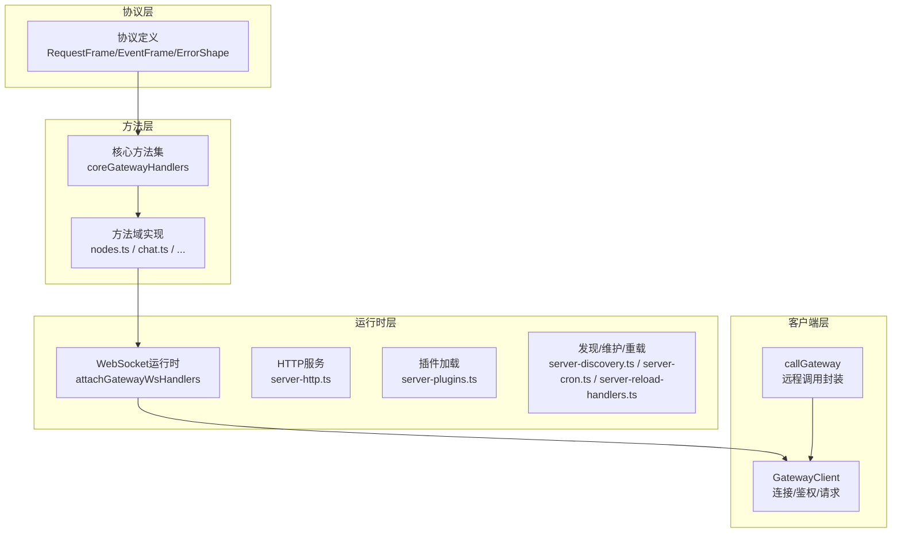
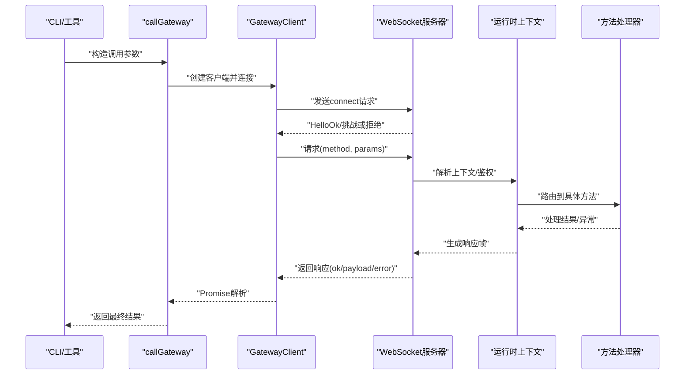
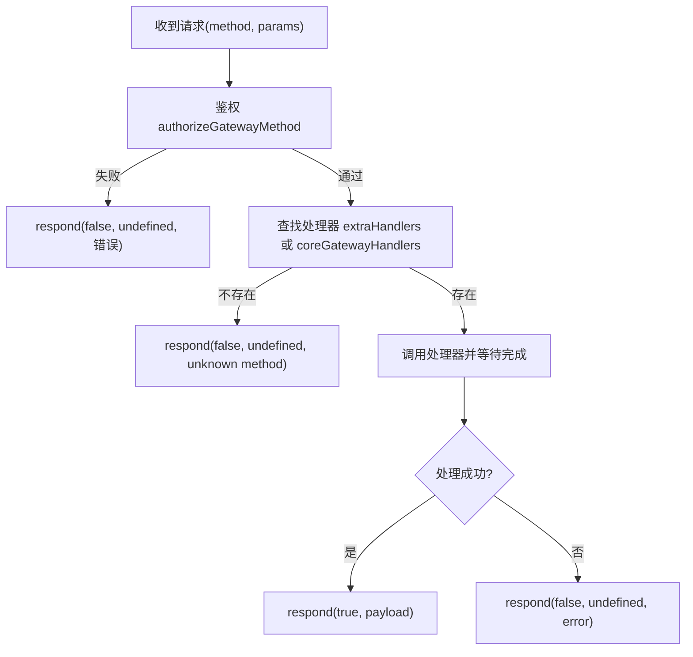
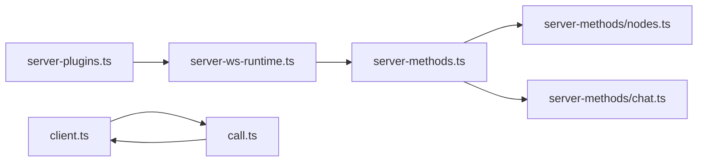
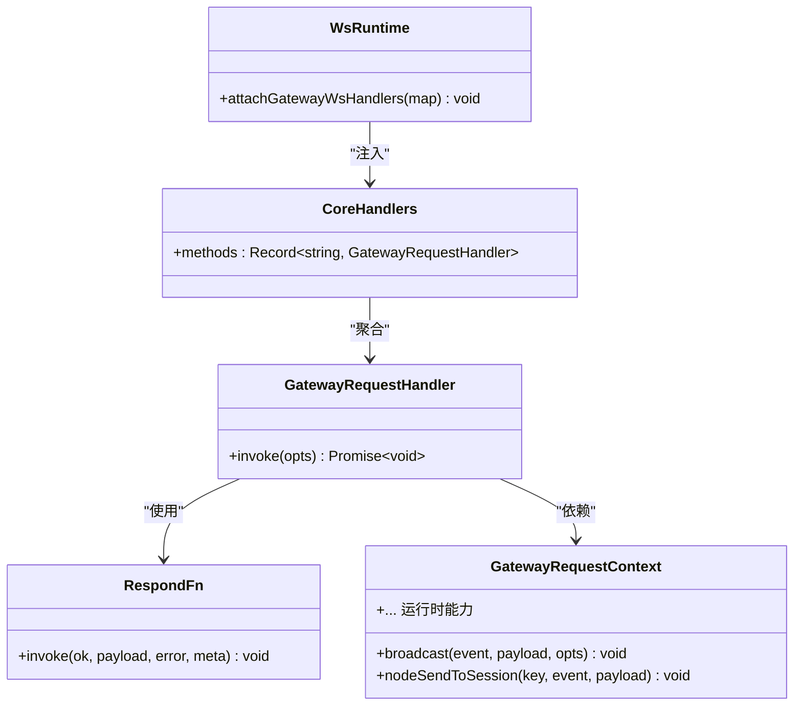
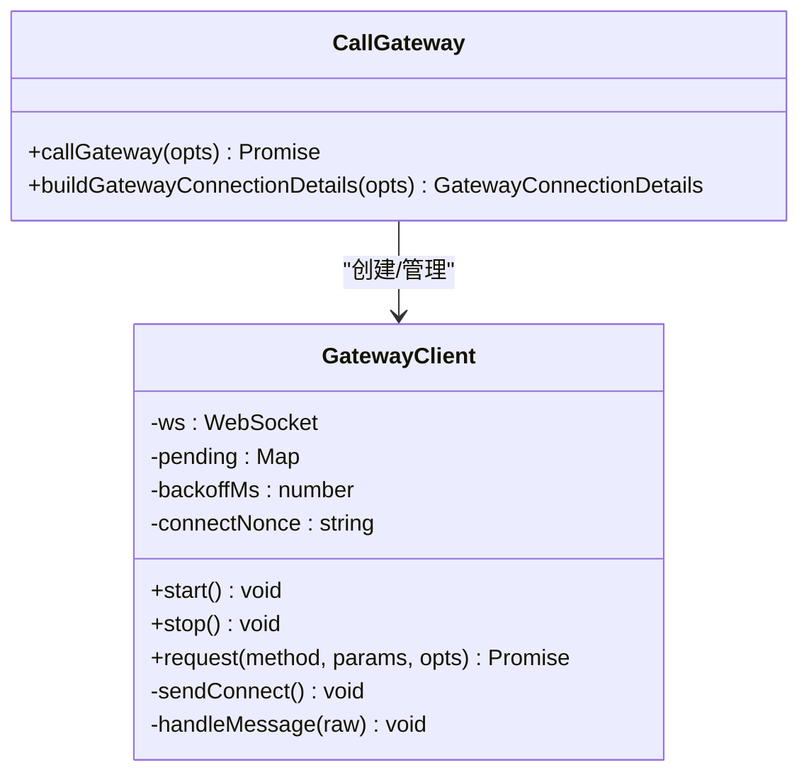

# 网关API

<cite>
**本文引用的文件**
- [src/gateway/server.impl.ts](file://src/gateway/server.impl.ts)
- [src/gateway/server.ts](file://src/gateway/server.ts)
- [src/gateway/server-methods.ts](file://src/gateway/server-methods.ts)
- [src/gateway/server-methods/types.ts](file://src/gateway/server-methods/types.ts)
- [src/gateway/call.ts](file://src/gateway/call.ts)
- [src/gateway/client.ts](file://src/gateway/client.ts)
- [src/gateway/server-methods/nodes.ts](file://src/gateway/server-methods/nodes.ts)
- [src/gateway/server-methods/chat.ts](file://src/gateway/server-methods/chat.ts)
- [src/gateway/protocol/index.ts](file://src/gateway/protocol/index.ts)
- [src/gateway/server-plugins.ts](file://src/gateway/server-plugins.ts)
- [src/gateway/server-ws-runtime.ts](file://src/gateway/server-ws-runtime.ts)
- [src/gateway/server-http.ts](file://src/gateway/server-http.ts)
- [src/gateway/server-channels.ts](file://src/gateway/server-channels.ts)
- [src/gateway/server-discovery.ts](file://src/gateway/server-discovery.ts)
- [src/gateway/server-cron.ts](file://src/gateway/server-cron.ts)
- [src/gateway/server-model-catalog.ts](file://src/gateway/server-model-catalog.ts)
- [src/gateway/server-node-subscriptions.ts](file://src/gateway/server-node-subscriptions.ts)
- [src/gateway/node-registry.ts](file://src/gateway/node-registry.ts)
- [src/gateway/server-methods-list.ts](file://src/gateway/server-methods-list.ts)
- [src/gateway/server-utils.ts](file://src/gateway/server-utils.ts)
- [src/gateway/server-startup.ts](file://src/gateway/server-startup.ts)
- [src/gateway/server-tailscale.ts](file://src/gateway/server-tailscale.ts)
- [src/gateway/server-reload-handlers.ts](file://src/gateway/server-reload-handlers.ts)
- [src/gateway/server.config-apply.e2e.test.ts](file://src/gateway/server.config-apply.e2e.test.ts)
- [src/gateway/server.auth.e2e.test.ts](file://src/gateway/server.auth.e2e.test.ts)
- [src/gateway/server.channels.e2e.test.ts](file://src/gateway/server.channels.e2e.test.ts)
- [src/gateway/server.plugin-http-auth.test.ts](file://src/gateway/server.plugin-http-auth.test.ts)
- [src/gateway/server.plugins-http.test.ts](file://src/gateway/server.plugins-http.test.ts)
- [src/gateway/test-helpers.server.ts](file://src/gateway/test-helpers.server.ts)
- [src/cli/gateway-cli.ts](file://src/cli/gateway-cli.ts)
- [src/cli/gateway-cli.coverage.test.ts](file://src/cli/gateway-cli.coverage.test.ts)
- [src/cli/gateway-rpc.ts](file://src/cli/gateway-rpc.ts)
- [src/agents/tools/gateway.ts](file://src/agents/tools/gateway.ts)
- [src/agents/tools/gateway-tool.ts](file://src/agents/tools/gateway-tool.ts)
- [src/agents/tools/gateway.test.ts](file://src/agents/tools/gateway.test.ts)
- [src/agents/tools/gateway-tool.test.ts](file://src/agents/tools/gateway-tool.test.ts)
</cite>

## 目录

1. [简介](#简介)
2. [项目结构](#项目结构)
3. [核心组件](#核心组件)
4. [架构总览](#架构总览)
5. [详细组件分析](#详细组件分析)
6. [依赖关系分析](#依赖关系分析)
7. [性能考量](#性能考量)
8. [故障排查指南](#故障排查指南)
9. [结论](#结论)
10. [附录](#附录)

## 简介

本文件为 OpenClaw 网关API的完整参考文档，聚焦于以下目标：

- 详解 GatewayRequestHandler、RespondFn 等网关方法接口的使用规范与约束
- 记录网关RPC调用的请求/响应结构、参数格式与错误处理机制
- 解释网关方法的注册方式、调用流程与鉴权模型
- 提供网关API在插件与工具中的实际应用场景与实践建议
- 给出端到端调用序列图、类关系图与数据流图，帮助快速理解与集成

## 项目结构

OpenClaw 网关位于 src/gateway 目录，采用“协议-服务-方法-运行时”的分层设计：

- 协议层：定义请求/响应帧、错误码、校验器与客户端信息
- 方法层：按功能域划分（节点、聊天、会话、设备、通道、系统等）实现具体方法处理器
- 运行时层：WebSocket/HTTP 服务、插件加载、发现、维护任务、重载与关闭流程
- 客户端层：提供 callGateway 与 GatewayClient，支持连接、鉴权、请求-响应与事件订阅

图表来源

- [src/gateway/server.impl.ts](file://src/gateway/server.impl.ts#L157-L667)
- [src/gateway/server-methods.ts](file://src/gateway/server-methods.ts#L165-L220)
- [src/gateway/server-ws-runtime.ts](file://src/gateway/server-ws-runtime.ts)
- [src/gateway/server-http.ts](file://src/gateway/server-http.ts)
- [src/gateway/server-plugins.ts](file://src/gateway/server-plugins.ts)
- [src/gateway/server-discovery.ts](file://src/gateway/server-discovery.ts)
- [src/gateway/server-cron.ts](file://src/gateway/server-cron.ts)
- [src/gateway/server-reload-handlers.ts](file://src/gateway/server-reload-handlers.ts)
- [src/gateway/call.ts](file://src/gateway/call.ts#L156-L313)
- [src/gateway/client.ts](file://src/gateway/client.ts#L79-L442)

章节来源

- [src/gateway/server.impl.ts](file://src/gateway/server.impl.ts#L157-L667)
- [src/gateway/server.ts](file://src/gateway/server.ts#L1-L4)

## 核心组件

- 网关服务器启动与配置
  - 启动入口：startGatewayServer，负责读取配置、加载插件、构建运行时状态、挂载WS/HTTP服务、启动发现与维护任务，并暴露可关闭句柄
  - 关键选项：绑定地址策略、是否启用控制UI、HTTP端点开关、认证与Tailscale配置覆盖等
- 请求处理管线
  - 核心处理器：coreGatewayHandlers 汇聚各域方法
  - 调用入口：handleGatewayRequest，执行鉴权检查后路由到具体方法处理器
  - 响应函数：RespondFn，统一的响应/错误返回接口
- 客户端调用
  - callGateway：面向外部的RPC调用封装，自动解析URL/凭据/TLS指纹，建立连接并发起请求
  - GatewayClient：内部WebSocket客户端，负责握手、鉴权、心跳检测、重连与请求-响应管理

章节来源

- [src/gateway/server.impl.ts](file://src/gateway/server.impl.ts#L157-L667)
- [src/gateway/server-methods.ts](file://src/gateway/server-methods.ts#L165-L220)
- [src/gateway/server-methods/types.ts](file://src/gateway/server-methods/types.ts#L20-L120)
- [src/gateway/call.ts](file://src/gateway/call.ts#L156-L313)
- [src/gateway/client.ts](file://src/gateway/client.ts#L79-L442)

## 架构总览

下图展示从客户端到服务器的端到端调用链路，包括握手、鉴权、方法路由与响应返回。

图表来源

- [src/gateway/call.ts](file://src/gateway/call.ts#L156-L313)
- [src/gateway/client.ts](file://src/gateway/client.ts#L178-L286)
- [src/gateway/server-ws-runtime.ts](file://src/gateway/server-ws-runtime.ts)
- [src/gateway/server-methods.ts](file://src/gateway/server-methods.ts#L193-L220)

## 详细组件分析

### 网关方法接口与调用规范

- GatewayRequestHandler
  - 形参：包含请求帧、参数、客户端信息、是否Webchat连接、响应函数、运行时上下文
  - 返回：异步处理，通过 respond 函数返回结果或错误
- RespondFn
  - 参数：ok、payload、error、meta
  - 语义：统一响应格式；payload 支持任意结构；error 使用标准错误形状
- GatewayRequestContext
  - 包含广播、节点订阅、会话管理、健康状态、模型目录、计划任务、向导会话等运行时能力
- 鉴权模型
  - 方法白名单与作用域映射：管理员(admin)、只读(read)、写入(write)、审批(approvals)、配对(pairing)
  - 特殊方法集合：节点角色方法、审批方法、配对方法、配置/向导/更新/会话管理等
  - 授权失败返回标准错误形状

章节来源

- [src/gateway/server-methods/types.ts](file://src/gateway/server-methods/types.ts#L20-L120)
- [src/gateway/server-methods.ts](file://src/gateway/server-methods.ts#L93-L163)

### 网关RPC调用参数与响应结构

- 请求帧(RequestFrame)
  - 字段：type=“req”、id、method、params
  - 校验：validateRequestFrame
- 响应帧(ResponseFrame)
  - 字段：id、ok、payload、error
  - 校验：validateResponseFrame
- 错误形状(ErrorShape)
  - 字段：code、message、meta
  - 错误码：ErrorCodes（如 INVALID_REQUEST）
- 节点方法示例
  - node.pair.request：参数包含节点标识、显示名、平台、版本、能力、命令、远端IP、静默标志等
  - node.pair.list/approve/reject/verify：参数与返回结构遵循对应校验器
- 聊天方法示例
  - chat.send：参数包含会话、消息内容、附件、模型选择、超时等
  - chat.history：参数包含会话、条数限制、时间范围等
  - chat.abort：参数包含会话或运行ID

章节来源

- [src/gateway/protocol/index.ts](file://src/gateway/protocol/index.ts)
- [src/gateway/server-methods/nodes.ts](file://src/gateway/server-methods/nodes.ts#L65-L200)
- [src/gateway/server-methods/chat.ts](file://src/gateway/server-methods/chat.ts#L1-L200)

### 网关方法注册与调用流程

- 注册
  - 核心方法：coreGatewayHandlers 聚合各域处理器
  - 插件扩展：插件可通过 gatewayHandlers 扩展方法
  - 方法列表：listGatewayMethods 提供可用方法清单
- 路由
  - handleGatewayRequest 先鉴权，再按方法名查找处理器
  - 未识别方法返回 INVALID_REQUEST
- 调用
  - 客户端侧：callGateway 自动解析URL/凭据/TLS指纹，建立连接后发起请求
  - 服务器侧：attachGatewayWsHandlers 将方法映射注入WS运行时

图表来源

- [src/gateway/server-methods.ts](file://src/gateway/server-methods.ts#L193-L220)

章节来源

- [src/gateway/server-methods.ts](file://src/gateway/server-methods.ts#L165-L220)
- [src/gateway/server-plugins.ts](file://src/gateway/server-plugins.ts)
- [src/gateway/server-methods-list.ts](file://src/gateway/server-methods-list.ts)

### 网关服务器启动与生命周期

- 启动阶段
  - 读取并迁移配置、应用插件自动启用、解析运行时配置（绑定、TLS、认证、Tailscale）
  - 创建运行时状态（HTTP/WS、通道、节点注册、订阅、心跳、计划任务）
  - 挂载WS处理器（含插件扩展）、启动发现、维护定时器、侧车进程
- 关闭阶段
  - 触发 gateway_stop 钩子、清理资源、停止心跳/计划任务/通道、关闭网络监听

章节来源

- [src/gateway/server.impl.ts](file://src/gateway/server.impl.ts#L157-L667)
- [src/gateway/server-startup.ts](file://src/gateway/server-startup.ts)
- [src/gateway/server-tailscale.ts](file://src/gateway/server-tailscale.ts)
- [src/gateway/server-reload-handlers.ts](file://src/gateway/server-reload-handlers.ts)

### 客户端调用与连接管理

- callGateway
  - 自动解析本地/远程URL、TLS指纹、令牌/密码
  - 支持超时、实例ID、客户端元信息、协议版本范围
- GatewayClient
  - 连接：握手、挑战/应答、存储设备令牌
  - 心跳：周期性tick检测，超时自动断开
  - 请求：UUID请求ID、等待最终响应（可选）、错误解析
  - 重连：指数退避，优雅关闭

章节来源

- [src/gateway/call.ts](file://src/gateway/call.ts#L156-L313)
- [src/gateway/client.ts](file://src/gateway/client.ts#L79-L442)

### 方法域实现要点

- 节点(Node)
  - 配对：请求、列出、批准、拒绝、验证与重命名
  - 事件与调用：事件上报、invoke结果回传、延迟结果忽略策略
- 聊天(Chat)
  - 发送、历史、中止、转录写入、会话管理、自动回复调度
- 会话(Sessions)
  - 列表、预览、补丁、重置、删除、压缩
- 系统(System/Models/Usage/Health)
  - 状态查询、模型目录、用量统计、健康快照

章节来源

- [src/gateway/server-methods/nodes.ts](file://src/gateway/server-methods/nodes.ts#L65-L200)
- [src/gateway/server-methods/chat.ts](file://src/gateway/server-methods/chat.ts#L1-L200)

## 依赖关系分析

- 组件耦合
  - server-methods.ts 作为中枢，聚合各域处理器并与运行时上下文解耦
  - server-ws-runtime.ts 将方法映射注入WS运行时，避免直接耦合
  - 插件通过 server-plugins.ts 动态扩展方法，保持高内聚低耦合
- 外部依赖
  - ws、配置系统、通道系统、计划任务、诊断日志、Tailscale、Bonjour
- 循环依赖
  - 通过模块化拆分与延迟导入避免循环

图表来源

- [src/gateway/server-methods.ts](file://src/gateway/server-methods.ts#L1-L28)
- [src/gateway/server-ws-runtime.ts](file://src/gateway/server-ws-runtime.ts)
- [src/gateway/server-plugins.ts](file://src/gateway/server-plugins.ts)
- [src/gateway/client.ts](file://src/gateway/client.ts#L79-L442)
- [src/gateway/call.ts](file://src/gateway/call.ts#L156-L313)

章节来源

- [src/gateway/server-methods.ts](file://src/gateway/server-methods.ts#L1-L28)
- [src/gateway/server-ws-runtime.ts](file://src/gateway/server-ws-runtime.ts)
- [src/gateway/server-plugins.ts](file://src/gateway/server-plugins.ts)
- [src/gateway/client.ts](file://src/gateway/client.ts#L79-L442)
- [src/gateway/call.ts](file://src/gateway/call.ts#L156-L313)

## 性能考量

- 广播与丢弃
  - broadcast/broadcastToConnIds 支持 dropIfSlow，避免慢消费者拖垮整体
- 去重与节流
  - dedupe 映射用于去重，减少重复处理
- 心跳与超时
  - tickIntervalMs 可被服务器策略调整；超时断开防止僵尸连接
- 大负载
  - 客户端 maxPayload 默认25MB，适合屏幕快照等大响应场景
- 并发与限速
  - applyGatewayLaneConcurrency 应用车道并发策略，避免过载

章节来源

- [src/gateway/server-methods/types.ts](file://src/gateway/server-methods/types.ts#L38-L54)
- [src/gateway/client.ts](file://src/gateway/client.ts#L110-L113)
- [src/gateway/server.impl.ts](file://src/gateway/server.impl.ts#L375-L376)

## 故障排查指南

- 常见错误与定位
  - 未知方法：INVALID_REQUEST，检查方法名与注册
  - 权限不足：缺失作用域或角色不匹配，核对 scopes/role
  - TLS指纹不匹配：wss+指纹校验失败，确认证书指纹与配置
  - 连接异常：检查 bind/host、端口占用、防火墙与Tailscale
- 测试辅助
  - onceMessage：基于WebSocket的单次消息等待，带超时与关闭回调
  - 插件HTTP测试：验证无处理器时返回false
  - CLI测试：验证参数JSON校验失败与端口/启动错误处理
- 诊断建议
  - 开启诊断心跳、查看启动日志、检查计划任务与通道状态

章节来源

- [src/gateway/test-helpers.server.ts](file://src/gateway/test-helpers.server.ts#L257-L291)
- [src/gateway/server.plugins-http.test.ts](file://src/gateway/server.plugins-http.test.ts#L22-L34)
- [src/gateway/server.plugin-http-auth.test.ts](file://src/gateway/server.plugin-http-auth.test.ts#L37-L96)
- [src/cli/gateway-cli.coverage.test.ts](file://src/cli/gateway-cli.coverage.test.ts#L236-L252)

## 结论

OpenClaw 网关API以清晰的协议与方法域划分、完善的鉴权与错误处理、灵活的插件扩展机制，提供了稳定可靠的RPC能力。通过本文档的接口规范、调用流程与最佳实践，开发者可以高效地在插件与工具中集成网关API，实现从节点配对、聊天交互到系统运维的全栈能力。

## 附录

### 网关方法注册与调用流程（类图）

图表来源

- [src/gateway/server-methods/types.ts](file://src/gateway/server-methods/types.ts#L100-L120)
- [src/gateway/server-methods.ts](file://src/gateway/server-methods.ts#L165-L220)
- [src/gateway/server-ws-runtime.ts](file://src/gateway/server-ws-runtime.ts)

### 网关客户端类图

图表来源

- [src/gateway/client.ts](file://src/gateway/client.ts#L79-L442)
- [src/gateway/call.ts](file://src/gateway/call.ts#L156-L313)

### CLI与工具集成要点

- CLI
  - gateway-cli 提供 discover/call 等子命令，参数JSON校验失败时抛错并退出
- 工具
  - agents/tools/gateway 与 gateway-tool 提供工具封装，便于在技能/代理中调用网关方法

章节来源

- [src/cli/gateway-cli.ts](file://src/cli/gateway-cli.ts)
- [src/cli/gateway-cli.coverage.test.ts](file://src/cli/gateway-cli.coverage.test.ts#L221-L258)
- [src/agents/tools/gateway.ts](file://src/agents/tools/gateway.ts)
- [src/agents/tools/gateway-tool.ts](file://src/agents/tools/gateway-tool.ts)
- [src/agents/tools/gateway.test.ts](file://src/agents/tools/gateway.test.ts)
- [src/agents/tools/gateway-tool.test.ts](file://src/agents/tools/gateway-tool.test.ts)
