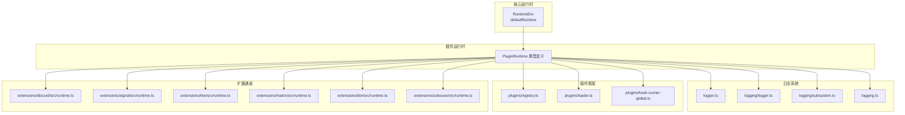
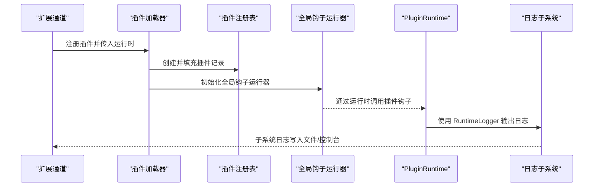
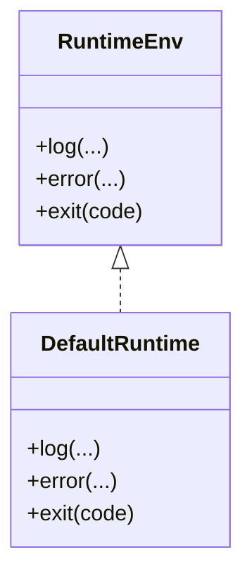
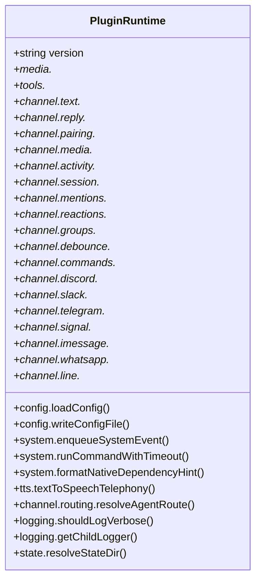
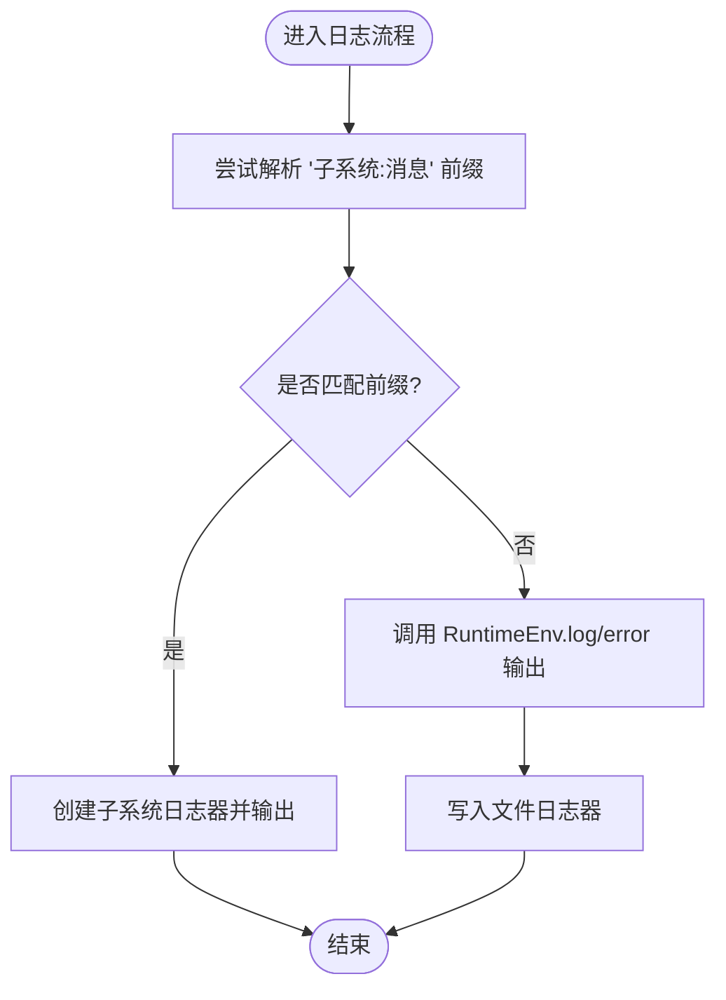
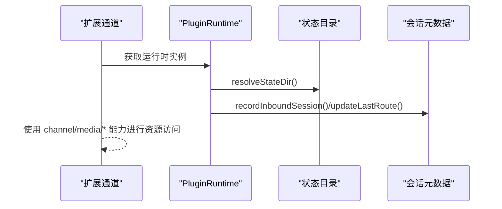
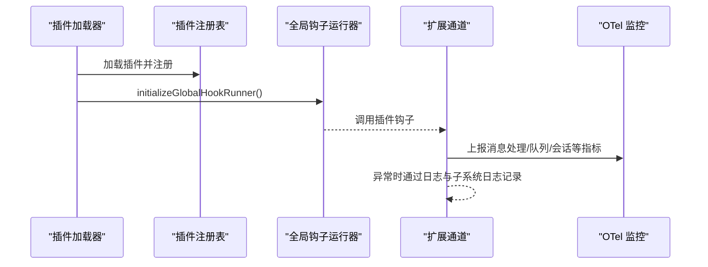
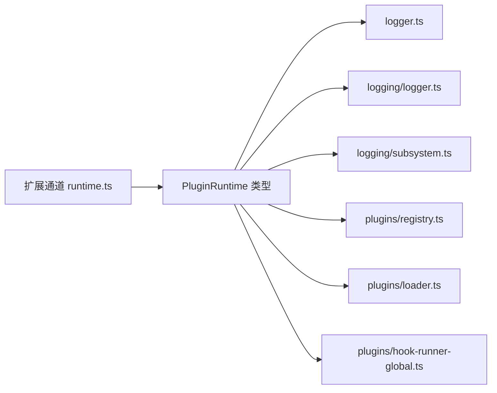

# 运行时API

<cite>
**本文引用的文件**
- [src/runtime.ts](file://src/runtime.ts)
- [src/plugins/runtime/types.ts](file://src/plugins/runtime/types.ts)
- [src/logger.ts](file://src/logger.ts)
- [src/logging/logger.ts](file://src/logging/logger.ts)
- [src/logging/subsystem.ts](file://src/logging/subsystem.ts)
- [src/logging.ts](file://src/logging.ts)
- [src/plugins/registry.ts](file://src/plugins/registry.ts)
- [src/plugins/loader.ts](file://src/plugins/loader.ts)
- [src/plugins/hook-runner-global.ts](file://src/plugins/hook-runner-global.ts)
- [extensions/discord/src/runtime.ts](file://extensions/discord/src/runtime.ts)
- [extensions/signal/src/runtime.ts](file://extensions/signal/src/runtime.ts)
- [extensions/line/src/runtime.ts](file://extensions/line/src/runtime.ts)
- [extensions/matrix/src/runtime.ts](file://extensions/matrix/src/runtime.ts)
- [extensions/tlon/src/runtime.ts](file://extensions/tlon/src/runtime.ts)
- [extensions/zalouser/src/runtime.ts](file://extensions/zalouser/src/runtime.ts)
- [docs/refactor/plugin-sdk.md](file://docs/refactor/plugin-sdk.md)
- [docs/zh-CN/refactor/plugin-sdk.md](file://docs/zh-CN/refactor/plugin-sdk.md)
</cite>

## 目录

1. [简介](#简介)
2. [项目结构](#项目结构)
3. [核心组件](#核心组件)
4. [架构总览](#架构总览)
5. [组件详解](#组件详解)
6. [依赖关系分析](#依赖关系分析)
7. [性能考量](#性能考量)
8. [故障排查指南](#故障排查指南)
9. [结论](#结论)
10. [附录](#附录)

## 简介

本文件为 OpenClaw 运行时 API 的权威参考，重点覆盖以下内容：

- PluginRuntime 接口的职责、能力与使用方式
- RuntimeLogger 的日志模型与子系统日志集成
- 插件运行时环境的获取、状态管理与资源访问机制
- 运行时生命周期、错误处理与性能监控的实现要点
- 在插件开发中的实际应用场景与最佳实践

目标读者包括插件开发者、平台维护者以及对 OpenClaw 运行时机制感兴趣的工程师。

## 项目结构

围绕运行时 API 的关键文件分布如下：

- 核心运行时环境定义与默认实现：src/runtime.ts
- 插件运行时接口类型定义：src/plugins/runtime/types.ts
- 日志门面与子系统日志桥接：src/logger.ts、src/logging/logger.ts、src/logging/subsystem.ts、src/logging.ts
- 插件注册与全局钩子运行器：src/plugins/registry.ts、src/plugins/loader.ts、src/plugins/hook-runner-global.ts
- 扩展通道对运行时的持有与导出：extensions/\*/src/runtime.ts
- 文档中关于插件 SDK 与运行时的规划与交付方式：docs/refactor/plugin-sdk.md、docs/zh-CN/refactor/plugin-sdk.md

**图表来源**

- [src/runtime.ts](file://src/runtime.ts#L1-L25)
- [src/plugins/runtime/types.ts](file://src/plugins/runtime/types.ts#L1-L363)
- [src/logger.ts](file://src/logger.ts#L1-L61)
- [src/logging/logger.ts](file://src/logging/logger.ts#L1-L251)
- [src/logging/subsystem.ts](file://src/logging/subsystem.ts#L1-L35)
- [src/logging.ts](file://src/logging.ts#L1-L67)
- [src/plugins/registry.ts](file://src/plugins/registry.ts#L1-L200)
- [src/plugins/loader.ts](file://src/plugins/loader.ts#L409-L456)
- [src/plugins/hook-runner-global.ts](file://src/plugins/hook-runner-global.ts#L1-L52)
- [extensions/discord/src/runtime.ts](file://extensions/discord/src/runtime.ts#L1-L14)
- [extensions/signal/src/runtime.ts](file://extensions/signal/src/runtime.ts#L1-L14)
- [extensions/line/src/runtime.ts](file://extensions/line/src/runtime.ts#L1-L14)
- [extensions/matrix/src/runtime.ts](file://extensions/matrix/src/runtime.ts#L1-L14)
- [extensions/tlon/src/runtime.ts](file://extensions/tlon/src/runtime.ts#L1-L14)
- [extensions/zalouser/src/runtime.ts](file://extensions/zalouser/src/runtime.ts#L1-L14)

**章节来源**

- [src/runtime.ts](file://src/runtime.ts#L1-L25)
- [src/plugins/runtime/types.ts](file://src/plugins/runtime/types.ts#L1-L363)
- [src/logger.ts](file://src/logger.ts#L1-L61)
- [src/logging/logger.ts](file://src/logging/logger.ts#L1-L251)
- [src/logging/subsystem.ts](file://src/logging/subsystem.ts#L1-L35)
- [src/logging.ts](file://src/logging.ts#L1-L67)
- [src/plugins/registry.ts](file://src/plugins/registry.ts#L1-L200)
- [src/plugins/loader.ts](file://src/plugins/loader.ts#L409-L456)
- [src/plugins/hook-runner-global.ts](file://src/plugins/hook-runner-global.ts#L1-L52)
- [extensions/discord/src/runtime.ts](file://extensions/discord/src/runtime.ts#L1-L14)
- [extensions/signal/src/runtime.ts](file://extensions/signal/src/runtime.ts#L1-L14)
- [extensions/line/src/runtime.ts](file://extensions/line/src/runtime.ts#L1-L14)
- [extensions/matrix/src/runtime.ts](file://extensions/matrix/src/runtime.ts#L1-L14)
- [extensions/tlon/src/runtime.ts](file://extensions/tlon/src/runtime.ts#L1-L14)
- [extensions/zalouser/src/runtime.ts](file://extensions/zalouser/src/runtime.ts#L1-L14)

## 核心组件

- RuntimeEnv：最小可替换的运行时环境，包含标准输出、错误输出与退出函数，支持默认实现 defaultRuntime。
- PluginRuntime：面向插件的运行时 API，涵盖配置、系统命令、媒体、TTS、工具、各渠道能力、日志与状态目录解析等。
- RuntimeLogger：运行时日志接口，与子系统日志体系打通，支持按绑定上下文生成子日志器。
- 日志子系统：提供子系统日志器、运行时适配器、文件滚动与外部传输等能力。
- 插件注册与钩子：插件加载后初始化全局钩子运行器，统一调度插件钩子。

**章节来源**

- [src/runtime.ts](file://src/runtime.ts#L4-L24)
- [src/plugins/runtime/types.ts](file://src/plugins/runtime/types.ts#L171-L362)
- [src/logging/subsystem.ts](file://src/logging/subsystem.ts#L14-L24)
- [src/logging/logger.ts](file://src/logging/logger.ts#L117-L126)
- [src/plugins/registry.ts](file://src/plugins/registry.ts#L146-L144)
- [src/plugins/loader.ts](file://src/plugins/loader.ts#L409-L456)
- [src/plugins/hook-runner-global.ts](file://src/plugins/hook-runner-global.ts#L21-L36)

## 架构总览

下图展示运行时 API 在系统中的位置与交互关系：

**图表来源**

- [src/plugins/loader.ts](file://src/plugins/loader.ts#L409-L456)
- [src/plugins/registry.ts](file://src/plugins/registry.ts#L146-L144)
- [src/plugins/hook-runner-global.ts](file://src/plugins/hook-runner-global.ts#L21-L36)
- [src/plugins/runtime/types.ts](file://src/plugins/runtime/types.ts#L171-L362)
- [src/logging/subsystem.ts](file://src/logging/subsystem.ts#L275-L317)

## 组件详解

### RuntimeEnv 与 defaultRuntime

- 职责：封装日志、错误输出与进程退出的最小运行时环境。
- 特性：defaultRuntime 在每次输出前清理进度行，并在退出时恢复终端状态；可通过注入自定义实现替换默认行为。
- 典型用途：作为日志门面与子系统日志的底层输出源，或在监控模块中注入自定义退出策略。

**图表来源**

- [src/runtime.ts](file://src/runtime.ts#L4-L24)

**章节来源**

- [src/runtime.ts](file://src/runtime.ts#L1-L25)

### PluginRuntime 接口

- 版本信息：version 字符串，便于插件识别运行时版本。
- 配置：loadConfig、writeConfigFile，用于读取与持久化配置。
- 系统：enqueueSystemEvent、runCommandWithTimeout、formatNativeDependencyHint，用于系统事件与命令执行。
- 媒体：loadWebMedia、detectMime、mediaKindFromMime、isVoiceCompatibleAudio、getImageMetadata、resizeToJpeg。
- TTS：textToSpeechTelephony。
- 工具：createMemoryGetTool、createMemorySearchTool、registerMemoryCli。
- 渠道能力：文本分块、回复派发、路由、配对、媒体存取、活动记录、会话元数据、提及匹配、反应策略、群组策略、防抖、命令授权、各平台消息动作与探测等。
- 日志：shouldLogVerbose、getChildLogger，返回 RuntimeLogger。
- 状态：resolveStateDir，解析状态目录路径。

**图表来源**

- [src/plugins/runtime/types.ts](file://src/plugins/runtime/types.ts#L178-L362)

**章节来源**

- [src/plugins/runtime/types.ts](file://src/plugins/runtime/types.ts#L1-L363)

### RuntimeLogger 与日志子系统

- RuntimeLogger：提供 debug/info/warn/error 方法签名，与子系统日志器一致。
- 子系统日志：createSubsystemLogger 提供 trace/debug/info/warn/error/raw/child 等能力；runtimeForLogger/createSubsystemRuntime 可将任意子系统日志器适配为运行时环境。
- 文件日志：logging/logger.ts 支持滚动日志、外部传输、级别过滤与缓存设置；getLogger/getChildLogger 提供单例与子日志器。
- 门面日志：logger.ts 将通用日志门面与子系统日志结合，自动识别“子系统:消息”前缀并定向到对应子系统日志器。

**图表来源**

- [src/logger.ts](file://src/logger.ts#L8-L25)
- [src/logging/subsystem.ts](file://src/logging/subsystem.ts#L275-L317)
- [src/logging/logger.ts](file://src/logging/logger.ts#L117-L126)

**章节来源**

- [src/plugins/runtime/types.ts](file://src/plugins/runtime/types.ts#L171-L176)
- [src/logging/subsystem.ts](file://src/logging/subsystem.ts#L14-L24)
- [src/logging/logger.ts](file://src/logging/logger.ts#L117-L126)
- [src/logger.ts](file://src/logger.ts#L17-L55)

### 插件运行时环境的获取与状态管理

- 获取方式：扩展通道通过各自 runtime.ts 模块保存并导出 PluginRuntime 实例，插件在运行时通过 OpenClawPluginApi.runtime 访问。
- 状态管理：PluginRuntime.state.resolveStateDir 提供状态目录解析；会话相关 API 包括 resolveStorePath/readSessionUpdatedAt/recordSessionMetaFromInbound/recordInboundSession/updateLastRoute。
- 资源访问：通过 PluginRuntime.system.enqueueSystemEvent 与 runCommandWithTimeout 执行系统级任务；通过 channel._ 与 media._ 访问渠道与媒体资源。

**图表来源**

- [extensions/discord/src/runtime.ts](file://extensions/discord/src/runtime.ts#L1-L14)
- [extensions/signal/src/runtime.ts](file://extensions/signal/src/runtime.ts#L1-L14)
- [extensions/line/src/runtime.ts](file://extensions/line/src/runtime.ts#L1-L14)
- [extensions/matrix/src/runtime.ts](file://extensions/matrix/src/runtime.ts#L1-L14)
- [extensions/tlon/src/runtime.ts](file://extensions/tlon/src/runtime.ts#L1-L14)
- [extensions/zalouser/src/runtime.ts](file://extensions/zalouser/src/runtime.ts#L1-L14)
- [src/plugins/runtime/types.ts](file://src/plugins/runtime/types.ts#L246-L252)

**章节来源**

- [extensions/discord/src/runtime.ts](file://extensions/discord/src/runtime.ts#L1-L14)
- [extensions/signal/src/runtime.ts](file://extensions/signal/src/runtime.ts#L1-L14)
- [extensions/line/src/runtime.ts](file://extensions/line/src/runtime.ts#L1-L14)
- [extensions/matrix/src/runtime.ts](file://extensions/matrix/src/runtime.ts#L1-L14)
- [extensions/tlon/src/runtime.ts](file://extensions/tlon/src/runtime.ts#L1-L14)
- [extensions/zalouser/src/runtime.ts](file://extensions/zalouser/src/runtime.ts#L1-L14)
- [src/plugins/runtime/types.ts](file://src/plugins/runtime/types.ts#L246-L252)

### 运行时生命周期、错误处理与性能监控

- 生命周期：插件加载阶段创建注册表并初始化全局钩子运行器；插件注册期间捕获异常并记录诊断信息；运行期通过 PluginRuntime 调用各能力。
- 错误处理：日志门面统一输出错误；子系统日志器支持错误级别输出；扩展通道在未初始化运行时时抛出明确错误提示。
- 性能监控：扩展 diagnostics-otel 提供消息处理计数、持续时间直方图、队列深度与等待时间、会话状态与卡顿指标、运行尝试次数等；插件可通过 system.enqueueSystemEvent 上报系统事件。

**图表来源**

- [src/plugins/loader.ts](file://src/plugins/loader.ts#L409-L456)
- [src/plugins/hook-runner-global.ts](file://src/plugins/hook-runner-global.ts#L21-L36)
- [extensions/diagnostics-otel/src/service.ts](file://extensions/diagnostics-otel/src/service.ts#L166-L206)

**章节来源**

- [src/plugins/loader.ts](file://src/plugins/loader.ts#L409-L456)
- [src/plugins/hook-runner-global.ts](file://src/plugins/hook-runner-global.ts#L21-L36)
- [extensions/diagnostics-otel/src/service.ts](file://extensions/diagnostics-otel/src/service.ts#L166-L206)

### 插件开发中的应用场景与最佳实践

- 使用 PluginRuntime.logging.getChildLogger 为每个功能模块创建子日志器，避免日志污染；仅在需要时开启 verbose。
- 通过 PluginRuntime.config.loadConfig/writeConfigFile 管理插件配置，避免直接导入核心模块。
- 利用 PluginRuntime.channel._ 与 media._ 能力进行跨渠道消息派发与媒体处理，注意权限与配额限制。
- 使用 PluginRuntime.system.enqueueSystemEvent 上报关键事件，配合 OTel 监控观察端到端性能。
- 在扩展通道中保存并导出 PluginRuntime 实例，插件通过 OpenClawPluginApi.runtime 安全访问，避免直接依赖 src/\*\*。

**章节来源**

- [src/plugins/runtime/types.ts](file://src/plugins/runtime/types.ts#L178-L362)
- [src/logging/subsystem.ts](file://src/logging/subsystem.ts#L275-L317)
- [extensions/discord/src/runtime.ts](file://extensions/discord/src/runtime.ts#L1-L14)
- [extensions/signal/src/runtime.ts](file://extensions/signal/src/runtime.ts#L1-L14)
- [extensions/line/src/runtime.ts](file://extensions/line/src/runtime.ts#L1-L14)
- [extensions/matrix/src/runtime.ts](file://extensions/matrix/src/runtime.ts#L1-L14)
- [extensions/tlon/src/runtime.ts](file://extensions/tlon/src/runtime.ts#L1-L14)
- [extensions/zalouser/src/runtime.ts](file://extensions/zalouser/src/runtime.ts#L1-L14)
- [docs/refactor/plugin-sdk.md](file://docs/refactor/plugin-sdk.md#L45-L145)
- [docs/zh-CN/refactor/plugin-sdk.md](file://docs/zh-CN/refactor/plugin-sdk.md#L42-L50)

## 依赖关系分析

- PluginRuntime 依赖于日志子系统、配置解析、会话与渠道能力等模块；通过类型别名聚合大量内部函数，形成稳定的对外 API。
- 扩展通道通过各自 runtime.ts 模块持有 PluginRuntime，插件通过 OpenClawPluginApi.runtime 访问，避免直接导入核心源码。
- 插件注册与钩子运行器在加载阶段完成初始化，运行期通过全局钩子运行器统一调度。

**图表来源**

- [src/plugins/runtime/types.ts](file://src/plugins/runtime/types.ts#L1-L363)
- [src/logger.ts](file://src/logger.ts#L1-L61)
- [src/logging/logger.ts](file://src/logging/logger.ts#L1-L251)
- [src/logging/subsystem.ts](file://src/logging/subsystem.ts#L1-L35)
- [src/plugins/registry.ts](file://src/plugins/registry.ts#L1-L200)
- [src/plugins/loader.ts](file://src/plugins/loader.ts#L409-L456)
- [src/plugins/hook-runner-global.ts](file://src/plugins/hook-runner-global.ts#L1-L52)
- [extensions/discord/src/runtime.ts](file://extensions/discord/src/runtime.ts#L1-L14)
- [extensions/signal/src/runtime.ts](file://extensions/signal/src/runtime.ts#L1-L14)
- [extensions/line/src/runtime.ts](file://extensions/line/src/runtime.ts#L1-L14)
- [extensions/matrix/src/runtime.ts](file://extensions/matrix/src/runtime.ts#L1-L14)
- [extensions/tlon/src/runtime.ts](file://extensions/tlon/src/runtime.ts#L1-L14)
- [extensions/zalouser/src/runtime.ts](file://extensions/zalouser/src/runtime.ts#L1-L14)

**章节来源**

- [src/plugins/runtime/types.ts](file://src/plugins/runtime/types.ts#L1-L363)
- [src/plugins/registry.ts](file://src/plugins/registry.ts#L1-L200)
- [src/plugins/loader.ts](file://src/plugins/loader.ts#L409-L456)
- [src/plugins/hook-runner-global.ts](file://src/plugins/hook-runner-global.ts#L1-L52)
- [extensions/discord/src/runtime.ts](file://extensions/discord/src/runtime.ts#L1-L14)
- [extensions/signal/src/runtime.ts](file://extensions/signal/src/runtime.ts#L1-L14)
- [extensions/line/src/runtime.ts](file://extensions/line/src/runtime.ts#L1-L14)
- [extensions/matrix/src/runtime.ts](file://extensions/matrix/src/runtime.ts#L1-L14)
- [extensions/tlon/src/runtime.ts](file://extensions/tlon/src/runtime.ts#L1-L14)
- [extensions/zalouser/src/runtime.ts](file://extensions/zalouser/src/runtime.ts#L1-L14)

## 性能考量

- 日志滚动与外部传输：logging/logger.ts 支持按日期滚动日志与外部传输，避免阻塞；建议在高吞吐场景启用外部传输并合理设置级别。
- 子系统日志过滤：子系统日志器支持按级别与控制台过滤，减少冗余输出。
- 队列与会话指标：OTel 扩展提供消息处理时延、队列深度与等待时间、会话卡顿等指标，便于定位性能瓶颈。
- 命令执行超时：PluginRuntime.system.runCommandWithTimeout 提供超时控制，避免阻塞主流程。

**章节来源**

- [src/logging/logger.ts](file://src/logging/logger.ts#L226-L250)
- [extensions/diagnostics-otel/src/service.ts](file://extensions/diagnostics-otel/src/service.ts#L166-L206)
- [src/plugins/runtime/types.ts](file://src/plugins/runtime/types.ts#L184-L188)

## 故障排查指南

- 运行时未初始化：扩展通道在未设置 PluginRuntime 时会抛出“未初始化”错误，需确保在插件注册前完成运行时注入。
- 日志输出异常：检查日志级别与控制台过滤设置；确认子系统前缀格式是否正确；必要时使用 getChildLogger 生成子日志器。
- 插件注册失败：查看插件加载日志中的诊断信息，定位注册阶段的异常；根据错误信息修正插件实现。
- 性能问题：结合 OTel 指标分析消息处理时延与队列等待时间，优化批处理与并发策略。

**章节来源**

- [extensions/discord/src/runtime.ts](file://extensions/discord/src/runtime.ts#L9-L13)
- [extensions/signal/src/runtime.ts](file://extensions/signal/src/runtime.ts#L9-L13)
- [extensions/line/src/runtime.ts](file://extensions/line/src/runtime.ts#L9-L13)
- [extensions/matrix/src/runtime.ts](file://extensions/matrix/src/runtime.ts#L9-L13)
- [extensions/tlon/src/runtime.ts](file://extensions/tlon/src/runtime.ts#L9-L13)
- [extensions/zalouser/src/runtime.ts](file://extensions/zalouser/src/runtime.ts#L9-L13)
- [src/plugins/loader.ts](file://src/plugins/loader.ts#L426-L440)
- [src/logger.ts](file://src/logger.ts#L17-L55)

## 结论

OpenClaw 的运行时 API 通过 PluginRuntime 与 RuntimeLogger 提供了稳定、可扩展且易于观测的运行时能力。借助日志子系统与 OTel 监控，插件可在不直接依赖核心源码的前提下高效地访问系统资源、渠道能力与状态管理。遵循本文的最佳实践，可显著提升插件的可靠性与可观测性。

## 附录

- 插件 SDK 规划与交付方式：以 openclaw/plugin-sdk 发布，提供语义化版本与稳定性保证；运行时通过 OpenClawPluginApi.runtime 访问，确保插件不导入 src/\*\*。
- 关键类型与路径参考：
  - [PluginRuntime 类型定义](file://src/plugins/runtime/types.ts#L178-L362)
  - [RuntimeEnv 默认实现](file://src/runtime.ts#L10-L24)
  - [日志门面与子系统日志](file://src/logger.ts#L1-L61), [file://src/logging/logger.ts#L1-L251], [file://src/logging/subsystem.ts#L1-L35]
  - [插件注册与加载](file://src/plugins/registry.ts#L146-L144), [file://src/plugins/loader.ts#L409-L456]
  - [全局钩子运行器](file://src/plugins/hook-runner-global.ts#L21-L36)
  - [扩展通道运行时持有](file://extensions/discord/src/runtime.ts#L1-L14), [file://extensions/signal/src/runtime.ts#L1-L14], [file://extensions/line/src/runtime.ts#L1-L14], [file://extensions/matrix/src/runtime.ts#L1-L14], [file://extensions/tlon/src/runtime.ts#L1-L14], [file://extensions/zalouser/src/runtime.ts#L1-L14]
  - [插件 SDK 规划文档](file://docs/refactor/plugin-sdk.md#L45-L145), [file://docs/zh-CN/refactor/plugin-sdk.md#L42-L50]
