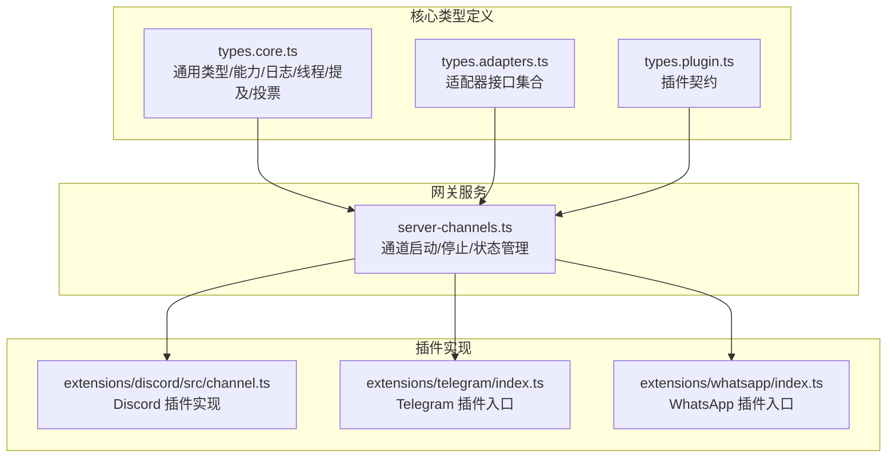
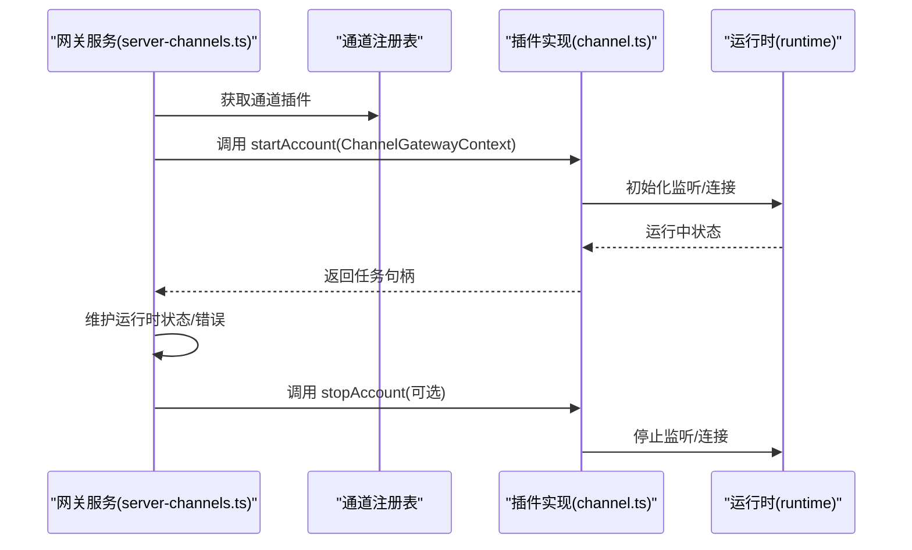
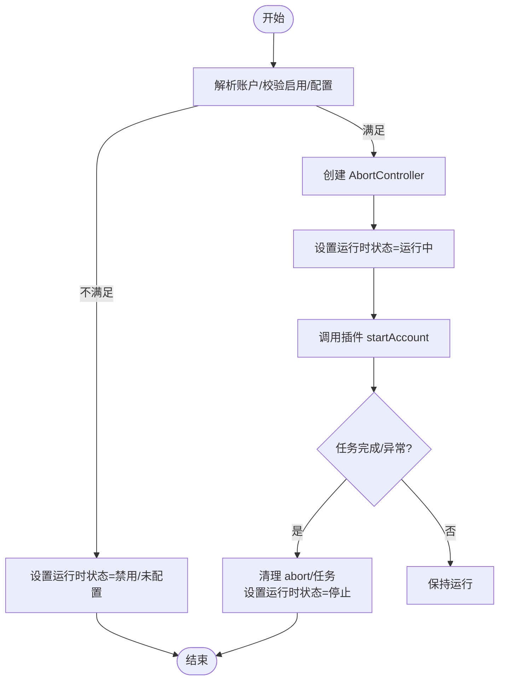
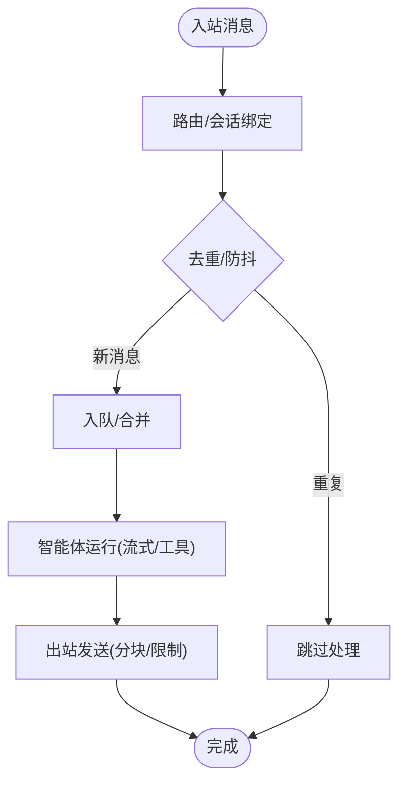
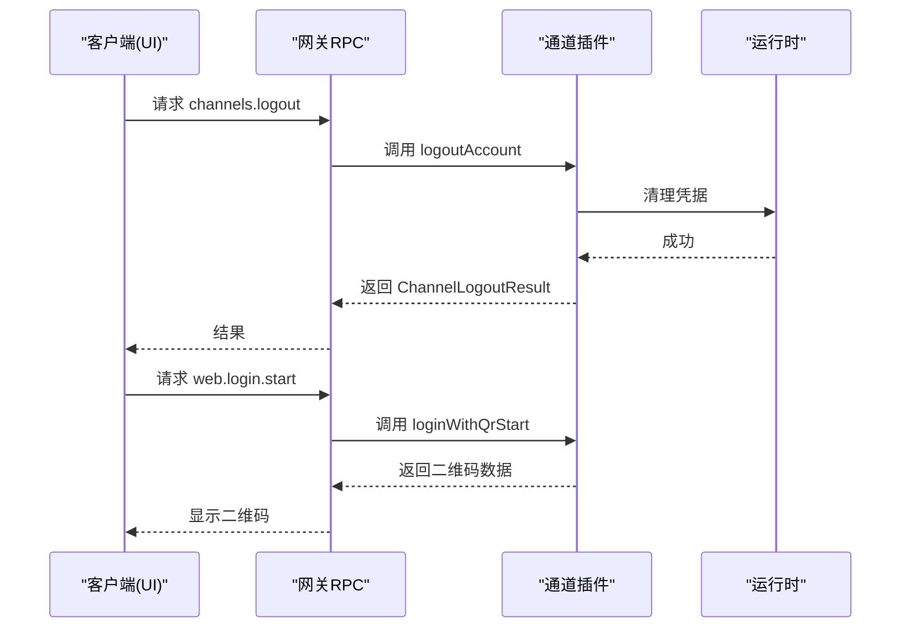
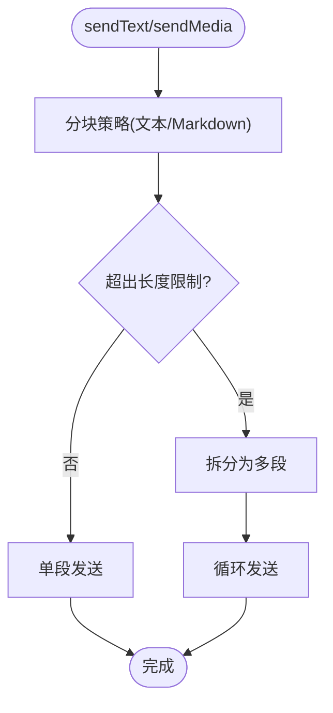
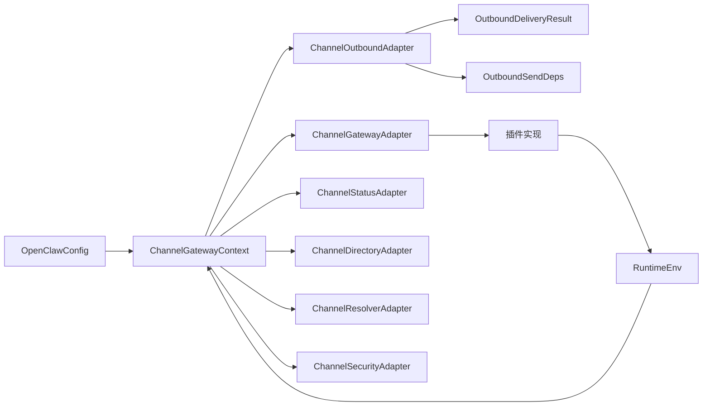

# 通道API

<cite>
**本文引用的文件**
- [src/channels/plugins/types.core.ts](file://src/channels/plugins/types.core.ts)
- [src/channels/plugins/types.adapters.ts](file://src/channels/plugins/types.adapters.ts)
- [src/channels/plugins/types.plugin.ts](file://src/channels/plugins/types.plugin.ts)
- [src/gateway/server-channels.ts](file://src/gateway/server-channels.ts)
- [extensions/discord/src/channel.ts](file://extensions/discord/src/channel.ts)
- [extensions/discord/index.ts](file://extensions/discord/index.ts)
- [extensions/telegram/index.ts](file://extensions/telegram/index.ts)
- [extensions/whatsapp/index.ts](file://extensions/whatsapp/index.ts)
- [src/web/auto-reply/monitor.ts](file://src/web/auto-reply/monitor.ts)
- [src/web/auto-reply/monitor/process-message.ts](file://src/web/auto-reply/monitor/process-message.ts)
- [src/web/auto-reply/loggers.ts](file://src/web/auto-reply/loggers.ts)
- [src/infra/outbound/channel-adapters.ts](file://src/infra/outbound/channel-adapters.ts)
- [apps/macos/Sources/OpenClaw/ChannelsStore+Lifecycle.swift](file://apps/macos/Sources/OpenClaw/ChannelsStore+Lifecycle.swift)
- [ui/src/ui/controllers/channels.ts](file://ui/src/ui/controllers/channels.ts)
- [docs/zh-CN/concepts/messages.md](file://docs/zh-CN/concepts/messages.md)
</cite>

## 目录

1. [简介](#简介)
2. [项目结构](#项目结构)
3. [核心组件](#核心组件)
4. [架构总览](#架构总览)
5. [详细组件分析](#详细组件分析)
6. [依赖关系分析](#依赖关系分析)
7. [性能考量](#性能考量)
8. [故障排查指南](#故障排查指南)
9. [结论](#结论)
10. [附录](#附录)

## 简介

本文件为 OpenClaw 通道API的权威参考文档，聚焦于通道适配器接口的完整API规范与实现要点，涵盖以下核心接口：

- ChannelMessagingAdapter：消息目标解析与显示格式化
- ChannelGatewayAdapter：通道生命周期（启动/停止）、二维码登录、登出
- ChannelAuthAdapter：一次性认证入口
- ChannelHeartbeatAdapter：就绪检查与收件人解析
- ChannelOutboundAdapter：出站消息发送、分块策略、投票发送
- ChannelStatusAdapter：探针、审计、快照构建与状态问题收集
- ChannelDirectoryAdapter：自身份辨、用户/群组列表查询
- ChannelResolverAdapter：目标解析（用户/群组）
- ChannelSecurityAdapter：私信策略与安全告警
- ChannelGroupAdapter：群组相关策略
- ChannelElevatedAdapter：权限回退来源
- ChannelCommandAdapter：命令执行策略
- ChannelStreamingAdapter：流式输出阻断与合并策略
- ChannelThreadingAdapter：回复模式与线程上下文

同时，文档解释通道生命周期管理、消息处理流程与认证机制，并提供 Discord、Telegram、WhatsApp 等主流消息平台的具体实现示例与最佳实践。

## 项目结构

OpenClaw 的通道体系由“核心类型定义”“网关服务”“插件实现”三部分组成：

- 核心类型定义：位于 src/channels/plugins 下，统一声明各适配器接口与通用数据结构
- 网关服务：位于 src/gateway，负责通道生命周期调度、运行时状态维护与错误处理
- 插件实现：位于 extensions/<platform>/，每个平台以独立插件形式注册并实现适配器

**图示来源**

- [src/channels/plugins/types.core.ts](file://src/channels/plugins/types.core.ts#L1-L338)
- [src/channels/plugins/types.adapters.ts](file://src/channels/plugins/types.adapters.ts#L1-L313)
- [src/channels/plugins/types.plugin.ts](file://src/channels/plugins/types.plugin.ts#L1-L45)
- [src/gateway/server-channels.ts](file://src/gateway/server-channels.ts#L79-L236)
- [extensions/discord/src/channel.ts](file://extensions/discord/src/channel.ts#L1-L430)
- [extensions/telegram/index.ts](file://extensions/telegram/index.ts#L1-L18)
- [extensions/whatsapp/index.ts](file://extensions/whatsapp/index.ts#L1-L18)

**章节来源**

- [src/channels/plugins/types.core.ts](file://src/channels/plugins/types.core.ts#L1-L338)
- [src/channels/plugins/types.adapters.ts](file://src/channels/plugins/types.adapters.ts#L1-L313)
- [src/channels/plugins/types.plugin.ts](file://src/channels/plugins/types.plugin.ts#L1-L45)
- [src/gateway/server-channels.ts](file://src/gateway/server-channels.ts#L79-L236)

## 核心组件

本节对关键适配器接口进行逐项说明，包含方法签名、参数类型、返回值与典型用法路径。

- ChannelMessagingAdapter
  - 作用：规范化目标标识、解析目标显示名
  - 关键字段
    - normalizeTarget(raw: string): string | undefined
    - targetResolver.looksLikeId(raw: string, normalized?: string): boolean
    - targetResolver.hint: string
    - formatTargetDisplay(params): string
  - 使用场景：将用户输入转换为平台可识别的目标ID，并生成可读显示名
  - 参考路径
    - [normalizeTarget](file://extensions/discord/src/channel.ts#L161-L167)
    - [targetResolver](file://extensions/discord/src/channel.ts#L163-L166)
    - [formatTargetDisplay](file://src/channels/plugins/types.core.ts#L266-L271)

- ChannelGatewayAdapter
  - 作用：通道生命周期与登录流程控制
  - 关键方法
    - startAccount(ctx: ChannelGatewayContext): 启动账户监听/连接
    - stopAccount(ctx: ChannelGatewayContext): 停止账户任务
    - loginWithQrStart(params): 开始二维码登录，返回二维码数据与提示
    - loginWithQrWait(params): 等待扫码结果
    - logoutAccount(ctx: ChannelLogoutContext): 登出并清理凭据
  - 参数与返回
    - ChannelGatewayContext：包含 cfg、accountId、account、runtime、abortSignal、getStatus、setStatus
    - ChannelLoginWithQrStartResult：qrDataUrl?, message
    - ChannelLoginWithQrWaitResult：connected, message
    - ChannelLogoutResult：cleared, loggedOut?
  - 参考路径
    - [startAccount/stopAccount](file://src/gateway/server-channels.ts#L96-L179)
    - [loginWithQrStart/loginWithQrWait/logoutAccount](file://src/channels/plugins/types.adapters.ts#L194-L208)
    - [ChannelGatewayContext](file://src/channels/plugins/types.adapters.ts#L149-L158)

- ChannelAuthAdapter
  - 作用：一次性认证入口（如一次性令牌、临时凭证）
  - 关键方法
    - login(params): Promise<void>
  - 参考路径
    - [ChannelAuthAdapter](file://src/channels/plugins/types.adapters.ts#L210-L218)

- ChannelHeartbeatAdapter
  - 作用：心跳就绪检查与收件人解析
  - 关键方法
    - checkReady(params): { ok: boolean; reason: string }
    - resolveRecipients(params): { recipients: string[]; source: string }
  - 参考路径
    - [ChannelHeartbeatAdapter](file://src/channels/plugins/types.adapters.ts#L220-L230)

- ChannelOutboundAdapter
  - 作用：出站消息发送与分块策略
  - 关键字段
    - deliveryMode: "direct" | "gateway" | "hybrid"
    - chunker?(text, limit): string[]
    - chunkerMode: "text" | "markdown"
    - textChunkLimit: number
    - pollMaxOptions: number
    - resolveTarget(params): { ok; to } | { ok; error }
    - sendPayload(ctx): OutboundDeliveryResult
    - sendText(ctx): OutboundDeliveryResult
    - sendMedia(ctx): OutboundDeliveryResult
    - sendPoll(ctx): ChannelPollResult
  - 参考路径
    - [ChannelOutboundAdapter](file://src/channels/plugins/types.adapters.ts#L89-L106)
    - [getChannelMessageAdapter](file://src/infra/outbound/channel-adapters.ts#L21-L26)

- ChannelStatusAdapter
  - 作用：账户状态采集与审计
  - 关键方法
    - defaultRuntime?: ChannelAccountSnapshot
    - buildChannelSummary?: (params) => Record
    - probeAccount?: (params) => Probe
    - auditAccount?: (params) => Audit
    - buildAccountSnapshot?: (params) => ChannelAccountSnapshot
    - logSelfId?: (params) => void
    - resolveAccountState?: (params) => ChannelAccountState
    - collectStatusIssues?: (accounts) => ChannelStatusIssue[]
  - 参考路径
    - [ChannelStatusAdapter](file://src/channels/plugins/types.adapters.ts#L108-L147)

- ChannelDirectoryAdapter
  - 作用：目录查询（自身份辨、用户/群组列表）
  - 关键方法
    - self(params): ChannelDirectoryEntry | null
    - listPeers/listPeersLive(params): ChannelDirectoryEntry[]
    - listGroups/listGroupsLive(params): ChannelDirectoryEntry[]
    - listGroupMembers(params): ChannelDirectoryEntry[]
  - 参考路径
    - [ChannelDirectoryAdapter](file://src/channels/plugins/types.adapters.ts#L232-L273)

- ChannelResolverAdapter
  - 作用：将用户输入解析为平台ID与名称
  - 关键方法
    - resolveTargets(params): ChannelResolveResult[]
  - 参考路径
    - [ChannelResolverAdapter](file://src/channels/plugins/types.adapters.ts#L285-L293)

- ChannelSecurityAdapter
  - 作用：私信策略与安全告警
  - 关键方法
    - resolveDmPolicy(ctx): ChannelSecurityDmPolicy | null
    - collectWarnings(ctx): string[] | Promise<string[]>
  - 参考路径
    - [ChannelSecurityAdapter](file://src/channels/plugins/types.adapters.ts#L307-L313)

- ChannelGroupAdapter
  - 作用：群组相关策略（是否需要@、工具策略等）
  - 关键方法
    - resolveRequireMention(ctx)
    - resolveGroupIntroHint(ctx)
    - resolveToolPolicy(ctx)
  - 参考路径
    - [ChannelGroupAdapter](file://src/channels/plugins/types.adapters.ts#L67-L71)

- ChannelElevatedAdapter
  - 作用：权限回退来源（如允许白名单回退）
  - 关键方法
    - allowFromFallback(ctx): (string|number)[]
  - 参考路径
    - [ChannelElevatedAdapter](file://src/channels/plugins/types.adapters.ts#L295-L300)

- ChannelCommandAdapter
  - 作用：命令执行策略（如是否仅限所有者）
  - 关键字段
    - enforceOwnerForCommands: boolean
    - skipWhenConfigEmpty: boolean
  - 参考路径
    - [ChannelCommandAdapter](file://src/channels/plugins/types.adapters.ts#L302-L305)

- ChannelStreamingAdapter
  - 作用：流式输出阻断与合并策略
  - 关键字段
    - blockStreamingCoalesceDefaults: { minChars, idleMs }
  - 参考路径
    - [ChannelStreamingAdapter](file://src/channels/plugins/types.adapters.ts#L213-L218)

- ChannelThreadingAdapter
  - 作用：回复模式与线程上下文
  - 关键字段
    - resolveReplyToMode(ctx): "off"|"first"|"all"
    - allowTagsWhenOff: boolean
    - buildToolContext(ctx): ChannelThreadingToolContext | undefined
  - 参考路径
    - [ChannelThreadingAdapter](file://src/channels/plugins/types.adapters.ts#L220-L233)

**章节来源**

- [src/channels/plugins/types.core.ts](file://src/channels/plugins/types.core.ts#L19-L338)
- [src/channels/plugins/types.adapters.ts](file://src/channels/plugins/types.adapters.ts#L22-L313)

## 架构总览

下图展示通道从“网关调度”到“插件实现”的调用链路与职责边界：

**图示来源**

- [src/gateway/server-channels.ts](file://src/gateway/server-channels.ts#L96-L179)
- [extensions/discord/src/channel.ts](file://extensions/discord/src/channel.ts#L384-L428)

**章节来源**

- [src/gateway/server-channels.ts](file://src/gateway/server-channels.ts#L79-L236)
- [extensions/discord/src/channel.ts](file://extensions/discord/src/channel.ts#L1-L430)

## 详细组件分析

### 生命周期管理（启动/停止/登出）

- 启动流程
  - 网关根据插件配置解析账户并校验启用/配置状态
  - 创建 AbortController 并设置运行时状态为 running
  - 调用插件的 startAccount，传入 ChannelGatewayContext（包含 cfg、accountId、account、runtime、abortSignal、getStatus、setStatus）
  - 任务完成后清理状态并标记停止时间
- 停止流程
  - 若插件实现 stopAccount，则调用以优雅关闭
  - 无论是否实现，最终都会清理 abort 与任务映射，并更新运行时状态
- 登出流程
  - 通过 ChannelLogoutContext 调用 logoutAccount，返回 ChannelLogoutResult（包含 cleared、loggedOut 等）

**图示来源**

- [src/gateway/server-channels.ts](file://src/gateway/server-channels.ts#L96-L179)
- [src/channels/plugins/types.adapters.ts](file://src/channels/plugins/types.adapters.ts#L149-L208)

**章节来源**

- [src/gateway/server-channels.ts](file://src/gateway/server-channels.ts#L96-L179)
- [src/channels/plugins/types.adapters.ts](file://src/channels/plugins/types.adapters.ts#L149-L208)

### 消息处理流程（入站→会话→出站）

- 入站消息经路由/会话绑定后进入队列；若存在运行中任务则合并；否则触发智能体运行（支持流式传输与工具调用）
- 出站阶段应用渠道限制与分块策略，再发送至目标平台
- 入站去重与防抖：同一会话/发送者短时间内重复消息会被合并或跳过

**图示来源**

- [docs/zh-CN/concepts/messages.md](file://docs/zh-CN/concepts/messages.md#L17-L62)
- [src/web/auto-reply/monitor/process-message.ts](file://src/web/auto-reply/monitor/process-message.ts#L106-L150)

**章节来源**

- [docs/zh-CN/concepts/messages.md](file://docs/zh-CN/concepts/messages.md#L17-L62)
- [src/web/auto-reply/monitor/process-message.ts](file://src/web/auto-reply/monitor/process-message.ts#L106-L150)

### 认证机制

- 一次性认证：ChannelAuthAdapter.login 提供一次性登录入口
- 二维码登录：ChannelGatewayAdapter.loginWithQrStart/loginWithQrWait 支持扫码登录流程
- 登出：ChannelGatewayAdapter.logoutAccount 清理凭据并返回结果
- 客户端集成：UI 与 macOS 客户端通过 RPC 方法调用通道登出与登录流程

**图示来源**

- [src/channels/plugins/types.adapters.ts](file://src/channels/plugins/types.adapters.ts#L194-L208)
- [apps/macos/Sources/OpenClaw/ChannelsStore+Lifecycle.swift](file://apps/macos/Sources/OpenClaw/ChannelsStore+Lifecycle.swift#L121-L145)
- [ui/src/ui/controllers/channels.ts](file://ui/src/ui/controllers/channels.ts#L79-L94)

**章节来源**

- [src/channels/plugins/types.adapters.ts](file://src/channels/plugins/types.adapters.ts#L210-L218)
- [apps/macos/Sources/OpenClaw/ChannelsStore+Lifecycle.swift](file://apps/macos/Sources/OpenClaw/ChannelsStore+Lifecycle.swift#L121-L145)
- [ui/src/ui/controllers/channels.ts](file://ui/src/ui/controllers/channels.ts#L29-L77)

### 出站发送与分块策略

- ChannelOutboundAdapter.deliveryMode 决定直连/网关/混合模式
- 文本分块：chunker(chunkerMode, textChunkLimit) 将长文本拆分为多段
- 投票发送：sendPoll 支持平台投票能力
- 平台差异：getChannelMessageAdapter 为特定平台（如 Discord）提供嵌入支持

**图示来源**

- [src/channels/plugins/types.adapters.ts](file://src/channels/plugins/types.adapters.ts#L89-L106)
- [src/infra/outbound/channel-adapters.ts](file://src/infra/outbound/channel-adapters.ts#L21-L26)

**章节来源**

- [src/channels/plugins/types.adapters.ts](file://src/channels/plugins/types.adapters.ts#L89-L106)
- [src/infra/outbound/channel-adapters.ts](file://src/infra/outbound/channel-adapters.ts#L21-L26)

### 平台实现示例与最佳实践

#### Discord

- 插件入口：extensions/discord/index.ts 注册并注入运行时
- 插件实现：extensions/discord/src/channel.ts
  - 能力：direct/channel/thread、投票、反应、媒体、原生命令
  - 安全：resolveDmPolicy、collectWarnings
  - 目录：self/listPeers/listGroups/listGroupMembers
  - 解析：resolveTargets（用户/群组）
  - 出站：sendText/sendMedia/sendPoll
  - 状态：probeAccount/auditAccount/buildAccountSnapshot
  - 网关：startAccount（初始化监听/连接）
- 最佳实践
  - 启用 Message Content Intent 以接收频道消息内容
  - 使用 allowlist 控制群组/频道触发范围
  - 合理设置 textChunkLimit 与 blockStreamingCoalesceDefaults

**章节来源**

- [extensions/discord/index.ts](file://extensions/discord/index.ts#L1-L18)
- [extensions/discord/src/channel.ts](file://extensions/discord/src/channel.ts#L1-L430)

#### Telegram

- 插件入口：extensions/telegram/index.ts 注册并注入运行时
- 实现要点
  - 通过 ChannelOutboundAdapter.sendText/sendMedia 发送消息
  - 使用 ChannelDirectoryAdapter.listPeers/listGroups 查询联系人与群组
  - 使用 ChannelResolverAdapter.resolveTargets 解析目标
  - 使用 ChannelStatusAdapter.buildAccountSnapshot 记录运行时状态

**章节来源**

- [extensions/telegram/index.ts](file://extensions/telegram/index.ts#L1-L18)

#### WhatsApp

- 插件入口：extensions/whatsapp/index.ts 注册并注入运行时
- 实现要点
  - 二维码登录：loginWithQrStart/loginWithQrWait
  - 登出：logoutAccount
  - 出站：sendText/sendMedia
  - 网关：startAccount（监控提供商）
- Web 通道监控：src/web/auto-reply/monitor.ts 与 process-message.ts 提供入站监控与消息处理

**章节来源**

- [extensions/whatsapp/index.ts](file://extensions/whatsapp/index.ts#L1-L18)
- [src/web/auto-reply/monitor.ts](file://src/web/auto-reply/monitor.ts#L65-L88)
- [src/web/auto-reply/monitor/process-message.ts](file://src/web/auto-reply/monitor/process-message.ts#L106-L150)
- [src/web/auto-reply/loggers.ts](file://src/web/auto-reply/loggers.ts#L1-L6)

## 依赖关系分析

- 类型耦合
  - 所有适配器均依赖 OpenClawConfig、RuntimeEnv、ChannelAccountSnapshot 等核心类型
  - ChannelOutboundAdapter 依赖 OutboundDeliveryResult 与 OutboundSendDeps
- 网关与插件
  - 网关通过插件契约调用 startAccount/stopAccount 等方法
  - 插件通过运行时接口访问平台能力（如 Discord 的 probeDiscord、sendMessageDiscord）
- 平台差异
  - getChannelMessageAdapter 为 Discord 提供跨上下文嵌入支持，其他平台默认不支持

**图示来源**

- [src/channels/plugins/types.adapters.ts](file://src/channels/plugins/types.adapters.ts#L1-L313)
- [src/infra/outbound/channel-adapters.ts](file://src/infra/outbound/channel-adapters.ts#L1-L26)

**章节来源**

- [src/channels/plugins/types.adapters.ts](file://src/channels/plugins/types.adapters.ts#L1-L313)
- [src/infra/outbound/channel-adapters.ts](file://src/infra/outbound/channel-adapters.ts#L1-L26)

## 性能考量

- 分块与流式
  - 合理设置 textChunkLimit 与 chunkerMode，避免超长消息导致失败
  - 对 Discord 等支持嵌入的平台，利用 blockStreamingCoalesceDefaults 合并小片段提升吞吐
- 去重与防抖
  - 利用入站去重与防抖减少重复计算，降低智能体负载
- 探针与审计
  - 定期执行 probeAccount/auditAccount，提前发现权限/配置问题，避免运行时失败

[本节为通用指导，无需具体文件分析]

## 故障排查指南

- 登录/登出
  - 使用 UI 或 macOS 客户端调用 channels.logout，确认返回 cleared 字段
  - 二维码登录失败时检查 loginWithQrStart/loginWithQrWait 的返回信息
- 状态与问题
  - 通过 ChannelStatusAdapter.collectStatusIssues 收集状态问题
  - 查看 ChannelAccountSnapshot 中 lastError/lastProbeAt 等字段定位问题
- 日志
  - 使用 whatsappLog/whatsappInboundLog/whatsappOutboundLog/whatsappHeartbeatLog 等子系统日志定位问题

**章节来源**

- [apps/macos/Sources/OpenClaw/ChannelsStore+Lifecycle.swift](file://apps/macos/Sources/OpenClaw/ChannelsStore+Lifecycle.swift#L121-L145)
- [ui/src/ui/controllers/channels.ts](file://ui/src/ui/controllers/channels.ts#L79-L94)
- [src/web/auto-reply/loggers.ts](file://src/web/auto-reply/loggers.ts#L1-L6)

## 结论

OpenClaw 的通道API通过统一的适配器接口与严格的生命周期管理，实现了对多平台消息系统的抽象与扩展。借助核心类型定义、网关调度与插件实现的清晰分工，开发者可以快速接入新的消息平台，并在保证一致性的同时发挥各平台特性。建议在生产环境中结合探针/审计、分块/流式策略与入站去重/防抖机制，确保稳定性与性能。

[本节为总结性内容，无需具体文件分析]

## 附录

- 术语
  - 渠道（Channel）：消息平台的抽象，如 Discord、Telegram、WhatsApp
  - 账户（Account）：渠道内的一个实例，支持多账户并行
  - 运行时（Runtime）：通道运行环境，承载日志、状态与平台能力
- 相关文档
  - [消息概念](file://docs/zh-CN/concepts/messages.md#L17-L62)
  - [插件开发指南](file://docs/zh-CN/tools/plugin.md#L451-L515)

[本节为补充信息，无需具体文件分析]
