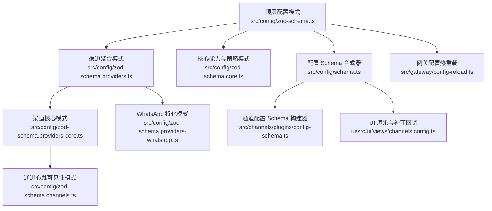
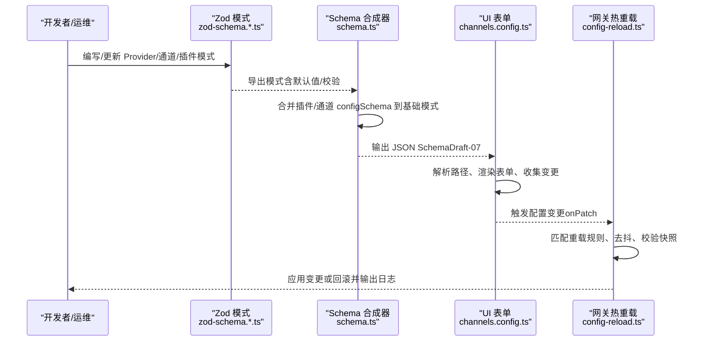
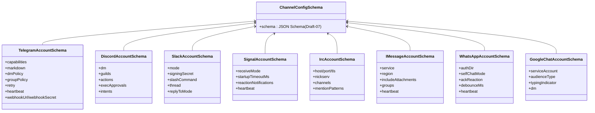
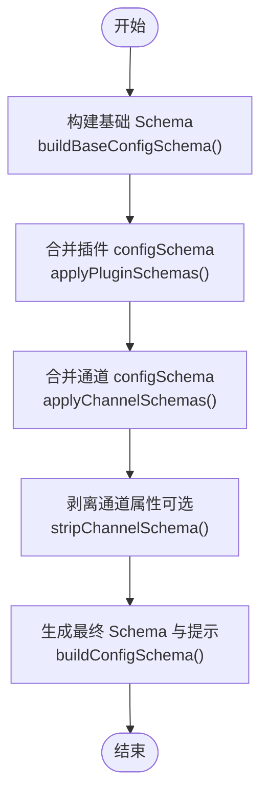
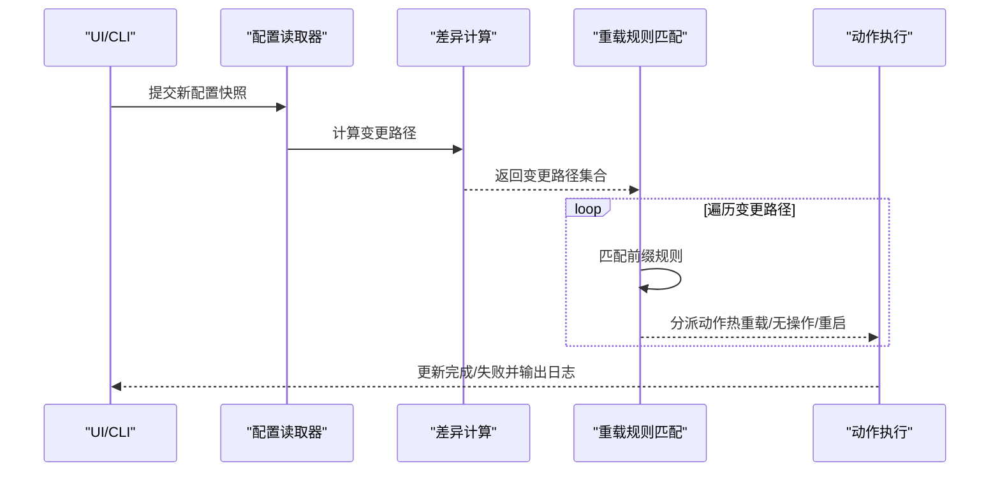
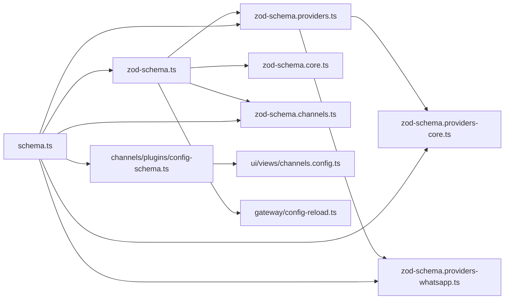

# 配置API

<cite>
**本文引用的文件**
- [src/config/zod-schema.ts](file://src/config/zod-schema.ts)
- [src/config/zod-schema.providers.ts](file://src/config/zod-schema.providers.ts)
- [src/config/zod-schema.providers-core.ts](file://src/config/zod-schema.providers-core.ts)
- [src/config/zod-schema.providers-whatsapp.ts](file://src/config/zod-schema.providers-whatsapp.ts)
- [src/config/zod-schema.channels.ts](file://src/config/zod-schema.channels.ts)
- [src/config/zod-schema.core.ts](file://src/config/zod-schema.core.ts)
- [src/config/schema.ts](file://src/config/schema.ts)
- [src/gateway/config-reload.ts](file://src/gateway/config-reload.ts)
- [src/channels/plugins/config-schema.ts](file://src/channels/plugins/config-schema.ts)
- [ui/src/ui/views/channels.config.ts](file://ui/src/ui/views/channels.config.ts)
- [docs/refactor/strict-config.md](file://docs/refactor/strict-config.md)
</cite>

## 目录

1. [简介](#简介)
2. [项目结构](#项目结构)
3. [核心组件](#核心组件)
4. [架构总览](#架构总览)
5. [详细组件分析](#详细组件分析)
6. [依赖关系分析](#依赖关系分析)
7. [性能考量](#性能考量)
8. [故障排查指南](#故障排查指南)
9. [结论](#结论)
10. [附录](#附录)

## 简介

本文件为 OpenClaw 配置 API 的权威参考，聚焦“插件配置模式”的定义与验证机制，涵盖以下要点：

- 定义与来源：ChannelConfigSchema、Provider 配置模式（如 Telegram、Discord、Slack、Signal、IRC、iMessage、WhatsApp、Google Chat 等）。
- 字段类型、默认值与验证规则：基于 Zod 模式与自定义 refine 校验，统一严格对象与未知键拒绝策略。
- 动态更新、热重载与版本兼容：配置变更检测、重载规则、去抖与动作调度、版本元数据与 Doctor 修复流程。
- 示例与最佳实践：不同插件类型的配置要点、常见错误与规避方法。

## 项目结构

OpenClaw 的配置体系由“顶层配置 + 渠道配置 + 插件配置”三层构成，并通过 JSON Schema 生成器在运行时合并扩展项，最终驱动 UI 与网关行为。

图表来源

- [src/config/zod-schema.ts](file://src/config/zod-schema.ts#L95-L607)
- [src/config/zod-schema.providers.ts](file://src/config/zod-schema.providers.ts#L21-L42)
- [src/config/zod-schema.providers-core.ts](file://src/config/zod-schema.providers-core.ts#L90-L144)
- [src/config/zod-schema.providers-whatsapp.ts](file://src/config/zod-schema.providers-whatsapp.ts#L14-L63)
- [src/config/zod-schema.channels.ts](file://src/config/zod-schema.channels.ts#L3-L10)
- [src/config/zod-schema.core.ts](file://src/config/zod-schema.core.ts#L123-L129)
- [src/config/schema.ts](file://src/config/schema.ts#L293-L335)
- [src/channels/plugins/config-schema.ts](file://src/channels/plugins/config-schema.ts#L4-L11)
- [ui/src/ui/views/channels.config.ts](file://ui/src/ui/views/channels.config.ts#L106-L137)
- [src/gateway/config-reload.ts](file://src/gateway/config-reload.ts#L92-L120)

章节来源

- [src/config/zod-schema.ts](file://src/config/zod-schema.ts#L95-L607)
- [src/config/zod-schema.providers.ts](file://src/config/zod-schema.providers.ts#L21-L42)
- [src/config/zod-schema.providers-core.ts](file://src/config/zod-schema.providers-core.ts#L90-L144)
- [src/config/zod-schema.providers-whatsapp.ts](file://src/config/zod-schema.providers-whatsapp.ts#L14-L63)
- [src/config/zod-schema.channels.ts](file://src/config/zod-schema.channels.ts#L3-L10)
- [src/config/zod-schema.core.ts](file://src/config/zod-schema.core.ts#L123-L129)
- [src/config/schema.ts](file://src/config/schema.ts#L293-L335)
- [src/channels/plugins/config-schema.ts](file://src/channels/plugins/config-schema.ts#L4-L11)
- [ui/src/ui/views/channels.config.ts](file://ui/src/ui/views/channels.config.ts#L106-L137)
- [src/gateway/config-reload.ts](file://src/gateway/config-reload.ts#L92-L120)

## 核心组件

- 顶层配置模式 OpenClawSchema：定义全局字段（环境、诊断、日志、浏览器、UI、认证、模型、代理、广播、音频、媒体、消息、命令、审批、会话、定时任务、钩子、Web、发现、画布、语音、网关、内存、技能、插件等），采用严格对象与未知键拒绝策略，并包含跨字段一致性校验。
- 渠道聚合模式 ChannelsSchema：聚合各 Provider 的配置模式，允许扩展型通道（passthrough），并通过严格对象控制 defaults 字段。
- Provider 配置模式：以 Zod 定义各平台的账户级与全局级配置，包含策略（群组/私聊策略）、工具策略、Markdown 表格渲染、流式输出分块与合并、重试、网络与代理、心跳可见性、响应前缀等。
- 核心策略与能力：如 GroupPolicy、DmPolicy、ReplyToMode、MarkdownConfig、BlockStreamingChunk/Coalesce、RetryConfig、Queue/InboundDebounce、MediaUnderstanding、LinkModel 等。
- 配置 Schema 合成器：将插件与通道的 configSchema 合并到基础 OpenClawSchema，生成 UI 可用的完整 Schema 与提示信息。
- 通道配置 Schema 构建器：将 Zod 模式转换为 JSON Schema（Draft-07），供 UI 与前端表单渲染。
- UI 渲染与补丁回调：按路径解析节点，渲染表单并支持 onPatch 回调更新配置。
- 网关配置热重载：根据变更路径匹配重载规则，执行去抖、校验与重启/热重载动作。

章节来源

- [src/config/zod-schema.ts](file://src/config/zod-schema.ts#L95-L607)
- [src/config/zod-schema.providers.ts](file://src/config/zod-schema.providers.ts#L21-L42)
- [src/config/zod-schema.providers-core.ts](file://src/config/zod-schema.providers-core.ts#L90-L144)
- [src/config/zod-schema.providers-whatsapp.ts](file://src/config/zod-schema.providers-whatsapp.ts#L14-L63)
- [src/config/zod-schema.core.ts](file://src/config/zod-schema.core.ts#L123-L129)
- [src/config/schema.ts](file://src/config/schema.ts#L222-L335)
- [src/channels/plugins/config-schema.ts](file://src/channels/plugins/config-schema.ts#L4-L11)
- [ui/src/ui/views/channels.config.ts](file://ui/src/ui/views/channels.config.ts#L106-L137)
- [src/gateway/config-reload.ts](file://src/gateway/config-reload.ts#L92-L120)

## 架构总览

下图展示从 Zod 模式到 JSON Schema、再到 UI 渲染与网关热重载的关键流转。

图表来源

- [src/config/zod-schema.ts](file://src/config/zod-schema.ts#L95-L607)
- [src/config/schema.ts](file://src/config/schema.ts#L293-L335)
- [ui/src/ui/views/channels.config.ts](file://ui/src/ui/views/channels.config.ts#L106-L137)
- [src/gateway/config-reload.ts](file://src/gateway/config-reload.ts#L282-L308)

## 详细组件分析

### 组件A：ChannelConfigSchema 与 Provider 配置模式

- ChannelConfigSchema：将 Zod 模式转换为 JSON Schema（Draft-07），用于 UI 渲染与校验。
- Provider 配置模式（示例）：
  - Telegram：账户级与全局级配置，包含 Markdown、工具策略、DM/群组策略、自定义命令、流式分块与合并、重试、网络与代理、心跳可见性、Webhook 等。
  - Discord：DM/Guild 策略、角色/用户白名单、动作权限、PluralKit 集成、回复模式等。
  - Slack：Socket/HTTP 模式、签名密钥、Slash 命令、线程与回复模式、动作权限等。
  - Signal：本地服务集成、接收模式、历史限制、反应通知与级别、心跳可见性等。
  - IRC：服务器连接、NickServ 注册、频道与 DM 策略、提及模式、历史限制等。
  - iMessage：服务选择（iMessage/SMS/Auto）、区域、附件与媒体限制、群组策略等。
  - WhatsApp：Baileys 多设备认证目录覆盖、自聊模式、ACK 反应、去抖等。
  - Google Chat：服务账号、Audience 类型、Webhook、Typing Indicator、DM 策略等。
- 默认值与严格性：多数策略字段采用 .default(...) 并配合 .strict()，确保输入严格且运行时有确定值。
- 跨字段校验：如 open 策略必须包含允许列表中的通配符、HTTP 模式需提供签名密钥、Webhook URL 需配套密钥等。

图表来源

- [src/channels/plugins/config-schema.ts](file://src/channels/plugins/config-schema.ts#L4-L11)
- [src/config/zod-schema.providers-core.ts](file://src/config/zod-schema.providers-core.ts#L90-L144)
- [src/config/zod-schema.providers-core.ts](file://src/config/zod-schema.providers-core.ts#L258-L333)
- [src/config/zod-schema.providers-core.ts](file://src/config/zod-schema.providers-core.ts#L462-L520)
- [src/config/zod-schema.providers-core.ts](file://src/config/zod-schema.providers-core.ts#L562-L604)
- [src/config/zod-schema.providers-core.ts](file://src/config/zod-schema.providers-core.ts#L651-L685)
- [src/config/zod-schema.providers-core.ts](file://src/config/zod-schema.providers-core.ts#L723-L764)
- [src/config/zod-schema.providers-whatsapp.ts](file://src/config/zod-schema.providers-whatsapp.ts#L14-L63)
- [src/config/zod-schema.providers-core.ts](file://src/config/zod-schema.providers-core.ts#L367-L404)

章节来源

- [src/channels/plugins/config-schema.ts](file://src/channels/plugins/config-schema.ts#L4-L11)
- [src/config/zod-schema.providers-core.ts](file://src/config/zod-schema.providers-core.ts#L90-L144)
- [src/config/zod-schema.providers-core.ts](file://src/config/zod-schema.providers-core.ts#L258-L333)
- [src/config/zod-schema.providers-core.ts](file://src/config/zod-schema.providers-core.ts#L462-L520)
- [src/config/zod-schema.providers-core.ts](file://src/config/zod-schema.providers-core.ts#L562-L604)
- [src/config/zod-schema.providers-core.ts](file://src/config/zod-schema.providers-core.ts#L651-L685)
- [src/config/zod-schema.providers-core.ts](file://src/config/zod-schema.providers-core.ts#L723-L764)
- [src/config/zod-schema.providers-whatsapp.ts](file://src/config/zod-schema.providers-whatsapp.ts#L14-L63)
- [src/config/zod-schema.providers-core.ts](file://src/config/zod-schema.providers-core.ts#L367-L404)

### 组件B：配置 Schema 合成与 UI 渲染

- 合成逻辑：将插件与通道的 configSchema 合并到基础 OpenClawSchema，生成可直接用于 UI 的 JSON Schema，并附带敏感字段提示与版本信息。
- UI 渲染：按路径解析节点，支持对象/数组节点导航、额外字段渲染、禁用状态与 onPatch 回调。
- 关键函数：
  - buildBaseConfigSchema：缓存基础 Schema，剥离通道属性以便后续增量合并。
  - applyPluginSchemas/applyChannelSchemas：合并插件与通道的 configSchema。
  - buildConfigSchema：对外暴露的入口，支持传入插件与通道元数据。

图表来源

- [src/config/schema.ts](file://src/config/schema.ts#L293-L335)
- [src/config/schema.ts](file://src/config/schema.ts#L222-L248)
- [src/config/schema.ts](file://src/config/schema.ts#L250-L274)

章节来源

- [src/config/schema.ts](file://src/config/schema.ts#L293-L335)
- [src/config/schema.ts](file://src/config/schema.ts#L222-L248)
- [src/config/schema.ts](file://src/config/schema.ts#L250-L274)
- [ui/src/ui/views/channels.config.ts](file://ui/src/ui/views/channels.config.ts#L106-L137)

### 组件C：动态更新、热重载与版本兼容

- 变更检测：比较当前配置与新快照的差异路径，仅对受影响的前缀进行处理。
- 重载规则：通道插件可声明 configPrefixes 与 noopPrefixes，分别映射到“热重载”或“无操作”动作；网关内置规则与尾部规则组合形成完整规则集。
- 去抖与并发：对多次快速变更进行去抖，避免频繁重启；运行中再次触发则标记 pending。
- 校验与回退：若新配置无效，跳过重载并记录问题；有效时应用变更并更新运行时设置。
- 版本与元数据：顶层 OpenClawSchema 包含 lastTouchedVersion/lastTouchedAt，便于追踪升级与兼容性。

图表来源

- [src/gateway/config-reload.ts](file://src/gateway/config-reload.ts#L122-L129)
- [src/gateway/config-reload.ts](file://src/gateway/config-reload.ts#L269-L308)
- [src/config/zod-schema.ts](file://src/config/zod-schema.ts#L97-L103)

章节来源

- [src/gateway/config-reload.ts](file://src/gateway/config-reload.ts#L92-L120)
- [src/gateway/config-reload.ts](file://src/gateway/config-reload.ts#L122-L129)
- [src/gateway/config-reload.ts](file://src/gateway/config-reload.ts#L269-L308)
- [src/config/zod-schema.ts](file://src/config/zod-schema.ts#L97-L103)

## 依赖关系分析

- 模式依赖：OpenClawSchema 依赖 ChannelsSchema；ChannelsSchema 依赖各 Provider 的具体模式；Provider 模式又依赖核心策略与能力模式。
- 合成依赖：schema.ts 依赖 zod-schema.\*.ts 的导出，再通过 config-schema.ts 将 Zod 转换为 JSON Schema。
- 运行时依赖：UI 通过 channels.config.ts 解析路径并渲染；网关通过 config-reload.ts 执行热重载。

图表来源

- [src/config/zod-schema.ts](file://src/config/zod-schema.ts#L1-L14)
- [src/config/zod-schema.providers.ts](file://src/config/zod-schema.providers.ts#L1-L19)
- [src/config/zod-schema.providers-core.ts](file://src/config/zod-schema.providers-core.ts#L1-L22)
- [src/config/zod-schema.providers-whatsapp.ts](file://src/config/zod-schema.providers-whatsapp.ts#L1-L10)
- [src/config/zod-schema.core.ts](file://src/config/zod-schema.core.ts#L1-L5)
- [src/config/zod-schema.channels.ts](file://src/config/zod-schema.channels.ts#L1-L10)
- [src/config/schema.ts](file://src/config/schema.ts#L293-L335)
- [src/channels/plugins/config-schema.ts](file://src/channels/plugins/config-schema.ts#L4-L11)
- [ui/src/ui/views/channels.config.ts](file://ui/src/ui/views/channels.config.ts#L106-L137)
- [src/gateway/config-reload.ts](file://src/gateway/config-reload.ts#L92-L120)

章节来源

- [src/config/zod-schema.ts](file://src/config/zod-schema.ts#L1-L14)
- [src/config/zod-schema.providers.ts](file://src/config/zod-schema.providers.ts#L1-L19)
- [src/config/zod-schema.providers-core.ts](file://src/config/zod-schema.providers-core.ts#L1-L22)
- [src/config/zod-schema.providers-whatsapp.ts](file://src/config/zod-schema.providers-whatsapp.ts#L1-L10)
- [src/config/zod-schema.core.ts](file://src/config/zod-schema.core.ts#L1-L5)
- [src/config/zod-schema.channels.ts](file://src/config/zod-schema.channels.ts#L1-L10)
- [src/config/schema.ts](file://src/config/schema.ts#L293-L335)
- [src/channels/plugins/config-schema.ts](file://src/channels/plugins/config-schema.ts#L4-L11)
- [ui/src/ui/views/channels.config.ts](file://ui/src/ui/views/channels.config.ts#L106-L137)
- [src/gateway/config-reload.ts](file://src/gateway/config-reload.ts#L92-L120)

## 性能考量

- 去抖与批处理：热重载采用去抖减少频繁重启，适合高频配置编辑场景。
- 缓存与增量：基础 Schema 缓存与按需合并，降低重复计算成本。
- 严格模式与早期失败：严格对象与未知键拒绝，可在早期发现配置错误，避免运行期开销。
- UI 渲染优化：按路径解析节点，避免全量渲染，提升复杂表单交互体验。

## 故障排查指南

- Doctor 流程与命令门控：每次加载配置均运行 Doctor（干跑），无效配置禁止除诊断类外的命令，可通过 doctor --fix 自动迁移与清理未知键。
- 常见错误类型：
  - 未知键：严格模式拒绝，需删除或迁移。
  - 旧版键/迁移缺失：Doctor 识别并提示迁移步骤。
  - 插件缺少 schema：阻止加载并给出清晰错误。
  - 配置无效：网关启动阻断，除非是诊断命令。
- 热重载失败：检查变更路径是否命中规则、去抖期间是否被取消、新配置快照是否有效。

章节来源

- [docs/refactor/strict-config.md](file://docs/refactor/strict-config.md#L46-L94)
- [src/gateway/config-reload.ts](file://src/gateway/config-reload.ts#L296-L301)

## 结论

OpenClaw 的配置 API 以 Zod 模式为核心，结合 Schema 合成器与 UI/网关运行时，实现了强约束、可扩展、可热重载的配置体系。通过严格的默认值与跨字段校验，以及 Doctor 与热重载机制，既保证了配置质量，也提升了运维效率。建议在扩展插件或通道时遵循现有模式与默认值约定，确保一致的用户体验与稳定性。

## 附录

- 不同插件类型的配置要点与最佳实践（示例性说明，非代码片段）：
  - Telegram：启用 Webhook 时务必同时配置 URL 与 Secret；开放 DM 策略需包含通配符允许列表；合理设置流式分块与合并参数以平衡延迟与完整性。
  - Discord：Socket 模式通常更稳定；HTTP 模式需提供签名密钥；为高权限动作配置执行审批。
  - Slack：HTTP 模式需签名密钥；为不同聊天类型配置回复模式；谨慎开启高风险动作。
  - Signal：本地服务集成需正确配置启动超时与接收模式；DM 策略与群组策略需与允许列表一致。
  - IRC：NickServ 注册需提供邮箱；频道与 DM 策略需与允许列表一致；合理设置历史限制。
  - iMessage：根据系统选择服务；注意附件与媒体限制；群组策略与允许列表需明确。
  - WhatsApp：多设备认证目录可覆盖；自聊模式与 ACK 反应需按需启用；合理设置去抖。
  - Google Chat：服务账号与 Audience 类型需匹配；Webhook 与 Typing Indicator 需按需启用。
- 版本与兼容：顶层配置包含版本与时间戳字段，建议在升级后运行 Doctor 并核对迁移结果。
