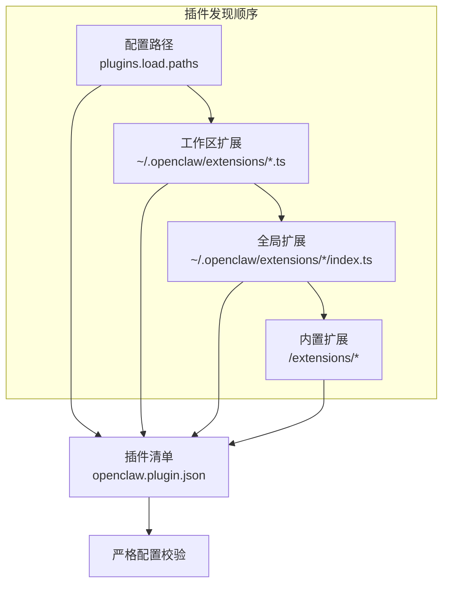
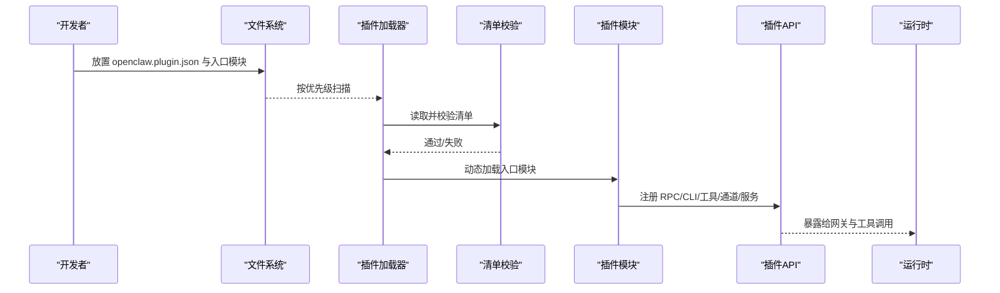
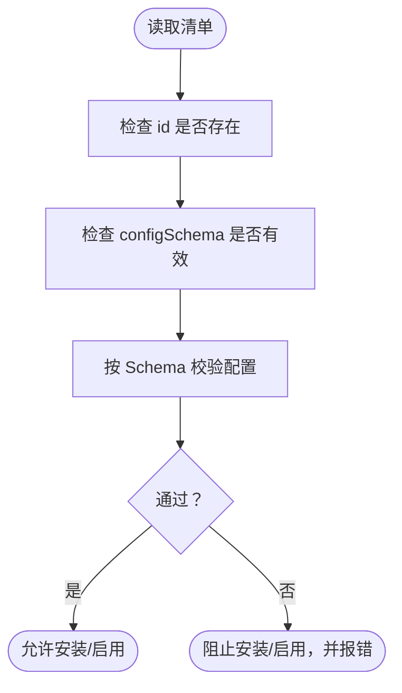
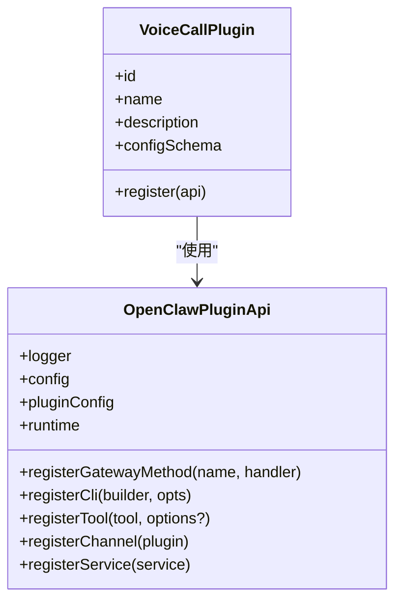
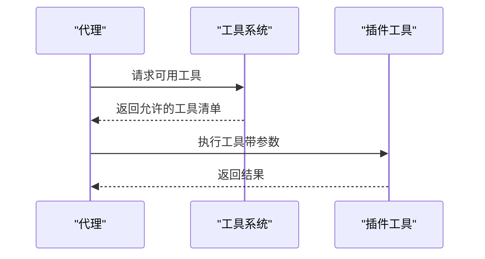
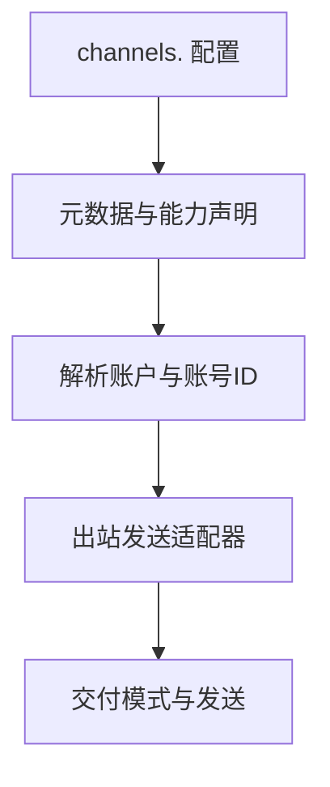
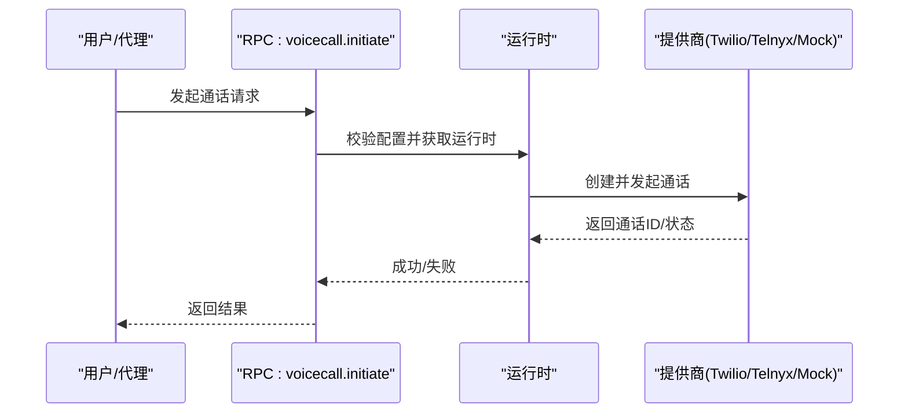
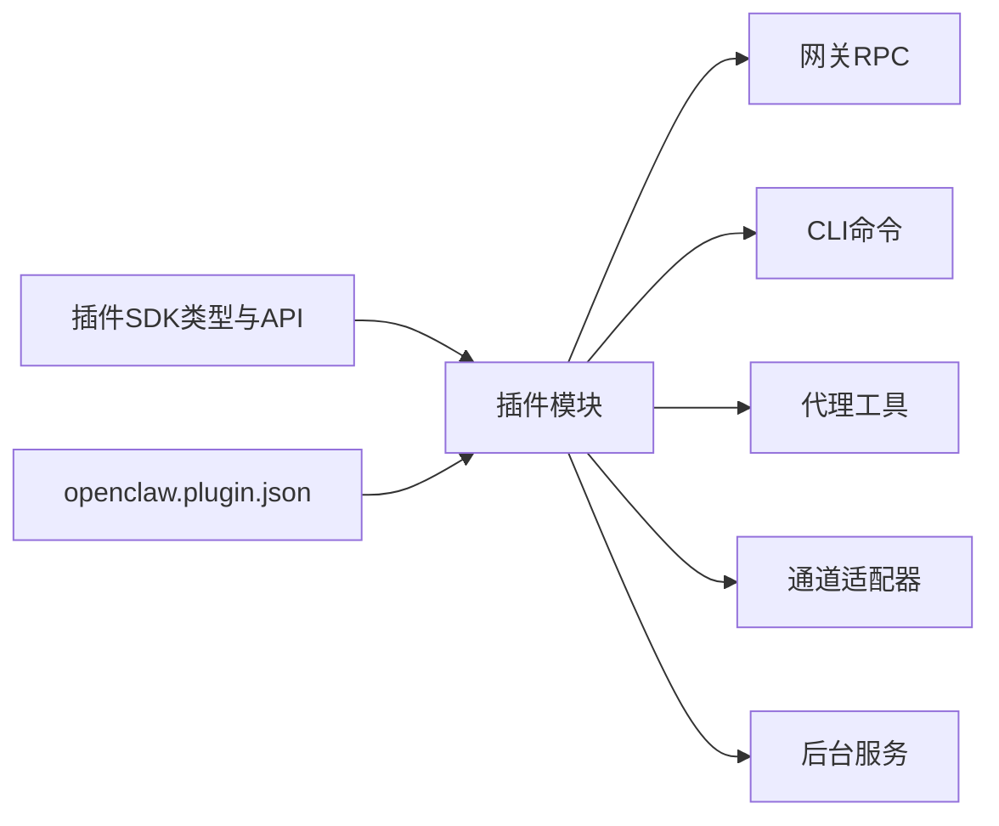

# 插件开发指南

<cite>
**本文引用的文件**
- [docs/plugins/manifest.md](file://docs/plugins/manifest.md)
- [docs/plugins/agent-tools.md](file://docs/plugins/agent-tools.md)
- [docs/tools/plugin.md](file://docs/tools/plugin.md)
- [extensions/voice-call/openclaw.plugin.json](file://extensions/voice-call/openclaw.plugin.json)
- [extensions/voice-call/package.json](file://extensions/voice-call/package.json)
- [extensions/voice-call/index.ts](file://extensions/voice-call/index.ts)
- [extensions/telegram/openclaw.plugin.json](file://extensions/telegram/openclaw.plugin.json)
- [extensions/discord/openclaw.plugin.json](file://extensions/discord/openclaw.plugin.json)
- [src/plugin-sdk/index.ts](file://src/plugin-sdk/index.ts)
</cite>

## 目录

1. [简介](#简介)
2. [项目结构](#项目结构)
3. [核心组件](#核心组件)
4. [架构总览](#架构总览)
5. [详细组件分析](#详细组件分析)
6. [依赖关系分析](#依赖关系分析)
7. [性能考虑](#性能考虑)
8. [故障排查指南](#故障排查指南)
9. [结论](#结论)
10. [附录](#附录)

## 简介

本指南面向希望在 OpenClaw 平台上开发插件（扩展）的开发者，覆盖从准备到发布的全流程：开发环境搭建、项目结构组织、插件清单文件编写与校验、API 接口与事件钩子使用、最佳实践与测试策略、调试技巧与常见问题，以及本地开发、打包构建与版本管理。

## 项目结构

OpenClaw 的插件生态由“官方插件仓库”“工作区扩展”“全局扩展”“内置扩展”四类来源构成，并通过统一的发现顺序加载。每个插件需在根目录提供清单文件以进行严格配置校验。

**图表来源**

- [docs/tools/plugin.md](file://docs/tools/plugin.md#L89-L121)

**章节来源**

- [docs/tools/plugin.md](file://docs/tools/plugin.md#L89-L121)

## 核心组件

- 插件清单（openclaw.plugin.json）
  - 必填字段：id、configSchema
  - 可选字段：kind、channels、providers、skills、name、description、uiHints、version
  - 清单用于在不执行代码的前提下完成配置校验，缺失或非法将阻断安装/启用
- 插件入口模块
  - 导出函数或对象，注册网关 RPC、CLI 命令、工具、通道适配器、后台服务等
- 插件 SDK
  - 提供注册 API、类型定义、运行时辅助能力（如 TTS）、HTTP 路由注册等

**章节来源**

- [docs/plugins/manifest.md](file://docs/plugins/manifest.md#L18-L46)
- [docs/tools/plugin.md](file://docs/tools/plugin.md#L301-L307)
- [src/plugin-sdk/index.ts](file://src/plugin-sdk/index.ts#L61-L78)

## 架构总览

下图展示了插件在 OpenClaw 中的生命周期与关键交互点：发现与加载、清单校验、注册 API、运行时调用链。

**图表来源**

- [docs/tools/plugin.md](file://docs/tools/plugin.md#L115-L121)
- [docs/plugins/manifest.md](file://docs/plugins/manifest.md#L11-L14)
- [src/plugin-sdk/index.ts](file://src/plugin-sdk/index.ts#L61-L78)

## 详细组件分析

### 插件清单（openclaw.plugin.json）详解

- 必填项
  - id：插件唯一标识，建议与包名或目录名一致
  - configSchema：内联 JSON Schema，用于严格配置校验
- 可选项
  - kind：插件类别（如 memory），用于分类与互斥槽位
  - channels/providers：声明该插件注册的通道/模型提供商 ID
  - skills：相对插件根目录的技能目录列表
  - name/description/uiHints/version：增强 UI 体验与信息展示
- 校验行为
  - 未知通道/插件 ID 视为错误
  - 安装但禁用的插件保留配置并告警
  - 缺失或损坏清单导致 Doctor 报错

**图表来源**

- [docs/plugins/manifest.md](file://docs/plugins/manifest.md#L53-L62)

**章节来源**

- [docs/plugins/manifest.md](file://docs/plugins/manifest.md#L18-L46)
- [docs/plugins/manifest.md](file://docs/plugins/manifest.md#L53-L62)

### 插件入口与注册 API

- 入口导出形式
  - 函数：接收 api 参数，内部调用 api.registerX 注册能力
  - 对象：包含 id/name/configSchema/register 方法
- 常见注册项
  - 网关 RPC 方法：api.registerGatewayMethod
  - CLI 子命令：api.registerCli
  - 代理工具：api.registerTool（含必选/可选工具）
  - 通道插件：api.registerChannel
  - 后台服务：api.registerService
  - 钩子：registerPluginHooksFromDir
- 运行时辅助
  - api.runtime 提供核心能力封装（如 TTS）

**图表来源**

- [src/plugin-sdk/index.ts](file://src/plugin-sdk/index.ts#L61-L78)
- [extensions/voice-call/index.ts](file://extensions/voice-call/index.ts#L143-L510)

**章节来源**

- [docs/tools/plugin.md](file://docs/tools/plugin.md#L301-L307)
- [docs/tools/plugin.md](file://docs/tools/plugin.md#L514-L513)
- [docs/tools/plugin.md](file://docs/tools/plugin.md#L524-L537)
- [docs/tools/plugin.md](file://docs/tools/plugin.md#L540-L555)
- [docs/tools/plugin.md](file://docs/tools/plugin.md#L599-L609)
- [docs/tools/plugin.md](file://docs/tools/plugin.md#L308-L328)
- [extensions/voice-call/index.ts](file://extensions/voice-call/index.ts#L143-L510)

### 代理工具（Agent Tools）

- 工具分为必选（默认可用）与可选（需白名单）
- 可选工具通过 allowlists 控制，支持按工具名、插件 id 或组粒度启用
- 工具参数使用 JSON Schema 定义，确保输入合法性与 UI 呈现

**图表来源**

- [docs/plugins/agent-tools.md](file://docs/plugins/agent-tools.md#L15-L17)
- [docs/plugins/agent-tools.md](file://docs/plugins/agent-tools.md#L65-L84)

**章节来源**

- [docs/plugins/agent-tools.md](file://docs/plugins/agent-tools.md#L19-L36)
- [docs/plugins/agent-tools.md](file://docs/plugins/agent-tools.md#L38-L63)
- [docs/plugins/agent-tools.md](file://docs/plugins/agent-tools.md#L86-L93)

### 通道插件（Channel Plugins）

- 通道插件在 channels.<id> 下维护配置，遵循插件定义的元数据与能力
- 示例：Telegram、Discord 插件在清单中声明 channels 列表

**图表来源**

- [docs/tools/plugin.md](file://docs/tools/plugin.md#L381-L424)
- [extensions/telegram/openclaw.plugin.json](file://extensions/telegram/openclaw.plugin.json#L1-L10)
- [extensions/discord/openclaw.plugin.json](file://extensions/discord/openclaw.plugin.json#L1-L10)

**章节来源**

- [docs/tools/plugin.md](file://docs/tools/plugin.md#L381-L424)
- [extensions/telegram/openclaw.plugin.json](file://extensions/telegram/openclaw.plugin.json#L1-L10)
- [extensions/discord/openclaw.plugin.json](file://extensions/discord/openclaw.plugin.json#L1-L10)

### 示例：语音通话插件（Voice Call）

- 清单要点
  - id、uiHints、configSchema 完整覆盖配置项
- 入口要点
  - 解析与校验配置、延迟初始化运行时、注册 RPC/工具/CLI/服务
- 关键 RPC
  - voicecall.start、voicecall.initiate、voicecall.continue、voicecall.speak、voicecall.end、voicecall.status
- 工具
  - voice_call：统一的电话操作工具，支持多种动作

**图表来源**

- [extensions/voice-call/openclaw.plugin.json](file://extensions/voice-call/openclaw.plugin.json#L1-L560)
- [extensions/voice-call/index.ts](file://extensions/voice-call/index.ts#L192-L345)
- [extensions/voice-call/index.ts](file://extensions/voice-call/index.ts#L347-L467)

**章节来源**

- [extensions/voice-call/openclaw.plugin.json](file://extensions/voice-call/openclaw.plugin.json#L1-L560)
- [extensions/voice-call/index.ts](file://extensions/voice-call/index.ts#L143-L510)

## 依赖关系分析

- 插件与 SDK
  - 插件通过 SDK 类型与注册 API 与核心解耦
- 插件与配置
  - 清单中的 configSchema 与 uiHints 决定 UI 表单与敏感字段标记
- 插件与通道
  - 通道插件通过 channels.<id> 组织配置，遵循各自能力模型

**图表来源**

- [src/plugin-sdk/index.ts](file://src/plugin-sdk/index.ts#L61-L78)
- [docs/tools/plugin.md](file://docs/tools/plugin.md#L301-L307)

**章节来源**

- [src/plugin-sdk/index.ts](file://src/plugin-sdk/index.ts#L61-L78)
- [docs/tools/plugin.md](file://docs/tools/plugin.md#L301-L307)

## 性能考虑

- 尽量延迟初始化运行时，仅在首次使用时创建
- 合理拆分工具与 RPC，避免单次调用承担过多职责
- 使用缓存与最小化网络往返，减少对第三方提供商的依赖
- 在工具与 RPC 中尽早返回错误，避免无效计算

## 故障排查指南

- 清单校验失败
  - 检查 id 与 configSchema 是否完整
  - 确认 channels/providers/skills 等字段与实际导出一致
- 配置错误
  - 使用 Doctor 命令定位具体字段与错误原因
  - 通过 uiHints 优化 UI 提示，降低误配率
- 运行时异常
  - 查看网关日志，确认插件是否成功加载与注册
  - 对于 RPC/工具，检查参数与返回值格式
- 通道/提供商问题
  - 核对 channels.<id> 配置与提供商凭据
  - 确认网络连通性与签名验证开关

**章节来源**

- [docs/plugins/manifest.md](file://docs/plugins/manifest.md#L53-L62)
- [docs/tools/plugin.md](file://docs/tools/plugin.md#L299-L300)

## 结论

OpenClaw 的插件体系以“清单驱动 + 严格校验 + 明确注册 API”为核心，既保证了安全性与一致性，也为开发者提供了强大的扩展能力。遵循本文档的结构、规范与最佳实践，可高效完成从零到一的插件开发与发布。

## 附录

### 开发环境搭建与项目结构

- 本地开发
  - 在工作区或全局扩展目录放置插件源码与 openclaw.plugin.json
  - 使用 Doctor 检查清单与配置
- 包管理与分发
  - 推荐将插件作为独立 npm 包，使用 openclaw.extensions 指向入口文件
  - 官方插件命名空间为 @openclaw/\*
- 版本管理
  - 使用语义化版本，更新 package.json 中的版本号
  - 发布前确保清单与入口导出一致

**章节来源**

- [docs/tools/plugin.md](file://docs/tools/plugin.md#L623-L636)
- [extensions/voice-call/package.json](file://extensions/voice-call/package.json#L1-L20)

### 最佳实践与代码规范

- 清单优先：先完善 openclaw.plugin.json，再实现功能
- 参数安全：使用 JSON Schema 限制输入范围与类型
- UI 友好：为敏感字段与高级选项提供 uiHints
- 分层设计：将复杂逻辑拆分为运行时、配置解析、工具与 RPC 层
- 测试先行：为工具、RPC 与配置解析编写单元/集成测试

### 调试技巧

- 使用 openclaw plugins doctor 检查插件健康状况
- 通过 openclaw plugins list/info 查看已加载插件与详情
- 在入口中添加必要日志，定位初始化与运行时问题
- 对于通道插件，逐步验证账户解析与出站发送
