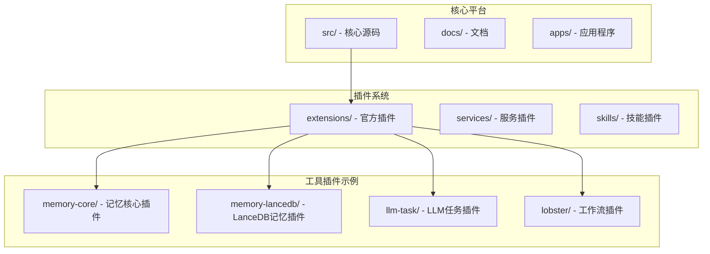
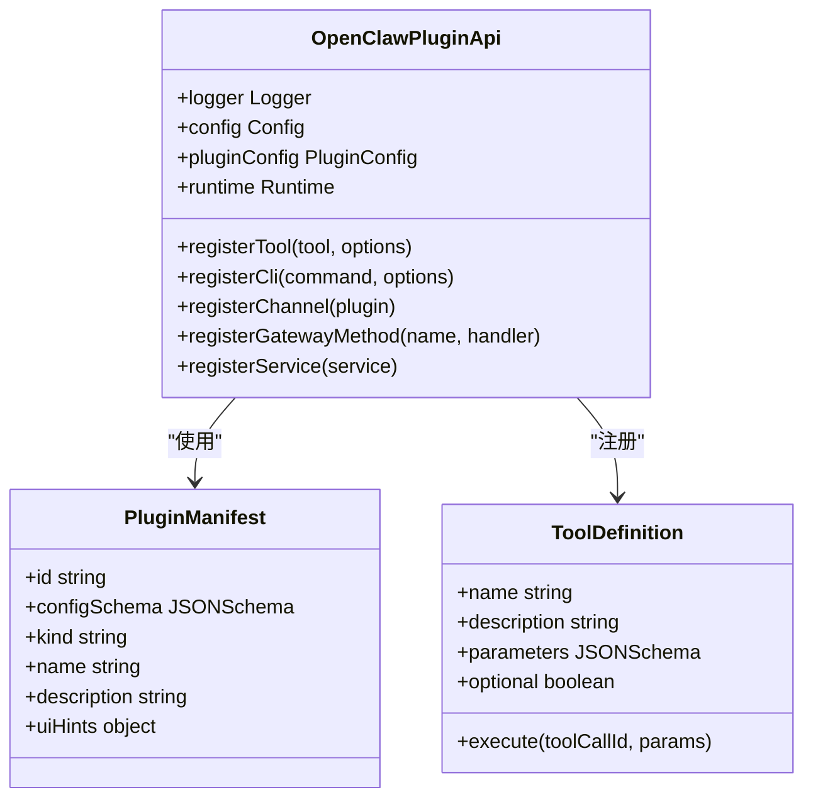
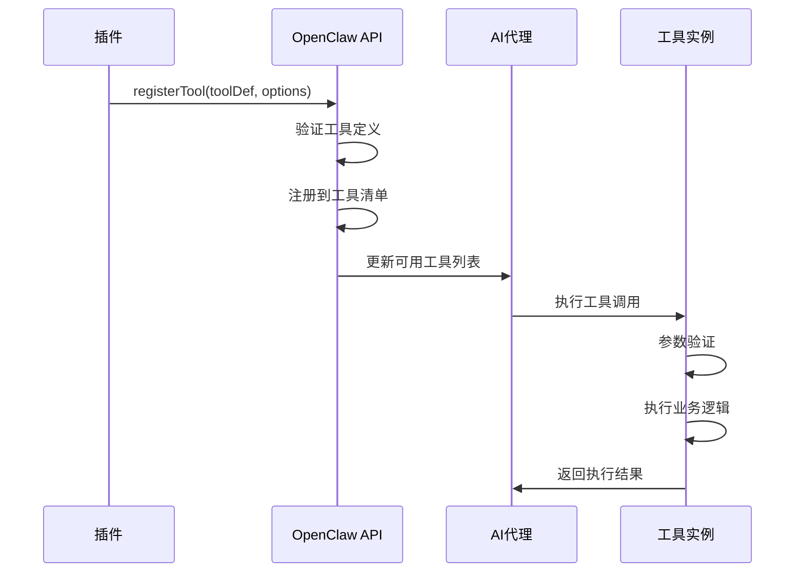
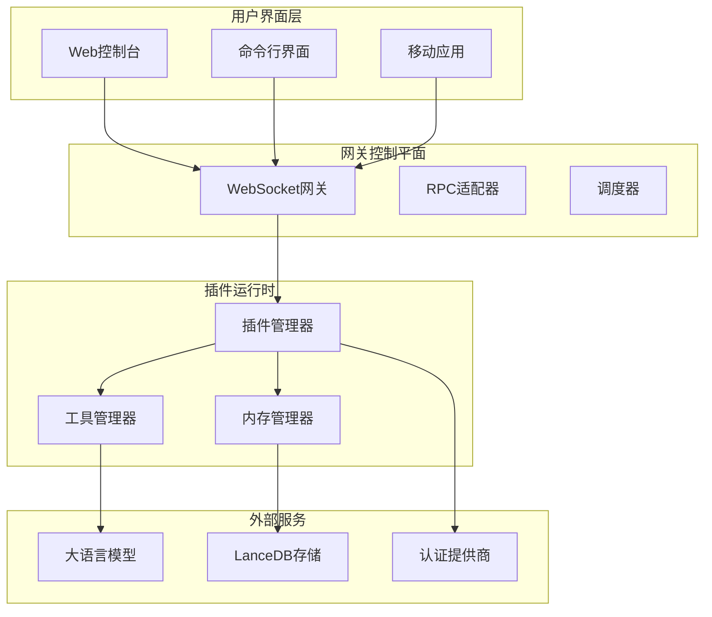
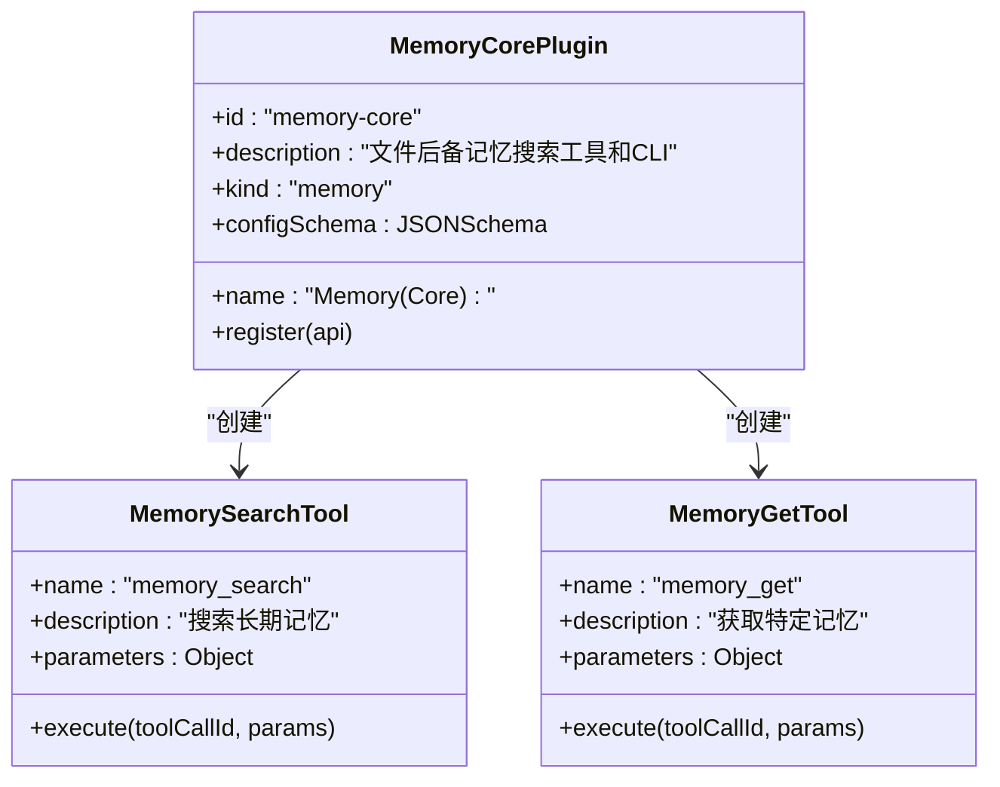
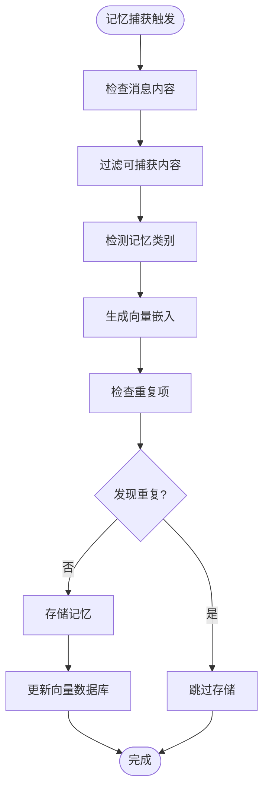
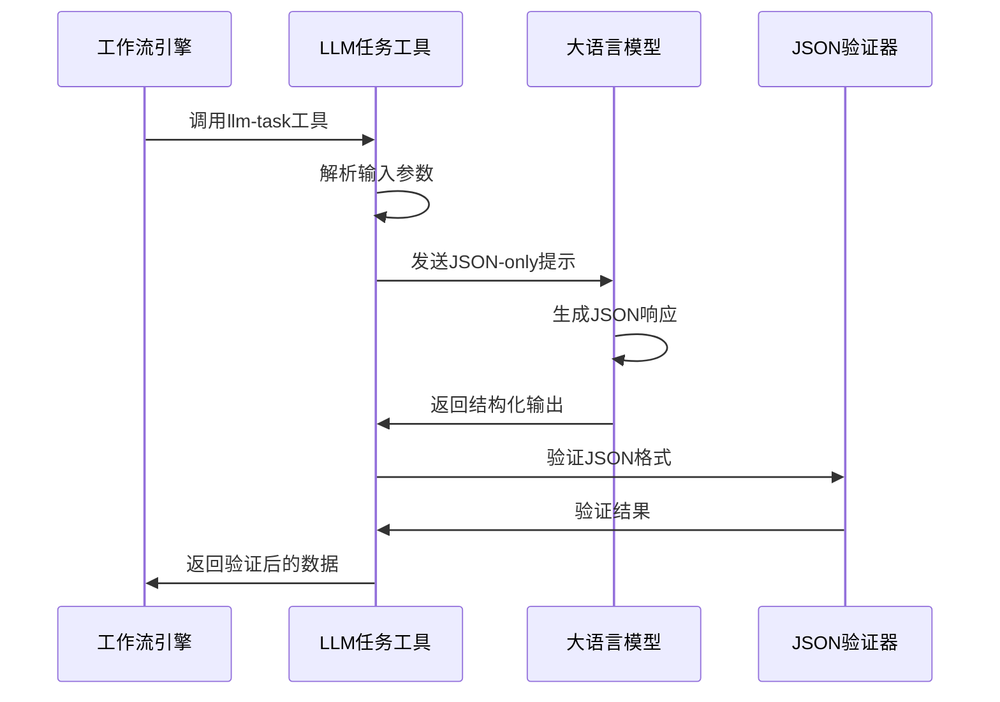
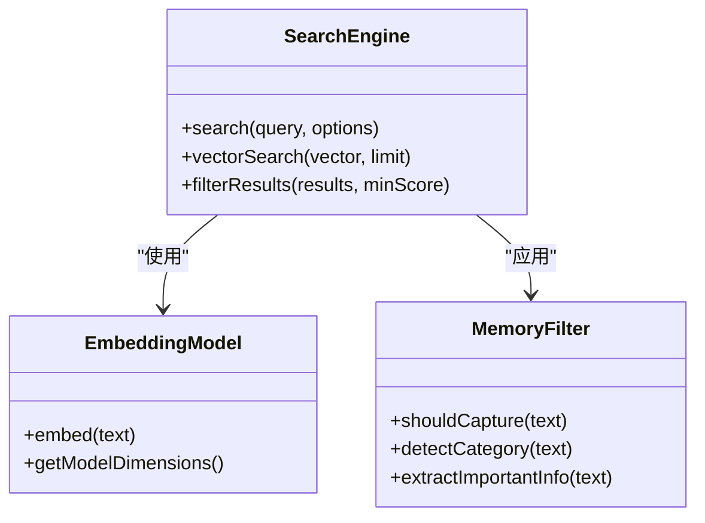
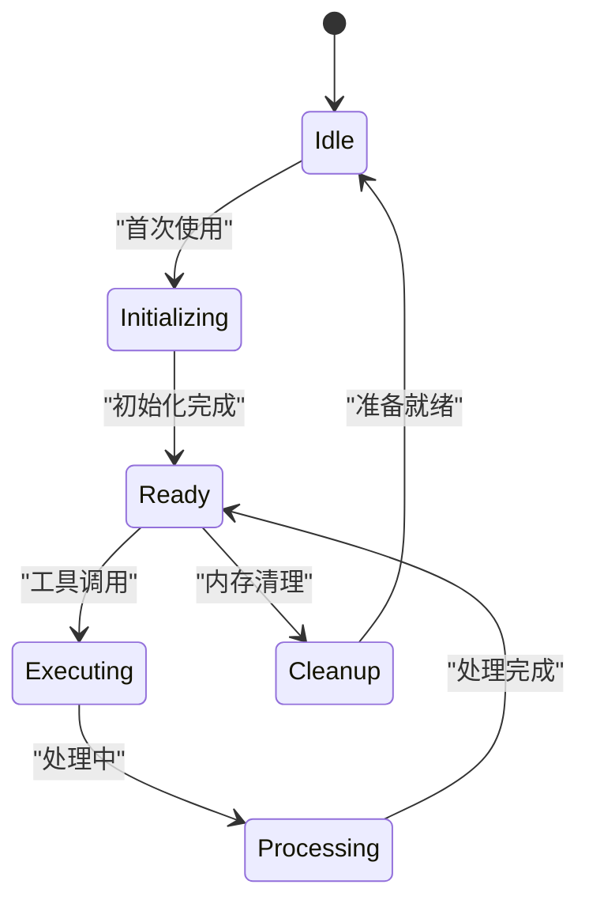

# AI工具插件示例

<cite>
**本文档引用的文件**
- [README.md](file://README.md)
- [agent-tools.md](file://docs/plugins/agent-tools.md)
- [plugin.md](file://docs/tools/plugin.md)
- [llm-task.md](file://docs/tools/llm-task.md)
- [skills.md](file://docs/tools/skills.md)
- [tools.md](file://docs/tools/index.md)
- [manifest.md](file://docs/plugins/manifest.md)
- [memory-core/index.ts](file://extensions/memory-core/index.ts)
- [memory-lancedb/index.ts](file://extensions/memory-lancedb/index.ts)
- [llm-task/index.ts](file://extensions/llm-task/index.ts)
- [memory-core/openclaw.plugin.json](file://extensions/memory-core/openclaw.plugin.json)
- [memory-lancedb/openclaw.plugin.json](file://extensions/memory-lancedb/openclaw.plugin.json)
- [llm-task/openclaw.plugin.json](file://extensions/llm-task/openclaw.plugin.json)
</cite>

## 目录

1. [简介](#简介)
2. [项目结构](#项目结构)
3. [核心组件](#核心组件)
4. [架构概览](#架构概览)
5. [详细组件分析](#详细组件分析)
6. [依赖关系分析](#依赖关系分析)
7. [性能考虑](#性能考虑)
8. [故障排除指南](#故障排除指南)
9. [结论](#结论)
10. [附录](#附录)

## 简介

OpenClaw AI工具插件开发是一个强大的扩展框架，允许开发者创建各种AI代理工具插件，包括记忆管理插件、LLM任务插件和智能搜索插件等。本指南将深入解析AI工具插件的设计模式，涵盖工具定义、参数验证、执行流程和结果处理等关键环节。

OpenClaw提供了完整的插件生态系统，支持从零开始构建AI工具插件，包括插件注册、生命周期管理和性能监控等内容。通过与Pi Agent Core的深度集成，开发者可以实现工具调用的最佳实践。

## 项目结构

OpenClaw项目采用模块化架构，主要包含以下关键目录：



**图表来源**

- [README.md](file://README.md#L1-L550)
- [plugin.md](file://docs/tools/plugin.md#L1-L665)

**章节来源**

- [README.md](file://README.md#L1-L550)
- [plugin.md](file://docs/tools/plugin.md#L1-L665)

## 核心组件

### 插件API架构

OpenClaw插件系统基于统一的API接口设计，支持多种插件类型：



**图表来源**

- [plugin.md](file://docs/tools/plugin.md#L301-L321)
- [manifest.md](file://docs/plugins/manifest.md#L18-L46)

### 工具注册机制

插件通过标准化的工具注册流程，将功能暴露给AI代理：



**图表来源**

- [agent-tools.md](file://docs/plugins/agent-tools.md#L24-L36)
- [plugin.md](file://docs/tools/plugin.md#L514-L522)

**章节来源**

- [agent-tools.md](file://docs/plugins/agent-tools.md#L1-L100)
- [plugin.md](file://docs/tools/plugin.md#L301-L321)

## 架构概览

OpenClaw的AI工具插件架构采用分层设计，确保了高度的可扩展性和安全性：



**图表来源**

- [README.md](file://README.md#L180-L250)
- [plugin.md](file://docs/tools/plugin.md#L9-L71)

## 详细组件分析

### 记忆管理插件

#### Memory Core 插件

Memory Core插件提供了基础的记忆搜索和获取功能：



**图表来源**

- [memory-core/index.ts](file://extensions/memory-core/index.ts#L4-L39)

#### Memory LanceDB 插件

LanceDB插件提供了高级的向量搜索和自动记忆捕获功能：



**图表来源**

- [memory-lancedb/index.ts](file://extensions/memory-lancedb/index.ts#L197-L236)
- [memory-lancedb/index.ts](file://extensions/memory-lancedb/index.ts#L572-L598)

**章节来源**

- [memory-core/index.ts](file://extensions/memory-core/index.ts#L1-L39)
- [memory-lancedb/index.ts](file://extensions/memory-lancedb/index.ts#L1-L627)

### LLM任务插件

LLM Task插件提供了结构化的JSON-only LLM任务执行能力：



**图表来源**

- [llm-task/index.ts](file://extensions/llm-task/index.ts#L1-L7)
- [llm-task.md](file://docs/tools/llm-task.md#L71-L87)

**章节来源**

- [llm-task/index.ts](file://extensions/llm-task/index.ts#L1-L7)
- [llm-task.md](file://docs/tools/llm-task.md#L1-L116)

### 智能搜索插件

智能搜索插件集成了多种搜索能力和向量相似度匹配：



**图表来源**

- [memory-lancedb/index.ts](file://extensions/memory-lancedb/index.ts#L162-L179)
- [memory-lancedb/index.ts](file://extensions/memory-lancedb/index.ts#L185-L236)

**章节来源**

- [memory-lancedb/index.ts](file://extensions/memory-lancedb/index.ts#L158-L236)

## 依赖关系分析

OpenClaw插件系统具有清晰的依赖层次结构：

```mermaid
graph TB
subgraph "核心依赖"
Core[OpenClaw Core]
PluginSDK[Plugin SDK]
TypeBox[TypeBox Schema]
end
subgraph "插件依赖"
LanceDB[@lancedb/lancedb]
OpenAI[openai]
Crypto[node:crypto]
end
subgraph "工具依赖"
Browser[浏览器控制]
Canvas[画布渲染]
Nodes[节点管理]
end
Core --> PluginSDK
PluginSDK --> TypeBox
MemoryLanceDB --> LanceDB
MemoryLanceDB --> OpenAI
MemoryLanceDB --> Crypto
Browser --> Core
Canvas --> Core
Nodes --> Core
```

**图表来源**

- [memory-lancedb/index.ts](file://extensions/memory-lancedb/index.ts#L9-L19)
- [plugin.md](file://docs/tools/plugin.md#L651-L665)

**章节来源**

- [memory-lancedb/index.ts](file://extensions/memory-lancedb/index.ts#L1-L627)
- [plugin.md](file://docs/tools/plugin.md#L651-L665)

## 性能考虑

### 内存管理优化

OpenClaw插件系统在内存管理方面采用了多项优化策略：

1. **延迟初始化**: LanceDB数据库采用延迟初始化，减少启动时间
2. **向量维度缓存**: 缓存嵌入模型的向量维度信息
3. **连接池管理**: 复用数据库连接，避免频繁建立连接
4. **内存回收**: 及时清理向量数据，防止内存泄漏

### 并发处理

插件系统支持并发执行多个工具调用：



**图表来源**

- [memory-lancedb/index.ts](file://extensions/memory-lancedb/index.ts#L68-L78)

### 性能监控

插件系统提供了完整的性能监控机制：

- **执行时间统计**: 记录每个工具的执行时间
- **内存使用监控**: 跟踪插件的内存占用情况
- **错误率统计**: 监控工具调用的成功率
- **资源使用报告**: 提供详细的资源使用分析

## 故障排除指南

### 常见问题诊断

#### 插件加载失败

当插件无法正常加载时，检查以下要点：

1. **插件清单验证**: 确保`openclaw.plugin.json`文件完整且格式正确
2. **配置Schema验证**: 检查插件配置是否符合JSON Schema要求
3. **依赖包安装**: 确认所有必需的npm依赖已正确安装
4. **权限设置**: 验证插件是否有足够的文件系统访问权限

#### 工具调用异常

工具调用失败的常见原因：

1. **参数验证失败**: 检查工具参数是否符合TypeBox定义
2. **外部服务不可用**: 验证相关API服务的可用性
3. **认证配置错误**: 确认API密钥和认证信息正确
4. **网络连接问题**: 检查防火墙和代理设置

#### 内存插件问题

LanceDB内存插件的特殊注意事项：

1. **原生模块编译**: 某些平台可能需要手动编译原生模块
2. **数据库路径权限**: 确保数据库文件夹有写入权限
3. **向量维度匹配**: 验证嵌入模型与数据库向量维度一致
4. **磁盘空间检查**: 确保有足够的磁盘空间存储向量数据

**章节来源**

- [manifest.md](file://docs/plugins/manifest.md#L53-L63)
- [plugin.md](file://docs/tools/plugin.md#L651-L665)

## 结论

OpenClaw AI工具插件开发提供了一个强大而灵活的框架，支持开发者创建各种类型的AI代理工具。通过标准化的插件API、严格的配置验证和完善的性能监控，OpenClaw确保了插件系统的稳定性和可维护性。

### 主要优势

1. **模块化设计**: 清晰的插件架构支持独立开发和测试
2. **类型安全**: 使用TypeBox进行参数验证，确保运行时安全
3. **可扩展性**: 支持自定义工具、CLI命令和网关方法
4. **性能优化**: 内置缓存、连接池和内存管理机制
5. **安全保障**: 插件在受信任环境中运行，支持沙箱隔离

### 最佳实践建议

1. **遵循命名约定**: 使用小驼峰命名法定义工具名称
2. **完善错误处理**: 实现全面的异常处理和回退机制
3. **性能监控**: 集成性能指标收集和告警机制
4. **文档编写**: 提供详细的使用说明和配置示例
5. **测试覆盖**: 确保插件有充分的单元测试和集成测试

通过遵循这些指导原则，开发者可以创建高质量的AI工具插件，为OpenClaw生态系统增添更多价值。

## 附录

### 快速开始指南

创建新插件的基本步骤：

1. **创建插件目录**: 在`extensions/`下创建新的插件文件夹
2. **编写插件清单**: 创建`openclaw.plugin.json`文件
3. **实现插件逻辑**: 在`index.ts`中实现插件功能
4. **注册工具**: 使用`api.registerTool()`注册AI工具
5. **配置验证**: 确保配置Schema完整且有效
6. **测试插件**: 运行插件测试并验证功能
7. **部署插件**: 将插件安装到OpenClaw环境中

### 配置参考

插件配置的关键字段：

- **id**: 插件唯一标识符
- **name**: 插件显示名称
- **description**: 插件功能描述
- **configSchema**: JSON Schema配置定义
- **kind**: 插件类型（如"memory"）
- **uiHints**: UI显示配置

### 开发工具

推荐的开发工具和环境：

- **TypeScript**: 插件开发语言
- **Node.js**: 运行时环境（版本≥22）
- **pnpm**: 包管理器
- **VS Code**: 开发IDE
- **ESLint**: 代码质量检查
- **Jest**: 单元测试框架
