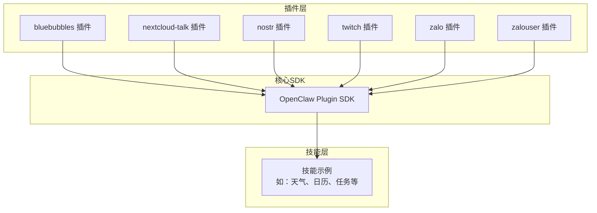
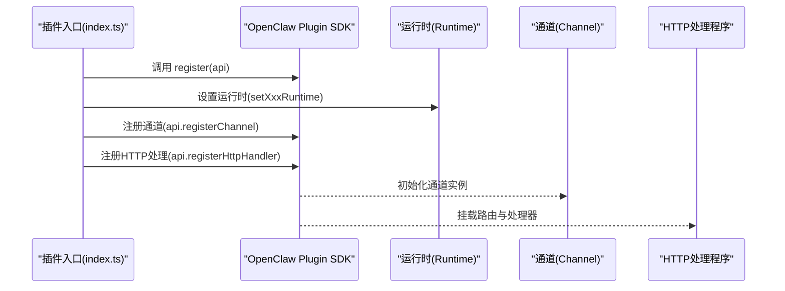
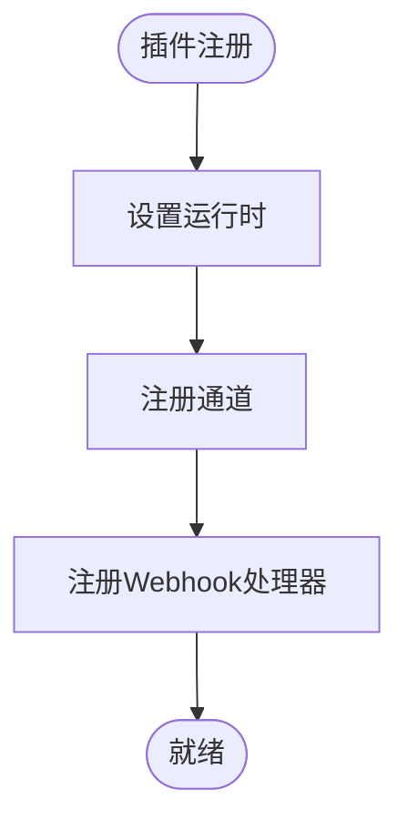
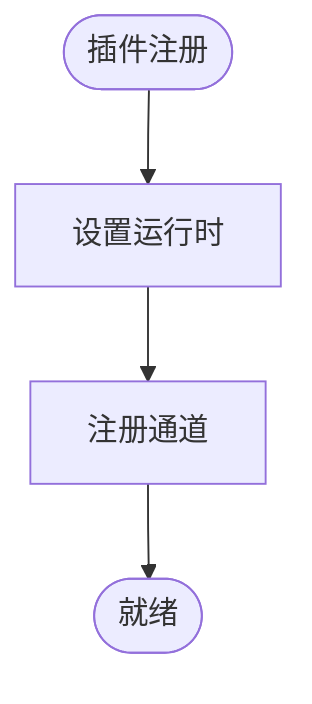
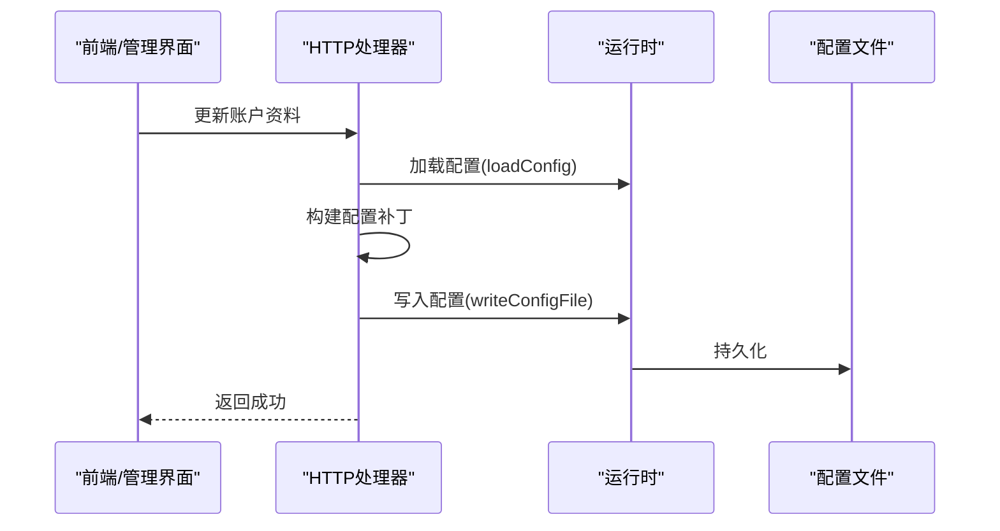
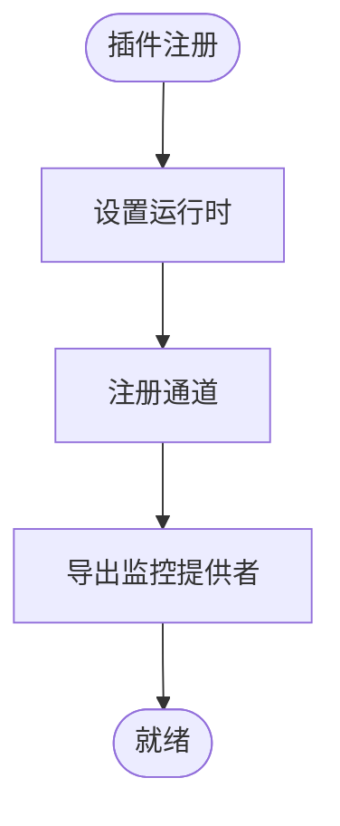
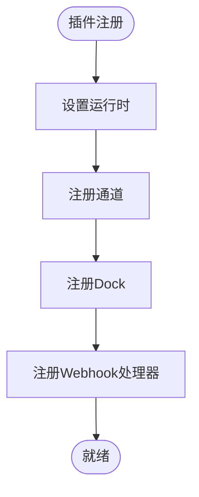
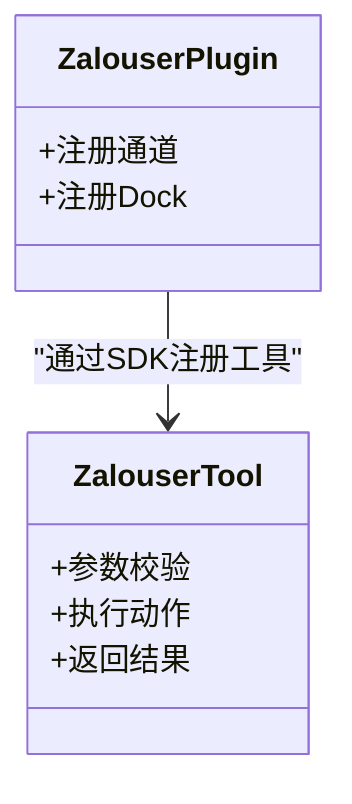
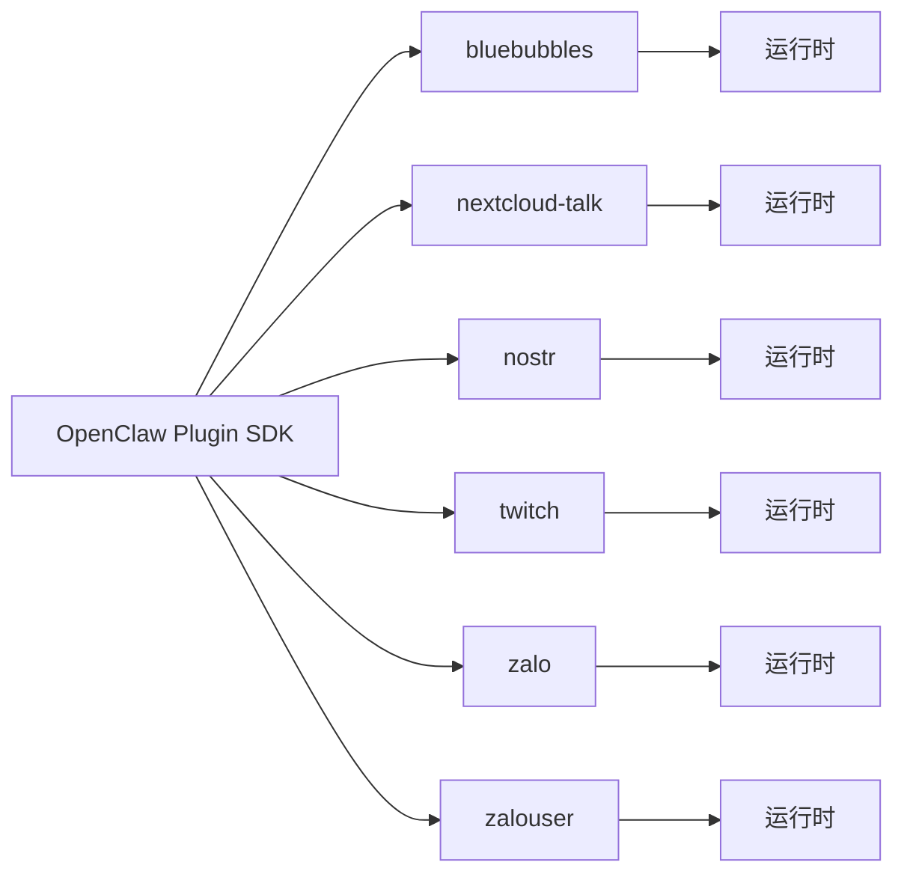

# 技能相关插件示例

<cite>
**本文引用的文件**
- [extensions/bluebubbles/openclaw.plugin.json](file://extensions/bluebubbles/openclaw.plugin.json)
- [extensions/bluebubbles/index.ts](file://extensions/bluebubbles/index.ts)
- [extensions/nextcloud-talk/openclaw.plugin.json](file://extensions/nextcloud-talk/openclaw.plugin.json)
- [extensions/nextcloud-talk/index.ts](file://extensions/nextcloud-talk/index.ts)
- [extensions/nostr/openclaw.plugin.json](file://extensions/nostr/openclaw.plugin.json)
- [extensions/nostr/index.ts](file://extensions/nostr/index.ts)
- [extensions/twitch/openclaw.plugin.json](file://extensions/twitch/openclaw.plugin.json)
- [extensions/twitch/index.ts](file://extensions/twitch/index.ts)
- [extensions/zalo/openclaw.plugin.json](file://extensions/zalo/openclaw.plugin.json)
- [extensions/zalo/index.ts](file://extensions/zalo/index.ts)
- [extensions/zalouser/openclaw.plugin.json](file://extensions/zalouser/openclaw.plugin.json)
- [extensions/zalouser/index.ts](file://extensions/zalouser/index.ts)
</cite>

## 目录

1. [简介](#简介)
2. [项目结构](#项目结构)
3. [核心组件](#核心组件)
4. [架构总览](#架构总览)
5. [详细组件分析](#详细组件分析)
6. [依赖关系分析](#依赖关系分析)
7. [性能考虑](#性能考虑)
8. [故障排除指南](#故障排除指南)
9. [结论](#结论)
10. [附录](#附录)

## 简介

本文件面向希望在OpenClaw平台上开发“技能相关插件”的开发者，系统性地展示如何基于现有插件（BlueBubbles消息桥接、Nextcloud Talk集成、Nostr社交网络、Twitch直播、Zalo通讯）进行二次开发与集成。内容覆盖插件架构设计、功能扩展、配置管理、用户界面集成以及工作流自动化等核心能力，并提供可直接参考的实现路径与最佳实践。

## 项目结构

OpenClaw采用“插件化+技能化”的分层组织方式：

- 插件层：位于extensions目录下，每个子目录代表一个独立插件，包含入口index.ts、插件元数据openclaw.plugin.json以及具体实现源码。
- 技能层：位于skills目录下，以“技能”为单位组织业务逻辑，通常通过工具调用或通道桥接实现对外部系统的访问。
- 核心SDK：通过统一的插件SDK接口注册通道、HTTP处理程序、工具等。

图表来源

- [extensions/bluebubbles/index.ts](file://extensions/bluebubbles/index.ts#L1-L20)
- [extensions/nextcloud-talk/index.ts](file://extensions/nextcloud-talk/index.ts#L1-L18)
- [extensions/nostr/index.ts](file://extensions/nostr/index.ts#L1-L69)
- [extensions/twitch/index.ts](file://extensions/twitch/index.ts#L1-L21)
- [extensions/zalo/index.ts](file://extensions/zalo/index.ts#L1-L20)
- [extensions/zalouser/index.ts](file://extensions/zalouser/index.ts#L1-L32)

章节来源

- [extensions/bluebubbles/index.ts](file://extensions/bluebubbles/index.ts#L1-L20)
- [extensions/nextcloud-talk/index.ts](file://extensions/nextcloud-talk/index.ts#L1-L18)
- [extensions/nostr/index.ts](file://extensions/nostr/index.ts#L1-L69)
- [extensions/twitch/index.ts](file://extensions/twitch/index.ts#L1-L21)
- [extensions/zalo/index.ts](file://extensions/zalo/index.ts#L1-L20)
- [extensions/zalouser/index.ts](file://extensions/zalouser/index.ts#L1-L32)

## 核心组件

- 插件入口与注册
  - 所有插件均通过index.ts导出标准插件对象，包含id、name、description、configSchema以及register函数。
  - register函数中完成运行时设置、通道注册、HTTP处理程序注册等。
- 插件元数据
  - openclaw.plugin.json定义插件标识、支持的通道列表以及配置模式。
- 典型职责划分
  - BlueBubbles：注册通道与HTTP Webhook处理器，用于接收外部推送并转发到OpenClaw会话。
  - Nextcloud Talk：注册通道，对接Nextcloud Talk服务端。
  - Nostr：注册通道与HTTP处理器，支持账户资料管理与Relay信息查询。
  - Twitch：注册通道，提供直播监控能力。
  - Zalo：注册通道与Dock（UI集成），并注册HTTP Webhook处理器。
  - Zalo个人版（zalouser）：注册通道与Dock，并额外注册Agent工具，允许智能体直接调用Zalo个人账号能力。

章节来源

- [extensions/bluebubbles/openclaw.plugin.json](file://extensions/bluebubbles/openclaw.plugin.json#L1-L10)
- [extensions/bluebubbles/index.ts](file://extensions/bluebubbles/index.ts#L7-L17)
- [extensions/nextcloud-talk/openclaw.plugin.json](file://extensions/nextcloud-talk/openclaw.plugin.json#L1-L10)
- [extensions/nextcloud-talk/index.ts](file://extensions/nextcloud-talk/index.ts#L6-L15)
- [extensions/nostr/openclaw.plugin.json](file://extensions/nostr/openclaw.plugin.json#L1-L10)
- [extensions/nostr/index.ts](file://extensions/nostr/index.ts#L9-L66)
- [extensions/twitch/openclaw.plugin.json](file://extensions/twitch/openclaw.plugin.json#L1-L10)
- [extensions/twitch/index.ts](file://extensions/twitch/index.ts#L8-L18)
- [extensions/zalo/openclaw.plugin.json](file://extensions/zalo/openclaw.plugin.json#L1-L10)
- [extensions/zalo/index.ts](file://extensions/zalo/index.ts#L7-L17)
- [extensions/zalouser/openclaw.plugin.json](file://extensions/zalouser/openclaw.plugin.json#L1-L10)
- [extensions/zalouser/index.ts](file://extensions/zalouser/index.ts#L7-L29)

## 架构总览

OpenClaw插件体系遵循“通道+工具+HTTP处理”的组合模式：

- 通道（Channel）：负责与外部系统建立连接，将消息/事件映射为OpenClaw内部消息。
- 工具（Tool）：为智能体提供可执行的操作，如发送消息、查询好友、获取状态等。
- HTTP处理：用于Webhook回调、配置更新、UI交互等场景。
- 运行时（Runtime）：贯穿插件生命周期，提供配置读写、日志、网络等基础设施。

图表来源

- [extensions/bluebubbles/index.ts](file://extensions/bluebubbles/index.ts#L12-L16)
- [extensions/nextcloud-talk/index.ts](file://extensions/nextcloud-talk/index.ts#L11-L14)
- [extensions/nostr/index.ts](file://extensions/nostr/index.ts#L14-L65)
- [extensions/twitch/index.ts](file://extensions/twitch/index.ts#L13-L16)
- [extensions/zalo/index.ts](file://extensions/zalo/index.ts#L12-L16)
- [extensions/zalouser/index.ts](file://extensions/zalouser/index.ts#L12-L28)

## 详细组件分析

### BlueBubbles 插件

- 功能定位：macOS平台的BlueBubbles应用桥接，支持消息通道与Webhook回调。
- 关键点
  - 注册通道与HTTP Webhook处理器，实现从外部服务到OpenClaw会话的消息流转。
  - 使用空配置模式，便于快速上线与后续扩展。
- 开发要点
  - 在register中设置运行时后，确保通道与HTTP处理器正确初始化。
  - Webhook请求需校验来源与签名，保证安全性。

图表来源

- [extensions/bluebubbles/index.ts](file://extensions/bluebubbles/index.ts#L12-L16)

章节来源

- [extensions/bluebubbles/openclaw.plugin.json](file://extensions/bluebubbles/openclaw.plugin.json#L1-L10)
- [extensions/bluebubbles/index.ts](file://extensions/bluebubbles/index.ts#L1-L20)

### Nextcloud Talk 插件

- 功能定位：桥接Nextcloud Talk服务，提供群组/私聊消息通道。
- 关键点
  - 仅注册通道，适合服务端直连场景。
  - 配置模式为空，简化部署。
- 开发要点
  - 通道实现需处理Nextcloud Talk的认证与消息格式。
  - 如需Webhook，可在后续扩展中添加HTTP处理程序。

图表来源

- [extensions/nextcloud-talk/index.ts](file://extensions/nextcloud-talk/index.ts#L11-L14)

章节来源

- [extensions/nextcloud-talk/openclaw.plugin.json](file://extensions/nextcloud-talk/openclaw.plugin.json#L1-L10)
- [extensions/nextcloud-talk/index.ts](file://extensions/nextcloud-talk/index.ts#L1-L18)

### Nostr 插件

- 功能定位：通过NIP-04实现私信通道，并提供账户资料管理HTTP接口。
- 关键点
  - 注册通道与HTTP处理器，支持动态更新账户资料与查询账户信息。
  - 通过运行时配置加载与写入，实现配置持久化。
- 开发要点
  - HTTP处理器需严格校验请求参数与账户权限。
  - 账户资料更新应原子化写入，避免部分更新导致配置不一致。

图表来源

- [extensions/nostr/index.ts](file://extensions/nostr/index.ts#L18-L65)

章节来源

- [extensions/nostr/openclaw.plugin.json](file://extensions/nostr/openclaw.plugin.json#L1-L10)
- [extensions/nostr/index.ts](file://extensions/nostr/index.ts#L1-L69)

### Twitch 插件

- 功能定位：Twitch直播相关通道与监控能力。
- 关键点
  - 注册通道，提供直播状态、弹幕等事件接入。
  - 提供监控提供者导出，便于在其他模块复用。
- 开发要点
  - 通道实现需处理Twitch API的鉴权与事件订阅。
  - 监控逻辑建议异步化，避免阻塞主流程。

图表来源

- [extensions/twitch/index.ts](file://extensions/twitch/index.ts#L13-L18)

章节来源

- [extensions/twitch/openclaw.plugin.json](file://extensions/twitch/openclaw.plugin.json#L1-L10)
- [extensions/twitch/index.ts](file://extensions/twitch/index.ts#L1-L21)

### Zalo 插件

- 功能定位：Bot API消息通道，支持Webhook回调与Dock UI集成。
- 关键点
  - 同时注册通道与Dock，便于在网关与UI中展示。
  - 提供HTTP Webhook处理器，接收来自Zalo平台的推送。
- 开发要点
  - Webhook验证与幂等处理至关重要，防止重复消息。
  - Dock需提供简洁的会话概览与操作入口。

图表来源

- [extensions/zalo/index.ts](file://extensions/zalo/index.ts#L12-L16)

章节来源

- [extensions/zalo/openclaw.plugin.json](file://extensions/zalo/openclaw.plugin.json#L1-L10)
- [extensions/zalo/index.ts](file://extensions/zalo/index.ts#L1-L20)

### Zalo个人版（zalouser）插件

- 功能定位：通过zca-cli接入Zalo个人账号，提供Agent工具与通道。
- 关键点
  - 注册通道/Dock用于网关与UI集成。
  - 注册Agent工具，支持发送文本/图片/链接，查询好友/群组/个人信息等。
- 开发要点
  - 工具参数需严格校验，避免越权操作。
  - 工具执行结果需标准化返回，便于上层消费。

图表来源

- [extensions/zalouser/index.ts](file://extensions/zalouser/index.ts#L17-L28)

章节来源

- [extensions/zalouser/openclaw.plugin.json](file://extensions/zalouser/openclaw.plugin.json#L1-L10)
- [extensions/zalouser/index.ts](file://extensions/zalouser/index.ts#L1-L32)

## 依赖关系分析

- 统一SDK接口：所有插件通过相同的OpenClaw Plugin SDK进行注册与交互，降低耦合度。
- 运行时依赖：各插件在register阶段设置运行时，确保配置、日志、网络等能力可用。
- 外部系统依赖：不同插件依赖不同的外部服务（BlueBubbles、Nextcloud Talk、Nostr、Twitch、Zalo），需按各自协议实现通道与HTTP处理。

图表来源

- [extensions/bluebubbles/index.ts](file://extensions/bluebubbles/index.ts#L12-L16)
- [extensions/nextcloud-talk/index.ts](file://extensions/nextcloud-talk/index.ts#L11-L14)
- [extensions/nostr/index.ts](file://extensions/nostr/index.ts#L14-L16)
- [extensions/twitch/index.ts](file://extensions/twitch/index.ts#L13-L16)
- [extensions/zalo/index.ts](file://extensions/zalo/index.ts#L12-L16)
- [extensions/zalouser/index.ts](file://extensions/zalouser/index.ts#L12-L15)

章节来源

- [extensions/bluebubbles/index.ts](file://extensions/bluebubbles/index.ts#L1-L20)
- [extensions/nextcloud-talk/index.ts](file://extensions/nextcloud-talk/index.ts#L1-L18)
- [extensions/nostr/index.ts](file://extensions/nostr/index.ts#L1-L69)
- [extensions/twitch/index.ts](file://extensions/twitch/index.ts#L1-L21)
- [extensions/zalo/index.ts](file://extensions/zalo/index.ts#L1-L20)
- [extensions/zalouser/index.ts](file://extensions/zalouser/index.ts#L1-L32)

## 性能考虑

- 异步处理：通道与HTTP处理尽量使用异步I/O，避免阻塞主线程。
- 幂等性：Webhook与工具调用需具备幂等能力，防止重复触发。
- 缓存与批处理：对频繁查询的资源（如好友列表、群组列表）进行缓存；对批量操作进行合并。
- 超时与重试：对外部API调用设置合理超时与指数退避重试策略。
- 日志与指标：记录关键路径耗时与错误率，便于定位瓶颈。

## 故障排除指南

- 插件未生效
  - 检查openclaw.plugin.json中的id与channels是否正确。
  - 确认register函数已调用且无抛错。
- 通道无法接收消息
  - 校验外部服务的回调地址与签名验证逻辑。
  - 查看运行时日志，确认通道初始化成功。
- HTTP处理异常
  - 确认路由挂载与中间件顺序。
  - 对请求参数进行严格校验，避免类型错误。
- 配置更新失败
  - 检查配置文件权限与磁盘空间。
  - 确保写入是原子性的，必要时使用临时文件再替换。

## 结论

通过对BlueBubbles、Nextcloud Talk、Nostr、Twitch、Zalo及Zalo个人版插件的分析，可以总结出OpenClaw技能插件的通用开发范式：以通道为核心接入外部系统，结合HTTP处理与Agent工具实现工作流自动化，并通过统一SDK与运行时保障稳定性与可维护性。开发者可据此快速扩展新的技能插件，实现从配置管理到UI集成的全链路能力。

## 附录

- 开发清单
  - 完成openclaw.plugin.json元数据与配置模式定义。
  - 实现index.ts插件入口，注册通道与HTTP处理。
  - 在register中设置运行时，确保配置与日志可用。
  - 如需UI集成，提供Dock并完善用户交互。
  - 如需工具能力，注册Agent工具并实现参数校验与执行逻辑。
  - 编写单元测试与集成测试，覆盖关键路径。
- 部署与维护
  - 将插件打包为独立包，遵循版本号语义化。
  - 在生产环境启用健康检查与告警。
  - 定期评估外部API变更，保持兼容性。
- 版本管理策略
  - 采用Git标签与CHANGELOG记录重大变更。
  - 对破坏性变更进行渐进式迁移提示。
  - 通过CI/CD自动化测试与发布流程。
