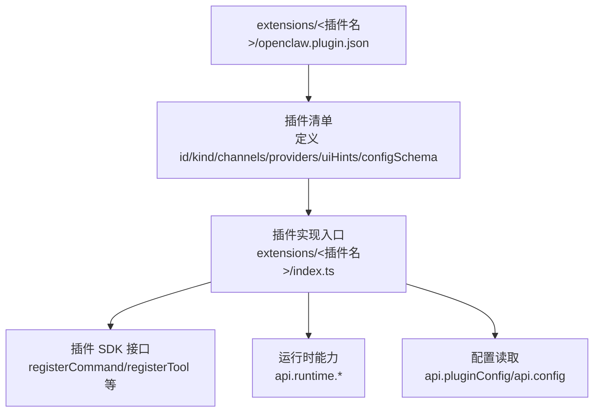
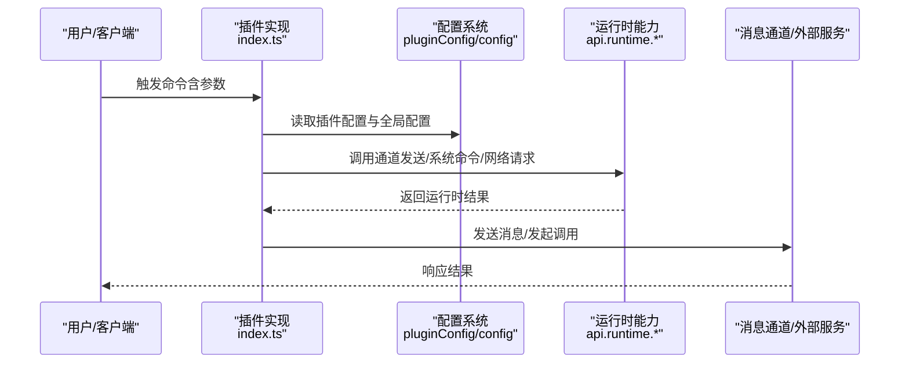
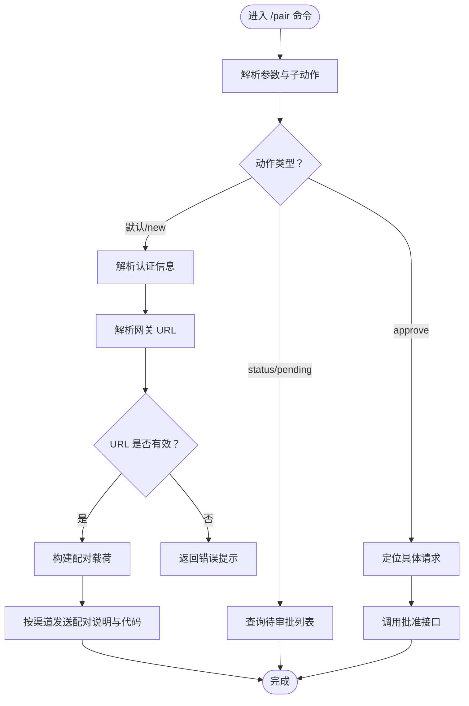
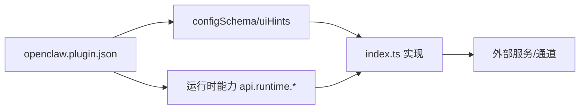

# 插件开发示例

<cite>
**本文引用的文件**
- [extensions/device-pair/openclaw.plugin.json](file://extensions/device-pair/openclaw.plugin.json)
- [extensions/device-pair/index.ts](file://extensions/device-pair/index.ts)
- [extensions/voice-call/openclaw.plugin.json](file://extensions/voice-call/openclaw.plugin.json)
- [extensions/memory-lancedb/openclaw.plugin.json](file://extensions/memory-lancedb/openclaw.plugin.json)
- [extensions/discord/openclaw.plugin.json](file://extensions/discord/openclaw.plugin.json)
- [extensions/telegram/openclaw.plugin.json](file://extensions/telegram/openclaw.plugin.json)
- [extensions/bluebubbles/openclaw.plugin.json](file://extensions/bluebubbles/openclaw.plugin.json)
- [extensions/google-gemini-cli-auth/openclaw.plugin.json](file://extensions/google-gemini-cli-auth/openclaw.plugin.json)
- [extensions/lobster/openclaw.plugin.json](file://extensions/lobster/openclaw.plugin.json)
</cite>

## 目录

1. [引言](#引言)
2. [项目结构](#项目结构)
3. [核心组件](#核心组件)
4. [架构总览](#架构总览)
5. [详细组件分析](#详细组件分析)
6. [依赖关系分析](#依赖关系分析)
7. [性能考虑](#性能考虑)
8. [故障排查指南](#故障排查指南)
9. [结论](#结论)
10. [附录：从零开始创建插件](#附录从零开始创建插件)

## 引言

本指南面向希望在 OpenClaw 平台上开发插件的工程师与技术作者。文档以仓库中现有的插件为范例，系统讲解三类插件的完整实现路径：消息渠道插件（如 Telegram、Discord、BlueBubbles）、AI 工具插件（如 Google Gemini CLI 认证、Lobster 工作流工具）、系统集成插件（如设备配对、语音通话）。我们将深入解析插件清单文件（openclaw.plugin.json）中的配置模式、类型声明与 UI 提示，以及 TypeScript 实现中的注册流程、事件处理、错误处理与运行时交互。同时提供从零开始创建插件的步骤、最佳实践与测试调试建议。

## 项目结构

OpenClaw 的插件生态由“清单文件 + 运行时实现”两部分组成：

- 清单文件（openclaw.plugin.json）定义插件标识、类别（kind）、可用通道（channels）、模型提供商（providers）以及配置校验与 UI 提示。
- 运行时实现（index.ts）通过插件 SDK 注册命令、事件处理器或工具接口，读取配置、调用运行时能力并返回结果。

下图展示了典型插件的文件组织与职责分工：

图表来源

- [extensions/device-pair/openclaw.plugin.json](file://extensions/device-pair/openclaw.plugin.json#L1-L21)
- [extensions/device-pair/index.ts](file://extensions/device-pair/index.ts#L379-L499)

章节来源

- [extensions/device-pair/openclaw.plugin.json](file://extensions/device-pair/openclaw.plugin.json#L1-L21)
- [extensions/device-pair/index.ts](file://extensions/device-pair/index.ts#L379-L499)

## 核心组件

- 插件清单（openclaw.plugin.json）
  - id：插件唯一标识，用于在系统中引用与启用。
  - kind：插件类型，如 memory 表示记忆存储类插件。
  - channels：该插件支持的消息渠道列表。
  - providers：该插件对接的模型/服务提供商列表。
  - uiHints：在控制台或仪表盘中渲染配置表单时的提示与高级选项标记。
  - configSchema：基于 JSON Schema 的配置校验规则，包含必填项、枚举值、正则约束、嵌套对象与范围限制等。
- 插件实现（index.ts）
  - 使用 OpenClawPluginApi 注册命令或工具，读取 api.pluginConfig 与 api.config，访问 api.runtime 能力，进行网络解析、命令行执行、通道消息发送等操作。
  - 对输入参数进行校验与容错，输出结构化文本或富媒体响应。

章节来源

- [extensions/memory-lancedb/openclaw.plugin.json](file://extensions/memory-lancedb/openclaw.plugin.json#L1-L61)
- [extensions/voice-call/openclaw.plugin.json](file://extensions/voice-call/openclaw.plugin.json#L1-L560)
- [extensions/device-pair/index.ts](file://extensions/device-pair/index.ts#L379-L499)

## 架构总览

下图展示了插件在系统中的交互关系：客户端触发命令，插件解析配置与运行时环境，调用通道或外部服务，最终返回结果。

图表来源

- [extensions/device-pair/index.ts](file://extensions/device-pair/index.ts#L379-L499)

## 详细组件分析

### 消息渠道插件：Telegram/Discord/BlueBubbles

这些插件通过 openclaw.plugin.json 声明 channels 列表，表示可直接接入对应消息平台。它们通常以“命令式”实现为主，读取 api.pluginConfig 中的必要参数（如令牌、频道 ID），并通过 api.runtime.channel.<platform>.sendMessageXXX 发送消息或处理事件。

- 配置要点
  - channels 字段声明支持的渠道名称。
  - configSchema 可为空对象，表示无需额外配置；也可按需添加字符串、布尔、枚举等字段。
- 实现要点
  - 在 registerCommand 中解析参数，调用 api.runtime.channel.<platform> 的发送函数。
  - 处理多线程/账号上下文（如 Telegram 的 messageThreadId、accountId）。
  - 统一返回 { text } 结构，便于上层统一渲染。

章节来源

- [extensions/telegram/openclaw.plugin.json](file://extensions/telegram/openclaw.plugin.json#L1-L10)
- [extensions/discord/openclaw.plugin.json](file://extensions/discord/openclaw.plugin.json#L1-L10)
- [extensions/bluebubbles/openclaw.plugin.json](file://extensions/bluebubbles/openclaw.plugin.json#L1-L10)

### AI 工具插件：Google Gemini CLI 认证、Lobster 工作流工具

- Google Gemini CLI 认证
  - 通过 providers 字段声明对接 google-gemini-cli 提供商，配合 CLI 认证流程使用。
  - configSchema 为空对象，表示无额外配置。
- Lobster 工作流工具
  - 提供 name/description 等元信息，configSchema 为空对象，适合以命令形式驱动工作流。

章节来源

- [extensions/google-gemini-cli-auth/openclaw.plugin.json](file://extensions/google-gemini-cli-auth/openclaw.plugin.json#L1-L10)
- [extensions/lobster/openclaw.plugin.json](file://extensions/lobster/openclaw.plugin.json#L1-L11)

### 系统集成插件：设备配对（device-pair）

该插件是系统集成类插件的典型代表，展示了复杂配置解析、运行时能力调用与错误处理的最佳实践。

- 清单与 UI 提示
  - id、name、description 定义插件元信息。
  - uiHints 为 publicUrl 提供标签、占位符与帮助说明。
  - configSchema 仅包含可选的 publicUrl 字符串字段。
- 实现流程
  - 解析网关 URL：优先使用插件配置中的 publicUrl；否则根据 gateway.bind/tailscale/remote/url 等策略推断；若绑定到 loopback 且未显式配置，则报错。
  - 解析认证：支持 token/password 两种模式，优先读取环境变量，其次读取配置。
  - 生成配对码：将网关 URL、认证信息编码为 base64URL，作为“setup code”返回给用户。
  - 命令处理：支持 /pair、/pair status/pending、/pair approve 等子命令；在 Telegram 场景下尝试拆分发送指令与配对码，失败时回退为单条消息。
  - 错误处理：对无效 URL、无可用网关地址、多条待审批请求等情况给出明确提示。

图表来源

- [extensions/device-pair/index.ts](file://extensions/device-pair/index.ts#L379-L499)

章节来源

- [extensions/device-pair/openclaw.plugin.json](file://extensions/device-pair/openclaw.plugin.json#L1-L21)
- [extensions/device-pair/index.ts](file://extensions/device-pair/index.ts#L379-L499)

### 记忆存储插件：memory-lancedb

该插件展示了“kind: memory”的配置与 UI 提示设计，强调嵌套对象、敏感字段与高级选项的声明方式。

- 清单要点
  - kind: memory 明确插件类型。
  - uiHints 为 embedding.apiKey、embedding.model、dbPath、autoCapture、autoRecall 等字段提供标签、占位符、帮助与高级标记。
  - configSchema 定义了嵌套对象 embedding（包含 apiKey、model 枚举）、dbPath、autoCapture/autoRecall 布尔字段，以及必填项要求。
- 实现要点
  - 在 index.ts 中读取 api.pluginConfig.embedding 与 dbPath 等字段，结合 api.runtime 执行向量索引、检索与持久化操作。
  - 对敏感字段（如 API Key）避免日志泄露，必要时使用只读或掩码输出。

章节来源

- [extensions/memory-lancedb/openclaw.plugin.json](file://extensions/memory-lancedb/openclaw.plugin.json#L1-L61)

### 语音通话插件：voice-call

该插件是系统集成与外部服务对接的复杂范例，配置项覆盖提供商选择、号码策略、入站/出站策略、隧道与公网暴露、实时语音（Streaming）与 TTS/STT 集成、超时与并发控制等。

- 清单要点
  - uiHints 涵盖 provider、fromNumber、toNumber、inboundPolicy、allowFrom、greeting、各提供商密钥、端口与路径、Tailscale/ngrok 隧道、Streaming 开关与模型、TTS/STT 提供商与参数、公共 URL、签名验证开关、日志存储、响应模型与提示、超时等。
  - configSchema 采用分层对象结构，包含 provider 枚举、各提供商密钥对象、号码格式校验、策略枚举、时间与数量范围校验、serve/tailscale/tunnel/streaming/stt/tts 等嵌套对象与高级参数。
- 实现要点
  - 读取并校验配置，确保必填项存在且格式正确。
  - 通过 api.runtime.system.runCommandWithTimeout 调用系统命令（如 Tailscale 状态查询）。
  - 依据配置选择提供商（telnyx/twilio/plivo/mock），构造 webhook 端点与媒体流路径。
  - 在入站/出站场景中，结合 allowFrom 白名单与 greeting 文案，实现安全可控的通话接入。
  - 对 Streaming、TTS/STT 参数进行深度定制，满足低延迟与高保真需求。

章节来源

- [extensions/voice-call/openclaw.plugin.json](file://extensions/voice-call/openclaw.plugin.json#L1-L560)

## 依赖关系分析

- 插件与配置
  - openclaw.plugin.json 的 configSchema 与 uiHints 决定前端表单渲染与后端校验。
  - index.ts 通过 api.pluginConfig 读取插件配置，通过 api.config 读取全局配置（如 gateway、bind、tls 等）。
- 插件与运行时
  - 不同渠道插件依赖 api.runtime.channel.<platform> 的消息发送能力。
  - 系统集成插件可能依赖 api.runtime.system 的命令执行能力。
- 插件与外部服务
  - 语音通话插件依赖第三方提供商（Twilio、Telnyx、Plivo）与实时语音/语音合成服务。
  - 记忆存储插件依赖向量数据库与嵌入模型服务。

图表来源

- [extensions/device-pair/openclaw.plugin.json](file://extensions/device-pair/openclaw.plugin.json#L1-L21)
- [extensions/device-pair/index.ts](file://extensions/device-pair/index.ts#L379-L499)

章节来源

- [extensions/device-pair/openclaw.plugin.json](file://extensions/device-pair/openclaw.plugin.json#L1-L21)
- [extensions/device-pair/index.ts](file://extensions/device-pair/index.ts#L379-L499)

## 性能考虑

- 配置解析与缓存
  - 将解析后的网关 URL、认证信息与运行时状态缓存于内存，减少重复计算与系统调用。
- I/O 与超时
  - 对外部服务调用设置合理超时（如 Tailscale 状态查询 5 秒），避免阻塞主线程。
- 并发与限流
  - 语音通话插件中的 maxConcurrentCalls、ringTimeoutMs、transcriptTimeoutMs 等参数用于控制并发与响应节奏。
- 日志与敏感信息
  - 对 API Key、令牌等敏感字段避免直接打印；使用占位符或掩码输出，降低泄露风险。
- 网络暴露与隧道
  - 在本地仅绑定 loopback 时，优先通过 Tailscale 或 ngrok 暴露 webhook；避免硬编码公网地址。

## 故障排查指南

- 设备配对（device-pair）
  - 症状：无法生成网关 URL 或提示“仅绑定到 loopback”。
  - 排查：检查 gateway.bind、gateway.remote.url、plugins.entries.device-pair.config.publicUrl；确认 Tailscale 状态与 MagicDNS 解析；核对环境变量 OPENCLAW_GATEWAY_PORT/CLAWDBOT_GATEWAY_PORT。
  - 症状：Telegram 分屏发送失败。
  - 排查：查看运行时键是否存在（runtime.keys/channel.keys），确认 api.runtime.channel.telegram.sendMessageTelegram 可用性。
- 语音通话（voice-call）
  - 症状：webhook 无法被外网访问。
  - 排查：检查 serve.port/bind/path 与 tailscale/tunnel 配置；确认 ngrok/authToken/domain 设置正确；验证 skipSignatureVerification 与 publicUrl。
  - 症状：实时语音/语音合成异常。
  - 排查：核对 streaming.enabled、sttProvider、openaiApiKey、sttModel、streamPath；检查 TTS 提供商参数（elevenlabs/openai/edge）是否匹配。
- 记忆存储（memory-lancedb）
  - 症状：嵌入模型调用失败。
  - 排查：确认 embedding.apiKey、embedding.model 与 dbPath 权限；检查向量数据库初始化与写入权限。

章节来源

- [extensions/device-pair/index.ts](file://extensions/device-pair/index.ts#L255-L315)
- [extensions/device-pair/index.ts](file://extensions/device-pair/index.ts#L458-L492)
- [extensions/voice-call/openclaw.plugin.json](file://extensions/voice-call/openclaw.plugin.json#L162-L558)
- [extensions/memory-lancedb/openclaw.plugin.json](file://extensions/memory-lancedb/openclaw.plugin.json#L30-L60)

## 结论

通过对现有插件的系统分析，可以总结出以下关键经验：

- 清单文件是插件“可见性”与“可配置性”的基础：清晰的 uiHints 与严格的 configSchema 能显著提升用户体验与稳定性。
- 实现层要重视“输入校验、错误处理、运行时适配与回退策略”，并在复杂场景下提供明确的诊断信息。
- 对接外部服务时，务必关注超时、并发、隧道与签名验证等安全与性能要素。

## 附录：从零开始创建插件

- 步骤一：创建目录与清单
  - 在 extensions/<your-plugin>/ 下创建 openclaw.plugin.json，填写 id、channels/providers/kind、uiHints 与 configSchema。
  - 示例参考：[extensions/telegram/openclaw.plugin.json](file://extensions/telegram/openclaw.plugin.json#L1-L10)、[extensions/memory-lancedb/openclaw.plugin.json](file://extensions/memory-lancedb/openclaw.plugin.json#L1-L61)。
- 步骤二：编写实现入口
  - 创建 extensions/<your-plugin>/index.ts，导入 OpenClawPluginApi，注册命令或工具，读取 api.pluginConfig 与 api.config，调用 api.runtime 能力。
  - 示例参考：[extensions/device-pair/index.ts](file://extensions/device-pair/index.ts#L379-L499)。
- 步骤三：完善配置校验
  - 在 configSchema 中声明必填字段、枚举、正则与范围；在 uiHints 中提供标签、占位符与帮助信息。
- 步骤四：测试与调试
  - 单元测试：针对配置解析与错误分支编写测试用例。
  - 端到端测试：在真实环境中验证命令执行、消息发送与外部服务连通性。
  - 日志：记录关键路径与错误堆栈，避免泄露敏感信息。
- 步骤五：性能优化
  - 合理设置超时与并发上限；缓存解析结果；在 Telegram 等平台使用分步发送以提升用户体验。
- 最佳实践
  - 保持插件职责单一，避免在 index.ts 中引入过多业务逻辑。
  - 对外部服务调用进行幂等与重试设计，增强鲁棒性。
  - 在 configSchema 中尽量使用枚举与范围约束，减少运行时异常。
