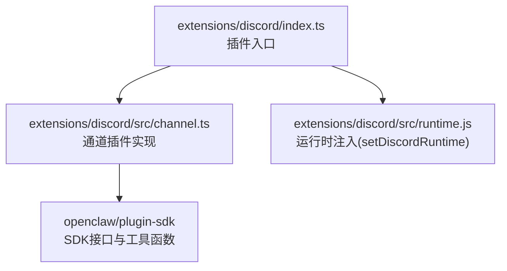
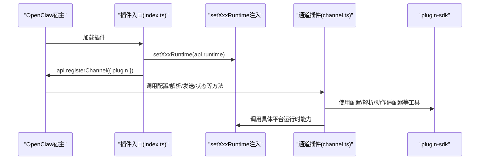
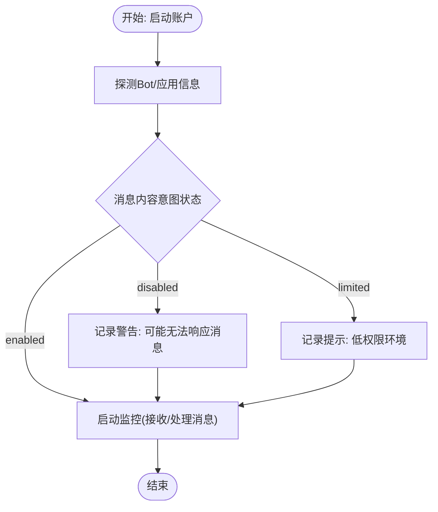
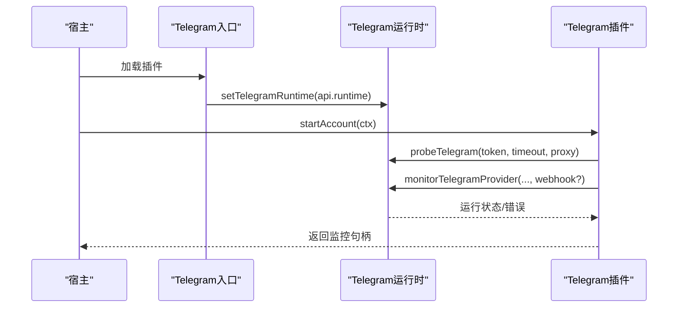
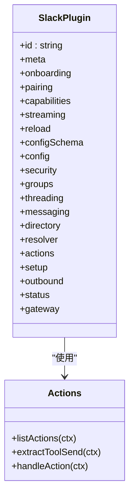
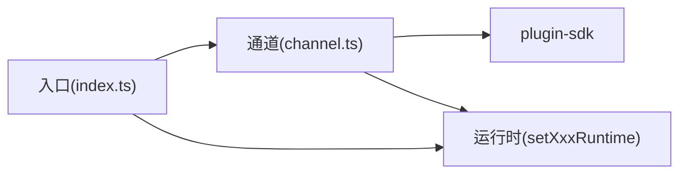

# 消息渠道插件示例

<cite>
**本文引用的文件**
- [extensions/discord/index.ts](file://extensions/discord/index.ts)
- [extensions/discord/src/channel.ts](file://extensions/discord/src/channel.ts)
- [extensions/telegram/index.ts](file://extensions/telegram/index.ts)
- [extensions/telegram/src/channel.ts](file://extensions/telegram/src/channel.ts)
- [extensions/slack/index.ts](file://extensions/slack/index.ts)
- [extensions/slack/src/channel.ts](file://extensions/slack/src/channel.ts)
- [extensions/whatsapp/index.ts](file://extensions/whatsapp/index.ts)
- [extensions/irc/index.ts](file://extensions/irc/index.ts)
</cite>

## 目录

1. [简介](#简介)
2. [项目结构](#项目结构)
3. [核心组件](#核心组件)
4. [架构总览](#架构总览)
5. [详细组件分析](#详细组件分析)
6. [依赖关系分析](#依赖关系分析)
7. [性能考虑](#性能考虑)
8. [故障排查指南](#故障排查指南)
9. [结论](#结论)
10. [附录](#附录)

## 简介

本文件面向开发者，提供在 OpenClaw 中开发“消息渠道插件”的完整示例与实现指导。通过对 Discord、Telegram、Slack、WhatsApp、IRC 等主流消息平台的插件源码进行系统性解析，帮助你理解插件的注册流程、配置模型、消息收发、用户认证与群组管理、状态监控与审计、以及可扩展的动作体系。文档同时给出架构图、序列图与流程图，便于快速上手并进行二次开发。

## 项目结构

OpenClaw 的插件采用“按通道分目录”的组织方式，每个通道插件由一个入口文件负责注册，核心逻辑集中在 src/channel.ts 中，运行时通过 setXxxRuntime 注入到全局运行时上下文。以 Discord 插件为例：

图表来源

- [extensions/discord/index.ts](file://extensions/discord/index.ts#L1-L18)
- [extensions/discord/src/channel.ts](file://extensions/discord/src/channel.ts#L1-L430)

章节来源

- [extensions/discord/index.ts](file://extensions/discord/index.ts#L1-L18)
- [extensions/telegram/index.ts](file://extensions/telegram/index.ts#L1-L18)
- [extensions/slack/index.ts](file://extensions/slack/index.ts#L1-L18)
- [extensions/whatsapp/index.ts](file://extensions/whatsapp/index.ts#L1-L18)
- [extensions/irc/index.ts](file://extensions/irc/index.ts#L1-L18)

## 核心组件

- 插件入口：负责声明插件元数据、导入通道实现与运行时，并调用 api.registerChannel 完成注册。
- 通道插件：实现 ChannelPlugin 接口，定义配置模式、账户管理、安全策略、消息路由、动作适配器、状态与审计、网关启动等。
- 运行时：通过 setXxxRuntime 将具体平台的运行时能力注入到插件中，如消息发送、探测、权限审计、目录查询等。
- SDK 工具：提供构建配置模式、账户解析、目标解析、消息动作适配器、状态汇总与审计等通用能力。

章节来源

- [extensions/discord/src/channel.ts](file://extensions/discord/src/channel.ts#L47-L430)
- [extensions/telegram/src/channel.ts](file://extensions/telegram/src/channel.ts#L70-L489)
- [extensions/slack/src/channel.ts](file://extensions/slack/src/channel.ts#L54-L605)

## 架构总览

下图展示了插件从注册到运行的关键交互：

图表来源

- [extensions/discord/index.ts](file://extensions/discord/index.ts#L11-L14)
- [extensions/discord/src/channel.ts](file://extensions/discord/src/channel.ts#L31-L430)
- [extensions/telegram/index.ts](file://extensions/telegram/index.ts#L11-L14)
- [extensions/telegram/src/channel.ts](file://extensions/telegram/src/channel.ts#L30-L489)
- [extensions/slack/index.ts](file://extensions/slack/index.ts#L11-L14)
- [extensions/slack/src/channel.ts](file://extensions/slack/src/channel.ts#L33-L605)

## 详细组件分析

### Discord 插件

- 注册与运行时注入：入口文件导入运行时设置与通道实现，完成注册。
- 通道插件能力：
  - 配置：构建 DiscordConfigSchema，支持多账户、启用/禁用、令牌来源等。
  - 安全：支持 DM 策略、群组策略、提及要求、允许来源规范化。
  - 目录：列出用户与群组，支持实时查询。
  - 消息：支持文本、媒体、投票；线程回复模式可配置；消息动作适配器可扩展。
  - 状态与审计：探测应用与机器人信息、检查频道权限、构建快照。
  - 网关：启动 Provider，探测意图状态（消息内容权限）并监控。

图表来源

- [extensions/discord/src/channel.ts](file://extensions/discord/src/channel.ts#L384-L427)

章节来源

- [extensions/discord/index.ts](file://extensions/discord/index.ts#L1-L18)
- [extensions/discord/src/channel.ts](file://extensions/discord/src/channel.ts#L47-L430)

### Telegram 插件

- 注册与运行时注入：同 Discord。
- 通道插件能力：
  - 配置：支持 botToken/tokenFile/useEnv；多账户；启用/删除账户。
  - 安全：DM 策略、群组策略、允许来源规范化；收集策略风险提示。
  - 目录：列出用户与群组，支持本地与实时查询。
  - 消息：文本/媒体发送，支持回复与线程；Markdown 分块；线程回复模式默认“首次”。
  - 状态与审计：探测 Bot 信息、检查未提及群组、构建快照。
  - 网关：支持 webhook/polling 模式，启动 Provider 并记录模式。

图表来源

- [extensions/telegram/index.ts](file://extensions/telegram/index.ts#L11-L14)
- [extensions/telegram/src/channel.ts](file://extensions/telegram/src/channel.ts#L386-L418)

章节来源

- [extensions/telegram/index.ts](file://extensions/telegram/index.ts#L1-L18)
- [extensions/telegram/src/channel.ts](file://extensions/telegram/src/channel.ts#L70-L489)

### Slack 插件

- 注册与运行时注入：同上。
- 通道插件能力：
  - 配置：支持 botToken/appToken/userToken；多账户；读写令牌选择策略。
  - 安全：DM 策略、群组策略、允许来源；收集策略风险提示。
  - 目录：列出用户与群组，支持实时查询。
  - 解析：支持用户与群组目标解析，区分只读/可写场景。
  - 动作：统一的动作列表与处理器，覆盖发送、反应、消息读取/编辑/删除、钉住/取消、成员信息、表情列表等。
  - 消息：文本/媒体发送，支持线程回复模式与工具上下文。
  - 状态与审计：探测 Bot 信息、构建快照。
  - 网关：启动 Provider，支持斜杠命令开关。

图表来源

- [extensions/slack/src/channel.ts](file://extensions/slack/src/channel.ts#L54-L605)

章节来源

- [extensions/slack/index.ts](file://extensions/slack/index.ts#L1-L18)
- [extensions/slack/src/channel.ts](file://extensions/slack/src/channel.ts#L54-L605)

### WhatsApp 插件

- 注册与运行时注入：遵循相同模式。
- 通道插件能力概览（基于入口文件）：
  - 配置：空配置模式，支持多账户。
  - 运行时：setWhatsAppRuntime 注入。
  - 注册：api.registerChannel 注册通道插件。

章节来源

- [extensions/whatsapp/index.ts](file://extensions/whatsapp/index.ts#L1-L18)

### IRC 插件

- 注册与运行时注入：遵循相同模式。
- 通道插件能力概览（基于入口文件）：
  - 配置：空配置模式，支持多账户。
  - 运行时：setIrcRuntime 注入。
  - 注册：api.registerChannel 注册通道插件。

章节来源

- [extensions/irc/index.ts](file://extensions/irc/index.ts#L1-L18)

## 依赖关系分析

- 插件入口对通道实现与运行时的依赖是单向的，确保解耦与可替换性。
- 通道插件依赖 SDK 提供的配置模式、账户解析、目标解析、动作适配器、状态与审计工具。
- 运行时通过 setXxxRuntime 注入，通道插件仅通过 getXxxRuntime 调用具体能力，避免直接依赖第三方 SDK。

图表来源

- [extensions/discord/index.ts](file://extensions/discord/index.ts#L1-L18)
- [extensions/discord/src/channel.ts](file://extensions/discord/src/channel.ts#L29)
- [extensions/telegram/index.ts](file://extensions/telegram/index.ts#L1-L18)
- [extensions/telegram/src/channel.ts](file://extensions/telegram/src/channel.ts#L30)
- [extensions/slack/index.ts](file://extensions/slack/index.ts#L1-L18)
- [extensions/slack/src/channel.ts](file://extensions/slack/src/channel.ts#L33)

章节来源

- [extensions/discord/src/channel.ts](file://extensions/discord/src/channel.ts#L29)
- [extensions/telegram/src/channel.ts](file://extensions/telegram/src/channel.ts#L30)
- [extensions/slack/src/channel.ts](file://extensions/slack/src/channel.ts#L33)

## 性能考虑

- 文本分块与流式合并：
  - Discord 默认块合并参数为最小字符数与空闲时间阈值，适合长文本输出。
  - Telegram 使用 Markdown 分块器，限制更宽松，适合富文本消息。
- 发送模式：所有通道均采用直连发送（deliveryMode: "direct"），减少中间层开销。
- 媒体大小限制：各通道在配置中提供媒体大小上限，避免超大文件传输导致阻塞。
- 线程与回复：合理设置回复模式与线程 ID，减少无关消息噪声。

章节来源

- [extensions/discord/src/channel.ts](file://extensions/discord/src/channel.ts#L71-L74)
- [extensions/telegram/src/channel.ts](file://extensions/telegram/src/channel.ts#L271-L275)
- [extensions/slack/src/channel.ts](file://extensions/slack/src/channel.ts#L509-L513)

## 故障排查指南

- 配置校验：
  - 缺少令牌或令牌来源不正确会导致“未配置”状态。请检查默认账户与命名账户的令牌设置。
- 安全策略：
  - 若 DM 策略为“开放”，且未配置允许来源/群组白名单，可能被标记为高风险。建议改为“允许清单”并明确 allowFrom 或 groups。
- 权限与审计：
  - Discord：若消息内容意图关闭，可能导致无法响应消息内容。需在开发者门户开启或改为需要提及。
  - Telegram：未提及群组存在时会触发审计报告，需确认群组权限与配置。
- 状态与日志：
  - 使用状态摘要与探针结果定位问题；在详细日志模式下查看运行时调试信息。
- 登出清理：
  - Telegram 支持登出账户并清理配置中的令牌字段，便于重新配置。

章节来源

- [extensions/discord/src/channel.ts](file://extensions/discord/src/channel.ts#L113-L149)
- [extensions/discord/src/channel.ts](file://extensions/discord/src/channel.ts#L331-L360)
- [extensions/telegram/src/channel.ts](file://extensions/telegram/src/channel.ts#L142-L175)
- [extensions/telegram/src/channel.ts](file://extensions/telegram/src/channel.ts#L328-L356)
- [extensions/telegram/src/channel.ts](file://extensions/telegram/src/channel.ts#L419-L486)

## 结论

通过以上对 Discord、Telegram、Slack、WhatsApp、IRC 插件的解析，你可以清晰地看到 OpenClaw 消息渠道插件的统一架构与扩展点。遵循“入口注册 + 通道实现 + 运行时注入 + SDK 工具”的模式，即可快速开发新的消息渠道插件。建议在实现中重点关注配置模型、安全策略、消息动作适配器与状态审计，以获得更好的稳定性与可观测性。

## 附录

- 开发步骤建议：
  - 在 extensions/<channel>/ 下创建目录与入口文件。
  - 实现 src/channel.ts，定义 ChannelPlugin 接口各子模块。
  - 在入口中调用 set<Channel>Runtime 注入运行时，再注册通道。
  - 使用 SDK 工具函数构建配置模式、解析账户与目标、实现动作适配器。
  - 编写单元测试与集成测试，覆盖配置、发送、错误与边界场景。
- 测试策略与调试技巧：
  - 单元测试：针对配置解析、目标解析、动作提取与处理进行断言。
  - 集成测试：模拟真实运行时，验证发送、接收、权限审计与状态快照。
  - 调试：开启详细日志，结合状态摘要与探针结果定位问题；必要时使用抓包工具观察第三方 API 请求。
